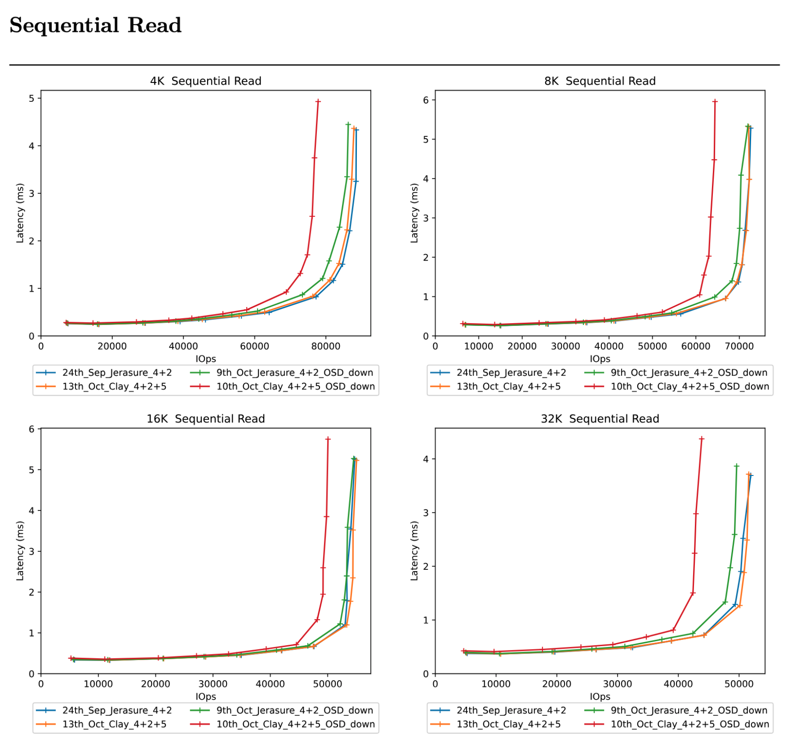

## Outline of the Blog Series  

- **Part 1** - How to start a Ceph cluster for a performance benchmark with CBT  
- **Part 2** - Defining YAML contents  
- **Part 3** - How to start a CBT run - Things to consider when evaluating performance  
- **Part 4** - How to integrate CBT with Teuthology  

---

## Introduction: What is CBT (Ceph Benchmarking Tool)?  

[CBT](https://github.com/ceph/cbt) can be used to standardise the performance evaluation process by:  

- Simplifying the cluster creation process and having CBT do it  
- Running a deterministic suite of tests with response curves (throughput vs latency) with a wide variety of workloads  
- Tooling to performance reports and comparison reports, ability to compare two or more (up to 6) response curve runs and identify differences in performance within the response curve  

Here is an example of what a CBT comparison report would look like: (this will all be explained in more detail later, in **part 3**)



The objective of this blog is to demonstrate how CBT (Ceph Benchmarking Tool) can be used to run tests for Ceph in a deterministic manner.  

The goal of this 4 part blog is to demonstrate how to set up a Ceph cluster for use with CBT to make your life simpler by automating a lot of the manual effort that is required to set up a performance test.  

For a real life example, this blog will try and answer the quesiton "Does using the CLAY erasure code plugin give better performance than using the default JErasure plugin?" showing how CBT can be used to conduct a set of experiments and produce reports to answer this question.

I hope you find this tutorial simple to understand and you will get to learn the benefits of using CBT to make your performance benchmarking a whole lot easier.  

---

## What do we have to consider when we are benchmarking storage systems?  

There are several aspects to consider when evaluating performance, the main aspect to consider is what is the goal of measuring performance, this may be:  

- Regression testing a fix to see if performance has degraded or improved  
- Regressing testing a build to see if other contributors have degraded performance  
- Comparing a feature  
- Comparing the effect of scale-up (adding more OSDs to a node) or scale-out (adding more nodes)  
- Comparing the performance of one pool type over another  
- The effect of additional network bandwidth  
- The effect of upgrading CPU in a Ceph Node  

**Therefore you need to consider:**

- The results generated must be compared against a like-for-like system with the test repeated in the same way as the original results.  
  - This includes the **same** cpu, number of OSDs, drive type, number of RBD volumes, Ceph nodes, ethernet port/type.  
  - Even client attach is important.  
  - Two seamlessly like-for-like systems could produce varying performance results because one drive could have a different generation of Flash memory within it.  
  - So Ideally, to get like for like comparisons, tests need to be run on the same system.  

- The system must be prefilled (if applicable, perhaps not so important for Object/RGW evaluation) and preconditioned in the same way.  
  - Pre-filling involves filling the volume or pool with sequential writes and pre-conditioning is adding random writes to simulate real world testing - since most production systems will have been running for many months/years.  
  - A storage system that is almost empty will perform very differently from one that has a lot of data on it due to metadata access, garbage collection, fragmentation etc.  

- Same workload amount, e.g. 1M, 4k, 8k, 64k etc. And this has to be with the same sequential/random method.  

- There is always going to be some element of variance in the results, even if everything is done like for like.  
This could be down to something as minimal as workload ordering, this can have an effect on performance of later workloads. For example, if you sequentially write then read, that will have significantly better performance than if you were to randomly write then sequentially read.
  - So if the test results in a pass, fail, you need to allow for variance, typically 10% is probably acceptable if you are just looking at the average performance during the duration of the time.  
  - The shorter the run time, the greater the degree of variance.  
  - Also to help minimise variance it’s important to pick an appropriate run time for each test, 5 minutes is usually a good amount.  

- Turning off the balancer, scrub, deep scrub, autoscaler will help with reducing variance as the performance run will just be measuring client performance and not measuring any of the background processes in Ceph that can affect performance such as backfill, pg splitting/merging, and scrubbing.  

---

## What is the objective of evaluating performance?  

The objective of evaluating performance should be to obtain accurate benchmarks for different ceph clusters with varying configurations.  

If the same performance test is repeated on the same system we want to be able to measure the same results (or with as little variance between runs as possible). This predictability is important if we are going to try and compare different configurations to see which is better.

Ideally we also want to be able to come back and run the same test 6 months later, on the same system, and get the same results. This is harder because things can change over time. Ideally, if someone configures an equivalent system to the one the performance test was run on we would like to get the same results.
If done correctly, the amount of manual effort needed to regression test performance will be significantly reduced. 

Creating results that can be shared within the community and compared to others would be ideal. This can lead to findings and optimisations to be made within the way data is stored, for example reading or writing data with specific configurations for different purposes. As well as experimenting and accurately understanding the flaws and benefits of different plugins, volume sizes, OSD configurations, etc.  

Ultimately, we would like the community to use CBT and start sharing the performance data generated by CBT, this will enable simpler client sizing of Ceph systems for all by using pre-generated sizing data.  

---

## Starting up a ceph cluster for a performance run  

For these blogs we will be focusing on using `Cephadm` to start our ceph clusters, though `vstart` or by hand are also feasible options.  

This section will describe the basic steps to get a ceph cluster up and running, ready to start a performance run.  

---
<details>
<summary>Step 1: Setup</summary>

We will want to ssh into our machine that we will be using.  

**My system has the following setup:**  

- 6 Sata Drive SSD’s 210GB  
- ceph version `20.3.0-2198-gb0ae68b0 (b0ae68b0ccceed5a913d81c5a8cb0b4e9c5a5f6b)` tentacle (dev)  
- OS: Red Hat Enterprise Linux 9.6 (Plow)  
</details>

---
<details>
<summary>Step 2: Clean up</summary>

When we create a cluster using cephadm and run a CBT test, log files will be created in specified locations.  

So if you have done a test before and know there will be old log files at a specific location, begin by deleting them, if you have never done a CBT run before, you can move onto `Step 3: Building a container`.  

Now I will remove a previous cluster that I had running, so that I am starting from a clean slate.  

There are 2 areas you will have to delete to complete this step:  

1. Wherever the `tmp_dir` line within your yaml file points to:  

   ```yaml
   tmp_dir: "/tmp/cbt"
   ```
2. The -a argument when you run a performance run: 

   ```bash
   -a /tmp/cbt
   ```
As you can see, both my YAML and argument point to the same directory, so before my CBT run I will always make sure to:

   ```bash
   rm -rf /tmp/cbt/*
   ```
</details>

---
<details>
<summary>Step 3: Building a container</summary>

Next we will have to get a build container that we are going to use to construct our ceph cluster. You can obtain this container id from [Builds ceph](https://shaman.ceph.com/builds/ceph). Click on your desired build and then copy the **sha1**, this is also known as the **container id**. The build I’m using can be seen within the `Step 1: Setup` section previously. 

- We will now pull down the desired build container using podman 

<details>
<summary>Click to see details</summary>

  ```bash
  podman pull quay.ceph.io/ceph-ci/ceph:<sha1>
  ```
  Make sure to paste your specific **sha1** into the above command!
</details>
</details>

---
<details>
<summary>Step 4: Creating a cluster</summary>

Now we will run a script to remove the volume groups:

<details>
<summary>Click here to see script</summary>

```bash
for i in /dev/ceph*
do
lvremove -y $i
done
```

</details>

Next, use cephadm with your container id you previously pulled down, to create your ceph cluster, like so:

```bash
cephadm --image quay.ceph.io/ceph-ci/ceph:<sha1> bootstrap --single-host-defaults --log-to-file --mon-ip <ip_of_node> --allow-mismatched-release
```
Of course replace `sha1` and `ip_of_node` with your corresponding values. We are specifying the container image, using `bootstrap` to initialise a new Ceph cluster. `--single-host-defaults` is optimising the bootstrap for a single node. `--log-to-file` makes Ceph daemons log to files on disk. `--mon-ip` tells what IP address to bind the first monitor to. `--allow-mismatched-release` lets you bootstrap with an image that does not match the cephadm version of the host.

It is also common in performance benchmarking to reset the system into a known state prior to starting any benchmarks because factors such as fragmentation of stored data can affect results. Therefore it is advisable to delete and recreate the cluster between every run.
</details>

---
<details>
<summary>Step 5: Configure cluster</summary>
Now we have a basic cluster setup, we can view our cluster to make sure it is up and running:

- `ceph orch device ls` to check all the OSDs you need are available
- If not available, you have to use `ceph orch zap device <osd>` to make them available. A script like this will solve the OSD unavailability problem:
<details>
<summary>Click to see zap OSD script</summary>

  ```bash
  #! /bin/bash
  file=/tmp/$$.out
  out=/tmp/$$b.out
  cephadm shell ceph orch device ls 2>&1 | grep ssd >$file

  cat $file | while read -a line_array; do

  host=${line_array[0]}
  device=${line_array[1]}

  echo ceph orch device zap ${host} ${device} --force >>$out
  done

  echo exit >>$out

  cephadm shell <$out

  rm -f $file
  rm -f $out
  ```
</details>

- Next, we will create our Erasure Coding (EC) setup. This script can be customised however you’d like your EC setup to be, I will provide a simple example version of mine here:

<details>
<summary>Click to see details</summary>

  ```bash
  ceph osd erasure-code-profile set reedsol plugin=isa k=4 m=2 technique=reed_sol_van stripe_unit=4K crush-failure-domain=osd
  ceph osd pool create rbd_erasure 64 64 erasure reedsol
  ceph osd pool create rbd_replicated 64 64 replicated
  ceph osd pool set rbd_erasure allow_ec_overwrites true
  ceph osd pool set rbd_erasure allow_ec_optimizations true
  rbd pool init rbd_erasure
  rbd pool init rbd_replicated
  rbd create –pool rbd_replicated –data-pool rbd_erasure –size 10G test-image
  ```
</details>

So the above is an example of a similar script to what I run. It defines a 4 + 2 EC profile named **reedsol**. An EC profile is essentially a template that defines how Ceph should encode and store data using EC. We create two pools (**rbd_erasure** & **rbd_replicated**), enable EC overwrites and EC optimisations, then initialise pools and create an RBD image backed by the EC pool.

Within creating the EC setup you will be:
- Defining the amount of data OSDs (k) and parity OSDs (m)
- Defining the size of your drives
- Defining the percentage of prefill
- Defining the number of volumes
- Defining the volume size 
- Defining the EC profile, specifying the plugin, technique, stripe width etc
- Creating your EC pool

My EC (Erasure Coding) setup is as follows:
- 4 + 2 setup (k=4, m=2)
- 210gb drive size
- 50% prefill
- 8 volumes
- 52.5gb volume size 
- Single EC pool
- Chunk size = 4K

Now we have set up and configured an erasure coded ceph cluster!
</details>

---

Now move onto part 2 of the blog if you so wish, where you can take a look at defining a YAML file that will outline the workloads (tests) that you will be running on your ceph cluster!