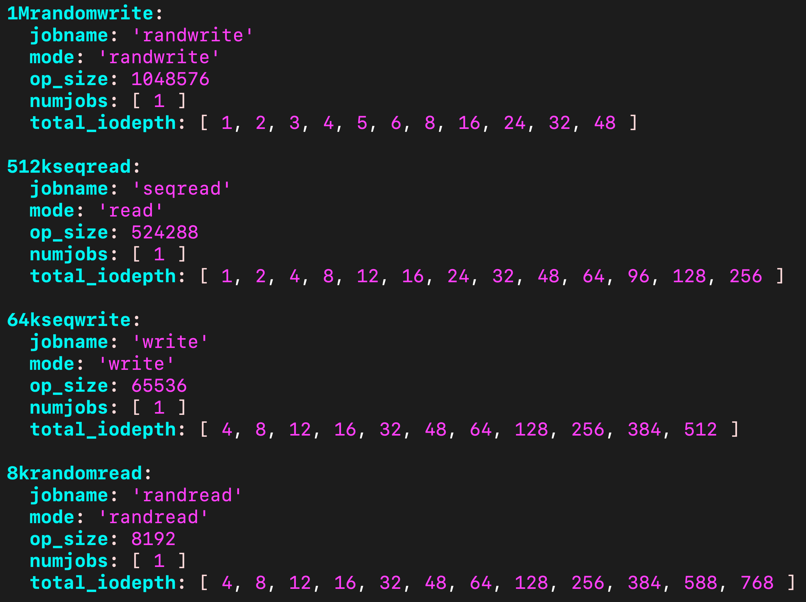

## Outline of the Blog Series  

- **Part 1** - How to start a Ceph cluster for a performance benchmark with CBT  
- **Part 2** - Defining YAML contents  
- **Part 3** - How to start a CBT run - Things to consider when evaluating performance  
- **Part 4** - How to integrate CBT with Teuthology  

---
An example of contents from a YAML file:


## Introduction: What goes into the YAML file?  

Once you have finished `Part 1 (How to start a Ceph cluster for a performance benchmark with CBT)` you should have an erasure coded Ceph cluster setup now, and you're nearly ready to run a CBT test on it! However, before we can do that, we need to understand what **YAML contents** we want.  

The YAML file defines what tests we will run on the cluster.  

---

## Key sections of the YAML file:  

<details>
<summary>Benchmark module</summary> 

In our example, we will be using **librbdfio**.  

Example:

```yaml
benchmarks:
  librbdfio:
    rbdname: "cbt-librbdfio"
    <insert details here>
```
</details>

---

<details>
<summary>Length of run</summary> 

We configure a **ramp** and a **time** for each test:  

- **Ramp** → warmup period where no data is collected.  
- **Time** → duration for which each test will run and collect results.  

The `ramp` time ensures that the I/O test gets into a steady state before the I/O measurement starts, it is quite common that **write** caches give unrealistically high performance at the start of the test while the cache fills up and that **read** caches give slightly lower performance at the start of the test while they are filled. Caches may be implemented in the drives or in the software.

A very short `duration` test will get performance measurements quicker but might not reflect the performance you will see in real use. Reasons for this include background processes that periodically perform work to clean up and issues such as fragmentation that typically become worse the longer the test is run for.
If doing a performance run multiple times gives different results then it is possible that the test duration is too short.

- It's important to note that the specified amount of time and ramp within librbdfio will apply to all workloads elsewhere specified in the YAML.
- **However**, these can be overridden by specifying a time or ramp within a specific workload. You will see an example of this within the precondition section, where time is overridden to 600 (10 minutes).

Example: 

```yaml
  librbdfio:
    time: 90 #in seconds
    ramp: 30 #in seconds
```
</details>

---

<details>
<summary>Volume size</summary>

Storage systems may give different performance depending how full they are, where there are fixed sized caches the cache hit ratio will be higher when testing a smaller quantity of storage, dealing with fragmentation and garbage colleciton takes more time when there is less free capacity.
Ideally configure the performance test to use over 50% of the physical storage to get measurements representative of real world use.

- Ideally, this should match the volume size created in **Part 1** when setting up the EC profile.  
- If this value is lower than the RBD image size, then only that amount of data specified will be written.  
- If the value is grater, then only the amount of data equivalent to the RBD image size will be written.

Example:

```yaml
  librbdfio:
    vol_size: 52500 #in megabytes
```
</details>

---

<details>
<summary>Number of volumes</summary>

This is the same number of volumes you defined in **Part 1**.  

Example:
```yaml
  librbdfio:
    volumes_per_client: [8]
```
</details>

---

<details>
<summary>Prefill & Precondition </summary> 

- **Prefill** → filling all volumes with sequential writes.  
- **Precondition** → adding random writes to simulate real-world workloads.

Example:

```yaml
  librbdfio:
    prefill:
      blocksize: '64k'
      numjobs: 1

    workloads:
      precondition:
        jobname: 'precond1rw'
        mode: 'randwrite'
        time: 600
        op_size: 65536
        numjobs: [ 1 ]
        total_iodepth: [ 16 ]
        monitor: False
```

- Note here that the time here is overriding the time specified in the librbdfio (global) section of the YAML. Not specifying a time will use the default value spceified in the outer (librbdfio) section.
</details>  

---

<details>
<summary>Workloads</summary>

Example:  

```yaml
librbdfio:
  workloads:
    Seq32kwrite:
      jobname: 'seqwrite'
      mode: 'write'
      op_size: 32768
      numjobs: [ 1 ]
      total_iodepth: [ 2, 4, 8, 16, 32, 64, 128, 256, 512, 768 ]
```
The above is an example of a 32k sequential write, we configure different levels of total_iodepth.
</details>

---

## Expressing queue depth

Firstly, what is **queue depth**?

Queue depth can be defined as the number of concurrent commands that are outstanding.

There are two ways of expressing the queue depth per volume in CBT:
1. Using the `iodepth` attribute
2. Using the `total_iodepth` attribute

**iodepth** will use a `queue depth` of **n** per volume lets say. For example, if the number of configured volumes is 8. Then a setting of `iodepth` 2, means the `total_iodepth` on the system will be 16 (as 8*2). And the `queue depth` for each volume is 2. Therefore if we want to scale up the `queue depth`, we have to increase it by the number of volumes. 

**total_iodepth** however, will use that `queue depth` across all volumes. For example, if `total_iodepth` is set to 16 and the number of configured volumes is 8, then the `queue depth` per volume will be 2 (16/8). 

### The main drawback of iodepth over total_iodepth:

Example: If you have a large number of volumes eg. 32. If you specified:
```yaml
  iodepth: [1, 2, 4, 8]
```
All 32 volumes will be exercised, and therefore this is equivalent to writing a YAML that does:
```yaml
total_iodepth: [32, 64, 128, 256]
```
As you can see, your control over the queue depth scales according to the number of volumes you have configured in the YAML.

Now with `total_iodepth`, you can go finer grain than this, like so:
```yaml
total_iodepth: [1, 2, 4, 8, 16, 32]
```

CBT will only use a subset of the volumes if the `total_iodepth` configured is less than the `total_iodepth` in the YAML and where the number of volumes configured does not divide into `total_iodepth` evenly. This means some volumes will have a different `queue depth` than others, but CBT will try to start FIO with an iodepth that is as even as possible over the volumes.

A good way to look at the relationship between these terms if you're struggling, is:

`total_iodepth = volumes x queue depth`

---

## Why do we have lots of different IO values in the yaml?

We have lots of different levels of IOs for our writes and reads within the yaml because we want to get test results for all the different scenarios that happen in the real world. Also to test the different bottlenecks that could be holding back the ceph cluster. Different scenarios could include a bank returning a single customer's payment to them, this would be a `random read`. On the other hand netflix streaming involves `sequential reading` of data and displaying that. 
- In terms of bottlenecks:
   - **Short IOs** will usually have a CPU bottleneck (this is why the x axis is IOPs for small IOs)
   - **Larger IOs** are more likely to suffer from network and device storage bottlenecks (this is why the x axis turns to Bandwidth for the larger IO sizes)

---
Here is an example of a full YAML file, containing the components mentioned above:

<details>
<summary>Example YAML file</summary> 

Here is an example of a YAML file, you can have a lot more workloads than this of course, I just have a few for simplicity purposes.

```yaml
cluster:

  user: #specify user here 
  head: #specify head here
  clients: #specify clients here
  osds: #specify OSDs here
  mons:
    #specify mons here
  mgrs:
    #specify mgrs here
  osds_per_node: 8
  fs: 'xfs'
  mkfs_opts: '-f -i size=2048'
  mount_opts: '-o inode64,noatime,logbsize=256k'
  conf_file: '/cbt/ceph.conf.4x1x1.fs'
  iterations: 1
  use_existing: True
  clusterid: "ceph"
  tmp_dir: "/tmp/cbt"
  ceph-osd_cmd: "/usr/bin/ceph-osd"
  ceph-mon_cmd: "/usr/bin/ceph-mon"
  ceph-run_cmd: "/usr/bin/ceph-run"
  rados_cmd: "/usr/bin/rados"
  ceph_cmd: "/usr/bin/ceph"
  rbd_cmd: "/usr/bin/rbd"
  ceph-mgr_cmd: "/usr/bin/ceph-mgr"
  pdsh_ssh_args: "-a -x -l%u %h"

monitoring_profiles:
  collectl:
     args: '-c 18 -sCD -i 10 -P -oz -F0 --rawtoo --sep ";" -f {collectl_dir}'

benchmarks:
  librbdfio:
    time: 90
    ramp: 30
    time_based: True
    norandommap: True
    vol_size: 52500
    use_existing_volumes: True
    procs_per_volume: [1]
    volumes_per_client: [16]
    osd_ra: [4096]
    cmd_path: '/usr/local/bin/fio'
    create_report: True
    wait_pgautoscaler_timeout: 20
    poolname: 'rbd_replicated'
    log_iops: True
    log_bw:  True
    log_lat: True
    fio_out_format: 'json'
    log_avg_msec: 100
    rbdname: "cbt-librbdfio"
    poolname: "rbd_replicated"
    prefill:
      blocksize: '64k'
      numjobs: 1

    workloads:
      precondition:
        jobname: 'precond1rw'
        mode: 'randwrite'
        time: 600
        op_size: 65536
        numjobs: [ 1 ]
        total_iodepth: [ 16 ]
        monitor: False 

      seq32kwrite:
        jobname: 'seqwrite'
        mode: 'write'
        op_size: 32768
        numjobs: [ 1 ]
        total_iodepth: [ 2, 4, 8, 16, 32, 64, 128, 256, 512, 768 ]
      4krandomread:
        jobname: 'randread'
        mode: 'randread'
        op_size: 4096
        numjobs: [ 1 ]
        total_iodepth: [ 4, 8, 12, 16, 32, 48, 64, 128, 256, 384, 588, 768 ]
```
</details>
