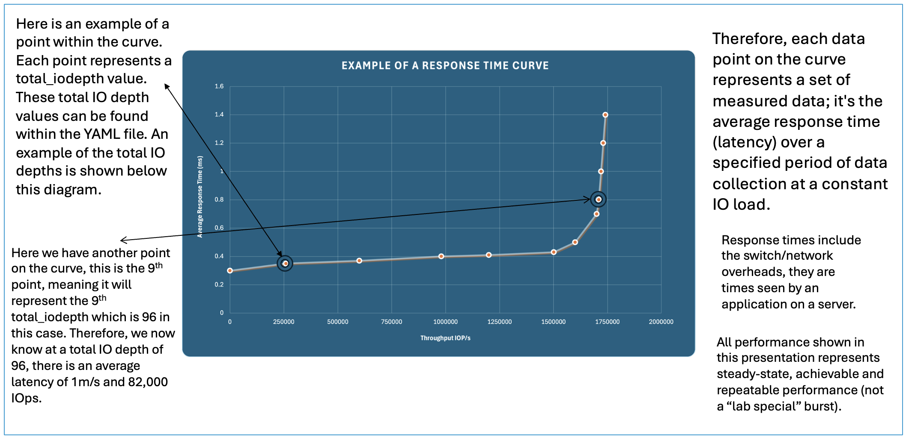
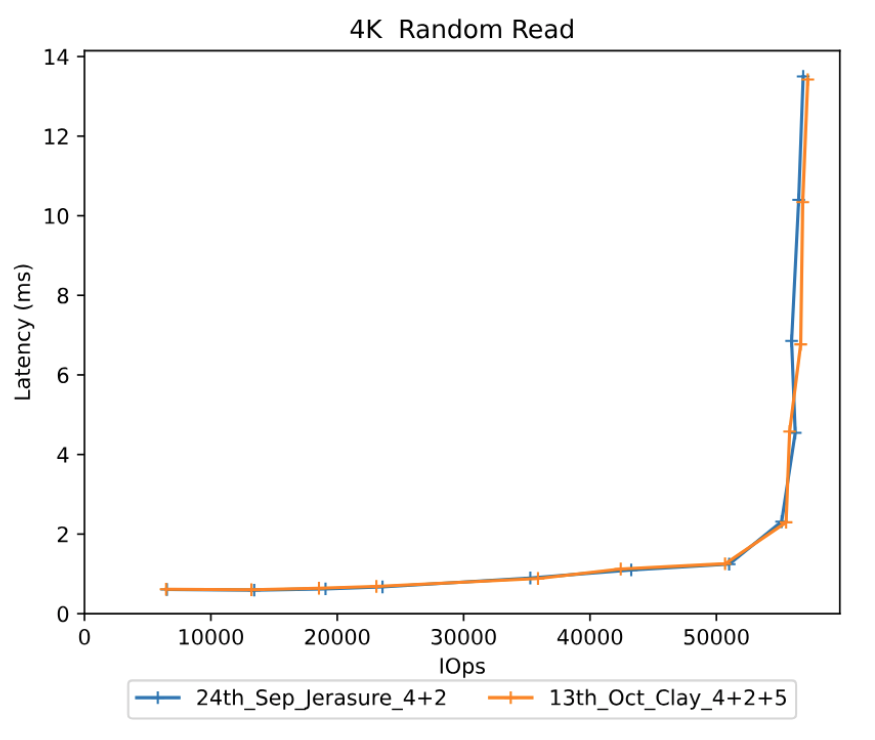

CBT Performance Benchmarking - Part 3. How do we run and analyse a performance test?

## <a id="outline"></a>Outline of the Blog Series  

- [**Part 1**](https://ceph.io/en/news/blog/2025/cbt-performance-benchmarking-part1/) - How to start a Ceph cluster for a performance benchmark with CBT  
- [**Part 2**](https://ceph.io/en/news/blog/2025/cbt-performance-benchmarking-part2/) - Defining YAML contents  
- **Part 3** - How to start a CBT performance benchmark 

---

Contents:
- [Introduction: Running a performance benchmark](#intro)
- [How to read response time curves](#read)
- [What values to read from a response curve?](#values)
- [Summary](#summary)
- [Conclusion](#conclusion)

---

## <a id="intro"></a>Introduction  

Now that we have created our erasure coded (EC) cluster (from [**Part 1**](https://ceph.io/en/news/blog/2025/cbt-performance-benchmarking-part1/)) and defined our YAML file and workloads (from [**Part 2**](https://ceph.io/en/news/blog/2025/cbt-performance-benchmarking-part2/)), we can now start a CBT performance benchmark test.

This part will cover:  

1. Running a performance test  
2. Generating a performance report
3. How to read response time curves
4. Comparing performance benchmarks 
5. Running a performance test with an OSD down

---

<details>
<summary>Step 1: Run the performance test</summary>

First, clone the [CBT GitHub repository](https://github.com/ceph/cbt) into a directory of your choice on the machine you are using and `cd` into it.

This is an example of the command to run a CBT performance test:

```bash
  python /cbt/cbt.py -a /tmp/cbt -c /example/ceph.conf /example/<yaml_file> 2>&1 | tee /tmp/cbt.out
```

You will specify the location of your cbt file (`cbt.py`). Provide an archive folder where your results will be generated (`/tmp/cbt`). Provide a config folder (`/example/ceph.conf`) to allow CBT to connect with the cluster. Finally, we specify our (`yaml_file`) which will outline what tests/workloads will be running.

</details>

---

<details>
<summary>Step 2: Generate a performance report</summary>

Once you have ran the performance test by following **Pat 1** your result files will be outputed at the location you specified them to go in **Step 1** after the archive argument (`-a`). For me, the previous command referenced `/tmp/cbt`, so my results are there. 

- You can now copy these result files to a new directory if you wish. I would like them to be within `/perftests/my_test` in this case, I do so because I like to keep a directory of all my CBT test results, and I delete `/tmp/cbt` before each performance test, so that is not a suitable place to keep them stored. So I would do this for example:

```bash
cp -r /tmp/cbt/* /perftests/my_test
```

- Next, it is a case of generating the performance report, which can be done by the following command for myself in this example:

```bash
PYTHONPATH=/cbt/ /cbt/tools/generate_performance_report.py --archive /perftests/my_test --output_directory /perftests/my_test_results --create_pdf
```

Above you reference the location of `cbt.py` again at the start, you then reference the script that will generate the performance report (`generate_performance_report.py`). I state the directory, `/perftests/my_test` in this case, that has the results from the performance run, and you should also state a desired `output_directory`, this is where the files for the performance report will be. 

**Side note:** you do not need to have already created the specified `output_directory` you see in the command above, this will be automatically created for you if need be. After these steps, you should now have the result files inside your new `output_directory`, in my case, `my_test_results` folder. You have now successfully generated your **performance report**! I normally upload these result files to GitHub to create a main repository to store and view the reports.

The next section will go over the performance report generated, and how to understand your own one.

</details>

---

## <a id="read"></a>How to read response time curves

Now you have generated your performance report for your test you may be looking at the pdf or md file and be slightly confused by the graphs shown. This section will cover how we read the response time curves and reach conclusions based on the data points. 

So lets go back to our example CBT test run and the question we started with: **"Does using the CLAY erasure code plugin give better performance than using the default Jerasure plugin?"**

I generated a performance report for a **Jerasure** plugin EC pool, the results can be found [here](https://github.com/Jakesquelch/cbt_results/blob/main/Blog/24th_Sep_Jerasure_4%2B2_results/performance_report_250924_094912.pdf).

I then did the same for the **CLAY** plugin, [here](https://github.com/Jakesquelch/cbt_results/blob/main/Blog/13th_Oct_Clay_4%2B2%2B5_results/performance_report_251013_094658.pdf).  

Within the generated reports above you will see hockey stick curves plotted to show the performance of each configuration. 

### So how do we read the curves generated?

Here is an example of a curve generated within a performance report:

Below is an example of the `total_iodepth` value. As stated above we can find out each specified `total iodepth` point for this test by checking the yaml file we previously used in this test, and it is also stated within the performance report under the “Configuration yaml” section. For the above example it is: 
```yaml
total_iodepth: [ 2, 4, 8, 12, 16, 24, 32, 64, 96, 128, 192, 288, 384 ] 
```

The vertical red lines (error bars) shows the amount of standard deviation/variance in the performance for that specific point in the curve. If the standard deviations are small it shows that performance is stable with that workload. As the response curve starts to curve upwards performance bceomes more variable and the standard deviation increases.

- For an FIO workload, CBT will start 1 instance of FIO per volume. 
- It's also to note that the graph produced by reports do not include the results during the "ramp" period.

The post processing tools will sum the IOPs to generate a total IOPs for the response curve and calculate an average latency over all the volumes. The IOPS vs latency is then plotted on the response curve for that point of the curve for that specific iodepth.

---

## <a id="values"></a>What values to read from a response curve?

1. If you know how much I/O your application is generating then you can use the response curve to work out what latency you should expect
2. If you want to see the maximum amount of I/O that the storage controller can process look for the right most point on the curve and find the value on the X axis.
3. If you have a latency requirement such as all I/O must complete in under 2ms then you can find out the maximum I/Os the storage controller can do by finding the point on the curve at this latency.
4. Most of the time you don't know exactly how much I/O an application is going to generate, and want to ensure that if there are any peaks or bursts in the amount of I/O that this doesn't cause a big change in latency. Where the response curve is flat there will be little change in latency if the amount of I/O varies, where the response curve is bending upwards a fairly small variation in amount of I/O can have a big impact on latency. Choosing a point on the response curve just before it starts increasing too rapidly gives a good indication of the maximum amount of I/O you can do with stable performance.
5. Most users do not want to operate above around 70% of maximum throughput, as this provides some headroom for expansion and allows for sudden bursts in a workload so that high latency can be tolerated.

As mentioned in [**Part 1**](https://ceph.io/en/news/blog/2025/cbt-performance-benchmarking-part1/) of the blog, the perfect response curve would be a flat horizontal line showing constant latency as the quantity of I/O increases until we reach the saturation point where the system can handle no more I/O. This is because it highlights that performance is consistent with less variance.

---

<details>
<summary>Step 3: Generating a comparison report</summary>

With CBT, as well as performance reports, we can also generate **comparison reports** quickly. Now that I have ran the tests for **CLAY** and **Jerasure**, we can generate a performance report for them. I will use the following command to do so:  

```bash
PYTHONPATH=/cbt/ /cbt/tools/generate_comparison_performance_report.py --baseline /perftests/jerasure_test/ --archives /perftests/clay_test/ --output_directory /perftests/clay_vs_jerasure_comparison --create_pdf
```

In the above command we will have to specify what our baseline is, we will use the **Jerasure** test folder as the **baseline curve** as shown above. Our **archive curve** will be our **CLAY** performance report test folder. It is important here that in the above command you are inputting the **test** folders for Jerasure and CLAY **NOT** the **results** folder that was generated from the previous steps. The above command will generate a comparison report in our specified `output_directory`. 

You have now successfully generated your **comparison report**! Mine can be found [here](https://github.com/Jakesquelch/cbt_results/blob/main/Blog/Jerasure_Vs_Clay_comparison/comparitive_performance_report_251015_142011.pdf).

### Basic analysis of the comparison report:

Let's first give a bit of a background on our two erasure coding profiles: **Jerasure** is a generic reed-solomon erasure coding library, it is matrix-based, not CPU-optimised. It is fairly balanced between read and write. **CLAY** is designed for faster recovery at the cost of more complicated write paths. So we are expecting to see **better** performance from CLAY potentially when it comes to **smaller** IO sizes, but as the writes get **larger** we may see a decline in performance from CLAY leading to better Jerasure results. Furthermore, in terms of reads we expect fairly similar results across the board as they are implemented very similar, the main difference is when it comes to the writes.

So lets now take a look at our comparison report, first comparing smaller workloads so let's start with a **4K Random Reads**, this is the corresponding graph:

As shown by the diagram, the orange curve is our CLAY EC pool, and the blue curve is our Jerasure EC pool. We can see for 4k random reads there is very little change in performance, as we expected. Both the curves have almost identical latencies and IOps.

We can also take a look at the **4K Random Writes**:

The performance is similar until we get to the saturation point around **14,000** IOps, where we can see latency sky rocket for both Jerasure and CLAY. The IOps for **Jerasure** are marginally better than CLAY at this point but nothing substantial.

So overall, we can see at small workloads there is very similar performance between **Jerasure** and **CLAY**.

Lets now move onto larger workloads, starting with **1024K Sequential Read**:

Once again the two curves barely differ and they follow very similar paths, and that was expected. This is because for a normal read, ceph only needs to fetch data chunks (not parity chunks). Both Jerasure and CLAY are practically just returning the stored object, there is no real difference unless a failure occurs.

Now lets look at the **1024K Sequential Write**:

Now when we take a look at the writes we see that **CLAY** has 20-60% higher latency, with throughput dropping compared to **Jerasure**. This is likely due to extra CPU and network demands in CLAY. Larger writes mean bigger encoding matrices/layers, and CLAY has more complexity per write than Jerasure, likely leading to the higher latency shown. 

Our sequential write benchmarks shows that Jerasure delivers more consistent write performance across all the block sizes, while CLAY is more volatile, performing better at some smaller sizes but much worse at large sequential writes. This shows CLAY’s design priorities: it is optimised for reduced recovery bandwidth rather than raw write performance.

This means that if your I/O workload is mainly large sequential reads, for example a **data lake** for AI training, then switching to CLAY isn't going to affect performance. However, if your I/O workload is mainly heavy sequential writes, for example **storage archives or backups**, then switching to CLAY will have a substantial negative performance impact, as shown by the diagrams.

</details>

---

<details>
<summary>Step 4: Running a test with OSD down</summary>

So, before we had a CLAY and Jerasure EC pool compared with one another. The results solidified our hypothesis that Jerasure would likely perform better because of the more complex computations used to recover data. Now we will do an additional run and deliberately kill an OSD prior to running the CBT test, to simulate real world failures that could occur, to see how the performance between the two differs when it comes to OSD recovery. 

The following comparison report shows CLAY and Jerasure curves where both of the plugins have 1 OSD down. The report can be found [here](https://github.com/Jakesquelch/cbt_results/blob/main/Blog/Jerasure_Vs_Clay_down_comparison/comparitive_performance_report_251015_154505.pdf).

We will now take a look at **1024K Sequential Read** from the above comparison report: 

Now we expect CLAY to have better performance here due to it's supposedly more efficient data recovery. However this is not the case as shown by the diagram above. 

</details>

---

## <a id="summary"></a>Summary

Within this part we have used CBT to successfully compare Jerasure and CLAY for a variety of different workloads. We have generated results that are repeatable and show that for both good path I/O and I/O when there is an OSD down (hence data needs to be recronstucted using erasure coding), there is no benefit to using CLAY. In fact, there are extra overheads which mean that performance may be worse when using CLAY.

---

## <a id="conclusion"></a>Conclusion

In conlusion this blog has demonstrated the seamless experience of how you can generate a CBT performance benchmark run from start to finish, generating performance reports along the way and enabling analysis/comparison of performance. We used **CLAY** and **Jerasure** as an example of how to easily do a performance benchmark but sometimes the results can be unexpected and lead to more questions arising than answers being received. This can lead to further experiments to deep-dive into why certain results occured, and this is what I'll be doing in **Part 4** of the blog that will be coming in the near future. **Part 4** will provide more detailed analysis and IO breakdown for CLAY and Jerasure to provide more clarity on why CLAY performance was worse!

[Links to previous parts of the blog series](#outline)