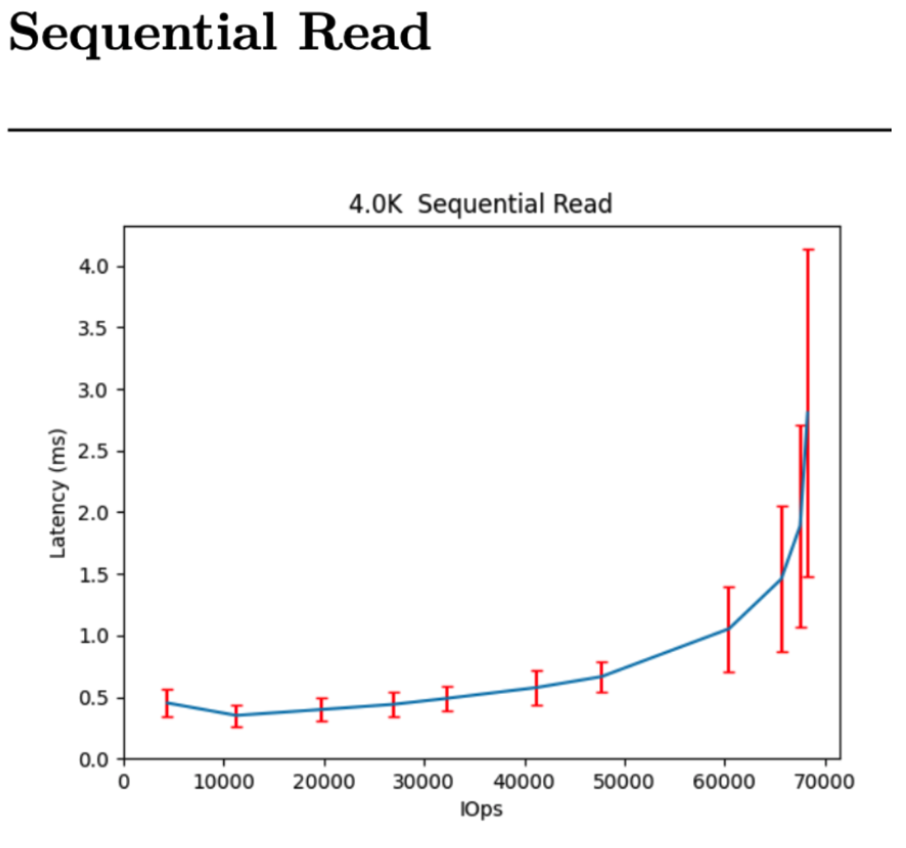

## Outline of the Blog Series  

- **Part 1** - How to start a Ceph cluster for a performance benchmark with CBT  
- **Part 2** - Defining YAML contents  
- **Part 3** - How to start a CBT run - Things to consider when evaluating performance  
- **Part 4** - How to integrate CBT with Teuthology  

---

## Introduction  

Now that we have created our erasure coded (EC) cluster (from **Part 1**) and defined our YAML file and workloads (from **Part 2**), we can finally start a CBT run and analyse the performance results.  

This part will cover:  

1. Running a performance test  
2. Processing the results  
3. Analysing the results  
4. Comparing Jerasure vs CLAY EC pools  
5. Running tests with an OSD stopped 

---

<details>
<summary>Step 1: Run the performance test</summary>

First, clone the [CBT repository](https://github.com/ceph/cbt) into a directory of your choice on the machine you are using and `cd` into it.

This is an example of the command to run a CBT performance test:

```bash
  python /cbt/cbt.py -a /tmp/cbt -c /example/ceph.conf /example/<yaml_file> 2>&1 | tee /tmp/cbt.out
```

You will specify the location of your `cbt.py` file. Provide an archive folder where your results will be generated `/tmp/cbt`. Provide a config folder `/example/ceph.conf` to allow CBT to connect with the cluster. Finally we specify our `yaml_file` which will outline what tests/workloads will be running.

</details>

---

<details>
<summary>Step 2: Processing the results</summary>

Once you have run the performance test your output files will be located wherever you specified them to go. For me, the previous command referenced `/tmp/cbt` so my results are within there. 

- I now copy these files to a new directory I would like them to be within, `my_test` in this case, so I would do this for example:
```bash
cp -r /tmp/cbt/* /perftests/my_test
```

- Finally, it is a case of generating the performance report, which can be done by the following command for myself in this example:
```bash
PYTHONPATH=/cbt/ /cbt/tools/generate_performance_report.py --archive /perftests/my_test --output_directory /perftests/my_test_results --create_pdf
```

Above I am referencing the location of cbt.py again at the start, I then reference the script that will generate the performance report. I state the directory, `my_test` in this case, that has the results from the performance run, and also state a desired `output-directory`, this is where the pdf for the performance report will be. You can then upload this performance report pdf onto github if you would like.

</details>

---

<details>
<summary>Step 3: Analysing the results</summary>

I generated a performance report for a Jerasure plugin EC pool, the results can be found [here](https://github.com/Jakesquelch/cbt_results/blob/main/20aug_jerasure_full_results/performance_report_250820_091150.pdf): 
The 
The generated report includes a summary of the results, showing maximum throughput and latency:


As well as the summary above, hockey stick curves plotting the performance for all of the above are generated, for example this is the curve for a 4K Sequential Read of the Jerasure EC setup:



## How do we read the curves generated?

Let’s take this 4K sequential read curve shown above. Each data point on the curve represents a set of measured data: it’s the latency (average response time) over an amount of time where data is being read, at a constant IO load. Latencies include the switch/network overheads, they are times seen by an application on a server. All performance shown in this graph represents steady-state, achievable and repeatable performance (not a “lab special” burst)

We can find out the specified total iodepths for this test by checking the yaml file we previously used in this test, and it is also stated within the performance report under the “Configuration yaml” section. For the above it is: 
```yaml
total_iodepth: [ 2, 4, 8, 12, 16, 24, 32, 64, 96, 128, 192 ] 
```
 And each of these total iodepths represent a point on the curve. For example the 6th iodepth point (24) represents where the 6th red vertical line intersects the curve. The vertical red lines represent standard deviations. So we can go into the json to find specifics or we can use the graph. From the graph we know at an IO depth of 24, there is an average latency of around 0.58ms when the throughput is around 41000IOps.

 ## What are we looking for in these graphs?

 We are looking for a curve that is flat and consistent. We do not want to have a low number of IOPs leading to high latencies, as this will mean performance is bad when there is little demand. We also do not want the latency to spike randomly throughout the graph, this shows inconsistencies. We want clients and users to achieve a consistent latency for the amount of IOPs that they will be reaching. 

</details>