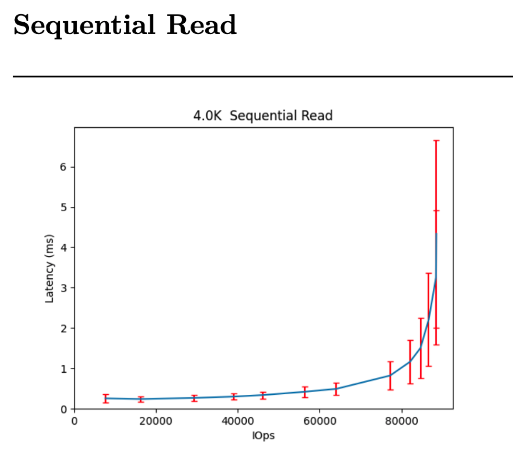

## Outline of the Blog Series  

- **Part 1** - How to start a Ceph cluster for a performance benchmark with CBT  
- **Part 2** - Defining YAML contents  
- **Part 3** - How to start a CBT performance benchmark 
- **Part 4** - Analysing a CBT performance benchmark 

---

## Introduction  

Now that we have created our erasure coded (EC) cluster (from **Part 1**) and defined our YAML file and workloads (from **Part 2**), we can now start a CBT performance benchmark test.

This part will cover:  

1. Running a performance test  
2. Processing the results  
3. How to read response time curves  

---

<details>
<summary>Step 1: Run the performance test</summary>

First, clone the [CBT GitHub repository](https://github.com/ceph/cbt) into a directory of your choice on the machine you are using and `cd` into it.

This is an example of the command to run a CBT performance test:

```bash
  python /cbt/cbt.py -a /tmp/cbt -c /example/ceph.conf /example/<yaml_file> 2>&1 | tee /tmp/cbt.out
```

You will specify the location of your `cbt.py` file. Provide an archive folder where your results will be generated `/tmp/cbt`. Provide a config folder `/example/ceph.conf` to allow CBT to connect with the cluster. Finally we specify our `yaml_file` which will outline what tests/workloads will be running.

</details>

---

<details>
<summary>Step 2: Processing the results</summary>

Once you have ran the performance test your output files will be located wherever you specified them to go. For me, the previous command referenced `/tmp/cbt` so my results are within there. 

- I now copy these files to a new directory I would like them to be within, `my_test` in this case, I do this because I like to keep a directory of all my test results, and I delete `/tmp/cbt` before each run, so that is not a suitable palce. So I would do this for example:
```bash
cp -r /tmp/cbt/* /perftests/my_test
```

- Next, it is a case of generating the performance report, which can be done by the following command for myself in this example:
```bash
PYTHONPATH=/cbt/ /cbt/tools/generate_performance_report.py --archive /perftests/my_test --output_directory /perftests/my_test_results --create_pdf
```

Above I am referencing the location of cbt.py again at the start, I then reference the script that will generate the performance report (generate_performance_report.py). I state the directory, `my_test` in this case, that has the results from the performance run, and also state a desired `output-directory`, this is where the pdf for the performance report will be. Side note, you do not need to already have created the `my_test_results` directory you can see in the command above, this will be automatically done for you. You will now have a pdf file inside this new `my_test_results` folder along with a few other files, you can upload these files to GitHub if you'd like to store/view them somewhere.

</details>

---

<details>
<summary>Step 3: How to read response time curves</summary>

So going back to my example CBT test run and the question we started with: "Does using the CLAY erasure code plugin give better performance than using the default JErasure plugin?" 

I generated a performance report for a JErasure plugin EC pool, the results can be found [here](https://github.com/Jakesquelch/cbt_results/blob/main/Blog/24th_Sep_Jerasure_4%2B2_results/performance_report_250924_094912.pdf), go ahead and view the results if you wish to.

I then generated a performance report for the CLAY plugin [here](https://github.com/Jakesquelch/cbt_results/blob/main/Blog/13th_Oct_Clay_4%2B2%2B5_results/performance_report_251013_094658.pdf).  

You will see hockey stick curves plotted to show the performance within the reports generated, for example this is the curve for a 4K Sequential Read of the Jerasure EC setup:



## How do we read the curves generated?

Let’s take this 4K sequential read curve shown above:

We can find out the specified `total iodepths` for this test by checking the yaml file we previously used in this test, and it is also stated within the performance report under the “Configuration yaml” section. For the above example it is: 
```yaml
total_iodepth: [ 2, 4, 8, 12, 16, 24, 32, 64, 96, 128, 192, 288, 384 ] 
```
And each of these total iodepths represent a point on the curve. For example the 6th iodepth point (24) represents where the 6th red vertical line intersects the curve. So we can go into the json to find specifics or we can use the graph. From the graph we know at a total IO depth of 24, there is an average latency of around 0.5ms when the throughput is around 57000IOps. Therefore each data point on the curve represents a set of measured data; it's the average response time (latency) over approximately a 5-minute period of data collection at a constant IO load.

Response times include the switch/network overheads, they are times seen by an application on a server.

The vertical red lines (error bars) shows the amount of standard deviation/variance in the performance for that specific point in the curve. If the standard deviations are small it shows that performance is stable with that workload. As the response curve starts to curve upwards performance bceomes more variable and the standard deviation increases.

- For an FIO workload, CBT will start 1 instance of FIO per volume. 
- It's also to note that the graph produced by reports do not include the results during the "ramp" period.

The post processing tools will sum the IOPs to generate a total IOPs for the response curve and calculate an average latency over all the volumes. The IOPS vs latency is then plotted on the response curve for that point of the curve for that specific iodepth.

## What values to read from a response curve?

1. If you know how much I/O your application is generating then you can use the response curve to work out what latency you should expect
2. If you want to see the maximum amount of I/O that the storage controller can process look for the right most point on the curve and find the value on the X axis.
3. If you have a latency requirement such as all I/O must complete in under 2ms then you can find out the maximum I/Os the storage controller can do by finding the point on the curve at this latency.
4. Most of the time you don't know exactly how much I/O an application is going to generate, and want to ensure that if there are any peaks or bursts in the amount of I/O that this doesn't cause a big change in latency. Where the response curve is flat there will be little change in latency if the amount of I/O varies, where the response curve is bending upwards a fairly small variation in amount of I/O can have a big impact on latency. Choosing a point on the response curve just before it starts increasing too rapidly gives a good indication of the maximum amount of I/O you can do with stable performance.
5. Most users do not want to operate above around 70% of maximum throughput, as this provides some headroom for expansion and allows for sudden bursts in a workload so that high latency can be tolerated.

As mentioned in part 1 of the blog, the perfect response curve would be a flat horizontal line showing constant latency as the quantity of I/O increases until we reach the saturation point where the system can handle no more I/O. This is because it highlights that performance is consistent with less variance.

</details>

---

## In Conclusion

In conclusion, with all the OSDs running, CLAY shows some strengths over Jerasure, especially at large block and mixed workloads. But when one OSD is down, it has some poor performance results, for example the small block size random writes where throughput drops by half and latency can triple. CLAY’s repair locality helps for large objects, but it actually suffers worse than Jerasure on small random operations, due to what we discussed earlier.

This brings us back to the benefits of CBT benchmarking. Through generating these performance results we noticed that there was a problem when it came to CLAY at recovering data, and this can lead to improvements to be made to it. For example, the reads are currently issued in series which will add a lot of latency to the recovery, issuing the reads in parallel would be better. 

I hope this demonstrates the seamless experience of CBT and how it can generate helpful reports and curves that will allow you to benchmark performance of Ceph cluster setups with ease.