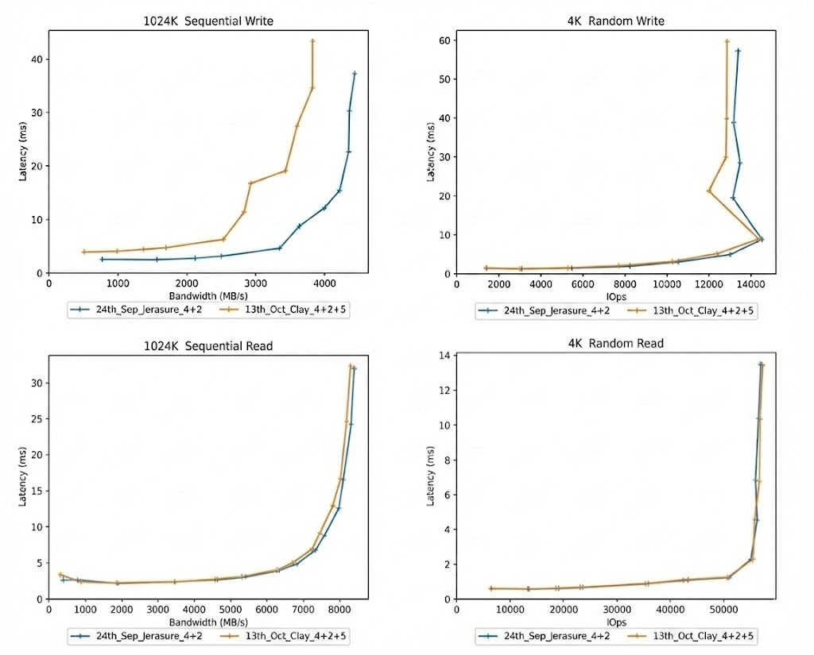
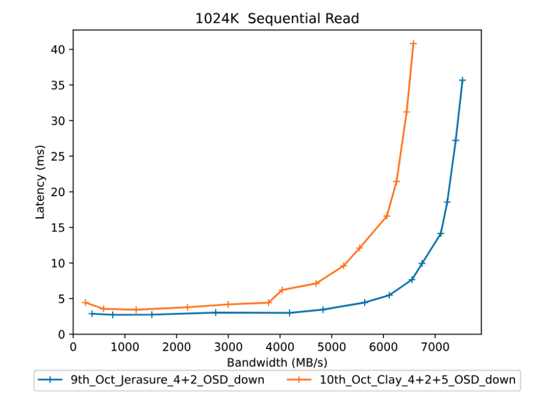
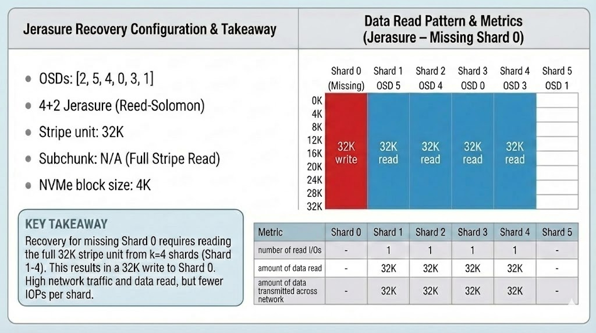
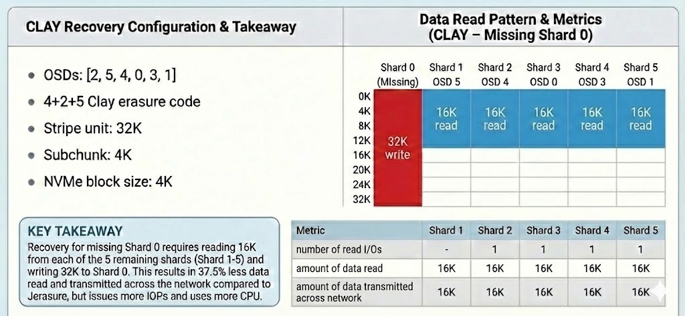
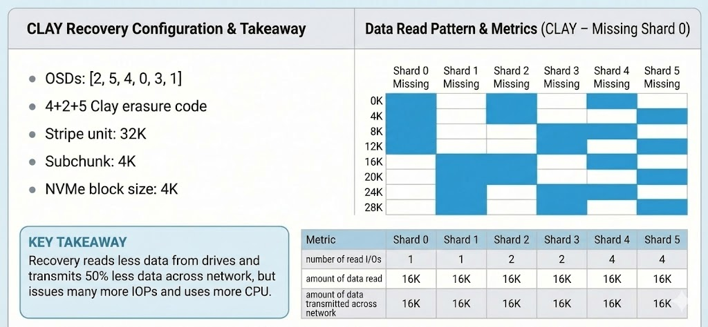
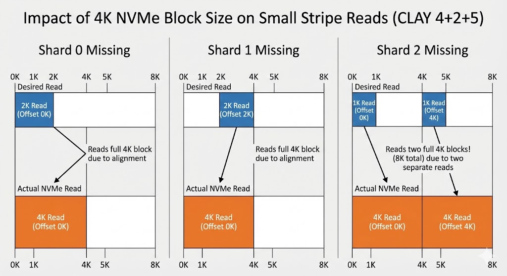

CBT Performance Benchmarking - Part 4. What can we say about CLAY?

## Outline of the Blog Series  

- [**Part 1**](https://ceph.io/en/news/blog/2025/cbt-performance-benchmarking-part1/) - How to start a Ceph cluster for a performance benchmark with CBT  
- [**Part 2**](https://ceph.io/en/news/blog/2025/cbt-performance-benchmarking-part2/) - Defining YAML contents  
- [**Part 3**](https://ceph.io/en/news/blog/2025/cbt-performance-benchmarking-part3/) - How to start a CBT performance benchmark 
- **Part 4** - Assessing the performance of the CLAY erasure code plugin

---

Contents:
- [Client IO results for CLAY](#client)
- [Client IO with an OSD down](#down)
- [What is CLAY good at?](#good)
- [Problems with using CLAY](#probs)
- [How does CLAY read data from the drive?](#read)
- [CLAY is broken in tentacle](#broke)
- [Summary](#summary)

---

## Client IO results for CLAY

As a refresher lets quickly look back on the **client IO** results of **CLAY** compared to **JErasure**:

If we look back to **Step 3** in [**Part 3**](https://ceph.io/en/news/blog/2025/cbt-performance-benchmarking-part3/) of the blog `(Generating a comparison report)`, we saw that **reads** had practically identical curves between CLAY & JErasure for both **4K random reads** and **1024K sequential reads**.

However, when we compared **writes** we saw that the performance hit to CLAY was substantially larger, particularly for higher bandwidths. The **1024k Sequential Writes** diagram represents this:

Click to see Part 3 diagrams

**So why was this?**

This is because of CLAY's **encoding process**, it is significantly more complex. While JErasure performs a single encoding pass, CLAY uses three phases:
1. 50% of data is encoded using **PRT** (Product Recovery Transform), 50% of the data is copied to form an intermediate set of buffers
2. All the intermediate data is encoded using **RS** (Reed-Solomon) to form a second set of intermediate buffers
3. 50% of the result is encoded using **PFT** (Parity Fractional Transform), 50% of the data is copied to form the output buffers

Essentially, CLAY performs **2x** the encoding plus an **additional** memcpy (memory copy) compared to JErasure's 1x encoding. This overhead therefore directly translates to **lower write throughput** for CLAY, as shown by the diagrams above. The performance impact increases for larger IO sizes because more data is being encoded.

Referenced the following: ['Clay Codes: Moulding MDS Codes to Yield an MSR Code'](https://people.iith.ac.in/mynav/pdfs/talks/Clay_Fast18.pdf) above for information on CLAY's encoding process.

---

## Client IO with an OSD down

Click to see Part 3 diagram

We then moved onto **Step 4** in [**Part 3**](https://ceph.io/en/news/blog/2025/cbt-performance-benchmarking-part3/) of the blog `(Running a test with an OSD down)`, and we saw that performance had got even worse for CLAY here. The curves are no longer near identical for the reads (as shown by the above diagram). CLAY is clearly performing worse in this scenario, which we did not initially expect.

This latency increase is due to the specific implementation of CLAY within Ceph. For **degraded** read IOs (when a client requests data from a missing shard), the system is configured to read and decode all the data to reconstruct the missing information. Just as the **encode** process (for write IOs) has a higher overheads when using CLAY, the **decode** process (for degraded read IOs) has similarly higher overheads. This is an implementation choice - when recovering objects (see next section) CLAY uses a more efficient method for recovering the data. This method could also have been used for degraded reads.

---

## What is CLAY good at?

Now you may be thinking, if CLAY is slower for writes and degraded reads, why use it? The answer is for **Network Bandwidth Optimisations** during recovery processes like **backfill** and **recovery** that use the erasure code to reconstruct and repair the missing parts of objects.

While JErasure requires **k** (data shards) to reconstruct **one** missing shard, CLAY uses coupled layers to reconstruct data using a significantly smaller amount of data from the remaining shards. In a standard 4+2 setup, JErasure would need to pull 100% of the data from the other 4 shards to rebuild the 5th. 

This is what it would look like if we were to use JErasure and simulate a recovery of data when shard 0 is missing:

Now we will compare this to how CLAY would recover data if shard 0 was missing. `CLAY reduces this traffic by approximately 50%` as you can see in the below example:

It's important to note that the above configuration has a chosen non-default stripe unit of **32K** which, with a 4+2 CLAY code, results in a sub chunk size of **4K** and matches both the **NVMe block size** and the **Bluestore allocation unit**. See the Ceph documentation [here](https://docs.ceph.com/en/latest/rados/operations/erasure-code-clay/) for how to calculate the sub chunk size for your configuration.

We can see that with the CLAY example above **more** data shards are read, however overall **less** data is read. We can therefore see that for our configuration, CLAY will be more efficient in recovering data when a shard is missing.

With this erasure code profile CLAY will always read **50%** of each other shard to recover a missing shard, however the subchunks that are read will vary depending on which shard is missing. The next diagram shows which subchunks will be read for each missing shard:

**Note**: While the diagram shows a 50% saving in network traffic, this comes at the `cost of IOPS`. We can see how shards 4 and 5 must perform **four** individual reads per stripe to gather those specific sub-chunks, so we can see here how it can be dependant on which shard is missing.

In summary CLAY reads much less data than JErasure during recovery/backfill saving approximately **50%** network bandwidth which in systems that are limited by the network should improve the performance of recovery.

---

## Problems with using CLAY

Choosing your stripe unit is critical:
- **If stripe unit is 4K:** Sub-chunks become tiny (512 bytes) and reads of less than 4K are `rounded up` to 4K. 

This leads to **extra** data reads because the NVMe block size is 4K. This means that recovery reads **1x to 4x** the amount of data from drives but transmits **50% less** data across the network, there is still many more **IOPs** and **CPU usage** in this scenario.

Let's break this down a step further using examples of shards 0, 1 and 2 missing. Here we can see in blue the desired amount of data that we want to read, however the orange is the actual amount of data that is read due to these allignment issues.

- **If stripe unit is 32K:** This fixes the fragmentation issue that we see above (sub-chunks align better with 4K drive blocks), but introduces some classic and fast EC problems:

In a classic EC pool, any overwrite requires reading the **entire** stripe, even if you only changed **one** byte. At 32K, small writes become incredibly expensive because of the `Read-Modify-Write` overhead. In classic EC objects are padded to a multiple of the stripe width, so a larger stripe unit **increases** wasted capacity. In fast EC objects are not padded but a larger stripe unit still results in **more** coding parity data and **less** storage efficiency. So there are still negatives to bare in mind if you are to pick a stripe unit of 32K.

---
 
## How does CLAY read data from the drive?

### Fragmented Reads

As shown above, CLAY issues **fragmented reads**. If the stripe unit gets smaller, for example **4K**, the sub-chunk size drops to **512 bytes**. This is because NVMe and HDD drives have a minimum block size of **4K**, therefore any 512 byte read is **rounded up** to this minimum of 4K. This can result in CLAY reading the same 4K block multiple times to extract different 512 byte sub-chunks, and discarding the rest of the data. This therefore wastes **CPU** and **drive IOPs**, so if either of these are your performance bottlenecks this is not a good scenario.

**Squid** recovery also always tries to read **2MB** from each stripe and expects the read to be truncated if the object is smaller than `2MB * number of stripes`. With CLAY this results in a lot of small reads being issued beyond the end of the object. While these as quickly fail and do not stop CLAY recovering the data, this does waste **additional CPU resources**.

Referring to the same [paper](https://people.iith.ac.in/mynav/pdfs/talks/Clay_Fast18.pdf) as before: Results have been shown that encoding data can take up to **70%** longer in terms of CPU usage, if your cluster **isn't** CPU limited then you won't notice this. These results also showed dramatic savings in **backfill** and **recovery** time - but they were done on a system that was network limited and used much wider erasure codes (26 node cluster) than most people would typically use. 

There is scope to improve the implementation of CLAY - currently the reads are issued **serially**, which will add a lot of latency to the recovery. A more efficient approach would be to issue a single read in **parallel** using `readv` or to read the entire stripe into memory once, then transmit the required data for the network. The latter would be the better method. This would trade **drive bandwidth** for a considerable saving in **CPU utilisation** and **drive IOPs**. 

### More in depth:

We went over the 3 phases of how CLAY encodes data earlier. Decoding is also done in 3 phases, but on half the quantity of data:
1. 25% of the data is decoded using **PRT**, 25% of the data is copied to form an intermediate set of buffers
2. All (50%) of the intermediate data is decoded using **RS** to form a 2nd set of intermediate buffers
3. 25% of the data is decoded using **PFT**, 25% of the data is copied to form the output data

Therefore, CLAY has an additional **0.5x memcpy** of the data and the **same** decoding costs, as JErasure. Hence there is slightly more overhead for CLAY (memcpy's + slight inefficiencies from performing several smaller decodes rather than one large decode). CLAY requires less data to perform the recovery so we can save on **network bandwidth** (and if implemented correctly, **drive bandwidth**)

To round off:
- CLAY has **higher** encoding costs and the **same** decoding cost
- CLAY has some memcpy's that JErasure does not have
- CLAY has multiple encode/decode steps and there will be some small overheads/inefficiencies - for example, encoding 12K of data in 3 batches of 4K (CLAY) versus encoding 12K of data in 1 batch (JErasure)

---

## CLAY is broken in Tentacle

When performing benchmarking on the Tentacle release, a significant issue was discovered: The recovery benefit was **non-existent** for Tentacle.

In the tests, recovery in Tentacle transmitted the **full** amount of data, behaving like standard JErasure but with a **higher** CPU overhead of CLAY. This isn't the case for Squid however, which is what was used for the updated performance benchmarking used throughout this blog.

---

## Summary

CLAY is a fascinating project and definitely has potential, but for the average user, remains niche.

**I'd recommend CLAY if:** Your cluster is strictly **Network Bottlenecked** and you use wide erasure codes (eg 20+ nodes) where the 50% saving is a very considerable amount.

**I'd recommend you avoid CLAY if:** You are **CPU** or **IOPs** limited, or if you primarily use HDDs, as the fragmented serial reads will cripple recovery performance.

For most production environments, the simplicity and predictable performance of JErasure remains the better choice I believe.

Please note that there is a plan to end support for CLAY from the V release. Please see [here](https://ceph.io/en/news/blog/2025/ending-support-for-ec-plugins/) for more details.

---

[Link to connect with Ceph on slack](https://ceph.io/en/community/connect/)

Contact us in the **#cbt** channel in the Ceph on slack workspace above!

[Link to previous parts of the blog series](#outline)