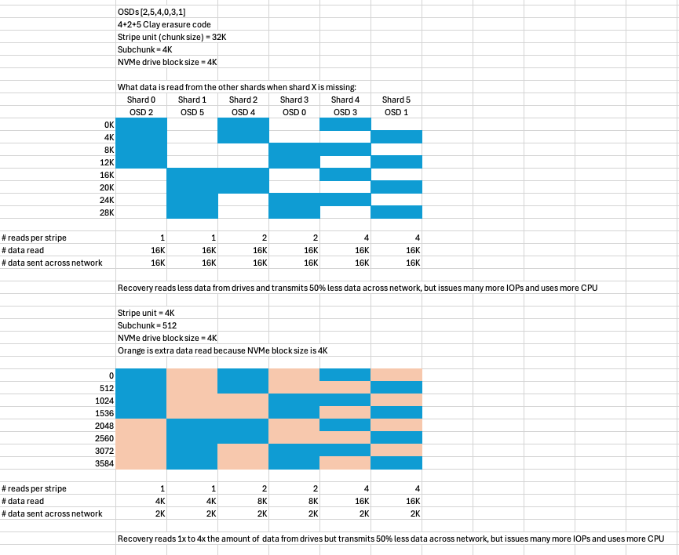

CBT Performance Benchmarking - Part 4. What can we say about CLAY?

## Outline of the Blog Series  

- [**Part 1**](https://ceph.io/en/news/blog/2025/cbt-performance-benchmarking-part1/) - How to start a Ceph cluster for a performance benchmark with CBT  
- [**Part 2**](https://ceph.io/en/news/blog/2025/cbt-performance-benchmarking-part2/) - Defining YAML contents  
- [**Part 3**](https://ceph.io/en/news/blog/2025/cbt-performance-benchmarking-part3/) - How to start a CBT performance benchmark 
- [**Part 4**] - Analysing CLAY

---

Contents:
- [Client IO results for CLAY](#client)
- [What is CLAY good at?](#good)
- [How does CLAY read data from the drive?](#read)
- [Problems with using CLAY](#probs)
- [CLAY broken in tentacle](#broke)
- [Summary](#summary)

---

## Client IO results for CLAY

Plan for this section: summary is performance is worse than CLAY (look at results in part 3 and say its worth for higher bandwith for high writes, reads are basically identical)

As a refresher lets quickly reflect on [**Part 3**](https://ceph.io/en/news/blog/2025/cbt-performance-benchmarking-part3/) of the blog and take a look at the client IO results for CLAY compared to Jerasure.

If we look back to Step 3 in Part 3 [**Part 3**](https://ceph.io/en/news/blog/2025/cbt-performance-benchmarking-part3/) of the blog `(Generating a comparison report)`, we saw that **reads** had practically identical curves between CLAY & Jerasure (we provided `4K random read` and `1024K sequential read` diagrams).
When we compared **writes** between CLAY & Jerasure we saw that the performance hit to CLAY was substantially larger, particularly for higher bandwidths. The `1024k Sequential Wrties` diagram showed this.

### Client IO with an OSD down

Plan for this section: its worse, point to part 3 and show that and analyse it (worse for both reads and writes)

We then moved onto Step 4 in [**Part 3**](https://ceph.io/en/news/blog/2025/cbt-performance-benchmarking-part3/) of the blog `(Running a test with an OSD down)`, and we saw that performance has got even worse for CLAY here. The curves are no longer identical for the `1024k sequential read`, CLAY is obviously worse, which we did not expect.

This will be explained later.

---

## What is CLAY good at?

Plan for this section: (do we need a measurement here for network bandwith for 4+2, we should see CLAY transfering half as much data as Jerasure) Meant to help rebuild process, claims to reduce network traffic by 50%. Because its reading less data from OSDs and sending less data between OSDs. Explain backfill and recover algorithm works

So you may be asking, **"So what is CLAY actually good at then?"**

Here do we want to show the measurement of network bandwidth for the **rebuild** (need a better term instead of rebuild, maybe **recovery scenario?**). This states there is an ~50% reduction of the amount of data between OSDs during recovery (in Squid but not in tentacle, will talk about this later). So this will be good if network bandwidth is a bottleneck. Should explain how backfill and recover algorithm works?

---
 
## How does CLAY read data from the drive?

Plan for this section: Could show spreadsheet for patterns for different shards (Bill sent me on Slack) might be able to show which bits of data are being reconstructed for each bit of the given drivel. Explain the subchunks/different patterns, those reads are being read serially/ serialised reads which is a particular problem for HDD.

CLAY is doing a lot more read IOs to the backend drives which is bad news if the drive IOPs or CPU is the performance bottleneck. With a sub chunk size of 512 bytes the situation with the drive is worse becase reads of less than 4K get rounded up to a whole 4K block. This means CLAY sometimes ends up reading the same data more that once and discarding different parts of what is read. This shows why the earlier read graphs when an OSD were down had poor performance. 

Squid recovery also always tries to read 2MB from each stripe and expects the read to be truncated if the object is smaller than 2MB * number of stripes. With Clay this results in a lot of small reads being issued beyond the end of the object. While these as quickly failed and do not stop Clay recovering the data this does waste additional CPU resources.

There is scope to improve the implementation of Clay - the reads are currently issued in series which will add a lot of latency to the recovery, issuing the reads in parallel using readv would be better, however it would be even more efficient to issue just 1 read to the drive for the whole stripe and then just transmit the subset of data required across the network. Whilst this will increase drive bandwidth in some cases, it will considerably reduce drive IOPs and CPU utilization.

---

## Problems with using CLAY

Plan for this section: Explain NVMe drives and HDD drives both have 4k block size, should be using a chunk size of 32k or bigger. However that’s not the default, and there’s a lot of drawbacks of using higher chunk size (reference Lee FastEC blog to why larger chunk size is a problem, the table section?)

---

## CLAY broken in Tentacle

Plan for this section: Done testing on tentacle and rebuild transmits all the data.

---

## Summary

Plan for this section: If Network bandwitch is your bottle neck there may still be a use case for CLAY. However its a computer science project and a lot of benchmarking will be needed if you want to use it. For most people it may be better to not use it. 

---

[Links to previous parts of the blog series](#outline)