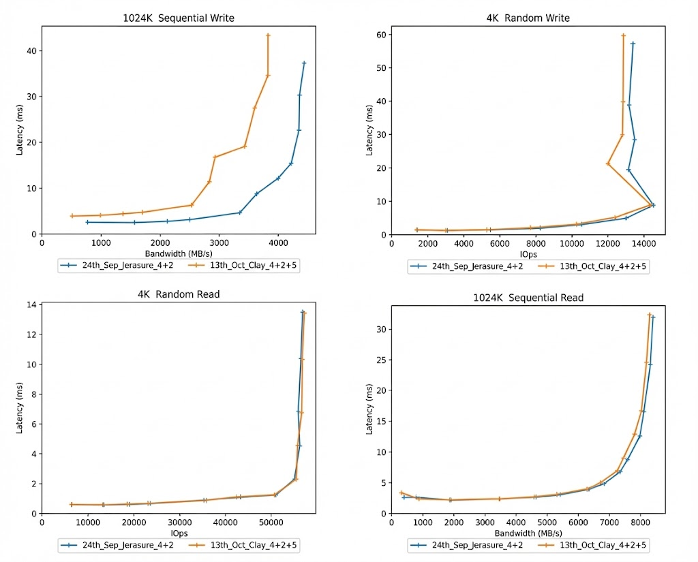
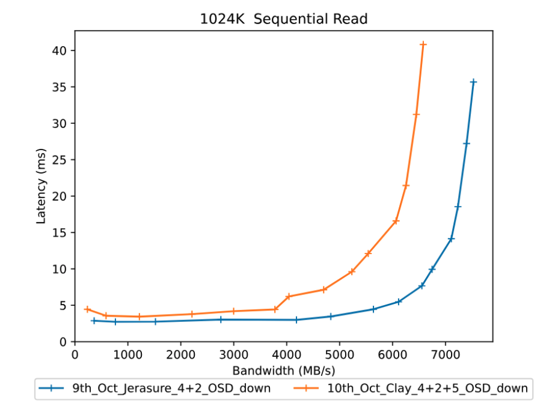
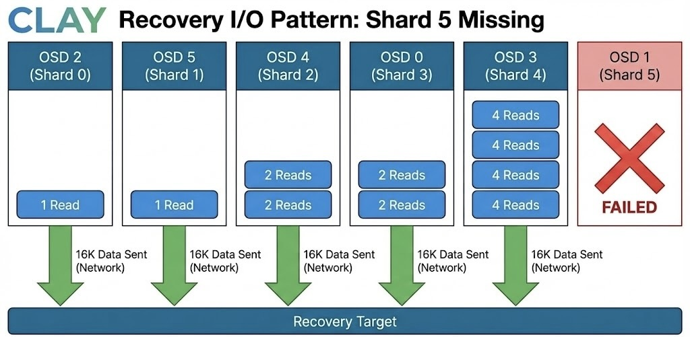

CBT Performance Benchmarking - Part 4. What can we say about CLAY?

## Outline of the Blog Series  

- [**Part 1**](https://ceph.io/en/news/blog/2025/cbt-performance-benchmarking-part1/) - How to start a Ceph cluster for a performance benchmark with CBT  
- [**Part 2**](https://ceph.io/en/news/blog/2025/cbt-performance-benchmarking-part2/) - Defining YAML contents  
- [**Part 3**](https://ceph.io/en/news/blog/2025/cbt-performance-benchmarking-part3/) - How to start a CBT performance benchmark 
- **Part 4** - Analysing CLAY

---

Contents:
- [Client IO results for CLAY](#client)
- [What is CLAY good at?](#good)
- [How does CLAY read data from the drive?](#read)
- [Problems with using CLAY](#probs)
- [CLAY is broken in tentacle](#broke)
- [Summary](#summary)

---

## Client IO results for CLAY

As a refresher lets quickly reflect on the **client IO** results of **CLAY** compared to **JErasure**:

Click to see Part 3 diagrams

If we look back to **Step 3** in [**Part 3**](https://ceph.io/en/news/blog/2025/cbt-performance-benchmarking-part3/) of the blog `(Generating a comparison report)`, we saw that **reads** had practically identical curves between CLAY & JErasure for both **4K random reads** and **1024K sequential reads**.

However, when we compared **writes** we saw that the performance hit to CLAY was substantially larger, particularly for higher bandwidths. The **1024k Sequential Writes** diagram represents this. 

**So why was this?**

This is because of CLAY's encoding process, it is significantly more complex. While JErasure performs a single encoding pass, CLAY uses three phases:
1. 50% of data is encoded using **PRT** (Product Recovery Transform), 50% of the data is copied to form an intermediate set of buffers
2. All the intermediate data is encoded using **RS** (Reed-Solomon) to form a second set of intermediate buffers
3. 50% of the result is encoded using **PFT** (Parity Fractional Transform), 50% of the data is copied to form the output buffers

Essentially, CLAY performs **2x** the encoding plus an **additional** memcpy (memory copy) compared to JErasure's 1x encoding. This overhead therefore directly translates to **lower write throughput** for CLAY, as shown by the diagrams above.

Referenced this paper: ['Clay Codes: Moulding MDS Codes to Yield an MSR Code'](https://people.iith.ac.in/mynav/pdfs/talks/Clay_Fast18.pdf) above for CLAY's encoding process.

## Client IO with an OSD down

Click to see Part 3 diagram

We then moved onto **Step 4** in [**Part 3**](https://ceph.io/en/news/blog/2025/cbt-performance-benchmarking-part3/) of the blog `(Running a test with an OSD down)`, and we saw that performance had got even worse for CLAY here. The curves are no longer near identical for the reads (as shown by the above diagram). CLAY is obviously performing worse in this scenario, which we did not expect.

This drop occurs because CLAY is optimised for **background recovery** rather than **real-time client reconstruction**. When a client requests data from a missing shard, the OSDs have to reconstruct it on the fly. Because of the way CLAY splits the data into sub-chunks, the drive must perform many more IOPs to gather the necessary sub-chunks, leading to the increased latency for the client. 

---

## What is CLAY good at?

Now you may be thinking, if CLAY is slower for writes and degraded reads, why use it? The answer is for **Network Bandwidth Optimisations** during background processes like **backfill** and **recovery**.

It is stated that there is approximately a **50%** reduction in network traffic during recovery. For JErasure it would require **k** (data shards) to reconstruct **one** missing shard, CLAY uses `Coupled Layers` to reconstruct data using a **smaller** amount of data from other shards.

The efficiency of CLAY depends on the k (data) and m (parity) values.
 - Standard RS (Read-Solomon) (4+2): Must read 4 shards to recover 1. (This is what is used in JErasure)
 - CLAY (4+2): Can often recovery using significantly less "helper" data across the network

 

 **Note:** Technically, the client **could** see this 50% saving too. However, the current Ceph implementation prioritises background recovery for these optimisations over client-side reconstructions.

---
 
## How does CLAY read data from the drive?

**Lets take an example: Reconstruction Pattern for 4+2 CLAY, Shard 5 is missing:**

In a 4+2 setup with a 32K stripe unit and 4K sub chunks, if shard 5 (OSD 1) dies, the system will read specific "sub chunks" from the other surviving OSDs:

### Fragmented Reads

As shown above, CLAY issues **fragmented reads**. If the stripe unit gets smaller, for example **4K**, the sub chunk size drops to **512 bytes**, which is an even worse situation. This is because NVMe and HDD drives have a minimum block size of **4K**, therefore any 512 byte read is **rounded up** to this minimum of 4K. This can result in CLAY reading the same 4K block multiple times to extract different 512 byte sub chunks, and discarding the rest of the data. This therefore wastes **CPU** and **drive IOPs**, so if either of these are your performance bottlenecks this is not a good scenario.

Squid recovery also always tries to read **2MB** from each stripe and expects the read to be truncated if the object is smaller than **2MB * number of stripes**. With Clay this results in a lot of small reads being issued beyond the end of the object. While these as quickly failed and do not stop Clay recovering the data, this does waste **additional CPU resources**.

Refering to the same [paper](https://people.iith.ac.in/mynav/pdfs/talks/Clay_Fast18.pdf) as before: Results have been shown that encoding data can take up to **70%** longer in terms of CPU usage, if your cluster **isn't** CPU limited then you won't notice this. These results also showed dramatic savings in **backfill** & **recovery** time - but they were done on a system that was network limited and used much wider erasure codes (26 node cluster) than most people would typically use. 

There is scope to improve the implementation of Clay - currently the reads are issued **serially**, which will add a lot of latency to the recovery. A more efficient approach would be to issue a single read in **parallel** using `readv` or to read the entire stripe into memory once, then transmit the required data for the network. The latter would be the better method. This would trade **drive bandwidth** for a considerable saving in **CPU utilisation** and **drive IOPs**. 

### More in depth:

We went over the 3 phases of how CLAY encodes data earlier. Decoding is also done in 3 phases, but on half the quantity of data:
1. 25% of the data is decoded using PRT, 25% of the data is copied to form an intermediate set of buffers
2. All (50%) of the intermediate data is decoded using RS to form a 2nd set of intermediate buffers
3. 25% of the data is decoded using PFT, 25% of the data is copied to form the output data

Therefore, CLAY has an additional **0.5x memcpy** of the data and the **same** decoding costs, as JErasure. Hence there is slightly more overhead for CLAY (memcpy's + slight inefficiencies from performing several smaller decodes rather than one large decode). CLAY requires less data to perform the recovery so we can save on **network bandwidth** (and if implemented correctly, **drive bandwidth**)

To round off:
- Clay has higher encoding costs and the same decoding cost
- Clay has some memcpy's that JErasure does not have
- Clay has multiple encode/decode steps and there will be some small overheads/inefficiencies - for example, encoding 12K of data in 3 batches of 4K (Clay) versus encoding 12K of data in 1 batch (JErasure)

---

## Problems with using CLAY

Choosing your stripe unit (SU) is critical:
- **If SU is 4K:** Sub chunks become tiny (512 bytes), leading to the massive IOP overheads and reads less than 4K being rounded up to 4K as previously mentioned (not good)
- **If SU is 32K:** This fixes the fragmentation issue (sub-chunks align better with 4K drive blocks), but introduces some classic and fast EC problems:

In a classic EC pool, any overwrite requires reading the **entire** stripe, even if you only changed **one** byte. At 32K, small writes become incredibly expensive because of the `Read-Modify-Write` overhead. Furthermore in fast EC, for small objects or objects that are smaller than the SU, a 32K SU leads to poor **space utilisation**.

---

## CLAY is broken in Tentacle

When I was performing benchmarking on the Tentacle release, I discovered a significant issue: The recovery benefit was **non-existent** for Tentacle.

In the tests, recovery in Tentacle transmitted the **full** amount of data, behaving like standard JErasure but with a higher CPU overhead of CLAY. This isn't the case for Squid however, which is what was used for my updated performance benchmarking.

---

## Summary

CLAY is a fascinating project and definitely has potential, but for the average user, remains niche.

I'd recommend CLAY if: Your cluster is strictly **Network Bottlenecked** and you use wide erasure codes (eg 20+ nodes) where the 50% saving is a very considerable amount.

I'd recommend you avoid CLAY if: You are **CPU** or **IOPs** limited, or if you primarily use HDDs, as the fragmented serial reads will cripple recovery performance.

For most production environments, the simplicity and predictable performance of Jerasure remains the better choice I believe.

---

[Links to previous parts of the blog series](#outline)