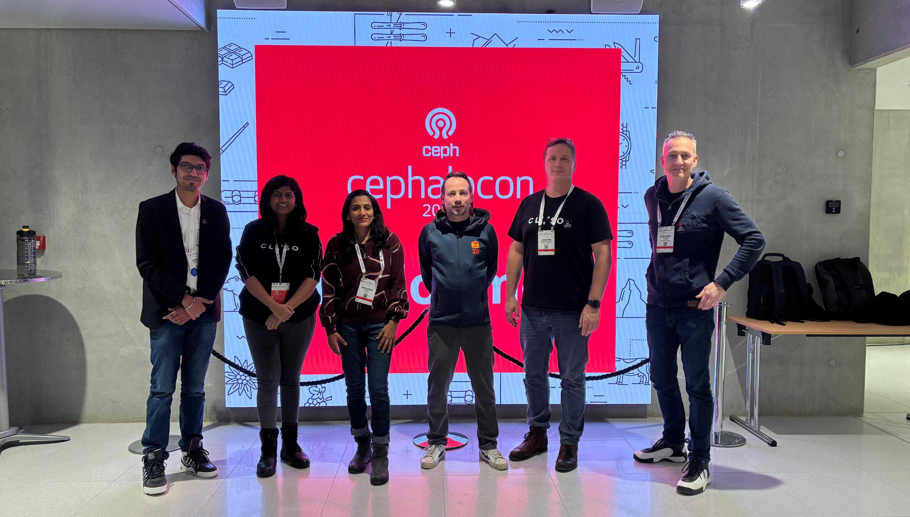

## Join me at Cephalocon 2025!

I'm thrilled to be back at [Cephalocon](https://events.linuxfoundation.org/cephalocon/) this year! Cephalocon isn't just about storage but about innovation, community, and learning from the brightest minds in open source. Last year's event was a huge success, with flawless organization and exceptional presentations. 

The 2024 conference was packed with great sessions: Jane Zhu's (Bloomberg) crucial work on multi-site S3 synchronization and the great talks by Sungjoon Koh & Ilsoo Byun (LINE Plus Corp) on RocksDB, and Michaela Lang (Red Hat) & Daniel Parkes (IBM) on RGW Ingress Strategies. The "State of CephFS" talk by Patrick Donnelly & Venky Shankar and the interactive session with the CERN team were also highlights, perfectly showcasing the expertise of these pioneers and contributors.

 

 

I'm most looking forward to this year's presentations! Specifically, Mark Nelson's talk on Bluestore fragmentation is critical for anyone managing large-scale NVMe deployments. Sam Just's on new Multi-Step Retry CRUSH algorithm, Yehuda Sadeh Weinraub's on S3 bucket snapshots, Venky Shankar's 'Smoother CephFS Experience', and Dan Van der Ster's on data durability. This year's program is just as thrilling as ever!

Cephalocon is more than just technical sessions. It's a unique opportunity to meet the developers and experts who ensure Ceph's stability and ongoing development. Leaders like Neha Ojha, Josh Durgin, Dan Van der Ster, Gregory Farnum, Mark Nelson, Patrick Donnelly, Venky Shankar, and many more will be there to share their knowledge and connect with you. This year, you'll also get to meet our brand new [Community Manager, Anthony Middleton](mailto:community-manager@ceph.io).

The energy and generosity of this community are what make the Ceph project so dynamic. In my talk this year, I will have the honor of highlighting the impact of these pioneers who, through their commitment and availability, have revolutionized storage over the past 20 years.

This year, we're bringing the best of the open-source community to one of the most beautiful cities in the world. Between the cutting-edge sessions and the community connections, it's an event you won't want to miss. Register now to discover the latest innovations and connect with us!

Cephaloalon 2025 will take place in Vancouver, BC, on October 28-29.

<a class="button" href="https://events.linuxfoundation.org/cephalocon/register/">Register Today!</a>
