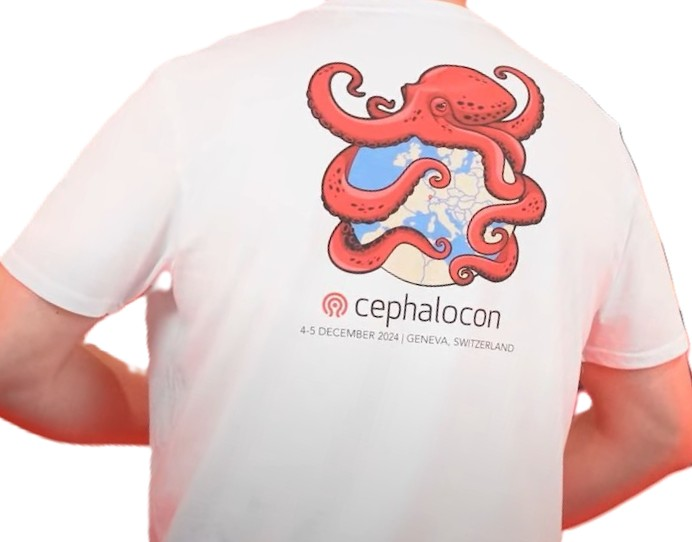

Cephalocon 2025 is coming up, and the Events Committee is excited to launch this year's Cephalocon T-Shirt Design Contest! The Cephalocon conference t-shirt is a perennial favorite, worn proudly by Ceph community members around the world. What makes it iconic? The design was created by a member of the community. And that someone could be you!

Submit your concept for the 2025 conference shirt, and you could:

Have your artwork featured on the official Cephalocon t-shirt and receive complimentary registration to [Cephalocon 2025](https://events.linuxfoundation.org/cephalocon/) in Vancouver, Canada (October 28–29)

You don't need to be a professional artist or designer. Just submit a simple, original concept:
* Hand-drawn sketches are welcome
* Submit as a PDF or JPG
* Please keep the design to black/white or black + one color (to stay budget-friendly)
* All artwork must be original—no licensed content.

Send your design to: [community-manager@ceph.io](mailto:community-manager@ceph.io). 
Deadline for submissions: Friday, August 1, 2025  
Winner announced with the full conference schedule in September 

Get creative, get sketching, and become a part of Ceph history.

Need inspiration? Here is last year's winning design!

