## 1. What Is CephFS and Why Use the Dashboard?

Ceph File System (CephFS) provides a POSIX-compliant, distributed file system on top of the Ceph storage cluster. Administrators manage metadata through Metadata Servers (MDS) and store file data in RADOS pools. Modern Ceph deployments organize file storage using **volumes**, **subvolume groups**, and **subvolumes**, with optional **snapshots** and **snapshot schedules** for data protection.

Day-to-day CephFS work is a chain of related objects: create a volume, group subvolumes, set quotas, take snapshots, and schedule retention. On the CLI that means many `ceph fs volume`, `subvolume`, and `snap` commands, plus a separate snapshot-scheduler module. The Ceph Dashboard puts that chain in one place under **File > File Systems**. For more background, see the [CephFS documentation](https://docs.ceph.com/en/latest/cephfs/).

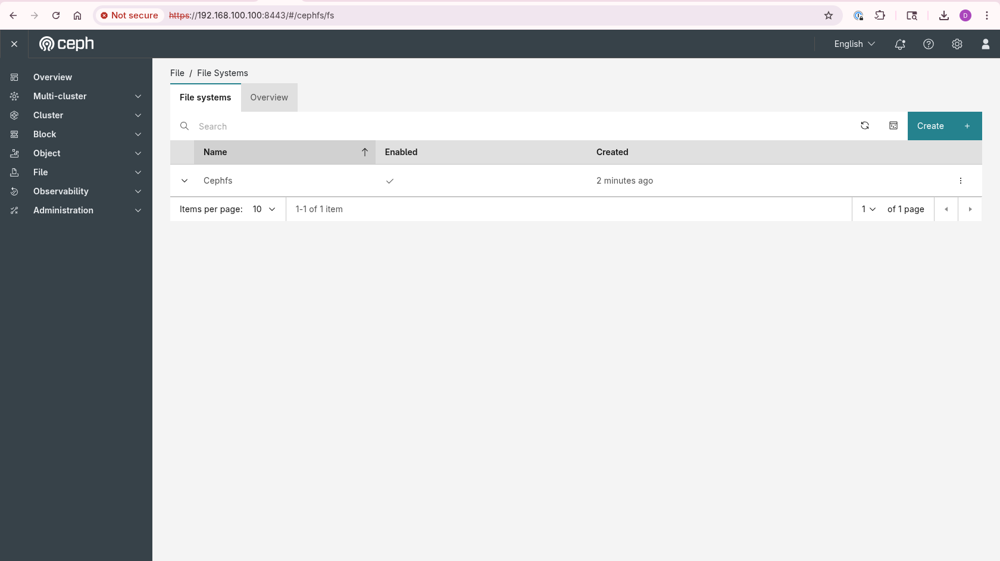
*Figure: File Systems list — manage volumes from File > File Systems*

**Why use the Dashboard for CephFS?**

- **One workflow for the full lifecycle**: Provision volumes, subvolume groups, and subvolumes, then protect them with snapshots, clones, and schedules—without switching tools.
- **Fewer flags to remember**: Size, pool, UID/GID, mode, isolated namespace, placement, frequency, and retention are form fields instead of command-line options.
- **Safer day-to-day changes**: Validated forms reduce mistakes that are easy to make when composing long `ceph fs` commands.
- **Quotas you can see**: Set and review size limits at group and subvolume level from the same screens you use to create them.
- **Data protection in the same UI**: Create point-in-time snapshots, clone them to new subvolumes, and automate recurring snapshots with retention.
- **Operational visibility**: Review file system structure, clients, and usage alongside the objects you manage.

The CLI remains the right choice for automation, scripting, and advanced MDS or cluster tuning. For common create, edit, snapshot, and schedule tasks, the Dashboard is faster and easier to share across a team.

---

## 2. CephFS Volume Management

Navigate to **File > File Systems** to view existing CephFS volumes and create new ones. A volume represents a managed file system instance in the CephFS volume API.

### 2.1 Create a Volume

Click **Create** and provide the volume **Name**. Optionally configure **Placement** using hosts or labels to guide MDS deployment. When placement uses labels, ensure hosts are labeled appropriately—for example, via `ceph orch host ls`.

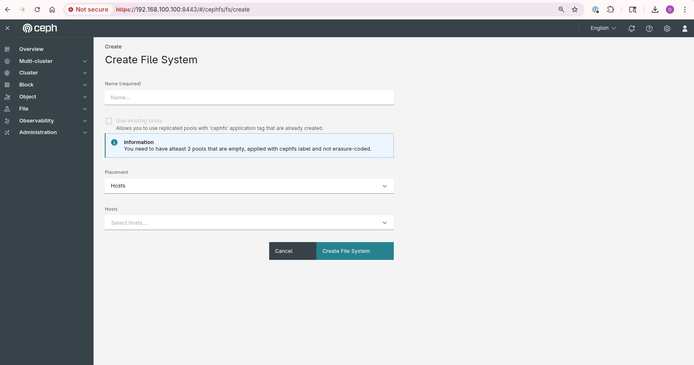

### 2.2 Edit a Volume

Select a volume from the list and click **Edit** to rename it. Confirm the change in the edit dialog.

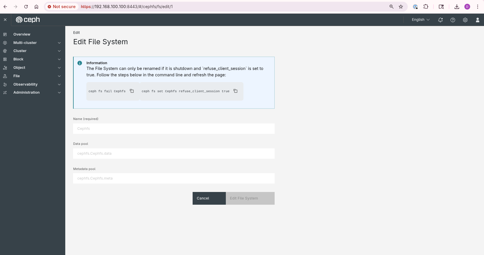
*Figure: Edit a CephFS volume*

### 2.3 Remove a Volume

From the volume action menu, select **Remove**. Confirm removal in the dialog. Ensure dependent subvolumes and clients are addressed before deleting a production volume.

---

## 3. Subvolume Group Management

Subvolume groups organize subvolumes under a volume and allow policies to be applied across a set of related directories.

### 3.1 Create a Subvolume Group

Expand a volume row and open the **Subvolume groups** tab. Click **Create** and configure:

- **Name**
- **Size** (blank or `0` means unlimited)
- **Pool**
- **UID**, **GID**, and **Mode** (default mode is `755`)

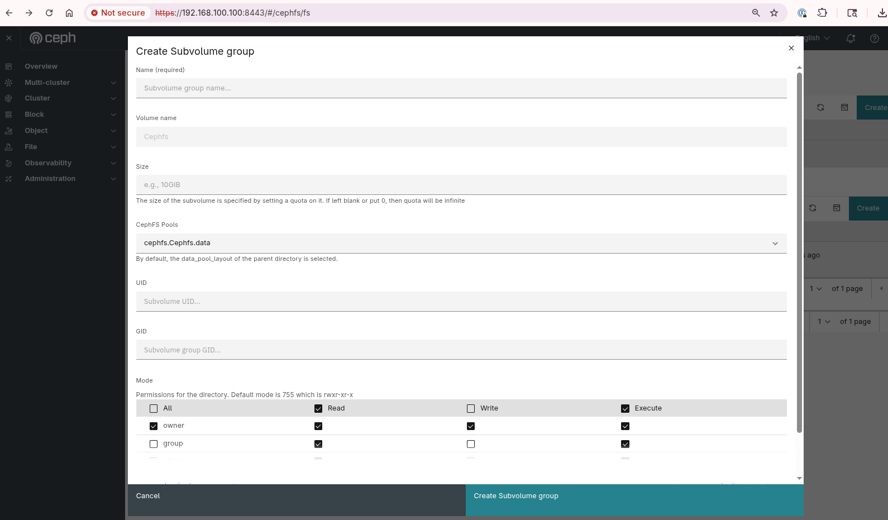
*Figure: Create a subvolume group*

### 3.2 Edit and Delete Subvolume Groups

Use **Edit** to update group settings, or **Remove** to delete a group. Remove all subvolumes in the group before deleting the group itself.

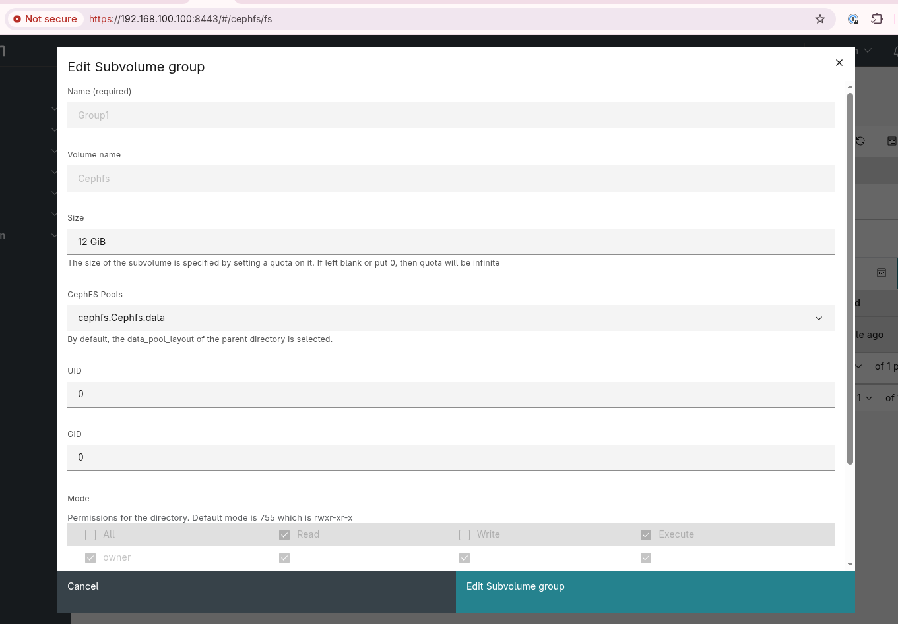
*Figure: Edit or remove a subvolume group*

---

## 4. Subvolume Management

Subvolumes are the unit most applications mount or export. Create them under a subvolume group, or use the **Default** group when no grouping is required.

### 4.1 Create a Subvolume

Open the **Subvolume** tab, select the target subvolume group, and click **Create**. Configure:

- **Subvolume name**
- **Size**, **Pool**, **UID**, **GID**, and **Mode**
- **Isolated Namespace** (optional): place the subvolume in a separate RADOS namespace

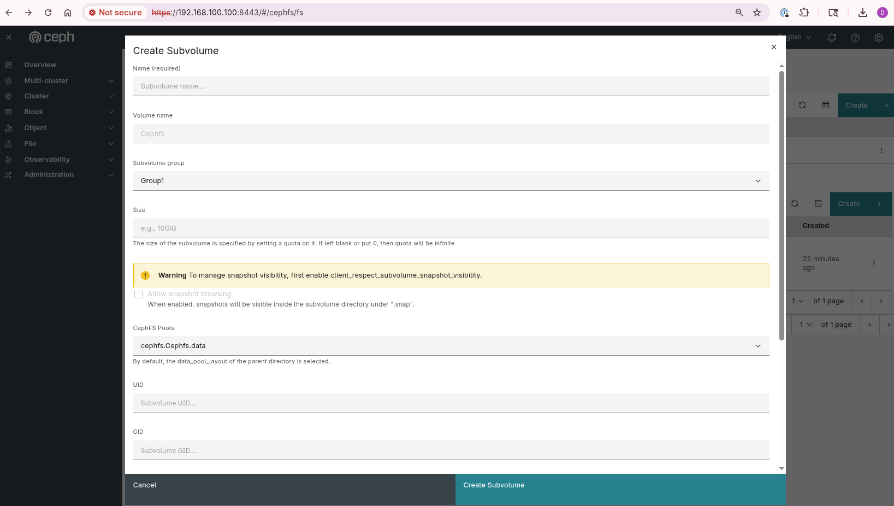
*Figure: Create a subvolume*

### 4.2 Edit a Subvolume

Select a subvolume and click **Edit**. On the Dashboard, subvolume **size** is the primary editable field after creation.

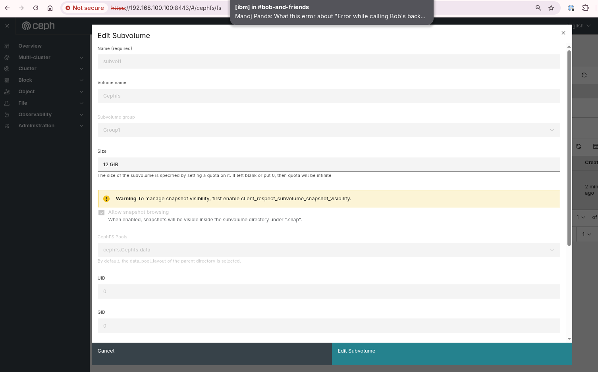
*Figure: Edit a subvolume*

### 4.3 Remove a Subvolume

Select the subvolume and click **Remove**. Confirm removal in the dialog.

*Figure: Remove a subvolume*

---

## 5. Snapshot Management

CephFS snapshots provide immutable, point-in-time views of a volume or subvolume. Snapshot support must be enabled on the file system; it is enabled by default on new file systems.

### 5.1 Create a Subvolume Snapshot

From the **Snapshots** tab, select the subvolume group and subvolume, then click **Create**. Provide a snapshot name or accept the default timestamp-based name.

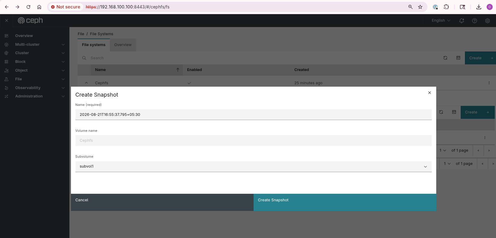
*Figure: Create a subvolume snapshot*

### 5.2 Delete a Subvolume Snapshot

Select the snapshot and click **Delete**. Confirm the action to remove the point-in-time copy.

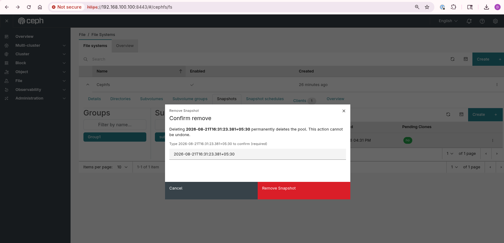
*Figure: Delete a subvolume snapshot*

### 5.3 Clone a Subvolume Snapshot

From the snapshot actions menu, choose **Clone** to create a writable subvolume from a snapshot. Specify the clone name and target subvolume group.

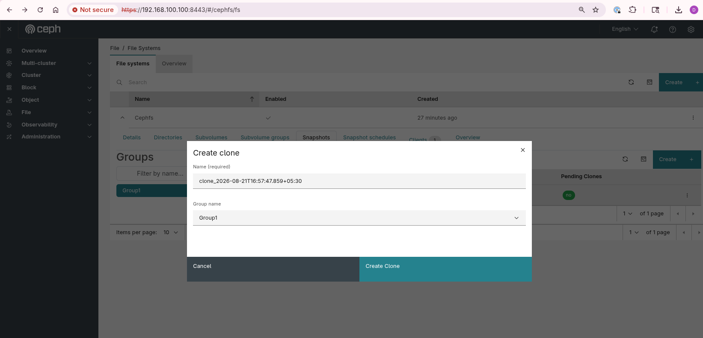
*Figure: Clone a subvolume snapshot*

---

## 6. Snapshot Schedules

The **Snapshot schedules** tab automates snapshot creation on a recurring basis. Enable the `snapshot_scheduler` module if prompted, then create a schedule with directory path, start date/time, frequency, and retention policy.

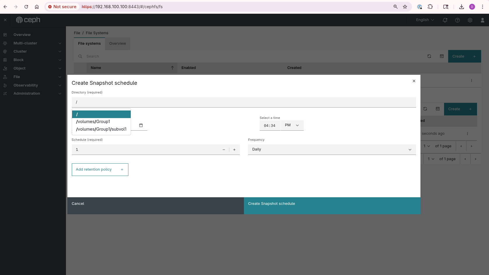
*Figure: Snapshot schedules — path, frequency, and retention*

---

## 7. Dashboard Highlights

- **End-to-end CephFS workflow**: Manage volumes, subvolume groups, subvolumes, and snapshots from **File > File Systems**.
- **Quota-ready subvolumes**: Set size limits at group and subvolume level from the UI.
- **Data protection**: Create snapshots, clones, and scheduled backups without leaving the Dashboard.
- **Reduced CLI overhead**: Common `ceph fs volume`, subvolume, and snapshot operations are available as guided forms.

---

## Conclusion

The Ceph Dashboard provides a practical interface for day-to-day CephFS administration. Whether provisioning isolated subvolumes for tenants, organizing storage with subvolume groups, or protecting data with snapshots and schedules, administrators can manage the full lifecycle from **File > File Systems**.

Explore **File > File Systems** to create a volume, add subvolumes, and configure snapshots for your workloads.