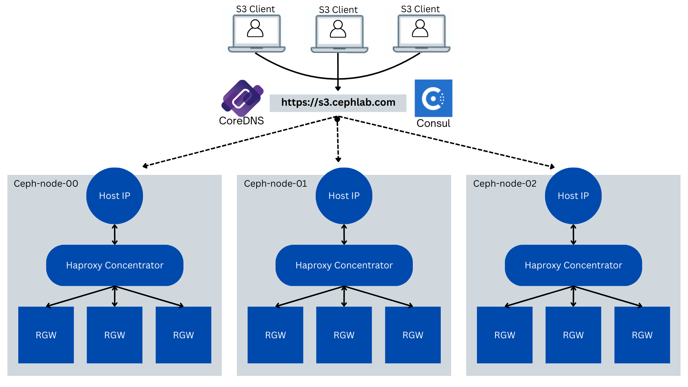
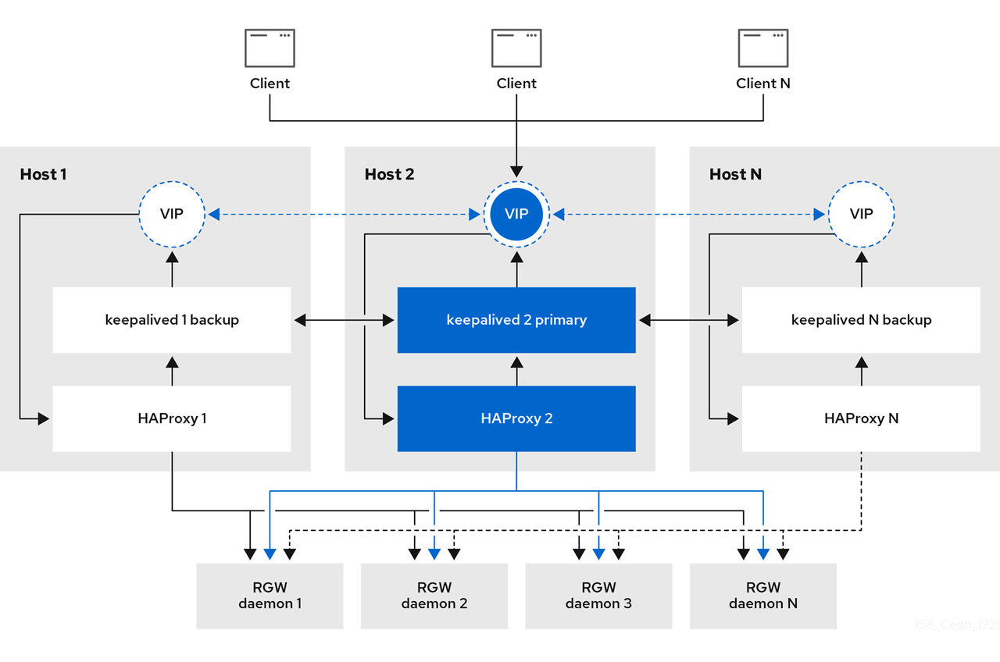
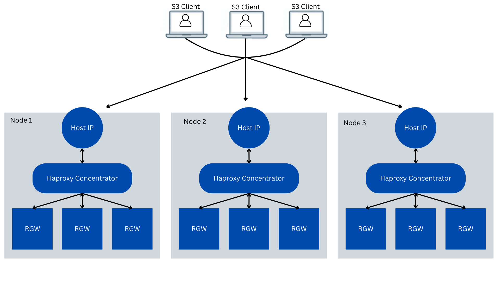
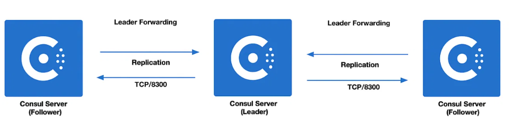

## Part 1: Dynamic Load Balancing for S3 with Ceph Ingress Concentrators and Consul

Note: this series of articles describes functionality that is expected to be
available an upcoming Tentacle dot release.

As object storage deployments grow, maintaining high availability and resilient
access to S3-compatible endpoints becomes increasingly complex. Traditional load
balancers are often centralized, statically configured, and unaware of backend
health. They can introduce performance bottlenecks, operational overhead, and
single points of failure. These limitations are especially problematic in
distributed or scale-out environments, where services must adapt to topology
changes and failures in real time.

Ceph Tentacle introduces ingress concentrators: per-node HAProxy services
deployed via `cephadm`. Each terminator fronts a local pool of Object Gateway
(RGW) daemons, allowing every Ceph node to act as an S3 ingress point. This
distributed design improves fault tolerance and simplifies scaling by localizing
traffic handling.

Ingress Concentrators alone don’t provide dynamic routing or automatic failover.
That’s where HashiCorp Consul and CoreDNS come in. By integrating Consul’s
service discovery and health checks with CoreDNS’s programmable DNS, we can
enable intelligent, health-aware load balancing — all without relying on static
configuration or external DNS infrastructure.



In this post, you'll learn how to:

* Understand and deploy Ceph ingress Concentrators
* Register and monitor them dynamically using Consul
* Integrate CoreDNS to enable DNS-based health-aware routing
* Validate routing logic and failover scenarios

### Why Static Load Balancing Falls Short

A common starting point for Ceph Object Gateway (RGW) deployments involves placing
one or two HAProxy instances in front of a set of gateway daemons. Often, these
HAProxy services are paired with Keepalived to create a shared virtual IP (VIP),
providing basic high availability. While this approach is functional, it quickly
reveals limitations as object storage environments grow:

* **Centralized bottleneck**: With a single VIP, all S3 traffic is funneled through one
node and daemon at a time. This becomes a scalability and performance bottleneck,
particularly under heavy workloads.

* **Manual load distribution**: While you can configure multiple VIPs across nodes,
clients must be explicitly directed to spread requests across them. This
typically requires either custom logic in clients or static DNS round-robin
entries, neither of which adapts automatically to node health or cluster changes.

* **Lack of service awareness**: Traditional DNS and VIP failover mechanisms operate
at the network layer. They don’t natively detect whether individual Ceph Object
Gateway (RGW) daemons are responsive or healthy. If a node is reachable but the
RGW service is degraded or unresponsive, clients may still be routed to it.

* **Operational friction**: Adding or removing gateway nodes often involves
reconfiguring HAProxy and DNS records, which introduces downtime risk and
complicates automation workflows.

To scale efficiently and provide resilient S3 access, we need a distributed
ingress model that can adapt to topology changes, automatically detect service
health, and dynamically direct client requests. This is where the combination of
Ceph ingress Concentrators, Consul, and CoreDNS provides a modern, flexible alternative.

### Cephadm Ingress and Concentrators

#### The Traditional Ceph Ingress Architecture

As part of the orchestration layer in Ceph, ``cephadm`` offers built-in support
for deploying ingress services. This provides a convenient and production-ready
way to place a load balancer, typically HAProxy, in front of a set of
Ceph Object Gateway (RGW) daemons.

The Ceph Ingress Service behaves like a standard load balancer setup: it runs a
centralized HAProxy service (paired with Keepalived for high availability) that
distributes traffic across multiple RGWs. Ceph automatically generates the HAProxy
configuration and targets all RGW instances registered to a specific service. This
model works well in many environments. For example:

* When you prefer centralized traffic control and don’t need node-level ingress.

* When you want to expose a single external VIP to clients and manage TLS termination centrally.

* When your number of RGWs is relatively static, or when changes are well managed through automation.



Here's an example of such a setup:

```
service_type: rgw
service_id: foo
placement:
  label: rgw
  count_per_host: 2
spec:
  rgw_frontend_port: 8080
```

This configuration will deploy two RGW daemons on each node with the ``rgw`` label.
The first will listen on port: 8080, the second on 8081. An ingress HAProxy service
(defined separately) can be layered on top, forwarding client traffic to all backend
RGWs in the cluster.

However, as object storage environments grow, especially in large-scale or
edge-distributed scenarios, centralized load balancing can introduce operational complexity:

* Network traffic must traverse multiple hops, reducing locality.

* A single VIP means a single logical bottleneck unless you introduce multiple
  entry points and external load balancing logic.

* Dynamic scaling of RGWs may still require updating client-facing load balancers or
  external DNS.

#### Ceph Tentacle new feature: Ingress Concentrators



Ceph Tentacle will support concentrators, a new feature in ``cephadm`` that deploys
per-node ingress concentrators. A concentrator is a local HAProxy instance that
runs on each Ceph node and acts as a concentrator for the node's local RGW daemons.
It provides a single ``IP:PORT`` endpoint per host and automatically balances
traffic across the RGWs on that same node.

This brings several advantages:

* Traffic locality: Each HAProxy only routes to local RGWs.

* Simplified Gateway scaling: Increase the count_per_host and the local
  HAProxy updates automatically.

* No need for Keepalived: Each node serves its traffic. Failover happens
  naturally at the DNS layer (more on this when we integrate Consul).

* Here’s an example of a terminator-enabled RGW service configuration:

```
service_type: rgw
service_id: client
service_name: rgw.client
placement:
  label: rgw
  count_per_host: 2
networks:
  - 192.168.122.0/24
spec:
  rgw_frontend_port: 8088
  rgw_realm: multisite
  rgw_zone: madrid
  rgw_zonegroup: europe
  zonegroup_hostnames:
    - s3.cephlab.com
  concentrator: haproxy
  concentrator_frontend_port: 8080
  concentrator_monitor_port: 1967
  concentrator_monitor_user: admin
```

With this configuration:

* Each host with the ``rgw`` placement label runs two Object Gateway daemons:
  one on 8088, another on 8089.

* A local HAProxy concentrator listens on: 8080, forwarding traffic only to the
  local node RGWs.

The HAProxy monitor port (``1967``) is used to expose local health status,
which we’ll later integrate into Consul for DNS-aware load balancing.

<blockquote>
Note:
This setup focuses on DNS-based routing and service awareness. It does not cover
SSL/TLS termination. In a production deployment, TLS should be terminated at the
Ceph Object Gateway (RGW) level.

To support virtual-host-style S3 access (e.g.,
``https://bucket1.s3.cephlab.com)``, your RGW TLS certificate must include
a Subject Alternative Name (SAN) entry for ``*.s3.cephlab.com``.
</blockquote>

### Dynamic DNS-Based Load Balancing with Consul


To route S3 traffic intelligently based on service health and node availability,
we need more than traditional DNS. This is where [HashiCorp Consul](https://www.consul.io/)
comes in.

Consul is a distributed service mesh and service discovery tool. At its core,
it provides:

* A control plane for registering services
* Built-in health checks
* DNS-based service discovery with support for real-time updates

By integrating Consul into our Ceph cluster, we can dynamically answer DNS
queries like: ``s3.cephlab.com`` with a list of healthy ingress nodes,
updated in real-time. This enables distributed, load-balanced access to
S3 endpoints, without the need for an external load balancer or static DNS configuration.

#### Why Consul?

In our case, each node in the Ceph cluster runs a local HAProxy concentrator as a
terminator for its Ceph Object Gateway (RGW) daemons. We want these endpoints to be:

* Automatically registered as services
* Continuously monitored for health
* Returned via DNS only when healthy

Consul handles all of this through its agent-based architecture.

### Control Plane and Quorum

Consul operates in a distributed mode. It requires a quorum of server agents (typically
3 or 5) to function as the control plane. These servers maintain cluster state and
perform leader elections.

Every participating node (e.g. an RGW node) also runs a Consul agent, which
communicates with the control plane and performs local tasks such as registering
services and running health checks.

In small clusters, the same nodes can act as both server and agent. For our
example, we will deploy three Consul agents in server mode, each running inside
a cephadm-managed container. These will form the core control plane and also
register the local HAProxy ingress services.



We will use the following nodes for Consul:

* ``ceph-node-00`` → ``192.168.122.12``
* ``ceph-node-01`` → ``192.168.122.179``
* ``ceph-node-02`` → ``192.168.122.94``

Each of these nodes is also running a local Ceph Object Gateway (RGW) and a
corresponding HAProxy concentrator. So each node will:

* Run a Consul server agent.
* Register its own local HAProxy (ingress terminator).
* Perform a health check on the HAProxy monitor port.
* Join the Consul cluster for service propagation.

Next, we’ll walk through configuring the Consul agents, deploying them as
containers using ``cephadm``, and validating that they’re correctly
advertising healthy ingress services.

### Step 1: Configure Consul on our Ceph Nodes with Cephadm

On each of the three Ceph nodes, place a file of the following form
at ``/etc/consul.d/consul.hcl``. This example shows the contents for
the host ``ceph-node-00 (192.168.122.12)``:

```
datacenter = "madrid"
data_dir = "/opt/consul"
bind_addr = "192.168.122.12"
client_addr = "0.0.0.0"
retry_join = [
  "192.168.122.12",
  "192.168.122.179",
  "192.168.122.94"
]
server = true
bootstrap_expect = 3

services = [
  {
    name = "ingress-rgw-s3"
    port = 8080
    check = {
      id       = "http-check"
      name     = "HAProxy Check"
      http     = "http://192.168.122.12:1967/health"
      interval = "10s"
      timeout  = "2s"
    }
  }
]
```

Be sure to adjust ``bind_addr`` and the HAProxy health check URL for each node.

### Deploy Consul via Cephadm custom containers

Create the following ``consul.yml`` Ceph service spec file on ``ceph-node-00``:

```
service_type: container
service_id: consul
placement:
  hosts:
    - ceph-node-00
    - ceph-node-01
    - ceph-node-02
spec:
  image: docker.io/hashicorp/consul:latest
  entrypoint: '["consul", "agent", "-config-dir=/consul/config"]'
  args:
    - "--net=host"
  ports:
    - 8500
    - 8600
    - 8300
    - 8301
    - 8302
  bind_mounts:
    - ['type=bind','source=/etc/consul.d','destination=/consul/config', 'ro=false']

```

And apply it using the ``ceph orch apply`` command:

```
$ ceph orch apply -i consul.yml
```

Verify that the Consul services/containers have started:

```
$ ceph orch ps --daemon_type container
NAME                            HOST          PORTS                                                STATUS         REFRESHED  AGE  MEM USE  MEM LIM  VERSION    IMAGE ID      CONTAINER ID  
container.consul.ceph-node-00   ceph-node-00  *:8500,8600,8300,8301,8302,8500,8600,8300,8301,8302  running (20h)     5m ago  20h    35.8M        -  <unknown>  ee6d75ac9539  78753a2f9a4a  
container.consul.ceph-node-01   ceph-node-01  *:8500,8600,8300,8301,8302,8500,8600,8300,8301,8302  running (20h)     7m ago  20h    37.6M        -  <unknown>  ee6d75ac9539  68bb749e0022  
container.consul.ceph-node-02   ceph-node-02  *:8500,8600,8300,8301,8302,8500,8600,8300,8301,8302  running (20h)     7m ago  20h    35.5M        -  <unknown>  ee6d75ac9539  b42ea94cd403
```

Check that all Consul containers are running and have joined the cluster:

```
$ podman exec -it $(podman ps |grep consul| awk '{print $1}') consul members
Node          Address               Status  Type    Build   Protocol  DC      Partition  Segment
ceph-node-00  192.168.122.12:8301   alive   server  1.21.4  2         madrid  default    <all>
ceph-node-01  192.168.122.179:8301  alive   server  1.21.4  2         madrid  default    <all>
ceph-node-02  192.168.122.94:8301   alive   server  1.21.4  2         madrid  default    <all>
```

Confirm Consul registered services:

```
$ podman exec -it $(podman ps |grep consul| awk '{print $1}') consul catalog services
consul
ingress-rgw-s3
```

Check which nodes are serving the ingress service:

```
$ podman exec -it $(podman ps |grep consul| awk '{print $1}') consul catalog nodes -service ingress-rgw-s3
Node          ID        Address          DC
ceph-node-00  cdd2e96c  192.168.122.12   madrid
ceph-node-01  ac868e52  192.168.122.179  madrid
ceph-node-02  d16446b3  192.168.122.94   madrid
```

### Conclusion. A Foundation for Health-Aware Ingress with Consul

In this first part, we addressed a critical challenge for scalable S3
deployments on Ceph: how to build a fault-tolerant, dynamic, and
decentralized ingress layer that adapts automatically to node and service health.

By leveraging:

* Ingress terminators, deployed per node via ``cephadm``
* HAProxy concentrators, routing only to local RGW daemons
* HashiCorp Consul, providing distributed service registration and health monitoring

…we’ve laid the groundwork for a robust, health-aware access layer. Each Ceph node
now serves as an intelligent ingress point, dynamically tracked by Consul and
exposed through its built-in DNS interface.

But Consul alone isn’t enough. Most applications and S3 clients don’t search for
a ``.consul`` DNS domain or port ``8600``, and they need to resolve names
like ``mybucket.s3.cephlab.com`` using standard DNS mechanisms. Without a DNS
bridge, this dynamic service awareness remains confined within the Consul ecosystem.

### Coming Up in Part 2. Bridging DNS and Enabling Virtual-Host Buckets with CoreDNS

In the next part of this blog series, we’ll:

* Introduce CoreDNS as a programmable DNS bridge between clients and Consul
* Deploy CoreDNS containers using ``cephadm`` custom containers on each node for high availability
* Configure DNS rewrites to support virtual-host-style S3 access
* Integrate enterprise DNS through stub zone delegation
* Validate that clients receive only healthy endpoints using DNS tools
* Simulate a node failure and demonstrate transparent access for the clients.

Continue to [Part 2: Bridging DNS to Ceph Ingress with CoreDNS](https://ceph.io/en/news/blog/2025/consul-lb2/)


The authors would like to thank IBM for supporting the community with our time to create these posts.
