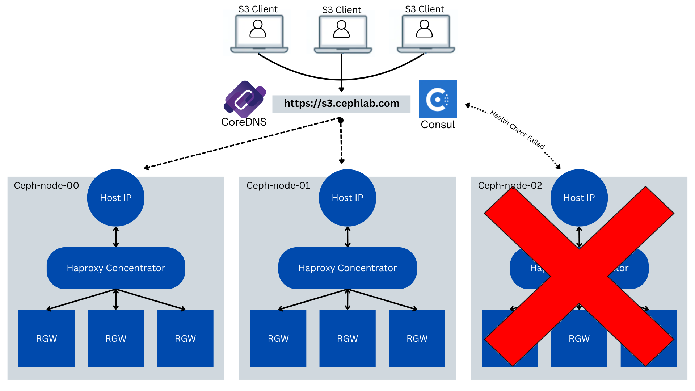

## Part 2: Seamless DNS Routing with CoreDNS and Virtual-Host Style Bucket Access

Note: this series of articles describes functionality that is expected to be
available an upcoming Tentacle dot release.

In [Part 1](https://ceph.io/en/news/blog/2025/consul-lb1/), we laid the foundation
for dynamic, health-aware S3 ingress by deploying per-node Ingress HAProxy
concentrators within a Ceph cluster integrating them with Consul for real-time
service registration and health monitoring. Each node now acts as an independent
ingress point, and Consul continuously tracks their availability.

### What is CoreDNS?

CoreDNS is a flexible and extensible DNS server, written in Go and widely adopted
across cloud-native environments. It is the default DNS service in Kubernetes
(including OpenShift), where it handles dynamic service resolution based on pod
and service metadata.

CoreDNS can serve traditional DNS zone files, act as a forwarder, perform DNS
rewrites, and even integrate with external sources including etcd, Consul, and Vault.

In our case, CoreDNS is the glue between standard DNS clients and Consul’s
service-aware DNS backend.


### The Problem CoreDNS Solves in our Deployment

Without CoreDNS, clients trying to resolve ``s3.cephlab.com`` would need to:

* Know about ``.consul`` as a DNS top-level domain (TLD)
* Talk to Consul over port 8600 (which many libraries and resolvers don’t support)
* Accept DNS responses that don’t match the hostname they requested (breaking
  S3-style virtual host access)

CoreDNS solves this cleanly by:

* Listening on port 53, so clients don’t need to change their DNS settings
* Forwarding specific domains (like ``s3.cephlab.com``) to Consul on TCP port ``8600``
* Rewriting queries and responses so they remain compatible with S3 SDK expectations

For example, a client querying ``mybucket.s3.cephlab.com`` will be transparently directed
to the Consul service ``ingress-rgw-s3.service.consul``, and the response will be
rewritten back to ``mybucket.s3.cephlab.com``, preserving DNS validation in tools
including the AWS CLI or SDKs.

### Enabling Virtual-Host-Style Bucket Access
Many S3-compatible tools and SDKs
use [virtual-host-style addressing](https://ceph.io/en/news/blog/2025/simplifying-object-new-cephadm/)
where the bucket name appears in the hostname:

```bash
GET https://mybucket.s3.cephlab.com
```

Instead of:

```bash
GET https://s3.cephlab.com/mybucket
```

This is particularly important for S3 V4 signatures, which include the hostname
in the signature calculation. If the DNS response doesn’t match the requested
name exactly, authentication may fail.

Our CoreDNS configuration handles this via DNS rewrite rules, mapping ``*.s3.cephlab.com``
to the Consul service ``ingress-rgw-s3.service.consul``, and vice versa for the
response. This enables virtual-host-style access across all healthy nodes, with no
additional configuration on the client side.

### High Availability with Per-Node CoreDNS Containers

As we did with Consul, we’ll run CoreDNS on the same three Ceph nodes:

* ``ceph-node-00`` → ``192.168.122.12``
* ``ceph-node-01`` → ``192.168.122.179``
* ``ceph-node-02`` → ``192.168.122.94``

Each node runs a CoreDNS container via ``cephadm``. These services:

* Listen on port 53 (standard DNS)
* Serve the ``cephlab.com`` zone from a zone file
* Forward ``*.s3.cephlab.com`` queries to Consul on TCP port 8600
* Handle DNS rewrites transparently

With this setup, DNS resolution remains distributed and highly available. Any
Ceph node can resolve S3 bucket names locally and route clients to healthy
ingress endpoints registered in Consul.

### Integrating with Enterprise DNS via Stub Zones

In an enterprise environment ``s3.cephlab.com`` is unlikely to be the root
DNS domain. More likely, Active Directory, BIND, Infoblox, or a cloud DNS
provider manages your primary DNS.

To make CoreDNS part of that ecosystem, we configure the enterprise DNS to
delegate the ``s3.cephlab.com`` subdomain to our CoreDNS nodes. This is commonly
done using stub zones or conditional forwarding.

For example:

The authoritative DNS server for ``cephlab.com`` delegates ``s3.cephlab.com`` to:

* ``192.168.122.12``
* ``192.168.122.179``
* ``192.168.122.94``

Once this delegation is in place, all client queries for ``*.s3.cephlab.com``
will be handled by CoreDNS, which transparently maps them to the healthy ingress
nodes registered in Consul.

This allows enterprise clients to benefit from dynamic, health-aware DNS load
balancing, without needing to run Consul on every client or modify their DNS resolvers.

### CoreDNS File Structure

On each node where CoreDNS is going to run, we will have two files: ``Corefile``
for configuration and ``cephlab.com`` for a static zone:

```
/etc/coredns/Corefile
/etc/coredns/cephlab.com
```

CoreDNS configuration lives in ``/etc/coredns/Corefile``. For example, we are
forwarding to a public resolver ``8.8.8.8``, but you could configure your
upstream enterprise DNS here for internal resolution.

```
.:53 {
    log
    errors
    forward . 8.8.8.8
}

cephlab.com {
    file /etc/coredns/cephlab.com
    prometheus
    errors
    log
    debug
}

consul {
  forward . 192.168.122.12:8600 192.168.122.179:8600 192.168.122.94:8600
  log
  errors
}

s3.cephlab.com {
    rewrite stop {
        name exact s3.cephlab.com ingress-rgw-s3.service.consul.
        answer name ingress-rgw-s3.service.consul. s3.cephlab.com.
    }
    rewrite stop {
        name regex (.*)\.s3\.cephlab\.com ingress-rgw-s3.service.consul.
        answer auto
    }
    forward . 192.168.122.12:8600 192.168.122.179:8600 192.168.122.94:8600
    log
    errors
    debug
}
```

Not relevant for this example, but here is also a static file to manage the ``cephlab.com` zone:

```
$ORIGIN cephlab.com.
@       3600 IN SOA ns.cephlab.com. admin.cephlab.com. (
                2017042745 ; serial
                7200       ; refresh
                3600       ; retry
                1209600    ; expire
                3600       ; minimum
                )
        3600 IN NS ns.example.com.
ns.cephlab.com IN A 127.0.0.1
ceph-node-00 IN A 192.168.122.12
ceph-node-01 IN A 192.168.122.179
ceph-node-02 IN A 192.168.122.94
```

Copy the files to the other nodes, as we want to run three CoreDNS instances for HA:

```
for i in 00 01 02 ; do scp -pr /etc/coredns/* ceph-node-$i:/etc/coredns ; done
```

Deploy CoreDNS via the cephadm custom containers feature. This is our example spec
for the Coredns containers:

```
# core-dns.yaml
service_type: container
service_id: coredns
placement:
  hosts:
    - ceph-node-00
    - ceph-node-01
    - ceph-node-02
spec:
  image: docker.io/coredns/coredns:latest
  entrypoint: '["/coredns", "-conf", "/etc/coredns/Corefile"]'
  args:
    - "--net=host"
  ports:
    - 53
  bind_mounts:
    - ['type=bind','source=/etc/coredns/Corefile','destination=/etc/coredns/Corefile', 'ro=false']
```

Apply the cephadm spec and check that the services have started successfully:

```
$ ceph orch apply -i core-dns.yaml
$ ceph orch ps --daemon_type container | grep core
container.coredns.ceph-node-00  ceph-node-00  *:53,53                                              running (25h)     7m ago  25h    13.8M        -  <unknown>  0392ee038903  feaa8305273a  
container.coredns.ceph-node-01  ceph-node-01  *:53,53                                              running (24h)    10m ago  24h    12.0M        -  <unknown>  0392ee038903  c86ee93dab60  
container.coredns.ceph-node-02  ceph-node-02  *:53,53                                              running (24h)    10m ago  24h    12.1M        -  <unknown>  0392ee038903  06b73ad257ca
```

### Validating DNS-Based Load Balancing

With CoreDNS and Consul in place, your DNS queries for ``s3.cephlab.com``
(or any bucket-style subdomain like ``bucket1.s3.cephlab.com``) should now
resolve dynamically to only healthy Ceph nodes. Each of these nodes runs a
local HAProxy concentrator, which routes traffic to local Ceph
Object Gateway (RGW) daemons.

Let’s walk through how to verify that DNS is functioning correctly and
load-balancing client requests as expected.

#### Step 1: Resolve the S3 Endpoint with dig

On our client node, where we will be connecting to the S3 endpoint to work with
Object Storage, we have configured the DNS servers with the IPs for our three
ceph nodes where CoreDNS is running:

```bash
$ cat /etc/resolv.conf
Generated by NetworkManager
nameserver 192.168.122.12
nameserver 192.168.122.179
nameserver 192.168.122.94
```

We’ll first use ``dig`` to directly query one of the CoreDNS servers running on
your Ceph nodes. This will confirm that the DNS rewrites are working and that the
Consul-registered service ingress-rgw-s3 is returning healthy IP addresses.

```bash
$ dig @192.168.122.12 s3.cephlab.com
;; ANSWER SECTION:
s3.cephlab.com. 0 IN A 192.168.122.179
s3.cephlab.com. 0 IN A 192.168.122.12
s3.cephlab.com.    0 IN A 192.168.122.94
```

```bash
$ getent hosts test.s3.cephlab.com
192.168.122.12  test.s3.cephlab.com
192.168.122.94  test.s3.cephlab.com
192.168.122.179 test.s3.cephlab.com
```

This shows that DNS is resolving to three healthy nodes, based on the current
Consul health checks. ``getent hosts`` queries the system's resolver, which
points to CoreDNS listening on port 53.

This confirms that the virtual-host-style DNS resolution is working. The query
is resolved through CoreDNS, which rewrote ``test.s3.cephlab.com``
to the ``ingress-rgw-s3`` Consul service, which returns only healthy endpoints.

#### Step 2: Check Load Balancing Distribution

To validate that round-robin load balancing is working across the healthy nodes,
let’s perform 100 sequential queries and count which IP address was returned
first most often. This is a simple way to test the effectiveness of the
DNS-level distribution across your ingress points.

```bash
$ for i in {1..100}; do getent hosts s3.cephlab.com | awk '{print $1}' | head -n1; done | sort | uniq -c | sort -nr     
     37 192.168.122.179
     34 192.168.122.94
     29 192.168.122.12
```

This shows a fairly even distribution across three Ceph nodes, demonstrating that
CoreDNS (backed by Consul) is providing round-robin results, and the system
resolver is consuming those in a balanced way.

This confirms that:

* DNS queries are returning only healthy nodes

* Load balancing is functioning correctly across nodes

* Your CoreDNS + Consul setup is dynamically and intelligently routing traffic

### Validating Request Distribution with an S3 Client and RGW Ops Logs

Now that we've confirmed DNS-based load balancing works at the resolution level,
it's time to validate that actual S3 operations are being distributed across
Ceph Object Gateway (RGW) endpoints as expected.

To do this, we’ll enable RGW Ops Logs, which provide detailed information about
incoming S3 requests, including the RGW daemon that handled each one. We'll then
run a few S3 operations using the AWS CLI and inspect the logs to see which RGWs
were used.

This approach gives us concrete visibility into how CoreDNS and Consul are
affecting real client traffic.

#### Step 1: Enable Ops Logging in Ceph

To capture S3 operations, enable RGW ops logs and ensure they’re written to files.
These settings can be applied directly using the ``ceph config`` CLI:

```bash
$ ceph config set client.rgw rgw_enable_ops_log true
$ ceph config set client.rgw rgw_ops_log_rados false
$ ceph config set global log_to_file true
$ ceph config set global mon_cluster_log_to_file true
$ ceph orch restart client.rgw
```

#### Step 2: Run a Few S3 Operations

Use the AWS CLI (or any compatible S3 client) to list your buckets and upload
an object through the load-balanced endpoint:

```bash
$ aws --profile test --endpoint http://s3.cephlab.com:8080 s3 ls
$ aws --profile test --endpoint http://s3.cephlab.com:8080 s3 ls
$ aws --profile test --endpoint http://s3.cephlab.com:8080 s3 cp /etc/hosts s3://bucket1/
```

These requests will be routed through CoreDNS and Consul to a healthy ingress node,
and forwarded by HAProxy to one of the local RGW daemons on that node.

#### Step 3: Inspect the Ops Logs

Each RGW daemon has its own opslog file. You can enable dashboard centralized
logging. In our case, we're using a script to centralize the logs on one node.
Here is the output:

```
2025-08-19T11:44:19.296500Z  192.168.122.12  list_buckets   GET / HTTP/1.1               ceph-node-00-RGW5
2025-08-19T11:47:29.213482Z  192.168.122.12  list_buckets   GET / HTTP/1.1               ceph-node-00-RGW6
2025-08-19T12:50:32.375753Z  192.168.122.12  put_obj        PUT /bucket1/hosts HTTP/1.1  ceph-node-00-RGW5
```

* HAProxy received the requests on ``ceph-node-00`` (``192.168.122.12``).

* The load was distributed between ``rgw5` and ``rgw6``, the two Object Gateway
  daemons running locally on that node.

* The PUT operation confirms that object uploads are also being routed through the dynamic DNS path.

### Simulating Node Failure and Observing Dynamic Recovery

With Consul and CoreDNS in place, our DNS-based load balancing is now aware of
service health. Let’s test how the system behaves when an ingress node fails,
and how traffic automatically reroutes to the remaining healthy nodes, with no
manual intervention.

This scenario validates that:

* Consul health checks are actively monitoring ingress services.
* DNS answers only include healthy nodes.
* Clients continue accessing the S3-compatible service without disruption.
* Node recovery triggers automatic reintegration into DNS.



We’ll simulate a failure stopping a Ceph node through the hypervisor manager
(in this case, ``kcli``), but the behavior would be identical in any
real-world BM failure scenario, whether due to hardware, power, or maintenance.

#### Step 1: Simulate Failure of an Ingress Node

Let’s stop ``ceph-node-00``, which currently hosts HAProxy and Ceph Object Gateway
(RGW) daemons.

```bash
$ kcli stop vm ceph-node-00
```

This immediately removes the node from the network. Consul will detect the missing
service via its failed health check.

After a few seconds, we can verify that CoreDNS (backed by Consul) no longer
includes ``ceph-node-00`` in its DNS responses.

```bash
$ getent hosts s3.cephlab.com
192.168.122.179 s3.cephlab.com
192.168.122.94  s3.cephlab.com
```

As expected, ``192.168.122.12 (ceph-node-00)`` is no longer returned, because
its HAProxy health check failed and Consul deregistered it.

#### Step 2: Continue Accessing S3

Let’s now perform a normal S3 operation using the same load-balanced endpoint.
Despite one node being down, traffic should route to healthy nodes transparently.

```bash
$ aws --profile test --endpoint http://s3.cephlab.com:8080 s3 ls
```

#### Step 3: Check Which RGW Handled the Request

We can now check the RGW ops logs to see which node processed the S3 request.
Example ops log output:

```
2025-08-19T15:24:54.179558Z  192.168.122.94  list_buckets   GET / HTTP/1.1               ceph-node-02-RGW1
2025-08-19T15:27:03.889488Z  192.168.122.94  list_buckets   GET / HTTP/1.1               ceph-node-02-RGW1
```

As we can see, requests are now routed to ``ceph-node-02``, which is healthy
and running its local HAProxy and RGW services.

#### Step 4: Restore the Failed Node

Let’s now bring back ``ceph-node-00`` and verify that
it automatically rejoins the cluster and DNS responses.

```bash
$ kcli start vm ceph-node-00
```

Consul will re-register the local ingress service after the health check passes.
A few seconds later, let’s re-run the DNS query:

```bash
$ getent hosts s3.cephlab.com
192.168.122.94  s3.cephlab.com
192.168.122.12  s3.cephlab.com
192.168.122.179 s3.cephlab.com
```

Everything is working as expected!, The node is back online and healthy, and
automatically reintegrated into the load balancing pool. No manual DNS update,
failback, or cluster reconfiguration required.

### Conclusion. Modernizing S3 Load Balancing with Consul and CoreDNS

As storage environments scale, especially those serving high-throughput,
S3-compatible workloads, traditional load balancing methods begin to show
their limits. Static HAProxy stacks and fixed VIPs are reliable for smaller
clusters but quickly become operational bottlenecks when dealing with failure
domains, elasticity, and traffic distribution at scale.

By combining:

* Ingress terminators (HAProxy concentrators) per node.
* Consul for dynamic, health-aware service discovery.
* CoreDNS for DNS-based routing and virtual-host bucket support.

We’ve built a distributed, self-healing, and highly scalable solution that
meets modern object storage demands.


Continue to [Part 3: Consul-Powered Global Load Balancing for Ceph Object Gateway (RGW)](https://ceph.io/en/news/blog/2025/consul-lb3/)


The authors would like to thank IBM for supporting the community with our time to create these posts.
