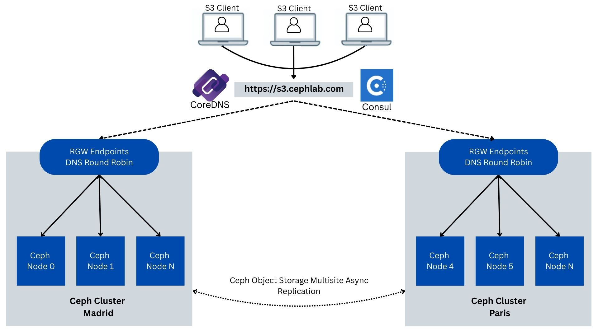
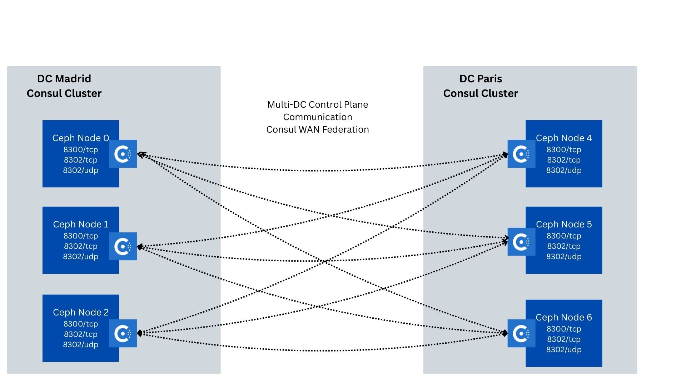
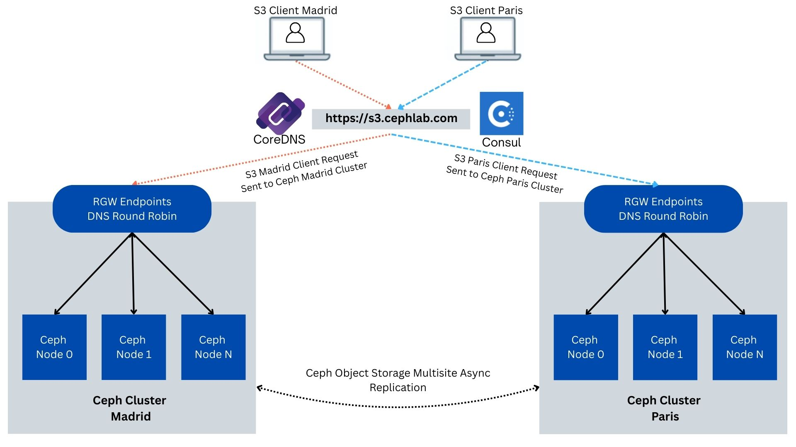
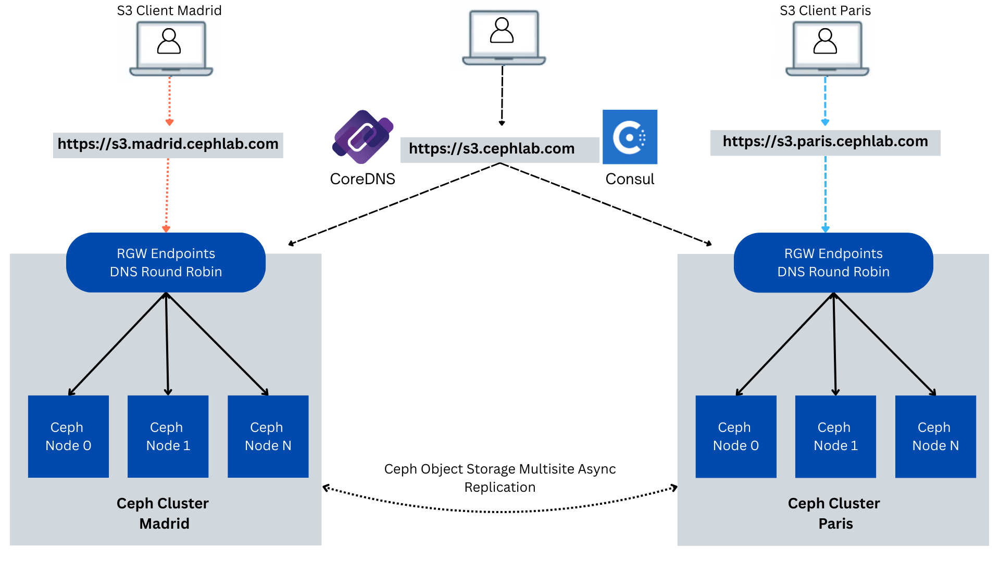

## Part3. Consul-Powered Global Load Balancing for Ceph Object Gateway (RGW)

Note: this series of articles describes functionality that is expected to be
available an upcoming Tentacle dot release.

### Introduction

In Parts one and two of the series, we built local, per-data-center health-aware
load balancing for the Ceph Object Gateway (RGW) using cephadm ingress terminators,
Consul service discovery, and CoreDNS rewrites.

In Parts three and four, we combine Ceph Object Multisite
(active/active data replication between Madrid and Paris Data Centers)
with a Consul global load-balancing control plane, ensuring that the single S3
endpoint always routes to the closest healthy ingress and fails over across
sites when needed, without requiring any client URL or SDK changes. Each site
remains independent (its own control plane and Ceph cluster), while co-operating
over the WAN so client requests always land on a healthy site.

In this post, we start with a clear architecture walkthrough of how data
replication, per-node ingress, and a service-aware control plane fit
together for GLB. Then we stand up Consul WAN federation (one datacenter per
site) and define a single shared S3 prepared query that encodes our policy:
prefer local, fall back to the peer only if necessary. We’ll validate the
behavior end-to-end via the Consul API and Consul DNS on port ``8600``
(no client-facing DNS changes yet), and close with a few operational hardening notes.

### High-Level Architecture Overview

This solution combines three layers so clients can reach the Ceph Object
Gateway (RGW) reliably from either site. First, Ceph Object Multisite keeps data
replicated and available in both locations. We run one zonegroup named Europe with
two zones, Madrid and Paris. Objects replicate in both directions (active/active
for data). The metadata replication is coordinated at the zonegroup master
(active/passive for metadata such as buckets and users). This means either site
can serve object reads and writes; metadata changes are made at the master and
then propagated to the peer.

Second, cephadm ingress terminators place an HAProxy in front of the RGWs on every
node. Requests that reach a site are handled locally by that site’s HAProxy and RGWs,
which improves performance and removes single points of failure inside the site.

Third, service-aware DNS steers clients to healthy entry points. Each site runs
Consul and CoreDNS. Consul continuously checks the health of each HAProxy and
keeps a catalog of which ones are available in that site. The two Consul data
centers are connected over the WAN, so during a problem, a site can request
healthy endpoints from its peer. CoreDNS presents a standard DNS interface on TCP
port 53 for your domain (for example, ``cephlab.com``). It rewrites the public
name ``s3.cephlab.com`` to an internal Consul lookup, forwards the question to
the local Consul DNS, then rewrites the answers back. Applications continue
to use a stable URL while the system quietly selects healthy gateways.



At a high level, the workflow is simple:

1. A client resolves ``s3.cephlab.com`` using the nearest CoreDNS (each site runs
   three instances for high availability).
1. CoreDNS rewrites the request to a Consul prepared query and forwards it to the
   local Consul on TCP port ``8600``.
1. Consul returns only healthy HAProxy IP addresses from the local site; if none are healthy,
   it returns healthy IP addresses from the peer site.
1. The client connects to one of those IPs on port: ``8080``, and the local HAProxy
   forwards the request to its local RGW.
1. Multisite ensures the object data is present in both sites and that metadata
   remains consistent by way of the zonegroup master.

### Ceph Replication Consistency & Replication Semantics

As noted earlier, this lab uses an active/active model for object data: clients
can write to either site. Replication between sites is asynchronous (eventually
consistent), so you should expect brief propagation delays and plan for the
resulting trade-offs. The following section outlines the key considerations
for clients/applications consuming the S3 API.

* Write conflicts: For non-versioned buckets, concurrent writes to the same key
  from different sites resolve as last-writer-wins (the most recent update
  overwrites the earlier one once replication completes). If you enable bucket
  versioning, versions are preserved, but the “current” version you see is still
  the latest committed update.
* Cross-site reads after writes: Because replication is async, a client in Site
  A may not immediately see a write performed in Site B. If you need stronger,
  read-your-writes behavior across sites, consider one or more of these patterns:
    * Prefer a single writer per key (or route all writes for a dataset to one
      site) and let others read.
    * Enable bucket versioning and read by version ID when correctness matters.
    * Use conditional requests (e.g., If-Match with a known ETag) and application
      retry logic with backoff/jitter until the expected object/version is visible.
    * Keep client affinity (stick clients to their nearest DC) to minimize cross-site
      read-after-write gaps.

If your application, workload, or use case doesn’t fit the active/active model,
Ceph Object Multisite can be configured in active/passive mode. In this layout,
a preferred site serves all client requests by default, and the secondary site
remains on standby, only taking client requests if the primary site becomes
unavailable.

### Multi-DC Consul Control Plane (WAN federation)

When you run Consul at two sites, you create one Consul data center per site.
Each data center has its own set of servers that elect a leader and store their
catalog in a local Raft database. Within a site, the agents communicate over
the LAN. Between sites, a designated number of servers also open a WAN link so
the two data centers can see each other and cooperate. The key idea is separation
with controlled sharing: day-to-day lookups stay local for speed and containment,
yet the system can deliberately reach across the WAN when the local site cannot
serve traffic.

When setting up
a [multi-datacenter](https://ceph.io/en/news/blog/2025/consul-lb3/)
Consul cluster, operators must ensure that all
Consul servers in every datacenter are directly reachable at their WAN-advertised
network address from each other, as this can be cumbersome and problematic from a
security standpoint. Operators looking to simplify their WAN deployment and minimize
the exposed security surface area can elect to join these data centers together
using [mesh gateways](https://developer.hashicorp.com/consul/docs/east-west/mesh-gateway/federation) to achieve this.



In this model, catalogs and health states are independent per site. You do not
merge sites into a single cluster. Instead, you run two clusters that trust each
other over the WAN. This keeps failure domains small and makes it clear which
site is healthy at any moment. Cross‑site behavior (for example, returning
endpoints from the other site when none are healthy locally) is an intentional
policy we will apply later.

### Prepared Queries: execution model and GLB policy

A [prepared query](https://developer.hashicorp.com/consul/docs/manage-traffic/failover/prepared-query)
is a Consul object that describes how to answer a lookup for a service. It
selects a service by name (for example, ``ingress-rgw-s3)``, filters to healthy
instances, and applies a policy that can prefer local endpoints and, if necessary,
fall back to other sites. Prepared queries are stored in Consul’s Raft state and
exposed over DNS.

Each prepared query has a DNS record of the form ``<name>.query.consul.`` and
executes queries in the data center you specify, which is usually the local
site. You can also force execution in a specific site by
using ``<name>.query.<datacenter>.consul.``. This indirection lets us keep
 hostnames stable while steering where the decision is made.

Where evaluation happens, a query executes in the datacenter of the Consul DNS
server that receives the question. That site returns only instances that are
registered and passing health checks. If there are none, the query can consult
its failover data centers list and return healthy endpoints from the appropriate
site/DC in the list.

### CoreDNS in the GLB architecture

CoreDNS sits in front of Consul and provides the DNS interface on port 53. We
run three CoreDNS instances per datacenter for high availability; each DC has
its own set of nameservers (NS) addresses, and both sets are published as NS
for the internal stub zone (for example, a delegated subdomain such as ``s3.cephlab.com``)
so resolvers can reach either site even if one is offline. Each CoreDNS serves a
small zone file for your subdomain and forwards the special .consul domain to
the local Consul DNS on TCP port ``8600``. When a client looks up the global
name ``s3.cephlab.com``, CoreDNS rewrites it to the internal prepared‑query
form (``s3.query.consul.``to execute locally), forwards the question to Consul,
and rewrites the answers back. Hence, applications and SDKs see a stable URL.



We also expose pinned per‑site names, such as ``s3.madrid.cephlab.com``
and ``s3.paris.cephlab.com``, which forces the client request to one site or the
other while still retaining failover if that site is unhealthy. This arrangement
gives you resilient DNS across sites, locality by default, deterministic routing
when you need it, straightforward latency/compliance testing, and seamless
cross‑site failover driven by Consul health checks.



### Hands-On. Consul Deployment and Setup

#### Pre-Configured assets

* Two sites (data centers): Madrid and Paris.
* Madrid servers: ``ceph-node-00 (192.168.122.12)``, ``ceph-node-01 (192.168.122.179)``, ``ceph-node-02 (192.168.122.94)``.
* Paris servers: ``ceph-node-04 (192.168.122.138)``, ``ceph-node-05 (192.168.122.175)``, ``ceph-node-06 (192.168.122.214)``.
* Cephadm ingress is deployed with HAProxy concentrators on each RGW host; each
  host monitors local RGWs on TCP port ``1967`` and fronts S3 on ``8080``.
  check out [part one](https://ceph.io/en/news/blog/2025/consul-lb1/)
  of our blog series for detailed steps on setting up this configuration.
* Ceph Object Multisite Replication is configured between the sites. You can
  check out our Ceph Multisite Async Replication blog series to get the steps
  for this configuration.
* The Ceph Object Multisite Zonegroup configuration includes the following
  subdomains as a comma-separated list in the hostnames
  section: ``s3.cephlab.com,s3.madrid.cephlab.com, s3.paris.cephlab.com``.


#### Consul: Server Agents

Before wiring up queries and DNS, we run the Consul server agents as cephadm‑managed
containers on each site’s three server nodes. Running under cephadm gives you
lifecycle management (placement, health, restart) consistent with the rest of
the cluster and, critically, keeps state persistently across restarts.

Each container bind‑mounts:

* ``/etc/consul.d`` for configuration files: ``consul.hcl``
* ``/opt/consul`` for Consul’s Raft data directory, mapped to the host’s ``/var/lib/consul``.
   This holds the catalog, leader election state, and prepared queries so they survive
   container restarts and node reboots.

##### Consul Configuration and Setup

Create the ``consul.hcl`` config file for the Madrid DC.

Place it at ``/etc/consul.d/consul.hcl` on each Madrid node, customizing
the ``bind_addr`` and the check URL per host. This file is per-node and
values differ; do not ``scp`` the same file to all nodes without editing.
Templating via Ansible or a similar tool works well for this.

```bash
ceph-node-00# mkdir -p /etc/consul.d /var/lib/consul
ceph-node-00# cat >/etc/consul.d/consul.hcl <<'EOF'
datacenter = "madrid"
data_dir = "/opt/consul"
bind_addr = "192.168.122.12"
client_addr = "0.0.0.0"
retry_join = [
  "192.168.122.12",
  "192.168.122.179",
  "192.168.122.94"
]
retry_join_wan = [
  "192.168.122.138",
  "192.168.122.175",
  "192.168.122.214"
]
server = true
bootstrap_expect = 3
enable_local_script_checks = true

services = [
  {
    name = "ingress-rgw-s3"
    port = 8080
    check = {
      id       = "http-check"
      name     = "HAProxy Check"
      http     = "http://192.168.122.12:1967/health"
      interval = "10s"
      timeout  = "2s"
    }
  tags = ["region:eu", "site:mad"]
  }
]
EOF
```

Create the ``consul.hcl`` config file for the Paris DC (adjust per node):

```bash
ceph-node-04# mkdir -p /etc/consul.d /var/lib/consul
ceph-node-04# cat >/etc/consul.d/consul.hcl <<'EOF'
datacenter = "paris"
data_dir = "/opt/consul"
bind_addr = "192.168.122.138"
client_addr = "0.0.0.0"
retry_join = [
  "192.168.122.138",
  "192.168.122.175",
  "192.168.122.214"
]
retry_join_wan = [
  "192.168.122.12",
  "192.168.122.179",
  "192.168.122.94"
]

server = true
bootstrap_expect = 3
services = [
  {
    name = "ingress-rgw-s3"
    port = 8080
    check = {
      id       = "http-check"
      name     = "HAProxy Check"
      http     = "http://192.168.122.138:1967/health"
      interval = "10s"
      timeout  = "2s"
    }
  tags = ["region:eu", "site:paris"]
  }
]
EOF
```

Below is the cephadm service spec for Consul services in Madrid. We create the
cephadm spec file and then apply the configuration with ``ceph orch apply``.

```bash
ceph-node-00# cat >consul-madrid.yml <<'EOF'
service_type: container
service_id: consul
placement:
  hosts:
    - ceph-node-00
    - ceph-node-01
    - ceph-node-02
spec:
  image: docker.io/hashicorp/consul:latest
  entrypoint: '["consul", "agent", "-config-dir=/consul/config"]'
  args:
    - "--net=host"
  ports:
    - 8500
    - 8600
    - 8300
    - 8301
    - 8302
  bind_mounts:
    - ['type=bind','source=/etc/consul.d','destination=/consul/config', 'ro=false']
    - ['type=bind','source=/var/lib/consul','destination=/opt/consul','ro=false']
EOF
```

```bash
ceph-node-00# ceph orch apply -i consul-madrid.yml

ceph-node-00# ceph orch ps --daemon_type container | grep consul
container.consul.ceph-node-00  ceph-node-00  *:8500,8600,8300,8301,8302  running (2m)  2m ago   28.1M   -  <unknown>  ee6d75ac9539  cc2c232e59a3
container.consul.ceph-node-01  ceph-node-01  *:8500,8600,8300,8301,8302  running (2m)  2m ago   23.0M   -  <unknown>  ee6d75ac9539  5127481b0f0a
container.consul.ceph-node-02  ceph-node-02  *:8500,8600,8300,8301,8302  running (2m)  2m ago   23.4M   -  <unknown>  ee6d75ac9539  b39d3f904579

ceph-node-00# podman exec -it $(podman ps | awk '/consul/ {print $1; exit}') consul members
Node          Address               Status  Type    Build   Protocol  DC      Partition  Segment
ceph-node-00  192.168.122.12:8301   alive   server  1.21.4  2         madrid  default    <all>
ceph-node-01  192.168.122.179:8301  alive   server  1.21.4  2         madrid  default    <all>
ceph-node-02  192.168.122.94:8301   alive   server  1.21.4  2         madrid  default    <all>
```

Below is the cephadm service spec for Consul services in Paris. We
follow the same steps in our Paris Ceph Cluster.

```bash
ceph-node-04# cat >consul-paris.yml <<'EOF'
service_type: container
service_id: consul
placement:
  hosts:
    - ceph-node-04
    - ceph-node-05
    - ceph-node-06
spec:
  image: docker.io/hashicorp/consul:latest
  entrypoint: '["consul", "agent", "-config-dir=/consul/config"]'
  args:
    - "--net=host"
  ports:
    - 8500
    - 8600
    - 8300
    - 8301
    - 8302
  bind_mounts:
    - ['type=bind','source=/etc/consul.d','destination=/consul/config', 'ro=false']
    - ['type=bind','source=/var/lib/consul','destination=/opt/consul','ro=false']
EOF
```

```bash
ceph-node-04# ceph orch apply -i consul-paris.yml

ceph-node-04# ceph orch ps --daemon_type container | grep consul
container.consul.ceph-node-04  ceph-node-04  *:8500,8600,8300,8301,8302  running (2m)  2m ago   22.9M   -  <unknown>  ee6d75ac9539  a1b2c3d4e5f6
container.consul.ceph-node-05  ceph-node-05  *:8500,8600,8300,8301,8302  running (2m)  2m ago   23.1M   -  <unknown>  ee6d75ac9539  b2c3d4e5f6a1
container.consul.ceph-node-06  ceph-node-06  *:8500,8600,8300,8301,8302  running (2m)  2m ago   23.0M   -  <unknown>  ee6d75ac9539  c3d4e5f6a1b2

ceph-node-04# podman exec -it $(podman ps | awk '/consul/ {print $1; exit}') consul members

Node          Address               Status  Type    Build   Protocol  DC      Partition  Segment
ceph-node-04  192.168.122.138:8301  alive   server  1.21.4  2         paris   default    <all>
ceph-node-05  192.168.122.175:8301  alive   server  1.21.4  2         paris   default    <all>
ceph-node-06  192.168.122.214:8301  alive   server  1.21.4  2         paris   default    <all>
```

Validate that the Consul WAN federation is set up and working:

```bash
ceph-node-00# podman exec -it $(podman ps | awk '/consul/ {print $1; exit}') consul members -wan

Node                 Address               Status  Type    Build   Protocol  DC      Partition  Segment
ceph-node-00.madrid  192.168.122.12:8302   alive   server  1.21.4  2         madrid  default    <all>
ceph-node-01.madrid  192.168.122.179:8302  alive   server  1.21.4  2         madrid  default    <all>
ceph-node-02.madrid  192.168.122.94:8302   alive   server  1.21.4  2         madrid  default    <all>
ceph-node-04.paris   192.168.122.138:8302  alive   server  1.21.4  2         paris   default    <all>
ceph-node-05.paris   192.168.122.175:8302  alive   server  1.21.4  2         paris   default    <all>
ceph-node-06.paris   192.168.122.214:8302  alive   server  1.21.4  2         paris   default    <all>
```

### Consul Prepared GLB Query

Create a [prepared query](https://developer.hashicorp.com/consul/api-docs/query)
named ``s3`` in both data centers. This query is the GLB "brain": it asks Consul
for endpoints of the ``ingress-rgw-s3`` service, prefers local healthy instances,
and, only when none are available/healthy, it falls back to the peer site/DC.
The prepared S3 query JSON we will be using below sets a few essential knobs
that we will explain:

* ``Service.Service``: the exact service name in the catalog (``ingress-rgw-s3``,
  as used in this guide). Change it if your service uses a different name.
* ``OnlyPassing: true``: Return only instances whose health checks are
  passing. This is what makes DNS responsess health‑aware.
* ``Near: "_agent"``: Evaluate and sort results "near" the querying Consul
  agent; in practice, this means the local data center’s servers. This gives
  you locality by default.
* ``Failover``: controls cross‑site behavior when there are no local passing instances.
    * ``NearestN: 1`` means "prefer the nearest datacenter as a group".
    * ``Datacenters: ["madrid","paris"]`` is the allowed failover set. If
      executed in Madrid and nothing is healthy locally, the Consul returns
      Paris endpoints; likewise, in Paris, it can return Madrid endpoints.
    * ``DNS.TTL: "5s"``: Short TTLs ensure clients refresh quickly during failures
      and recoveries, minimizing unnecessary churn.

This single S3 query present at both sites, ``s3.query.consul``, always executes at
the site that receives the DNS query (local first, failover if needed).

Create the S3 query JSON file and load it into Consul on both sites using a POST
request with cURL. We start with our Madrid site and ``ceph-node-00``:

```bash
ceph-node-00# cat >/var/lib/consul/s3-query.json <<'EOF'
{
  "Name": "s3",
  "Service": {
    "Service": "ingress-rgw-s3",
    "OnlyPassing": true,
    "Near": "_agent",
    "Failover": { "NearestN": 1, "Datacenters": ["madrid","paris"] }
  },
  "DNS": { "TTL": "5s" }
}
EOF

ceph-node-00# curl -i -X POST -H 'Content-Type: application/json' \
  --data-binary @/var/lib/consul/s3-query.json \
  http://127.0.0.1:8500/v1/query
HTTP/1.1 200 OK
Content-Type: application/json
Vary: Accept-Encoding
X-Consul-Default-Acl-Policy: allow
Date: Thu, 28 Aug 2025 16:56:40 GMT
Content-Length: 45

{"ID":"d5ea3072-7975-3690-5b65-f8745bcc21a6"}
```

Then we do the same for our Paris DC Consul configuration:


```bash
ceph-node-04# cat >/var/lib/consul/s3-query.json <<'EOF'
{
  "Name": "s3",
  "Service": {
    "Service": "ingress-rgw-s3",
    "OnlyPassing": true,
    "Near": "_agent",
    "Failover": { "NearestN": 1, "Datacenters": ["madrid","paris"] }
  },
  "DNS": { "TTL": "5s" }
}
EOF

ceph-node-04# curl -i -X POST -H 'Content-Type: application/json' \
  --data-binary @/var/lib/consul/s3-query.json \
  http://127.0.0.1:8500/v1/query
HTTP/1.1 200 OK
Content-Type: application/json
Vary: Accept-Encoding
X-Consul-Default-Acl-Policy: allow
Date: Thu, 28 Aug 2025 17:06:11 GMT
Content-Length: 45

{"ID":"c94d7a90-3e5f-9de0-c966-99a04bd9eeed"}
```

In the following commands, we confirm the query was created and that
resolution works end‑to‑end:

* Query the local Consul HTTP API to list prepared queries and check
  that the S3 query is present in Raft.
* Execute the S3 query from Madrid and inspect the results, retrieving a list
  of healthy HAproxy Concentrator endpoints from Madrid.
* Execute the prepared query over DNS (TCP port ``8600``) from Madrid and
  Paris to ensure it returns the local site’s passing the ingress IP addresses.

```bash
ceph-node-00# curl -s http://127.0.0.1:8500/v1/query | jq '.[].Name' | sort -u
"s3"

ceph-node-00# curl -s 'http://127.0.0.1:8500/v1/query/s3/execute' \
  | jq '{Datacenter, Nodes: [.Nodes[] | {dc:.Node.Datacenter, ip:.Node.Address, svc:.Service.Service, port:.Service.Port}]}'
{
  "Datacenter": "madrid",
  "Nodes": [
    {
      "dc": "madrid",
      "ip": "192.168.122.12",
      "svc": "ingress-rgw-s3",
      "port": 8080
    },
    {
      "dc": "madrid",
      "ip": "192.168.122.94",
      "svc": "ingress-rgw-s3",
      "port": 8080
    },
    {
      "dc": "madrid",
      "ip": "192.168.122.179",
      "svc": "ingress-rgw-s3",
      "port": 8080
    }
  ]
}

ceph-node-00# dig -p 8600 @192.168.122.12 s3.query.consul A +short
192.168.122.12
192.168.122.179
192.168.122.94

ceph-node-00# dig -p 8600 @192.168.122.138 s3.query.consul A +short
192.168.122.138
192.168.122.175
192.168.122.214
```
### Conclusion

We now have a global control plane for the Ceph Object Gateway that stays true to
data center boundaries: two independent Consul datacenters (Madrid, Paris)
federated over the WAN, and a single prepared query ``(s3)`` defined in both.
The query encodes our GLB policy, prefers local healthy ingress, and fails over
to the peer only when necessary. We proved it works by executing it via the HTTP
API and over Consul DNS on TCP port ``8600``. With this in place, the heavy lifting
of "who should serve this request?" is solved without touching application URLs or
centralizing state.

Next, in [part 4](https://ceph.io/en/news/blog/2025/consul-lb4), we’ll turn the
Consul policy into a standard DNS experience. By running CoreDNS redundantly in
each site (three per DC), the global name ``s3.cephlab.com`` always resolves to
a healthy, nearby ingress by default. It automatically shifts to the other site
if the local gateways aren’t available. We’ll also keep pinned per-site
names (``s3.madrid.cephlab.com``, ``s3.paris.cephlab.com``) for deterministic
routing when needed (testing, compliance, troubleshooting).


The authors would like to thank IBM for supporting the community with our time to create these posts.
