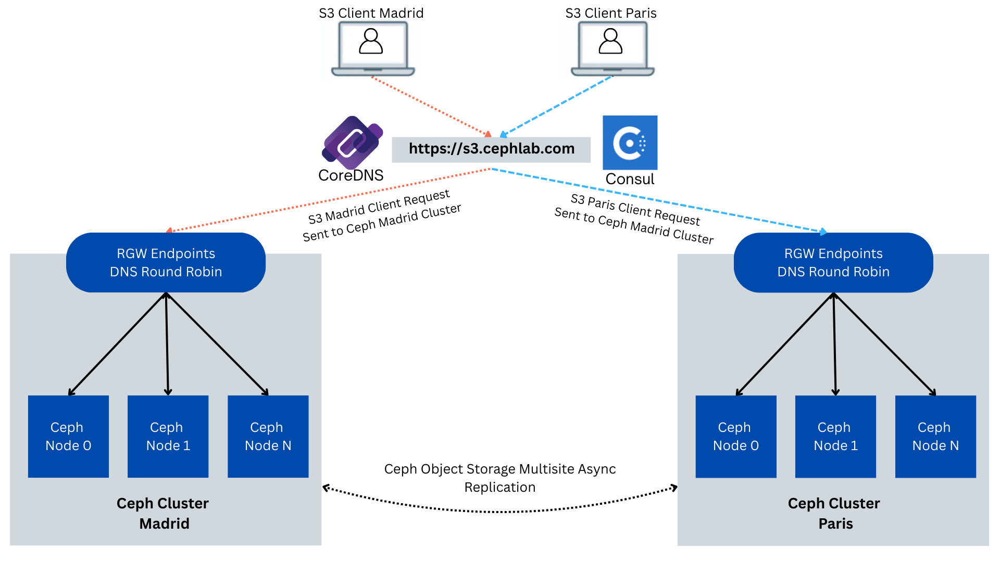

## Part3. Consul-Powered Global Load Balancing for Ceph Object Gateway (RGW)

Note: this series of articles describes functionality that is expected to be
available an upcoming Tentacle dot release.

### Introduction

Quick refresher from Part 3: we stood up a global control plane across the
Madrid and Paris sites. Each site makes its own routing decisions locally,
and the two cooperate over the WAN, so traffic always goes to healthy, nearby
gateways by default and automatically shifts to the other site if the local one
can’t serve. We validated the behavior end-to-end without yet changing client URLs or DNS.

Part 3 is available [here](https://ceph.io/en/news/blog/2025/consul-lb3/).

In Part 4 (this post), we turn that policy into a standard DNS experience with
CoreDNS. We’ll run three CoreDNS instances per site for HA, publish a small
stub zone, and add simple rewrites so that ``s3.cephlab.com`` resolves to healthy,
nearby ingress by default and automatically shifts to the peer site during
incidents. We’ll also keep pinned per-site
names (``s3.madrid.cephlab.com``, ``s3.paris.cephlab.com``) for deterministic
routing when you need it. Finally, we’ll validate steady state, hard-stop one
site to prove failover, and cover a few notes on eventual consistency and
lightweight client-side retries.

### CoreDNS in the GLB Architecture (Active/Active)

In this section, we stand up CoreDNS in each site (three instances per DC
via cephadm), publish a stub zone for your domain, then forward the
special ``.consul`` domain to the local Consul DNS on TCP port ``8600``.
We then add rewrite rules so the public names (``s3.cephlab.com`` and
the optional ``s3.madrid.cephlab.com`` / ``s3.paris.cephlab.com``) are
translated into the S3 prepared‑query form, forwarded to Consul. The
replies are rewritten back to the original names. We'll create the CoreDNS
config file Corefile, copy it to peers with ``scp``, and apply the Cephadm
spec per cluster, then finally verify with ``dig`` that global and per‑site
names resolve to healthy, local endpoints with automatic failover.



### Hans-on: CoreDNS Setup and Configuration

We create the Madrid Corefile (``/etc/coredns/Corefile``) and distribute it to
the rest of the nodes in the cluster. To understand the details of the
configuration options used here for CoreDNS,
consult [part 2](https://ceph.io/en/news/blog/2025/consul-lb2/) of this blog series.

```bash
ceph-node-00# mkdir -p /etc/coredns
ceph-node-00# cat >/etc/coredns/Corefile <<'EOF'
.:53 {
    log
    errors
    forward . 8.8.8.8
}

# Forward all .consul queries to Madrid Consul DNS
consul {
  forward . 192.168.122.12:8600 192.168.122.179:8600 192.168.122.94:8600
  log
  errors
}


s3.cephlab.com {
    rewrite stop { name exact s3.cephlab.com s3.query.consul. ; answer name s3.query.consul. s3.cephlab.com. }
    rewrite stop { name regex (.*)\.s3\.cephlab\.com s3.query.consul. ; answer auto }
    forward . 192.168.122.12:8600 192.168.122.179:8600 192.168.122.94:8600
    log
    errors
    debug
}

s3.madrid.cephlab.com {
    rewrite stop { name exact s3.madrid.cephlab.com s3.query.madrid.consul. ; answer name s3.query.madrid.consul. s3.madrid.cephlab.com. }
    forward . 192.168.122.12:8600 192.168.122.179:8600 192.168.122.94:8600
    log
    errors
    debug
}

s3.paris.cephlab.com {
    rewrite stop { name exact s3.paris.cephlab.com s3.query.paris.consul. ; answer name s3.query.paris.consul. s3.paris.cephlab.com. }
    forward . 192.168.122.138:8600 192.168.122.175:8600 192.168.122.214:8600
    log
    errors
    debug
}
EOF
```

Distribute the CoreDNS Corefile to all Madrid nodes:

```bash
ceph-node-00# for i in 00 01 02 ; do scp -pr /etc/coredns/Corefile \
  ceph-node-$i.cephlab.com:/etc/coredns/Corefile ; done
```

Create the Paris CoreDNS Corefile (``/etc/coredns/Corefile`` ):

```bash
ceph-node-04# mkdir -p /etc/coredns
ceph-node-04# cat >/etc/coredns/Corefile <<'EOF'
.:53 {
    log
    errors
    forward . 8.8.8.8
}

# Forward all .consul queries to Paris Consul DNS
consul {
  forward . 192.168.122.138:8600 192.168.122.175:8600 192.168.122.214:8600
  log
  errors
}

s3.cephlab.com {
    rewrite stop { name exact s3.cephlab.com s3.query.consul. ; answer name s3.query.consul. s3.cephlab.com. }
    rewrite stop { name regex (.*)\.s3\.cephlab\.com s3.query.consul. ; answer auto }
    forward . 192.168.122.138:8600 192.168.122.175:8600 192.168.122.214:8600
    log
    errors
    debug
}

s3.madrid.cephlab.com {
    rewrite stop { name exact s3.madrid.cephlab.com s3.query.madrid.consul. ; answer name s3.query.madrid.consul. s3.madrid.cephlab.com. }
    forward . 192.168.122.12:8600 192.168.122.179:8600 192.168.122.94:8600
    log
    errors
    debug
}

s3.paris.cephlab.com {
    rewrite stop { name exact s3.paris.cephlab.com s3.query.paris.consul. ; answer name s3.query.paris.consul. s3.paris.cephlab.com. }
    forward . 192.168.122.138:8600 192.168.122.175:8600 192.168.122.214:8600
    log
    errors
    debug
}
EOF
```

Distribute the CoreDNS Corefile to all Paris nodes:

```bash
ceph-node-04# for i in 04 05 06 ; do scp -pr /etc/coredns/Corefile \
  ceph-node-$i.cephlab.com:/etc/coredns/Corefile ; done
```

Configure the Cephadm spec file for the CoreDNS services running at the Paris Site:

```bash
ceph-node-04# cat >core-dns.yaml <<'EOF'
service_type: container
service_id: coredns
placement:
  hosts:
    - ceph-node-04
    - ceph-node-05
    - ceph-node-06
spec:
  image: docker.io/coredns/coredns:latest
  entrypoint: '["/coredns", "-conf", "/etc/coredns/Corefile"]'
  args:
    - "--net=host"
  ports:
    - 53
  bind_mounts:
    - ['type=bind','source=/etc/coredns/Corefile','destination=/etc/coredns/Corefile', 'ro=false']
EOF
```

Next, with ``ceph orch`` we apply the configuration:

```bash
ceph-node-04# ceph orch apply -i core-dns.yaml
ceph-node-04# ceph orch ps | grep coredns
container.coredns.ceph-node-04  ceph-node-04  *:53,53  running (3m)  6s ago  11.8M  -  <unknown>  0392ee038903  11aa22bb33cc
container.coredns.ceph-node-05  ceph-node-05  *:53,53  running (3m)  6s ago  11.7M  -  <unknown>  0392ee038903  22bb33cc44dd
container.coredns.ceph-node-06  ceph-node-06  *:53,53  running (3m)  6s ago  11.9M  -  <unknown>  0392ee038903  33cc44dd55ee
```

Configure the Cephadm spec file for the CoreDNS services running in Madrid:

```bash
ceph-node-00# cat >core-dns.yaml <<'EOF'
service_type: container
service_id: coredns
placement:
  hosts:
    - ceph-node-00
    - ceph-node-01
    - ceph-node-02
spec:
  image: docker.io/coredns/coredns:latest
  entrypoint: '["/coredns", "-conf", "/etc/coredns/Corefile"]'
  args:
    - "--net=host"
  ports:
    - 53
  bind_mounts:
    - ['type=bind','source=/etc/coredns/Corefile','destination=/etc/coredns/Corefile', 'ro=false']
EOF
```

Next, with the ``ceph orch`` command, we apply the configuration in Madrid:

```bash
ceph-node-00# ceph orch apply -i core-dns.yaml

ceph-node-00# ceph orch ps | grep coredns
container.coredns.ceph-node-00  ceph-node-00  *:53,53  running (3m)  4s ago  11.6M  -  <unknown>  0392ee038903  feaa8305273a
container.coredns.ceph-node-01  ceph-node-01  *:53,53  running (3m)  6s ago  11.9M  -  <unknown>  0392ee038903  c86ee93dab60
container.coredns.ceph-node-02  ceph-node-02  *:53,53  running (3m)  6s ago  12.1M  -  <unknown>  0392ee038903  06b73ad257ca
```

### Validation and Failover

In this final section, we move from design to proof. First, we capture the steady
state so you can see what "healthy" looks like: how DNS answers are shaped, where
the prepared query executes, and how a simple S3 call behaves. Then we deliberately
take one site offline (a hard stop of the Madrid Ceph nodes) to observe how
resolution converges to the surviving site and how S3 client requests continue
to succeed. We’ll also provide evidence by tailing Ceph Object Gateway logs,
and finally bring the site back, monitoring as it heals and rebalances.

#### Healthy state validation

From the view of a client in Madrid, we will configure DNS resolution for the
client to query first our CoreDNS instance in Madrid (192.168.122.12) and then
the instance in Paris(192.168.122.138):

```bash
[root@rhel1 ~]# cat /etc/resolv.conf
# Generated by NetworkManager
nameserver 192.168.122.12
nameserver 192.168.122.138
nameserver 192.168.122.1
```

We will be using dig to do some basic initial validation, first the GLB
endpoint: ```s3.cephlab.com```:

* When we use Madrid DNS server (192.168.122.12), we get a list of IP addresses
  for the HAproxy concentrators in Madrid (192.168.122.[12,94,79]).

* When I use the Paris DNS servers (192.168.122.138), we get a list of IP addresses
  for the HAproxy concentrators in Paris (192.168.122.[175,138,214]).

```bash
[root@rhel1 ~]# dig +short @192.168.122.12 s3.cephlab.com
192.168.122.12
192.168.122.94
192.168.122.179
[root@rhel1 ~]# dig +short @192.168.122.138 s3.cephlab.com
192.168.122.175
192.168.122.138
192.168.122.214
```

Now we can also test the pinned per-site URLs/endpoints; we can resolve both
FQDNs from Madrid and Paris, ``s3.paris.cephlab.com`` and ``s3.madrid.cephlab.com`` :

```bash
[root@rhel1 ~]# dig +short @192.168.122.12 s3.paris.cephlab.com
192.168.122.214
192.168.122.138
192.168.122.175
[root@rhel1 ~]# dig +short @192.168.122.12 s3.madrid.cephlab.com
192.168.122.12
192.168.122.94
192.168.122.179
```

Now let's connect to the S3 endpoint and list the available buckets. Because the
client node has its primary DNS pointing to Madrid, we will access the Madrid Ceph Cluster:

```bash
[root@rhel1 ~]# aws --endpoint http://s3.cephlab.com:8080 s3 ls
2025-08-19 07:47:54 bucket1
[root@rhel1 ~]# aws --endpoint http://s3.cephlab.com:8080 s3 ls
2025-08-19 07:47:54 bucket1
```

By checking the audit logs of our Ceph cluster, we see that the requests have
gone to ``ceph-node-00``, which is part of Madrid’s Ceph cluster. In this example,
we are using a script that aggregates and filters the logs. Centralized logging
can be configured from the Dashboard.

```bash
ceph-node-00# bash script-opslogs.sh
2025-09-15T10:16:43.747172Z  192.168.122.12   list_buckets  GET / HTTP/1.1  madrid  ceph-node-00-RGW2
2025-09-15T10:17:32.664384Z  192.168.122.12   list_buckets  GET / HTTP/1.1  madrid  ceph-node-00-RGW1
```

We now switch the DNS configuration to put the Paris DNS first in the list, so we
pretend to be in Paris.  We compare the audit log output, and see that S3 client
requests are now hitting the RGWs in our Paris Ceph Cluster. The first request went
to ``ceph-node-04`` and the second request to an RGW in ``ceph-node-05``, both from
our Paris Ceph cluster:

```bash
[root@rhel1 ~]# cat /etc/resolv.conf
# Generated by NetworkManager
nameserver 192.168.122.138
nameserver 192.168.122.12
nameserver 192.168.122.1

[root@rhel1 ~]# aws --endpoint http://s3.cephlab.com:8080 s3 ls
2025-08-19 07:47:54 bucket1
[root@rhel1 ~]# aws --endpoint http://s3.cephlab.com:8080 s3 ls
2025-08-19 07:47:54 bucket1

ceph-node-00# bash script-opslogs.sh
time                         client_ip        op            uri             dc      rgw
2025-09-15T10:16:43.747172Z  192.168.122.12   list_buckets  GET / HTTP/1.1  madrid  ceph-node-00-RGW2
2025-09-15T10:17:32.664384Z  192.168.122.12   list_buckets  GET / HTTP/1.1  madrid  ceph-node-00-RGW1
2025-09-15T10:27:13.724159Z  192.168.122.138  list_buckets  GET / HTTP/1.1  paris   ceph-node-04-RGW1
2025-09-15T10:27:15.397246Z  192.168.122.175  list_buckets  GET / HTTP/1.1  paris   ceph-node-05-RGW1
```

Next, a final test with the pinned DC endpoint, even with our DNS pointing to the
DNS servers in Paris, we're forcing the client request to upload to Madrid an
object via the FQDN ``s3.madrid.cephlab.com``. When we check the audit logs,
we see that even with our client in Paris, we have hit an RGW in Madrid;
this is the behavior we expect.

```bash
[root@rhel1 ~]# aws --endpoint http://s3.madrid.cephlab.com:8080 s3 cp /etc/hosts s3://bucket1/hosts
upload: ../etc/hosts to s3://bucket1/hosts

ceph-node-00# bash script-opslogs.sh
time                         client_ip        op            uri             dc      rgw
2025-09-15T10:40:08.641711Z  192.168.122.12   put_obj  PUT /bucket1/hosts HTTP/1.1  madrid  ceph-node-02-RGW2
```

Now that validation with a healthy setup has finished, let's test a failure scenario.

### Complete Site Failure (Simulate Madrid Down)

In this section, we’ll prove that the global endpoint remains functional even
when an entire site becomes unavailable. We’ll hard-stop the Madrid RGW/HAProxy
nodes to simulate a real outage (no graceful drain). While client traffic
continues to hit ``s3.cephlab.com``, we’ll monitor DNS/Consul convergence
and confirm, via RGW audit logs, that requests are now being served from the
surviving site: Paris. Finally, we’ll bring Madrid back and see both sites
rejoin the rotation for the global S3 endpoint.

 and RGWs. No draining: we pull the plug using
a "stop" from the hypervisor, shoutout to [kcli](https://github.com/karmab/kcli).

What to look for: after TTL, DNS answers and prepared-query results will contain only Paris addresses.

```bash
hypervisor# kcli stop vm ceph-node-00 ceph-node-01 ceph-node-02 ceph-node-03
Stopping vm ceph-node-00 in openstackbox...
ceph-node-00 stopped
Stopping vm ceph-node-01 in openstackbox...
ceph-node-01 stopped
Stopping vm ceph-node-02 in openstackbox...
ceph-node-02 stopped
Stopping vm ceph-node-03 in openstackbox...
ceph-node-03 stopped
```

After the TTL expires (less than 5 seconds), we see that the DNS records are now
pointing to the HAproxy Concentrators in the Paris DC. We then upload an object
and list it:

```bash
[root@rhel1 ~]# dig +short s3.cephlab.com A
192.168.122.138
192.168.122.175
192.168.122.214
[root@rhel1 ~]# aws --endpoint http://s3.cephlab.com:8080 s3 cp /etc/hosts s3://bucket1/hosts1
upload: ../etc/hosts to s3://bucket1/hosts1                        
[root@rhel1 ~]# aws --endpoint http://s3.cephlab.com:8080 s3 ls s3://bucket1
2025-09-15 06:40:08        158 hosts
2025-09-15 08:02:35        158 hosts1
```

We check our object audit logs, and see how when Madrid DC is down, the Madrid
user/client request will get transparently redirected to the Paris DC endpoints,
without having to make any modifications on the client side:

```bash
ceph-node-00# bash script-opslogs.sh
2025-09-15T12:02:35.976108Z  192.168.122.138  put_obj       PUT /bucket1/hosts1 HTTP/1.1   paris   ceph-node-04-RGW1
2025-09-15T12:02:47.949125Z  192.168.122.175  list_bucket   GET /bucket1?list-type=2&prefix=&delimiter=%2F&encoding-type=url HTTP/1.1  paris   ceph-node-05-RGW1
```

### Recovery, Bring Madrid Back Online

We now reverse the failure and boot the Madrid site. This is a cold start (similar
to real-world power restoration), so Consul agents, CoreDNS, HAProxy terminators,
and RGWs on each node will come up, rejoin their respective clusters, and begin
reporting health. After a few seconds (our DNS TTL is 5s), Madrid endpoints
should reappear in answers and start serving traffic locally again.

```bash
# kcli start vm ceph-node-00 ceph-node-01 ceph-node-02 ceph-node-03
Starting vm ceph-node-00...
ceph-node-00 started
Starting vm ceph-node-01...
ceph-node-01 started
Starting vm ceph-node-02...
ceph-node-02 started
Starting vm ceph-node-03...
ceph-node-03 started
```

Once Consul health checks go green and CoreDNS refreshes, the global name should
point to Madrid entries again. To generate a clear audit trail after recovery,
we perform a write operation against the same global hostname. Here, we delete
a test object from bucket1. Any simple PUT/DELETE works; the goal is to produce
a fresh entry in the RGW ops logs from the restored site.

```bash
[root@rhel1 ~]# dig +short s3.cephlab.com A
192.168.122.12
192.168.122.179
192.168.122.94
[root@rhel1 ~]# aws --endpoint http://s3.cephlab.com:8080 s3 rm s3://bucket1/hosts
delete: s3://bucket1/hosts
```

Finally, rerun the log collector to show where the request landed after recovery.
We now see entries with ``dc = madrid` (locality restored).

```bash
ceph-node-00# bash script-opslogs.sh
time                         client_ip        op            uri    dc      rgw
2025-09-15T12:22:24.190298Z  192.168.122.12   delete_obj    DELETE /bucket1/hosts HTTP/1.1 madrid  ceph-node-00-RGW
```

### Metadata Control Plane: Active/Passive

Data is active/active across sites, but metadata (users, buckets, policies, quotas,
lifecycle rules, etc.) is active/passive. In a Ceph Object multisite setup, the
zonegroup master is the single metadata authority. Practically:

* When the metadata master is up, any site can serve object I/O. Bucket/user
  changes are coordinated via the master.

* If the metadata master goes down, existing buckets continue to function (object
  reads/writes remain unaffected). Still, you cannot create/delete buckets or
  change users/policies until the master is available again or you promote the peer site.

#### When to fail over the metadata master

If the outage is brief and you don’t need to change buckets/users, do nothing;
let the master recover.

If downtime is extended and you must perform metadata changes, promote the peer
site to become the zone group (and realm) master. Detailed steps to failover can
be found here.

**IMPORTANT**: Avoid dual masters at all costs. Before promotion, ensure that
the failed site is truly offline: powered off, fenced, or hard-isolated.
Promoting while the original master is still reachable can create a metadata
split-brain that’s painful to unwind.

### Hardening Notes (From Lab to Prod)

This post shows the mechanics of the solution in a lab. For production, you should
harden the control plane, shrink the attack surface, and add proper observability
and monitoring. Here we make suggestions: this is not a comprehensive list.

* Consul ACLs : Bootstrap ACLs, then run with least-privilege policies (separate
  tokens for servers, agents, automation). Grant
  only ``service:read / prepared-query:execute`` to CoreDNS; restrict write to CI/admins.

* Transport security: Enable mTLS for Consul RPC (TCP ports ``8300–8302``) and
  serve the HTTP API over HTTPS (TCP port ``8501``). Encrypt gossip (Serf) with
  a key. Bind the plaintext API (TCP port ``8500``) to ``127.0.0.1`` or disable it.

* WAN exposure: Prefer Mesh Gateways so servers don’t need to be directly reachable
  over the public WAN

* CoreDNS posture: Run three per DC. Disable open recursion.

* Ingress Encryption in Transit (HAProxy/RGW): Terminate TLS at the Ceph Object
  Gateway (RGW) for client and replication traffic.

* Quorum & placement: Ensure 3 Consul servers per DC (or other odd number),
  anti-affined across racks/hosts. Enable Autopilot settings for graceful
  server replacement and upgrades.

* DNS Policy : Set a DNS TTL that matches your RTO (5–15s typical). Publish
  guidance for pinned per-site names (when to use them, and that they
  sacrifice some GLB benefits).

### Conclusion

We’ve closed the loop. With CoreDNS in front of Consul, the single global
name ``s3.cephlab.com`` now resolves to a healthy, nearby ingress in normal
operation and automatically shifts across sites during site/DC incidents.
We proved it with simple dig checks, real S3 calls, a hard site outage, and
RGW audit logs that showed traffic moving from Madrid to Paris (and back)
without any client-side changes. The result is a practical GLB for the
Ceph Object Gateway(RGW) that favors locality, limits blast radius, and
keeps applications blissfully unaware of failures.

The authors would like to thank IBM for supporting the community with our time to create these posts.
