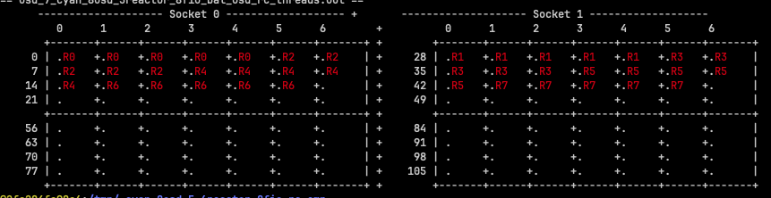
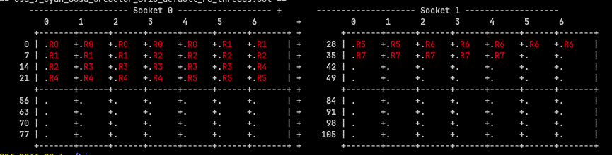
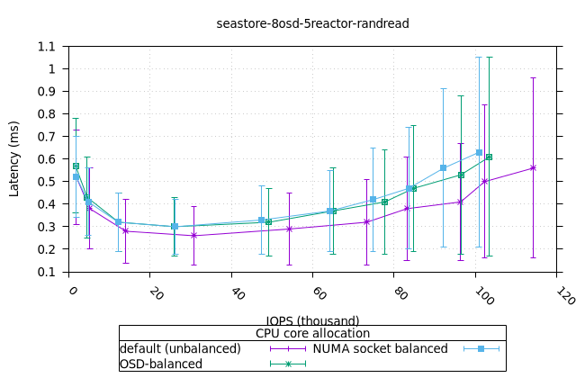
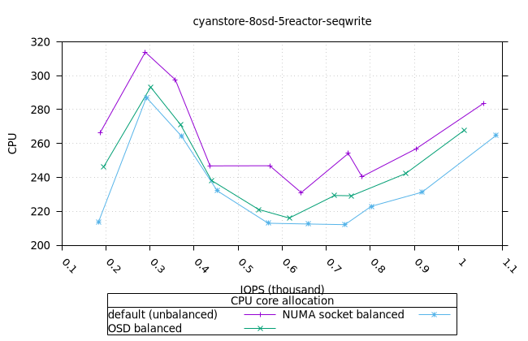

## Crimson: the new OSD high performance architecture

[Crimson](https://ceph.io/en/news/crimson/) is the project name for the new OSD
high performance architecture.  Crimson is built on top of [Seastar
framework](http://www.seastar-project.org/) an advanced, open-source C++
framework for high-performance server applications on modern hardware.  Seastar
implements I/O reactors in a share-nothing architecture, using asynchronous
computation primitives, like futures, promises, and coroutines. The I/O reactor
threads are normally pinned to a specific CPU core in the system.  However, to
support interaction with legacy software that is, non-reactor blocking tasks,
the mechanism of Alien threads are available in Seastar. These allow the
interface between non-reactor and I/O reactor architecture. In Crimson, the
alien threads are used to support Bluestore.

There are very good introductions to the project, in
particular check the following videos by [Sam
Just](https://www.youtube.com/watch?v=LaP4YX1lQ3I) and [Matan Breizman
](https://www.youtube.com/watch?v=8N_1WAEPw0o) in the Ceph community Youtube
channel.


An important question from the performance point of view is the allocation of
Seastar reactor threads to the available CPU cores. This is particularly
key in the modern NUMA (Non-Uniform Memory Access) architectures, where
there is a latency penalty for accessing memory from a different CPU socket as
opposed to local memory belonging to the same CPU socket where the thread is
running. We also want to ensure mutual exclusion between Reactors and other
non-reactor threads within the same CPU core. The main reason is that the
Seastar reactor threads are non-blocking, whereas non-reactor threads are
allowed to block.

As part of [this PR](https://github.com/ceph/ceph/pull/60822) we introduced a
new option in the `vstart.sh` script to set the CPU allocation strategy for
the OSD threads:

- **OSD-based**: this consists on allocating CPU cores from the same NUMA socket to
  the same OSD.  For simplicity, if the OSD id is even, all its reactor threads
  are allocated to NUMA socket 0, and consequently if the OSD id is odd, all its
  reactor threads are allocated to NUMA socket 1. The following figure
  illustrates this strategy (the 'R' stands for 'Reactor' thread, the numeric id
  corresponds to the OSD id):



- **NUMA socket based**: this consists of allocating evenly CPU cores from each NUMA
  socket to the reactors, so all the OSDs end up with reactors allocated on both NUMA
  sockets.


By default, if the option is not given, vstart will allocate the reactor threads
in consecutive order, as follows:



Worth mentioning that the `vstart.sh` script is used in Developer mode only,
very useful for experimenting, as in this case.

<!---
Structure of blog:
* Test Plan fundamentals: show the differences between the CPU allocations
* across the object store tyoes over the same OSD and num reactor configurations
* Show simple snippets to illustrate the performance testing operations
* Point out the resources utilisation, as a first step towards
* understanding/profiling
-->

The structure of this blog entry is as follows: 

- first we briefly describe the hardware and performance tests we executed,
illustrated with some snippets.  Readers familiarised with Ceph might want to
skip this section. 
- In the second section, we show the results of the performance tests,
comparing the three CPU allocation strategies. We used the three backend
classes supported by Crimson, which are:

- *Cyanstore*: this is an in-memory pure-reactor OSD class, which does not
  exercise the physical drives in the system. The reason for using this OSD class is
  to saturate the memory access rate in the machine, to identify the highest I/O rate
  possible in Crimson without interference (that is latencies) from physical
  drives.

- *Seastore*: this is also a pure-reactor OSD class which exercises the physical
  NVMe drives in the machine. We expect that the overall performance of this
  class would be a fraction of that achieved by Cyanstore.

- *Bluestore*: this is the default OSD class for Crimson, as well for the Classic
  OSD in Ceph. This class involves the participation of Alien threads, which is the technique
  in Seastore to deal with blocking thread pools.

The comparison results are interesting as they highlight both limitations and
opportunities for performance optimisations.

## Performance testing plans

In a nutshell, we want to measure the performance using some typical client workloads
(random 4K write, random 4K read; sequential 64K write, sequential 64K read) for
a number of cluster configurations involving a fixed number of OSD and ranging over a
number of I/O reactors (which implicitly ranges over the corresponding number of
CPU cores).  We want to compare across the exisiting object stores: Cyanstore
(in memory), Seastore and Bluestore. The former two are "pure reactor", whilst
the latter involves (blocking) Alien thread pools.

In terms of the client, we exercise an RBD volume of 10 GiB size, using FIO for the
typical workloads as mentioned before. We synthetise the client results from an
FIO .json output (I/O throughput and latency) and integrate it with measurements
from the OSD process. These typically involve CPU and Memory utilisation (from
the Linux command top). This workflow is illustrated in the following diagram.


In our actual experimentations, we ranged over a number of OSD (1, 3, 5, 8), as
well as over the number of reactors (1,2,4,6). Since the number of results would
be considerably large and would make reading this blog rather tedious, we
decided only show the representative 8 OSDs and 5 I/O reactors.  

<!-- A .pdf report with full details is available here.  -->

We used a single node cluster, with the following hardware and system configuration:

- CPU: 2 x Intel(R) Xeon(R) Platinum 8276M CPU @ 2.20GH (56 cores each)
- Memory: 394 GiB
- Drives: 8 x 93.1 TB NVMe
- OS: Centos 9.0 on kernel 5.14.0-511.el9.x86_64
- Ceph: version b2a220 (bb2a2208867d7bce58b9697570c83d995a1c5976) squid (dev)
- podman version 5.2.2.

We build Ceph with the following options:

```bash
# ./do_cmake.sh -DWITH_SEASTAR=ON -DCMAKE_BUILD_TYPE=RelWithDebInfo
```

At a high level, we initiate the performance tests as follows:

```bash
/root/bin/run_balanced_crimson.sh -t cyan
```
This will run the test plan for the Cyanstore object backend, producing data for
response curves over the three CPU allocation strategies. The argument
'`-t`' is used to specify the object storage backend: `cyan`, `sea` and `blue` for
Cyanstore, Seastore and Bluestore, respectively.

```bash
crimson_be_table["cyan"]="--cyanstore"
crimson_be_table["sea"]="--seastore --seastore-devs ${STORE_DEVS}"
crimson_be_table["blue"]="--bluestore --bluestore-devs ${STORE_DEVS}"
```
Once the execution completes, the results are archived in .zip files according
to the workloads and saved in the output directory which can be specified with
option `-d` (`/tmp` by default).

<details>
<summary>Click to see a snapshot of the generated results.</summary>

```bash
cyan_8osd_5reactor_8fio_bal_osd_rc_1procs_randread.zip      cyan_8osd_5reactor_8fio_bal_socket_rc_1procs_seqread.zip   cyan_8osd_6reactor_8fio_bal_osd_rc_1procs_randread.zip      cyan_8osd_6reactor_8fio_bal_socket_rc_1procs_seqread.zip
cyan_8osd_5reactor_8fio_bal_osd_rc_1procs_randwrite.zip     cyan_8osd_5reactor_8fio_bal_socket_rc_1procs_seqwrite.zip  cyan_8osd_6reactor_8fio_bal_osd_rc_1procs_randwrite.zip     cyan_8osd_6reactor_8fio_bal_socket_rc_1procs_seqwrite.zip
cyan_8osd_5reactor_8fio_bal_osd_rc_1procs_seqread.zip
```
</details>

<!-- look inside ranread for example, which are the important output .json, etc.
-->
Each archive contains the result output files and measurements from that
workload execution.

<details>
<summary>Click to see inside a results .zip file.</summary>
The files more important are:

- `cyan_8osd_5reactor_8fio_bal_osd_rc_1procs_randread.json`: the (combined) FIO
output file, which contains the I/O throughput and latency measurements. It
contains integrated the CPU and MEM utilisation from the OSD process as well.
    - `cyan_8osd_5reactor_8fio_bal_osd_rc_1procs_randread_cpu_avg.json`: the
    OSD and FIO CPU and MEM utilisation averages. These have been collected
    from the OSD process and the FIO client process via top (30 samples over 5
    minutes).
    - `cyan_8osd_5reactor_8fio_bal_osd_rc_1procs_randread_diskstat.json`: the
    diskstat output. A sample is taken before and after the test, the .json
    contains the differences.
    - `cyan_8osd_5reactor_8fio_bal_osd_rc_1procs_randread_top.json`: the output
    from top, parsed via jc to produce a .json. **Note**: jc does not yet
    support individual CPU core utilisation, so we have to rely on the overall
    CPU utilisation (per thread).
    - `new_cluster_dump.json`: the output from `ceph tell ${osd_i}
    dump_metrics` command, which contains the individual OSD performance
    metrics.
    - `FIO_cyan_8osd_5reactor_8fio_bal_osd_rc_1procs_randread_top_cpu.plot`:
    the plot mechanically generated from the top output, showing the CPU
    utilisation over time for the FIO client.
    - `OSD_cyan_8osd_5reactor_8fio_bal_osd_rc_1procs_randread_top_mem.plot`:
    the plot mechanically generated from the top output, showing the MEM
    utilisation over time for the OSD process.

</details>

To produce the post-processing and side-by-side comparison, the following script
is run:
```bash
# /root/bin/pp_balanced_cpu_cmp.sh -d /tmp/_seastore_8osd_5_6_reactor_8fio_rc_cmp \
   -t sea -o seastore_8osd_5vs6_reactor_8fio_cpu_cmp.md
```
The arguments are: the input directory that contains the runs we want to
compare, the type of object store backend, and the output .md to produce.

We will show the comparisons produced in the next section.

We end this section by looking behind the curtains of the above scripts,
showing details on preconditioning the drives, creation of the cluster, execution
of FIO and the metrics collected.

### Preconditioning the drives

In order to ensure that the drives are in a consistent state, we run a write
workload using FIO with the `steadystate` option. This option ensures that the
drives are in a steady state before the actual performance tests are run. We
precondition up to 70 percent of the total capacity of the drive.

<details>
<summary>Click to see the command.</summary>

We take a measurement of the diskstats before and after the test, and we use
the `diskstat_diff.py` script to calculate the difference. The script is
available in the `ceph` repository under `src/tools/contrib`.


```bash
# jc --pretty /proc/diskstats > /tmp/blue_8osd_6reactor_192at_8fio_socket_cond.json
# fio rbd_fio_examples/randwrite64k.fio && jc --pretty /proc/diskstats \
 | python3 diskstat_diff.py -d /tmp/ -a blue_8osd_6reactor_192at_8fio_socket_cond.json

Jobs: 8 (f=8): [w(8)][30.5%][w=24.3GiB/s][w=398k IOPS][eta 13m:41s]
nvme0n1p2: (groupid=0, jobs=8): err= 0: pid=375444: Fri Jan 31 11:43:35 2025
  write: IOPS=397k, BW=24.2GiB/s (26.0GB/s)(8742GiB/360796msec); 0 zone resets
    slat (nsec): min=1543, max=823010, avg=5969.62, stdev=2226.84
    clat (usec): min=57, max=50322, avg=5152.50, stdev=2982.28
     lat (usec): min=70, max=50328, avg=5158.47, stdev=2982.27
    clat percentiles (usec):
     |  1.00th=[  281],  5.00th=[  594], 10.00th=[ 1037], 20.00th=[ 2008],
     | 30.00th=[ 3032], 40.00th=[ 4080], 50.00th=[ 5145], 60.00th=[ 6194],
     | 70.00th=[ 7242], 80.00th=[ 8291], 90.00th=[ 9241], 95.00th=[ 9634],
     | 99.00th=[10028], 99.50th=[10421], 99.90th=[14091], 99.95th=[16188],
     | 99.99th=[19268]
   bw (  MiB/s): min=15227, max=24971, per=100.00%, avg=24845.68, stdev=88.47, samples=5768
   iops        : min=243638, max=399547, avg=397527.12, stdev=1415.43, samples=5768
  lat (usec)   : 100=0.01%, 250=0.61%, 500=3.18%, 750=2.90%, 1000=2.88%
  lat (msec)   : 2=10.28%, 4=19.25%, 10=59.90%, 20=1.00%, 50=0.01%
  lat (msec)   : 100=0.01%
  cpu          : usr=19.80%, sys=15.60%, ctx=104026691, majf=0, minf=2647
  IO depths    : 1=0.1%, 2=0.1%, 4=0.1%, 8=0.1%, 16=0.1%, 32=0.1%, >=64=100.0%
     submit    : 0=0.0%, 4=100.0%, 8=0.0%, 16=0.0%, 32=0.0%, 64=0.0%, >=64=0.0%
     complete  : 0=0.0%, 4=100.0%, 8=0.0%, 16=0.0%, 32=0.0%, 64=0.0%, >=64=0.1%
     issued rwts: total=0,143224767,0,0 short=0,0,0,0 dropped=0,0,0,0
     latency   : target=0, window=0, percentile=100.00%, depth=256
  steadystate  : attained=yes, bw=24.3GiB/s (25.5GB/s), iops=398k, iops mean dev=1.215%

Run status group 0 (all jobs):
  WRITE: bw=24.2GiB/s (26.0GB/s), 24.2GiB/s-24.2GiB/s (26.0GB/s-26.0GB/s), io=8742GiB (9386GB), run=360796-360796msec
```
</details>

### Creating the cluster

We use the `vstart.sh` script to create the cluster, with the appropriate options for Crimson.

<details>
<summary>Click to see a snippet of the cluster creation.</summary>
We have a table with the CPU allocation strategies:

```bash
# CPU allocation strategies
declare -A bal_ops_table
bal_ops_table["default"]=""
bal_ops_table["bal_osd"]=" --crimson-balance-cpu osd"
bal_ops_table["bal_socket"]="--crimson-balance-cpu socket"
```

We essentially traverse over the order of the CPU strategies, for each of the
Crimson backends. In the snippet, we iterate over the number of OSDs
and reactors, and set the CPU allocation strategy with the new option.

**IMPORTANT**: Notice that we set the list of CPU cores available for vstart
with the `VSTART_CPU_CORES` variable. We use this to ensure we "reserve" some
CPUs to be used by the FIO client (since we are using a single node cluster). 

```bash
# Run balanced vs default CPU core/reactor distribution in Crimson using either Cyan, Seastore or  Bluestore
fun_run_bal_vs_default_tests() {
  local OSD_TYPE=$1
  local NUM_ALIEN_THREADS=7 # default 
  local title=""

  for KEY in default bal_osd bal_socket; do
    for NUM_OSD in 8; do
      for NUM_REACTORS in 5 6; do
        title="(${OSD_TYPE}) $NUM_OSD OSD crimson, $NUM_REACTORS reactor, fixed FIO 8 cores, response latency "

        cmd="MDS=0 MON=1 OSD=${NUM_OSD} MGR=1 taskset -ac '${VSTART_CPU_CORES}' /ceph/src/vstart.sh \
 --new -x --localhost --without-dashboard\
 --redirect-output ${crimson_be_table[${OSD_TYPE}]} --crimson --crimson-smp ${NUM_REACTORS}\
 --no-restart ${bal_ops_table[${KEY}]}"
        # Alien setup for Bluestore, see below.

        test_name="${OSD_TYPE}_${NUM_OSD}osd_${NUM_REACTORS}reactor_8fio_${KEY}_rc"
        echo "${cmd}"  | tee >> ${RUN_DIR}/${test_name}_cpu_distro.log
        echo $test_name
        eval "$cmd" >> ${RUN_DIR}/${test_name}_cpu_distro.log
        echo "Sleeping for 20 secs..."

        sleep 20 
        fun_show_grid $test_name
        fun_run_fio $test_name
        /ceph/src/stop.sh --crimson
        sleep 60
      done
    done
  done
}
```
For Bluestore, we have  a special case, where we set the number of alien
threads to be 4 times the number of backend CPU cores (crimson-smp).

```bash
        if [ "$OSD_TYPE" == "blue" ]; then
            NUM_ALIEN_THREADS=$(( 4 *NUM_OSD * NUM_REACTORS ))
            title="${title} alien_num_threads=${NUM_ALIEN_THREADS}"
            cmd="${cmd}  --crimson-alien-num-threads $NUM_ALIEN_THREADS"
            test_name="${OSD_TYPE}_${NUM_OSD}osd_${NUM_REACTORS}reactor_${NUM_ALIEN_THREADS}at_8fio_${KEY}_rc"
        fi
```
</details>

Once the cluster is online, we create the pools and the RBD volume.

<details>
<summary>Click to see the pool creation.</summary>

We first take some measurements of the cluster, then we create a single RBD pool and volume(s) as appropriate. We also show the status of the cluster, the pools and the PGs.

```bash
# Take some measurements
if pgrep crimson; then
	bin/ceph daemon -c /ceph/build/ceph.conf osd.0 dump_metrics > /tmp/new_cluster_dump.json
else
	bin/ceph daemon -c /ceph/build/ceph.conf osd.0 perf dump > /tmp/new_cluster_dump.json
fi

# Create the pools
bin/ceph osd pool create rbd
bin/ceph osd pool application enable rbd rbd
[ -z "$NUM_RBD_IMAGES" ] && NUM_RBD_IMAGES=1
for (( i=0; i<$NUM_RBD_IMAGES; i++ )); do
  bin/rbd create --size ${RBD_SIZE} rbd/fio_test_${i}
  rbd du fio_test_${i}
done
bin/ceph status
bin/ceph osd dump | grep 'replicated size'
# Show a pool’s utilization statistics:
rados df
# Turn off auto scaler for existing and new pools - stops PGs being split/merged
bin/ceph osd pool set noautoscale
# Turn off balancer to avoid moving PGs
bin/ceph balancer off
# Turn off deep scrub
bin/ceph osd set nodeep-scrub
# Turn off scrub
bin/ceph osd set noscrub
```

Here is an example of the default pools shown after the cluster has been
created. Notice the default replica set as Crimson does not support Erasure
Coding yet.

```bash
    pool 'rbd' created
enabled application 'rbd' on pool 'rbd'
NAME        PROVISIONED  USED
fio_test_0       10 GiB   0 B
  cluster:
    id:     da51b911-7229-4eae-afb5-a9833b978a68
    health: HEALTH_OK

  services:
    mon: 1 daemons, quorum a (age 97s)
    mgr: x(active, since 94s)
    osd: 8 osds: 8 up (since 52s), 8 in (since 60s)

  data:
    pools:   2 pools, 33 pgs
    objects: 2 objects, 449 KiB
    usage:   214 MiB used, 57 TiB / 57 TiB avail
    pgs:     27.273% pgs unknown
             21.212% pgs not active
             17 active+clean
             9  unknown
             7  creating+peering

pool 1 '.mgr' replicated size 3 min_size 1 crush_rule 0 object_hash rjenkins pg_num 1 pgp_num 1 autoscale_mode off last_change 15 flags hashpspool,nopgchange,crimson stripe_width 0 pg_num_max 32 pg_num_min 1 application mgr read_balance_score 7.89
pool 2 'rbd' replicated size 3 min_size 1 crush_rule 0 object_hash rjenkins pg_num 32 pgp_num 32 autoscale_mode off last_change 33 flags hashpspool,nopgchange,selfmanaged_snaps,crimson stripe_width 0 application rbd read_balance_score 1.50
POOL_NAME     USED  OBJECTS  CLONES  COPIES  MISSING_ON_PRIMARY  UNFOUND  DEGRADED  RD_OPS      RD  WR_OPS       WR  USED COMPR  UNDER COMPR
.mgr       449 KiB        2       0       6                   0        0         0      41  35 KiB      55  584 KiB         0 B          0 B
rbd            0 B        0       0       0                   0        0         0       0     0 B       0      0 B         0 B          0 B

total_objects    2
total_used       214 MiB
total_avail      57 TiB
total_space      57 TiB
noautoscale is set, all pools now have autoscale off
nodeep-scrub is set
noscrub is set
```

</details>

### Running FIO

We have written some basic infrastructure via stand-alone tools to drive
[FIO](https://github.com/axboe/fio), the Linux flexible I/O exerciser. All of
these tools are publically available at my github project repo
[here](https://github.com/perezjosibm/ceph-aprg/tree/main).

In essence, this basic infrastructure consists of:

- A set of predefined FIO configuration files for the different workloads
(random 4K write, random 4K read; sequential 64K write, sequential 64K read).
These can be automatically generated on demand, especially for multiple
clients, multiple RBD volumes, etc.

- A set of performance test profiles, namely *response latency curves* which
produce throughput and latency measurements for a range of I/O depths, with
resource utilisation integrated. We can also produce quick *latency target*
tests, which are useful to identify the maximum I/O throughput for a given
latency target. 

- A set of monitoring routines, to measure resource utilisation (CPU, MEM) from
the FIO client and the OSD process. We use the `top` command, and we parse the
output with `jc` to produce a .json file. We integrate this with the FIO output
in a single .json file, and generate gnuplot scripts dynamically. We also take
a snapshot of the diskstats before and after the test, and we calculate the
difference. We also aggregate the FIO traces, in terms of gnuplot charts.

<details>
<summary>Click to see the FIO execution.</summary>

- We use the `iodepth` option to control the number of I/O requests that are
    issued to the device. Since we are interested in *response latency curves*
    (a.k.a hockey stick performance curves) we traverse from one to sixty four.
    We use a single job per RBD volume (but this could also be variable if required).

```bash
# Option -w (WORKLOAD) is used as index for these:
declare -A m_s_iodepth=( [hockey]="1 2 4 8 16 24 32 40 52 64"  ...)
declare -A m_s_numjobs=( [hockey]="1" ... )
```

- As a preliminary step, we prime the volume(s) with a write workload. This is done
before the actual performance tests are run. We exercise a client per volume,
so the execution is concurrent.

```bash
# Prime the volume(s) with a write workloads
   RBD_NAME=fio_test_$i RBD_SIZE="64k" fio ${FIO_JOBS}rbd_prime.fio 2>&1 >/dev/null & 
   echo "== priming $RBD_NAME ==";
 ...
   wait;
```

- In the main loop, we iterate over the number of I/O depths, and we run the
FIO command for each of the predefined workloads. We also take a snapshot of
the diskstats before and after the test, and we calculate the difference. We
collect the PIDs of the FIO process as well as the OSD processes, which would
be used to monitor their resource utilisation. We have an heuristic in place to
exit early the loops if the standard deviation of the latency disperses too
much from the median.

**IMPORTANT**: the attentive reader would notice the use of the `taskset` command
to bind the FIO client to a set of CPU cores. This is to ensure that the FIO
client does not interfere with the reactors of OSD process. The order of
execution of the workloads is important to ensure reproducibility.

```bash

  for job in $RANGE_NUMJOBS; do
    for io in $RANGE_IODEPTH; do

      # Take diskstats measurements before FIO instances
      jc --pretty /proc/diskstats > ${DISK_STAT}
...
        for (( i=0; i<${NUM_PROCS}; i++ )); do

        export TEST_NAME=${TEST_PREFIX}_${job}job_${io}io_${BLOCK_SIZE_KB}_${map[${WORKLOAD}]}_p${i};
        echo "== $(date) == ($io,$job): ${TEST_NAME} ==";
        echo fio_${TEST_NAME}.json >> ${OSD_TEST_LIST}
        fio_name=${FIO_JOBS}${FIO_JOB_SPEC}${map[${WORKLOAD}]}.fio

          # Execute FIO
          LOG_NAME=${log_name} RBD_NAME=fio_test_${i} IO_DEPTH=${io} NUM_JOBS=${job} \
            taskset -ac ${FIO_CORES} fio ${fio_name} --output=fio_${TEST_NAME}.json \
            --output-format=json 2> fio_${TEST_NAME}.err &
          fio_id["fio_${i}"]=$!
          global_fio_id+=($!)
      done # loop NUM_PROCS
      sleep 30; # ramp up time
...
    fun_measure "${all_pids}" ${top_out_name} ${TOP_OUT_LIST} &
...
      wait;
      # Measure the diskstats after the completion of FIO
      jc --pretty /proc/diskstats | python3 /root/bin/diskstat_diff.py -a ${DISK_STAT}

      # Exit the loops if the latency disperses too much from the median
      if [ "$RESPONSE_CURVE" = true ] && [ "$RC_SKIP_HEURISTIC" = false ]; then
        mop=${mode[${WORKLOAD}]}
        covar=$(jq ".jobs | .[] | .${mop}.clat_ns.stddev/.${mop}.clat_ns.mean < 0.5 and \
          .${mop}.clat_ns.mean/1000000 < ${MAX_LATENCY}" fio_${TEST_NAME}.json)
                  if [ "$covar" != "true" ]; then
                    echo "== Latency std dev too high, exiting loops =="
                    break 2
                  fi
      fi
    done # loop IODEPTH
  done # loop NUM_JOBS 

```
The basic monitoring routine is shown below, which is executed concurrently as FIO progresses. 
```bash
fun_measure() {
  local PID=$1 #comma separated list of pids
  local TEST_NAME=$2
  local TEST_TOP_OUT_LIST=$3

  top -b -H -1 -p "${PID}" -n ${NUM_SAMPLES} >> ${TEST_NAME}_top.out
  echo "${TEST_NAME}_top.out" >> ${TEST_TOP_OUT_LIST}
}
```
</details>

We have written a custom profile for top, so we get information about the
parent process id, last CPU the thread was executed on, etc. (which are not
normally shown by default). We also plan to extend jc to support individual CPU
core utilisation.

We extended and implemented new tools in the CBT (Ceph Benchmarking Tool) as
standalones since they can be used in either local laptop as well as in the *client
endpoints*. Further proof of concepts are in progress.


## Performance results and comparison

In this section, we show the performance results for the three CPU allocation
strategies across the three object storage backends. We show the results for
the 8 OSDs and 5 reactors configuration. 

- **IMPORTANT**: since these results are based on a single node cluster, due to
the nature and limitations of the hardware used, these results should be
considered as experimental, and hence not used as ultimate reference.  

It is interesting to point out that there is not a single CPU allocation
strategy has a significant advantage over the others, but there are workloads
that seem to gain benefits for different CPU allocation strategies. The results
are consistent across the different object storage backends, for most of the
workloads.

The response latency curves are extended with yerror bars describing the
standard deviation of the latency. This is useful to observe how the latency
disperses from the median (which is the average latency). For all the results
shown we disabled the heuristic mentioned above so we see all the data points
as requested (from iodepth 1 to 64).

For each workload, we show the comparison of the three CPU allocation
strategies across the three object storage backends. At the end, we compare the
results for a single CPU allocation strategy across the three object storage
backends.

### Random 4K read
#### Cyanstore


<details>
<summary>Click to see CPU and MEM utilisation.</summary>

We first show the CPU and MEM utilisation for the OSD process and then the FIO client.

- It is interesting to observe that the default CPU allocation strategy has a
higher memory utilisation than the balanced CPU allocation strategies, but only
for Cyanstore, so it should not be an issue of concern.

| _OSD CPU_ | _OSD MEM_ |
|:---------:|:---------:|
|  |  |


| _FIO CPU_ | _FIO MEM_ |
|:---------:|:---------:|
| |  |

</details>

#### Seastore


<details>
<summary>Click to see CPU and MEM utilisation.</summary>

- It is a good sign to see a constant memory utilisation for the OSD process
across all the iodepths. The NUMA socket strategy has only a .6% higher than
the other strategies, which is not significant to cause concern.

| _OSD CPU_ | _OSD MEM_ |
|:---------:|:---------:|
|  | |

| _FIO CPU_ | _FIO MEM_ |
|:---------:|:---------:|
| ||

</details>

#### Bluestore

- Interestingly, the NUMA socket balanced CPU allocation strategy seemed to have a slight advantage over the other CPU allocation strategies for Bluestore.


<details>
<summary>Click to see CPU and MEM utilisation.</summary>

| _OSD CPU_ | _OSD MEM_ |
|:---------:|:---------:|
|||

| _FIO CPU_ | _FIO MEM_ |
|:---------:|:---------:|
|||

</details>

### Random 4K write 

- This is a pleasant workload in the sense that the resource utilisation graphs
are smooth with gentle gradient. The NUMA socket strategy has a slight advantage over the
other strategies for Cyanstore and Seastore, but the default strategy has a
slight advantage for Bluestore.

#### Cyanstore


<details>
<summary>Click to see CPU and MEM utilisation.</summary>

| _OSD CPU_ | _OSD MEM_ |
|:---------:|:---------:|
|||


| _FIO CPU_ | _FIO MEM_ |
|:---------:|:---------:|
|||
</details>

#### Seastore

<details>
<summary>Click to see CPU and MEM utilisation.</summary>

| _OSD CPU_ | _OSD MEM_ |
|:---------:|:---------:|
|||

| _FIO CPU_ | _FIO MEM_ |
|:---------:|:---------:|
|||
</details>

#### Bluestore

<details>
<summary>Click to see CPU and MEM utilisation.</summary>

| _OSD CPU_ | _OSD MEM_ |
|:---------:|:---------:|
|||

| _FIO CPU_ | _FIO MEM_ |
|:---------:|:---------:|
|||
</details>

### Sequential 64K read

- It seems that a nature of this workload causes bursts of activity in the CPU
utilisation. This is consistent across the three CPU allocation strategies, and
across the three object storage backends. It deserves further investigation.


#### Cyanstore

<details>
<summary>Click to see CPU and MEM utilisation.</summary>

| _OSD CPU_ | _OSD MEM_ |
|:---------:|:---------:|
|||

| _FIO CPU_ | _FIO MEM_ |
|:---------:|:---------:|
|||
</details>

#### Seastore

<details>
<summary>Click to see CPU and MEM utilisation.</summary>

| _OSD CPU_ | _OSD MEM_ |
|:---------:|:---------:|
|||

| _FIO CPU_ | _FIO MEM_ |
|:---------:|:---------:|
|||
</details>

#### Bluestore

<details>
<summary>Click to see CPU and MEM utilisation.</summary>

| _OSD CPU_ | _OSD MEM_ |
|:---------:|:---------:|
|||

| _FIO CPU_ | _FIO MEM_ |
|:---------:|:---------:|
|||
</details>


### Sequential 64K write

- It is hard to explain the initial spike in the CPU utilisation for the three CPU
allocation strategies, across the three object store backends. We might need to run a
localised version of this test to confirm.

#### Cyanstore

<details>
<summary>Click to see CPU and MEM utilisation.</summary>

| _OSD CPU_ | _OSD MEM_ |
|:---------:|:---------:|
|||

| _FIO CPU_ | _FIO MEM_ |
|:---------:|:---------:|
|||
</details>

#### Seastore

<details>
<summary>Click to see CPU and MEM utilisation.</summary>

| _OSD CPU_ | _OSD MEM_ |
|:---------:|:---------:|
|||

| _FIO CPU_ | _FIO MEM_ |
|:---------:|:---------:|
|||
</details>

#### Bluestore

<details>
<summary>Click to see CPU and MEM utilisation.</summary>


| _OSD CPU_ | _OSD MEM_ |
|:---------:|:---------:|
|||

| _FIO CPU_ | _FIO MEM_ |
|:---------:|:---------:|
|||
</details>

### Comparison of default CPU allocation strategy across the three object storage backends

We briefly show the comparison of the default CPU allocation strategy across
the three storage backends.  We choose the default CPU allocation strategy as
it is the currently used in the field/community.

- Cyanstore is the higher performer for random read 4k and sequential 64K
write, which makes sense since there is no latency involved in memory access.
- Bluestore is the higher performer for random write 4k, which is a bit of a
surprise. Worth deserving further investigation to figure out why Bluestore is
more efficient in writing small blocks.
- It is also surprising that for sequential 64K read, Bluestore seems to be an
order of magnitude ahead compared to the pure Reactor object backends. This
deserves a closer look to verify for any mistake.

| _Random read 4K_ | _Random Write 4k_ |
|:---------:|:---------:|
|||

| _Seq read 64K_ | _Seq Write 64k_ |
|:---------:|:---------:|
|||

## Conclusions

In this blog entry, we have shown the performance results for the three CPU
allocation strategies across the three object storage backends. It is
interesting that none of the CPU allocation strategies significantly
outperforms the existing default strategy, which is a bit of a surprise. Please
notice that in order to keep a disciplined methodology, we used the same Ceph
build (with the commit hash cited above) across all the tests, to ensure only a
single parameter is modified on each step, as appropriate. Hence, these results
do not represent the latest Seastore development progress yet.

This is my very first blog entry, and I hope you have found it useful. I am
very thankful to the Ceph community for their support and guidance in this my
first year of being part of such a vibrant community, especially to Matan
Breizman, Yingxin Cheng, Aishwarya Mathuria, Josh Durgin, Neha Ojha and Bill
Scales. I am looking forward to the next blog entry, where we will take a deep
dive into the internals of performance metrics in Crimson OSD. We will try use
some flamegraphs on the major code landmarks, and leverage the existing tools
to identify latencies per component.
