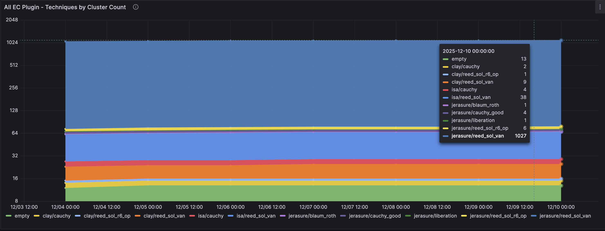
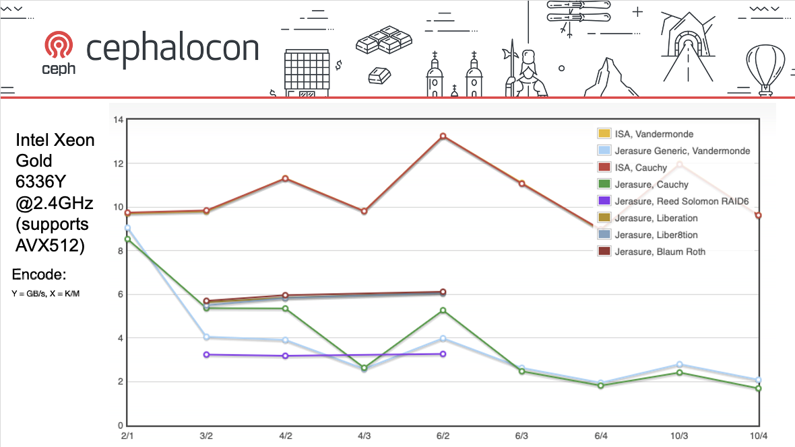
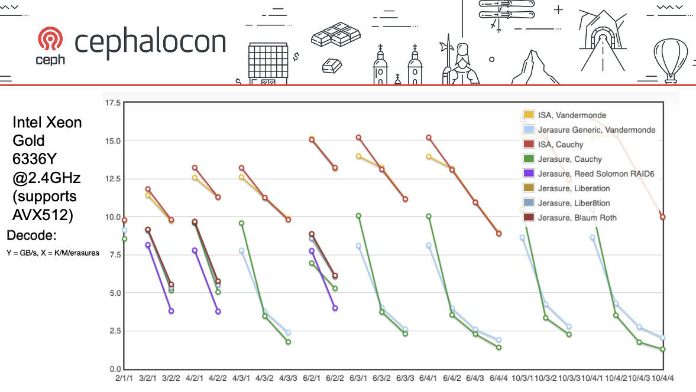

A plan to end support for some erasure code plugins and techniques
in the Ceph V release.

## The Erasure Code Plugin Interface

Ceph uses a plugin interface for erasure coded pools. These plugins are
external code libraries that are used to do the encoding and decoding of data.
Ceph pass chunks of data to the plugin. The plugin uses an encoding algorithm
to produce additional chunks called parity (or coding) chunks.

When an erasure coded pool is created, an erasure code profile must be selected.
Among other things, the profile includes the plugin and the technique that will be
used for the pool. The technique defines the algorithm that the plugin will use for
encoding and decoding, and some plugins support multiple different techniques.
Because the parity chunks generated are different for each combination of plugin
and technique, there is no way to change the plugin and technique after the pool has been
created.

Ceph currently supports five erasure code plugins, some of which support multiple
techniques:

- Jerasure
- - reed_sol_van
- - reed_sol_r6_op
- - cauchy_orig
- - cauchy_good
- - liberation
- - blaum_roth
- - liber8tion
- ISA-L (Intel Intelligent Storage Acceleration Library)
- - reed_sol_van
- - cauchy
- SHEC (Shingled Erasure Code)
- CLAY (Coupled Layer)
- LRC (Locally Repairable Erasure Code)

Why are there so many options?

In the distant past, before CPUs supported SIMD instructions
(Single Instruction, Multiple Data) and could encode and decode lots of data in parallel,
Jerasure's XOR-optimized techniques (cauchy, liberation, liber8tion and blaum_roth) offered a
performance improvement when encoding and decoding data. Now, with SSE, AVX (and other) instructions,
the need for techniques that rely on XOR operations has been greatly reduced, and reed_sol_van is very close
or in some cases better, than the XOR-optimized techniques. See the comparison chart later
in this post for the data!

SHEC and CLAY both focus on trying to improve the recovery efficiency (by optimizing network and disk usage
when decoding data) when an OSD or server fails and data must be rebuilt. Both of these plugins build
on top of Jerasure, with additional logic that aims to speed up recovery.

LRC also builds on top of Jerasure and intends to improve recovery efficiency by using locally available
data (e.g. data in the same data centre or same rack) to minimise transfers between racks or sites.

## Ending Support For Plugins

In the Ceph Tentacle release we introduced a new version of erasure coding
that has become known as Fast EC. Fast EC offers significant performance
improvements and some capacity savings when using erasure coding, particularly for block
and file workloads. There are even more improvements to Fast EC coming in future releases. See Lee Sanders' blog post
https://ceph.io/en/news/blog/2025/tentacle-fastec-performance-updates/ for more details about Fast EC.

Fast EC changes the interface between Ceph and the erasure code plugins. In Tentacle, only ISA-L
(using reed_sol_van or cauchy) and Jerasure (using reed_sol_van) support Fast EC. The old EC code has been kept
as a separate code path in Ceph, and the other plugins (and other Jerasure techniques) continue to use old EC.

Our proposal is that we should end support for the least used (and least useful) plugins
and techniques in the V release. Ceph clusters using these plugins and techniques will not be
able to upgrade to the V release unless data is first migrated to a pool that uses
a supported plugin and technique.

Why not continue to support all of these plugins using the old EC code path?

The Fast EC work exposed the amount of development effort required to continue to support
such a big list of plugins and techniques. Even though only the most important plugins and techniques
support Fast EC, code changes were still required to ensure that the other plugins continue working
correctly. We now have two separate erasure code paths to maintain. Along with extra development work, supporting
a big list of plugins also means lots more testing needs to be done to ensure nothing gets broken.

We don't think this effort is justified given the small number of users using some plugins, and
the lack of benefits that these plugins and techniques provide according to performance benchmarks. Developer
focus would be better spent on improving other parts of Ceph.

The proposed list of plugins and techniques that we will support in the V release are:

- Jerasure
- - reed_sol_van
- ISA-L
- - reed_sol_van
- - cauchy
- LRC (Although LRC doesn't currently support Fast EC and we wouldn't recommend using it yet, we think
  we will be able to use LRC in future to improve support for erasure coded pools in stretched clusters.)

## Telemetry Data

So let's look at some data. How many people are actually using each plugin? Not every Ceph cluster has opted in
to upload usage data to Telemetry, but enough have to give us a good idea about the plugins and techniques that
people are using. Here is a recent snapshot of the clusters using erasure coded pools:

## Performance Data

My talk at Cephalocon 2024 (https://www.youtube.com/watch?v=aM8sJgDD-x4) discussed why we've made ISA-L the
default plugin for new EC pools. The talk included performance data captured using Ceph's EC benchmarking
tool, and I've included that here. These charts demonstrate how advancements in SIMD instructions have
brought the performance of the reed_sol_van technique to a point where reed_sol_van is almost as good as
or better than other techniques. Note that the ISA-L vandermonde and cauchy lines are overlapping in the encode
graph:

As mentioned earlier, the goal of both SHEC and of CLAY is to improve recovery efficiency when an OSD is down.
A recent blog post written by Jake Squelch uses the Ceph Benchmarking Tool (CBT) to compare performance of the
Jerasure and CLAY plugins. His results show that there is a trade-off when using CLAY.
Although CLAY can reduce network bandwidth usage during recovery by around 50%, there is a performance penalty
for client I/O during normal operation, and when an OSD is down and the cluster needs to recover data. Data is being
read in a very inefficient way, particularly when using the default stripe_unit value.
See https://ceph.io/en/news/blog/2025/cbt-performance-benchmarking-part3/ for more detail.

## Pool Migration

What if you're the owner of the single cluster using Jerasure's blaum_roth technique in the telemetry data?
As we end support for the above list of plugins and techniques, we will need a way to move
data from those pools into new pools that use supported plugins. In the Umbrella release
we plan to add such a pool migration feature. This new feature will provide a way to non-disruptively move data
from one pool to another. The migration will run as a background task, similar to backfill and recovery,
with no downtime where data is inaccessible. This will allow you to migrate all the objects from a pool that uses
an unsupported plugin to a new pool that uses a supported plugin and technique, and then upgrade the cluster to the
V release.
See https://github.com/ceph/ceph/pull/65703 for the pool migration design document.

## Conclusion

As we've developed Fast EC, it's become clear that continuing to support such a big list of plugins and techniques
is too much effort for the value that some of the plugins and techniques provide.

In the Umbrella release we will deprecate the plugins and techniques not included in the supported list
mentioned above. In the V release we will end support for those plugins and techniques. You will not be
able to upgrade to the V release if your cluster has any pools that use those plugins and techniques.
You will be able to use the new pool migration feature in Umbrella to migrate data from a pool to a new pool
that uses one of the supported plugins and techniques.

Reducing our list of supported plugins and techniques will allow us to focus our development efforts
and continue to improve Fast EC, without the risk of breaking lesser-used plugins.
