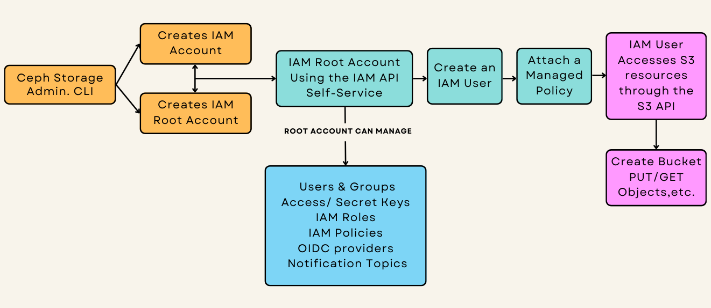

### Introduction
Efficient multitenant environment management is critical in large-scale object
storage systems. In the Ceph Squid release, we’ve introduced a transformative
feature: Identity and Access Management (IAM) accounts.

This enhancement brings self-service resource management to Ceph Object Storage
and significantly reduces administrative overhead for Ceph administrators by
enabling hands-off multitenancy management.

IAM accounts allow tenants to independently manage their resources—users, groups,
roles, policies, and buckets—using an API interface modeled after AWS IAM. For
Ceph administrators, this means delegating day-to-day operational responsibilities
to tenants while retaining system-wide control.

The IAM API is fully compatible with AWS S3 and is offered through the Object Gateway
API endpoint. In this way, IAM Account administrators (root account) don’t need
access or permissions on the Ceph internal radosgw-cli or adminOPS API, enhancing
responsibility delegation while maintaining security.

With the addition of IAM accounts, we have a new user persona that represents the
tenant admin: the IAM Root Account User.
* **Ceph Object Storage Administrator**: Responsible for system-wide management
and creating the IAM accounts.
* **IAM Root Account User**: The admin responsible for the Account. Manages Resources
within a specific tenant/IAM account, consuming the IAM API available through the RGW endpoint.
* S3 End Users: Operate within the confines of permissions granted by the root account user.



### Walkthrough: Working with IAM Accounts in Ceph 
#### Pre-requisites: Ceph Squid or later with RGW/Object Storage Service running.

Although outside this post's scope, we provide an example RGW Spec file that sets
up the RGW services and the Ingres Service (load balancer) for the RGW endpoints.

```
# cat << EOF > /root/rgw-ha.spec
---
service_type: ingress
service_id: rgw.rgwsrv
service_name: ingress.rgw.rgwsrv
placement:
  count: 2
  hosts:
  - ceph-node-02.cephlab.com
  - ceph-node-03.cephlab.com
spec:
  backend_service: rgw.rgwsrv
  first_virtual_router_id: 50
  frontend_port: 80
  monitor_port: 1497
  virtual_ip: 192.168.122.100
---
service_type: rgw
service_id: rgwsrv
service_name: rgw.rgwsrv
placement:
  count: 3
  hosts:
  - ceph-node-03.cephlab.com
  - ceph-node-00.cephlab.com
  - ceph-node-01.cephlab.com
spec:
  rgw_frontend_port: 8080
  rgw_realm: realm1
  rgw_zone: zone1
  rgw_zonegroup: zonegroup1
EOF
 
# ceph orch apply -i /root/rgw-ha.spec
```

This config provides us with a working virtual IP endpoint on `192.168.122.100`
that resolves to `s3.zone1.cephlab.com`.

#### How to Create & Set Up an IAM Account as the Object Storage Admin

Let’s walk through the steps to configure an IAM account, create users, and apply permissions.

##### Create an IAM Account

We will use the `radosgw-admin` CLI to create an IAM account for an analytics web
application team; you could also use the AdminOPS API.

In the example, we first create the IAM account and then define the resources this
specific IAM account will have available from the global RGW/Object Storage system.

```
# radosgw-admin account create --account-name=analytic_app
```

This command creates an account named `analytic_app`. The account is initialized
with default quotas and limits, which may be adjusted afterward. When using IAM
accounts, an RGW Account ID gets created that will be part of the principal ARN
when we need to reference it, for example: `arn:aws:iam::RGW00889737169837717:user/name`.

Example output:

```
{
    "id": "RGW00889737169837717",
    "tenant": "analytics",
    "name": "analytic_app",
    "max_users": 1000,
    ...
}
```

##### Modify IAM Account Limits

As the RGW admin, in this example, we adjust the maximum number of users for the account:

```
# radosgw-admin account modify --max-users 10 --account-name=analytic_app
```

This ensures the IAM account can create up to ten users. Depending on your needs,
you can also manage the maximum numbers of groups, keys, policies,
buckets, etc.

##### Set Quotas on an IAM Account

As part of creating the IAM account, we can enable and define quotas for the
account to control resource usage. In this example we configure the account's
maximum storage usage to 20GB, and we can also configure other quotas related
to the object count per bucket:

```
# radosgw-admin quota set --quota-scope=account --account-name=analytic_app --max-size=20G
# radosgw-admin quota enable --quota-scope=account --account-id=RGW00889737169837717
```
####
Creating the Account Root User for our new IAM Account

Each IAM account is managed by a root user, who has default permissions
over all resources within the account. Like normal users and roles,
accounts and account root users must be created by an administrator
using radosgw-admin or the Admin Ops API.

To create the account root user for the `analytic_app` account,
we run the following command:

```
# radosgw-admin user create --uid=root_analytics_web --display-name=root_analytics_web --account-id=RGW00889737169837717 --account-root --gen-secret --gen-access-key
```

Example output:

```
{
    "user_id": "root_analytics_web",
    "access_key": "1EHAKZAXKPV6LU65QS2R",
    "secret_key": "AgXK1BqPOP25pt0HvERDts2yZtFNfF4Mm8mCnoJX",
    ...
}
```

The root account user is now ready to create and manage users, groups, roles,
and permissions within the IAM account. These resources can be administered
and managed through the IAM API available through the RGW endpoint. At this point,
the RGW admin may provide the credentials of the root user of the IAM account
to the person responsible for the account. That person can perform all
administrative operations related to their account using the IAM API provided by
the RGW endpoint, which is entirely hands-off for the RGW administrator/operator.

Here is a list of some operations that the IAM root account can perform without
the intervention of an RGW admin:

* Create, Modify, and Delete Users
* Manage Account Users Access and Secret Keys
* Manage IAM Policies
* Manage IAM User Policies
* Manage IAM Groups
* Create, Modify, and Delete OIDC providers
* Create, Modify, and Delete Notification Topics

#### Creating Users, Groups, and Roles as the IAM Root Account through the IAM API

##### Create a new IAM User in the IAM Account.

Now we will configure the AWS CLI using the Access and Secret Keys of the IAM
Root Account generated in the previous step. The IAM API is available by
default on my Ceph Object Gateway (RGW) endpoints. In this example, we
have `s3.zone1.cephlab.com` as the load-balanced endpoint providing access to the API.

```
# dnf install awscli -y
# aws configure
AWS Access Key ID [****************dmin]: 1EHAKZAXKPV6LU65QS2R
AWS Secret Access Key [****************dmin]: AgXK1BqPOP25pt0HvERDts2yZtFNfF4Mm8mCnoJX
Default region name [multizg]: zonegroup1
Default output format [json]: json
# aws configure set endpoint_url http://s3.zone1.cephlab.com
```

Add a new IAM user named `analytics_frontend` to the analytics IAM account:

```
# aws iam create-user --user-name analytics_frontend
```

Assign an access key and secret key to the new user:

```
# aws iam create-access-key --user-name analytics_frontend

```

At this point, the user cannot access the S3 resources. In the next step, we will
enable the user to access resources. Here is an example of trying to access the
S3 namespace as the `analytics_frontend` user without attaching a policy:

``` 
# aws --profile analytics_backend s3 ls
argument of type 'NoneType' is not iterable
# aws --profile analytics_backend s3 ls s3://staticfront/
argument of type 'NoneType' is not iterable
```

#### Options to provide IAM users access to S3 resources
We have multiple ways to grant the new IAM user access to the various
resources available in the account, for example, IAM, S3, and SNS resources:

* Attach Pre-defined Managed policies; managed IAM policies can be attached
to multiple IAM identities (users, groups, roles) and reused across AWS accounts.
* Create a custom in-line User or Group Policy (Making the user part of the Group
with a policy attached)
* Assume an existing IAM Role to acquire the permissions granted to the role

| *Feature* | *Managed Policies* | *Inline Policies* | *Assume Role* |
| :--- | :--- | :--- | :--- |
| *Definition* | Reusable policies that can be attached to multiple users, groups, or roles. | Policies created for and attached to a single user, group, or role. | Temporary access is granted to a user or service to perform specific tasks. |
| *Reusability* | Can be shared across multiple accounts or identities within the RGW IAM system. | Specific to the identity they are attached to and cannot be reused. | Roles can be reused by multiple identities that need temporary access. |
| *Ease of Management* | Easier to manage due to centralized policy definition. | Requires individual updates for each identity they are attached to. | It is easier to manage since roles are centrally defined and assumed as needed. |
| *Flexibility*	| Ideal for common permissions that apply to many users or groups. | Best for unique permissions tailored to specific use cases or users. | Highly flexible for scenarios requiring time-limited, task-specific access. |
| *Use Case* | Example: Granting read-only or full access to S3 buckets across multiple users. | Example: Granting a specific user access to a unique S3 bucket. | Example: Allowing a service to temporarily assume access to an S3 bucket for processing. |

##### Example 1. Attach a Managed Policy to a new IAM user

In this first example, we use a managed policy, `policy/AmazonS3FullAccess`, to
allow the `analytics_frontend` user full access to IAM Account S3 resources:

```
# aws iam attach-user-policy --user-name analytics_frontend --policy-arn arn:aws:iam::aws:policy/AmazonS3FullAccess
```
 
Once we have attached the managed policy, we can create the S3 resources of the IAM account, for example:
 
```
# aws --profile analytics_frontend s3 mb s3://staticfront
make_bucket: staticfront
```

##### Example 2. Attach a Managed Policy to a Group and Add IAM users to the Group

First create an IAM group to manage permissions for users requiring similar
roles. Iin this case, we are creating a group for the frontend-monitoring team.

```
# aws iam create-group --group-name frontend-monitoring
```

Attach a Policy to the Group: In this example, we will attach an S3 read-only access policy to the group so that all users inherit the permissions and can access the S3 resources in read-only mode. No modifications to the S3 dataset are allowed.

```
# aws iam attach-group-policy --group-name frontend-monitoring --policy-arn arn:aws:iam::aws:policy/AmazonS3ReadOnlyAccess
```

Check that the policy is successfully attached to the group:

```
# aws iam list-attached-group-policies --group-name frontend-monitoring
{
    "AttachedPolicies": [
        {
            "PolicyName": "AmazonS3ReadOnlyAccess",
            "PolicyArn": "arn:aws:iam::aws:policy/AmazonS3ReadOnlyAccess"
        }
    ]
}
```

Create individual IAM users with their keys who will be group members.

```
# aws iam create-user --user-name mon_user1
# aws iam create-user --user-name mon_user2
# aws iam create-access-key --user-name mon_user1
# aws iam create-access-key --user-name mon_user2
```

Add the users created in the previous step to the `frontend-monitoring`
group so they inherit the permissions.

```
# aws iam add-user-to-group --group-name frontend-monitoring --user-name mon_user1
# aws iam add-user-to-group --group-name frontend-monitoring --user-name mon_user2
```

Confirm that both users are part of the group:

```
# aws iam get-group --group-name frontend-monitoring
{
    "Users": [
        {
            "Path": "/",
            "UserName": "mon_user1",
            "UserId": "fe09d373-08e8-4b61-bffa-6f65eaf11e56",
            "Arn": "arn:aws:iam::RGW60952341557974488:user/mon_user1"
        },
        {
            "Path": "/",
            "UserName": "mon_user2",
            "UserId": "29c57263-1293-4bdf-90e4-a784859f12ef",
            "Arn": "arn:aws:iam::RGW60952341557974488:user/mon_user2"
        }
    ],
    "Group": {
        "Path": "/",
        "GroupName": "frontend-monitoring",
        "GroupId": "a453d5af-4e25-401c-be76-b4075419cc94",
        "Arn": "arn:aws:iam::RGW60952341557974488:group/frontend-monitoring"
    }
}
```

##### Example 3. Create a custom inline policy and attach it to a specific user

This example demonstrates creating and attaching an inline policy to a specific
user in IAM. Inline policies define permissions for a single user and are
directly embedded into their identity. While this example focuses on the
`PutUserPolicy` operation, the same approach applies to groups (PutGroupPolicy)
and roles (PutRolePolicy) if you need to manage permissions for those entities.

We begin by creating a user who will be assigned the custom inline policy.

```
# aws iam create-user --user-name static_ro
# aws iam create-access-key --user-name static_ro
```

We create a JSON file containing the policy document to define the Custom
Inline Policy. This policy permits users to perform read-only operations
on a specific S3 bucket and its objects.

```
# cat << EOF > analytics_policy_web_ro.json
{
  "Version": "2012-10-17",
  "Statement": [
    {
      "Effect": "Allow",
      "Action": [
        "s3:GetObject",
        "s3:ListBucket",
        "s3:ListBucketMultipartUploads"
      ],
      "Resource": [
        "arn:aws:s3:::staticfront/*", 
        "arn:aws:s3:::staticfront"         
      ]
    }
  ]
}
EOF
```

Example Policy Overview:
* Effect: Allow specifies that the policy grants permissions.
* Actions: Includes s3:GetObject, s3:ListBucket, and s3:ListBucketMultipartUploads, which allow the user to read data and list objects in the S3 bucket.
* Resource: Specifies the S3 bucket (analytics:staticfront) and its objects.

Attach the policy to the user using the put-user-policy command.

```
# aws iam put-user-policy --user-name static_ro --policy-name analytics-static-ro --policy-document file://analytics_policy_web_ro.json
```

List the inline policies attached to the user to confirm the policy was successfully applied.

```
# aws iam list-user-policies --user-name static_ro
{
    "PolicyNames": [
        "analytics-static-ro"
    ]
}
```

#### Conclusion
Since this topic is too extensive for a single post, we won't cover IAM roles and
the ability of IAM users to assume roles with the help of STS in this article.
In our next post about the new IAM account feature in Squid, we will explore
additional exciting features, including Roles with STS and cross-account
access for sharing datasets between accounts.

For further details on IAM, explore the IAM API documentation, and Account documentation.

For further details on the Squid release, check Laura Flores' [blog post](https://ceph.io/en/news/blog/2024/v19-2-0-squid-released/)

#### Footnote

The atuhors would like to thank IBM for supporting the community by facilitating our time to create these posts.


