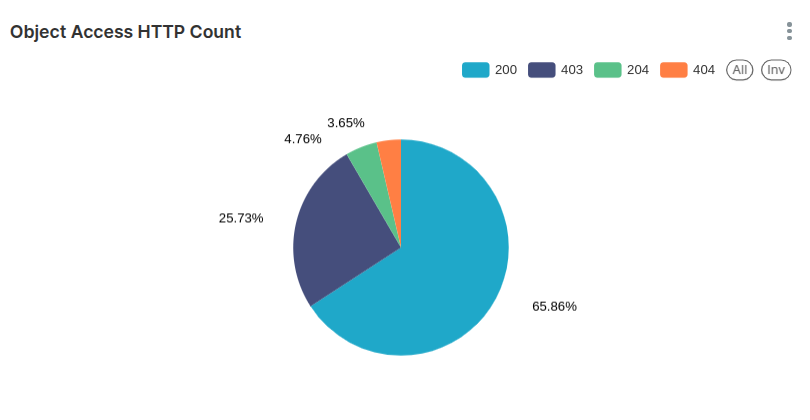

## Enhancing Object Storage Logging for End Users with the S3 Bucket Logging API

### Introducing Ceph S3 Bucket Logging

The new S3 bucket logging feature introduced as a Technology Preview in Squid 19.2.2
makes tracking, monitoring, and securing bucket operations more straightforward
than ever. It aligns with the S3 self-service use case, enabling end users to
configure and manage their application storage access logging through the
familiar S3 API. This capability empowers users to monitor access patterns,
detect unauthorized activities, and analyze usage trends without needing
direct intervention from administrators.

By leveraging Ceph's logging features, users gain actionable insights through
logs stored in dedicated buckets, offering flexibility and granularity in
tracking operations. 

It’s important to note that this feature is not designed to provide
real-time performance metrics and monitoring: we have the observability
stack provided by Ceph for those needs.

In AWS, the equivalent to Ceph's Bucket Logging S3 API is referenced
as [S3 Server Access Logging](https://docs.aws.amazon.com/AmazonS3/latest/userguide/ServerLogs.html).

In this blog, we will build an example interactive Superset dashboard
for our application with the log data generated when enabling S3 bucket logging.


### Example Use Cases for S3 Bucket Logging

* Application Compliance and Auditing\
Application teams in regulated industries (finance, healthcare, insurance, etc.)
must maintain detailed access logs to meet compliance requirements and ensure
traceability for data operations.

* Security and Intrusion Detection\
Monitor bucket access patterns to identify unauthorized activities, detect
anomalies, and respond to potential security breaches.

* Per Application Usage Analytics\
Generate detailed insights into buckets, including which objects are frequently
accessed, peak traffic times, and operation patterns.

* End User Cost Optimizations\
Track resource usage, such as the number of `GET`, `PUT`, and `DELETE` requests, to
optimize storage and operational costs.

* Self-Service Monitoring for End Users\
In a self-service S3-as-a-service setup, end users can configure logging to have
a historical view of their activity, helping them manage their data and detect
issues independently of the administrators.

* Change Tracking for Incremental Backups (Journal Mode Specific)\
With journal mode enabled, all changes in a bucket are logged before the
operations are complete, creating a reliable change log. Backup
applications can use this log to inventory changes to perform
efficient incremental backups. Here is an
example [Rclone PR](https://github.com/yuvalif/rclone/pull/1) from Yuval Lifshitz
that uses the bucket logging feature to allow more efficient incremental copying
from S3.

### Logging Modes: Standard vs. Journal

#### Standard (Default)

Log records are written to the log bucket after the operation is completed. If
the logging operation fails, it does so silently without notifying the client.

#### Journal

Log records are written to the log bucket before the operation is completed. If
logging fails, the operation is halted, and an error is returned to the client.
An exception is for multi-delete and delete operations, where the operation
may succeed even if logging fails. Note that logs may reflect successful writes
even if the operation fails.

### Hands-on: Configuring Bucket Logging

As context, I have a Ceph Object Gateway (RGW) service running on a Squid cluster.

```
# ceph version
ceph version 19.2.0-53.el9cp (677d8728b1c91c14d54eedf276ac61de636606f8) squid (stable)
# ceph orch ls rgw
NAME         PORTS   RUNNING  REFRESHED  AGE  PLACEMENT                            
rgw.default  ?:8000      4/4  6m ago     8M   ceph04;ceph03;ceph02;ceph06;count:4
```

I have an IAM account named ``analytic_ap``, and a root user for the account
named ``rootana``: the S3 user profile for ``rootana`` has already been
configured via the AWS CLI.

Through the RGW endpoint using the IAM API (no RGW admin intervention required)
I will create a new user with an attached managed policy of ``AmazonS3FullAccess``
so that this user can access all buckets in the ``analytic_ap`` account.

```
# aws --profile rootana iam create-user --user-name app_admin_shooters
{
 "User": {
"Path": "/",
"UserName": "app_admin_shooters",
"UserId": "d915f592-6cbc-4c4c-adf2-900c499e8a4a",
 "Arn": "arn:aws:iam::RGW46950437120753278:user/app_admin_shooters",
"CreateDate": "2025-01-23T08:26:44.086883+00:00"
 }
}

# aws --profile rootana iam create-access-key --user-name app_admin_shooters
{
 "AccessKey": {
"UserName": "app_admin_shooters",
"AccessKeyId": "YI80WC6HTMHMY958G3EO",
"Status": "Active",
 "SecretAccessKey": "67Vp071aBf92fJiEe8pBtV6RYqtWBhSceneeZVLH",
"CreateDate": "2025-01-23T08:27:03.268781+00:00"
 }
}

#  aws --profile rootana iam attach-user-policy --user-name app_admin_shooters --policy-arn arn:aws:iam::aws:policy/AmazonS3FullAccess
```

I configured a new profile via the AWS CLI with the credentials of the S3 end
user we just created named ``app_admin_shooters``, which with the managed policy
attached to the user gives me access to the S3 resources available in the
account:

```
# aws --profile app_admin_shooters s3 ls
#
```

Ok, with everything set, let’s create three source buckets. These buckets belong
to three different shooter games/applications and one logging destination bucket
named ``shooterlogs``:

```
# aws --profile app_admin_shooters s3 mb s3://shooterlogs
make_bucket: shooterlogs
# aws --profile app_admin_shooters s3 mb s3://shooterapp1
make_bucket: shooterapp1
]# aws --profile app_admin_shooters s3 mb s3://shooterapp2
make_bucket: shooterapp2
# aws --profile app_admin_shooters s3 mb s3://shooterapp3
make_bucket: shooterapp3
```

Now let’s enable bucket logging for each of my shooter app buckets. I will use
the target bucket ``shooter logs`` and to organize the logs for
each ``shooterapp`` bucket, I will use a ``TargetPprefix`` with the name of the bucket

```
# cat << EOF > enable_logging.json
{
  "LoggingEnabled": {
    "TargetBucket": "shooterlogs",
    "TargetPrefix": "shooterapp1"
  }
}
EOF
```

Once the JSON file is ready we can apply it to our buckets, using the ``sed``
command in each iteration to change the ``TargetPrefix``.

```
# aws --profile app_admin_shooters s3api put-bucket-logging --bucket shooterapp1 --bucket-logging-status file://enable_logging.json
# sed -i 's/shooterapp1/shooterapp2/' enable_logging.json
# aws --profile app_admin_shooters s3api put-bucket-logging --bucket shooterapp2 --bucket-logging-status file://enable_logging.json
# sed -i 's/shooterapp2/shooterapp3/' enable_logging.json
# aws --profile app_admin_shooters s3api put-bucket-logging --bucket shooterapp3 --bucket-logging-status file://enable_logging.json
```
We can list the logging configuration for a bucket with the following s3api command.

```
# aws --profile app_admin_shooters s3api get-bucket-logging --bucket shooterapp1
{
    "LoggingEnabled": {
        "TargetBucket": "shooterlogs",
        "TargetPrefix": "shooterapp1",
        "TargetObjectKeyFormat": {
            "SimplePrefix": {}
        }
    }
}
```

We will ``PUT`` some objects into our first bucket ``shooterapp1``, and also
delete a set of objects so that we can create logs in our log bucket.

```
# for i in {1..20} ; do  aws --profile app_admin_shooters s3 cp /etc/hosts s3://shooterapp1/file${i} ; done
upload: ../etc/hosts to s3://shooterapp1/file1                    
upload: ../etc/hosts to s3://shooterapp1/file2                    
…             
# for i in {1..5} ; do  aws --profile app_admin_shooters s3 rm s3://shooterapp1/file${i} ; done
delete: s3://shooterapp1/file1
delete: s3://shooterapp1/file2
…
```

When we check our configured log bucket ``shooterlogs``, it’s empty. Why !?

```
# aws --profile app_admin_shooters s3 ls s3://shooterlogs/
# 
```

*Note from the docs*: For performance reasons, even though the log records are
written to persistent storage, the log object will appear in the log bucket only
after some configurable amount of time (or if the maximum object size of 128MB
is reached). This time (in seconds) could be set per source bucket via a Ceph
extension to the REST API, or globally via the ``rgw_bucket_logging_obj_roll_time``
configuration option. If not set, the default time is 5 minutes. Adding a log
object to the log bucket is done "lazily", meaning that if no more records are
written to the object, it may remain outside the log bucket even after the
configured time has passed. 

If we don’t want to wait for the object roll time (defaults to 5 minutes), we
can force a flush of the log buffer with the ``radosgw-admin`` command:

```
# radosgw-admin bucket logging flush --bucket shooterapp1
```

When we check again, the object with the logs for bucket ``shooterapp1``
is there as expected:

```
# aws --profile app_admin_shooters s3 ls s3://shooterlogs/
2025-01-23 08:28:16       8058 shooterapp12025-01-23-13-21-00-A54CQC9GIO7O4F9D
# aws --profile app_admin_shooters s3 cp s3://shooterlogs/shooterapp12025-01-23-13-21-00-A54CQC9GIO7O4F9D - | cat
RGW46950437120753278 shooterapp1 [23/Jan/2025:13:21:00 +0000] - d915f592-6cbc-4c4c-adf2-900c499e8a4a fcabdf4a-86f2-452f-a13f-e0902685c655.323278.12172315742054314872 REST.GET.get_bucket_logging - "GET /shooterapp1?logging HTTP/1.1" 200 - - - - 14ms - - - - - - - s3.cephlabs.com.s3.cephlabs.com - -
RGW46950437120753278 shooterapp1 [23/Jan/2025:13:23:33 +0000] - d915f592-6cbc-4c4c-adf2-900c499e8a4a fcabdf4a-86f2-452f-a13f-e0902685c655.323242.15617167555539888584 REST.PUT.put_obj file1 "PUT /shooterapp1/file1 HTTP/1.1" 200 - 333 333 - 19ms - - - - - - - s3.cephlabs.com.s3.cephlabs.com - -
…
RGW46950437120753278 shooterapp1 [23/Jan/2025:13:24:01 +0000] - d915f592-6cbc-4c4c-adf2-900c499e8a4a fcabdf4a-86f2-452f-a13f-e0902685c655.323242.18353336346755391699 REST.DELETE.delete_obj file1 "DELETE /shooterapp1/file1 HTTP/1.1" 204 NoContent - 333 - 11ms - - - - - - - s3.cephlabs.com.s3.cephlabs.com - -
RGW46950437120753278 shooterapp1 [23/Jan/2025:13:24:02 +0000] - d915f592-6cbc-4c4c-adf2-900c499e8a4a fcabdf4a-86f2-452f-a13f-e0902685c655.311105.12134465030800156375 REST.DELETE.delete_obj file2 "DELETE /shooterapp1/file2 HTTP/1.1" 204 NoContent - 333 - 11ms - - - - - - - s3.cephlabs.com.s3.cephlabs.com - -
RGW46950437120753278 shooterapp1 [23/Jan/2025:13:24:03 +0000] - d915f592-6cbc-4c4c-adf2-900c499e8a4a fcabdf4a-86f2-452f-a13f-e0902685c655.323260.3289411001891924009 REST.DELETE.delete_obj file3 "DELETE /shooterapp1/file3 HTTP/1.1" 204 NoContent - 333 - 9ms - - - - - - - s3.cephlabs.com.s3.cephlabs.com - 
```

*NOTE*: To explore the output fields available with the current implementation
of the bucket logging feature, check out
the [documentation](https://docs.ceph.com/en/latest/radosgw/bucket_logging/).

Let's see if bucket logging works for our other bucket, ``shooterapp2``.

```
# for i in {1..3} ; do  aws --profile app_admin_shooters s3 cp /etc/hosts s3://shooterapp2/file${i} ; done
upload: ../etc/hosts to s3://shooterapp2/file1
upload: ../etc/hosts to s3://shooterapp2/file2
upload: ../etc/hosts to s3://shooterapp2/file3
# for i in {1..3} ; do  aws --profile app_admin_shooters s3 cp s3://shooterapp2/file${i} - ; done
# radosgw-admin bucket logging flush --bucket shooterapp2
flushed pending logging object 'shooterapp22025-01-23-10-01-57-TJNTA3FU60TS21MK' to target bucket 'shooterlogs'
```

Checking our configured log bucket, we can see that we now have two objects in
the bucket with the prefix of the source bucket name.

```
# aws --profile app_admin_shooters s3 ls s3://shooterlogs/
2025-01-23 08:28:16       8058 shooterapp12025-01-23-13-21-00-A54CQC9GIO7O4F9D
2025-01-23 10:01:57       2628 shooterapp22025-01-23-15-00-48-FIE6B8NNMANFTTFI
# aws --profile app_admin_shooters s3 cp s3://shooterlogs/shooterapp22025-01-23-15-00-48-FIE6B8NNMANFTTFI - | cat
RGW46950437120753278 shooterapp2 [23/Jan/2025:15:00:48 +0000] - d915f592-6cbc-4c4c-adf2-900c499e8a4a fcabdf4a-86f2-452f-a13f-e0902685c655.323242.10550516265852869740 REST.PUT.put_obj file1 "PUT /shooterapp2/file1 HTTP/1.1" 200 - 333 333 - 22ms - - - - - - - s3.cephlabs.com.s3.cephlabs.com - -
RGW46950437120753278 shooterapp2 [23/Jan/2025:15:00:49 +0000] - d915f592-6cbc-4c4c-adf2-900c499e8a4a 
…
RGW46950437120753278 shooterapp2 [23/Jan/2025:15:01:36 +0000] - d915f592-6cbc-4c4c-adf2-900c499e8a4a fcabdf4a-86f2-452f-a13f-e0902685c655.323278.16364063589570559207 REST.HEAD.get_obj file1 "HEAD /shooterapp2/file1 HTTP/1.1" 200 - - 333 - 4ms - - - - - - - s3.cephlabs.com.s3.cephlabs.com - -
RGW46950437120753278 shooterapp2 [23/Jan/2025:15:01:36 +0000] - d915f592-6cbc-4c4c-adf2-900c499e8a4a fcabdf4a-86f2-452f-a13f-e0902685c655.323242.2016501269767674837 REST.GET.get_obj file1 "GET /shooterapp2/file1 HTTP/1.1" 200 - - 333 - 3ms - - - - - - - s3.cephlabs.com.s3.cephlabs.com - -
```

### Unlocking Insights with Trino and Superset: Visualizing Your Application Logs


#### Configuring Trino to run SQL queries in our application logs.

In this guide, we'll walk you through setting up Trino to query your application
logs stored in S3-compatible storage and explore some powerful SQL queries you
can use to analyze your data. 

We already have Trino up and running; I have configured the hive connector to
use S3A to access our S3 endpoint for instructions on how to Setup Trino.

The first step is configuring an external table pointing to your log data stored
in an S3-compatible bucket: in our example, ``shooterlogs``. Below is an example
of how the table is created:

```
trino> SHOW CREATE TABLE hive.default.raw_logs;
                 Create Table                 
----------------------------------------------
 CREATE TABLE hive.default.raw_logs (         
    line varchar                              
 )                                            
 WITH (                                       
    external_location = 's3a://shooterlogs/', 
    format = 'TEXTFILE'                       
 )
```

To make the data more usable you can parse each log line into meaningful fields
including account ID, bucket name, operation type, HTTP response code, etc. To
simplify querying and reuse, I will create a view that encapsulates the log
parsing logic:

```
trino> CREATE VIEW hive.default.log_summary AS
    -> SELECT
    ->     split(line, ' ')[1] AS account_id, -- Account ID
    ->     split(line, ' ')[2] AS bucket_name, -- Bucket Name
    ->     split(line, ' ')[3] AS timestamp, -- Timestamp
    ->     split(line, ' ')[6] AS user_id, -- User ID
    ->     split(line, ' ')[8] AS operation_type, -- Operation Type
    ->     split(line, ' ')[9] AS object_key, -- Object Key
    ->     regexp_extract(line, '"([^"]+)"', 1) AS raw_http_request, -- Raw HTTP Request
    ->     CAST(regexp_extract(line, '"[^"]+" ([0-9]+) ', 1) AS INT) AS http_status, -- HTTP Status
    ->     CAST(CASE WHEN split(line, ' ')[14] = '-' THEN NULL ELSE split(line, ' ')[14] END AS BIGINT) AS object_size, -- Object Size
    ->     CASE WHEN split(line, ' ')[17] = '-' THEN NULL ELSE split(line, ' ')[17] END AS request_duration, -- Request Duration
    ->     regexp_extract(line, '[0-9]+ms', 0) AS request_time, -- Request Time (e.g., 22ms)
    ->     regexp_extract(line, ' ([^ ]+) [^ ]+ [^ ]+$', 1) AS hostname -- Hostname (third-to-last field)
    -> FROM hive.default.raw_logs;
    -> 
CREATE VIEW
```

With the view in place, you can quickly write queries to summarize log data. For example:

```
trino> SELECT operation_type, COUNT(*) AS operation_count
    -> FROM hive.default.log_summary
    -> GROUP BY operation_type;
       operation_type        | operation_count 
-----------------------------+-----------------
 REST.DELETE.delete_obj      |               5 
 REST.HEAD.get_obj           |               3 
 REST.GET.get_bucket_logging |               1 
 REST.PUT.put_obj            |              23 
 REST.GET.list_bucket        |               1 
 REST.GET.get_obj            |               3 
(6 rows)
```

#### Creating meaningful charts with our Application logs

With the view we created from your Trino data we can perform historical
monitoring and analyze your S3 bucket activity effectively. Below is an example
list of potential visualizations you can create to provide actionable insights
into bucket usage and access patterns.

* Request Volume by Operation Type
* Data Transferred by Operation
* Average Request Duration by Operation
* Top Objects Accessed by user/account
* Request Patterns by Time of Day
* Failed Requests by Operation
* Access Patterns by Bucket/User

I will use Superset in this example, but another visualization tool could
achieve the same outcome. I have a running instance of Superset, and I have
configured Trino as a source database for Superset.

Here is the query used and the resulting graph in a superset dashboard. We
present per-bucket operation type counts and average latency.

```
SELECT operation_type AS operation_type, bucket_name AS bucket_name, sum("Operations Count") AS "SUM(Operations Count)" 
FROM (SELECT 
    bucket_name, 
    operation_type, 
    COUNT(*) AS "Operations Count", 
    AVG(CAST(regexp_extract(request_time, '[0-9]+', 0) AS DOUBLE)) AS "Average Latency"
FROM hive.default.log_summary
GROUP BY bucket_name, operation_type
ORDER BY "Operations Count" DESC
) AS virtual_table GROUP BY operation_type, bucket_name ORDER BY "SUM(Operations Count)" DESC
LIMIT 1000;
```


Another example related to HTTP requests is presenting the distribution of HTTP
request codes in a pie chart.



Here we show the top users making requests to the `shooter` application buckets.


These are just some basic graph examples you can create. Far more advanced
graphs can be built with the features available in Superset.

### Conclusion

The introduction of the S3 bucket logging feature is a game-changer for storage
access management. This feature provides transparency and control by empowering
end users to configure and manage their application access logs. With the
ability to log operations at the bucket level, users can monitor activity,
troubleshoot issues, and enhance their security posture—all tailored to their
specific requirements without admin intervention.

To showcase its potential, we explored how tools like Trino and Superset can
analyze and visualize the log data generated by S3 Bucket Logging. These are
just examples of the many possibilities the bucket logging feature enables.

Ceph developers are working hard to improve bucket logging for future
releases, including bug fixes, enhancements, and better AWS S3 compatibility.
Stay Tuned! 


The authors would like to thank IBM for supporting the community via
our time to create these posts.


