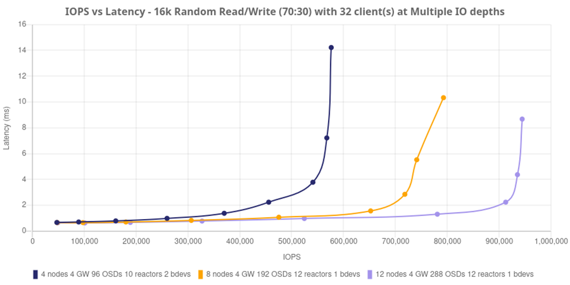
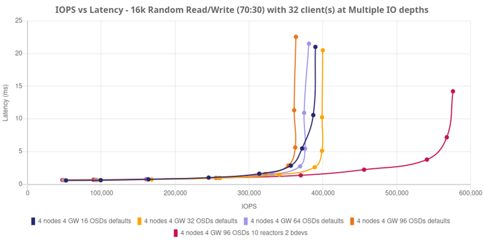
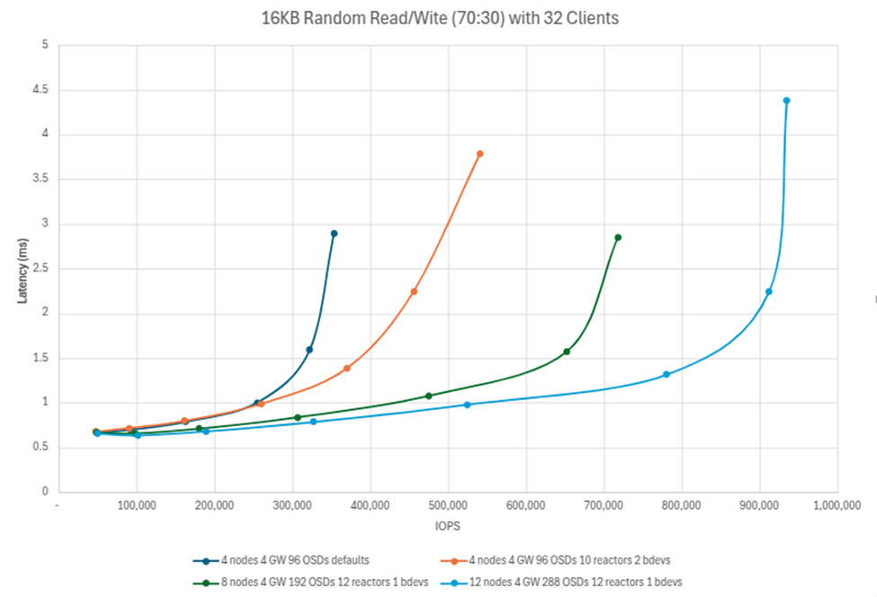

## Performance at Scale with NVMe over TCP

### Exploring the Performance of NVMe over TCP: Revolutionizing Data Storage 

In the data-driven world, the demand for faster, more efficient storage solutions
is escalating. As businesses, cloud providers, and data centers look to handle
ever-growing volumes of data, the performance of storage becomes a critical
factor. One of the most promising innovations in this space is NVMe over
TCP (NVMe/TCP aka NVMeoF), which allows the deployment of high-performance
Non-Volatile Memory Express (NVMe) storage devices over traditional TCP/IP
networks.  This blog delves into Ceph and the performance of our newest
block protocol: NVMe over TCP, its benefits, challenges, and the outlook for
this technology. We will explore performance profiles and nodes populated
with NVMe SSDs to detail a design optimized for high performance.

### Understanding NVMe and TCP: A Quick Overview

Before diving into performance specifics, let’s clarify the key
technologies involved:

* **NVMe (Non-Volatile Memory Express)** is a protocol designed to provide fast
  data access to storage media by leveraging the high-speed PCIe (Peripheral
  Component Interconnect Express) bus. NVMe reduces latency, improves throughput,
  and enhances overall storage performance compared to legacy storage like SATA
  and SAS, while maintaining a price point that is at most slightly increased on
  a $/TB basis. Comparatively speaking, when concerned with performance, scale
  and throughput, NVMe drives are the clear cost-performer in this arena.

* **TCP/IP (Transmission Control Protocol/Internet Protocol)** is one of the
  pillars of modern networking. It is a reliable, connection-oriented protocol
  that ensures data is transmitted correctly across networks. TCP is known for
  its robustness and widespread use, making it an attractive option for
  connecting NVMe devices over long distances and in cloud environments.

Ceph brings NVMe over TCP to market offering NVMe speed and low latency access
to networked storage solutions, without the need for specialized hardware
like Fibre Channel, InfiniBand or RDMA.

### NVMe over TCP Performance: What to Expect

The performance of NVMe over TCP largely depends on the underlying network
infrastructure, storage architecture and design, and the workload being handled.
However, there are a few key factors to keep in mind:

1. **Latency and Throughput**: NVMe is designed to minimize latency, and this benefit
 carries over into NVMe over TCP. While TCP itself introduces some latency due
 to its connection management features (compared to lower-latency protocols
 like RDMA), NVMe over TCP still offers significantly better latency than
 traditional network storage protocols. Notable regarding Ceph: at scale there
 is a clear tradeoff between latency and throughput, as you will see in this
 article. As the limits of performance are pushed for a defined architecture,
 Ceph doesn’t falter or fail, we simply see an increase in latency when serving
 higher demand in throughput. This is highly important to keep in mind when
 designing for both IOPS and Latency for any given workload.
2. **Network Congestion and Packet Loss**: TCP is known for its reliability in the
 face of network congestion and packet loss, thanks to its built-in error
 correction and retransmission mechanisms. However, these features can sometimes
 introduce performance bottlenecks, especially in environments with high traffic
 or unreliable network connections. For example, if the network becomes congested,
 TCP's flow control mechanisms may throttle performance to ensure data integrity.
 To mitigate this, businesses often deploy Quality of Service (QoS) and Class of
 Service (CoS) mechanisms to fine-tune network parameters and ensure smooth data
 transmission.
3. **CPU Overhead**: While NVMe over TCP eliminates the need for specialized
 hardware, it can introduce some CPU overhead due to the protocol processing
 required by the TCP/IP stack. NVMe/TCP requires more from the CPU, where
 storage workload processing happens. However, we do see performance benefits
 in scaling CPU cores consumed with increased workload demand, thus driving down
 latency and enhancing throughput.
4. **Optimization and Tuning**: To get the best performance from NVMe over TCP,
 network administrators often need to fine-tune several parameters, including
 TCP window size, buffer sizes, and congestion control settings. With
 optimizations such as TCP offloading and TCP/UDP-based congestion control,
 the performance of NVMe over TCP can be enhanced to better meet the needs
 of demanding workloads. For Ceph we can dive deeper into
 software parameters that, when sized for your hardware platform, can
 maximize performance without additional cost or hardware complexity.

### Definitions

Let’s define some important terms in the Ceph world to ensure that we see
which parameters can move the needle for performance and scale.

**OSD** (Object Storage Daemon) is the object storage daemon for the
Ceph software defined storage system. It manages data on physical storage drives
with redundancy and provides access to that data over the network. For the
purposes of this article, we can state that an OSD is the software service
that manages disk IO for a given physical device.

**Reactor / Reactor Core**: this is an event handling model in software
development that comprises an event loop running a single thread which
handles IO requests for NVMe/TCP. By default, we begin with 4 reactor core
threads, but this model is tunable via software parameters.

**BDevs_per_cluster**: BDev is short for Block Device, this driver is how the
NVMe Gateways talk to Ceph RBD images. This is important because by default
the NVMe/TCP Gateway leverages 32 BDevs in a single cluster context per
librbd client (``bdevs_per_cluster=32``), or storage client connecting
to the underlying volume. This tunable parameter can be adjusted to provide
scaling all the way to a 1:1 context for NVMe volume to librbd client,
creating an uncontested path to performance for a given volume at the
expense of more compute resources.

### Performance

Starting off strong, below we see how adding drives (OSDs) and nodes to a Ceph
cluster can increase IO performance across the board. A 4-node Ceph cluster with
24 drives per node can provide over 450,000 IOPS with a 70:30 read/write profile,
using a 16k block size with 32 FIO clients. That’s over 100K IOPS average per
node! This trend scales linearly as nodes and drives are added, showing a top-end
of nearly 1,000,000 IOPS with a 12 node, 288 OSD cluster. It is noteworthy that
the higher end numbers are shown with 12 reactors and 1 librbd client per
namespace (``bdevs_per_cluster=1``), which demonstrates how the addition of
librbd clients enables more throughput to the OSDs serving the underlying
RBD images and their mapped NVMe namespaces.

The next test below shows how tuning an environment to the underlying hardware
can show massive improvements in software defined storage. We begin with a
simple 4-node cluster, and show scale points of 16, 32, 64 and 96 OSDs. In this
test the Ceph Object Storage Daemons have been mapped 1:1 directly to physical
NVMe drives. 

It may seem like adding drives and nodes alone only gains a modicum of
performance, but with software defined storage there is always a trade-off
between server utilization and storage performance – in this case for the
better. When the same cluster has the default reactor cores increased from
4 to 10 (thus consuming more CPU cycles), and ``bdevs_per_cluster` is
configured to increase software throughput via the addition of librbd clients,
the performance nearly doubles. All this by simply tuning your environment to
the underlying hardware and enabling Ceph to take advantage of this processing
power.

The chart below shows the IOPS delivered at the three “t-shirt” sizes of tuned
4-node, 8-node and 12-node configurations, and a 4-node cluster with the defaults
enabled for comparison. Again we see that, for <2ms latency workloads, Ceph
scales linearly and in a dependable, expectable fashion. Note: as I/O
becomes congested, at a certain point the workloads are still serviceable
but with higher latency response times. Ceph continues to commit the required
reads and writes, only plateauing once the existing platform design boundaries
become saturated.

### The Future of NVMe over TCP

As storage needs continue to evolve, NVMe over TCP is positioned to become a key
player in the high-performance storage landscape. With continued advancements in
Ethernet speeds, TCP optimizations, and network infrastructure, NVMe over TCP
will continue to offer compelling advantages for a wide range of applications,
from enterprise data centers to edge computing environments.

Ceph is positioned to be the top performer in software defined storage for
NVMe over TCP, by enabling not only high-performance, scale-out NVMe storage
platforms, but also by enabling more performance on platform by user-controlled
software enhancements and configuration.

### Conclusion

Ceph’s NVMe over TCP Target offers a powerful, scalable, and cost-effective
solution for high-performance storage networks.

The authors would like to thank IBM for supporting the community by through
our time to create these posts.
