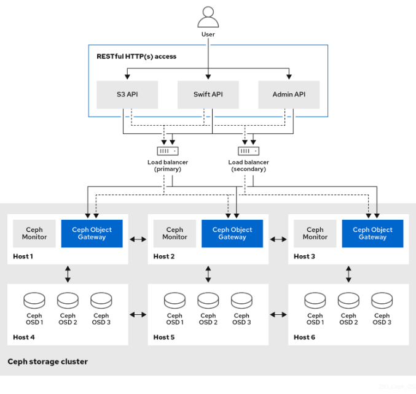
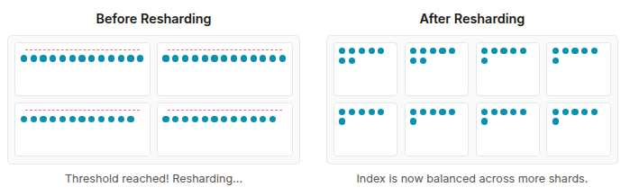

## Ceph RGW Architecture: A Deep Dive into its Core Foundations

### Introduction: The Stateless Powerhouse

The Ceph Object Gateway (RGW) is far more than just a proxy; it's a high-level
abstraction layer that seamlessly provides Amazon S3 and OpenStack Swift
RESTful APIs on top of the underlying Reliable Autonomic Distributed
Object Store (RADOS). For storage architects, the RGW is crucial because
it translates standard HTTP requests for object operations into native RADOS
operations executed directly against the cluster. This allows applications
built for popular cloud object storage ecosystems to leverage a Ceph cluster as
their storage backend without modification.

A fundamental principle governing RGW's design is its stateless nature. This
critical architectural decision is the bedrock of its massive horizontal
scalability and high availability. Since RGW daemons maintain no persistent
state related to client sessions, you can achieve near-linear performance
scaling simply by deploying more RGW instances behind a standard load balancer.
The failure of any single RGW daemon is a non-critical event because the load
balancer can redirect client traffic to the remaining healthy instances, making
the outage transparent to end-users. All vital state, including user metadata,
bucket definitions, ACLs, and object data, is durably stored within the RADOS cluster in designated pools.



In this first deep dive, we peel back the layers to examine the RGW frontend
components, the specialized RADOS pools that house its internal metadata, and
the critical mechanics of bucket indexing and sharding that enable high-performance
object operations.

### RGW Frontends

An incoming client request to an RGW daemon traverses several internal layers,
beginning with the frontend web server that handles the initial HTTP connection.
RGW has historically supported two primary embedded frontends: Civetweb, the legacy
default, and Beast, the modern, high-performance default choice.

Civetweb operates on a synchronous, thread-per-connection model. In contrast,
Beast is a modern frontend built upon Boost. The Asio C++ library facilitates
an asynchronous, event-driven I/O model. Instead of dedicating a thread to each
connection, Beast uses a small pool of worker threads to service thousands of
connections concurrently. This model is significantly more efficient in terms of
CPU and memory utilization, as threads are not blocked waiting for I/O, and the
memory overhead per-connection is drastically reduced. The architectural shift
from Civetweb to Beast was a direct response to the demands of modern
cloud-native applications, which often generate high-concurrency, high-IOPS workloads..

#### Frontend Configuration in Action

When deploying or modifying RGW services using cephadm, the frontend type and its
settings can be specified directly within the service specification file. Beast is
the default and recommended option for the RGW frontend:

```
service_type: rgw
service_id: myrealm.myzone
spec:
  rgw_realm: myrealm
  rgw_zone: myzone
  ssl: true
  rgw_frontend_port: 1234
  rgw_frontend_type: beast
  rgw_frontend_ssl_certificate: ...
```

This YAML snippet illustrates how cephadm deploys an RGW service, specifying the
realm and zone, enabling SSL termination, and explicitly setting the ``rgw_frontend_type``
to ``beast`` on TCP port 1234.

### Understanding RGW RADOS Pools

For RGW to operate as a truly stateless component, every piece of critical information,
user data, metadata, and logs must be stored persistently within the RADOS layer. This
persistence is achieved through a set of specialized, dedicated RADOS pools.

RGW's multi-pool architecture is a deliberate design choice that allows operators
to physically separate different classes of data onto different hardware tiers,
enabling a highly optimized balance of performance and cost. For example,
latency-sensitive metadata and logs can be placed on fast replicated pools backed
by SSD media. At the same time, capacity-heavy object payloads can reside on
erasure-coded pools supported by slower, more cost-effective HDD or increasingly
QLC-class SSDs. NVMe SSDs are preferable to legacy SAS/SATA SSDs as they offer
future-proofing, better density, and better performance for the money.  An NVMe
server can actually cost less than a SATA server.

#### Key RGW Pools and Their Purposes

|Pool Name Suffix|Purpose|Typical Data Protection|Recommended Media|
|-----------------|-------|-----------------------|------------------|
|.rgw.root|Stores global RGW configuration (realms, zonegroups, zones)|Replicated|SSD|
|.rgw.control|Internal RGW daemon coordination|Replicated|SSD|
|.rgw.meta|User and bucket metadata|Replicated|SSD|
|.rgw.log|Operation and replication logs|Replicated|SSD|
|.rgw.buckets.index|Bucket object listings (omaps). Critical for performance|Replicated|SSD|
|.rgw.buckets.data|Main object data payload|Erasure Coded|TLC/QLC SSD, HDD|
|.rgw.buckets.non-ec|Auxiliary pool for operations incompatible with EC|Replicated|SSD / HDD|mark

When the RGW service first tries to operate on a RADOS pool that does not exist, it
will create that pool with the values of the config options ``osd_pool_default_pg_num``
and ``osd_pool_default_pgp_num``. These defaults are sufficient for some pools, but others
(especially those listed in placement_pools for the bucket index and data) will require
additional tuning. Note that when the PG autoscaler is enabled it will adjust the placement
group values for these pools automatically, with an increased ``BIAS`` for ``.index`` pools
so that they are allocated more than their aggregate data would otherwise inform.
For the autoscaler to work best with the constellation of RGW pools, we suggest raising the
following values from their defaults:

```bash
# ceph config set global mon_target_pg_per_osd 300
# ceph config set global mon_max_pg_per_osd 600
```

Pool names specific to an RGW zone follow the naming convention ``zone-name.pool-name``.
For example, a zone named ``us-east`` will have the following pools:

```
.rgw.root
us-east.rgw.control
us-east.rgw.meta
us-east.rgw.log
us-east.rgw.buckets.index
us-east.rgw.buckets.data
```

The structure of these pools is vital for understanding RGW's operational mechanics.
Many logical pools are consolidated using RADOS namespaces within the main RADOS
pools (e.g., ``default.rgw.log``).

We can list RADOS namespaces with a command of the following form. Here we can see
how the ``rgw.meta pool`` contains three different RADOS namespaces:

```bash
# rados ls -p default.rgw.meta --all | awk '{ print $1 }' | sort -u
root
users.keys
users.uid
```

Pools with their namespaces are exposed when querying the RGW zone configuration:


```bash
$ radosgw-admin zone get --rgw-zone default
{
    "id": "d9c4f708-5598-4c44-9d36-849552a08c4d",
    "name": "default",
    "domain_root": "default.rgw.meta:root",
    "control_pool": "default.rgw.control",
    "gc_pool": "default.rgw.log:gc",
    "lc_pool": "default.rgw.log:lc",
    "log_pool": "default.rgw.log",
    "intent_log_pool": "default.rgw.log:intent",
    "usage_log_pool": "default.rgw.log:usage",
    "roles_pool": "default.rgw.meta:roles",
    "reshard_pool": "default.rgw.log:reshard",
    "user_keys_pool": "default.rgw.meta:users.keys",
    "user_email_pool": "default.rgw.meta:users.email",
    "user_swift_pool": "default.rgw.meta:users.swift",
    "user_uid_pool": "default.rgw.meta:users.uid",
    "otp_pool": "default.rgw.otp",
   ...
    "placement_pools": [
        {
            "key": "default-placement",
            "val": {
                "index_pool": "default.rgw.buckets.index",
                "storage_classes": {
                    "STANDARD": {
                        "data_pool": "default.rgw.buckets.data"
                    }
                },
                "data_extra_pool": "default.rgw.buckets.non-ec",
                "index_type": 0
            }
        }
    ],
    "realm_id": "",
    "notif_pool": "default.rgw.log:notif"
}
```

This JSON output details the configuration for the default zone.
Notice how many different logical functions (GC, LC, usage logs)
are mapped to the RADOS pool ``default.rgw.log` but are separated
using RADOS Namespaces (e.g., ``default.rgw.log:gc``).

### A Detailed Overview of the Bucket Index and Sharding

The ability to list the contents of a bucket is fundamental to object storage.
RGW implements this using a dedicated structure called the Bucket Index,
which is responsible for listing bucket content, maintaining a journal
for versioned operations, storing quota metadata, and serving as a log
for multi-zone synchronization.

#### The Bucket Index and OMAPs

The bucket index relies on a special feature of RADOS objects called the Object
Map (OMAP). An OMAP is a key-value store associated with a RADOS object, similar
in concept to Extended Attributes in a POSIX file. For each bucket, RGW creates
one or more dedicated index objects in the .rgw.buckets.index pool. The listing
information for the objects within that bucket is stored within the OMAP of these index objects.

Crucially, the performance of the bucket index relies entirely on the underlying
key-value database: OMAPs are physically stored within the RocksDB database residing
on the OSD's DB partition. This mandates that index pools like ``default.rgw.buckets.index`
must currently use a replicated data protection scheme, as OMAP operations are not
compatible with erasure-coded pools. Investing in fast flash devices (SSDs, ideally NVMe)
for the OSD's DB partition is paramount for bucket listing performance.  RGW index
pools may select a CRUSH rule that places them on pure SSD OSDs, or on hybrid OSDs
with the DB offloaded to SSDs.  Since omaps are purely in the DB portion of a given OSD,
either strategy suffices.

#### Tuning the Index Pool for Performance

While fast storage for OSD DBs is critical, the distribution of the bucket index across
the cluster is equally essential. This is controlled by the Placement Group (PG) count
of the index pool. Poor PG tuning is a common cause of poor listing performance, especially
in large clusters.

##### Placement Group (PG) Count and Parallelism

Each PG is mapped to a set of OSDs, with one acting as the primary. When RGW performs a bucket
listing, it sends parallel read requests to the OMAPs of many different bucket index shard
objects. A higher PG count for the index pool distributes these shards across a greater
number of primary OSDs. This increases the parallelism of the listing operation, as more
physical devices can concurrently service the I/O requests. A low PG count can create a
bottleneck where many requests are funneled to just a few OSDs, which then become saturated.

We suggest that each index pool have at least one PG for every OSD on which it is placed.
When using the PG autoscaler, index pools should automatically have a BIAS value of 4 so
that they receive a higher number of PGs. See above for recommendations on central configuration
settings to allow the autoscaler to provision enough PGs to index pools.

#### Visualizing the Bucket Index Log

First, we confirm the existence and Pool ID of the bucket index pool:

```bash
$ ceph osd lspools | grep default.rgw.buckets.index
6 default.rgw.buckets.index
```

Here we see that RADOS pool with ID ``6`` is the dedicated index pool for the ``default`` zone.

Now, let’s get a bucket name to use as an example: ``bucket1``:

```bash
$ radosgw-admin bucket list | grep bucket1
    "bucket1",
```

Next, we can examine the index entries for a specific bucket from the ``default`` zone, ``bucket1``, using: ``radosgw-admin``:

```bash
$ radosgw-admin bi list --bucket bucket1
[
    {
        "type": "plain",
        "idx": "hosts5",
        "entry": {
            "name": "hosts5",
            "instance": "",
            "ver": {
                "pool": 16,
                "epoch": 3
            },
            "locator": "",
            "exists": "true",
            "meta": {
                "category": 1,
                "size": 4066,
                "mtime": "2022-12-14T16:27:02.562603Z",
                "etag": "71ad37de1d442f5ee2597a28fe07461e",
                "storage_class": "",
                "owner": "test",
                "owner_display_name": "test",
                "content_type": "",
                "accounted_size": 4066,
                "user_data": "",
                "appendable": "false"
            },
            "tag": "_iDrB7rnO7jqyyQ2po8bwqE0vL_Al6ZH",
            "flags": 0,
            "pending_map": [],
            "versioned_epoch": 0
        }
    }
]
```

The ``radosgw-admin bi list`` output displays the stored metadata for
an S3 object (``hosts5``), including size, modification time (mtime), and ETag.

#### The Scalability Enabler: Bucket Sharding

A significant performance problem arises when a bucket index grows very large.
If a bucket's index is stored in a single RADOS object, only one
operation can be performed at a time. This serialization limits parallelism and
can become a severe bottleneck for high-throughput write workloads.

To circumvent this limitation, RGW employs Bucket Index Sharding. This mechanism
divides the bucket index into multiple parts, with each shard stored on a separate
RADOS object within the index pool. When an object is written, the update is
directed to a specific shard determined by a hash of the object's name. This
allows multiple operations to occur concurrently across different Placement
Groups (PGs) and OSDs, improving overall scalability. The number of shards
should be a prime number, and is configurable with the ``bucket_index_max_shards``
config option, which defaults to ``11``). We can get relevant metadata information
about your bucket and objects using the
radosgw-admin bucket stats command, like the shard count, bucket usage, quota,
versioning, object lock, owner, etc.

```bash
$ radosgw-admin bucket stats --bucket bucket1 | grep shards
    "num_shards": 11,
```

Bucket Index pool for the default zone:

```bash
$ ceph osd lspools | grep default.rgw.buckets.index
6 default.rgw.buckets.index
```

We can visually confirm the existence of these shards as discrete OMAP RADOS objects:

```bash
$ rados -p default.rgw.buckets.index ls
.dir.7fb0a3df-9553-4a76-938d-d23711e67677.34162.1.9
.dir.7fb0a3df-9553-4a76-938d-d23711e67677.34162.1.0
.dir.7fb0a3df-9553-4a76-938d-d23711e67677.34162.1.10
.dir.7fb0a3df-9553-4a76-938d-d23711e67677.34162.1.1
.dir.7fb0a3df-9553-4a76-938d-d23711e67677.34162.1.7
.dir.7fb0a3df-9553-4a76-938d-d23711e67677.34162.1.8
.dir.7fb0a3df-9553-4a76-938d-d23711e67677.34162.1.2
.dir.7fb0a3df-9553-4a76-938d-d23711e67677.34162.1.6
.dir.7fb0a3df-9553-4a76-938d-d23711e67677.34162.1.5
.dir.7fb0a3df-9553-4a76-938d-d23711e67677.34162.1.4
.dir.7fb0a3df-9553-4a76-938d-d23711e67677.34162.1.3
```

Each ``.dir`` RADOS object listed here is a separate bucket index shard. In this
example, 11 shards are visible, matching the default number of shards per bucket.

At bucket creation time, the initial number of shards is set
by the `` bucket_index_max_shards`` option at the zonegroup level, and it is used
for all buckets. If a different number of shards is required for a specific bucket,
it is possible to change it.

Note: we recommend a maximum of 102,400 S3 objects per bucket index shard.

We can get the marker for a bucket using the stats command:

```bash
$ radosgw-admin bucket stats --bucket bucket1 | grep marker
    "marker": "7fb0a3df-9553-4a76-938d-d23711e67677.34162.1",
```

Now that we know that the _marker_ for ``bucket1`` is ``7fb0a3df-9553-4a76-938d-d23711e67677.34162.1``.
Let’s upload an object named ``file1`` to ``bucket1``:

```bash
$ aws --endpoint=http://ceph-node02:8080 s3 cp /etc/hosts s3://bucket1/file1 --region default
upload: ../etc/hosts to s3://bucket1/file1
```


Let’s investigate the bucket index for this bucket at the RADOS level. By
listing the omapkeys on the bucket index object, we can see a key called ``file1``,
which matches the uploaded object name. Here we are doing a listomapkeys on one of
the 11 shard objects available, in this case, shard 2. As mentioned before, objects
will be spread among the different shards during creation.

```bash
$ rados -p default.rgw.buckets.index listomapkeys .dir.7fb0a3df-9553-4a76-938d-d23711e67677.34162.1.2
file1
```

When we check the values, we can see that the key/value entry in the bucket index shard ``2``
omap object for ``bucket1`` is 217 bytes in size. In the hex dump we see info including the object name.

```bash
$ rados -p default.rgw.buckets.index listomapvals .dir.7fb0a3df-9553-4a76-938d-d23711e67677.34162.1.2
file1
value (217 bytes) :
00000000  08 03 d3 00 00 00 05 00  00 00 66 69 6c 65 31 01  |..........file1.|
00000010  00 00 00 00 00 00 00 01  07 03 5a 00 00 00 01 32  |..........Z....2|
00000020  05 00 00 00 00 00 00 4b  ab a1 63 95 74 ba 04 20  |.......K..c.t.. |

```


When we add more S3 objects to our bucket, we see new key/value entries for each
added to the shards available for the bucket. In this example ``file1``, ``file2``,``file4``, ``file10``
landed in shard ``2``:

```bash
$ rados -p default.rgw.buckets.index listomapkeys .dir.7fb0a3df-9553-4a76-938d-d23711e67677.34162.1.2
file1
file2
file4
file10
```

We can confirm the placement of a specific shard, shard ``2``:

```bash
$ ceph osd map default.rgw.buckets.index .dir.7fb0a3df-9553-4a76-938d-d23711e67677.34162.1.2
osdmap e90 pool 'default.rgw.buckets.index' (9) object '.dir.7fb0a3df-9553-4a76-938d-d23711e67677.34162.1.2' -> pg 9.6fa75bc9 (9.9) -> up ([1,2], p5) acting ([1,2], p5)
```

This output shows that the index shard is replicated across the cluster and lives on specific OSDs. Distributing the index across multiple PGs (and therefore OSDs) enables parallelism.

#### The Zero-Byte Mystery: Why the Index Pool Appears Empty

when you query the space usage of the bucket index pool, the result often surprises
engineers unfamiliar with Ceph's OMAP architecture:

```bash
$ rados df -p default.rgw.buckets.index
POOL_NAME                  USED  OBJECTS  CLONES  COPIES  MISSING_ON_PRIMARY  UNFOUND  DEGRADED  RD_OPS       RD  WR_OPS      WR  USED COMPR  UNDER COMPR
default.rgw.buckets.index   0 B       11       0      33                   0        0         0     208  207 KiB      41  20 KiB         0 B          0 B
```

Even inspecting a single shard object(shard 2), shows a size of zero:


```bash
$ rados -p default.rgw.buckets.index stat .dir.7fb0a3df-9553-4a76-938d-d23711e67677.34162.1.2
default.rgw.buckets.index/.dir.7fb0a3df-9553-4a76-938d-d23711e67677.34162.1.2 mtime 2022-12-20T07:32:11.000000-0500, size 0
```

Despite containing 11 RADOS objects (shards), the pool reports 0 bytes used.
This is because bucket index listing data is stored entirely as OMAP entries
within the RocksDB database of each OSD, not as payload data in the RADOS
object itself. This confirms why leveraging fast flash media (SSDs) for at least
the OSD DB partition is essential for maximizing bucket index performance.

#### Managing Index Growth with Dynamic Bucket Resharding

As a bucket scales to hundreds of thousands or millions of S3 objects, its
index can become a performance bottleneck. By default, a single shard can
become "hot" as it accumulates too many entries. The threshold for the number of
S3 objects per shard is configurable, defaulting to 100,000. Very large numbers of
S3 objects per bucket reintroduce the serialization problem that sharding was
designed to solve. To combat this, RGW features an advanced, automated mechanism
known as Dynamic Bucket Resharding (DBR).

DBR is a background process that continuously monitors the number of entries in
each bucket index shard. When a shard grows beyond its configured threshold, DBR
automatically and online triggers a resharding operation. This process creates a
new set of index objects with a greater number of shards and then safely migrates
the existing index entries from the old, smaller layout to the new, larger one.



##### The Evolution of Online Resharding: Minimizing Impact

Historically, the resharding operation required temporarily pausing write I/O to the bucket.
While read operations remained unaffected, this write pause could be noticeable and
painful on very active workloads.

However, a significant enhancement coming in a forthcoming Tentacle release has drastically minimized
this write freeze. The new implementation makes the resharding process nearly transparent,
allowing writes to proceed with minimal interruption. This improvement is a vital step forward,
making dynamic resharding a seamless, production-safe feature for even the most demanding environments.

##### Not Just Growing, but Shrinking: The Power of Shard Merging

Dynamic resharding is not limited to just scaling up. Consider a scenario in which
a bucket that once held millions of objects has a massive number of them deleted.
The bucket now contains many sparsely populated or even empty index shards. This is
inefficient, as listing operations must still check every shard, adding unnecessary overhead.

To address this, the DBR mechanism was enhanced to support shard merging as well.
As detailed in the Ceph documentation and development
trackers (e.g., [BZ#2135354](https://bugzilla.redhat.com/show_bug.cgi?id=2135354)),
if the object count in a bucket drops significantly, DBR can trigger a "downsizing"
resharding operation. It will migrate the entries from many sparse shards into a new,
smaller, and more densely packed set of index objects.

While DBR is a powerful automated feature, for scenarios where you know a bucket will
be enormous from its inception, a standard best practice remains to pre-shard the
bucket at creation time. By setting an appropriate initial number of shards, you can
avoid the first dynamic resharding event altogether, ensuring optimal performance from
the very first object written.

##### The Future is Ordered: A Glimpse into In-Order Sharding

Currently, RGW's hashed sharding is optimized for write distribution, but it
presents a challenge for listing objects in alphabetical order. To fulfill a
paginated list request, RGW must perform a "scatter-gather" operation, querying
every single shard and sorting the combined results. This can become a bottleneck
for buckets with a very large number of shards.

To solve this, a significant new feature known as in-order sharding (or ordered
bucket listing) is in development. This upcoming evolution will change the
sharding logic to place objects into shards based on their lexicographical
name rather than a hash.

The impact of this change will be transformative. Instead of querying all shards,
a request to list objects will be directed to the specific shard(s) that contain
the requested alphabetical range. This will make paginated listing operations
dramatically faster and more efficient, particularly for workloads that rely
heavily on browsing or iterating through object keys.

By combining the automated scaling of Dynamic Bucket Resharding with the listing
efficiency of in-order sharding, Ceph RGW is on a clear path to providing virtually
limitless and performant scalability within a single bucket, catering to the most
demanding data lake and AI/ML use cases of the future.

### Conclusion: The Engine of Scalability

So far, we have journeyed through the high-performance path of a client request,
from the initial connection at the Beast frontend, through the specialized RADOS
pools, and deep into the intricate mechanics of the bucket index. You now
understand how OMAPs form the backbone of object listings and how Dynamic
Bucket Resharding acts as the engine of scalability, allowing a single bucket
to grow to billions of objects while maintaining performance. We've uncovered
the core mechanisms that handle object discovery and listing at massive scale.

However, our deep dive has so far focused on the index, which are the pointers
to the data. But what about the data itself? And what about the crucial control
plane metadata that defines the users, accounts, and rules governing the entire system?

In [Part 2](https://ceph.io/en/news/blog/2025/rgw-deep-dive-2) of our series,
we will answer these questions. We'll shift our focus
to explore the elegant head/tail model of RGW's data layout, examine the system's
core metadata, and uncover the robust background processes that manage data
throughout its entire lifecycle.


The authors would like to thank IBM for supporting the community with our time to create these posts.
