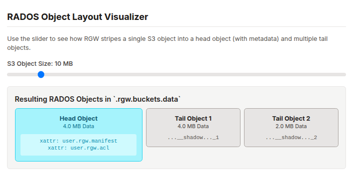
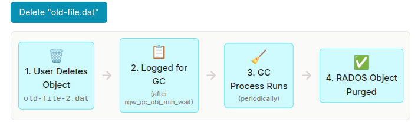
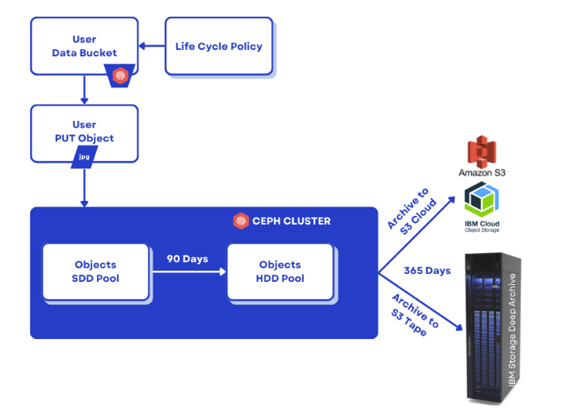

## A Deep Dive into Ceph RGW: Data Path, Sharding, and Automated Management

### Introduction

In the [first part of this deep drive](https://ceph.io/en/news/blog/2025/rgw-deep-dive-1),
we dissected the high-performance request path within the Ceph RGW. We covered its
stateless frontends, foundational RADOS pools, and the critical bucket index,
revealing how dynamic sharding enables virtually limitless scalability for
object listings within a single bucket.

We established how RGW efficiently locates and lists objects at scale. Now, we
shift our focus from the index to the objects themselves and the broader system
that manages them. In this second deep dive, we will explore the control plane by
examining the RGW metadata layout. We will then uncover how S3 objects are physically
stored using the head/tail data model and conclude with a look at the critical
background processes, Garbage Collection, and Lifecycle Management, that automate
data governance.

### RGW Metadata Layout: The Control Plane's Blueprint

Just as the data for a single S3 object is meticulously organized across RADOS,
the entire state of the RGW system, its users, buckets, and policies, is also
durably stored within dedicated RADOS pools. This design is fundamental to the
stateless nature of RGW daemons; all control plane information lives within the
cluster itself, not on the gateways. This metadata is primarily housed in
the ``.rgw.meta pool``, while operational logs for processes like garbage
collection and lifecycle management reside in the ``.rgw.log`` pool.

These metadata objects are stored in an internal binary format. For this reason,
it is critical to use the ``radosgw-admin`` command-line tool for administration
and interaction. This utility reliably decodes the binary records into human-readable
JSON and ensures that any modifications are performed safely.

Note: Never attempt to modify objects in the ``.rgw.meta`` pool directly with the ``rados`` tool.

##### Key Metadata Categories

The ``.rgw.meta`` pool uses RADOS namespaces to separate different types of
information logically. When you query the metadata, you will encounter several
top-level categories:

* ``user``: Stores S3 user records, including access keys, capabilities, usage quotas, and contact information including email.

* ``bucket``: The high-level named bucket record. This contains essential information including the bucket owner, its placement policy (which zone it belongs to), and various flags.

* ``bucket.instance``: Represents the concrete, physical instance of a bucket. This record tracks the bucket's unique ID, shard count for the index, versioning status, and creation timestamps. A single bucket name can have multiple instances over its lifetime, such as when it is deleted and recreated.

* ``roles``: Contains STS (Security Token Service) and IAM role definitions used by the policy evaluation engine to grant temporary credentials.

* ``group``: Defines user groups, which can be used for administrative operations or policy management.

* ``topic``: Stores configuration for S3 bucket event notifications.

* ``otp``: Holds one-time password credentials for multi-factor authentication.

* ``account``: Used for Swift account metadata if the Swift API is enabled.

##### Inspecting Metadata with radosgw-admin

The ``radosgw-admin` tool provides a safe and structured way to explore this
control plane data. First, you can list all available metadata categories:

```bash
$ radosgw-admin metadata list
[
    "user",
    "bucket",
    "bucket.instance",
    "roles",
    ...
]
$ radosgw-admin metadata list account
[
    "RGW42603947660038067",
    "RGW46950437120753278",
    "RGW40572530565246530",
    "RGW66892093834478914",
    "RGW63384910224424377",
    "RGW94705908964376531",
    "RGW25531238860968914"
]
```

Next, list the specific keys within a category, such as ``bucket`` or ``bucket.instance``:

```bash
# List all bucket names
$ radosgw-admin metadata list bucket | grep bucket1
   "bucket1",

# List all concrete bucket instances
$ radosgw-admin metadata list bucket.instance | grep bucket1
"bucket1:7fb0a3df-9553-4a76-938d-d23711e67677.34162.1",
```

Finally, here is an example of retrieving and decoding a specific record using its key.
Piping the output to ``jq`` formats the JSON output for readability:

```bash
# Get bucket metadata by its name
$ radosgw-admin metadata get bucket:bucket1 | jq .

# Get a user record by their UID
$ radosgw-admin metadata get user:my-user-id | jq .
```

Its important to mention that ``radosgw-admin`` makes our life easy with
specific CLI parameters to interact with this metadata directly.  For
example: ``radosgw-admin user`` , ``radosgw-admin account``, ``radosgw-admin bucket`` ,etc

##### Linking Metadata to Usage

To bridge the gap between abstract metadata and real-world usage, ``radosgw-admin``
offers commands that aggregate this information:

```bash
# Get detailed stats for a bucket, including its shard count, object count, and size
$ radosgw-admin bucket stats --bucket <BUCKET_NAME> | jq .

# Get the complete metadata for a single object as RGW sees it
$ radosgw-admin object stat --bucket <BUCKET_NAME> --object <OBJECT_KEY> | jq .
```

This ``object stat`` command is handy, as it shows you the manifest, placement
information, and all system attributes for a specific S3 object, providing a
complete view from the gateway's perspective.

### RGW Data Layout: The Head/Tail Object Model

A single logical S3 object often consists of several physical RADOS objects. RGW
employs a flexible head/tail object model that enables optimizations for various
file sizes and complex operations including MultiPart Upload (MPU).

The primary RADOS object associated with any S3 object is the head object. Its
RADOS object name is typically formed by concatenating the bucket's internal
marker with the object's key, separated by an
underscore, for example ``<bucket_marker>_<object_key>``. The head object serves
two primary purposes. First, it is the authoritative store for all object-level
metadata, including ACLs, HTTP content type, ETag, and any user-defined metadata.
This information is stored efficiently as RADOS extended attributes (xattrs) on
the head object. Second, for small objects (by default, those up to the
configurable ``rgw_max_chunk_size``), the entire data payload of the S3 object
is stored directly within the data portion of the head object. This is a crucial
performance optimization, as it allows both the data and its associated metadata
to be written to the cluster in a single, atomic RADOS operation, minimizing I/O
amplification and latency for small-file workloads.

For objects that exceed this inline data size, the head object's data payload is
used to store a manifest. This manifest is a metadata structure that describes
how the rest of the object's data is physically laid out across the cluster.
It contains an ordered list of the other RADOS objects, known as tail objects,
that hold the remaining data chunks. Each entry in the manifest specifies the
name of a tail object, its size, and its logical offset within the complete S3 object.

If the object size exceeds the ``rgw_max_chunk_size`` (default: 4MB), the data
is striped across multiple RADOS objects: a head object (containing only
metadata/manifest) and one or more tail objects (holding the bulk data).

We can retrieve the default striping size, which governs when data splitting occurs:

```bash
$ ceph config get mon rgw_obj_stripe_size
4194304
```

This output confirms the default RGW object stripe size is 4,194,304 bytes (4MB).

The interaction between the client-defined part size and RGW's internal striping
size (``rgw_obj_stripe_size``) can result in the creation of specifically named
tail objects. If a client uploads a part (e.g., 5 MiB) that is larger than the
RGW stripe size (e.g., 4 MiB), RGW will automatically stripe that part across
multiple RADOS objects. For instance, it might create a 4 MiB object named with
a ``__multipart`` prefix if MPU is used, and a 1 MiB object named with
a ``__shadow`` prefix to hold the remainder. These are simply tail objects whose
names follow a specific convention, and both will be referenced correctly in the final manifest.

Here, we observe the head object for a large file:

```bash
$ aws --endpoint=http://ceph-node02:8080 s3 cp awscliv2.zip s3://bucket1/bigfile
$ aws --endpoint=http://ceph-node02:8080 s3 ls s3://bucket1/bigfile
2022-12-20 15:10:16   20971520 bigfile
$ rados -p default.rgw.buckets.data ls | grep bigfile$
7fb0a3df-9553-4a76-938d-d23711e67677.34162.1_bigfile
```

This is the head object for ``bigfile``. It contains the object's xattrs metadata,
including the ``user.rgw.manifest``, which lists the locations of all tail objects.

The head object stores its metadata efficiently as extended attributes:

```bash
$ rados -p default.rgw.buckets.data listxattr 7fb0a3df-9553-4a76-938d-d23711e67677.34162.1_bigfile
user.rgw.acl
user.rgw.content_type
user.rgw.etag
user.rgw.idtag
user.rgw.manifest
user.rgw.pg_ver
user.rgw.source_zone
user.rgw.tail_tag
user.rgw.x-amz-content-sha256
user.rgw.x-amz-date
```

The listed extended attributes (xattr) confirm that the head object stores critical object
metadata, notably ``user.rgw.manifest``, which describes how the large object's data
payload is split into tail objects.

The ``radosgw-admin object stat`` command can show the object’s manifest
striping/parts via RGW metadata:

```bash
$ radosgw-admin object stat --bucket BUCKET --object OBJECT | jq .
```

Tail objects in our example:

```bash
# rados -p default.rgw.buckets.data ls | grep shadow_bigfile
7fb0a3df-9553-4a76-938d-d23711e67677.34162.1__shadow_bigfile.2~E_PYNwiBq0la0EuZcCOY30KgmRrf1pV.1_1
7fb0a3df-9553-4a76-938d-d23711e67677.34162.1__shadow_bigfile.2~E_PYNwiBq0la0EuZcCOY30KgmRrf1pV.2_1
```

The tail objects typically hold 4MB chunks of data:

```$ rados -p default.rgw.buckets.data stat 7fb0a3df-9553-4a76-938d-d23711e67677.34162.1__shadow_bigfile.2_E_PYNwiBq0la0EuZcCOY30KgmRrf1pV.1_1
default.rgw.buckets.data/7fb0a3df-9553-4a76-938d-d23711e67677.34162.1__shadow_bigfile.2_E_PYNwiBq0la0EuZcCOY30KgmRrf1pV.1_1 mtime 2022-12-20T15:10:16.000000-0500, size 4194304
```



### S3 Multipart Upload: An Atomic Commit Operation

The S3 Multipart Upload (MPU) feature is designed for efficiently uploading
large objects by dividing them into smaller parts that can be uploaded
independently and in parallel. RGW implements this elegantly as a metadata-only
commit operation.

The workflow involves three key steps:

* _Multipart Upload Initiation_: A request is sent to get a unique Upload ID.

* _Parts Upload_: Individual parts are uploaded using both the Upload ID and a unique Part ID. Each part is stored as a distinct, temporary RADOS object. If a part size exceeds the RGW stripe size (default 4MB), it is internally segmented.

* _Multipart Upload Completion (Atomic Commit)_: When all parts are uploaded, the client sends a completion request. RGW avoids costly data copying. Instead, it creates the final head object and populates its internal manifest with pointers to the temporary RADOS objects that constitute the parts. This results in near-instantaneous completion.

This design makes the completion of a large object upload nearly instantaneous
from the cluster's perspective. The head object itself contains no user data
in this case, which is why low-level tools will report its size as 0 bytes;
its payload is the manifest, not the object content.

#### MPU Structure in RADOS

When a file is uploaded in chunks (e.g., 5MB chunks) and the RGW stripe width
is 4 MiB, RGW handles the internal splitting: it takes the first 4 MiB to create a
"multipart" RADOS object and the remaining 1 MiB to create a "shadow" tail RADOS object.

Let’s check it out with an example. We will set the client chunk size to 5 MiB, and upload a 20 MiB file:

```bash
$ aws configure set default.s3.multipart_chunksize 5MB
$ aws --endpoint=http://ceph-node02:8080 s3 cp text.txt s3://bucket1/5chuncks
```

We send 5 MiB chunks to RGW, and RGW has a stripe width of 4 MiB, which means
RGW will take the first 4 MiB and create a "multipart" RADOS object and then
a 1 MiB "shadow" RADOS tail object.

```bash
$ rados -p default.rgw.buckets.data ls | grep 5chuncks
7fb0a3df-9553-4a76-938d-d23711e67677.34162.1__shadow_5chuncks.2_r3yyxqL2hYs5DW32L9UXR3uawF4VEKL.2_1
7fb0a3df-9553-4a76-938d-d23711e67677.34162.1__multipart_5chuncks.2_r3yyxqL2hYs5DW32L9UXR3uawF4VEKL.2
7fb0a3df-9553-4a76-938d-d23711e67677.34162.1__shadow_5chuncks.2_r3yyxqL2hYs5DW32L9UXR3uawF4VEKL.3_1
7fb0a3df-9553-4a76-938d-d23711e67677.34162.1__shadow_5chuncks.2_r3yyxqL2hYs5DW32L9UXR3uawF4VEKL.4_1
7fb0a3df-9553-4a76-938d-d23711e67677.34162.1__multipart_5chuncks.2_r3yyxqL2hYs5DW32L9UXR3uawF4VEKL.4
7fb0a3df-9553-4a76-938d-d23711e67677.34162.1__shadow_5chuncks.2_r3yyxqL2hYs5DW32L9UXR3uawF4VEKL.1_1
7fb0a3df-9553-4a76-938d-d23711e67677.34162.1__multipart_5chuncks.2_r3yyxqL2hYs5DW32L9UXR3uawF4VEKL.3
7fb0a3df-9553-4a76-938d-d23711e67677.34162.1_5chuncks
7fb0a3df-9553-4a76-938d-d23711e67677.34162.1__multipart_5chuncks.2_r3yyxqL2hYs5DW32L9UXR3uawF4VEKL.1
```

The output shows creation of the various components, including the final head
object (...``_5chuncks``), as well as multiple multipart and shadow objects
corresponding to the striped parts.

The size verification of these objects demonstrates the RGW splitting logic: the
multipart head RADOS object is 4 MiB, and the tail (shadow) RADOS object is 1 MiB.

```bash
# Check the size of the main 4MB chunk
$ rados -p default.rgw.buckets.data stat 7fb0a3df-9553-4a76-938d-d23711e67677.34162.1__multipart_5chuncks.2_r3yyxqL2hYs5DW32L9UXR3uawF4VEKL.2
default.rgw.buckets.data/7fb0a3df-9553-4a76-938d-d23711e67677.34162.1__multipart_5chuncks.2_r3yyxqL2hYs5DW32L9UXR3uawF4VEKL.2 mtime 2022-12-21T03:07:49.000000-0500, size 4194304

# Check the size of the remaining 1MB chunk
$ rados -p default.rgw.buckets.data stat 7fb0a3df-9553-4a76-938d-d23711e67677.34162.1__shadow_5chuncks.2_r3yyxqL2hYs5DW32L9UXR3uawF4VEKL.2_1
default.rgw.buckets.data/7fb0a3df-9553-4a76-938d-d23711e67677.34162.1__shadow_5chuncks.2_r3yyxqL2hYs5DW32L9UXR3uawF4VEKL.2_1 mtime 2022-12-21T03:07:49.000000-0500, size 1048576
```


These parts are not assembled or merged in RADOS: this is their final state.

Finally, the completed S3 object's head RADOS object contains only the metadata
manifest, which is why it reports a size of zero bytes at the RADOS level:

```bash
$ rados -p default.rgw.buckets.data stat 7fb0a3df-9553-4a76-938d-d23711e67677.34162.1_5chuncks
default.rgw.buckets.data/7fb0a3df-9553-4a76-938d-d23711e67677.34162.1_5chuncks mtime 2022-12-21T03:07:49.000000-0500, size 0
```

More information on Multipart Upload can be found at [AWS Multipart Upload](https://docs.aws.amazon.com/AmazonS3/latest/userguide/mpuoverview.html).

### The Asynchronous Garbage Collector (GC)

When clients delete S3 objects or overwrite them, the underlying RADOS objects
are not immediately removed. The primary function of object deletion is to
update the bucket index (or place a delete marker, if versioning is active).
Once the S3 object is removed from the index, its underlying RADOS objects
are effectively "orphaned."

These orphaned RADOS objects are then inserted into the Garbage Collection (GC)
queue. The Garbage Collector is a critical background process in RGW responsible
for asynchronously reclaiming the storage space consumed by these deleted objects.
This design ensures that client ``DELETE`` requests return quickly without waiting
for the slow process of physically purging data blocks.



For workloads with high object churn (many creations and deletions), the GC process
can lag behind, causing a build-up of reclaimable space. To combat this,
administrators can tune several key parameters to make GC more aggressive:

* ``rgw_gc_obj_min_wait``: The minimum time a before deleted object becomes eligible
  for collection. Reducing this (default is 2 hours) accelerates space reclamation.

* ``rgw_gc_max_concurrent_io``: The number of parallel RADOS delete operations a GC
  thread can issue. Increasing this from the default of ``10`` allows GC to process
  more objects simultaneously, at the cost of higher background I/O on the cluster.

* ``rgw_gc_processor_period``: The interval between GC processing cycles. A lower
  value means the GC thread runs more frequently.

* ``rgw_gc_max_trim_chunk``: The number of log entries to process in a single batch.

We can use the below commands to list all objects scheduled for removal:

```bash
$ radosgw-admin gc list
$ radosgw-admin gc list --include-all
```

By default, Ceph waits for 2 hours between GC cycles. To manually run the GC
deletion process, run:

```bash
$ radosgw-admin gc process --include-all
```

This command can be executed to force the Garbage Collector to process its backlog
manually, ensuring the quick reclamation of space without waiting for the next scheduled run.

Note:  The ``rgw_gc_max_objs`` option should NEVER be modified from its default value
in a running cluster. This value should only be modified (if at all) before deploying RGWs.

Note also: ``radosgw-admin`` can accept the ``--bypass-gc``switch to delete underlying
  storage immediately, but we strongly recommend **not** passing this option.


Deployments with heavy S3 object churn may also find value in deploying a dedicated
cohort of RGW daemons that only process GC events, which are then disabled in the client-facing
cohort.

### Lifecycle (LC) Management

The Lifecycle (LC) Management engine automates data management based on user-defined
policies applied to buckets. These policies consist of rules that trigger actions
based on an object's age or other criteria. Everyday actions include ``Expiration``,
which deletes an object, and ``Transition``, which moves an object to a different
storage class. Lifecycle Transition can be defined between arbitrary storage
classes (Tiers) within a cluster or to external S3 compatible endpoints, which
include AWS, IBM Cloud or S3 Tape endpoints:



You can refine S3 Lifecycle expiration in RGW with fine-grained filters:
* Current vs Noncurrent object versions
* Expire delete markers (``ExpiredObjectDeleteMarker``)
* Automatically abort incomplete multipart uploads (``AbortIncompleteMultipartUpload``)
* Cap retained older versions via ``NewerNoncurrentVersions``
* Scope rules by object size using ``ObjectSizeGreaterThan`` and ``ObjectSizeLessThan``

These filters, along with the use of S3 Tags, can be mixed to control cleanup behavior
at scale with incredible granularity.

The LC engine is implemented as a set of multi-threaded worker processes. These workers
periodically scan the bucket indexes across the cluster. For each object they encounter,
they evaluate its properties against the bucket's lifecycle policy. If a rule's
conditions are met, the corresponding action is executed. An ``Expiration``
action effectively triggers a standard delete, removing the object's index
entry and enqueuing its data for GC. A ``Transition`` action involves copying the
object's data to the target storage pool (which could be on a different media tier
or even a remote cloud tier), and then updating the object's metadata to reflect its
new location. To scale across large clusters, the LC engine's parallelism is tunable:

* ``rgw_lc_max_worker``: This controls the number of main worker threads, which
  process multiple bucket index shards in parallel. This should be increased for
  clusters with a vast number of buckets.

* ``rgw_lc_max_wp_worker``: This defines the number of sub-threads within each
  worker's pool, which process objects within a single shard in parallel.
  This should be increased for clusters with a few buckets that each contain a very large
  number of S3 objects.


Here is a ``radosgw-admin`` command listing the configured LC jobs in the cluster:

```bash
$ radosgw-admin lc list | jq .
[
  {
    "bucket": ":ingest:fcabdf4a-86f2-452f-a13f-e0902685c655.47553.1",
    "shard": "lc.0",
    "started": "Sat, 11 Oct 2025 11:20:59 GMT",
    "status": "COMPLETE"
  },
  {
    "bucket": ":tierbucket:fcabdf4a-86f2-452f-a13f-e0902685c655.323278.10",
    "shard": "lc.3",
    "started": "Sat, 11 Oct 2025 11:20:56 GMT",
    "status": "COMPLETE"
  },
```

We can get the information for a specific bucket using a command of the following
form. This rule is using object tags with the k/v ``processed``:``true`` as a
filter to expire objects older than one day.

```bash
$ # radosgw-admin lc get --bucket ingest
{
    "prefix_map": {
        "": {
            "status": true,
            "dm_expiration": false,
            "expiration": 1,
            "noncur_expiration": 0,
            "mp_expiration": 0,
            "obj_tags": {
                "tagset": {
                    "processed": "true"
                }
            },
            "transitions": {},
            "noncur_transitions": {}
        }
    },
    "rule_map": [
        {
            "id": "Delete objects that are older than 24 hours",
            "rule": {
                "id": "Delete objects that are older than 24 hours",
                "prefix": "",
                "status": "Enabled",
                "expiration": {
                    "days": "1",
                    "date": ""
                },
                "noncur_expiration": {
                    "days": "",
                    "date": ""
                },
                "mp_expiration": {
                    "days": "",
                    "date": ""
                },
                "filter": {
                    "prefix": "",
                    "obj_tags": {
                        "tagset": {
                            "processed": "true"
                        }
                    }
                },
                "transitions": {},
                "noncur_transitions": {},
                "dm_expiration": false
            }
        }
    ]
}
```

### Conclusion: The Engine Room Revealed

Across this two-part deep dive, we've journeyed through the core architectural
pillars of Ceph RGW. From the high-performance frontends and the intricate
mechanics of bucket index sharding to the elegant head/tail data layout and
the automated background processes, you now have a comprehensive, end-to-end
understanding of how RGW achieves its remarkable scalability and flexibility.

Understanding the engine's anatomy is just the first step. To truly master Ceph
RGW, we must learn how to tune, secure, and operate it in complex, real-world environments.

This architectural exploration is the foundation for our ongoing series on Ceph RGW mastery.


The authors would like to thank IBM for supporting the community with our time to create these posts.
