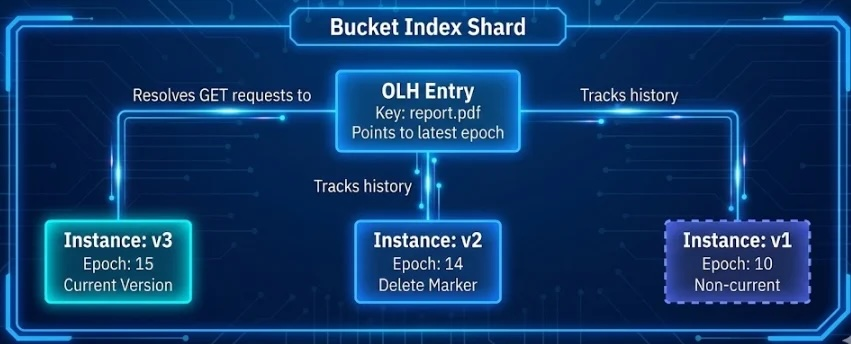

## Introduction

In the [first](https: https://ceph.io/en/news/blog/2025/rgw-deep-dive-1)
and [second](https:https://ceph.io/en/news/blog/2025/rgw-deep-dive-2) parts of
this deep dive series, we dissected the core foundations of Ceph RGW: stateless
frontends, specialized RADOS pools, bucket index mechanics, and the head/tail
data layout. We explored how the Ceph Object Gateway(RGW) achieves massive
scalability through dynamic bucket sharding and how background processes, including
Garbage Collection and Lifecycle Management, automate data governance.

We now turn to two critical features for enterprise data
protection: *S3 Object Versioning* and *S3 Object Lock*.
These features transform the Ceph Object Gateway (RGW) from a simple object store
into a robust data preservation platform capable of meeting regulatory compliance
requirements, protecting against accidental deletions, and supporting immutable
storage patterns.

In this third deep dive, we will first explore the concepts behind versioning
and object lock from the S3 API perspective. Then, we'll peel back the layers
to reveal how RGW implements these features internally, focusing on a crucial
architectural component: the *Object Logical Head (OLH)*. Understanding this
mechanism is key to understanding how RGW efficiently maintains version history
while preserving the performance characteristics we expect.

## S3 Object Versioning: Concepts and Rationale

Object versioning is a mechanism that allows users to preserve, retrieve, and
restore every version of every object stored in a bucket. When versioning is
enabled, each object modification (PUT) or deletion creates a new, immutable
record rather than overwriting or removing existing data.

### Why Versioning Matters

Without versioning, object storage follows a "last write wins" model. Uploading
an object with the same key as an existing object silently replaces it. A DELETE
operation permanently removes the object. While simple, this model offers no
protection against:

* *Accidental overwrites*: A user uploads a corrupted file over a critical dataset
    
* *Accidental deletions*: A script with a bug issues DELETE commands against production data
    
* *Malicious actions*: A compromised credential is used to destroy data
    
* *Audit requirements*: Regulations requiring historical record preservation

Versioning addresses all of these concerns by maintaining a complete history of every object.
When combined with an RGW [Archive Zone](https://ceph.io/en/news/blog/2025/rgw-multisite-replication_part7),
versioned objects enable all of the above while enabling production buckets to be lean and mean.

### Versioning States

Each bucket has one of three versioning states:

| State | Behavior |
| --- | --- |
| *Unversioned* (Default) | Objects have a `null` version ID. Overwrites replace data; deletes remove data permanently. |
| *Enabled* | Every PUT creates a new version with a unique version ID. |
| *Suspended* | New writes get `null` version ID, but existing versions are preserved. |

Once versioning is enabled on a bucket, it can never be fully disabled, only suspended.
This is a deliberate design choice to prevent accidental or malicious destruction of version history.

### Version IDs and the Current Version

When versioning is enabled, every write to an object generates a unique,
system-assigned _Version ID_. This ID is an opaque string that uniquely
identifies the object's version. When a client issues a GET request without
specifying a version ID, RGW returns the *current version*: the most
recently written version of that object.

```bash
# Create bucket
$ aws s3api create-bucket --bucket my-bucket
# Enable versioning on the bucket
$ aws s3api put-bucket-versioning --bucket my-bucket --versioning-configuration Status=Enabled
# Upload creates a new version
$ aws s3api put-object --bucket my-bucket --key report.pdf --body report.pdf
{
    "ETag": "\"959f45520adcbe51b3d7b24e1379d3c0\"",
    "ChecksumCRC64NVME": "viq2x5cBzls=",
    "ChecksumType": "FULL_OBJECT",
    "VersionId": "5ch0kwnw2Nv1l5JctIrUFDY1zd55.va"
}

# List all versions, currently there is only one
$ aws s3api list-object-versions --bucket my-bucket --prefix report.pdf | jq .Versions
[
  {
    "ETag": "\"959f45520adcbe51b3d7b24e1379d3c0\"",
    "Size": 1012,
    "StorageClass": "STANDARD",
    "Key": "report.pdf",
    "VersionId": "5ch0kwnw2Nv1l5JctIrUFDY1zd55.va",
    "IsLatest": true,
    "LastModified": "2025-12-05T11:37:52.802000+00:00",
    "Owner": {
      "DisplayName": "user",
      "ID": "RGW42603947660038067"
    }
  }
]
# We do another PUT to the same Object/key
$ aws s3api put-object --bucket my-bucket --key report.pdf --body report.pdf
# We now have 2 versions of the same Object/Key
$ aws --profile kyle s3api list-object-versions --bucket my-bucket --prefix report.pdf | jq .Versions
[
  {
    "ETag": "\"959f45520adcbe51b3d7b24e1379d3c0\"",
    "Size": 1012,
    "Key": "report.pdf",
    "VersionId": "QhSnbf7bYMGHMshc0S-fyF3.SPMjIju",
    "IsLatest": true,
    "LastModified": "2025-12-05T11:39:56.974000+00:00",
  },
  {
    "ETag": "\"959f45520adcbe51b3d7b24e1379d3c0\"",
    "Size": 1012,
    "Key": "report.pdf",
    "VersionId": "5ch0kwnw2Nv1l5JctIrUFDY1zd55.va",
    "IsLatest": false,
    "LastModified": "2025-12-05T11:37:52.802000+00:00",
  }
]
```

### Delete Markers: Soft Deletes

When you delete an object in a versioned bucket (without specifying a version ID),
RGW does not remove any data. Instead, it creates a special zero-byte object called
a _Delete Marker_. This marker becomes the current version, causing subsequent GET
requests to return a `404 Not Found` error; even though all previous versions remain intact.

```bash
# Delete creates a marker, not actual deletion
$ aws s3api delete-object --bucket my-bucket --key report.pdf
{
    "DeleteMarker": true,
    "VersionId": "77d9Np158AOrYrDod98ev7EhONah2G."
}

# GET now returns 404, Because DeleteMarker's IsLatest is set to true
$ aws s3api get-object --bucket my-bucket --key report.pdf output.pdf
An error occurred (NoSuchKey) when calling the GetObject operation: Unknown

# But all versions still exist.
$ aws s3api list-object-versions --bucket my-bucket --prefix report.pdf
{
    "DeleteMarkers": [
        {
            "Key": "report.pdf",
            "VersionId": "77d9Np158AOrYrDod98ev7EhONah2G.",
            "IsLatest": true
        }
    ],
    "Versions": [
        {
            "Key": "report.pdf",
            "VersionId": "5ch0kwnw2Nv1l5JctIrUFDY1zd55.va",
            "IsLatest": false,
            "Size": 1012
        },
        ...
    ]
}
```

### Recovering Deleted Objects

Recovery is straightforward: either delete the Delete Marker or copy a specific version
back to the current position:

```bash
# Method 1: Remove the Delete Marker
$ aws s3api delete-object --bucket my-bucket --key report.pdf \
    --version-id "77d9Np158AOrYrDod98ev7EhONah2G."

# Method 2: Copy a specific version to restore it as current
$ aws s3api copy-object \
    --copy-source "my-bucket/report.pdf?versionId=5ch0kwnw2Nv1l5JctIrUFDY1zd55.va" \
    --bucket my-bucket --key report.pdf
```

### Permanent Deletion

To permanently remove data from a versioned bucket, you must explicitly delete each
version by specifying its version ID:

```bash
# Permanent deletion of the object requires the version ID of each version to get deleted
$ aws s3api delete-object --bucket my-bucket --key report.pdf \
    --version-id "5ch0kwnw2Nv1l5JctIrUFDY1zd55.va"
```

### Common Misconception: "Delete Markers"

Question: "If I delete all versions of an object, will the delete markers be
automatically removed by the garbage collection process?"

No! Delete markers are permanent metadata that preserve deletion history.
They persist indefinitely unless explicitly removed:

1. Lifecycle policy:
    
    ```bash
    {
      "Rules": [
        {
          "ID": "remove-expired-delete-markers",
          "Status": "Enabled",
          "Filter": {},
          "Expiration": {
            "ExpiredObjectDeleteMarker": true
          }
        }
      ]
    }
    ```
    
2. Manual deletion: `$ aws s3api delete-object --version-id <delete-marker-id>`
    

Why this matters: With high-churn workloads (frequent PUT/DELETE cycles), delete
markers accumulate silently, causing:

* Bucket index bloat (millions of entries with no data)
    
* Severe ListObjects performance degradation
    
The fix: Configure lifecycle policies for versioned buckets to periodically
clean up expired delete markers.

### Critical Consideration: Every Version is a Full Copy

A crucial detail that catches many users off guard: *each version is a
complete, independent copy of the object*. Unlike filesystem snapshots or
incremental backups, S3 versioning does not store deltas or differences
between versions. When you upload a 1 GB file and then modify a single
byte, you now have two 1 GB objects stored in your cluster. Tiering however can
be employed to shift older revisions to more cost-effective storage.

This design has significant implications for specific workloads:

| Workload Pattern | Impact with Versioning |
| --- | --- |
| Large files with frequent minor updates | Storage multiplies rapidly |
| Log files with append operations | Each append creates a complete copy |
| Database dumps are overwritten daily | N days = N complete copies |
| Configuration files are updated often | Manageable (small files) |

*Example: The Log Append Anti-Pattern*

Consider an application that appends log entries to an S3 object throughout the day:

```bash
# Hour 1: Create 10 MB log file
$ aws s3 cp app.log s3://versioned-bucket/logs/app.log  # 10 MB stored

# Hour 2: Append 1 MB, re-upload 
$ aws s3 cp app.log s3://versioned-bucket/logs/app.log  # Now 11 MB + 10 MB = 21 MB total

# Hour 3: Append 1 MB, re-upload
$ aws s3 cp app.log s3://versioned-bucket/logs/app.log  # Now 12 MB + 11 MB + 10 MB = 33 MB total

# After 24 hourly appends...
# Actual log data: ~34 MB
# Storage consumed: ~528 MB (sum of all versions)
```

For workloads that involve frequent modifications to large objects, consider these alternatives:

* *Use unique keys*: Write `app-2025-01-15-10.log`, `app-2025-01-15-11.log` instead of overwriting
   
* *Disable versioning selectively*: Use separate buckets for append-heavy vs. versioning-critical data
    
* *Aggressive Lifecycle policies*: Use `NoncurrentVersionExpiration` with short retention periods
    

*Best Practice*: Before enabling versioning on a bucket, analyze your workload
patterns. Versioning is ideal for objects that change infrequently but need
protection (documents, images, backups). It can be costly for objects that
change constantly (logs, metrics, temporary files).

### Operational Consideration: Bucket Index Sharding and Many Versions

Another consideration for versioned buckets concerns how RGW manages the bucket index.
As discussed in [Part 2](https:https://ceph.io/en/news/blog/2025/rgw-deep-dive-2)
of this series, RGW distributes bucket index entries across multiple shards to maintain
performance. However, versioning introduces a constraint: entries for all versions of a single object
must reside on the same bucket index shard.

This design has several implications:

*Uneven Shard Distribution*: Even with hashed sharding, a single object with
thousands of versions can create "hot spots" where one shard holds significantly
more entries than others. This undermines the even distribution that sharding
is designed to provide.

*Large omap Warnings*: Each version of an object requires multiple index
entries: approximately 2 + 2N entries for an object with N
versions. Since all these entries must reside on the same shard, a single
heavily-versioned object can push a shard past the RADOS “Large Object Warning“ threshold:

| Versions per Object | Approximate Index Entries | Thresholds Level |
| --- | --- | --- |
| 1,000 | ~2,002 | Low |
| 50,000 | ~100,002 | Moderate |
| 100,000 | ~200,002 | *Threshold exceeded* |

When a shard exceeds 200,000 entries (the default `osd_deep_scrub_large_omap_object_key_threshold`),
Ceph raiases a `LARGE_OMAP_OBJECTS` health warning.

*Future Improvements*: The RGW development team is actively working on
enhancements to ordered bucket indexes that will allow version entries
for a single object to span multiple index shards. This architectural
change will  effectively eliminate the current practical limit on the number of
versions per object (currently constrained by omap size limits to roughly 100,000
in the worst case). This work is part of the broader ordered bucket index initiative
discussed in [Part 2](https://ceph.io/en/news/blog/2025/rgw-deep-dive-2) 
of our blog series.

## S3 Object Lock: Immutable Storage

While versioning protects against accidental changes, it doesn't prevent a
privileged user from deliberately deleting all versions. *S3 Object Lock*
provides an additional layer of protection by implementing *Write-Once-Read-Many
(WORM)* semantics. Once an object is locked, it cannot be deleted or overwritten
through the S3 endpoint, not even by an RGW admin account, until the lock expires.

### Object Lock Prerequisites

Object Lock has a critical prerequisite: *versioning must be enabled*. This
tight coupling exists because Object Lock protects specific *object versions*
rather than just object keys.

### Historical Limitation (Pre-Tentacle)

Before Ceph Tentacle, Object Lock could *only*
be enabled at bucket creation time. This was a significant operational constraint:
if you created a bucket without Object Lock and later needed WORM protection, your
only option was to create a new bucket and migrate all data.

### New in Ceph Tentacle

Starting with Ceph Tentacle, you can now enable
Object Lock on existing versioned buckets (ceph/ceph#62063). This removes a major
operational pain point, allowing you to add compliance protection to production buckets without data migration.

### Retention Modes: Governance vs. Compliance

Object Lock supports two retention modes, each with different enforcement characteristics:

| Mode | Behavior |
| --- | --- |
| *Governance* | Regular users cannot delete protected objects. However, users with the `s3:BypassGovernanceRetention` permission can override the lock. Useful for internal policies that may require exceptions. |
| *Compliance* | Absolutely immutable. No user, including an RGW administrator, can delete the object or shorten the retention period through the S3 endpoint. Even the bucket owner cannot override. Required for regulatory compliance (SEC 17a-4, FINRA, etc.). |

### Retention Periods

A retention period specifies *how long* the lock remains in effect. Once set to
Compliance mode, this period cannot be shortened; it can only be extended.

```bash
# Create a bucket with Object Lock Enabled
$ aws s3api create-bucket --bucket worm-bucket --object-lock-enabled-for-bucket

# Set retention on upload
$ aws s3api put-object --bucket worm-bucket --key financial-record.pdf \
    --body financial-record.pdf \
    --object-lock-mode COMPLIANCE \
    --object-lock-retain-until-date "2032-12-31T23:59:59Z"

# Or set default retention for all objects in the bucket
$ aws s3api put-object-lock-configuration --bucket worm-bucket \
    --object-lock-configuration '{
        "ObjectLockEnabled": "Enabled",
        "Rule": {
            "DefaultRetention": {
                "Mode": "COMPLIANCE",
                "Years": 7
            }
        }
    }'
```

### Legal Hold: Indefinite Protection

In addition to time-based retention, Object Lock supports *Legal Hold*, a flag
that prevents deletion regardless of retention settings. Legal Hold acts as a
binary switch (On/Off) and does *not* require a retention period; it remains in
effect until explicitly removed. This is designed, for example, for litigation
scenarios where data must be preserved indefinitely until legal proceedings conclude.

```bash
# Apply Legal Hold, Example version-id
$ aws s3api put-object-legal-hold --bucket worm-bucket \
    --key evidence.pdf --version-id "abc123" \
    --legal-hold Status=ON

# Remove Legal Hold (requires s3:PutObjectLegalHold permission)
$ aws s3api put-object-legal-hold --bucket worm-bucket \
    --key evidence.pdf --version-id "abc123" \
    --legal-hold Status=OFF
```

*Important*: An object can have both a retention period AND a Legal Hold.
The object remains protected until BOTH conditions are cleared.

### Regulatory Compliance: Third-Party Validation

For organizations in regulated industries, Ceph's Object Lock
implementation has been independently assessed by Cohasset Associates, a
consulting firm specializing in records management and information
governance. [Their October 2023 compliance assessment](https://www.ibm.com/downloads/cas/PJZN8VE3)
confirms that Ceph with Object Lock meets the electronic recordkeeping
requirements of:

* *SEC Rules 17a-4(f) and 18a-6(e)*: Non-rewriteable, non-erasable record format (WORM) requirements for broker-dealers and security-based swap entities

* *FINRA Rule 4511(c)*: Which defers to SEC Rule 17a-4 for format and media requirements

* *CFTC Rule 1.31(c)-(d)*: Principles-based requirements for commodity futures trading firms


### Understanding Object Lock Protection Boundaries

It's essential to understand what Object Lock protects against and what it does
not. *Object Lock enforcement occurs at the S3 API layer*. When a DELETE request
arrives at the Object Gateway (RGW) endpoint, the gateway checks the lock status
and denies the operation if the object is protected. This means:

*What Object Lock Protects Against:*

* Accidental deletion via S3 clients (aws cli, SDKs, applications)
    
* Malicious deletion by compromised S3 credentials
    
* Deletion by any user, including the bucket owner and RGW admin account (in Compliance mode)
    
* Programmatic bulk deletions from rogue scripts or ransomware targeting S3 APIs
    

*What Object Lock Does NOT Protect Against:*

* Direct RADOS-level operations (`rados rm`, `radosgw-admin bucket rm --purge-objects` )
    
* Physical destruction of storage media
    
* Cluster-level administrative actions by users with Ceph admin credentials
    

```bash
# This is blocked by Object Lock
$ aws s3api delete-object --bucket compliance-bucket --key locked-file.pdf --version-id abc123
An error occurred (AccessDenied) when calling the DeleteObject operation: forbidden by object lock

# But someone with RADOS admin access could still do this (DON'T DO THIS!)
$ rados -p default.rgw.buckets.data rm <bucket_marker>_locked-file.pdf
# This bypasses Object Lock entirely - the data is gone
```

This is not a limitation unique to Ceph; it's inherent to any software-enforced
protection. Object Lock protects your data at the application layer (S3 API),
but someone with root access to the underlying storage infrastructure operates
at a different trust boundary entirely.

Object Lock provides strong protection against S3-layer threats and satisfies
regulatory requirements (SEC 17a-4, etc.) when combined with appropriate access
controls at the infrastructure layer. The RADOS bypass scenario requires
privileged cluster access that should be tightly controlled and audited through
separate mechanisms.

## RGW Internals: The Object Logical Head (OLH)

Now that we understand the API semantics, let's examine how RGW implements
versioning under the hood. This is where the *Object Logical Head (OLH)* becomes essential.

### The Problem: Resolving Ambiguity

Consider a simple GET request: `GET /bucket/photo.jpg`. In an unversioned bucket,
this is unambiguous: there's exactly one object with that key. But with versioning
enabled, "photo.jpg" could have dozens of versions. Which one should RGW return?

The naive solution is to scan all versions and select the one with the most recent
timestamp. But this approach has profound performance implications:

* Every GET would require a range scan of the bucket index
    
* The cost would grow linearly with the number of versions
    
* Concurrent writes could create race conditions
    

RGW solves this with a layer of indirection: the *Object Logical Head*.

### What is the OLH?

The OLH is a mechanism that tracks which version instance is the "current"
version of an object. When you access `photo.jpg` without a version ID, RGW
uses the OLH to determine which version instance to return.

The Ceph source code defines distinct entry types in the bucket index (`cls_rgw_types.h`):

```cpp
enum class BIIndexType : uint8_t {
  Invalid        = 0,
  Plain          = 1,   // Non-versioned object entries
  Instance       = 2,   // Individual version instances
  OLH            = 3,   // Object Logical Head
};
```

When versioning is enabled:

* Each object version is stored as an *Instance* entry with a unique version ID
    
* The *OLH* entry tracks which instance is current
    
* Non-versioned objects use *Plain* entries
    

### OLH Epochs: Ordering Versions

RGW uses an `olh_epoch` counter to establish version ordering. As described in
the Ceph GitHub repo:

*Note*: "The existing algorithm uses an OLH epoch, incremented with each new version of
a name, that is used to sort its versions from newest to oldest."* — [ceph/ceph PR #31325](https://github.com/ceph/ceph/pull/31325)

When a new version is written:

1. The `olh_epoch` is incremented
    
2. A new Instance entry is created in the bucket index
    
3. The OLH is updated to reflect the new current version
    

This epoch-based approach ensures consistent ordering even in concurrent write
scenarios and is critical for multi-site replication where versions may arrive
out of order.



### The OLH Log

The OLH mechanism includes an `olh_log` that records modifications to the
version history. Rather than updating the OLH pointer directly, changes
are logged and then applied. This log-based approach:

* Enables safe concurrent modifications
    
* Supports multi-site synchronization (each zone maintains its own `olh_log`)
    
* Allows recovery from partial failures

The `olh_log` is processed by functions like `apply_olh_log()` in the RGW
codebase, which evaluates pending changes and updates the current version
pointer accordingly.

### Delete Markers and the OLH

When deleting an object in a versioned bucket, RGW creates a Delete Marker
using a dedicated operation (`CLS_RGW_OP_LINK_OLH_DM`). This operation:

1. Creates a special zero-byte Instance entry marked as a delete marker
    
2. Updates the OLH to point to this delete marker as the current version
    

Subsequent GET requests (without a version ID) will resolve to the delete
marker and return `404`, while direct version access still works for all
previous versions.

### Examining the Bucket Index

You can examine the bucket index entries using `radosgw-admin`:

```bash
$ radosgw-admin bi list --bucket my-bucket
```

*The OLH Entry* tracks the current version:

```json
{
    "type": "olh",
    "idx": "�1001_report.pdf",
    "entry": {
        "key": {
            "name": "report.pdf",
            "instance": "sTsGobhZm2cGravZvOmc9IbpXgIEM8R"
        },
        "delete_marker": false,
        "epoch": 6,
        "pending_log": [],
        "exists": true
    }
}
```

The OLH tells us: the current version of `report.pdf` is instance `sTsGobhZm2cGravZvOmc9IbpXgIEM8R`.
The current epoch is `6`, and it's not a delete marker.

Instance Type Entries exist for each version of the object:

```json
{
    "type": "instance",
    "idx": "�1000_report.pdf\u0000isTsGobhZm2cGravZvOmc9IbpXgIEM8R",
    "entry": {
        "name": "report.pdf",
        "instance": "sTsGobhZm2cGravZvOmc9IbpXgIEM8R",
        "exists": true,
        "meta": {
            "size": 1012,
            "mtime": "2025-12-05T11:47:54.163133Z",
            "etag": "959f45520adcbe51b3d7b24e1379d3c0"
        },
        "versioned_epoch": 6
    }
}
```

Notice how `versioned_epoch` establishes ordering. Our three versions have
epochs `2`, `3`, and `6`; the OLH points to epoch `6`, confirming it's the current version.

When we delete `report.pdf` without specifying a version ID, a Delete Marker is created:

```bash
$ aws s3api delete-object --bucket my-bucket --key report.pdf
{
    "DeleteMarker": true,
    "VersionId": "NtxFanesdl99IjNYXyJ-QGSGNETrlko"
}
```

Now the OLH has changed:

```json
{
    "type": "olh",
    "idx": "�1001_report.pdf",
    "entry": {
        "key": {
            "name": "report.pdf",
            "instance": "NtxFanesdl99IjNYXyJ-QGSGNETrlko"
        },
        "delete_marker": true,
        "epoch": 7,
        "pending_log": [],
        "exists": true
    }
}
```

The OLH now points to a new instance with `"delete_marker": true` and epoch `7`.
The delete marker's instance entry confirms it's a zero-byte marker:

```json
{
    "type": "instance",
    "idx": "�1000_report.pdf\u0000iNtxFanesdl99IjNYXyJ-QGSGNETrlko",
    "entry": {
        "name": "report.pdf",
        "instance": "NtxFanesdl99IjNYXyJ-QGSGNETrlko",
        "exists": false,
        "meta": {
            "size": 0,
            "mtime": "2025-12-05T13:35:37.561880Z"
        },
        "tag": "delete-marker",
        "versioned_epoch": 7
    }
}
```

The `radosgw-admin object stat` command can be usefull providing a
higher-level view down to a specific object-version:

```bash
$ radosgw-admin object stat --bucket my-bucket --object report.pdf
$ radosgw-admin object stat --bucket my-bucket --object report.pdf --object-version sTsGobhZm2cGravZvOmc9IbpXgIEM8R
```

This shows the object's metadata, manifest, and version information from RGW's perspective.

### Key Takeaways

The OLH mechanism provides several essential properties:

* *Efficient lookups*: GET requests without a version ID can quickly resolve to the current version without scanning all versions
* *Consistent ordering*: The epoch-based system ensures deterministic version ordering
* *Multi-site compatibility*: The `olh_log` design supports replication scenarios where versions may be created concurrently in different zones
* Safe concurrent access*: The log-and-apply model handles race conditions between concurrent writers
    

## Lifecycle Management with Versioning

As we discussed in [Part 2](https://ceph.io/en/news/blog/2025/rgw-deep-dive-2),
Lifecycle management automates data governance through policy-based rules. With
versioning enabled, lifecycle policies gain additional capabilities for managing
version history.

### Expiration Actions for Versioned Buckets

| Action | Effect |
| --- | --- |
| `Expiration` (Days/Date) | Adds a Delete Marker to current versions (does not delete data) |
| `NoncurrentVersionExpiration` | Permanently deletes noncurrent versions after specified days |
| `ExpiredObjectDeleteMarker` | Removes Delete Markers when they're the only remaining version |
| `NewerNoncurrentVersions` | Limits how many noncurrent versions to retain |

### Example: Version Retention Policy

This policy keeps the current version indefinitely, retains the last three
noncurrent versions, and permanently deletes older noncurrent versions after 90 days:

```json

{
  "Rules": [
    {
      "ID": "Version Retention Policy",
      "Status": "Enabled",
      "Filter": {
        "Prefix": ""
      },
      "NoncurrentVersionExpiration": {
        "NoncurrentDays": 90,
        "NewerNoncurrentVersions": 3
      },
      "Expiration": {
        "ExpiredObjectDeleteMarker": true
      }
    }
  ]
}
```

Apply the policy using the AWS CLI:

```bash
$ aws --endpoint=http://rgw:80 s3api put-bucket-lifecycle-configuration --bucket versioned-bucket --lifecycle-configuration file://lifecycle-policy.json
```

### Understanding NoncurrentVersionExpiration Parameters

The `NoncurrentVersionExpiration` rule takes two parameters that work together
to control version retention:

```json
"NoncurrentVersionExpiration": {
  "NoncurrentDays": 90,
  "NewerNoncurrentVersions": 3
}
```

*How it works:* Both conditions must be `true` for a version to be deleted:

1. Version must be noncurrent for at least `NoncurrentDays` (90 days), *AND*
2. There must be more than `NewerNoncurrentVersions` (3) newer noncurrent versions

Let's say you have an object `report.pdf` with this version history:

```bash
Current version (latest):
└─ v10 - 2025-12-11 (current version, not affected by this rule)

Noncurrent versions (older versions):
├─ v9  - 2025-12-10 (1 day noncurrent)   ← Newer noncurrent #1
├─ v8  - 2025-12-08 (3 days noncurrent)  ← Newer noncurrent #2
├─ v7  - 2025-12-05 (6 days noncurrent)  ← Newer noncurrent #3
├─ v6  - 2025-09-01 (102 days noncurrent) ✅ DELETE (>90 days AND >3 newer versions)
├─ v5  - 2025-08-15 (118 days noncurrent) ✅ DELETE
├─ v4  - 2025-08-01 (132 days noncurrent) ✅ DELETE
├─ v3  - 2025-07-15 (149 days noncurrent) ✅ DELETE
├─ v2  - 2025-07-01 (163 days noncurrent) ✅ DELETE
└─ v1  - 2025-06-15 (179 days noncurrent) ✅ DELETE
```

### Lifecycle and Object Lock Interaction

When both Lifecycle policies and Object Lock are active, Object Lock takes precedence.
If a Lifecycle rule attempts to delete a locked object version, the deletion is blocked:


This ensures that compliance requirements always take precedence over automated cleanup policies.

### Cloud Transition and Object Lock

RGW's policy-based cloud transition feature allows you to tier data to external
S3-compatible endpoints (public cloud, tape gateways, etc.) using Lifecycle
policies. When Object Lock is active, *locked objects are automatically skipped
during cloud transitions* to preserve the WORM contract.

This behavior is intentional: cloud transition is a *destructive* operation
from Ceph's perspective: after transition, the local copy is typically removed
and replaced with a stub. Allowing this for locked objects would violate the
immutability guarantee.

From the RGW lifecycle code (`rgw_`[`lc.cc`](http://lc.cc)):

```cpp
if (!oc.o.is_current() &&
    !pass_object_lock_check(oc.driver, oc.obj.get(), oc.dpp)) {
  /* Skip objects which has object lock enabled. */
  ldpp_dout(oc.dpp, 10) << "Object(key:" << oc.o.key 
                        << ") is locked. Skipping transition to cloud-s3 tier"
                        << dendl;
  return 0;
}
```

This ensures that compliance data remains on your Ceph cluster until the
retention period expires, regardless of any cloud tiering policies that
might otherwise apply.

## Operational Considerations

### Storage Capacity Planning

With versioning enabled, storage consumption can grow rapidly:

* Every modification creates a new complete object version
    
* Delete operations don't free space (they add Delete Markers)
    
* Space is only reclaimed when versions are permanently deleted
    
*Monitoring recommendation*: Track both logical (S3-reported) and physical (RADOS-reported) usage:

```bash
# S3-level bucket statistics
$ radosgw-admin bucket stats --bucket versioned-bucket | jq '.usage'

# RADOS pool usage
$ ceph df detail
```
You may find it useful to add this or other [rgw-exporter](https://github.com/pcuzner/rgw-exporter)
to your Prometheus staack.

### Index Shard Sizing for Versioned Buckets

Each object version creates additional entries in the bucket index. A bucket with one million objects
and an average of ten versions per object has 10 million index entries. Plan shard counts accordingly:

```bash
# Check current shard count
$ radosgw-admin bucket stats --bucket versioned-bucket | jq '.num_shards'

# Consider pre-sharding for expected growth
$ radosgw-admin bucket reshard --bucket versioned-bucket --num-shards XXX
```

Note that as of December 2025 there is work underway to enhance dynamic resharding to account for
versioned objects. Clusters running earlier releases should factor versioning into their manual
shard count or dynamic resharding threshold.

### MFA Delete for Additional Security

RGW supports MFA Delete, which requires multi-factor authentication to permanently
delete object versions or change a bucket's versioning state.

```bash
# Generate current TOTP code
$ oathtool -d6 --totp b4902c641a1363541b32abc2a26817
293651

# Enable MFA Delete (note: serial + space + code)
$ aws --endpoint=http://rgw:80 s3api put-bucket-versioning \
    --bucket secure-bucket \
    --versioning-configuration MFADelete=Enabled,Status=Enabled \
    --mfa "my-mfa-device 293651"
```

Once enabled, any attempt to permanently delete a version without providing a
valid MFA code will fail with `AccessDenied`.

For complete MFA setup instructions, including creating TOTP tokens
with `radosgw-admin mfa create`, see the [Ceph Object Gateway Multi-Factor Authentication documentation](https://docs.ceph.com/en/latest/radosgw/mfa).

## Conclusion: The Complete Data Protection Stack


Across this third deep dive, we've explored how Ceph RGW implements two
cornerstone features for enterprise data protection. *Versioning*
provides a complete history of every object, enabling recovery from
accidental modifications and deletions. *Object Lock* adds WORM
semantics for regulatory compliance and ransomware protection.

At the heart of these features is the *Object Logical Head (OLH)*,
an elegant architectural solution that maintains version history efficiently through a layer of indirection.

Combined with the Lifecycle Management capabilities from [Part 2](https://ceph.io/en/news/blog/2025/rgw-deep-dive-2),
you now have a complete picture of RGW's data governance stack:

* *Versioning + OLH*: Preserves history and enables point-in-time recovery
* *Object Lock*: Enforces immutability for compliance
* *Lifecycle Management*: Automates version cleanup within policy constraints
* *Garbage Collection*: Reclaims space from permanently deleted versions
    

In upcoming articles, we'll continue our exploration of topics that include multi-site replication, and STS/IAM integration. Stay tuned!


The authors would like to thank IBM for supporting the community with our time to create these posts.
