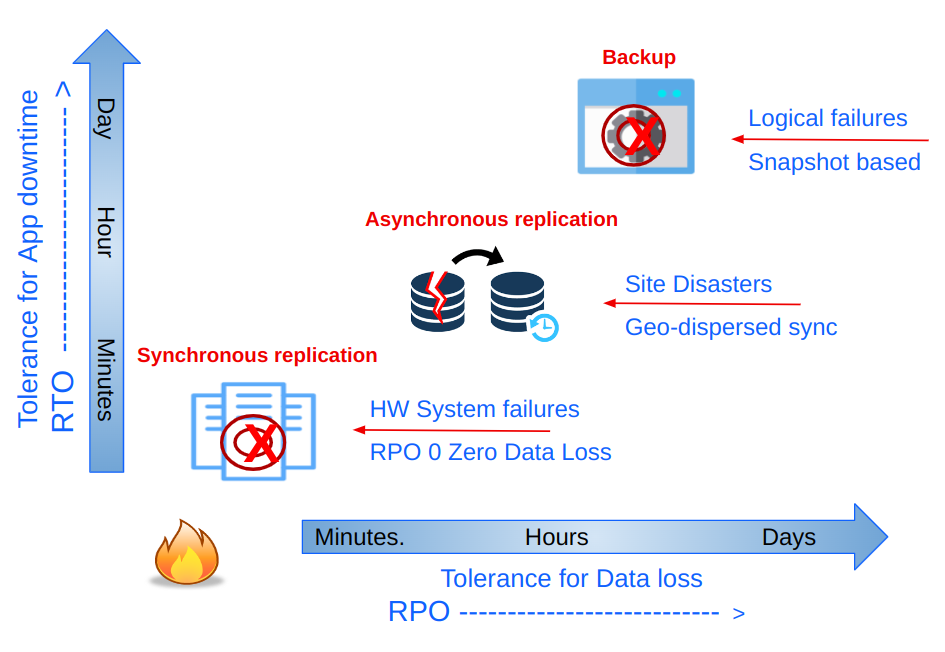

## Ceph Object Storage Multisite Replication Series

Throughout this series of articles, we will provide hands-on examples to help
you set up and configure some of the most critical replication features of
the Ceph Object Storage solution. This will include the new Object Storage
multisite enhancements released in the Reef release.

At a high level, these are the topics we will cover in this series:

* Introduction to Ceph Object Storage Multisite Replication.
* Ceph Object Multisite Architecture & Configuration
* New Performance Improvements in Reef: Replication Sync Fairness
* Load-Balancing RGW services: Deploying the Ceph Ingress Service
* Ceph Object Multisite sync policy
* Ceph Object Storage Archive Zone

When discussing Replication, Disaster Recovery, Backup and Restore, we have
multiple strategies available that provide us with different SLAs for data
and application recovery (RTO / RPO). For instance, synchronous replication
provides the lowest RPO, which means zero data loss. Ceph can provide synchronous
replication between sites by stretching the Ceph cluster among the data centers.
On the other hand, asynchronous replication will assume a non-zero RPO. In Ceph,
async multisite replication involves replicating the data to another Ceph
cluster. Each Ceph storage modality (object, block, and file) has its own
asynchronous replication mechanism. This blog series will cover
geo-dispersed object storage multisite asynchronous replication.



### Introduction to Ceph Object Storage Multisite Replication

Before getting our hands wet with the deployment details, let's begin with a quick
overview of what Ceph Object Storage (RGW) provides: enterprise grade, highly mature
object geo-replication capabilities. The RGW multisite replication feature
facilitates asynchronous object replication across single or multi-zone
deployments. Ceph Object Storage operates efficiently over WAN connections
using asynchronous replication with eventual consistency.

Ceph Object Storage Multisite Replication provides many benefits for businesses
that must store and manage large amounts of data across multiple locations.
Here are some of the key benefits of using Ceph Object Storage Multisite
Replication:

#### Improved Data Availability, Multi-Region

Ceph Object Storage clusters can be geographically dispersed, which improves
data availability and reduces the risk of data loss due to hardware failure,
natural disasters or other events. There are no network latency requirements
as we are doing eventually consistent async replication.

#### Active/Active Replication

Replication is Active/Active for data (object) access. Multiple end users can
simultaneously read/write from/to their closest RGW (S3) endpoint location.
In other words, the replication is bidirectional. This enables users to
access data more quickly and reduce downtime.

Notably only the designated master zone in the zone group accepts etadata
updates. For example, when creating Users and Buckets, all metadata
modifications on non-master zones will be forwarded to the configured
master. if the master fails, a manual master zone failover must be triggered.

#### Increased Scalability

With multisite replication, businesses can quickly scale their storage
infrastructure by adding new sites or clusters. This allows businesses
to store and manage large amounts of data without worrying about
running out of storage capacity or performance.

#### Realm, Zonegroups and Zones 

A Ceph Object Storage multisite cluster consists of realms, zonegroups,
and zones:

* A realm defines a global namespace across multiple Ceph storage clusters

* Zonegroups can have one or more zones

* Next, we have zones. These are the lowest level of the Ceph multisite configuration, and they’re represented by one or more object gateways within a single Ceph cluster. 

As you can see in the following diagram, Ceph Object Storage multisite
replication happens at the zone level. We have a single realm called
and two zonegroups. The realm global object namespace ensures unique
object IDs across zonegroups and zones.

Each bucket is owned by the zone group where it was created, and its object
data will only be replicated to other zones in that zonegroup. Any request
for data in that bucket sent to other zonegroups will be redirected to the
zonegroup where the bucket resides.


Within a Ceph Object Storage cluster you can have one or more realms.
Each realm is an independent global object namespace, meaning each
realm will have its own sets of users, buckets, and objects. For example, you
can't have two buckets with the same name within a single realm. In Ceph Object
Storage, there is also the concept of _tenants_ to isolate S3 namespaces,
but that discussion is out of our scope here.  You can find more information
on [this page](https://www.ibm.com/docs/en/storage-ceph/7?topic=management-multi-tenant-namespace)

The following diagram shows an example where we have two different Realms,
thus two independent namespaces. Each realm has its zonegroup and replication zones.


Each zone represents a Ceph cluster, and you can have one or more zones in a
zonegroup. Multisite replication, when configured, will happen between zones.
In this series of blogs, we will configure only two zones in a zone group,
but you can configure a larger number of replicated zones in a single zonegroup.

#### Ceph Multisite Replication Policy

With the latest 6.1 release, Ceph Object Storage introduces “Multisite Sync Policy” that provides granular bucket-level replication, provides the user with greater flexibility and reduced costs, unlocking and an array of valuable replication features:

Users can enable or disable sync per individual bucket, enabling precise control over replication workflows. 

Full-zone replication while opting out to replicate specific buckets

Replicating a single source bucket with multi-destination buckets

Implementing symmetrical and directional data flow configurations per bucket

The following diagram shows an example of the sync policy feature in action.


### Ceph Multisite Configuration 

#### Architecture overview

As part of the Quincy release, a new Ceph Manager module called `rgw` was added
to the ceph orchestrator `cephadm`. The `rgw` manager module makes the
configuration of multisite replication straightforward. This section will
show you how to configure Ceph Object Storage multisite replication between
two zones (each zone is an independent Ceph Cluster) through the CLI using
the new `rgw` manager module.

**NOTE**: In Reef and later releases, multisite configuration can also be
performed using the Ceph UI/Dashboard. We don’t use the UI in this guide,
but if you are interested, you can find more information [here](https://www.ibm.com/docs/en/storage-ceph/7?topic=gateway-configuring-multi-site).

In our setup, we are going to configure our multisite replication with the
following logical layout: we have a realm called `multisite`, and this realm
contains a single zonegroup called `multizg`. Inside the zonegroup, we have
two zones, named `zone1` and `zone2`.  Each zone represents a Ceph cluster in a
geographically distributed datacenter. The following diagram is a logical
representation of our multisite configuration.


As this is a lab deployment, this is a downsized example. Each Ceph cluster
comprises four nodes with six OSDs each. We configure four RGW services (one per
node) for each cluster. Two RGWs will serve S3 client requests, and the
remaining RGW services will be responsible for multisite replication operations.
Ceph Object Storage multisite replication data is transmitted to the other site
through the RGW services using the HTTP protocol.  The advantage of this is
that at the networking layer, we only need to enable/allow HTTP communication
between the Ceph clusters (zones) for which we want to configure multisite.

The following diagram shows the final architecture we will be configuring
step by step.


In our example, we will terminate the SSL connection from the client at the
per-site load balancer level. The RGW services will use plain HTTP for all
the involved endpoints.

When configuring TLS/SSL, we can terminate the encrypted connection from the
client to the S3 endpoint at the load balancer level or at the RGW service level.
It is possible to do both, re-encrypting the connection from the load balancer
to the RGWs, though this scenario is not currently supported by Ceph ingress
service.

The second post will enumerate the steps to establish multisite replication
between our Ceph clusters, as depicted in the following diagram.


But before starting the configuration of Ceph Object Storage multisite
replication, we need to provide a bit more context regarding our initial
state.  We have two Ceph clusters deployed, the first cluster with nodes
`ceph-node-00` to `ceph-node-03` and the second cluster with nodes
from `ceph-node-04` to `ceph-node-07`. 

```
[root@ceph-node-00 ~]# ceph orch host ls
HOST                      ADDR             LABELS                      STATUS
ceph-node-00.cephlab.com  192.168.122.12   _admin,osd,mon,mgr
ceph-node-01.cephlab.com  192.168.122.179  osd,mon,mgr
ceph-node-02.cephlab.com  192.168.122.94   osd,mon,mgr
ceph-node-03.cephlab.com  192.168.122.180  osd
4 hosts in cluster
[root@ceph-node-04 ~]#  ceph orch host ls
HOST                      ADDR             LABELS                      STATUS
ceph-node-04.cephlab.com  192.168.122.138  _admin,osd,mon,mgr
ceph-node-05.cephlab.com  192.168.122.175  osd,mon,mgr
ceph-node-06.cephlab.com  192.168.122.214  osd,mon,mgr
ceph-node-07.cephlab.com  192.168.122.164  osd
4 hosts in cluster
```

The core Ceph services have been deployed, plus Ceph's observability stack,
but there is no RGW service deployed. Ceph services are running containerized
on RHEL with the help of Podman.

```
[root@ceph-node-00 ~]# ceph orch ls
NAME                       PORTS        RUNNING  REFRESHED  AGE  PLACEMENT                                          
alertmanager               ?:9093,9094      1/1  6m ago     3w   count:1                                            
ceph-exporter                               4/4  6m ago     3w   *                                                  
crash                                       4/4  6m ago     3w   *                                                  
grafana                    ?:3000           1/1  6m ago     3w   count:1                                            
mgr                                         3/3  6m ago     3w   label:mgr                                          
mon                                         3/3  6m ago     3w   label:mon                                          
node-exporter              ?:9100           4/4  6m ago     3w   *                                                  
osd.all-available-devices                     4  6m ago     3w   label:osd                                          
prometheus                 ?:9095           1/1  6m ago     3w   count:1
[root@ceph-node-00 ~]# ceph version
ceph version 18.2.0-131.el9cp (d2f32f94f1c60fec91b161c8a1f200fca2bb8858) reef (stable)
[root@ceph-node-00 ~]# podman inspect cp.icr.io/cp/ibm-ceph/ceph-7-rhel9 | jq .[].Labels.summary
"Provides the latest IBM Storage Ceph 7 in a fully featured and supported base image."
# cat /etc/redhat-release 
Red Hat Enterprise Linux release 9.2 (Plow)
```

### Summary & Up Next

As a recap, in part one of this multisite series, we have gone through an
overview of Ceph Object Storage multisite replication features and architecture,
setting the stage to start configuring the multisite replication in part two
of the series.

### Footnote

The authors would like to thank IBM for supporting the community by facilitating our time to create these posts.

