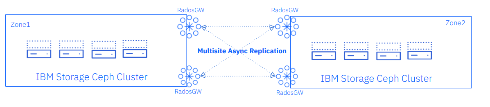
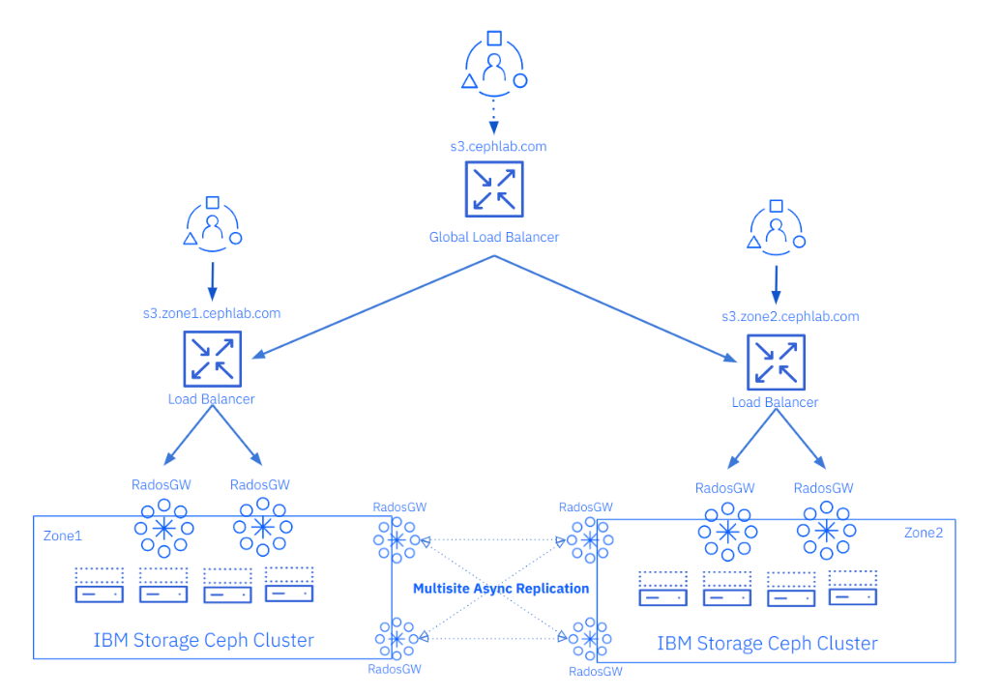

## Ceph Object Storage Multisite Replication Series

In the previous episode, we introduced Ceph Object Storage multisite features.
We described the lab setup we will use in the following chapters to deploy
and configure Ceph object multisite asynchronous replication. 

Part two of this series will enumerate the steps to establish the initial
multisite replication between our Ceph clusters, as depicted in the following diagram.



#### Ceph Object Storage Multisite Initial Configuration

As part of the Quincy release, a new Manager module named `rgw` was added to the
Ceph orchestrator `cephadm`. The `rgw` manager module makes the configuration
of multisite replication straightforward. This section will show you how to
configure Ceph Object Storage multisite replication between two zones 
(each zone is an independent Ceph cluster) through the CLI using the new
`rgw` manager module.

We will start by creating an RGW module spec file for `cluster1`.

We will use labels on our hosts to help define which nodes may host each service.
In this case, for the replication RGW services, we set the `rgwsync` label. Any
host that has this label configured will start an RGW service with the specs
defined in the file. The rest of the options included will take care of
configuring the names for our realm, zonegroup and zone, and direct that
the RGW services listen on port 8000/tcp. 

```
[root@ceph-node-00 ~]# cat << EOF >> /root/rgw.spec
placement:
  label: rgwsync
  count_per_host: 1
rgw_realm: multisite
rgw_zone: zone1
rgw_zonegroup: multizg
spec:
  rgw_frontend_port: 8000
EOF
```

In our first cluster, we want to run the sync RGW services on nodes `ceph-node-00`
and `ceph-node-01`, so we need to label the corresponding nodes:

```
[root@ceph-node-00 ~]# ceph orch host label add ceph-node-00.cephlab.com rgwsync
Added label rgwsync to host ceph-node-00.cephlab.com
[root@ceph-node-00 ~]# ceph orch host label add ceph-node-01.cephlab.com rgwsync
Added label rgwsync to host ceph-node-01.cephlab.com
```

Once the nodes have been labeled, we enable the RGW manager module and
bootstrap the RGW multisite configuration. When bootstrapping the multisite
config, the `rgw` manager module will take care of the following steps:

* Create the realm, zonegroup, and zone and apply the period
* Specific RGW RADOS pools with the name of the zone are created
* Create an RGW multisite replication sync user
* Configure the realm, zonegroup, and zone for each RGW service
* Create the RGW services using the cephadm orchestrator

```
[root@ceph-node-00 ~]# ceph mgr module enable rgw
[root@ceph-node-00 ~]# ceph rgw realm bootstrap -i rgw.spec
Realm(s) created correctly. Please use 'ceph rgw realm tokens' to get the token.
```

Let’s check the realm:

```
[root@ceph-node-00 ~]# radosgw-admin realm list
{
    "default_info": "d85b6eef-2285-4072-8407-35e2ea7a17a2",
    "realms": [
        "multisite"
    ]
}
```

Multisite sync user:

```
[root@ceph01 ~]# radosgw-admin user list | grep sysuser
    "Sysuser-multisite"
```

Multisite sync user:

```
[root@ceph01 ~]# radosgw-admin user list | grep sysuser
    "Sysuser-multisite"
```

Zone1 RGW RADOS pools: 

```
[root@ceph01 ~]# ceph osd lspools | grep rgw
24 .rgw.root
25 zone1.rgw.log
26 zone1.rgw.control
27 zone1.rgw.meta
```

Once we create the first bucket, the bucket index pool will be created
automatically. Also, once we upload the first objects/data to a bucket
in `zone1`, the data pool will be created for us. By default pools with a
replication factor of 3 are created using the cluster's pre-defined CRUSH
rule `replicated_rule`. If we want to use Erasure Coding (EC) the data pool or
customize, for example, the failure domain, we need to manually pre-create
the pools with our customizations before we start uploading data into the
first bucket.

**NOTE**: Don’t forget to double-check that your RGW pools have the right number
of Placement Groups (PGs) to provide the required performance. We can choose to
enable the PG autoscaler manager module with the `bulk` flag set for each pool,
or we can statically calculate the number of PGs our pools are going to need
up front with the help of
the [PG calculator](https://docs.ceph.com/en/squid/rados/operations/pgcalc/).
We suggest a target of 200 PG replicas per OSD, the "PG ratio".

**NOTE**: Only RGW data pools can be configured with erasure coding.
The rest of the RGW pool constellation must be configured with to use
replication scheme, by default with `size=3`.

The RGW services are up and running service the S3 endpoint on port 8000:

```
[root@ceph-node-00 ~]# curl http://ceph-node-00:8000
<?xml version="1.0" encoding="UTF-8"?><ListAllMyBucketsResult xmlns="http://s3.amazonaws.com/doc/2006-03-01/"><Owner><ID>anonymous</ID><DisplayName></DisplayName></Owner><Buckets></Buckets></ListAllMyBucketsResult>
```

The RGW manager module creates a token with encoded information of our deployment.
Other Ceph clusters that want to be added as a replicated zone to our multisite
configuration can import this token into the RGW manager module and have
replication configured and running with a single command.

We can check the contents of the token with the `ceph rgw realm tokens` command
and decode it with the `base64` command.  As you can see, it provides the required
information for the secondary zone to connect to the primary zonegroup and pull
the realm and zonegroup configuration.

```
[root@ceph-node-00 ~]# TOKEN=$(ceph rgw realm tokens | jq .[0].token | sed 's/"//g')
[root@ceph-node-00 ~]# echo $TOKEN | base64 -d
{
    "realm_name": "multisite",
    "realm_id": "d85b6eef-2285-4072-8407-35e2ea7a17a2",
    "endpoint": "http://ceph-node-00.cephlab.com:8000",
    "access_key": "RUB7U4C6CCOMG3EM9QGF",
    "secret": "vg8XFPehb21Y8oUMB9RS0XXXXH2E1qIDIhZzpC"
}
```

You can see from the prompt that we have switched to our second Ceph cluster,
having copied the token from our first cluster and defined the rest of the
parameters similarly to the first cluster.

```
[root@ceph-node-04 ~]# cat rgw2.spec
placement:
  label: rgwsync
  count_per_host: 1
rgw_zone: zone2
rgw_realm_token: ewogICAgInJlYWxtX25hbWUiOiAibXVsdGlzaXRlIiwKICAgICJyZWFsbV9pZCI6ICIxNmM3OGJkMS0xOTIwLTRlMjMtOGM3Yi1lYmYxNWQ5ODI0NTgiLAogICAgImVuZHBvaW50IjogImh0dHA6Ly9jZXBoLW5vZGUtMDEuY2VwaGxhYi5jb206ODAwMCIsCiAgICAiYWNjZXNzX2tleSI6ICIwOFlXQ0NTNzEzUU9LN0pQQzFRUSIsCiAgICAic2VjcmV0IjogImZUZGlmTXpDUldaSXgwajI0ZEw4VGppRUFtOHpRdE01ZGNScXEyTjYiCn0=
spec:
  rgw_frontend_port: 8000
```

We label the hosts that will run the Ceph RGW sync services:

```
[root@ceph-node-04 ~]# ceph orch host label add ceph-node-04.cephlab.com rgwsync
Added label rgwsync to host ceph-node-04.cephlab.com
[root@ceph-node-04 ~]# ceph orch host label add ceph-node-05.cephlab.com rgwsync
Added label rgwsync to host ceph-node-05.cephlab.com
```

Enable the module, and run the `ceph rgw zone create ` command with the spec file we created a moment ago:

```
[root@ceph02 ~]# ceph mgr module enable rgw
[root@ceph02 ~]# ceph rgw zone create -i rgw2.spec --start-radosgw
Zones zone2 created successfully
```

The `rgw` manager module will take care of pulling the realm and zonegroup periods
using the access and secret keys from the multisite sync user. Finally, it will
create `zone2` and do a final period update so all zones have the latest
configuration changes in place with `zone2` added to zonegroup `multizg`.
In the following output from the `radosgw-admin zonegroup get` command we can
see the zone groupendpoints. We can also see that `zone1` is the master zone
for our zonegroup and the corresponding endpoints for `zone1` and `zone2`.

```
[root@ceph-node-00 ~]# radosgw-admin zonegroup get
{
    "id": "2761ad42-fd71-4170-87c6-74c20dd1e334",
    "name": "multizg",
    "api_name": "multizg",
    "is_master": true,
    "endpoints": [
        "http://ceph-node-04.cephlab.com:8000",
        "http://ceph-node-05.cephlab.com:8000"
    ],
    "hostnames": [],
    "hostnames_s3website": [],
    "master_zone": "66df8c0a-c67d-4bd7-9975-bc02a549f13e",
    "zones": [
        {
            "id": "66df8c0a-c67d-4bd7-9975-bc02a549f13e",
            "name": "zone1",
            "endpoints": [
                "http://ceph-node-00.cephlab.com:8000",
                "http://ceph-node-01.cephlab.com:8000"
            ],
            "log_meta": false,
            "log_data": true,
            "bucket_index_max_shards": 11,
            "read_only": false,
            "tier_type": "",
            "sync_from_all": true,
            "sync_from": [],
            "redirect_zone": "",
            "supported_features": [
                "compress-encrypted",
                "resharding"
            ]
        },
        {
            "id": "7b9273a9-eb59-413d-a465-3029664c73d7",
            "name": "zone2",
            "endpoints": [
                "http://ceph-node-04.cephlab.com:8000",
                "http://ceph-node-05.cephlab.com:8000"
            ],
            "log_meta": false,
            "log_data": true,
            "bucket_index_max_shards": 11,
            "read_only": false,
            "tier_type": "",
            "sync_from_all": true,
            "sync_from": [],
            "redirect_zone": "",
            "supported_features": [
                "compress-encrypted",
                "resharding"
            ]
        }
    ],
    "placement_targets": [
        {
            "name": "default-placement",
            "tags": [],
            "storage_classes": [
                "STANDARD"
            ]
        }
    ],
    "default_placement": "default-placement",
    "realm_id": "beeea955-8341-41cc-a046-46de2d5ddeb9",
    "sync_policy": {
        "groups": []
    },
    "enabled_features": [
        "resharding"
    ]
}
```

To verify that replication is working, let’s create a user and a bucket:

```
[root@ceph-node-00 ~]# radosgw-admin user create --uid='user1' --display-name='First User' --access-key='S3user1' --secret-key='S3user1key'

[root@ceph-node-00 ~]# aws configure
AWS Access Key ID [None]: S3user1
AWS Secret Access Key [None]: S3user1key
Default region name [None]: multizg
Default output format [None]: json
[root@ceph-node-00 ~]# aws --endpoint http://s3.cephlab.com:80 s3 ls
[root@ceph-node-00 ~]# aws --endpoint http://s3.cephlab.com:80 s3 mb s3://firstbucket
make_bucket: firstbucket
[root@ceph-node-00 ~]# aws --endpoint http://s3.cephlab.com:80 s3 cp /etc/hosts s3://firstbucket
upload: ../etc/hosts to s3://firstbucket/hosts
```

If we check from our second Ceph cluster, `zone2`, we can see that all metadata
has been replicated, and that all users and buckets that we created
in `zone1` are now present in `zone2`.

**NOTE**: In this example, we will use the `radosgw-admin` command to check, but
we could also use S3 API commands pointing the AWS client to the IP/hostname
of an RGW within the second zone.

```
[root@ceph-node-04 ~]# radosgw-admin user list
[
    "dashboard",
    "user1",
    "sysuser-multisite"
]
[root@ceph-node-04 ~]# radosgw-admin bucket stats --bucket testbucket | jq .bucket
"testbucket"
```

To check replication status, we can use the `radosgw-admin sync status` command.
For example:

```
[root@ceph-node-00 ~]# radosgw-admin sync status
          realm beeea955-8341-41cc-a046-46de2d5ddeb9 (multisite)
      zonegroup 2761ad42-fd71-4170-87c6-74c20dd1e334 (multizg)
           zone 66df8c0a-c67d-4bd7-9975-bc02a549f13e (zone1)
   current time 2024-01-05T22:51:17Z
zonegroup features enabled: resharding
                   disabled: compress-encrypted
  metadata sync no sync (zone is master)
      data sync source: 7b9273a9-eb59-413d-a465-3029664c73d7 (zone2)
                        syncing
                        full sync: 0/128 shards
                        incremental sync: 128/128 shards
                        data is caught up with source

```

### Summary & Up Next

As a recap, in part two of this multisite series, we have gone through the steps
of deploying Ceph Object Storage multisite replication between two sites/zones
using the `rgw` manager module. Tthis is just our first building block as our
target is to have a full-blown deployment including the much-needed load-balancers.



In part three of the series we will continue fine tuning our multisite
replication setup by dedicating specifc RGW services for each type of
request: client facing or multisite replication.


### Footnote

The authors would like to thank IBM for supporting the community by facilitating our time to create these posts.

