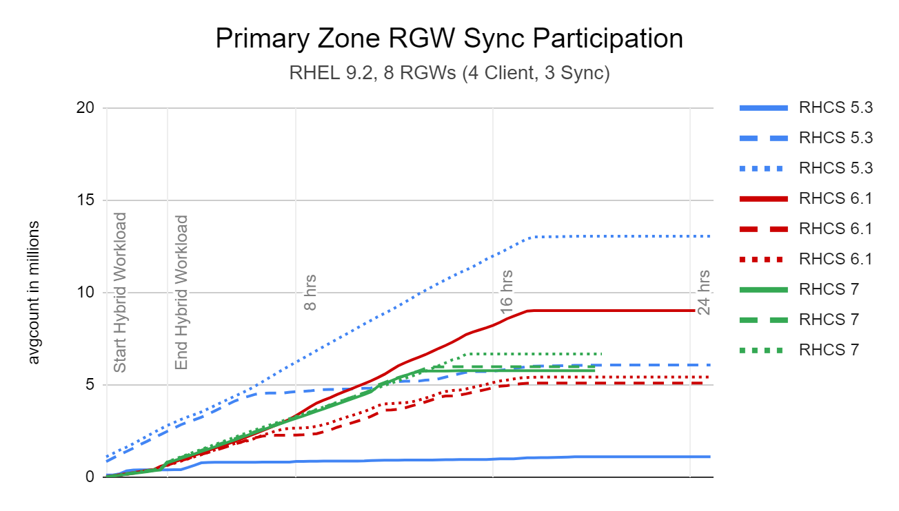
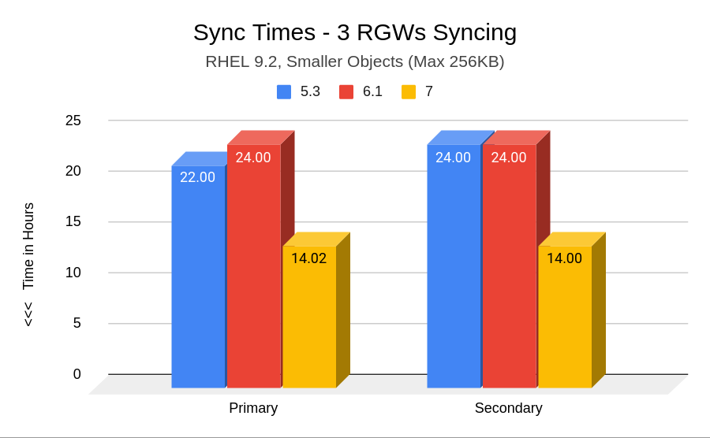

## Ceph Object Storage Multisite Replication Series

In the previous episode of the series, we went through an example of
configuring Ceph Object Storage multisite replication with the help
of the `rgw` manager module.

#### Multisite Replication Dedicated RGWs

We have set up two RGWs for each Ceph cluster. By default, the RGW services
manage both client S3 requests and replication requests among the sites. The RGW
services share their resources and processing time between both tasks. To improve
this configuration, we can assign a specific subset of RGWs to manage client S3
requests and another subset of RGWs to manage multisite replication requests
between the two Ceph clusters.

Using this approach is not mandatory but will provide the following benefits: 

* Because we have a dedicated set of resources for public and multisite replication, we can scale the subsets of client-facing and replication RGWs independently depending on where we need higher performance, like increased throughput or lower latency.

* Segregated RGWs can avoid sync replication stalling because the RGWs are busy with client-facing tasks or vice-versa.

* Improved troubleshooting: dedicated subsets of RGWs can improve the troubleshooting experience as we can target the RGWs to investigate depending the specific issue. Also, when reading through the debug logs of the RGW services, replication messages don’t get in the middle of client messages and vice versa.

* Because we are using different sets of RGWs, we could use different networks with different security levels, firewall rules, OS security, etc. For example:

    * The public-facing RGWs could be using Network A. 

    * The replication RGWs could be using Network B.

When configuring a multisite deployment, it is common practice to dedicate specific
RGW services to client operations and other RGW services to multisite replication.

By default, all RGWs participate in multisite replication. Two steps are needed to
exclude an RGW from participating in the multisite replication sync.

* Set this Ceph option for RGWs: `ceph config set ${KEY_ID} rgw_run_sync_thread false`. When false, prevents this object store's gateways from transmitting multisite replication data

* The previous parameter only tells the RGW not to _send_ replication data, but it can keep receiving. To also avoid receiving, we need to remove the RGWs from the zonegroup and zone replication endpoints.

#### Configure dedicated RGW services for Public and Replication requests.

In the previous chapter, we configured two RGWs per Ceph cluster, which are
currently serving both client S3 requests and replication request traffic. In
the following steps, we will configure two additional RGWs per cluster for
a total of four RGWs within each cluster. Out of these four RGWs, two will
be dedicated to serving client requests and the other two will be dedicated
to serving multisite replication. The diagram below illustrates what we are aiming to achieve.


We will use labels to control the scheduling and placement of RGW services. In
this case, the label we will use for the public-facing RGWs is `rgw`.

```
[root@ceph-node-00 ~]#  ceph orch host label add ceph-node-02.cephlab.com rgw
Added label rgw to host ceph-node-02.cephlab.com
[root@ceph-node-00 ~]#  ceph orch host label add ceph-node-03.cephlab.com rgw
Added label rgw to host ceph-node-03.cephlab.com
```

We create an RGW spec file for the public-facing RGWs. In this example, we use
the same CIDR network for all RGW services. We could however configure different
network CIDRs for the different sets of RGWs we deploy if needed. We use the same
realm, zonegroup and zone as the services we already have running, as we want
all RGWs to belong to the same realm namespace.

```
[root@ceph-node-00 ~]# cat << EOF >> /root/rgw-client.spec
service_type: rgw
service_id: client-traffic
placement:
  label: rgw
  count_per_host: 1
networks:
- 192.168.122.0/24
spec:
  rgw_frontend_port: 8000
  rgw_realm: multisite
  rgw_zone: zone1
  rgw_zonegroup: multizg
EOF
```

We apply the spec file and check that we now have four new services running: two
for multisite replication and the other for client traffic.

```
[root@ceph-node-00 ~]# ceph orch apply -i spec-rgw.yaml
Scheduled rgw.rgw-client-traffic update…
[root@ceph-node-00 ~]# ceph orch ps | grep rgw
rgw.multisite.zone1.ceph-node-00.mwvvel     ceph-node-00.cephlab.com  *:8000                running (2h)      6m ago   2h     190M        -  18.2.0-131.el9cp  463bf5538482  dda6f58469e9
rgw.multisite.zone1.ceph-node-01.fwqfcc     ceph-node-01.cephlab.com  *:8000                running (2h)      6m ago   2h     184M        -  18.2.0-131.el9cp  463bf5538482  10a45a616c44
rgw.client-traffic.ceph-node-02.ozdapg  ceph-node-02.cephlab.com  192.168.122.94:8000   running (84s)    79s ago  84s    81.1M        -  18.2.0-131.el9cp  463bf5538482  0bc65ad993b1
rgw.client-traffic.ceph-node-03.udxlvd  ceph-node-03.cephlab.com  192.168.122.180:8000  running (82s)    79s ago  82s    18.5M        -  18.2.0-131.el9cp  463bf5538482  8fc7d6b06b54
```

As we mentioned at the start of this section, to disable replication
traffic on an RGW, we need to ensure two things:

* Sync threads are disabled
* The RGWs are not listed as replication endpoints in the zonegroup / zone configuration

So the first thing to do is disable the `rgw_run_sync_thread` using
the `ceph config` command.  We specify the service name `client.rgw.client-traffic`
to apply the change on both of our client-facing RGWs simultaneously. We first
check the current configuration of the `rgw_run_sync_thread` and confirm that
it is set by default to true.

```
[root@ceph-node-00 ~]# ceph config get client.rgw.client-traffic rgw_run_sync_thread
true
```

We will now change the parameters to false so that the sync threads will be disabled for this set of RGWs.

```
[root@ceph-node-00 ~]# ceph config set client.rgw.client-traffic  rgw_run_sync_thread false
[root@ceph-node-00 ~]# ceph config get client.rgw.client-traffic rgw_run_sync_thread false
```

The second step is ensuring the new RGWs we deployed are not listed as replication
endpoints in the zonegroup configuration. We shouldn’t see `ceph-node-02`
or `ceph-node-03` listed as endpoints under `zone1`:

```
[root@ceph-node-00 ~]# radosgw-admin zonegroup get | jq '.zones[]|.name,.endpoints'
"zone1"
[
  "http://ceph-node-00.cephlab.com:8000",
  "http://ceph-node-01.cephlab.com:8000"
]
"zone2"
[
  "http://ceph-node-04.cephlab.com:8000",
  "http://ceph-node-05.cephlab.com:8000"
]
```

Note that the JSON parsing utility `jq` must be installed for this task.

After confirming, we have finished this part of the configuration and have
running in the cluster dedicated services for each type of request:
client cequests and replication requests.

You would need to repeat the same steps to apply the same configuration
to our second cluster `zone2`.

### New Performance Improvements in 7.0! Replication Sync Fairness

The Reef release introduced an improvement in Object Storage Multisite
Replication known as "Replication Sync Fairness". This improvement
addresses the issue faced by earlier releases where replication work was not
distributed optimally. In prior releases, one RGW would take the lock for
replication operations and the other RGW services would find it difficult
to obtain the lock. This resulted in multisite replication not scaling linearly
when adding additional RGW services. To improve the distribution of replication
work, significant improvements were made in the Quincy release. However, with
Sync Fairness replication in Reef, replication data and metadata are evenly
distributed among all RGW services, enabling them to collaborate more
efficiently in replication tasks.

Thanks to the IBM Storage DFG team that ran scale testing to highlight
and verify the improvements introduced by the sync fairness feature.
During the testing, the DGF team compared Ceph Reef with Quincy and
Pacific when ingesting objects with multisite replication configured.

The results below provided by DFG compare the degree of participation
by each syncing RGW in each test case. The graphs plot the
avgcount (number of objects and bytes fetched by data sync) polled every
fifteen minutes. An optimal result is one where all syncing RGWs evenly share
the load.

In this example, note how one of the Pacific RGWs (the blue lines labeled RHCS
5.3) processed objects in the 13M range (18M for secondary sync) while the other
two RGWs were handling 5 million and 1.5 million, resulting in longer sync
times: more than 24 hours. The Reef RGWs, (the green lines labeled RHCS 7)
RGWs, however, all stay within close range of each other.  Each processes
5M to 7M objects, and syncing is achieved more quickly, well under 19 hours.

The closer the lines of the same color are in the graph, the better the sync
participation is.  As you can see, for Reef, the green lines are very close
to each other, meaning that the replication workload is evenly distributed
among the three sync RGWs configured for the test.



In the following graph, we show how much time it took for each release to sync
the full workload (small objects) to the other zone: the less time, the better.
e can see that Reef, here labeled `7`, provides substantially improved sync times.



### Summary & Up Next

To summarize, in part three of this series, we discussed configuring dedicated
RGW services for public and replication requests. Additionally, we have
explored the performance enhancements the sync fairness feature offers.
We will delve into load balancing our client-facing RGW endpoints in part four. 

### Footnote

The authors would like to thank IBM for supporting the community by facilitating our time to create these posts.

