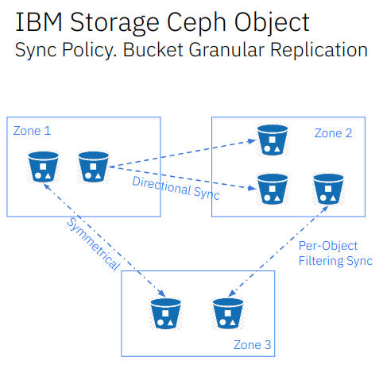
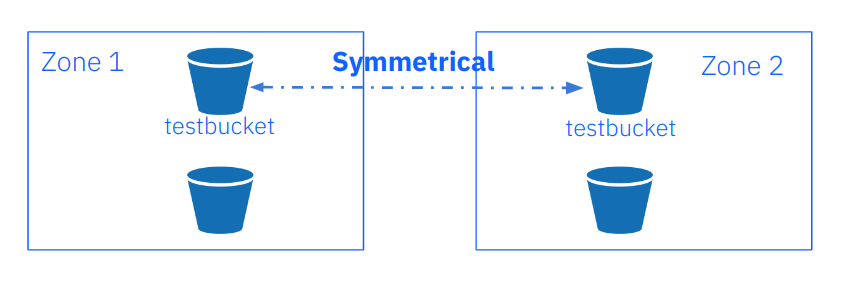

## IBM Storage Ceph Object Storage Multisite Replication Series Part Five

In the previous post of this series, we discussed everything related to
load-balancing our RGW S3 endpoints.  We covered multiple load-balancing
techniques, including the bundled Ceph0provided load balancer,
the `Ingress service`. In this fifth article in this series,
we will discuss multisite sync policy in detail.

### Multisite Sync Policy Introduction 

In Ceph releases beginning with Quincy, Ceph Object Storage provides
granular bucket-level replication, unlocking many valuable features.
Users can enable or disable sync per individual bucket, enabling
precise control over replication workflows. This empowers
full-zone replication while opting out of the replication of specific buckets,
replicating a single source bucket to multi-destination buckets, and
implementing symmetrical and directional data flow configurations.
The following diagram shows an example of the sync policy feature in action:



With our previous synchronization model, we would do full zone sync, meaning
that all data and metadata would be synced between zones. The new sync
policy feature gives us new flexibility and granularity that
allows us to configure per-bucket replication. 

Bucket sync policies apply to the archive zones. Movement from an archive zone
is not bidirectional, wherein all the objects can be moved from the active
zone to the archive zone. However, you cannot move objects from the archive
zone to the active zone since the archive zone is read-only. We will cover
the archive zone in detail in part six of the blog series.

Here is a list of features available in the Quincy and Reef releases:

#### Qunicy

* One to One bucket replication
* Zonegroup level policy configurations
* Bucket-level policy configurations
* Configurable data flow - symmetrical
* Only greenfield/new multisite deployments supported

#### Reef

* Object name filtering
* Moving from egacy multisite sync (full zone replication) to sync policy
(at zonegroup or bucket Level)
* archive zone sync policy (enable/disable per bucket replication to
archive zone)
* Data flow - symmetrical or directional
* Partial user S3 replication API (GetBucketReplication, PutBucketReplication, DeleteBucketReplication)
* Sync to and from a different bucket (one-to-one or one-to-many)
* Destination parameter modifications: storage class, destination owner translation, user mode 

Here are some of the sync policy concepts that we need to understand before we
get our hands dirty. A sync policy comprises the following components:

* Groups: we have one or more groups that can contain lists of data-flow configurations 
* Data-flow: defines the flow of replicated data between the zones. It can define
symmetrical data flow, in which multiple zones sync data. It can also define
directional data flow, in which the data moves in one way from one zone to another.
* Pipes: A pipe defines the zones and buckets that can use these data flows and
their associated properties.

A sync policy group can be in three states:

* `Enabled`: - sync is allowed and enabled. Replication will begub when enabled.
For example, we can enable full zonegroup sync and then disable (forbid)
on a per-bucket basis.
* `Allowed`:  sync is permitted. Replication is permitted but will not start.
For example, we can configure the zonegroup policy to `allowed` and then
enable per-bucket policy sync.
* `Forbidden`: Sync, as defined by this group, is not permitted.

We can configure sync policies (groups, flows, and pipes) at the zonegroup and
bucket levels. The bucket sync policy is always a subset of the defined
policy of the zonegroup to which they belong. So if, for example, we don’t allow a
flow at the zonegroup level it won’t work even if allowed at the bucket level.
There are further details on the expected behaviour in the official documentation.

### Multisite Sync Policy Configuration

The following section will explain use of the new multisite sync policy feature.
By default, once we set up multisite replication as we did in the initial post
of this series, all metadata and data are replicated among the zones that are
part of the zonegroup. We will call this sync method `legacy` during the
remainder of the article. 

As we explained in the previous section, a sync policy is made up of a group,
flow, and pipe. We first configure a zonegroup policy that is very lax and
will allow bi-directional traffic for all buckets on all zones.
Once in place we will add per-bucket sync policies that by design are a
subset of the zonegroup policy, with more stringent rulesets.

We begin by adding the zonegroup policy. We create a new group called `group1`
and set the status to `allowed`. Recall from the previous section that
the zonegroup will allow sync traffic to flow. The policy will be set to
`allowed` and not `enabled`. Data synchronization will not happen at
the zonegroup level when in the `allowed` state, the idea being to enable
the synchronization on a per bucket basis.

```
[root@ceph-node-00 ~]# radosgw-admin sync group create --group-id=group1 --status=allowed --rgw-realm=multisite --rgw-zonegroup=multizg
```

We now create a symmetrical/bi-directional flow, allowing data sync in both
directions from our zones: `zone1` and `zone2`.

```
[root@ceph-node-00 ~]#  radosgw-admin sync group flow create --group-id=group1 --flow-id=flow-mirror --flow-type=symmetrical --zones=zone1,zone2
```

Finally we create a pipe. In the pipe, we specify the group-id to use then set
an asterisk wildcard for the source and destination buckets and zones, meaning
all zones and buckets can be replicated as the source and destination of the data.

```
[root@ceph-node-00 ~]# radosgw-admin sync group pipe create --group-id=group1  --pipe-id=pipe1 --source-zones='*'  --source-bucket='*' --dest-zones='*' --dest-bucket='*'
```

Zonegroup sync policy modifications need to update the period;
bucket sync policy modifications don’t require a period update.

```
[root@ceph-node-00 ~]# radosgw-admin period update --commit
```

Once we have committed the new period, all data sync in the zonegroup is
going to stop because our zonegroup policy is set to `Allowed` If we had set it
to `enabled`, syncing would continue in the same way as with the initial
multisite configuration we had.

#### Single Bucket Bidirectional Sync Between Zones

Now we can enablesync on a per-bucket basis. We will create a bucket-level policy
rule for the existing bucket `testbucket`. Note that the bucket must exist
before setting this policy, and admin commands that modify bucket policies
must be run on the master zone. However, bucket sync policies do not require
a period update. There is no need to change the data flow, as it is inherited
from the zonegroup policy. A bucket policy flow will only be a subset of the
flow defined in the zone group policy; the same happens with pipes.



We create the bucket:

```
[root@ceph-node-00 ~]# aws --endpoint https://s3.zone1.cephlab.com:443 s3 mb s3://testbucket
make_bucket: testbucket
```

Create a bucket sync group, using the `--bucket` parameter to specify the bucket
and setting the status to `enabled` so that replication will be enabled for our
bucket `testbucket` 

```
[root@ceph-node-00 ~]# radosgw-admin sync group create --bucket=testbucket --group-id=testbucket-1 --status=enabled
```

There is no need to specify a flow as we will inherit the flow from the zonegroup,
so we need only to define a pipe for our bucket sync policy group
called `testbucket-1`. As soon as this command is applied data sync replication
will start for this bucket.

```
[root@ceph-node-00 ~]# radosgw-admin sync group pipe create --bucket=testbucket --group-id=testbucket-1 --pipe-id=test-pipe1 --source-zones='*' --dest-zones='*'
```

**NOTE**: You can safely ignore the following warning:

```WARNING: cannot find source zone id for name=*```

With the `sync group get` command you can review your group, flow, and pipe configurations.
We run the command at the zonegroup level, where we see that the status is `allowed`.

```[root@ceph-node-00 ~]# radosgw-admin sync group get | jq .[0].val.status
"allowed"
```

And we run the `sync group get` command at the bucket level supplying
the `--bucket` parameter. In this case, the status is `Enabled` for `testbucket`:

```
[root@ceph-node-00 ~]# radosgw-admin sync group get --bucket testbucket | jq .[0].val.status
"Enabled"
```

Another helpful command is `sync info`. With `sync info`, we can preview what
sync replication will be implemented with our current configuration. So, for
example, with our current zonegroup sync policy in the `allowed` state,
no sync will happen at the zonegroup level, so the sync info command
will not show any sources or destinations configured.

```
[root@ceph-node-00 ~]# radosgw-admin sync info
{
    "sources": [],
    "dests": [],
    "hints": {
        "sources": [],
        "dests": []
    },
    "resolved-hints-1": {
        "sources": [],
        "dests": []
    },
    "resolved-hints": {
        "sources": [],
        "dests": []
    }
}
```

We can also use the `sync info` command  at the bucket level, using
the `--bucket` parameter because we have configured a bidirectional
pipe. We are going to have as sources `zone2` -> `zone1` and as
destinations `zone1` -> `zone2`.  This means that replication on the `testbucket`
bucket happens in both directions. If we PUT an object to `testbucket` from
`zone1` it will be replicated to `zone2`, and if we PUT and object to `zone2`
it will be replicated to `zone1`. 

```
[root@ceph-node-00 ~]# radosgw-admin sync info --bucket testbucket
{
    "sources": [
        {
            "id": "test-pipe1",
            "source": {
                "zone": "zone2",
                "bucket": "testbucket:89c43fae-cd94-4f93-b21c-76cd1a64788d.34553.1"
            },
            "dest": {
                "zone": "zone1",
                "bucket": "testbucket:89c43fae-cd94-4f93-b21c-76cd1a64788d.34553.1"
            },
            "params": {
                "source": {
                    "filter": {
                        "tags": []
                    }
                },
                "dest": {},
                "priority": 0,
                "mode": "system",
                "user": "user1"
            }
        }
    ],
    "dests": [
        {
            "id": "test-pipe1",
            "source": {
                "zone": "zone1",
                "bucket": "testbucket:89c43fae-cd94-4f93-b21c-76cd1a64788d.34553.1"
            },
            "dest": {
                "zone": "zone2",
                "bucket": "testbucket:89c43fae-cd94-4f93-b21c-76cd1a64788d.34553.1"
            },
            "params": {
                "source": {
                    "filter": {
                        "tags": []
                    }
                },
                "dest": {},
                "priority": 0,
                "mode": "system",
                "user": "user1"
            }
        }
    ],
```

So if, for example, we only look at the sources, you can see they will vary
depending on the cluster in which run the `radosgw-admin` command. For example
from `cluster2` (`ceph-node04`), we see `zone1` as the source:

```
[root@ceph-node-00 ~]# ssh ceph-node-04 radosgw-admin sync info --bucket testbucket | jq '.sources[].source, .sources[].dest'
{
  "zone": "zone1",
  "bucket": "testbucket:66df8c0a-c67d-4bd7-9975-bc02a549f13e.45330.2"
}
{
  "zone": "zone2",
  "bucket": "testbucket:66df8c0a-c67d-4bd7-9975-bc02a549f13e.45330.2"
}
```

In `cluster1` (`ceph-node-00`), we see `zone2` as the source:

```
[root@ceph-node-00 ~]# radosgw-admin sync info --bucket testbucket | jq '.sources[].source, .sources[].dest'
{
  "zone": "zone2",
  "bucket": "testbucket:66df8c0a-c67d-4bd7-9975-bc02a549f13e.45330.2"
}
{
  "zone": "zone1",
  "bucket": "testbucket:66df8c0a-c67d-4bd7-9975-bc02a549f13e.45330.2"
}
```

Let’s perform a quick test with the AWS CLI, to validate the configuration and confirm
that replication is working for `testbucket`. We PUT an object in `zone1`
and check that it is replicated to `zone2`:

```
[root@ceph-node-00 ~]# aws --endpoint https://s3.zone1.cephlab.com:443 s3 cp /etc/hosts s3://testbucket/firsfile
upload: ../etc/hosts to s3://testbucket/firsfile
```

We can check the sync has finished with the `radosgw-admin bucket sync checkpoint` command:

```
[root@ceph-node-00 ~]# ssh ceph-node-04 radosgw-admin bucket sync checkpoint --bucket testbucket
2024-02-02T02:17:26.858-0500 7f3f38729800  1 bucket sync caught up with source:
      local status: [, , , 00000000004.531.6, , , , , , , ]
    remote markers: [, , , 00000000004.531.6, , , , , , , ]
2024-02-02T02:17:26.858-0500 7f3f38729800  0 bucket checkpoint complete
```

An alternate way to check sync status is to use the `radosgw-admin bucket sync status` command:

```
[root@ceph-node-00 ~]# radosgw-admin bucket sync status --bucket=testbucket
          realm beeea955-8341-41cc-a046-46de2d5ddeb9 (multisite)
      zonegroup 2761ad42-fd71-4170-87c6-74c20dd1e334 (multizg)
           zone 66df8c0a-c67d-4bd7-9975-bc02a549f13e (zone1)
         bucket :testbucket[66df8c0a-c67d-4bd7-9975-bc02a549f13e.37124.2])
   current time 2024-02-02T09:07:42Z

    source zone 7b9273a9-eb59-413d-a465-3029664c73d7 (zone2)
  source bucket :testbucket[66df8c0a-c67d-4bd7-9975-bc02a549f13e.37124.2])
                incremental sync on 11 shards
                bucket is caught up with source
```

We see that the object is available in `zone2`.

```
[root@ceph-node-00 ~]# aws  --endpoint https://object.s3.zone2.dan.ceph.blue:443 s3 ls s3://testbucket/
2024-01-09 06:27:24        233 firsfile
```

Because the replication is bidirectional, we PUT an object in `zone2`, and it
is replicated to `zone1`:

```
[root@ceph-node-00 ~]# aws --endpoint https://object.s3.zone2.dan.ceph.blue:443 s3 cp   /etc/hosts s3://testbucket/secondfile
upload: ../etc/hosts to s3://testbucket/secondfile
[root@ceph-node-00 ~]# aws  --endpoint https://object.s3.zone1.dan.ceph.blue:443 s3 ls s3://testbucket/
2024-01-09 06:27:24        233 firsfile
2024-02-02 00:40:15        233 secondfile
```

### Summary & Up Next

In part five of this series, we discussed Multisite Sync Policy and shared some
hands-on examples of configuring granular bucket bidirectional replication.
in part six, we will continue configuring multisite sync policies including
unidirectional replication with one source to many destination buckets. 

### Footnote

The authors would like to thank IBM for supporting the community by facilitating our time to create these posts.

