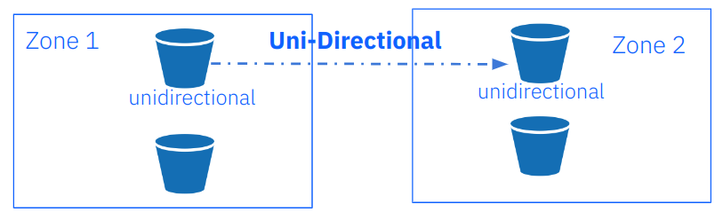

## IBM Storage Ceph Object Storage Multisite Replication Series Part Six

In the previous post in this series, we discussed Multisite Sync Policy and
shared hands-on examples of granular bucket bi-directional replication.
In today's blog, part six, we will configure additional  multisite sync policies,
including unidirectional replication with one source to many destination buckets.

### Unidirectional Bucket Sync

In the previous article, we explored a bucket sync policy with a bidirectional
configuration.  Now let’s explore an example of how to enable unidirectional
sync between two buckets. Again to give a bit of context, we currently have
our zonegroup sync policy set to `allowed`, and a bidirectional flow configured
at the `zonegroup` level. With the zonegroup sync policy allowing us to
configure replication at per-bucket granularity, we can start with our
unidirectional replication configuration.



We create the unidirectional bucket, then create a sync group with the
id `unidirectional-1`, then set the status to `Enabled`. When we set the
status of the sync group policy to `enabled`, replication will begin
once the pipe has been applied to the bucket.

```
[root@ceph-node-00 ~]# aws  --endpoint https://object.s3.zone1.dan.ceph.blue:443 s3 mb s3://unidirectional
make_bucket: unidirectional
[root@ceph-node-00 ~]# radosgw-admin sync group create --bucket=unidirectional --group-id=unidirectiona-1 --status=enabled
```

Once the sync group is in place, we need to create a pipe for our bucket.
In this example, we specify the source and destination zones: the source will
be `zone1` and the destination `zone2`. In this way, we create a unidirectional
replication pipe for bucket `unidirectional` with data replicated only
in one direction: `zone1` —> `zone2`.

```
[root@ceph-node-00 ~]# radosgw-admin sync group pipe create --bucket=unidirectional --group-id=unidirectiona-1 --pipe-id=test-pipe1 --source-zones='zone1' --dest-zones='zone2'
```

With `sync info`, we can check the flow of bucket replication.  You can see that
the sources field is empty as we are running the command from a node in `zone1`,
and we are not receiving data from an external source. After all, from the
zone where we are running the command, we are doing unidirectional replication,
so we are sending data to a destination. We can see that the source
is `zone1`, and the destination is `zone2` for the `unidirectional` bucket.

```
[root@ceph-node-00 ~]# radosgw-admin sync info --bucket unidirectional
{
    "sources": [],
    "dests": [
        {
            "id": "test-pipe1",
            "source": {
                "zone": "zone1",
                "bucket": "unidirectional:89c43fae-cd94-4f93-b21c-76cd1a64788d.34955.1"
            },
            "dest": {
                "zone": "zone2",
                "bucket": "unidirectional:89c43fae-cd94-4f93-b21c-76cd1a64788d.34955.1"
….
}
```

When we run the same command in `zone2`, we see the same information but the sources
field show receiving data from `zone1`. The unidirectional bucket `zone2` is not
sending out any replication data, which is why the destination field is empty
in the output of the `sync info` command. 

```
[root@ceph-node-04 ~]#  radosgw-admin sync info --bucket unidirectional
{
    "sources": [
        {
            "id": "test-pipe1",
            "source": {
                "zone": "zone1",
                "bucket": "unidirectional:66df8c0a-c67d-4bd7-9975-bc02a549f13e.36430.1"
            },
            "dest": {
                "zone": "zone2",
                "bucket": "unidirectional:66df8c0a-c67d-4bd7-9975-bc02a549f13e.36430.1"
            },
….
    "dests": [],
```

Once we have our configuration ready for action, let’s do some checking to see
that everything is working as expected. Let’s PUT three files to `zone1`:

```
[root@ceph-node-00 ~]# for i [1..3] do ; in aws --endpoint https://object.s3.zone1.dan.ceph.blue:443 s3 cp   /etc/hosts s3://unidirectional/fil${i}
upload: ../etc/hosts to s3://unidirectional/fil1
upload: ../etc/hosts to s3://unidirectional/fil2
upload: ../etc/hosts to s3://unidirectional/fil3
```

We can check that they have been synced to `zone2`:

```
[root@ceph-node-00 ~]# aws --endpoint https://object.s3.zone2.dan.ceph.blue:443 s3 ls s3://unidirectional/
2024-02-02 17:56:09        233 fil1
2024-02-02 17:56:10        233 fil2
2024-02-02 17:56:11        233 fil3
```

Now let’s check what happens when we PUT an object to `zone2`. We shouldn’t see
the file replicated to `zone1`, as our replication configuration for the bucket
is unidirectional.

```
[root@ceph-node-00 ~]# aws --endpoint https://object.s3.zone2.dan.ceph.blue:443 s3 cp   /etc/hosts s3://unidirectional/fil4
upload: ../etc/hosts to s3://unidirectional/fil4
[root@ceph-node-00 ~]# aws --endpoint https://object.s3.zone2.dan.ceph.blue:443 s3 ls s3://unidirectional/
2024-02-02 17:56:09        233 fil1
2024-02-02 17:56:10        233 fil2
2024-02-02 17:56:11        233 fil3
2024-02-02 17:57:49        233 fil4
```

We checked in zone1 after a while and can see that the file is not there, meaning it did not get replicated from zone2 as expected.

```
[root@ceph-node-00 ~]# aws --endpoint https://object.s3.zone1.dan.ceph.blue:443 s3 ls s3://unidirectional
2024-02-02 17:56:09        233 fil1
2024-02-02 17:56:10        233 fil2
2024-02-02 17:56:11        233 fil3
```


In this example we are going to modify the previous unidirectional sync policy
by adding a new replication target bucket named `backupbucket`. Once we set the
sync policy, every object uploaded to bucket `unidirectional` in `zone1` will
be replicated to buckets `unidirectional` and `backupbucket` in `zone2`.

To get started, let's create the bucket `backupbucket`:

```
[root@ceph-node-00 ~]# aws  --endpoint https://object.s3.zone2.dan.ceph.blue:443 s3 mb s3://backupbucket
make_bucket: backupbucket
```

We will add a new pipe to our existing sync group policy named `backupbucket`.
We created the group sync policy in our previous `unidirectional` example.

Again, we specify the source and destination zones, so our sync will be
unidirectional. The main difference is that now we are specifying a destination
bucket named `backupbucket` with the `--dest-bucket` parameter.

```
[root@ceph-node-00 ~]# radosgw-admin sync group pipe create --bucket=unidirectional --group-id=unidirectiona-1 --pipe-id=test-pipe2 --source-zones='zone1' --dest-zones='zone2' --dest-bucket=backupbucket
```

Again, let's check the sync info output, which shows us a representation of the
replication flow we have configured. The sources field is empty because
in `zone1` we are not receiving data from any other source. In destinations
we now have two different `pipes`. The first `test-pipe1` we created in our
previous example.  The second pipe has `backupbucket` set as the replication
destination in `zone2`.

```
[root@ceph-node-00 ~]# radosgw-admin sync info --bucket unidirectional
{
    "sources": [],
    "dests": [
        {
            "id": "test-pipe1",
            "source": {
                "zone": "zone1",
                "bucket": "unidirectional:66df8c0a-c67d-4bd7-9975-bc02a549f13e.36430.1"
            },
            "dest": {
                "zone": "zone2",
                "bucket": "unidirectional:66df8c0a-c67d-4bd7-9975-bc02a549f13e.36430.1"
            },
            "params": {
                "source": {
                    "filter": {
                        "tags": []
                    }
                },
                "dest": {},
                "priority": 0,
                "mode": "system",
                "user": "user1"
            }
        },
        {
            "id": "test-pipe2",
            "source": {
                "zone": "zone1",
                "bucket": "unidirectional:66df8c0a-c67d-4bd7-9975-bc02a549f13e.36430.1"
            },
            "dest": {
                "zone": "zone2",
                "bucket": "backupbucket"
            },
            "params": {
                "source": {
                    "filter": {
                        "tags": []
                    }
                },
                "dest": {},
                "priority": 0,
                "mode": "system",
                "user": "user1"
            }
        }
    ],
    "hints": {
        "sources": [],
        "dests": [
            "backupbucket"
        ]
    },
```

Let’s check it out: from our previous example, we had `zone1` with three files:

```
[root@ceph-node-00 ~]# aws --endpoint https://object.s3.zone2.dan.ceph.blue:443 s3 ls s3://unidirectional/
2024-02-02 17:56:09        233 fil1
2024-02-02 17:56:10        233 fil2
2024-02-02 17:56:11        233 fil3
```

In `zone2` with four files, `fil4` will not be replicated to `zone1` because
replication is unidirectional.

```
[root@ceph-node-00 ~]# aws --endpoint https://object.s3.zone2.dan.ceph.blue:443 s3 ls s3://unidirectional/
2024-02-02 17:56:09        233 fil1
2024-02-02 17:56:10        233 fil2
2024-02-02 17:56:11        233 fil3
2024-02-02 17:57:49        233 fil4
```

Let's add three more files to `zone1`. Wwe expect these to be replicated to the
`unidirectional` bucket and `backupbucket` in `zone2`:

```
[root@ceph-node-00 ~]# for i [5..7] do ; in aws --endpoint https://object.s3.zone1.dan.ceph.blue:443 s3 cp   /etc/hosts s3://unidirectional/fil${i}
upload: ../etc/hosts to s3://unidirectional/fil5
upload: ../etc/hosts to s3://unidirectional/fil6
upload: ../etc/hosts to s3://unidirectional/fil7
[root@ceph-node-00 ~]# aws --endpoint https://object.s3.zone1.dan.ceph.blue:443 s3 ls s3://unidirectional
2024-02-02 17:56:09        233 fil1
2024-02-02 17:56:10        233 fil2
2024-02-02 17:56:11        233 fil3
2024-02-02 18:03:51        233 fil5
2024-02-02 18:04:37        233 fil6
2024-02-02 18:09:08        233 fil7
[root@ceph-node-00 ~]# aws --endpoint http://object.s3.zone2.dan.ceph.blue:80 s3 ls s3://unidirectional
2024-02-02 17:56:09        233 fil1
2024-02-02 17:56:10        233 fil2
2024-02-02 17:56:11        233 fil3
2024-02-02 17:57:49        233 fil4
2024-02-02 18:03:51        233 fil5
2024-02-02 18:04:37        233 fil6
2024-02-02 18:09:08        233 fil7
[root@ceph-node-00 ~]# aws --endpoint http://object.s3.zone2.dan.ceph.blue:80 s3 ls s3://backupbucket
2024-02-02 17:56:09        233 fil1
2024-02-02 17:56:10        233 fil2
2024-02-02 17:56:11        233 fil3
2024-02-02 18:03:51        233 fil5
2024-02-02 18:04:37        233 fil6
2024-02-02 18:09:08        233 fil7
```

Excellent, everything is working as expected. We have all objectss replicated
to all buckets -- except `fil4`. This is expected as the file was uploaded to
`zone2`, and our replication is unidirectional, so there is no sync
from `zone2` to `zone1`. 

What will `sync info` tell us if we query `backupbucket`? This bucket is
referenced only in another bucket policy, but bucket `backupbucket`
doesn't have a sync policy of its own:

```
[root@ceph-node-00 ~]# ssh ceph-node-04 radosgw-admin sync info --bucket backupbucket
{
    "sources": [],
    "dests": [],
    "hints": {
        "sources": [
            "unidirectional:66df8c0a-c67d-4bd7-9975-bc02a549f13e.36430.1"
        ],
        "dests": []
    },
    "resolved-hints-1": {
        "sources": [
            {
                "id": "test-pipe2",
                "source": {
                    "zone": "zone1",
                    "bucket": "unidirectional:66df8c0a-c67d-4bd7-9975-bc02a549f13e.36430.1"
                },
                "dest": {
                    "zone": "zone2",
                    "bucket": "backupbucket"
                },
```

For this situation, we use _hints_, so even if the backup is not directly
involved in the `unidirectional` bucket sync policy, it is referenced
by a hint.

Note that in the output, we have resolved hints, which means that the
bucket `backupbucket` found about bucket `unidirectional` syncing to it
indirectly, and not from its own policy: the policy for `backupbucket` itself is empty.

### Bucket Sync Policy Considerations

One important consideration that can be a bit confusing is that metadata is
always synced to the other zone independent of the bucket sync policy,
so every user and bucket, even if not configured for replication, will
show up in all the zones that belong to the zonegroup.

Just as an example, let's create a new bucket called `newbucket`:

```
[root@ceph-node-00 ~]# aws  --endpoint http://object.s3.zone2.dan.ceph.blue:80 s3 mb s3://newbucket
make_bucket: newbucket
```

We confirm that this bucket doesn’t have any replication configured:

```
[root@ceph-node-00 ~]# radosgw-admin bucket sync checkpoint --bucket newbucket
Sync is disabled for bucket newbucket
```

But all metadata syncs to the secondary zone so that the bucket will appear
in `zone2`.  In any case, the data inside the bucket won’t be replicated.

```
[root@ceph-node-00 ~]# aws  --endpoint https://object.s3.zone2.dan.ceph.blue:443 s3 ls | grep newbucket
2024-02-02 02:22:31 newbucket
```

Another thing to notice is that objects uploaded before a sync policy is configured
for a bucket won’t get synced to the other zone until we upload an object after
enabling the bucket sync. This example syncs when we upload a new object to the bucket:

```
[root@ceph-node-00 ~]# aws  --endpoint https://object.s3.zone1.dan.ceph.blue:443 s3 ls  s3://objectest1/
2024-02-02 04:03:47        233 file1
2024-02-02 04:03:50        233 file2
2024-02-02 04:03:53        233 file3
2024-02-02 04:27:19        233 file4

[root@ceph-node-00 ~]# ssh ceph-node-04 radosgw-admin bucket sync checkpoint --bucket objectest1
2024-02-02T04:17:15.596-0500 7fc00c51f800  1 waiting to reach incremental sync..
2024-02-02T04:17:17.599-0500 7fc00c51f800  1 waiting to reach incremental sync..
2024-02-02T04:17:19.601-0500 7fc00c51f800  1 waiting to reach incremental sync..
2024-02-02T04:17:21.603-0500 7fc00c51f800  1 waiting to reach incremental sync..

[root@ceph-node-00 ~]# aws  --endpoint https://object.s3.zone1.dan.ceph.blue:443 s3 cp /etc/hosts  s3://objectest1/file4
upload: ../etc/hosts to s3://objectest1/file4
[root@ceph-node-00 ~]# radosgw-admin bucket sync checkpoint --bucket objectest1
2024-02-02T04:27:29.975-0500 7fce4cf11800  1 bucket sync caught up with source:
      local status: [00000000001.569.6, , 00000000001.47.6, , , , 00000000001.919.6, 00000000001.508.6, , , ]
    remote markers: [00000000001.569.6, , 00000000001.47.6, , , , 00000000001.919.6, 00000000001.508.6, , , ]
[root@ceph-node-00 ~]# aws --endpoint https://object.s3.zone2.dan.ceph.blue:443 s3 ls s3://objectest1
2024-02-02 04:03:47        233 file1
2024-02-02 04:03:50        233 file2
2024-02-02 04:03:53        233 file3
2024-02-02 04:27:19        233 file4
```

Objects created, modified, or deleted when the bucket sync policy was in
the `allowed` or `forbidden` states will not automatically sync when the
policy is enabled again.

We need to run the `bucket sync run` command to sync these objects and get
the bucket in both zones in sync. For example, we disable sync for
bucket `objectest1`, and PUT a couple of objects in `zone1` that aren't
replicated to `zone2` even after we enable the replication again.

```
[root@ceph-node-00 ~]# radosgw-admin sync group create --bucket=objectest1 --group-id=objectest1-1 --status=forbidden
[root@ceph-node-00 ~]# aws  --endpoint https://object.s3.zone1.dan.ceph.blue:443 s3 cp /etc/hosts  s3://objectest1/file5
upload: ../etc/hosts to s3://objectest1/file5
[root@ceph-node-00 ~]# aws  --endpoint https://object.s3.zone1.dan.ceph.blue:443 s3 cp /etc/hosts  s3://objectest1/file6
upload: ../etc/hosts to s3://objectest1/file6
[root@ceph-node-00 ~]# radosgw-admin sync group create --bucket=objectest1 --group-id=objectest1-1 --status=enabled
[root@ceph-node-00 ~]# aws --endpoint http://object.s3.zone2.dan.ceph.blue:80 s3 ls s3://objectest1
2024-02-02 04:03:47        233 file1
2024-02-02 04:03:50        233 file2
2024-02-02 04:03:53        233 file3
2024-02-02 04:27:19        233 file4
[root@ceph-node-00 ~]# aws  --endpoint https://object.s3.zone1.dan.ceph.blue:443 s3 ls  s3://objectest1/
2024-02-02 04:03:47        233 file1
2024-02-02 04:03:50        233 file2
2024-02-02 04:03:53        233 file3
2024-02-02 04:27:19        233 file4
2024-02-02 04:44:45        233 file5
2024-02-02 04:45:38        233 file6
```

To get the buckets back in sync we use the `radosgw-admin sync run` command from the destination zone.

```
[root@ceph-node-00 ~]# ssh ceph-node-04 radosgw-admin bucket sync run --source-zone zone1 --bucket objectest1
[root@ceph-node-00 ~]# aws --endpoint http://object.s3.zone2.dan.ceph.blue:80 s3 ls s3://objectest1
2024-02-02 04:03:47        233 file1
2024-02-02 04:03:50        233 file2
2024-02-02 04:03:53        233 file3
2024-02-02 04:27:19        233 file4
2024-02-02 04:44:45        233 file5
2024-02-02 04:45:38        233 file6
```

### Summary & Up Next

We continued discussing Multisite Sync Policy in part six of this series.
We shared some hands-on examples of configuring multisite sync policies,
including unidirectional replication with one source to many destination
buckets. In the final post of this series we will introduce the Archive Zone
feature, which maintains an immutable copy of all versions of all the objects
from our production zones.

### Footnote

The authors would like to thank IBM for supporting the community by facilitating our time to create these posts.

