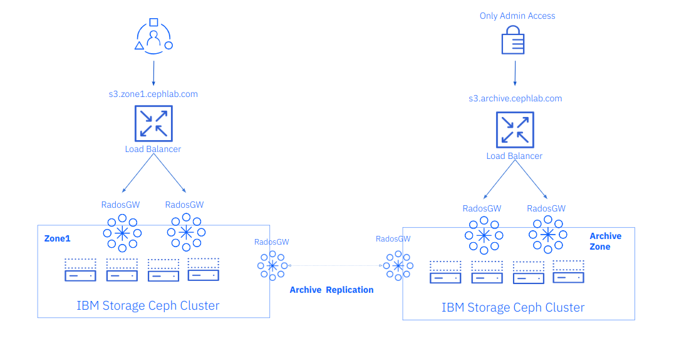

## IBM Storage Ceph Object Storage Multisite Replication Series Part Seven: the Archive Zone

In part seven of this Ceph Multisite series, we introduce Archive Zone concepts
and architecture.  We will share a hands-on example of attaching an archive zone
to a running Ceph Object Multisite cluster.

### Introduction

Archive your critical object data residing on Ceph using the Archive Zone feature. 

The Archive Zone uses the multisite replication and S3 object versioning features.
In this way, it will keep all versions of each object available even when deleted
from the production site.

With the archive zone, you can have object immutability without the overhead of
enabling object
versioning in your production zones, saving the space that the replicas of the
versioned S3 objects would consume in non-archive zones, which may well
deployed on faster yet more expensive storage devices.


This can protect your data against logical or physical errors. It can save users
from logical failures, for example, accidental deletion of a bucket in a
production zone. It can protect your data from massive hardware failures
or complete production site failure.

As the archive zone provides an immutable copy of your production data, it can
serve as a key component of a ransomware protection strategy.

You can control the storage space usage of an archive zone through
lifecycle policies of the production buckets, where you can define
the number of versions you would like to keep for an object.

We can select on a per-bucket basis the data to send/replicate to the archive
zone. If for example, we have pre-production buckets that don’t have any
valuable data we can disable the archive zone replication on those buckets.

#### Archive Zone Architecture

The archive zone as a zone in a multisite zonegroup can have a different
setup than production zones, including its own set of pools and
replication rules.

Ceph archive zones have the following main characteristics:

* Versioning is enabled in all buckets in the RGW archive zone
* Every time a user uploads a new object, that object is asynchronously
replicated to the archive zone.
* A new object version is generated in the archive zone for each object
modification in the production zone.
* We provide immutability because so that if an object is deleted in the
production zone, the object is preserved intact in the archive zone. But it is
essential to note that the archive zone does not lock the objects it ingests.
The objects are deletable in the archive zone if the user has access to the
S3 endpoint with the appropriate permissions.

The archive zone S3 endpoint for data recovery can be configured on a private
network that is only accessible to the operations administrator team.
If recovery of a production object is required, the request would need to go
through that team.

We can add an archive zone to a Ceph Object Storage single site configuration.
With this configuration, we can attach the archive zone to the running
single zone, single Ceph cluster, as depicted in the following figure:



Or we can attach our archive zone to a Ceph Object Storage multisite configuration.
If, for example, we haved a realm/zonegroup replicating between two zones, we
can add a third zone representing a third Ceph cluster.  This is the
architecture that we are going to use in our example, building on our work in the
previous posts where we setup an Ceph Multisite replication cluster. We are now
going to add a third zone to our zonegroup configured as an immutable archive
zone. An example of this architecture is shown in the following diagram.


Let’s start with our archive zone configuration. We have a freshly deployed
third Ceph cluster running on four nodes named `ceph-node-[08-11].cephlab.com`.

```
[root@ceph-node-08 ~]# ceph orch host ls
HOST                      ADDR             LABELS                      STATUS
ceph-node-08.cephlab.com  ceph-node-08     _admin,osd,mon,mgr,rgwsync          
ceph-node-09.cephlab.com  192.168.122.135  osd,mon,mgr,rgwsync
ceph-node-10.cephlab.com  192.168.122.204  osd,mon,mgr,rgw          
ceph-node-11.cephlab.com  192.168.122.194  osd,rgw              
4 hosts in cluster
```

The archive zone is not currently configurable using the Manager `rgw` module,
so we must run `radosgw-admin` commands to configure it. First, we pull the
information from our already-deployed `multisite` realm. We use the zonegroup
endpoint and the access and secret keys for our RGW multisite synchronization
user. If you need to check the details of your sync user, you can
run: `radosgw-admin user info --uid sysuser-multisite`.

```
[root@ceph-node-08]# radosgw-admin realm pull --rgw-realm=multisite  --url=http://ceph-node-01.cephlab.com:8000 --access-key=X1BLKQE3VJ1QQ27ORQP4 --secret=kEam3Fq5Wgf24Ns1PZXQPdqb5CL3GlsAwpKJqRjg --default

[root@ceph-node-08]# radosgw-admin period pull --url=http://ceph-node-01.cephlab.com:8000 --access-key=X1BLKQE3VJ1QQ27ORQP4 --secret=kEam3Fq5Wgf24Ns1PZXQPdqb5CL3GlsAwpKJqRjg
```

Once we have pulled the realm and the period locally, our third cluster has all
required realm and zonegroup configuration. If we run `radosgw-admin zonegroup get`,
we will see all details of our current multisite setup.  Moving forward we will
configure a new zone named `archive`.  We provide the list of endpoints, which
are the dedicated sync RGWs that we are going to deploy on our new cluster along
with the access and secret keys for the sync user, and last but not least the
tier type. This flag is the one that defines that this new zone is going to be
created as an archive zone.  

```
[root@ceph-node-08]# radosgw-admin zone create --rgw-zone=archive --rgw-zonegroup=multizg --endpoints=http://ceph-node-08.cephlab.com:8000,http://ceph-node-09.cephlab.com:8000 --access-key=X1BLKQE3VJ1QQ27ORQP4 --secret=kEam3Fq5Wgf24Ns1PZXQPdqb5CL3GlsAwpKJqRjg --tier-type=archive --default
```

With the new zone in place, we can update the period to push our new zone config to the rest of the zones in the zone group

```
[root@ceph-node-08]# radosgw-admin period update --commit
```

Using cephadm, we deploy two RGW services that will replicate data from
production zones. In this example, we use the cephadm RGW CLI instead of a spec
file to showcase a different way to configure your Ceph services with cephadm.
Both new RGWs that we spin up will belong to the archive zone.  Using
the `--placement` argument, we configure two RGW services that will run
on `ceph-node-08` and `ceph-node-09`, the same nodes we configured as our zone
replication endpoints via our previous commands. 

```
[root@ceph-node-08 ~]# ceph orch apply rgw multi.archive --realm=multisite --zone=archive --placement="2 ceph-node-08.cephlab.com ceph-node-09.cephlab.com" --port=8000

Scheduled rgw.multi.archive update...
```

We can check the RGWs have started correctly:

```
[root@ceph-node-08]# ceph orch ps | grep archive
[root@ceph-node-08]# ceph orch ps | grep archive
rgw.multi.archive.ceph-node-08.hratsi              ceph-node-08.cephlab.com  *:8000                running (10m)    10m ago  10m    80.5M        -  18.2.0-131.el9cp  463bf5538482  44608611b391
rgw.multi.archive.ceph-node-09.lubyaa              ceph-node-09.cephlab.com  *:8000                running (10m)    10m ago  10m    80.7M        -  18.2.0-131.el9cp  463bf5538482  d39dbc9b3351
```

Once the new RGWs spin up, the new pools for the archive zone are created for us.
Remember if we want to use erasure coding for our RGW data pool, this would be
the moment to create it before we enable replication from production to the
archive zone. The data pool is otherwise created using the default data
protection strategy replication with three copies aka _R3_.

```
[root@ceph-node-08]# ceph osd lspools | grep archive
8 archive.rgw.log
9 archive.rgw.control
10 archive.rgw.meta
11 archive.rgw.buckets.index
```

When we now check the sync status from one of our archive zone nodes, we see
that there is currently no replication configured. This is because we are
using `sync policy`, and there is no zonegroup sync policy configured for
the archive zone:

```
[root@ceph-node-08]# radosgw-admin sync status --rgw-zone=archive
          realm beeea955-8341-41cc-a046-46de2d5ddeb9 (multisite)
      zonegroup 2761ad42-fd71-4170-87c6-74c20dd1e334 (multizg)
           zone bac4e4d7-c568-4676-a64c-f375014620ae (archive)
   current time 2024-02-12T17:19:24Z
zonegroup features enabled: resharding
                   disabled: compress-encrypted
  metadata sync syncing
                full sync: 0/64 shards
                incremental sync: 64/64 shards
                metadata is caught up with master
      data sync source: 66df8c0a-c67d-4bd7-9975-bc02a549f13e (zone1)
                        not syncing from zone
                source: 7b9273a9-eb59-413d-a465-3029664c73d7 (zone2)
                        not syncing from zone
```
Now we want to start replicating data to our archive zone, so we need to create
a zone group policy. Rrecall from our previous post that we have a zonegroup
policy configured to `allow` replication at the zonegroup level, and then
we configured replication on a per-bucket basis.

In this case, we will take a different approach with the archive zone. We are
going to configure unidirectional sync at the zonegroup level, and set the policy
status to `enabled` so by default, all buckets in the zone `zone1` will be
replicated to the `archive` archive zone.

As before, to create a sync policy we need a group, a flow, and a pipe.
Let's create a new zonegroup group policy called `grouparchive`:

```
[root@ceph-node-00 ~]#  radosgw-admin sync group create --group-id=grouparchive --status=enabled 
```

We are creating a “directional” (unidirectional) flow that will replicate
all data from `zone1` to the `archive` zone:

```
[root@ceph-node-00 ~]#  radosgw-admin sync group flow create --group-id=grouparchive --flow-id=flow-archive --flow-type=directional --source-zone=zone1 --dest-zone=archive
```

Finally, we create a pipe where we use a `*` wildcard for all fields to avoid
typing the full zone names. The `*` represents all zones configured in the flow.
We could have instead entered  `zone1` and `archive` in the zone fields. The
use of wildcards here helps avoid typos and generalizes the procedure.

```
[root@ceph-node-00 ~]#   radosgw-admin sync group pipe create --group-id=grouparchive  --pipe-id=pipe-archive --source-zones='*'  --source-bucket='*' --dest-zones='*' --dest-bucket='*'
```

Zonegroup sync policies always need to be committed:

```
[root@ceph-node-00 ~]# radosgw-admin period update --commit
```

When we check the configured zonegroup policies, we now see two groups, `group1`
from our previous blog posts and `grouparchive` that we created and configured
just now:

```
[root@ceph-node-00 ~]# radosgw-admin sync group get
[
    {
        "key": "group1",
        "val": {
            "id": "group1",
            "data_flow": {
                "symmetrical": [
                    {
                        "id": "flow-mirror",
                        "zones": [
                            "zone1",
                            "zone2"
                        ]
                    }
                ]
            },
            "pipes": [
                {
                    "id": "pipe1",
                    "source": {
                        "bucket": "*",
                        "zones": [
                            "*"
                        ]
                    },
                    "dest": {
                        "bucket": "*",
                        "zones": [
                            "*"
                        ]
                    },
                    "params": {
                        "source": {
                            "filter": {
                                "tags": []
                            }
                        },
                        "dest": {},
                        "priority": 0,
                        "mode": "system",
                        "user": ""
                    }
                }
            ],
            "status": "allowed"
        }
    },
    {
        "key": "grouparchive",
        "val": {
            "id": "grouparchive",
            "data_flow": {
                "directional": [
                    {
                        "source_zone": "zone1",
                        "dest_zone": "archive"
                    }
                ]
            },
            "pipes": [
                {
                    "id": "pipe-archive",
                    "source": {
                        "bucket": "*",
                        "zones": [
                            "*"
                        ]
                    },
                    "dest": {
                        "bucket": "*",
                        "zones": [
                            "*"

                        ]
                    },
                    "params": {
                        "source": {
                            "filter": {
                                "tags": []
                            }
                        },
                        "dest": {},
                        "priority": 0,
                        "mode": "system",
                        "user": ""
                    }
                }
            ],
            "status": "enabled"
        }
    }
]
```

When we check any bucket from `zone1` (here we choose the `unidrectional` bucket,
but it could be any other; we see that we now have a new sync policy
configured with the ID `pipe-archive`. This comes from the zonegroup policy we
just applied because this is unidirectional. We run the command
from `ceph-node-00` in `zone1`. We see only the `dests` field populated,
with the `source` being `zone1` and the destination being the `archive` zone.

```
[root@ceph-node-00 ~]# radosgw-admin sync info --bucket unidirectional
{
    "sources": [],
    "dests": [
        {
            "id": "pipe-archive",
            "source": {
                "zone": "zone1",
                "bucket": "unidirectional:66df8c0a-c67d-4bd7-9975-bc02a549f13e.36430.1"
            },
            "dest": {
                "zone": "archive",
                "bucket": "unidirectional:66df8c0a-c67d-4bd7-9975-bc02a549f13e.36430.1"
            },
            "params": {
                "source": {
                    "filter": {
                        "tags": []
                    }
                },
                "dest": {},
                "priority": 0,
                "mode": "system",
                "user": ""
            }
        },
        {
            "id": "test-pipe1",
            "source": {
                "zone": "zone1",
                "bucket": "unidirectional:66df8c0a-c67d-4bd7-9975-bc02a549f13e.36430.1"
            },
            "dest": {
                "zone": "zone2",
                "bucket": "unidirectional:66df8c0a-c67d-4bd7-9975-bc02a549f13e.36430.1"
            },
            "params": {
                "source": {
                    "filter": {
                        "tags": []
                    }
                },
                "dest": {},
                "priority": 0,
                "mode": "system",
                "user": "user1"
            }
        },
```

When we run the `radosgw-admin sync status` command again, we see that the status
for `zone1` has changed from `not syncing from zone` to synchronization enabled
and `data is caught up with source`.

```
 [root@ceph-node-08 ~]#  radosgw-admin sync status --rgw-zone=archive
          realm beeea955-8341-41cc-a046-46de2d5ddeb9 (multisite)
      zonegroup 2761ad42-fd71-4170-87c6-74c20dd1e334 (multizg)
           zone bac4e4d7-c568-4676-a64c-f375014620ae (archive)
   current time 2024-02-12T17:09:26Z
zonegroup features enabled: resharding
                   disabled: compress-encrypted
  metadata sync syncing
                full sync: 0/64 shards
                incremental sync: 64/64 shards
                metadata is caught up with master
      data sync source: 66df8c0a-c67d-4bd7-9975-bc02a549f13e (zone1)
                        syncing
                        full sync: 0/128 shards
                        incremental sync: 128/128 shards
                        data is caught up with source
                source: 7b9273a9-eb59-413d-a465-3029664c73d7 (zone2)
                        not syncing from zone

```

Now all data ingested into `zone1` will be replicated to the `archive` zone.
Withh this configuration only have to set a uniderectional flow
from `zone1 to  `archive`. If, for example, a new object is ingested
in `zone2`, because we have a bidirectional bucket sync policy for
the `unidirectional` bucket, the object replication flow will be the
following: `zone2` → `zone1 → `Archive`.

### Summary & Up Next

We introduced the archive zone feature in part seven of this series.
We shared a hands-on example of configuring an archive zone in a
running Ceph Object multisite cluster. In the final post of
this series, we will demonstrate how the Archive Zone feature
can help you recover critical data from your production site.


### Footnote

The authors would like to thank IBM for supporting the community by facilitating our time to create these posts.

