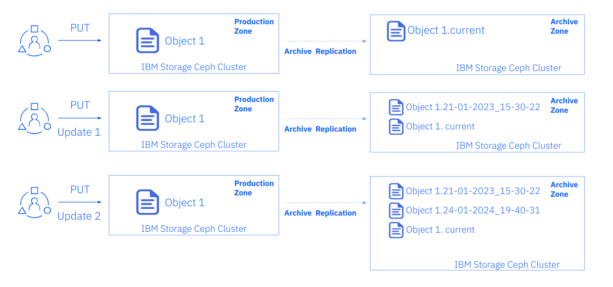
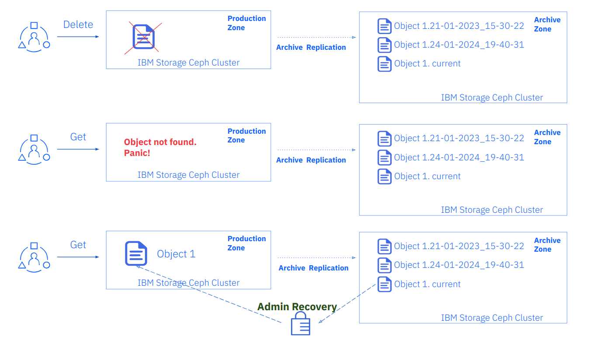

## IBM Storage Ceph Object Storage Multisite Replication Series Part Eight: Archive Zone Recovery

In part eight of this Ceph Multisite series, we will continue exploring
the Archive Zone. Using a hands-on example of recovering data from the
archive zone, we will cover in detail how the archive zone works.

### Introduction

Let's start with a visual representation of the recovery workflow for the archive zone.
Once covered, we will follow the same steps with a hands-on example.

The following diagram shows the behaviour of the Archive zone when a user PUTs
an object into the production zone.

1. With the first PUT of `object1` from the user into the production zone,
the object replicates into the archive zone as the current version.
2. When the user issues a second PUT that updates `object1`, the modification is
replicated to the archive zone. The modified object is now the current version
and the old (initial, original)  object is still available in the archive zone
thanks to S3 versioning.
3. If the user issues a third PUT that updates `object1`, the same will happen
as in step2, and we will have three versions of the object available in the archive zone.



Continuing with the example depicted above, let's check how we could recover
data from a logical failure.

1. During the application X rollout, a user makes an operational mistake and
deletes `object1` in the production zone. The object is not deleted from the
archive zone.
2. When our production application X tries to access `object1`, it fails.
The application is down, and panic ensues.
3. The application team RCAs the issue, and they make a quick call to the
storage team specifying the object and what version (date/time) they wish
to recover from. Promises of vegan brownies may be involved.
4. The storage team copies `object1`'s latest version from the archive zone into the production cluster.



### Hands-on Object Recovery from the Archive Zone Workflow

#### Prepare the Client Environment

We are going to use `rclone` CLI tool for our testing. First, we create a
specific user for our tests, so in our `zone1` cluster, we run:

```
# radosgw-admin user create --uid=archuser --display-name="S3 user to test the archive zone" --access-key=archuser --secret-key=archuser
{
    "user_id": "archuser",
    "display_name": "S3 user to test the archive zone",
    "email": "",
    "suspended": 0,
    "max_buckets": 1000,
    "subusers": [],
    "keys": [
        {
            "user": "archuser",
            "access_key": "archuser",
            "secret_key": "archuser"
        }
    ],
    "swift_keys": [],
    "caps": [],
    "op_mask": "read, write, delete",
    "default_placement": "",
    "default_storage_class": "",
    "placement_tags": [],
    "bucket_quota": {
```

Now we configure the AWS client with this user:

```
# aws configure
AWS Access Key ID [None]: archuser
AWS Secret Access Key [None]: archuser
Default region name [None]: multizg
Default output format [None]: text
```

We will also create a couple of aliases to make our life easier.

Alias for `zone1` and the `archive` zone:

```
# alias s3apiarchive='aws --endpoint=https://object.s3.archive.dan.ceph.blue:443 s3api'
# alias s3apizone1='aws --endpoint=https://object.s3.zone1.dan.ceph.blue:443 s3api'
```

We wish to use `rclone`, so let's download and install the appropriate `rclone`
package:

```
# yum install https://downloads.rclone.org/v1.62.0/rclone-v1.62.0-linux-amd64.rpm -y
```

Next we configure the `rclone` client with our production zone endpoint and the
archive zone endpoint. This way, with the use of `rclone` we can recover data
from the archive zone if required:

```
cat <<EOF >rclone.conf
[zone1]
type = s3
provider = Other
access_key_id = archuser
secret_access_key = archuser
endpoint = https://object.s3.zone1.dan.ceph.blue:443
location_constraint = multizg
acl = bucket-owner-full-control
[archive]
type = s3
provider = Ceph
access_key_id = archuser
secret_access_key = archuser
endpoint =  https://object.s3.archive.dan.ceph.blue:443
location_constraint = multizg
acl = bucket-owner-full-control
EOF

```

Next we create some test files and capture their MD5 checksums
so we can compare later:

```
# echo "This is file 1" > /tmp/test-file-1
# echo "This is file 2" > /tmp/test-file-2
# echo "This is file 3" > /tmp/test-file-3
# md5sum /tmp/test-file-1
88c16a56754e0f17a93d269ae74dde9b  /tmp/test-file-1
# md5sum /tmp/test-file-2
db06069ef1c9f40986ffa06db4fe8fd7  /tmp/test-file-2
# md5sum /tmp/test-file-3
95227e10e2c33771e1c1379b17330c86  /tmp/test-file-3
```

#### Archive Zone Testing

We have our client ready, let’s check out the archive zone.

Create a new bucket and verify the bucket has been created in all RGW zones:

```
# s3apizone1 create-bucket --bucket my-bucket
# s3apizone1 list-buckets
BUCKETS 2023-03-15T12:03:54.315000+00:00        my-bucket
OWNER   S3 user to test the archive zone        archuser
# s3apiarchive list-buckets
BUCKETS 2023-03-15T12:03:54.315000+00:00        my-bucket
OWNER   S3 user to test the archive zone        archuser
```

Verify that the object versioning is not yet configured as this is implemented lazily

```
# s3apizone1 get-bucket-versioning --bucket my-bucket
# s3apiarchive get-bucket-versioning --bucket my-bucket
```

Upload a new object to our bucket `my-bucket`.

```
# rclone copy /tmp/test-file-1 zone1:my-bucket
```

Verify that S3 versioning has been enabled in the archive zone but not in `zone1`:

```
# s3apiarchive get-bucket-versioning --bucket my-bucket
{
    "Status": "Enabled",
    "MFADelete": "Disabled"
}
# s3apizone1 get-bucket-versioning --bucket my-bucket
```

Verify that the object version ID is null in the master and secondary zones but not in the archive zone:

```
# s3apizone1 list-object-versions --bucket my-bucket
{
    "Versions": [
        {
            "ETag": "\"88c16a56754e0f17a93d269ae74dde9b\"",
            "Size": 15,
            "StorageClass": "STANDARD",
            "Key": "test-file-1",
            "VersionId": "null",
            "IsLatest": true,
            "LastModified": "2023-03-15T12:07:12.914000+00:00",
            "Owner": {
                "DisplayName": "S3 user to test the archive zone",
                "ID": "archuser"
            }
        }
    ]
}
# s3apiarchive list-object-versions --bucket my-bucket
{
    "Versions": [
        {
            "ETag": "\"88c16a56754e0f17a93d269ae74dde9b\"",
            "Size": 15,
            "StorageClass": "STANDARD",
            "Key": "test-file-1",
            "VersionId": "6DRlC7fKtpmkvHA9zknhFA87RjyilTV",
            "IsLatest": true,
            "LastModified": "2023-03-15T12:07:12.914000+00:00",
            "Owner": {
                "DisplayName": "S3 user to test the archive zone",
                "ID": "archuser"
            }
        }
    ]
}
```

Modify the object in the master zone and verify that a new version
is created in the RGW archive zone:

```
# rclone copyto /tmp/test-file-2 zone1:my-bucket/test-file-1
# rclone ls zone1:my-bucket
       15 test-file-1
```

Verify a new version has been created in the RGW archive zone:

```
# s3apiarchive list-object-versions --bucket my-bucket
{
    "Versions": [
        {
            "ETag": "\"db06069ef1c9f40986ffa06db4fe8fd7\"",
            "Size": 15,
            "StorageClass": "STANDARD",
            "Key": "test-file-1",
            "VersionId": "mXoINEnZsSCDNaWwCDELVysUbnMqNqx",
            "IsLatest": true,
            "LastModified": "2023-03-15T12:13:27.057000+00:00",
            "Owner": {
                "DisplayName": "S3 user to test the archive zone",
                "ID": "archuser"
            }
        },
        {
            "ETag": "\"88c16a56754e0f17a93d269ae74dde9b\"",
            "Size": 15,
            "StorageClass": "STANDARD",
            "Key": "test-file-1",
            "VersionId": "6DRlC7fKtpmkvHA9zknhFA87RjyilTV",
            "IsLatest": false,
            "LastModified": "2023-03-15T12:07:12.914000+00:00",
            "Owner": {
                "DisplayName": "S3 user to test the archive zone",
                "ID": "archuser"
            }
        }
    ]
}
```

We can check the ETag: it will match the MD5sum for the object.
This is only the case if neither multipart upload nor object
encryption are configured.

```
# md5sum /tmp/test-file-2
db06069ef1c9f40986ffa06db4fe8fd7  /tmp/test-file-2
# md5sum /tmp/test-file-1
88c16a56754e0f17a93d269ae74dde9b  /tmp/test-file-1
```

### Recovering S3 Objects from the Rgw Archive Zone

Let’s upload one more version of the object

```
# rclone copyto /tmp/test-file-3 zone1:my-bucket/test-file-1
```

In the primary zone we only have one version, the current version of the object:

```
# rclone --s3-versions lsl zone1:my-bucket

       15 2023-03-15 07:59:10.779573336 test-file-1
```

But in the Archive zone we have all three versions available:

```
# rclone --s3-versions lsl archive:my-bucket
       15 2023-03-15 07:59:10.779573336 test-file-1
       15 2023-03-15 07:59:03.782438991 test-file-1-v2023-03-15-121327-057
       15 2023-03-15 07:58:58.135330567 test-file-1-v2023-03-15-120712-914
```

Now let’s delete `test-file1` from `my-bucket` in `zone1`,
then recover the object from the archive zone:

```
# rclone delete zone1:my-bucket/test-file-1
# rclone --s3-versions lsl zone1:my-bucket
# rclone --s3-versions lsl archive:my-bucket
       15 2023-03-15 07:59:10.779573336 test-file-1
       15 2023-03-15 07:59:03.782438991 test-file-1-v2023-03-15-121327-057
       15 2023-03-15 07:58:58.135330567 test-file-1-v2023-03-15-120712-914
```

The object has been deleted from `zone1`, but all versions are still available in the archive
zone.  If we recover the latest version `test-file-1` it should match with
the MD5 checksum for our `test-file-3`:

```
# rclone copyto archive:my-bucket/test-file-1 zone1:my-bucket/test-file-1
# rclone copyto zone1:my-bucket/test-file-1 /tmp/recovered-file1
# md5sum /tmp/recovered-file1
95227e10e2c33771e1c1379b17330c86  /tmp/recovered-file1
# md5sum /tmp/test-file-3
95227e10e2c33771e1c1379b17330c86  /tmp/test-file-3
```

Now let's explore the case where we want to recover the object with the
version that has a specific timestamp, for example `2023-03-15-121327-057`.

```
# rclone --s3-versions copyto archive:my-bucket/test-file-1-v2023-03-15-121327-057 zone1:my-bucket/test-file-1
# rclone copyto zone1:my-bucket/test-file-1 /tmp/recovered-file1
# md5sum /tmp/recovered-file1
db06069ef1c9f40986ffa06db4fe8fd7  /tmp/recovered-file1
# md5sum /tmp/test-file-2
db06069ef1c9f40986ffa06db4fe8fd7  /tmp/test-file-2
```

This takes us to the end of a hands-on example of working with an archive zone
and, with the help of `rclone`, seamlessly recovering data.

### Summary and Up Next

We introduced the archive zone feature in part eight of this series. We shared
a hands-on example of recovering data from an archive zone. This takes us to the
end of this Ceph Object Storage Multisite series.

We hope this content has been helpful for your Ceph endeavours.

### Footnote

The authors would like to thank IBM for supporting the community by facilitating our time to create these posts.

