As data storage needs grow, organizations increasingly rely on object storage solutions that can ensure both availability and redundancy across multiple sites. Ceph’s RADOS Gateway (RGW) multisite replication has long been a powerful tool for achieving this, enabling users to replicate data seamlessly across clusters. However, when it comes to more granular control — like replicating specific buckets rather than entire zones — the process has traditionally been complex and difficult to manage with the CLI commands.

The Ceph Dashboard takes the complexity out of configuring and managing multisite bucket-granularity replication, by offering a visual, intuitive interface for configuring data flows, pipes, and sync policies, the Dashboard makes it easier for users to manage these advanced replication settings without the steep learning curve of CLI-based configuration. With fewer opportunities for error and a more efficient setup process, the Dashboard is a game-changer for those looking to take full advantage of Ceph’s multisite replication capabilities.

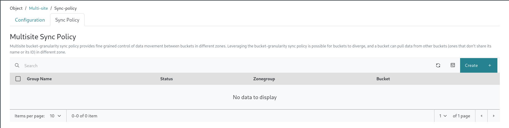  

## Configuiring Multisite Sync Policy
### Fundamental Concepts

* Groups: A sync policy can have one or more groups. Each group holds a list of data flow configurations that define how data is replicated across different zones.

* Data Flow: This defines how data moves between zones. There are two types of data flow you can configure:

  * Symmetrical data flow, where data is replicated between multiple zones, keeping all zones in sync.
  * Directional data flow, where data flows in one direction, moving from one zone to another.
* Pipes: A pipe connects specific zones and buckets to a data flow. It defines which buckets are included in the sync and the properties associated with them, such as object prefixes or other settings.

Now let's see how we can configure and set-up sync-policy with the step-by-step guide below.

## 1. Creating a bucket level sync policy

In the first step, you’re prompted to enter the **group name**, **status**, and **bucket name**. Here the status can be:  

***Enabled***: Sync is both allowed and active. Replication will begin immediately when this setting is enabled. For example, you can enable full zonegroup sync and then disable it on a per-bucket basis if needed.

***Allowed***: Sync is permitted, but replication will not start automatically. For instance, you can set the zonegroup policy to allowed and then enable sync on a per-bucket basis.

***Forbidden***: Sync, as defined by this group, is not allowed. Replication will be completely blocked.

After entering the values we will click on Create button and we will be able to see the sync policy group created and shown in the table.

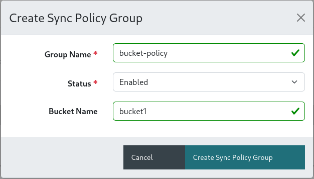  
*Figure: Step 1 - Creating bucket level sync policy group.*

## 2. Flow Configuration

Next, we’ll define the data flow configuration for this sync policy group.

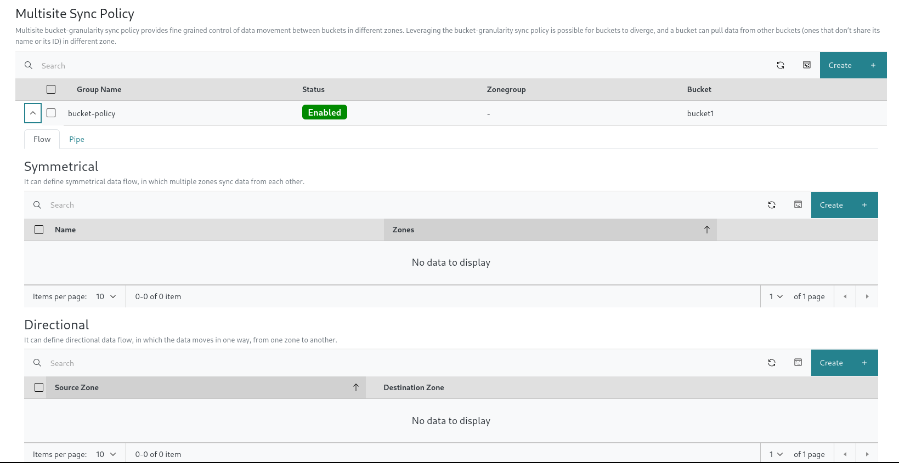

Below is how the multisite topology looks like in this example:

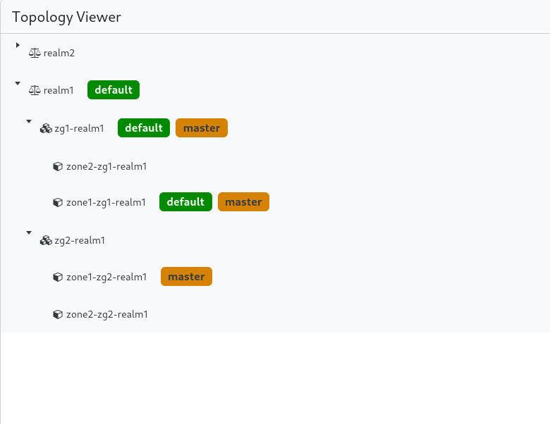  

 - ### Symmetrical Flow

    After clicking on Create button, you’re prompted to enter the **flow name**, **bucket name** and zones. Bucket name will be pre-selected ,
    and lets select the available zones i.e. 'zone1-zg1-realm1', 'zone2-zg1-realm1'. Now click on Create Symmetrical Flow button and a new entry for the created flow will be available in the table.
    With this in place, it ensures that data from both zones is replicated to the other.

    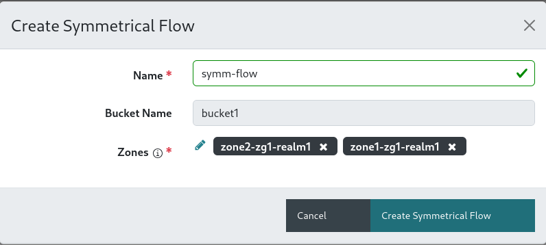  
    *Figure: Step 2 - Configuring symmetrical flow.*
  
  

 - ### Directional Flow

    After clicking on Create button, you’re prompted to enter the **flow name**, **bucket name**, **source zone** and **destination zone**. Bucket name will be pre-selected, and lets select the source zone as 'zone1-zg1-realm1' and destination zone as 'zone2-zg1-realm1'. Now click on Create Directional Flow button and a new entry for the created flow will be available in the table.
    With this in place, it ensures that data moves in a one-way direction, from source zone to destination zone.

    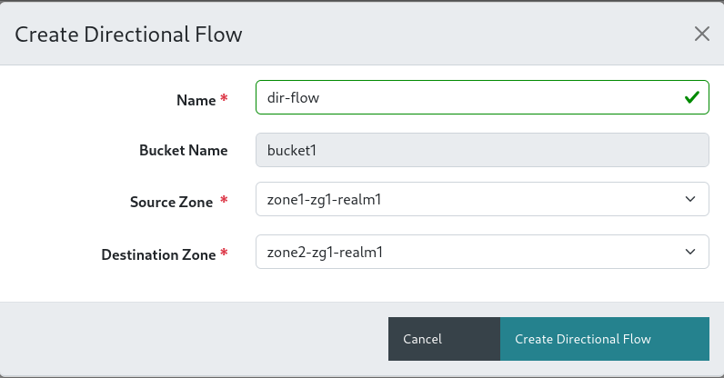  
    *Figure: Step 3 - Configuring directional flow.*

## 3. Pipe Configuration

Now that you have your sync policy group and sync flow configured, you’ll need to create a pipe. A pipe defines which specific buckets will participate in the data replication defined by the sync flow. There are different configurations that can be applied with pipe, In this example we will go ahead with most basic one i.e. 'Mirror a Specific Bucket' but there are many other configurations that are as follows:

 - Mirror a Specific Bucket: Replicating the contents of a specific bucket (e.g., bucket-1) across multiple zones to ensure that an identical copy of the bucket's data exists in those zones for high availability and disaster recovery.
 - Limit Bucket Sync to Specific Zones: Configuring a bucket’s replication so that its data is only synced between selected zones, rather than being replicated across all zones in the cluster.
 - Sync From a Different Bucket: Setting up a bucket (e.g., bucket-1) to pull data from another bucket (e.g., bucket-2) located in a different zone. This allows data from bucket-2 to be replicated to bucket-1 in another zone.
 - Sync To Different Bucket: This is the reverse of "sync from a different bucket," where data is pulled from one bucket to another.
 - Source Filters: Allow you to refine the data replication by applying filters such as prefixes or object tags. This means you can sync only specific objects (e.g., objects starting with a certain prefix or objects with certain tags) from one bucket to another.
 - Destination Parameters :
  - Storage Class: You can set the storage class of the destination objects to specify the type of storage to use (e.g., cheaper, slower storage for less frequently accessed data).
  - Destination Owner Translation: You can specify the owner of the destination objects. This allows you to set the owner of replicated objects to be the owner of the destination bucket, rather than the original bucket’s owner.
  - User Mode: User mode ensures that the user executing the replication operation has permission to both read from the source bucket and write to the destination bucket. To enable this, you need to specify the user’s unique ID (uid).

After clicking on Create button, you’re prompted to enter the **pipe name**, **source zone**, **destination zone**, **bucket name**, **source bucket** and **destination bucket**. Bucket name will be pre-selected, and now select the source zone as 'All zones(\*)' and destination zone 'All zones(\*)'.Let us keep the source bucket and destination bucket fields as empty for now.
Now click on Create Pipe button and a new entry for the created pipe will be available in the table.

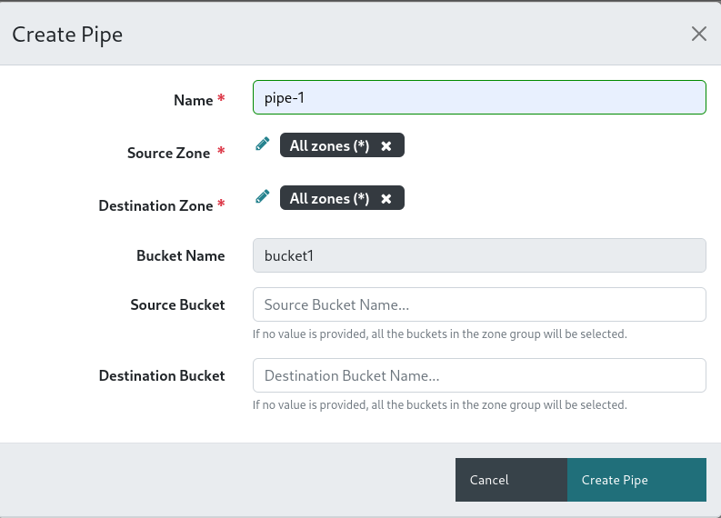  
*Figure: Step 4 - Configuring Pipe*

**Customizing Sync Policy**

In addition to easily creating sync policy groups, you can also edit and delete sync policy groups, flows, and pipes whenever necessary. This flexibility ensures you can fine-tune your replication setup and adapt to changing requirements with ease.

**To verify the sync status you can visit the Objects > Overview Page**

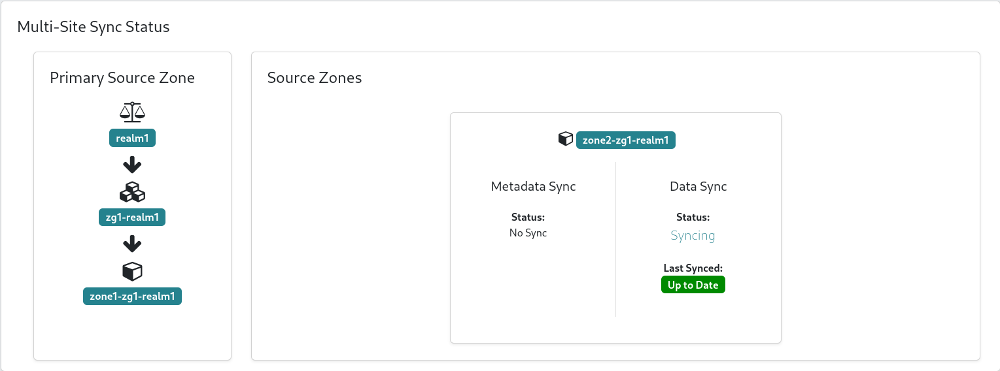
*Figure: Sync status in the primary cluster*
  
  

## One-Click Bucket Replication Setup

As we've already discussed, the manual process of creating a flow and pipe from the UI requires several steps. This involves carefully configuring each element individually to ensure proper bucket replication.

In contrast, with the automated configuration option, bucket replication can be set up with just a single click. By selecting the **enable replication** checkbox in the bucket form, the system will automatically generate the necessary pipe and flow configuration for you. This streamlined approach significantly reduces the time and effort required to configure bucket replication, making it an ideal solution for users seeking a faster and more efficient setup.

 - Here are some steps that you can follow:  

  - Navigate to Object > Buckets page
  - Create a new bucket or modify an existing bucket for which you want to enable replication.
      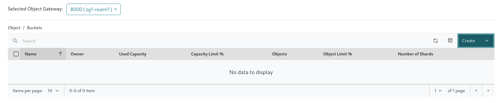
      *Figure: Creating new bucket*
  - You will land on bucket form, from which you need to select the enable checkbox corresponding to replication option.
      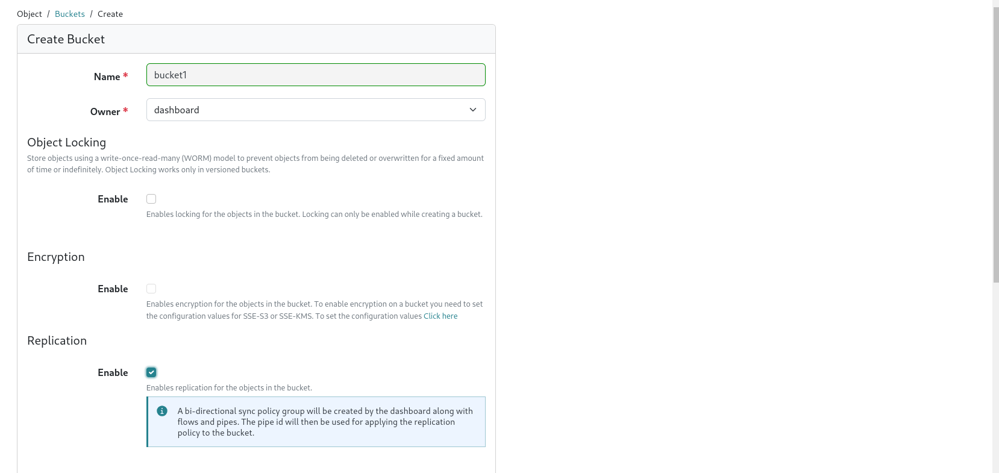
      *Figure: Enabling replication from bucket form*
  - After successfully submiiting the form, you will be taken back to the bucket list page.
  - Now navigate to Object > Multi-site > Sync Policy page.
  - Here you will be able to see the generated configuration for the sync policy group, flow and pipe.
    - **dashboard_admin_group** zonegroup level sync policy is created in which a symmetrical flow is created.
    - **s3-bucket-replication:disabled** policy is created which is in disabled state, i.e its status is set to ***Allowed***.
    - **s3-bucket-replication:enabled** policy is created in which we can se the pipe configuration.
      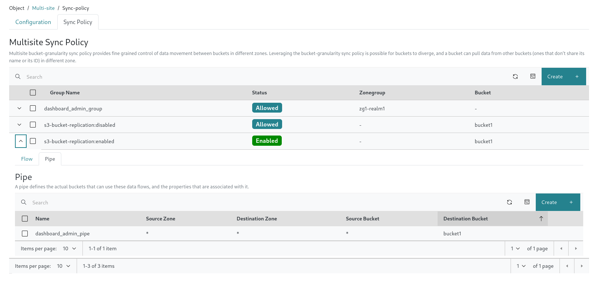
      *Figure: Generated sync policy with flow and pipe configuration*

Hence, With just a single click, you can easily set up bucket replication, saving time and simplifying your configuration.
  

## Key Features of the Dashboard for Multisite Sync Policies

### 1. **Visual Configuration**

Configure sync policies and data flows between zones via an intuitive graphical interface.

### 2. **Real-Time Monitoring**

Monitor the health and status of sync processes in real-time, including data and metadata syncs.

### 3. **Ease of Use**

Reduce the complexity of managing sync policies by eliminating the need for command-line configuration, making it accessible to users without deep technical expertise.

## Conclusion

The Ceph Dashboard makes setting up, managing, and monitoring RGW Multisite Sync Policies much simpler. It provides users with an intuitive interface that streamlines the process of ensuring high availability, optimizing costs, and maintaining compliance with regulations. This ease of use gives users full control over data replication across multiple regions without the complexity of manual configuration.

Take the opportunity to explore this new feature in the Ceph dashboard and see how it can elevate your RGW multisite management experience.

