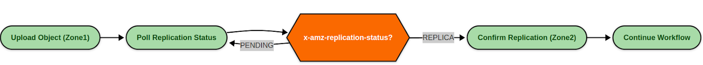
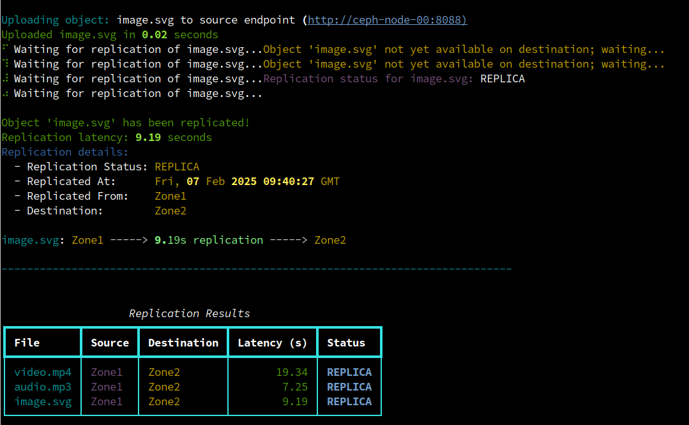

## Introduction
In a world where data must be quickly accessed and protected across multiple
geographical regions, multi-site replication is a critical feature of object
storage. Whether running global applications or maintaining a robust disaster
recovery plan, replicating objects between different regions is essential for
redundancy and business continuity.

Ceph Object storage multi-site replication is asynchronous and log-based. The
nature of async replication can present challenges validating where your data
currently resides or confirming that it has fully replicated to all remote zones.
This is not acceptable for certain applications and use cases that require close
to strong consistency on write, and all the objects to be replicated and available
in all sites before they are made accessible to the application or user.

As a side note, complete consistency on write can be provided using a Ceph
Stretch Cluster solution that provides synchronous replication, but this has its
limitations for a geo-dispersed solution as latency is a key factor for stretch
clusters. If you need geo-replication you thus often will implement multisite
async replication for object storage as your solution.

## The Challenge

Application owners often need to know if an object is already available in the
destination zone before triggering subsequent actions (e.g., analytics jobs,
further data processing, or regulatory archiving). Storage operations teams
may want clear insight into how long replication takes, enabling them to alert
and diagnose slow or faulty network links. Automation and data pipelines might
require a programmatic way to track replication status before proceeding with
the next step in a workflow.

## Ceph Squid Introduces Replication Headers

To address this visibility gap, Ceph Squid introduces new HTTP response headers
that expose exactly where each object is in the replication process:

* ``x-amz-replication-status``\
A quick way to determine if the object is pending replication, in progress, or
already fully replicated. The status might show ``PENDING``, ``COMPLETED``,
or ``REPLICA`` depending on configuration.

* ``x-rgw-replicated-from``\
Shows the source zone from which the object was initially replicated.

* ``x-rgw-replicated-at``\
Provides a timestamp indicating when the object was successfully replicated. By
comparing this to the object’s ``Last-Modified`` header, you get an instant
measure of replication latency that is valuable for real-time monitoring or
performance tuning.

These headers enable a programmatic and deterministic way to know whether
data has propagated to the target zone. It’s vital to note that the primary use
case for these new HTTP replication headers is to query the status of objects
during ingest to help the application make decisions based on the replication
status of the objects. This is not intended for infra teams to check the replication
status of *all* objects by scanning through billions of objects.

## Example Use Cases for HTTP Replication Headers

### Application Workflows

Developers can integrate these headers into their application logic. After
uploading an object, the application can poll the ``x-amz-replication-status``
header to ensure the object is fully available in the destination zone before
triggering subsequent actions.

### Operations Canary Monitoring

An automated job (sometimes called a _synthetic test_ or _canary test_) can
periodically upload and delete an object, checking how long replication takes.
If latency breaches a certain threshold, the operations team can be alerted to
investigate potential network or configuration issues.

### Data Pipelines and Notifications

While polling headers is often the most straightforward approach, you may
leverage Ceph S3 bucket notifications for certain replication-related events.
Integrating these with a message broker like Kafka can help orchestrate larger,
event-driven workflows. Fore more information see
the [Ceph docs on S3 notifications](https://docs.ceph.com/en/latest/radosgw/s3-notification-compatibility/).

## Basic Hands-on Example

I have multi-site replication set up between two Ceph clusters. They are part of
a zonegroup named ``multizg`` and we have bidirectional full-zone replication
configured between ``zone1`` and ``zone2``.

```
# radosgw-admin sync info
{
    "sources": [
        {
            "id": "all",
            "source": {
                "zone": "zone2",
                "bucket": "*"
            },
            "dest": {
                "zone": "zone1",
                "bucket": "*"
            },
    "dests": [
        {
            "id": "all",
            "source": {
                "zone": "zone1",
                "bucket": "*"
            },
            "dest": {
                "zone": "zone2",
                "bucket": "*"
            },
...
```

For detailed information about Ceph Object Storage multisite replication, see
the blog series that covers this feature in-depth, from architecture to setup
and fine-tuning:

[multisite part1](https://ceph.io/en/news/blog/2025/rgw-multisite-replication_part1/)\
[multisite part2](https://ceph.io/en/news/blog/2025/rgw-multisite-replication_part2/)\
[multisite part3](https://ceph.io/en/news/blog/2025/rgw-multisite-replication_part3/)\
[multisite part4](https://ceph.io/en/news/blog/2025/rgw-multisite-replication_part4/)\
[multisite part5](https://ceph.io/en/news/blog/2025/rgw-multisite-replication_part5/)\
[multisite part6](https://ceph.io/en/news/blog/2025/rgw-multisite-replication_part6/)\
[multisite part7](https://ceph.io/en/news/blog/2025/rgw-multisite-replication_part7/)\
[multisite part8](https://ceph.io/en/news/blog/2025/rgw-multisite-replication_part8/)

A simple way to view these new replication headers is to use ``s3cmd`` with
the ``--debug`` flag, which prints raw HTTP response headers from the Ceph
Object Gateway. By filtering for `rgw-` or `x-amz-` lines, we can easily spot
replication-related information. 

Let's check it out. I uploaded an object into ``zone1``:

```
# s3cmd --host ceph-node-00:8088 put /etc/hosts s3://bucket1/file20
upload: '/etc/hosts' -> 's3://bucket1/file20'  [1 of 1]
 640 of 640   100% in    0s     7.63 KB/s  done
```

When I check the object's status on the source zone where I uploaded the object,
it’s in the  ``PENDING`` state, indicating the object is still replicating.
Eventually, once replication is complete, the status will transition
to ``COMPLETED`` in the source zone and ``REPLICA`` in the destination zone.

```
# s3cmd --host ceph-node-00:8088 --debug info s3://bucket1/file20 2>&1 | grep -B 2 'rgw-'
             'x-amz-replication-status': 'PENDING',
             'x-amz-request-id': 'tx00000f2948c72a2d2fb8e-0067a5c961-35964-zone1',
             'x-rgw-object-type': 'Normal'},
```

Now, let’s check on the destination zone endpoint:
```
# s3cmd --host ceph-node-05:8088 --debug info s3://bucket1/file20 2>&1 | grep -B 2 'rgw-'
             'x-amz-replication-status': 'REPLICA',
             'x-amz-request-id': 'tx00000a98cf7b6a584b95b-0067a5cac9-29779-zone2',
             'x-rgw-object-type': 'Normal',
             'x-rgw-replicated-at': 'Fri, 07 Feb 2025 08:50:07 GMT',
             'x-rgw-replicated-from': 'b6c9ca95-6683-42a5-9dff-ba209039c61b:bucket1:b6c9ca95-6683-42a5-9dff-ba209039c61b.32035.1'},
```

Here, the relevant headers tell us:

* ``x-amz-replication-status: REPLICA``\
The object has completed replication and is available in the remote zone(s).
* ``x-rgw-replicated-at: 'Fri, 07 Feb 2025 08:50:07 GMT'``\
Shows the timestamp when replication was finished.
* ``x-rgw-replicated-from: 8f8c3759-aaaf-4e6d-b346-...:bucket1:...``\
Identifies the source zone (and bucket) from which the object was replicated.

Let's check that the status of the object in the source site has moved into
the ``COMPLETE`` state:

```
# s3cmd --host ceph-node-00:8088 --debug info s3://bucket1/file20 2>&1 | grep x-amz-replication-status
             'x-amz-replication-status': 'COMPLETED',
```

## Example of How to Use these Headers in an Application Workflow

This straightforward polling mechanism—via ``HEAD`` or info requests—can be
interpolated into application workflows to confirm full replication before
taking further actions. Let’s check out a basic example.

Imagine a Content Delivery Network (CDN) scenario where you must replicate
files globally to ensure low-latency access for end users across multiple
geographic regions. An application in one region uploads media assets (images,
videos, or static website content) that must be replicated to other RGW zones before
we can make them available to the end users for consumption.



[Here](https://gist.github.com/likid0/9b8c4db267a9b5065a711c302d1616bb) is a code
snippet with an example of using the Python library `boto3` to upload media
content to a site, then poll the replication status of our newly uploaded media
content by querying the replication status header. Once the object has been
replicated we print out relevant information including source and destination
RGW zones and replication latency.

Application Example output:



## Conclusion
The new replication headers in Ceph Squid Object Storage mark a significant step
forward in giving developers, DevOps teams, and storage administrators more
granular control over and visibility into multisite replication. By querying
the ``x-amz-replication-status``, ``x-rgw-replicated-from``,
and ``x-rgw-replicated-at`` headers, applications can confirm that objects have
fully synchronized before proceeding with downstream workflows. This simple yet
powerful capability can streamline CDN distribution, data analytics pipelines,
and other use cases that demand multisite consistency.

Note that some features described here may not be available before the Squid 19.2.2 release.

The authors would like to thank IBM for supporting the community with our time to create these posts.
