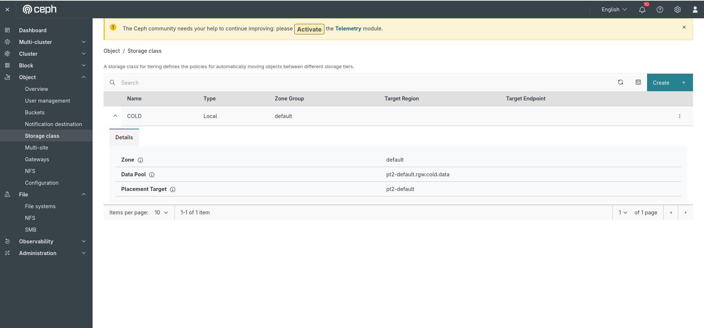
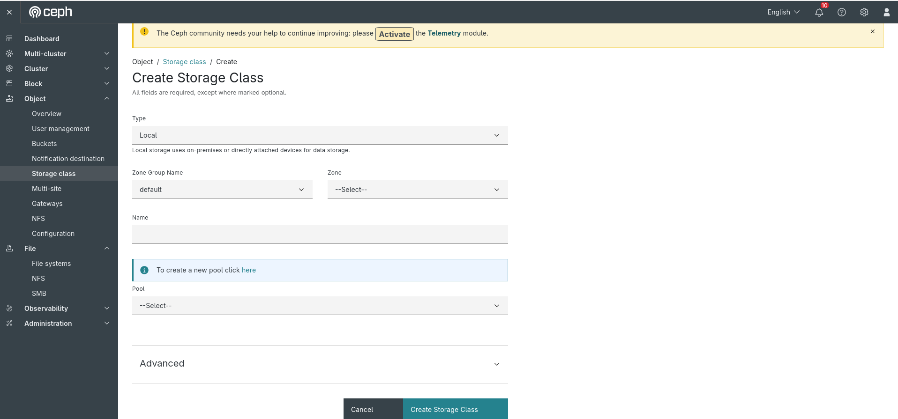
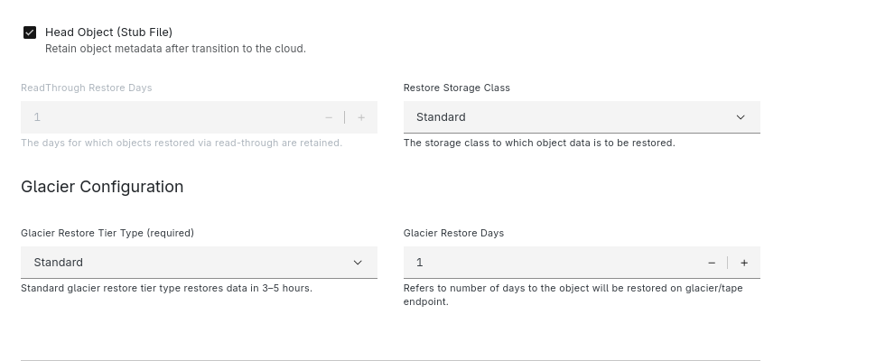
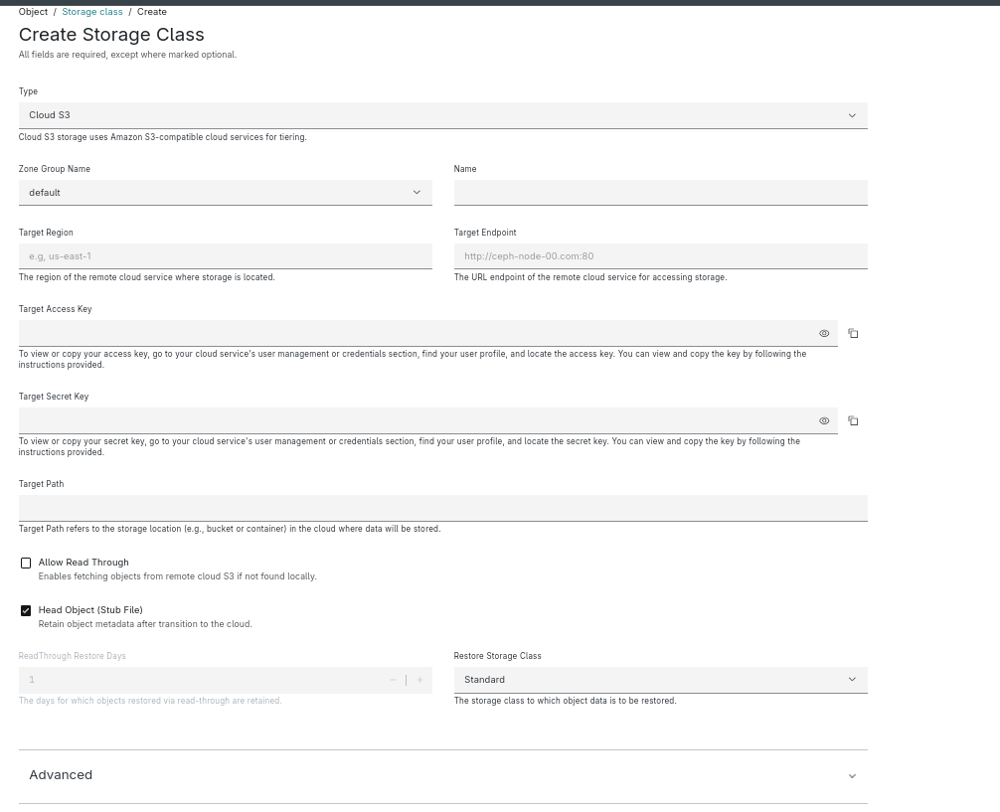
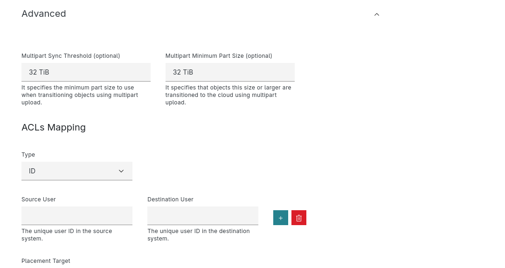

## 1. What’s an Tieirng & Why Use It?

Tiering is the process of organizing and moving data between different levels of storage, called **tiers**, based on factors like access frequency, cost, or performance requirements.

- **Optimize costs**: Track usage and enforce limits at the account level.
- **Improve performance**: Every user or role in the account can list and manage account‑owned buckets.
- **Streamlined data management**: Apply IAM policies centrally throughout the account for consistent permissions.

---

## 2. Tiering
### 2.1 Local Storage Class Creation

The Tieirng feature is available under the Dashboard menu: `Object > Tiering`. Once you navigate to this page, it will display a list of storage classes.
Now, click the `Create` button to create a new storage class. 

  
*Figure: Step 1 - Navigating to Tieirng page*

A form will appear where you can enter values for the following fields:

  
*Figure: Step 2 - Enter tiering details*

In addition Local storage class creation via dashboard handle creation of pool and pool updation in zone configuration.

The Restore Storage Class and Readthrough Restore Days is now included in both Cloud S3 and Glacier, allowing for efficient restoration of archived data, ensuring quick access and cost optimization for storage management.

 
 *Enter previous tiering details additionally Glacier Restore Tier Type - Standard or Expedited and Glacier Restore Days will be included in addition to Cloud-s3 configuration*

  
*Figure: Step 2.1 - Enter quota details* 

  

For Cloud-S3 and Glacier Storage Class creation we will have Multipart Sync Threhold and Multipart Minimum Part 

Cloud-S3 and Glacier storage classes now support **ACLs Mapping**, allowing access permissions to be transferred between systems. The mapping supports different **types**—such as **ID**, **email**, or **URL**—and links a **Source User** from the original system to a corresponding **Destination User** in the target system. This ensures consistent and secure access control across storage tiers.

After entering the details, click the Create Storage button. Upon successful storage class creation, you will be redirected to the Storage Class List page, where the newly created storage class will appear in the table. Expanding the table row reveals the storage class details.

![Step 3: Storage Class list & details]  
*Figure: Step 3 - Storage Class details*

## Conclusion

The Ceph Dashboard offers a streamlined and intuitive way to manage S3-compatible storage class management, roles, and buckets within the RGW ecosystem. we explored the Tiering feature in Ceph, focusing on the process of managing different storage classes for local, Cloud-S3, and Glacier storage. By effectively utilizing storage class management, organizations can optimize storage costs, improve performance, and streamline data management. The inclusion of features like Restore Storage Class and Readthrough Restore Days for both Cloud S3 and Glacier enhances the flexibility and efficiency of data restoration. With a centralized approach to storage tiering, businesses can ensure better scalability and reliability while managing their data storage needs across various environments. As the demand for optimized cloud storage solutions grows, Ceph’s robust storage class management offers a significant advantage for administrators and users alike.