## 1. What’s Tiering & Why Use It?

Tiering moves object data between storage levels based on access patterns, cost, or retention needs. In Ceph RADOS Gateway (RGW), administrators define **where** data can be placed using **storage classes**, and **when** it should move using **tiering** (lifecycle) rules on a bucket.

The Ceph Dashboard brings both together in a single UI workflow—no manual zone configuration or lifecycle JSON files required for common tasks.

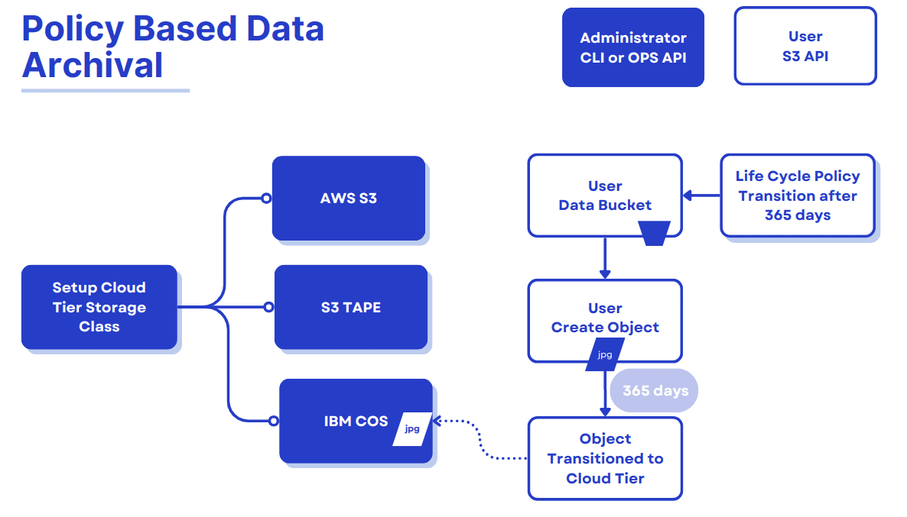
*Figure: Policy-based data archival across storage tiers*

---

## 2. Storage Classes vs Tiering: What and Why

Storage classes and tiering solve different problems. You need **both** to automate data movement.

| | **Storage class** | **Tiering** |
|---|---|---|
| **What it is** | A named destination tier that defines **where** object data is stored | A per-bucket lifecycle rule that defines **when** and **how** objects move to another storage class |
| **Where you configure it** | **Object > Storage class** | **Object > Buckets** → bucket **Tiering** tab |
| **Scope** | Cluster-wide — available to any bucket in the zone | Bucket-specific — applies only to objects in that bucket |
| **Defines** | Target pool (local) or remote endpoint (cloud) | Transition period (days), destination storage class, and rule scope |
| **Analogy** | Building a shelf (the destination) | Scheduling when items move to that shelf |

**Why configure both?**

1. **Create a storage class first** — RGW needs a defined destination before objects can transition. For example, a `cloud-s3` class points to a remote Ceph cluster or cloud endpoint; a local class points to an on-premises pool.
2. **Then apply tiering** — a bucket rule references that storage class and sets the transition schedule—for example, move objects to `cloudtier` after 30 days.

Without a storage class, there is nowhere for tiered data to go. Without a tiering rule, objects remain on their current class indefinitely even if destinations exist.

---

## 3. Local vs Cloud Storage Classes

When creating a storage class, choose **Local** or **Cloud** depending on where the destination tier lives.

| | **Local storage class** | **Cloud storage class** (`cloud-s3` / `cloud-s3-glacier`) |
|---|---|---|
| **Where data lives** | RADOS pools inside your Ceph cluster | A remote S3-compatible endpoint (another Ceph cluster, public cloud, tape, or Glacier) |
| **When to use** | Tier between on-premises pools—for example, from a performance pool to a capacity pool | Offload cold or archive data off-site, or tier between two Ceph clusters |
| **Target you define** | **Target data pool** | **Target Region**, **Endpoint**, **Access Key**, **Secret Key**, and **Target Path** |
| **Data movement** | Within the same cluster | Unidirectional copy to the remote tier |

- **Local** — data stays in the cluster; useful for cost or performance tiering across pools.
- **Cloud S3** (`cloud-s3`) — data moves to a standard S3-compatible remote endpoint.
- **Cloud S3 Glacier** (`cloud-s3-glacier`) — data moves to archive backends (Glacier or tape) that require a restore step before reads. This is a Ceph tier type, not an AWS Glacier storage class name.

For more details, see [Cloud Transition](https://docs.ceph.com/en/latest/radosgw/cloud-transition/) and [Cloud Restore](https://docs.ceph.com/en/latest/radosgw/cloud-restore/).

---

## 4. Example: Tiering Between Two Ceph Clusters

The rest of this post follows one example end to end in the Dashboard.

**Goal:** On a **source cluster**, objects in bucket `targetbucket` start on local storage. After 1 day, they transition to a **Cloud S3** storage class that targets a **destination cluster**.

| UI step | What we do in the example |
|---|---|
| **Create a storage class** | Create a **Cloud S3** class named for the remote tier |
| **Define the target** | Set the destination cluster endpoint, credentials, and **Target Path** |
| **Create a lifecycle policy** | Create `targetbucket`, upload `test.txt`, open the **Tiering** tab |
| **Select a transition and apply** | Rule `testrule`: transition to the cloud storage class after **1** day |

---

## 5. Dashboard Workflow

### Step 1: Create a Storage Class

Navigate to **Object > Storage class** and click **Create**.

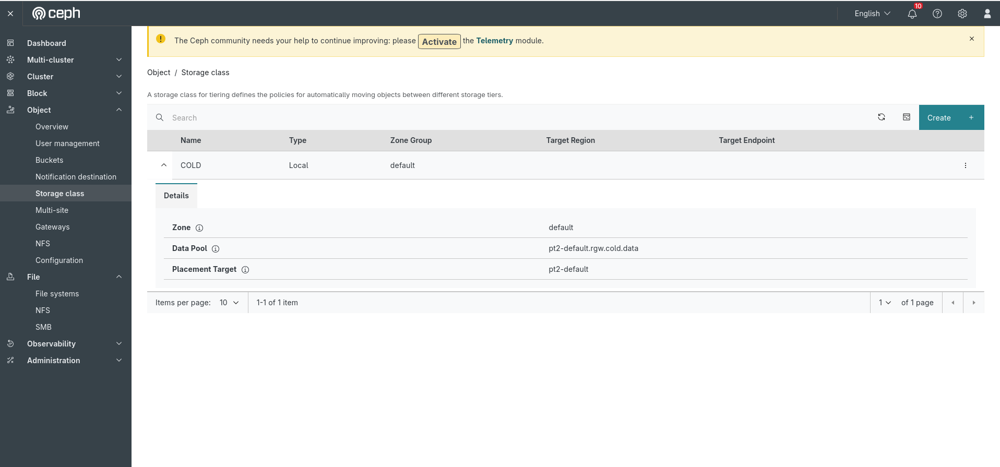
*Figure: Storage class list — Step 1, start here*

Select the storage class **Type** and enter **Zone Group Name**, **Zone**, and **Name**:

- **Local** — on-premises RADOS pool within the cluster.
- **Cloud S3** — S3-compatible remote endpoint (`cloud-s3` tier type).
- **Cloud S3 Glacier** — archive backends (`cloud-s3-glacier` tier type).

In our example, select **Cloud S3** to tier data to the destination cluster.

---

### Step 2: Define the Target

This step completes the storage class form by defining **where** tiered objects are stored.

**Local storage class** — select the **Target data pool**:

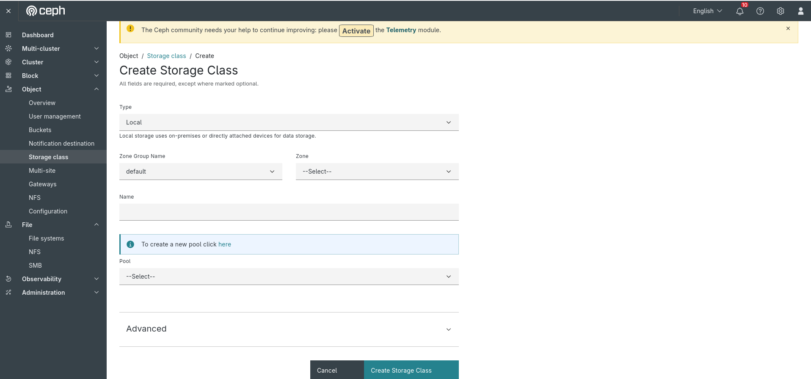
*Figure: Local storage class — define target data pool*

**Cloud S3 storage class** — enter the destination cluster details:

- **Target Region**, **Target Endpoint**, **Target Access Key**, **Target Secret Key**
- **Target Path** — remote bucket where tiered objects land

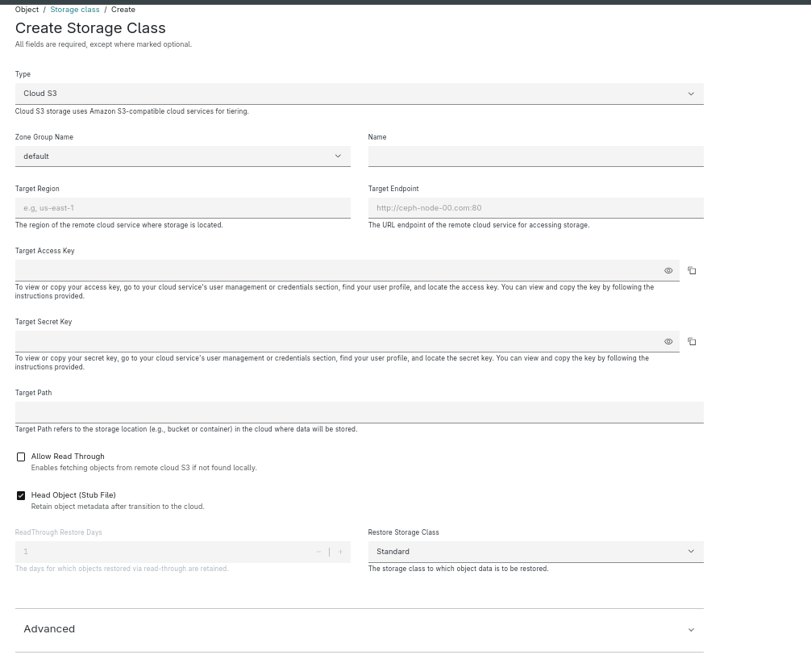
*Figure: Cloud S3 storage class — define cloud target (our example)*

Optional settings on cloud storage classes:

- **Allow Read Through**, **Head Object (Stub File)**, **ReadThrough Restore Days**, **Restore Storage Class**

**Cloud S3 Glacier** adds **Glacier Restore Tier Type** and **Glacier Restore Days**:

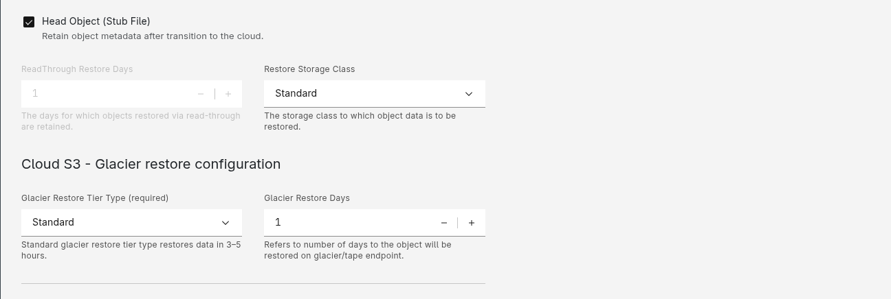
*Figure: Cloud S3 Glacier — archive restore settings*

Expand **Advanced** for multipart transition and ACL mapping on cloud classes:

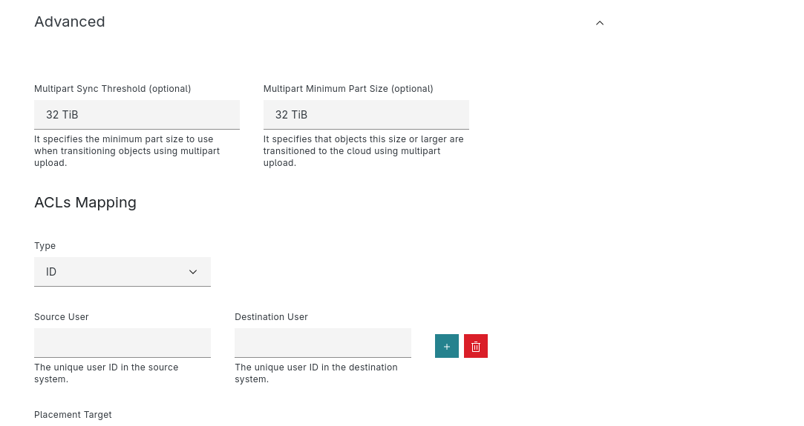
*Figure: Advanced settings — multipart and ACL mapping*

Click **Create Storage Class**. The new class appears in the list:


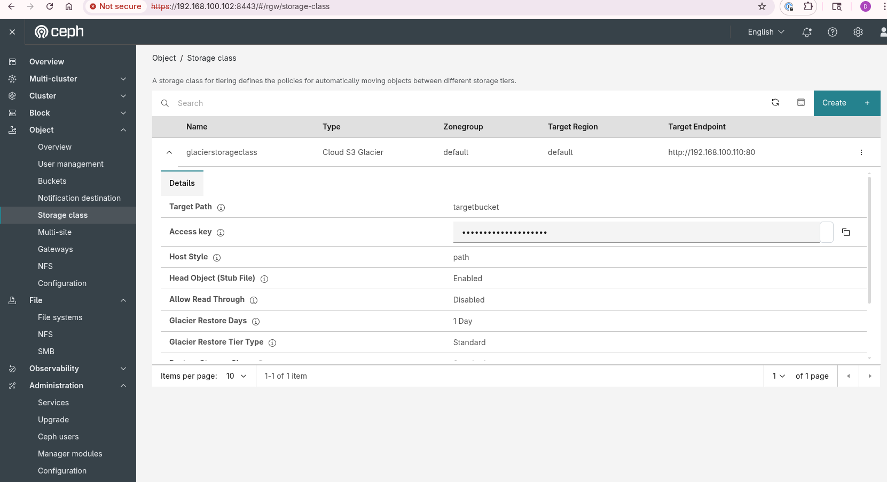
*Figure: Storage class created — ready to use in tiering rules*

---

### Step 3: Create a Lifecycle Policy

Tiering rules apply to a **bucket**. Create the bucket, upload objects, then open the **Tiering** tab to manage lifecycle policy for that bucket.

**Create the bucket** under **Object > Buckets**:

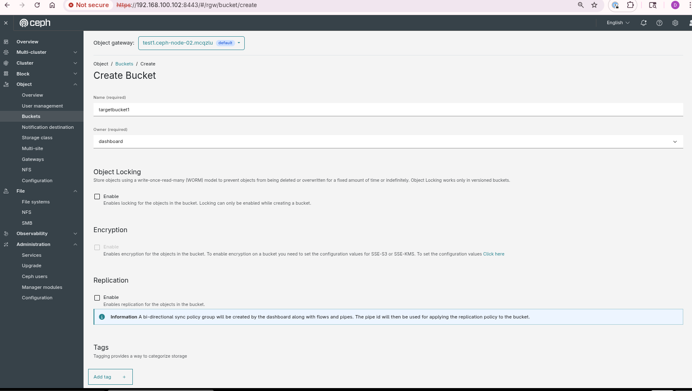
*Figure: Create bucket `targetbucket`*

**Upload objects** to the source cluster before applying tiering rules:

```
aws configure
aws s3 cp test.txt s3://targetbucket/test.txt --endpoint-url http://<source-rgw-endpoint>
aws s3 ls s3://targetbucket/ --endpoint-url http://<source-rgw-endpoint>
```

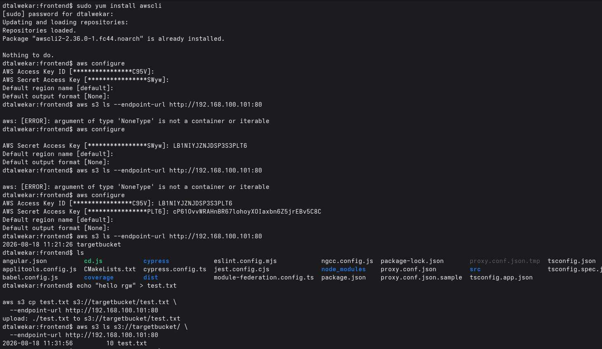
*Figure: Upload `test.txt` to `targetbucket` on the source cluster*

Confirm the object count in the Dashboard:

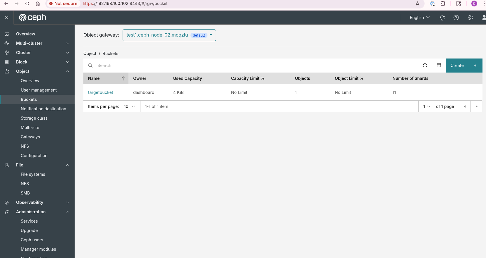
*Figure: Bucket list shows 1 object in `targetbucket`*

**Open the Lifecycle tab** on the bucket (**Data management** → **Lifecycle**) — this is where lifecycle tiering rules are managed:

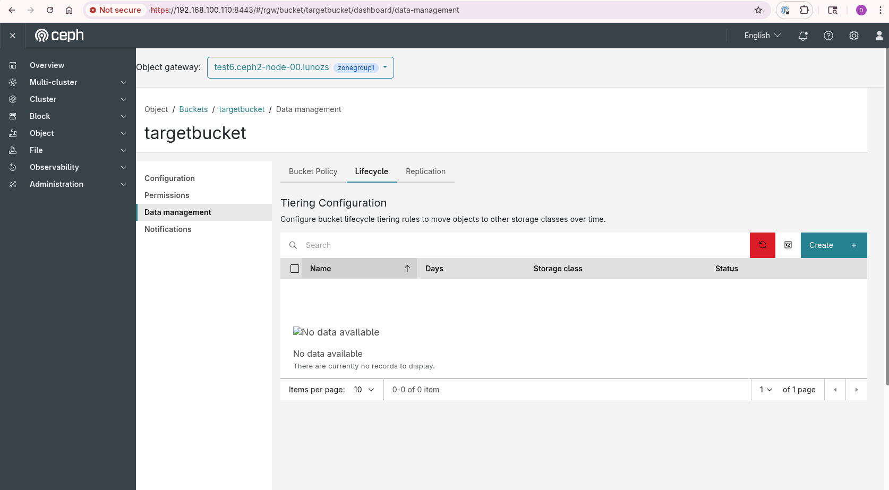
*Figure: Lifecycle tab — ready to add a tiering rule*

---

### Step 4: Select a Transition and Apply

Click **Create** on the **Tiering** tab and define the transition rule:

- **Rule name** — for example, `testrule`
- **Storage class** — destination class from Step 1 (for example, `glacierstorageclass` or your Cloud S3 class)
- **Number of days** — for example, `1` (objects transition after one day)
- **Scope** — all objects in the bucket, or filtered by prefix/tags
- **Status** — **Enabled**

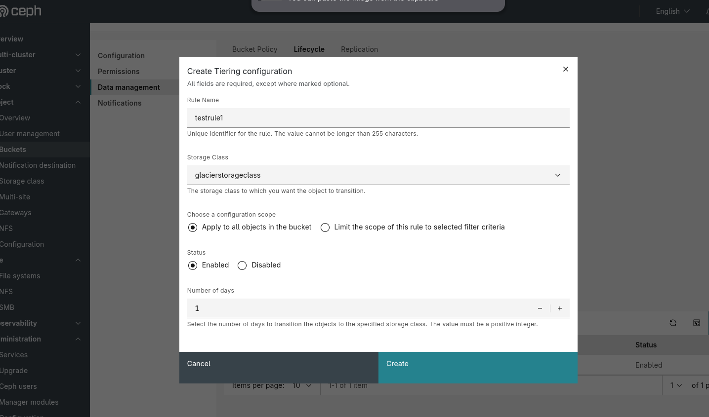
*Figure: Create tiering rule — select transition and apply*

Click **Create** to apply the rule.

The **Lifecycle** tab under **Data management** shows the applied policy—the lifecycle JSON, the **Tiering Configuration** table, and the processing status:

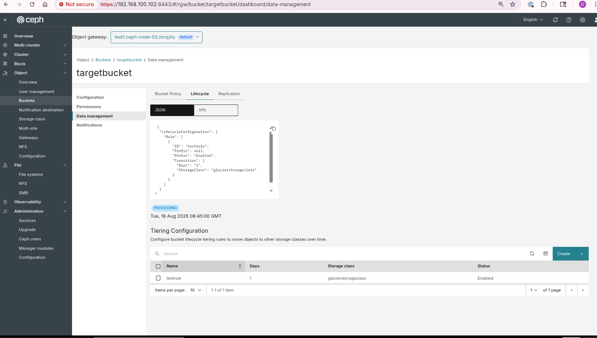
*Figure: Lifecycle tab — tiering rule applied with PROCESSING status*

To change or remove the rule later, use **Edit** or **Delete**:

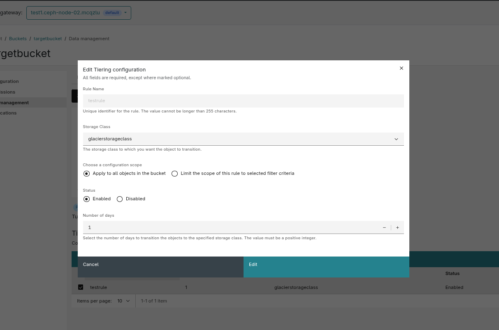
*Figure: Edit or delete tiering configuration*

**Monitor lifecycle status** on the same tab:

| Status | Meaning |
|---|---|
| **UNINITIAL** | Rule is saved; lifecycle processing has not run yet |
| **PROCESSING** | RGW is evaluating and transitioning objects |
| **COMPLETED** | Transition finished for eligible objects |

The status badge appears on the **Lifecycle** tab alongside the tiering rule details.

**Test quickly in a lab** by setting `rgw_lc_debug_interval` to **60** under **Administration > Configuration** (each day in the rule = 60 seconds), then restart RGW:

```
ceph orch restart rgw
```

**Important:** Use `rgw_lc_debug_interval` only for testing. Reset it when done.

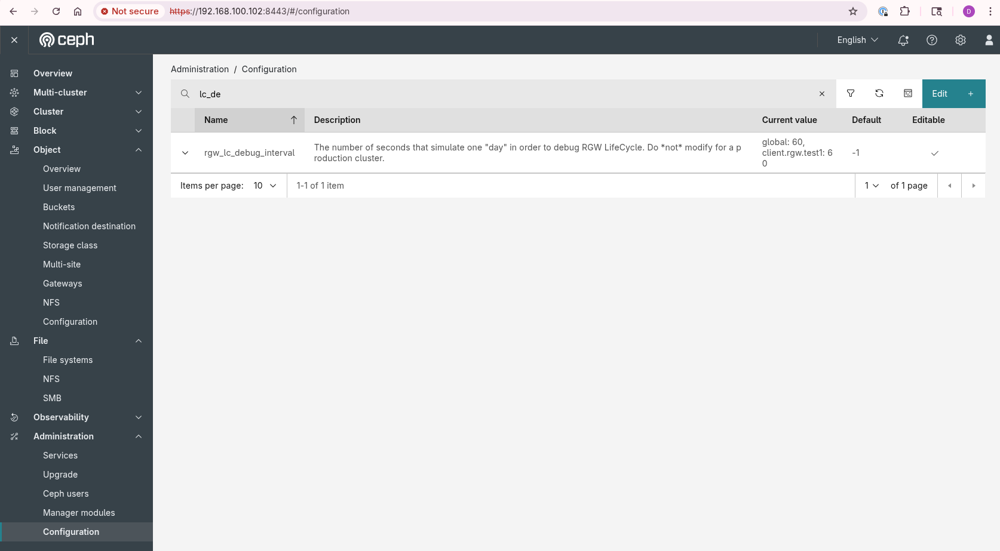
*Figure: Accelerate lifecycle for lab testing*

When status is **COMPLETED**, verify on the source cluster that the object storage class reflects the destination tier. If **Head Object (Stub File)** is enabled, the object may show size `0` while metadata remains locally.

---

## 6. Dashboard Highlights

- **Storage class + tiering**: Define destinations cluster-wide, then apply per-bucket transition rules.
- **Four-step UI flow**: Create storage class → Define target → Create lifecycle policy → Select transition and apply.
- **Local and cloud tiers**: **Local**, **Cloud S3**, and **Cloud S3 Glacier** from **Object > Storage class**.
- **Lifecycle visibility**: Track **UNINITIAL**, **PROCESSING**, and **COMPLETED** on the bucket **Tiering** tab.
- **Restore and ACL options**: Read-through, restore settings, multipart transition, and ACL mapping on cloud storage classes.

---

## Conclusion

RGW tiering in the Dashboard uses two layers: **storage classes** define where data can go, and **tiering rules** define when objects move there. Configure the storage class and target first under **Object > Storage class**, then create a bucket, upload objects, and apply a transition rule from the bucket **Tiering** tab.

In our example, objects in `targetbucket` on the source cluster transition to a cloud storage class on the destination cluster after the configured number of days—with full status visibility from **UNINITIAL** through **COMPLETED**.
