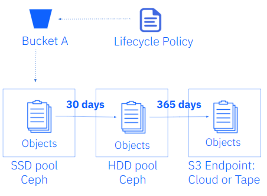
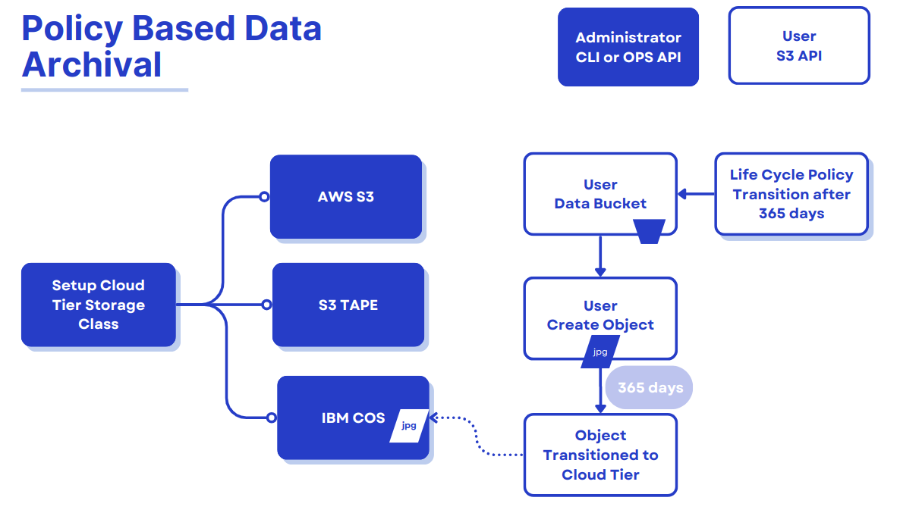
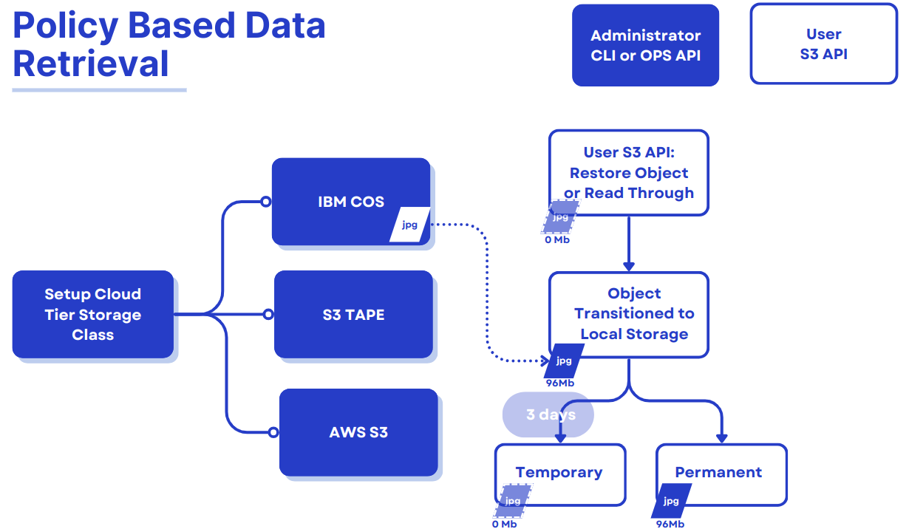
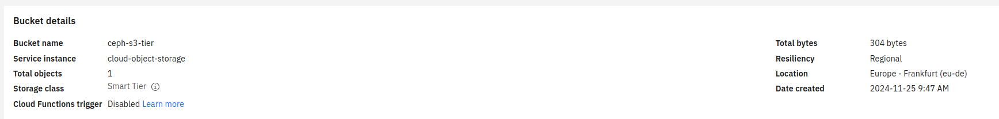

##  IBM Storage Ceph Object Storage Tiering Enhancements. Part One

### Introduction

Ceph offers object storage tiering capabilities to optimize cost and performance
by seamlessly moving data between storage classes. These tiers can be configured
locally within an on-premise infrastructure or extended to include cloud-based
storage classes, providing a flexible and scalable solution for diverse
workloads. With policy-based automation, administrators can define lifecycle
policies to migrate data between high-performance storage and cost-effective
archival tiers, ensuring the right balance of speed, durability, and cost-efficiency.

Local storage classes in Ceph allow organizations to tier data between fast NVMe
or SAS/SATA SSD-based pools and economical HDD or QLC-based pools within their
on-premises Ceph cluster. This is particularly beneficial for applications
requiring varying performance levels or scenarios where data "ages out"
of high-performance requirements and can be migrated to slower, more
economical storage. 



In addition to local tiering, Ceph offers policy-based data archival and
retrieval capabilities that integrate with S3-compatible platforms for
off-premises data management. Organizations can use this feature to
archive data to cloud-based tiers such as IBM Cloud Object Storage,
AWS S3, Azure Blob or S3 Tape Endpoints for long-term retention, disaster
recovery, or cost-optimized cold storage. By leveraging policy-based automation,
Ceph ensures that data is moved to the cloud or other destination based on
predefined lifecycle rules, enhancing its value in hybrid cloud strategies. 



### New Feature in the Squid Release:  Policy-Based Data Retrieval

Initially, Ceph's policy-based data archival (cloud sync) to
S3-compatible platforms offered a uni-directional data flow, where data could
only be archived from local storage pools to the designated cloud storage
tier. While this allowed users to leverage cost-effective cloud platforms
for cold storage or long-term data retention, the lack of retrieval capabilities
limited the solution’s flexibility in data management. This meant that once
data was archived to cloud storage, it could no longer be actively retrieved
or re-integrated into local workflows directly through Ceph.

Ceph Squid introduced policy-based data retrieval, which marks a significant
evolution in its capabilities and is now available as a Tech Preview.
This enhancement enables users to retrieve S3 cloud or tape transitioned objects
directly into their on-prem Ceph environment, eliminating the limitations of the
previous uni-directional flow. Data can be restored as temporary or permanent
objects.

* Temporary restores: The restored data bypasses lifecycle cloud-transition
rules and is automatically deleted after the specified amount of time,
reverting the object to its previous stub state. 
* Permanent restores: These fully reintegrate objects into the Ceph cluster
where they are treated like (and become) regular objects and subjected to
standard lifecycle policy and replication processes.

This retrieval of objects can be done in two different ways:

* S3 RestoreObject API:  Allows users to retrieve objects from the remote S3
endpoint using the `S3RestoreObject` API request
* Read-through Object Retrieval:  Enables standard S3 `GET` requests on
transitioned objects to restore them to the Ceph cluster transparently.



In this release, we don't support object retrieval from S3 cloud/tape endpoints
that use the distinct Glacier API, like for example IBM Deep Archive.
This feature enhancement is targeted for the Tentacle release of Ceph.

### Policy-Based Data Archival Step-by-Step Walkthrough

In this section, we will configure and set up the Policy-Based Data Archival
feature of Ceph.  We will discuss using data lifecycle policies to transition
cold data to a an offsite, cost-effective storage class by archiving it to
IBM Cloud Object Storage (COS). 

#### Ceph Terminology we will be using

* Zonegroup: A collection of zones usually located in the same geographic
location (a.k.a. Region).
* Zone: One or more instances that contain Object Gateway (RGW) endpoints and
are part of a zonegroup.
* Placement: Logical separation of RADOS data pools within the same zone.
* Storage Class: Storage classes customize the placement of object data,
and S3 bucket lifecycle rules automate the transition between these classes.

**Note**: The RGW Storage Classes we describe here should not be conflated with
Kubernetes PV/PVC Storage Classes.

#### Life Cycle Policy Introduction

The table below provides a summary of the various lifecycle policies that The Ceph Object Gateway supports:

| *Policy Type* | *Description* | *Example Use Case* |
| :--- | :--- | :--- |
| *Expiration* | Deletes objects after a specified duration | Removing temporary files automatically after 30 days |
| *Noncurrent Version Expiration* | Deletes noncurrent versions of objects after a specified duration in versioned buckets | Managing storage costs by removing old versions of objects |
| *Abort Incomplete Multipart Upload* | Cancels multipart uploads that are not completed within a specified duration | Free up storage by cleaning up incomplete uploads |
| *Transition Between Storage<br>Classes* | Moves objects between different storage classes within the same Ceph cluster after<br>a duration | Moving data from SSD / replicated<br>to HDD / EC storage after 90 days |
| *NewerNoncurrentVersions Filter* | Filters noncurrent versions newer than a specified count for expiration or transition actions | Retaining only the last three noncurrent<br>versions of an object |
| *ObjectSizeGreaterThan Filter* | Applies the lifecycle rule only to objects larger than a specified size | Moving large video files to a lower-cost storage class |
| *ObjectSizeLess Filter* | Applies the lifecycle rule only to objects smaller than a specified size | Archiving small log files after a certain period |

In addition to specifying policies, lifecycle rules can be filtered using tags
or prefixes, allowing for more granular control over which objects are affected.
Tags can identify specific subsets of objects based on per-object tagging, while
prefixes help target objects based on their key names.

#### Configuring the Remote Cloud Service for Tiering

First, we configure the remote S3 cloud service as the future destination of
our on-prem transitioned objects. In our example, we will create an IBM COS
bucket named `ceph-s3-tier`.



It is important to note that we need to create a service credential for our bucket with HMAC keys enabled.

#### Creating a New Storage Class for Cloud-S3 Tiering

Create a new storage class on the default placement within the default zonegroup;
we use the `rgw-admin --tier-type=cloud-s3` parameter to configure the storage
class against our previously configured bucket in COS S3.

```
# radosgw-admin zonegroup placement add --rgw-zonegroup=default --placement-id=default-placement --storage-class=ibm-cos --tier-type=cloud-s3
```

*Note:* Ceph allows one to create storage classes with arbitrary names, but some
clients and client libraries accept only AWS storage class names or behave
uniquely when the storage class is, e.g., `GLACIER`.

We can verify the available storage classes in the default zone group and placement target:

```
# radosgw-admin zonegroup get --rgw-zonegroup=default | jq .placement_targets[0].storage_classes
[
  "STANDARD_IA",
  "STANDARD",
  "ibm-cos"
]
```

#### Configuring Cloud-S3 Storage Classes with Tier Configurations

Next, we use the `radosgw-admin` command to configure the `cloud-s3` storage
class with specific parameters from our IBM COS bucket:
endpoint, region, and account credentials:

```
# radosgw-admin zonegroup placement modify --rgw-zonegroup default  --placement-id default-placement --storage-class ibm-cos --tier-config=endpoint=https://s3.eu-de.cloud-object-storage.appdomain.cloud,access_key=YOUR_ACCESS_KEY,secret=YOUR_SECRET_KEY,target_path="ceph-s3-tier",multipart_sync_threshold=44432,multipart_min_part_size=44432,retain_head_object=true,region=eu-de
```

#### Applying Lifecycle Policies

Once the COS cloud-S3 storage class is in place, we will switch the user to a
consumer of the Ceph Object S3 API and configure a lifecycle policy through the
RGW S3 API endpoint. Our user is named `tiering`, and we have the S3 AWC CLI
pre-configured with the credentials for the tiering user.

```
# aws --profile tiering --endpoint https://s3.cephlabs.com s3 mb s3://databucket
# aws --profile tiering --endpoint https://s3.cephlabs.com s3 /etc/hosts s3://databucket
```

We will attach a JSON lifecycle policy to the previously created bucket. For
instance, the bucket `databucket` will have the following policy, transitioning
all objects older than 30 days to the COS storage class:

```
{
  "Rules": [
    {"ID": "Transition objects from Ceph to COS that are older than 30 days",
      "Prefix": "",
      "Status": "Enabled",
      "Transitions": [
        {
          "Days": 30,
          "StorageClass": "ibm-cos"
        }
      ]
    }
   ]
}
```

As an S3 API consumer, we will use the AWS S3 CLI, to apply the bucket lifecycle
configuration we saved to a local file called `ibm-cos-lc.json`:

```
# aws --profile tiering --endpoint https://s3.cephlabs.com s3api put-bucket-lifecycle-configuration --lifecycle-configuration file://ibm-cos-lc.json --bucket databucket
```

Verify that the policy is applied:

```
# aws --profile tiering --endpoint https://s3.cephlabs.com s3api get-bucket-lifecycle-configuration  --bucket databucket
```

We can also check that Ceph / RGW have registered this new LC policy with
the following `radosgw-admin` command. The status is `UNINITIAL`, as this LC has
never been processed; once processed, it will move to the `COMPLETED` state:

```
# radosgw-admin lc list | jq .[1]
{
  "bucket": ":databucket:fcabdf4a-86f2-452f-a13f-e0902685c655.310403.1",
  "shard": "lc.23",
  "started": "Thu, 01 Jan 1970 00:00:00 GMT",
  "status": "UNINITIAL"
}
```

We can get further details of the rule applied to the bucket with the following command:

```
# radosgw-admin lc get --bucket databucket
{
    "prefix_map": {
        "": {
            "status": true,
            "dm_expiration": false,
            "expiration": 0,
            "noncur_expiration": 0,
            "mp_expiration": 0,
            "transitions": {
                "ibm-cos": {
                    "days": 30
                }
            },
        }
    }
}
```

#### Testing The Configured Lifecycle Policy

Important **WARNING**: changing this parameter is **ONLY** for LC testing
purposes. Do not change it on a production Ceph cluster, and remember to
reset as appropriate!

We can speed up the testing of lifecycle policies by enabling a debug interval
for the lifecycle process. In this setting, each "day" in the bucket lifecycle
configuration is equivalent to 60 seconds, so a three-day expiration period
is effectively three minutes:

```
# ceph config set client.rgw  rgw_lc_debug_interval 60
# ceph orch restart rgw.default
```

If we now run `radosgw-admin lc list` we should see the lifecycle policy for our
transition bucket in a completed state:

```
[root@ceph01 ~]# radosgw-admin lc list| jq .[1]
{
  "bucket": ":databucket:fcabdf4a-86f2-452f-a13f-e0902685c655.310403.1",
  "shard": "lc.23",
  "started": "Mon, 25 Nov 2024 10:43:31 GMT",
  "status": "COMPLETE"
}
```

If we list the objects available in the transition bucket on our on-premise
cluster, we can see that the object size is `0`. This is because they
have been transitioned to the cloud. However, the metadata / head of the object
is still available locally because of the use of
the `retain_head_object": "true"` parameter when creating the cloud storage class:

```
# aws --profile tiering --endpoint https://s3.cephlabs.com s3 ls s3://databucket
2024-11-25 05:41:33          0 hosts
```

If we check the object attributes using the s3api `get-object-attributes` call
we can see that the storage class for this object is now `ibm-cos`,
so this object has been successfully transitioned into the S3 cloud provider:

```
# aws --profile tiering --endpoint https://s3.cephlabs.com s3api  get-object-attributes --object-attributes StorageClass ObjectSize --bucket databucket --key hosts
{
    "LastModified": "2024-11-25T10:41:33+00:00",
    "StorageClass": "ibm-cos",
    "ObjectSize": 0
}
```

If we check in IBM COS, using the AWS CLI S3 client, but using the endpoint and
profile of the IBM COS user, we can see that the objects are available in the
IBM COS bucket . Due to API limitations, the original object modification
time and ETag cannot be preserved, but they are stored as metadata attributes
on the destination objects.

```
aws --profile cos --endpoint https://s3.eu-de.cloud-object-storage.appdomain.cloud s3api head-object --bucket ceph-s3-tier --key databucket/hosts | jq .
{
  "AcceptRanges": "bytes",
  "LastModified": "2024-11-25T10:41:33+00:00",
  "ContentLength": 304,
  "ETag": "\"01a72b8a9d073d6bcae565bd523a76c5\"",
  "ContentType": "binary/octet-stream",
  "Metadata": {
    "rgwx-source-mtime": "1732529733.944271939",
    "rgwx-versioned-epoch": "0",
    "rgwx-source": "rgw",
    "rgwx-source-etag": "01a72b8a9d073d6bcae565bd523a76c5",
    "rgwx-source-key": "hosts"
  }
}
```

To avoid collisions across buckets, the source bucket name is prepended
to the target object name. If the object is versioned, the object version ID
is appended to the end.

Below is the sample object name format:

```
s3://<target_path>/<source_bucket_name>/<source_object_name>(-<source_object_version_id>)
```

Similar semantics as those of LifecycleExpiration are applied below for versioned and locked objects. If the object is current post-transitioning to the cloud, it is made noncurrent with a delete marker created. If the object is noncurrent and locked, its transition is skipped.


### Conclusion

This blog covered transitioning cold data to a more cost-effective storage class
using tiering and lifecycle policies and archiving it to IBM Cloud Object
Storage (COS). In the next blog, we will explore how to restore archived data
to the Ceph cluster when needed. We will introduce the key technical concepts
and provide detailed configuration steps to help you implement cloud restore,
ensuring your cold data remains accessible when required.

### Footnotes

For more information about RGW placement targets and storage classes,
visit [this page](https://docs.ceph.com/en/latest/radosgw/placement)

For a related take on directing data to multiple RGW storage classes,
view [this presentation](https://www.youtube.com/watch?v=m0Ok5X2I5Ps)

The authors would like to thank IBM for supporting the community by facilitating our time to create these posts.

