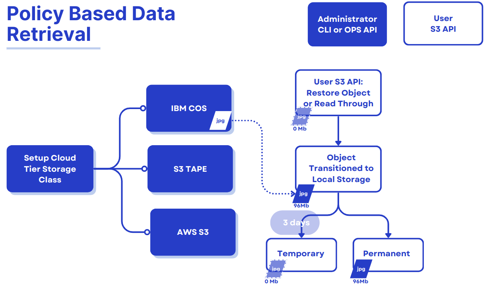

## Introducing Policy-Based Data Retrieval for Ceph

## Introduction and Feature Overview

In the first part of this series, we explored the fundamentals of Ceph Object
Storage and its policy-based archive to cloud/tape feature, which enables
seamless data migration to remote S3-compatible storage classes. This feature
is instrumental in offloading data to cost-efficient storage tiers, such as
cloud or tape-based systems. However, in the past, the process has been
unidirectional. Once objects are transitioned, retrieving them requires
direct access to the cloud provider’s S3 endpoint. This limitation has
introduced operational challenges, particularly when accessing archived
or cold-tier data.

We are introducing policy-based data retrieval in the Ceph Object Storage
ecosystem to address these gaps. This enhancement empowers administrators
and operations teams to retrieve objects transitioned to cloud or tape
tiers directly back into the Ceph cluster, aligning with operational
efficiency and data accessibility needs.

### Why This Matters

Policy-based data retrieval transforms the usability of cloud-transitioned
objects in Ceph. Whether the data resides in cost-efficient tape archives
or high-latency/low-cost cloud tiers, this feature ensures that users can
seamlessly access and manage their objects without relying on the external
provider's S3 endpoints. This capability simplifies workflows and enhances
compliance with operational policies and data lifecycle requirements.

## Policy-Based Data Retrieval

This new functionality offers a dual approach to retrieving transitioned
objects to remote cloud/tape S3-compatible endpoints:

1. S3 RestoreObject API Implementation: Similar to the AWS S3 `RestoreObject`
API, this feature allows users to retrieve objects manually using the
S3 `RestoreObject` API. The object restore operation can be permanent
or temporary based on the retention period specified in
the `RestoreObject` API Call.

2. Read-Through Mode: By introducing a configurable `--allow-read-through`
capability Ceph can serve read requests for transitioned objects in the
cloud tier storage class configuration. Upon receiving a `GET` request,
the system asynchronously retrieves the object from the cloud tier,
stores it locally, and serves the data to the user. This eliminates
the `InvalidObjectState` error previously encountered for
cloud-transitioned objects.



### S3 RestoreObject Temporary Restore

The restored data is treated as temporary and will exist in the Ceph cluster
only for the duration specified during the restore request. Once the specified
period expires, the restored data will be deleted, and the object will revert
to a stub, preserving metadata and cloud transition configurations.

#### Lifecycle Transition Rules Are Skipped

During the temporary restore period, the object is exempted from lifecycle
rules that might otherwise move it to a different tier or delete it.
This ensures uninterrupted access until the expiry date.

#### Default Storage Class for Restored Data

Restored objects are, by default, written to the `STANDARD` storage class within
the Ceph cluster. However, for temporary objects, the `x-amz-storage-class`
header will still return the original cloud-tier storage class  This is in line
with AWS Glacier semantics, where restored objects’ storage class remains the same.

### S3 RestoreObject API walkthrough

We are uploading an object called `2gb` to the on-prem Ceph cluster using a
bucket called `databucket`. In part one of this blog post series, we
configured `databucket` with a lifecycle policy that will tier/archive data into
IBM COS after 30 days. Wee set up the AWS CLI client with a profile
called `tiering` to interact with Ceph Object Gateway S3 API endpoint.

```
aws --profile tiering --endpoint https://s3.cephlabs.com s3 cp 2gb s3://databucket upload: ./2gb to s3://databucket/2gb
```

We can check the size of the uploaded object in the `STANDARD` storage class
within our on-prem Ceph cluster:

```
aws --profile tiering --endpoint https://s3.cephlabs.com s3api head-object --bucket databucket --key 2gb
{
    "AcceptRanges": "bytes",
    "LastModified": "2024-11-26T21:31:05+00:00",
    "ContentLength": 2000000000,
    "ETag": "\"b459c232bfa8e920971972d508d82443-60\"",
    "ContentType": "binary/octet-stream",
    "Metadata": {},
    "PartsCount": 60
}
```

After 30 days, the lifecycle transition kicks in, and the object is transitioned
to the cloud tier.  First, as an admin, we check with the `radosgw-admin` command
that lifecycle (LC) processing has completed, and then as a user, we use the
S3 `HeadObject` API call to query the status of the object:

```
# radosgw-admin lc list| jq .[1]
{
  "bucket": ":databucket:fcabdf4a-86f2-452f-a13f-e0902685c655.310403.1",
  "shard": "lc.23",
  "started": "Tue, 26 Nov 2024 21:32:15 GMT",
  "status": "COMPLETE"
}

# aws --profile tiering --endpoint https://s3.cephlabs.com s3api  head-object --bucket databucket --key 2gb
{
    "AcceptRanges": "bytes",
    "LastModified": "2024-11-26T21:32:48+00:00",
    "ContentLength": 0,
    "ETag": "\"b459c232bfa8e920971972d508d82443-60\"",
    "ContentType": "binary/octet-stream",
    "Metadata": {},
    "StorageClass": "ibm-cos"
}
```

As an admin, we can use the radosgw-admin bucket stats command to check the
space used.  We can see that `rgw.main` is empty, and our `rgw.cloudtiered`
placement is the only one with data stored.

```
# radosgw-admin bucket stats --bucket databucket | jq .usage
{
  "rgw.main": {
    "size": 0,
    "size_actual": 0,
    "size_utilized": 0,
    "size_kb": 0,
    "size_kb_actual": 0,
    "size_kb_utilized": 0,
    "num_objects": 0
  },
  "rgw.multimeta": {
    "size": 0,
    "size_actual": 0,
    "size_utilized": 0,
    "size_kb": 0,
    "size_kb_actual": 0,
    "size_kb_utilized": 0,
    "num_objects": 0
  },
  "rgw.cloudtiered": {
    "size": 1604857600,
    "size_actual": 1604861952,
    "size_utilized": 1604857600,
    "size_kb": 1567244,
    "size_kb_actual": 1567248,
    "size_kb_utilized": 1567244,
    "num_objects": 3
  }
}
```

Now that the object has transitioned to our IBM COS Cloud tier let's restore it
to our Ceph Cluster using the S3 `RestoreObject` API call. In this example,
we'll request a temporary restore and set the expiration to three days:

```
# aws --profile tiering --endpoint https://s3.cephlabs.com s3api restore-object --bucket databucket --key 2gb --restore-request Days=3
```

If we attemp to get an object that is still being restored, we get an
error message like this:

```
# aws --profile tiering --endpoint https://s3.cephlabs.com s3api  get-object --bucket databucket --key 2gb /tmp/2gb
An error occurred (RequestTimeout) when calling the GetObject operation (reached max retries: 2): restore is still in progress
```

Using the S3 API, we can issue the `HeadObject` call and check the status of
the `Restore` attribute. In this example, we can see how our restore from
the IBM COS cloud endpoint to Ceph has finished, as `ongoing request`
is set to `false`. We have an expiry date for the object, as we used
the `RestoreObject` call with `--restore-request days=3O`. Other things to check
from this output: the occupied size of the object on our local Ceph cluster is
2GB, as expected once it is restored. Also, the storage class is `ibm-cos`. As
noted before for temporarily transitioned objects, even when using the `STANDARD`
Ceph RGW storage class, we still keep the `ibm-cos` storage class. Now that the
object has been restored, we  can issue an S3 `GET` API call from the client
to access the object. 

```
# aws --profile tiering --endpoint https://s3.cephlabs.com s3api  head-object --bucket databucket --key 2gb
{
    "AcceptRanges": "bytes",
    "Restore": "ongoing-request=\"false\", expiry-date=\"Thu, 28 Nov 2024 08:46:36 GMT\"",
    "LastModified": "2024-11-27T08:36:39+00:00",
    "ContentLength": 2000000000,
    "ETag": "\"\"0c4b59490637f76144bb9179d1f1db16-382\"\"",
    "ContentType": "binary/octet-stream",
    "Metadata": {},
    "StorageClass": "ibm-cos"
}

# aws --profile tiering --endpoint https://s3.cephlabs.com s3api  get-object --bucket databucket --key 2gb /tmp/2gb
```

### S3 RestoreObject Permanent Restore

Restored data in a permanent restore will remain in the Ceph cluster indefinitely,
making it accessible as a regular object. Unlike temporary restores, no expiration
period is defined, and the object will not revert to a stub after retrieval.
his is suitable for scenarios where long-term access to the object is required
without additional re-restoration steps.

#### Lifecycle Transition Rules Are Reinstated

Once permanently restored, the object is treated as a regular object within the Ceph cluster. All lifecycle rules (such as transition to cloud storage or expiration policies) are reapplied, and the restored object is fully integrated into the bucket's data lifecycle workflows.

#### Default Storage Class for Restored Data

By default, permanently restored objects are written to the `STANDARD` storage
class within the Ceph cluster. Unlike temporary restores, the
object’s `x-amz-storage-class` header will reflect the `STANDARD` storage
class, reflecting permanent residency in the cluster.

### S3 RestoreObject API permanent restore walkthrough

Restore the object permanently by not supplying a number of days
to the `--restore-request` argument:

```
# aws --profile tiering --endpoint https://s3.cephlabs.com s3api restore-object --bucket databucket --key hosts2 --restore-request {}
```

Verify the restored object: it's part of the `STANDARD` storage class, so the
object is a first-class citizen of the Ceph cluster, ready for integration
into broader operational workflows.

```
# aws --profile tiering --endpoint https://s3.cephlabs.com s3api head-object --bucket databucket --key hosts2
{
    "AcceptRanges": "bytes",
    "LastModified": "2024-11-27T08:28:55+00:00",
    "ContentLength": 304,
    "ETag": "\"01a72b8a9d073d6bcae565bd523a76c5\"",
    "ContentType": "binary/octet-stream",
    "Metadata": {},
    "StorageClass": "STANDARD"
}
```

### Object Read-Through(/GET) Mode

Objects accessed through the Read-Through Restore mechanism are restored
temporarily into the Ceph cluster. When a `GET` request is made for a
cloud-transitioned object, the system retrieves the object from the
cloud tier asynchronously. It makes it available for a specified duration
defined by the `read_through_restore_days` value. After the expiry period,
the restored data is deleted, and the object reverts to its stub state,
retaining metadata and transition configurations.

#### Object Read-Through (/GET) Mode walkthrough

Before enabling read-through mode if we try to access a stub object in our local
Ceph cluster that has been transitioned to a remote S3 endpoint via
policy-based archival, we will get the following error message:

```
# aws --profile tiering --endpoint https://s3.cephlabs.com s3api get-object --bucket databucket --key 2gb6 /tmp/2gb6
An error occurred (InvalidObjectState) when calling the GetObject operation: Read through is not enabled for this config
```

So let's first enable read-through mode. As a Ceph admin we need to modify our
current `ibm-cos` cloud-tier storage class and add two new tier-config
parameters: `--tier-config=allow_read_through=true,read_through_restore_days=3`:

```
# radosgw-admin zonegroup placement modify --rgw-zonegroup default \
  --placement-id default-placement --storage-class ibm-cos \
  --tier-config=allow_read_through=true,read_through_restore_days=3
```

If you have not performed  any previous multisite configuration, a default zone
and zonegroup are created for you, and changes to the zone/zonegroup will not
take effect until the Ceph Object Gateways (RGW daemons) are restarted. If you
have created a realm for multisite, the zone/zonegroup changes will take effect
once the changes are committed with `radosgw-admin period update --commit`.
In our case, it's enough to restart RGW daemons to apply changes:

```
# ceph orch restart rgw.default
Scheduled to restart rgw.default.ceph02.fvqogr on host 'ceph02'
Scheduled to restart rgw.default.ceph03.ypphif on host 'ceph03'
Scheduled to restart rgw.default.ceph04.qinihj on host 'ceph04'
Scheduled to restart rgw.default.ceph06.rktjon on host 'ceph06'
```

Once read-trough mode is enabled, and the RGW services are restated when a `GET`
request is made for an object in the cloud tier, the object will automatically
be restored to the Ceph cluster and served to the user.

```
# aws --profile tiering --endpoint https://s3.cephlabs.com s3api  get-object --bucket databucket --key 2gb6 /tmp/2gb6
{
    "AcceptRanges": "bytes",
    "Restore": "ongoing-request=\"false\", expiry-date=\"Thu, 28 Nov 2024 08:46:36 GMT\"",
    "LastModified": "2024-11-27T08:36:39+00:00",
    "ContentLength": 2000000000,
    "ETag": "\"\"0c4b59490637f76144bb9179d1f1db16-382\"\"",
    "ContentType": "binary/octet-stream",
    "Metadata": {},
    "StorageClass": "ibm-cos"
}
```

### Future Work

Ceph developers are improving the policy-based data retrieval feature with
upcoming enhancements that include:

* *Tape/DiamondBack Support*: Using the `RestoreObject` API to fetch objects
instead of `GET` from S3 endpoints that use the Glacier API
* *Admin Commands for Enhanced Monitoring*: Including restore status, listing
restored/in-progress objects, and re-triggering restore operations for failures
* *Compression and Encryption Support*: Restoring compressed or encrypted
objects effectively

## Conclusion

Policy-based data retrieval for Ceph Storage is a crucial addition that enhances
current object storage tiering capabilites. Feel free to share your thoughts or
questions about this new feature on
the [ceph-users mailing list](https://ceph.io/en/community/connect/). We’d
love to hear how you plan to use it or if you’d like to see any aspects
enhanced.

### Footnotes

For more information about RGW placement targets and storage classes,
visit [this page](https://docs.ceph.com/en/latest/radosgw/placement)

For a related take on directing data to multiple RGW storage classes,
view [this presentation](https://www.youtube.com/watch?v=m0Ok5X2I5Ps)

The authors would like to thank IBM for supporting the community by facilitating our time to create these posts.

