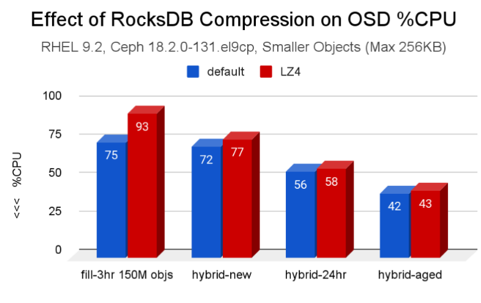
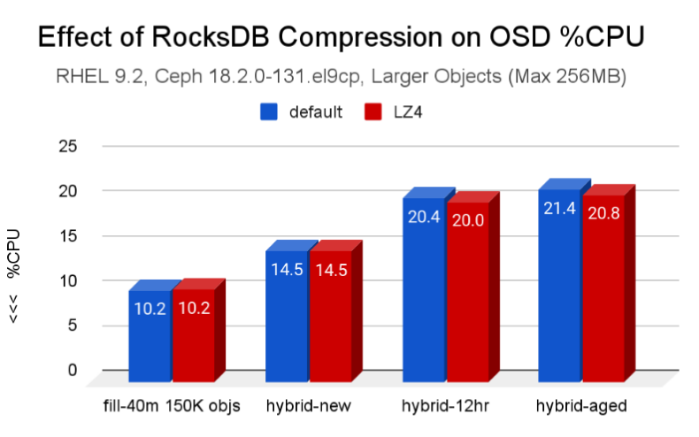
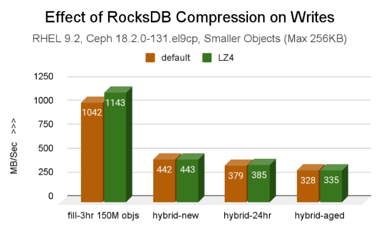
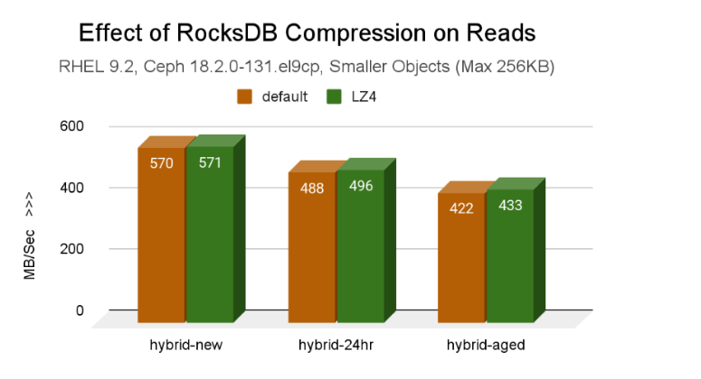
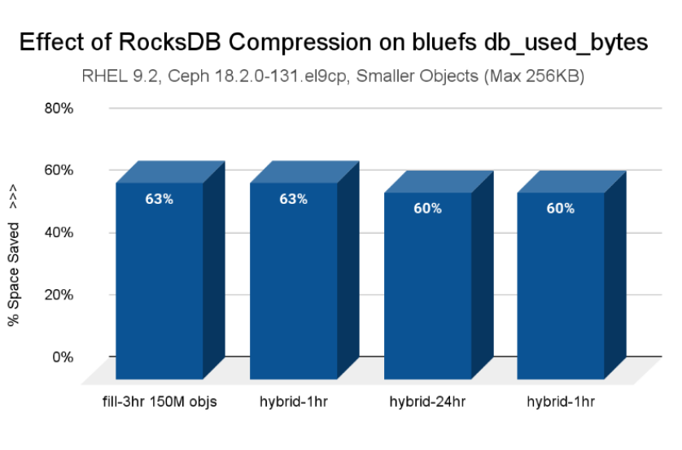
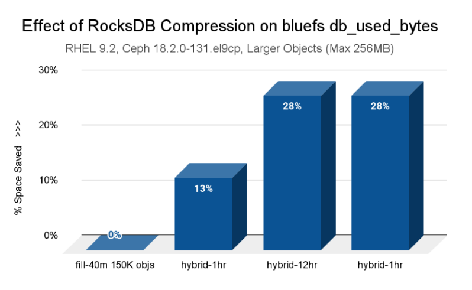
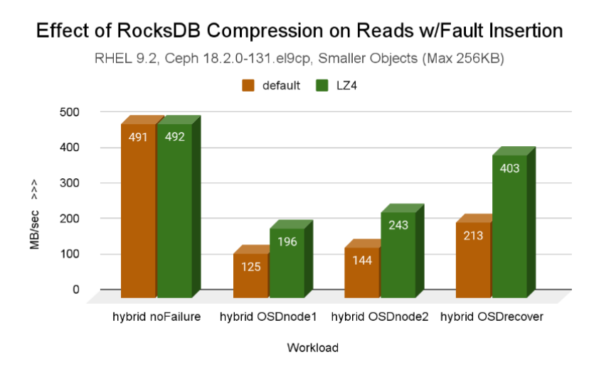
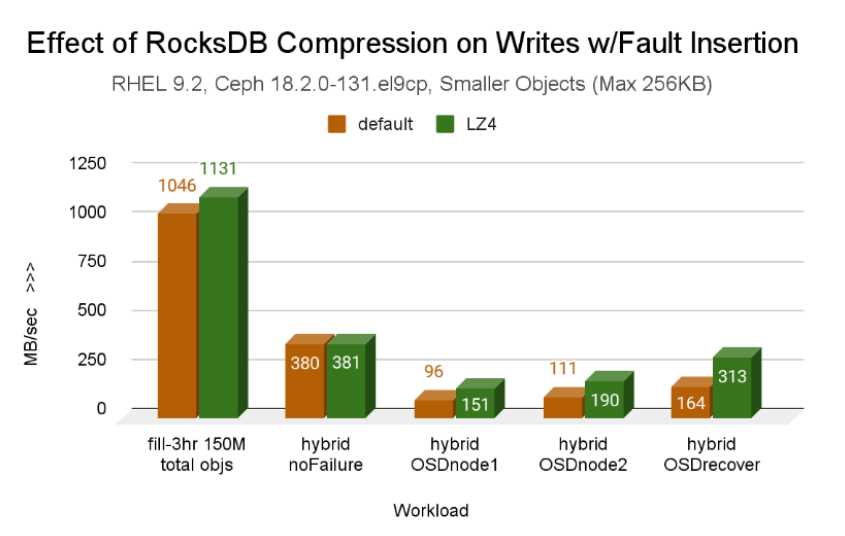
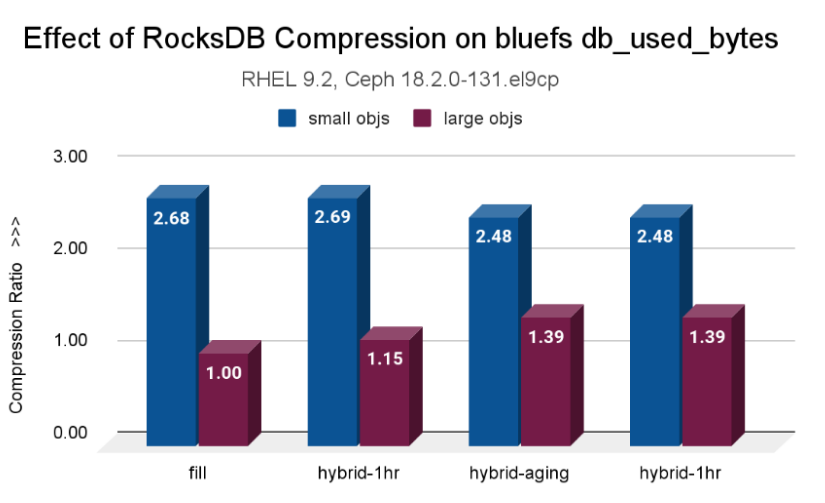

## Introduction

In the world of data storage, engineers and architects constantly face a
fundamental dilemma: the trade-off between performance and efficiency.
It’s a balancing act. When you want to save space, you typically enable
features like compression, but the common assumption is that this will
cost you performance, a CPU cycle tax that slows throughput.

But what if you could significantly reduce your metadata storage footprint
without slowing things down?

This search for an answer to this question started with research work
from Mark Nelson, who published
a [blog post](https://ceph.io/en/news/blog/2022/rocksdb-tuning-deep-dive) on [ceph.io](http://ceph.io)
that covers RocksDB tuning in depth, exploring RocksDB compression with
positive results. These promising results sparked a conversation on the
upstream GitHub about enabling compression by default; a link to the PR
is available [here](https://github.com/ceph/ceph/pull/53343).

To build on the previous investigation, the Ceph performance team ran tests on a
robust hardware configuration running IBM Storage Ceph 7.1 (Reef). The cluster
used the BlueStore OSDs for an erasure-coded (EC 4+2) pool, with a hybrid OSD
storage setup: HDDs for object data and fast NVMe drives for the BlueStore WAL+DB.

To understand the test, it's helpful to know what the WAL+DB is. In modern Ceph,
the BlueStore storage engine manages all data on the OSDs (physical devices).
To do this, it must maintain a vast catalog of internal metadata: think of it
as a high-speed index that quickly locates every piece of data.

RocksDB, a high-performance key-value database, manages this critical index. In
our hybrid cluster, the RocksDB database runs on the fast NVMe deviceses, while
the actual object data resides on the slower HDDs.

Because this metadata can grow very large, RocksDB's efficiency, how much space
it consumes on those expensive NVMe drives, is a critical factor in the cluster's
overall cost and performance. Our test, therefore, focuses on a simple,
high-stakes question:

**Can we compress this metadata to save space *without* paying a performance penalty?**

## Executive Overview

The results were not just positive; they were counterintuitive, revealing a powerful
opportunity for optimization that comes with virtually no downside.

The results confirm that using RocksDB compression has no detrimental effect on
either throughput or resource consumption in Ceph, while providing significant
savings in DB space (compression ratio), especially for smaller objects. As a
result of the tests, RocksDB encryption is now enabled by default beginning with
the Squid release.

## Test Environment and Details

All tests were run against the Ceph Gateway (RGW) to simulate a typical
Object Storage workload.

Two different sets of object sizes were used in testing. Each workload leveraged
five clients and a range of fixed sizes (one object size per bucket, repeated
across the total bucket count), as listed below.

### Testing Configuration

* Smaller
    * 1 KiB, 4 KiB, 8 KiB, 64 KiB, 256 KiB
    * 100K objects, 300 buckets, five clients (150M total objectss)
    * Fill Workload (~8%) - 3hr
    * Hybrid workload (45% reads, 35% writes, 15% stats, 5% deletes)
        
* Larger
    * 1 MiB, 4 MiB, 8 MiB, 64 MiB, 256 MiB
    * 300 objects, 100 buckets, five clients (150K total objects)
    * Fill Workload (~7%) - 40m
    * Hybrid workload (45% reads, 35% writes, 15% stats, 5% deletes)
        

### Hardware Used

Two identical clusters, each with

* 3x Monitor / Manager nodes
    * Dell R630
    * 2x E5-2683 v3 (28 total cores, 56 threads)
    * 128 GB RAM
* 8x OSD / RGW nodes
    * Supermicro 6048R
    * 2x Intel E5-2660 v4 (28 total cores, 56 threads)
    * 256 GB RAM
       
* 192x OSDs (BluesStore): 24 2TB HDD and 2x 800GB NVMe SSD for WAL/DB per node
* Pool: `site{1,2}.rgw.buckets.data` EC 4+2, `pg_num=4096`

## The "Free Lunch" is Real: Significant Space Savings at Zero Performance Cost

The primary and most surprising finding from our tests is that enabling RocksDB
compression had no negative impact on performance. The specific algorithm used
was LZ4, a lightweight solution known for its high speed. Our analysis suggests
that modern CPUs are so efficient at processing algorithms like LZ4 that the
overhead is negligible, particularly when compression operations occur on the
high-speed NVMe devices where the RocksDB database resides.

Across a variety of hybrid workloads (45% reads, 35% writes, 15% stats,
and 5% deletes), we observed no detrimental effect on throughput or CPU resource
consumption compared to running the same workloads without compression. This
effectively eliminates the traditional trade-off.

*Graph 1. CPU Consumption for Small Objects*



*Graph 2. CPU Consumption for Large Objects*



*Graph 3. Throughput for Small Object Writes*



*Graph 4. Throughput for Small Object Reads*



The results confirm that using RocksDB compression has no detrimental
effect on either throughput or resource consumption in Ceph, while
providing significant savings in DB space (compression ratio),
especially for smaller objects. This allows a smaller WAL+DB offload
partition for each OSD, or conversely helps avoid spillover of
RocksDB level data onto the BlueStore _slow_ device.

## Small Objects, Massive Gains: A Game-Changer for Object Storage Workloads.

While compression proved beneficial across the board, its impact was most
dramatic on small-object workloads. Our tests, which used object sizes
ranging from 1 KiB to 256 KiB, showed a remarkable reduction in the
storage required for RocksDB metadata. In a BlueStore configuration,
Ceph's internal metadata is managed by a RocksDB database running on
top of the BlueFS file system on a fast storage device, in
our case, an NVMe SSD.

The single most impactful data point we recorded was this: with compression
enabled, the `bluefs db_used_bytes` workload for small objects required 2.68
times less storage during the cluster fill. This is a massive efficiency gain.
For any organization whose workload involves storing millions or even billions
of tiny objects, the metadata overhead can become a significant storage burden.
This feature directly and powerfully addresses that specific pain point by
compressing the metadata database on the fast offload device, not object data
on HDDs.

This is particularly critical for Object Storage (RGW) workloads. When using
the Ceph Object Gateway (RGW), all rich metadata associated with an object,
such as its name, size, ACLs, and custom user tags, is stored in RocksDB instances
spread across the OSDs that comprise the index pool.
Furthermore, the bucket index, which lists all objects within a bucket, is
maintained as omap entries in this same database.

For clusters with millions or billions of small objects, this metadata and
index data can swell to consume terabytes of space, often becoming the primary
capacity bottleneck on the expensive, high-speed NVMe drives. Compressing
RocksDB directly compresses this RGW metadata, providing massive and immediate
relief on that fast tier.



## It's Not Just for Small Objects: Large Objects Also See a Clear Benefit

The positive effects were not limited to small objects. Our tests on large-object
workloads, ranging from 1 MiB to 256 MiB, also showed clear benefits. While the
source report highlights the most dramatic space savings for small objects, it
explicitly notes that the positive effect across both sets of object sizes is
evident, making compression a clear win for large-object workloads as well.



Furthermore, our test plan included stressful OSD failure scenarios to measure
behavior under duress. The overall conclusion of "no detrimental effect" on
performance or resource consumption held even during these fault and recovery
operations. This implies that RocksDB compression is not just efficient but
also a stable and robust feature under pressure.

*Graph 5. Throughput for Small Object Reads During Failure*



*Graph 6. Throughput for Small Object Writes During Failure*



## Conclusion: A Feature That Should Be Enabled By Default

Based on this comprehensive testing, RocksDB compression in a Ceph environment
is a low-risk, high-reward feature. It breaks the old rule that says efficiency
must come at the expense of performance. The evidence points to a clear win:
substantial storage savings on the metadata layer, with no measurable
trade-off in throughput or CPU usage.



This led to a simple conclusion: given the potential for substantial space
savings with no performance downside, the decision was to enable RocksDB LZ4
compression by default in the Squid release.

```bash
# ceph version
ceph version 19.2.1-222.el9cp (f2cd71cc2f7b46709c2351134ac89ea3e9f609b6) squid (stable)

# ceph config get osd bluestore_rocksdb_options
compression=kLZ4Compression,max_write_buffer_number=64,min_write_buffer_number_to_merge=6,compaction_style=kCompactionStyleLevel,write_buffer_size=16777216,max_background_jobs=4,level0_file_num_compaction_trigger=8,max_bytes_for_level_base=1073741824,max_bytes_for_level_multiplier=8,compaction_readahead_size=2MB,max_total_wal_size=1073741824,writable_file_max_buffer_size=0
```


The authors would like to thank IBM for supporting the community with our time to create these posts.
