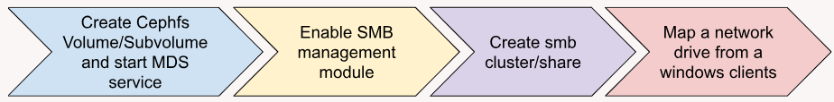

## SMB Meets Squid: Introducing the New Ceph SMB Manager Module for SMB Service Management in Ceph

### Introduction

SMB (Server Message Block) is a widely-used network protocol that facilitates the
sharing of files, printers, and other resources across a network. To seamlessly
integrate SMB services within a Ceph environment, Ceph 8.0 introduces the
powerful SMB Manager module, which enables users to deploy, manage, and control
Samba services for SMB access to CephFS. This module offers a user-friendly
interface for managing clusters of Samba services and SMB shares, with the
flexibility to choose between two management methods: imperative and
declarative. By enabling the SMB Manager module using the
command ``ceph mgr module enable smb``, administrators can efficiently
streamline their SMB service operations, whether through the command-line
or via orchestration with YAML or JSON resource descriptions. With
the new SMB Manager module, Ceph admins can effortlessly extend file services,
providing robust SMB access to CephFS while enjoying enhanced control and scalability.

### Managing SMB Cluster and Shares

Admins can interact with the Ceph Manager SMB module using following methods:

* Imperative Method: Ceph commands to interact with the Ceph Manager SMB module.

* Declarative Method: Resources specification in YAML or JSON format.

### Simple Ceph Squid with SMB Configuration Workflow



#### Imperative Method

*Create CephFS Volume/Subvolume*

```
# ceph fs volume create cephfs
# ceph fs subvolumegroup create cephfs smb
# ceph fs subvolume create cephfs sv1 --group-name=smb --mode=0777
# ceph fs subvolume create cephfs sv2 --group-name=smb --mode=0777
```
*Enable SMB Management Module*

```
# ceph mgr module enable smb
```

*Creating SMB Cluster/Share*
```
# ceph smb cluster create smb1 user --define-user-pass=user1%passwd
# ceph smb share create smb1 share1 cephfs / --subvolume=smb/sv1
```

*Map a network drive from MS Windows clients*

#### Declarative Method

*Create CephFS volume/subvolume*

```
# ceph fs volume create cephfs
# ceph fs subvolumegroup create cephfs smb
# ceph fs subvolume create cephfs sv1 --group-name=smb --mode=0777
# ceph fs subvolume create cephfs sv2 --group-name=smb --mode=0777
```

*Enable SMB Management Module*

```
# ceph mgr module enable smb
```

*Creating SMB Cluster/Share*

```
# ceph smb apply -i - <<'EOF'
# --- Begin Embedded YAML
- resource_type: ceph.smb.cluster
  cluster_id: smb1
  auth_mode: user
  user_group_settings:
    - {source_type: resource, ref: ug1}
  placement:
    count: 1
- resource_type: ceph.smb.usersgroups
  users_groups_id: ug1
  values:
    users:
      - {name: user1, password: passwd}
      - {name: user2, password: passwd}
    groups: []
- resource_type: ceph.smb.share
  cluster_id: smb1
  share_id: share1
  cephfs:
    volume: cephfs
    subvolumegroup: smb
    subvolume: sv1
    path: /
- resource_type: ceph.smb.share
  cluster_id: smb1
  share_id: share2
  cephfs:
    volume: cephfs
    subvolumegroup: smb
    subvolume: sv2
    path: /
# --- End Embedded YAML
EOF
```

*Map a network drive from MS Windows clients*

### Basic SMB Manager Module CLI Commands

#### Creating an SMB Cluster

```
# ceph smb cluster create <cluster_id> {user} [--domain-realm=<domain_realm>] \
            [--domain-join-user-pass=<domain_join_user_pass>] \
	    [--define-user-pass=<define_user_pass>] [--custom-dns=<custom_dns>]
```

Example: 

##### Auth_Mode:User

```
# ceph smb cluster create smb1 user --define_user_pass user1%passwd --placement label:smb --clustering default
```

##### Auth_Mode: AD

```
# ceph smb cluster create smb1 active-directory --domain_realm samba.qe --domain_join_user_pass Administrator%Redhat@123 --custom_dns 10.70.44.153 --placement label:smb --clustering default
```

#### Creating an SMB Cluster with the Declarative method

```
# ceph smb apply -i [--format <value>]
```

Example:

```
# ceph smb apply -i resources.yaml
```

#### Creating SMB Share

```
# ceph smb share create <cluster_id> <share_id> <cephfs_volume> <path> [<share_name>] [<subvolume>] [--readonly] [--format]
```

Example:

```
# ceph smb share create smb1 share1 cephfs / --subvolume=smb/sv1
```

Listng SMB Shares

```
#  ceph smb share ls <cluster_id> [--format <value>]
```

Example:

```
# ceph smb share ls smb1
```

#### Viewing SMB Cluster Details

```
#  ceph smb show [<resource_names>]
```

Example:

```
# ceph smb show ceph.smb.cluster.smb1
```

#### Deleting SMB Share

```
# ceph smb share rm <cluster_id> <share_id>
```

Example:

```
# ceph smb share rm smb1 share1
```

#### Deleting SMB Cluster

```
# ceph smb cluster rm <cluster_id>
```

Example:

```
# ceph smb share rm smb1
```

### Conclusion

The Ceph SMB Manager module in Ceph Squid brings an innovative and efficient way
to manage SMB services for CephFS file systems. Whether through imperative or
declarative methods, users can easily create, manage, and control SMB clusters
and shares. This integration simplifies the setup of Samba services, enhances
scalability, and offers greater flexibility for administrators.With the ability
to manage SMB access to CephFS seamlessly, users can now have a
streamlined process for providing secure and scalable file services.

The authors would like to thank IBM for supporting the community by facilitating our time to create these posts.
