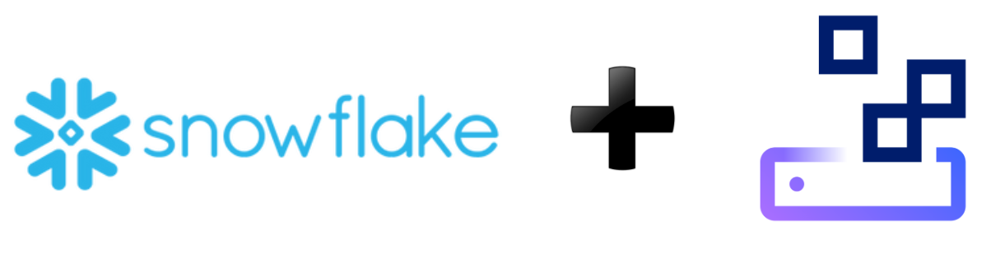
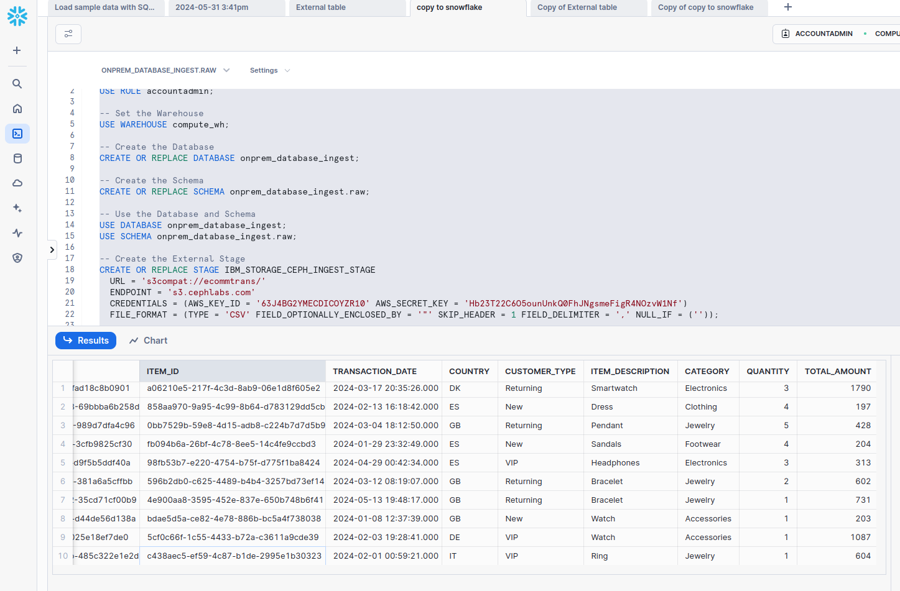
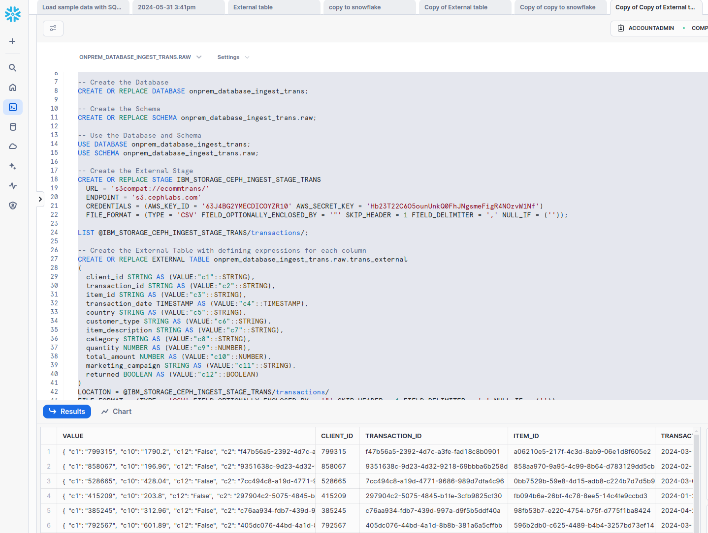

## Ceph Snowflake Integration



### Data Challenges with Cloud and On-prem Environments

Businesses integrate datasets from multiple sources to derive valuable business
insights. Conventional analytics infrastructures, often reliant on specialized
hardware, can lead to data silos, lack scalability, and result in escalating
costs over time.

The rise of modern analytics architectures in public cloud-based SaaS environments has
helped overcome many limitations, allowing for efficient operations and the
ability to adapt dynamically to changing workload demands without compromising
performance.

However, despite these advancements, not all organizations can realistically
shift entirely to a cloud-based environment. Several crucial reasons exist
for retaining data on-premises, such as regulatory compliance, security
concerns, latency, and cost considerations.

Consequently, many organizations are exploring the benefits of hybrid cloud
architectures, making their datasets from on-premises object-based data lake
environments available to Cloud SaaS data platforms including Snowflake.

### A hybrid cloud solution with Snowflake and Ceph

Snowflake is a cloud-based data platform that enhances data-driven insights by
allowing governed access to vast amounts of data for collaboration and analysis.
Thanks to its native support for the S3 API, it can unify diverse data sources
and integrate seamlessly with on-premises solutions including Ceph. This
integration enables Snowflake to leverage Ceph's robust and scalable storage
capabilities, effectively bringing cloud data warehouse functionalities into
the on-premises environment while ensuring comprehensive data control and security.

Ceph is open-source, software-defined, runs on industry-standard hardware, and
has best-in-class coverage of the lingua franca of object storage: the AWS S3 API.
Ceph was designed from the ground up as an object store, contrasting with
approaches that bolt S3 API servers onto a distributed file system. With Ceph,
data placement is by algorithm instead of by lookup. This allows Ceph to scale
well into the billions of objects, even on modestly sized clusters. Data stored
in Ceph is protected with efficient erasure coding, with in-flight and at-rest
checksums, encryption, and robust access control that thoughtfully integrates
with enterprise identity systems. Ceph is the perfect complement to Snowflake
for establishing a security-first hybrid cloud data lake environment. 

[Ceph is a supported S3 compatible storage solution for Snowflake](https://docs.snowflake.com/en/user-guide/data-load-s3-compatible-storage#vendor-support-for-s3-compatible-storage).
Using Ceph's S3-compatible APIs, enterprises can configure Snowflake to access
data stored on Ceph through external S3 stages or external S3 tables, enabling
efficient queries without requiring data migration to and from the cloud.

### Ceph Object Storage: An ideal platform for data lakes

Ceph Object Storage is the perfect platform for creating data lakes or lakehouses with key advantages:

* Cost-effectiveness: Ceph utilizes commodity hardware and open-source software
  to reduce upfront infrastructure costs and enable incremental and evolutionary
  upgrades and expansion over time without forklifts or downtime.

* High scalability: Ceph allows horizontal scaling to accommodate large volumes
  of growing data in a data lake or lakehouse.

* High flexibility: Ceph can handle various data types, including structured,
  semi-structured, and unstructured data, including text, images, video,
  and sensor data, making it versatile and appropriate for data lakes.

* High availability: Ceph is designed to provide durability and reliability for
  information stored in a data lake or lake house. Data is always accessible
  despite hardware failures or disruptions in the network.  Ceph offers data
  replication across multiple geographic locations, providing redundancy and
  fault tolerance to prevent data loss.

* High performance: Ceph enables parallel data access and processing through
  integration with data analytics frameworks to enable high throughput and low
  latency for data ingestion and processing within a data lake or lakehouse.
  Ceph Object also provides a cache data accelerator (D3N) and query pushdown
  with S3 Select.

* Data governance: Ceph provides efficient management of metadata to enforce data
  governance policies, track data lineage, monitor data usage, and provide
  valuable information about the data stored in the data lake, including format
  and data source.

* Security: Ceph has a broad security feature set: encryption at rest and over
  the wire, external identity integration, Secure Token Service, IAM
  roles/policies, per-object granular authorization, Object Lock, versioning,
  and MFA delete. 
 
### Example of Connecting Snowflake with data residing on S3 on-prem Ceph

The most common way of accessing external S3 object storage from Snowflake is to
create an [External Stage](https://docs.snowflake.com/en/user-guide/data-load-s3-compatible-storage#creating-an-external-stage-for-s3-compatible-storage)
and then use the Stage to copy the data into Snowflake or access it directly using
n [External Table](https://docs.snowflake.com/en/user-guide/data-load-s3-compatible-storage#extending-your-data-lake-using-external-tables).

Next, we will provide two simplistic examples for reference using an on-prem Ceph cluster::

Our Ceph cluster has an S3 Object Gateway configured at ``s3.cephlabs.blue``
and we have a bucket named ``ecommtrans`` containing a CSV-formatted
file named ``transactions``.

```
$ aws s3 ls s3://ecommtrans/transactions/                                       
2024-06-04 11:33:54   13096729 transaction_data_20240604112945.csv
```

The CSV file has the following format:

```
client_id,transaction_id,item_id,transaction_date,country,customer_type,item_description,category,quantity,total_amount,marketing_campaign,returned
799315,f47b56a5-2392-4d7c-a3fe-fad18c8b0901,a06210e5-217f-4c3d-8ab9-06e1d8f605e2,2024-03-17 20:35:26,DK,Returning,Smartwatch,Electronics,3,1790.2,,False
858067,9351638c-9d23-4d32-9218-69bbba6b258d,858aa970-9a95-4c99-8b64-d783129dd5cb,2024-02-13 16:18:42,ES,New,Dress,Clothing,4,196.96,,False
528665,7cc494c8-a19d-4771-9686-989d7dfa4c96,0bb7529b-59e8-4d15-adb8-c224b7d7d5b9,2024-03-04 
```

#### Example 1. Copy data from an S3 External Stage provided by Ceph

In the Snowflake UI, we open a new SQL worksheet and run the following SQL code:

```
CREATE OR REPLACE TABLE onprem_database_ingest.raw.transactions
(
  client_id VARCHAR(16777216),
  transaction_id VARCHAR(16777216),
  item_id VARCHAR(16777216),
  transaction_date TIMESTAMP_NTZ(9),
  country VARCHAR(16777216),
  customer_type VARCHAR(16777216),
  item_description VARCHAR(16777216),
  category VARCHAR(16777216),
  quantity NUMBER(38,0),
  total_amount NUMBER(38,0),
  marketing_campaign VARCHAR(16777216),
  returned BOOLEAN
);

LIST @CEPH_INGEST_STAGE/transactions/;

---> copy the Menu file into the Menu table

COPY INTO onprem_database_ingest.raw.transactions
FROM @CEPH_INGEST_STAGE/transactions/;

-- Sample query to verify the setup

SELECT * FROM onprem_database_ingest.raw.transactions
LIMIT 10;~
```




#### Example 2. Create an external table from an S3 External Stage provided by Ceph

In the Snowflake UI, we open a new SQL worksheet and run the following SQL code:

```
transactions/;

-- Create the External Table with defining expressions for each column

CREATE OR REPLACE EXTERNAL TABLE onprem_database_ingest_trans.raw.trans_external
(
  client_id STRING AS (VALUE:"c1"::STRING),
  transaction_id STRING AS (VALUE:"c2"::STRING),
  item_id STRING AS (VALUE:"c3"::STRING),
  transaction_date TIMESTAMP AS (VALUE:"c4"::TIMESTAMP),
  country STRING AS (VALUE:"c5"::STRING),
  customer_type STRING AS (VALUE:"c6"::STRING),
  item_description STRING AS (VALUE:"c7"::STRING),
  category STRING AS (VALUE:"c8"::STRING),
  quantity NUMBER AS (VALUE:"c9"::NUMBER),
  total_amount NUMBER AS (VALUE:"c10"::NUMBER),
  marketing_campaign STRING AS (VALUE:"c11"::STRING),
  returned BOOLEAN AS (VALUE:"c12"::BOOLEAN)
)

LOCATION = @CEPH_INGEST_STAGE_TRANS/transactions/
FILE_FORMAT = (TYPE = 'CSV' FIELD_OPTIONALLY_ENCLOSED_BY = '"' SKIP_HEADER = 1 FIELD_DELIMITER = ',' NULL_IF = (''))
REFRESH_ON_CREATE = FALSE
AUTO_REFRESH = FALSE
PATTERN = '.*.csv';

-- Refresh the metadata for the external table

ALTER EXTERNAL TABLE onprem_database_ingest_trans.raw.trans_external REFRESH;

-- Sample query to verify the setup

SELECT * FROM onprem_database_ingest_trans.raw.trans_external

LIMIT 10;~
```



### Closing comments

Hybrid cloud architectures are increasingly popular, incorporating on-premises
solutions including Ceph and cloud-based SaaS platforms including Snowflake.
Ceph, which is now supported by Snowflake as an S3-compatible store, makes it
possible to access on-premises data lake datasets, enhancing Snowflake's data
warehousing capabilities. This integration establishes a secure, scalable,
cost-effective hybrid data lake environment.


The authors would like to thank IBM for supporting the community with our time to create these posts.
