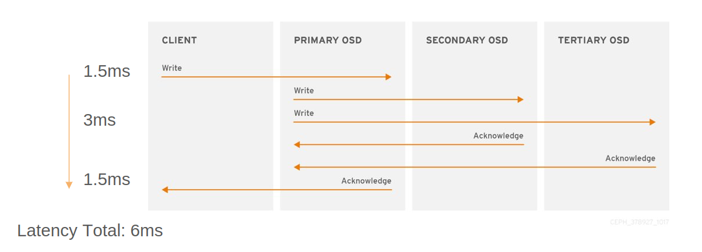
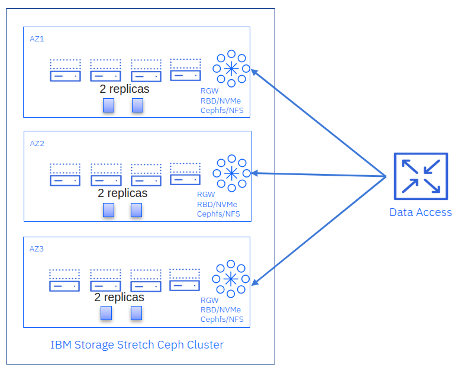

## Ceph Stretch Clusters Part 1: Key Concepts

## Introduction

When considering replication, disaster recovery, and backup + restore, we choose
from multiple strategies with varying SLAs for data and application recovery.
Key factors include the Recovery Time Objective (RTO) and Recovery Point
Objective (RPO). Synchronous replication provides the lowest RPO, which means
zero data loss. Ceph can implement synchronous replication among
sites by stretching the Ceph cluster across multiple data centers.

Asynchronous replication inherently implies a non-zero RPO. With Ceph, async
multisite replication involves replicating data to another Ceph cluster. Each
Ceph storage access method (object, block, and file) has its own asynchronous
replication method implemented at the service level.

**Asynchronous Replication**: Replication occurs at the service level (RBD,
CephFS, or RGW), typically across fully independent Ceph clusters.

**Synchronous Replication (“Stretch Cluster”)**: Replication is
performed at the RADOS (cluster) layer, so writes must be completed
in every site before an acknowledgment is sent to clients.

Both methods have distinct advantages and disadvantages, as well as different
performance profiles and recovery considerations. Before discussing Ceph
stretch clusters in detail, here is an overview of these replication modes.

## Replication Options in Ceph

### Asynchronous Replication

Asynchronous replication is driven at the service layer. Each site provisions
a complete, standalone Ceph cluster and maintains independent copies of the data.

* **RGW Multisite**: Each site deploys one or more independent RGW zones. Changes
are propagated asynchronously between sites using the RGW multisite replication
framework. This replication is not journal-based. Instead, it relies on
log-based replication, where each RGW tracks changes through a log of
operations (sync logs), and these logs are replayed at peer sites to replicate
data.

* **RBD Mirroring**: Block data is mirrored either using a journal-based approach
(as with Openstack) or a snapshot-based approach (as with ODF/OCP), depending on
your requirements for performance, crash consistency, and scheduling.

* **CephFS Snapshot Mirroring** (in active development): Uses snapshots to
replicate file data at configurable intervals.

Asynchronous replication is well-suited for architectures with significant
network latency between locations. This approach allows applications to
continue operating without waiting for remote writes to complete. However, it is
important to note that this strategy inherently informs a non-zero Recovery
Point Objective (RPO), meaning there will be some delay before remote sites
are consistent with the primary. As a result, a site failure could lead to
loss of recently written data that is still in flight.

To explore Ceph's asynchronous replication, please check out our prior
blog posts: [Object storage Multisite Replication](https://ceph.io/en/news/blog/2025/rgw-multisite-replication_part1/).

### Synchronous Replication: Stretch Cluster

A stretch cluster is a single Ceph cluster deployed across multiple data centers
or availability zones. Write operations return to clients only once persisted
at all sites, or enough sites to meet each logical pool's replication
schema requirement. This provides:

* **RPO = 0**: No data loss if one site fails since every client write is
synchronously replicated and will be replayed when a failed site comes
back online.

* **Single cluster management**: No special client-side replication
configuration is needed: regular Ceph tools and workflows are applied.

A stretch cluster has strict networking requirements: a maximum 10ms RTT between
sites. Because writes to OSDs must travel between sites before an acknowledgment
is returned to the client, latency is critical. Network instability,
insufficient bandwidth, and latency spikes can degrade performance and risk
data integrity.

## Ceph Stretch clusters

### Introduction

Ceph Stretch Clusters provide benefits that make them a good option for critical
applications that require maximum uptime and resilience:

* **Fault Tolerance**: a stretch cluster will handle the failure of an entire
site transparently without impacting client operations. It can sustain a double
site failure without data loss.

* **Strong Consistency,** In a three-site setup, data uploaded online immediately
becomes visible and accessible to all AZs/sites. Strong consistency enables
clients at each site to always see the latest data.

* **Simple setup and day two operations:** One of the best features of
stretch clusters is straightforward operation. They are like any standard,
single-site cluster in most ways. Also, no manual intervention is required
to recover from a site failure, making them easy to manage and deploy.

* Stretch clusters **can be complemented with multisite asynchronous
replication** for cross-region data replication.

It is however essential to consider the caveats of Ceph stretch clusters:

* **Networking is crucial**: Inter-site networking shortcomings including
flapping, latency spikes and insufficient bandwidth impact performance and data integrity.

* **Performance**: Write operation latency is increased by the RTT of the two
most distant sites. When deploying across three sites pool data protection strategy
should be configured for replication with a ``size`` value ``6``, which means write
amplification of six OSD operations per client write. We must set
workload expectations accordingly. For example, a high IOPS, low-latency OLTP
database workload likely will struggle if storing data a stretch cluster.

* **Replica 6 (or Replica 4 two-site stretch) is recommended for reliability**:
We keep six (or four) copies of data. Erasure Coding is not at present an option
at the moment due to performance impact, intersite network demands, and the nuances
of ensuring simultaneous strong consistency and high availability. This in turn
means that the total available usable capacity for a given amount of raw underlying
storage must be carefully considered relative to a conventional single-site cluster.

* **Single Cluster across all sites**: If data is  damaged due to a software or
user issue including deletion on the single stretch cluster, the data seen by all
sites will be affected

### Networking: The Foundation of a Stretch Cluster

A stretch cluster depends on robust networking to operate optimally. A suboptimal
network configuration will impact performance and data integrity.

* **Equal Latency Across Sites:** The sites are connected through a highly
available L2 or L3 network infrastructure, where the latency among the
data availability zones/sites is similar. The RTT is ideally less than 10ms.
Inconsistent network latency (jitter) will degrade cluster performance.

* **Reliable L2/L3 network with minimal latency spikes**: Inter-site
path diversity with redundancy: full mesh or redundant transit.

* **Sufficient Bandwidth**: The network should have adequate bandwidth to
handle replication, client request, and recovery traffic. Network bandwidth
must scale with cluster growth: as we add nodes, we must also increase
inter-site network throughput to maintain performance.

* **Networking QoS is beneficial**: Without QoS, a noisy neighbor sending or
receiving substantial inter-site traffic can degrade cluster stability.

* **Global Load Balancer**: Object storage that uses S3 RESTful endpoints
needs a GLB to redirect client requests in case of a site failure.

* **Performance**: Each client write will experience at least the latency the
of the highest RTT between sites. The following diagram shows operation
latency for a three-site stretch cluster with a 1.5ms RTT between sites,
with a client and primary OSD at different sites:

### Three Site Stretch Cluster

Each data center (or availability zone) houses a share of the OSDs in a
three-site stretch cluster. Two data replicas are stored in each zone, so
the CRUSH pool's ``size`` parameter is ``6``. This allows the cluster to
serve client operations with zero data unavailability or loss when an entire
site goes offline. Some highlights are below:

* **No Tiebreaker**: Because there are three full data sites (OSDs in all
sites), the Monitors can form quorum with any two sites able to reach
each other.

* **Enhanced Resilience**: Survives a complete site failure plus one additional
OSD or node failure at surviving sites.

* **Network Requirements**: L3 routing is recommended, and at most 10ms RTT is
required among the three sites.

To delve deeply into Ceph 3-site stretch configurations, check out this excellent
[Cephalocon video](https://www.youtube.com/watch?v=xKO688j6eYs) from Kamoltat
Sirivadhna.

### Two-Site Stretch Cluster with Tie-Breaker

For deployments where only two data centers have low-latency connectivity, place
OSDs in those two data centers with the third site elsewhere hosting
a tie-breaker Monitor. This may even be a VM at a cloud provider. This ensures
that the cluster maintains a quorum when a single site fails.

* **Two low latency main sites**: each hosting half of the total OSD capacity.

* **One tie-breaker**: site hosting a a tie-breaker Monitor.

* **Replicas**: Pool data production strategy ``replication`` with ``size=4`, which means two replicas per data center.

* **Latency**: At most 10 ms RTT between the main, OSD-containing data centers. The tie-breaker site can tolerate much higher latency (e.g., 100 ms RTT).

* **Improved netsplit handling: Prevents a _split-brain_ scenario**

* **SSD OSDs required**: HDD OSDs are not supported.

## Conclusion

Ceph supports both asynchronous and synchronous replication strategies, each
with specific trade-offs among recovery objectives, operational complexity, and
networking demands. Asynchronous replication (RBD Mirroring, RGW Multisite, and
CephFS Snapshot Mirroring) provides flexibility and easy geo-deployment but
carries a non-zero RPO. In contrast, a stretch cluster delivers RPO=0 by
synchronously writing to multiple data centers, ensuring no data loss but
requiring robust, low-latency inter-site connectivity and increased replication
overhead including higher operation latency.

Whether you choose to deploy a three-site or two-site with a tie-breaker design,
a stretch cluster can seamlessly handle the loss of an entire data center with
minimal operational intervention. However, it is crucial to consider the
stringent networking requirements (both latency and bandwidth) and the higher
capacity overhead of replication with ``size=4``. For critical applications
where continuous availability and zero RPO are top priorities, the additional
planning and resources for a stretch cluster may be well worth the investment.
If a modest but nonzero RPO is acceptable, say if one data center is intended
only for archival or as a reduced-performance disaster recovery site,
asynchronous replication may be appealing in that capacity-efficient erasure
coding may be used at both sites.

In our next post (part 2 of this series), we will explore two-site stretch
clusters with a tie-breaker. We’ll provide practical steps for setting up
Ceph across multiple data centers, discussing essential network and hardware
considerations. Additionally, we will conduct a hands-on deployment,
demonstrating how to automate the bootstrap of the cluster using a spec
file. We will also cover how to configure CRUSH rules and enable stretch mode.

The authors would like to thank IBM for supporting the community with our time to create these posts.
