A deep-dive into the benefits of the FastEC improvements in Tentacle.
This blog discusses in detail how we have improved Erasure Coding to be a viable alternative to replica and reduce TCO of your Ceph clusters.

**Contents:**

- [Introduction](#introduction)
- [Erasure Coding Basics](#erasure-coding-basics)
  - [Choosing an Erasure Code Profile](#choosing-an-erasure-code-profile)
- [Read Optimizations (Partial Reads)](#read-optimizations-partial-reads)
- [Space efficiency improvements - small objects padding](#space-efficiency-improvements---small-objects-padding)
- [Increasing stripe_unit size to 16k](#increasing-stripe_unit-size-to-16k)
- [Write optimizations](#write-optimizations)
  - [Partial Writes](#partial-writes)
  - [Parity Delta Writes](#parity-delta-writes)
- [Performance Results](#performance-results)
  - [How to read a response curve](#how-to-read-a-response-curve)
  - [Write Results - Small Writes](#write-results---small-writes)
  - [Write Results - Large Writes](#write-results---large-writes)
  - [Read Results - Small Reads](#read-results---small-reads)
  - [Read Results - Large Reads](#read-results---large-reads)
  - [Write Append Results](#write-append-results)
  - [Mixed Read/Write Workloads](#mixed-readwrite-workloads)
- [Summary](#summary)

## Introduction

Users of Ceph within the community have been getting very excited about the Fast EC feature within the Tentacle release of Ceph. This blog discusses the performance benefits of enabling Fast EC in Tentacle compared to Squid.

The optimizations are primarily intended to benefit Block and File workloads; there may be benefits for S3 object workloads with small objects or random-access reads.

Enabling Fast EC in Tentacle is on a per-pool basis with:

`ceph osd pool <mypool> set allow_ec_optimizations on`

It is important to note that once `allow_ec_optimizations` is enabled, it cannot be disabled.

The Fast Erasure coding improvements are summarised as follows:

- Read optimizations - partial reads
- Space efficiency improvements - small objects padding
- Write optimizations – partial writes, parity delta writes
- Recommending users increase the `stripe_unit` size to 16k for pools with `allow_ec_optimizations` enabled.

## Erasure Coding Basics

Before we jump into discussing the optimizations, let us briefly talk about the basics of Erasure Coding and RAID.

Ceph erasure coding works by splitting an object into **K** data chunks and **M** parity coding chunks, which are then stored across different Object Storage Daemons (OSDs). If one or more OSDs fail, the missing data can be reconstructed by using the remaining data and parity coding chunks. This method is more storage-efficient than traditional replication because it doesn't store full copies of data.

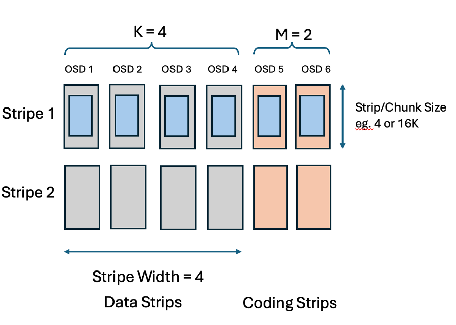

**How it works:**

1. Data splitting: An object is divided into **K** data chunks.

2. Parity generation: An erasure code algorithm, such as [Reed-Solomon](https://en.wikipedia.org/wiki/Reed%E2%80%93Solomon_error_correction), computes **M** parity coding chunks based on the data chunks. The number of parity chunks **M** determines how many OSDs can fail without data loss. The user can configure the erasure code algorithm with different plug-in’s available. The choice of plug-in is outside the scope of this blog.

3. Chunk distribution: The **K** data chunks and **M** parity chunks are distributed and stored on separate OSDs according to a CRUSH rule.

4. The user decides what the size of a chunk is, this is called a `stripe_unit` and this can be specified when the `erasure-code-profile` is created. There is a section later that discusses the choice of `stripe_unit`.

5. The `stripe_unit` size is the amount of data that is written to a data chunk before the next part of an object is written to the next chunk on the next OSD. The stripe is the collection of strips in the stripe which also make up for the coding parities that protect the data in the event of an OSD loss.

Within the community, `stripe_unit` is commonly referred to as a **chunk**. For the purpose of this blog, `stripe_unit` is synonymous to chunk size.

### Choosing an Erasure Code Profile

Users have been mainly using replica-3 pools for block and file workloads. A replica-3 pool stores 3 copies of the data on different OSDs so can survive two OSD failures without loss of data. The most common double failure is a drive failure plus a medium error on another drive. Replica-3 pools have a 300% storage overhead - for every 3GB of raw capacity you can store 1GB of application data.

With erasure coding pools you create an erasure code profile choosing values for **K+M**. The minimum number of OSDs required for an erasure code pool is **K+M**, and just like replica-3 pools it is recommended that these OSDs are in different servers for fault tolerance. The choice of **M** defines how much redundancy you have, **M=2** means you can survive two OSD failures - the same as a replica-3 pool. The storage overhead for an erasure coded pool is **(K+M / K)**, so a 4+2 pool has a 150% storage overhead.

This blog focuses on Erasure code performance with **M=2** as this gives the same level of protection as a replica-3 pool.

## Read Optimizations (Partial Reads)

In Squid, reads to an individual strip in a stripe, read the whole stripe, extract the required data that is needed by the client request from the stripe data and then discard the rest of the data. For small reads, the greater the **K** value (data strips) in the erasure code profile, the greater the amount of wasted IOs to the OSDs.

In Tentacle, Partial Reads is an improvement to only read the minimal data to honour the client request. There are two benefits of this improvement, firstly performance reads are unaffected by the increase of **K** and your drive media will get better utilization through less wasted IOs, secondly with a larger `stripe_unit` , client reads will only need to read part of a strip and there will be less wasted bandwidth from the other OSDs.

This means that in Tentacle, with fast EC, you can now choose to use a higher value of **K** so that you get better capacity utilization without the performance penalties that we see in Squid.

## Space efficiency improvements - small objects padding

In Squid, small objects are padded to a whole stripe, which resulted in wasted space as well as a write performance loss due to writing to multiple OSDs needlessly. Fast EC does not pad small objects to a whole stripe, instead it writes the object to just the strips that it needs to, resulting in a performance improvement as well as a capacity saving.

## Increasing stripe_unit size to 16k

Having a small `stripe_unit` increases the probability that client I/Os get split up into multiple requests for different OSDs. For large I/Os (e.g. 1MB reads) there is a performance advantage in splitting the I/O into smaller requests to separate OSDs that can be processed in parallel. For smaller I/Os splitting the I/O just increases the work for the drives, CPU and network and reduces performance.

Increasing the `stripe_unit` reduces the overheads for processing small I/Os whilst still splitting and getting a performance advantage for large I/Os.

In squid and earlier, there are two reasons why the `stripe_unit` was small:

1. Lack of partial read support essentially was a blocker to allowing the increase of the `stripe_unit` size, as greater values of **K** with a larger `stripe_unit` meant reads of 4-16k would have resulted in even greater IO wastage to the OSDs.

2. EC used to pad all objects to be a multiple of the stripe size. A bigger `stripe_unit` means more padding which wasted storage capacity.

There is still a compromise between performance and capacity usage. Increasing the `stripe_unit` above 16K, perhaps as high as 256K would improve performance more but for small files or objects will still waste storage capacity. The choice of 16K for the `stripe_unit` is a good compromise – it gives very similar capacity utilization to the old EC but better performance.

The default `stripe_unit` is still 4K in Tentacle, but we recommend that you specify a 16K `stripe_unit` when you create a new fast EC pool for a bigger performance gain.

For existing pools, it is not possible to change the `stripe_unit`, fast EC can still be enabled for these pools but there will be a slightly less performance improvement.

## Write optimizations

### Partial Writes

In squid, all sub-stripe writes are handled by reading the whole stripe, merging in the new data from the client, encode the new parities and write the stripe back, data with the coding parities.

This meant that EC was more optimised for large block and large object workloads, but it is not optimal for small object or small write workloads such as CephFS or transactional workloads, since greater values of **K** with small writes meant that IO operations are amplified.

Partial Writes only reads the data strips that are not being written, encode the new parities and only write back the modified data and parity strips.

This optimisation means for small writes and large values of **K**, Fast EC saves on drive operations for reading and writing unchanged data within the stripe.

### Parity Delta Writes

Parity delta writes (PDW) builds on the partial write improvement within Fast EC.

A common technique used by block storage controllers, implementing RAID-5 and RAID-6 is to implement parity delta writes. When a small part of the stripe is being overwritten it is possible to perform the update by reading the old data, XORing this with the new data to create a delta and then read each coding parity, apply the delta and write the new parity. The advantage of this technique is that it can involve a lot less I/O, especially for **K+M** encodings with larger values of **K**. The technique is not specific to **M=1** and **M=2**, it can be applied with any number of coding parities. For **M=2**, this technique involves doing 3 reads and 3 writes per strip within the client request and then updates to the parity are coalesced via a cache to minimize the number of parity updates within the stripe. (For **M=1**, 2 reads and 2 writes are needed for each write).

In some scenarios depending on the value of **K** and the size of the write operation, it may be more beneficial to not use PDW.

The implementation of PDW within Fast EC dynamically adjusts the write technique for each IO for optimal write performance.

Here is an example table of profile vs the write size just for illustration:

| Erasure Code | stripe_unit | Write size | PDW Write          | PDW Off (Partial Write) |
| ------------ | ----------- | ---------- | ------------------ | ----------------------- |
| 2+2          | 16k         | 4 to 16k   | 3 reads+3 writes   | `1 read+3 writes`       |
| 4+2          | 16k         | 4 to 16k   | `3 reads+3 writes` | 3 reads+3 writes        |
| 6+2          | 16k         | 4 to 16k   | `3 reads+3 writes` | 3 reads+3 writes        |
| 6+2          | 16k         | 32k        | 4 reads+4 writes   | `2 reads+4 rites`       |
| 8+2          | 16k         | 4 to 16k   | `3 reads+3 writes` | 7 reads+3 writes        |
| 8+2          | 16k         | 32k        | `4 reads+4 writes` | 6 reads+4 writes        |

**Figure 1: Table to explain write overhead using PDW and Partial Write techniques**

The highlighted `text` indicates the more efficient method for the scenario.

In scenarios where the total numbers of I/O operations is the same between PDW on and off (ie. Using Partial Write methodology), FastEC will favour using PDW because reading and writing the same OSD is more efficient than reading and writing to different OSDs because bluestore caches metadata.

## Performance Results

For the purpose of this blog, we ran the performance tests with a single node. Running with a single node means that there are no network bottlenecks and we can focus on CPU and drive bottlenecks. The absolute performance measurements won’t be great, but we can still compare relative performance as the optimizations will be demonstrating we have extracted more performance in workloads that are limited by CPU or drives.

The configuration of the system is as follows:

- Single Node – 8 OSDs - NVME Flash
- 2 x Intel(R) Xeon(R) Platinum 8276M CPU @ 2.20GHz – 28 cores per socket
- LibRBD FIO client – 16 volumes – 1 client per RBD volume
- ISAL plugin

### How to read a response curve

For the next sections, I need to explain a response curve (also known as a hockey stick curve).

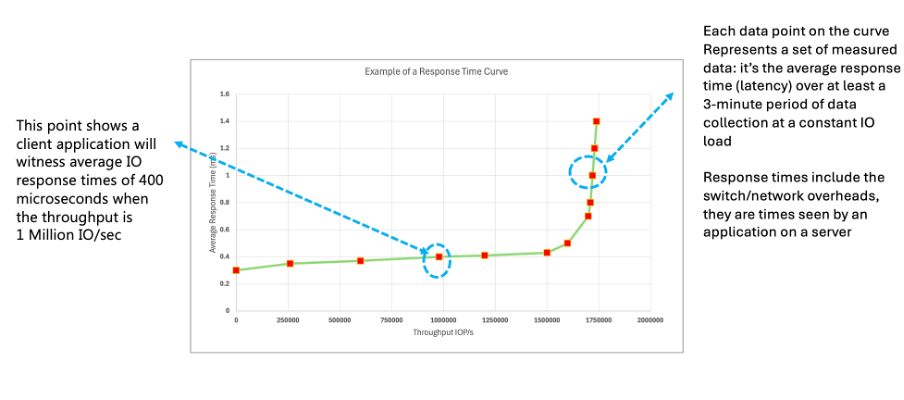

**Figure 2: How to read a response curve.**

A response curve plots I/Os per second (IOPs) against latency. Starting from the bottom left of the chart the expectation is that as the queue depth to the storage system increases, the IOPs increases also. At a certain point in the curve, otherwise known as the knee, this is the saturation point where throughput no longer increases and adding extra work onto the storage systems queue will just increase latency. This is what generates the “hockey stick” shape to the curve.

For each point of the curve, the I/O workload is run at a specified queue depth for several minutes and then an average IOPS and latency is calculated. Typically 3 to 5 minutes (with a warm up period).

The saturation point is system specific and there may be many reasons why this limit is hit, depending on the workload, for example such as the CPU, a CPU core, drive, network interface, or some software resource limit in the software are just a few possible reasons and there maybe others.

Typically, response curves are used during client system sizing estimates to understand the limits of the system being sold and to evaluate how much headroom remains on the system. Typically, clients don’t go beyond around 70% of the maximum throughput to allow for sufficient head room for expansion.
A flat line at the beginning of the curve through to the knee is an indication that latency is consistent with low variance in the throughput and latency.

The topic of how a response curve is created or factors that can affect the response curve is subject to performance best practices. This is outside the scope of this blog and will be discussed in a series of blogs on CBT (Ceph Benchmarking Tool) which will be available soon on [ceph.io](https://ceph.io)

When comparing response curves, it is inevitable that there is some variance typically around 5 to 10%

For now, let us get onto discussing the performance Fast EC improvements in Tentacle
for the purpose of explaining the legend of the charts in the next section and all other charts in this blog, for example:

**squid-ec-6+2-4K** means we are running the squid build, using erasure coding with a 6+2 profile and a 4K stripe unit. Therefore, these graphs are comparing a Squid build with a 4K `stripe_unit` 6+2 erasure code to a Tentacle build with FastEC enabled with a 16K `stripe_unit` and a 6+2 profile. There are other charts that use a different erasure code profile.

### Write Results - Small Writes

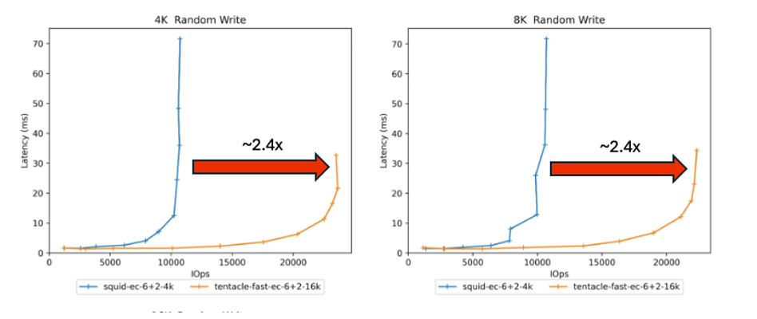
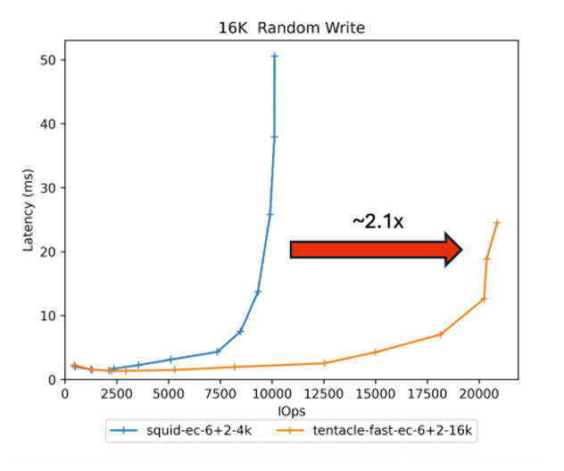

**Figure 3: Small Writes - Squid 4k 6+2 EC vs Tentacle 16k Fast EC 6+2**
Small writes are common for Ceph FS, RBD and small object workloads.

In Figure 3, we start by comparing a Squid 4k `stripe_unit` 6+2 erasure code to Tentacle with FastEC enabled 16k `stripe_unit` 6+2 configuration. This is a small system single node with 8 OSDs system. By all means, 20K IOPS isn’t a particularly great throughput of a storage system, however it isn’t the absolute numbers we are interested in here. We are interested in the relative performance of the two pieces of software, this is highlighting that we can at least double the throughput of the drives with Fast EC at the same latency achieved, or in some cases improve the latency. If you want more performance, you can add more drives and nodes to the configuration.

The improvement in performance in the 6+2 configuration between Squid 4K and Tentacle 16k is largely due to the Parity Delta Writes feature of FastEC, as explained in the Figure 1 comparing the number of read/write operations depending on the value of **K** and the size of the write IO request.

Your choice of **K** can affect the performance you get from the system. Here are a set of charts that perform the same 4/8/16k random writes test comparing 2+2,4+2 and 6+2 EC configurations:

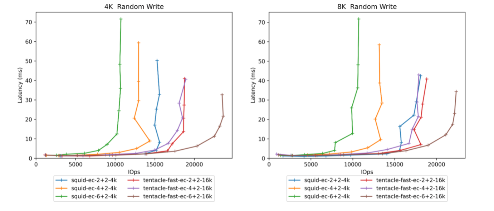
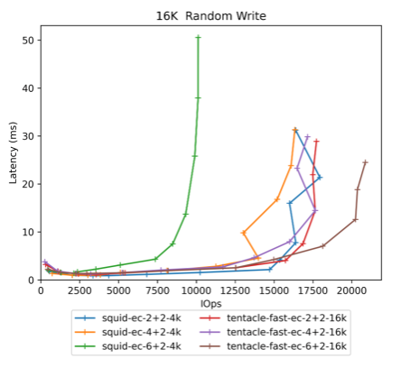

**Figure 4: Small Writes - Squid – EC 2+2, 4+2 and 6+2 – 4k compared to tentacle – FastEC in 2+2,4+2, 6+2 profiles**

Previously in Squid, write performance reduced as **K** increased, the reason is the whole stripe is always being read and written, this means that for wider erasure codes (eg 4+2 and 6+2) the overheads get higher and performance reduces. Increasing **K** above 6 would lead to further drops in performance.

For Tentacle with Fast EC, the parity delta write optimization means that wider erasure codes performance improves as **K** increases. Performance is not expected to improve beyond the 6+2.

We’ll discuss later in this blog how we are recommending choosing greater values of **K** as this improves storage efficiency with less capacity overhead.

### Write Results - Large Writes

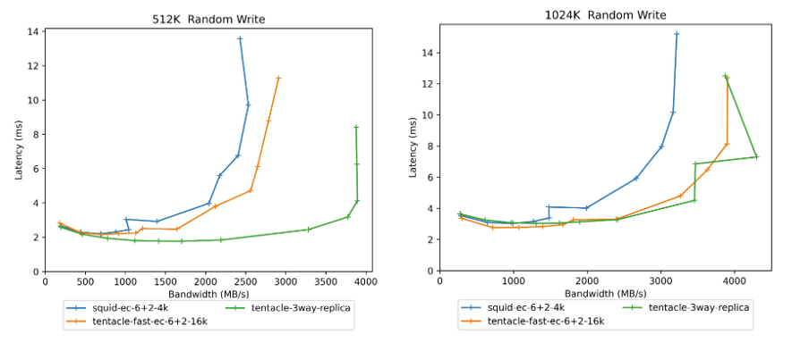

**Figure 5: Large Writes - Comparing Squid 4k, Tentacle 16k to 3-way replica**

For large writes and large S3 objects there is a small increase in throughput and lower latency compared to Squid. You can expect to see the same performance with FastEC enabled for larger 1Mbyte objects, performance is near 3-way replica.

### Read Results - Small Reads

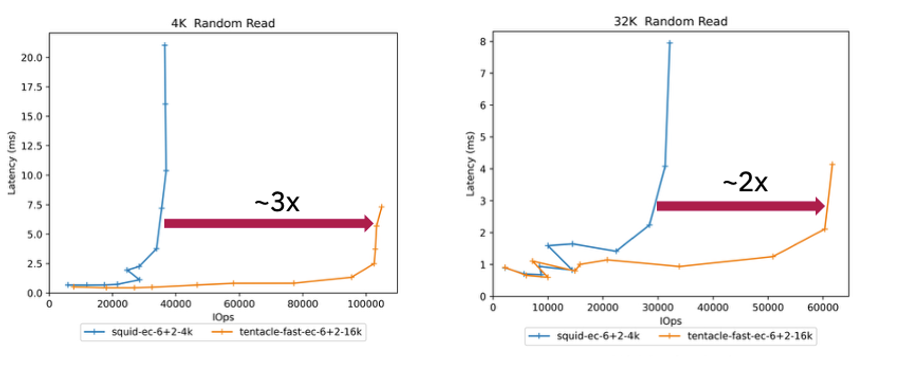

**Figure 6: Small reads comparing 4k stripe_unit Squid 6+2 EC to 16k Tentacle 6+2 EC**

Small reads yield a 2-3x improvement due to the Partial Read feature added in Fast EC. This is good for RBD, Ceph FS and Small object workloads.

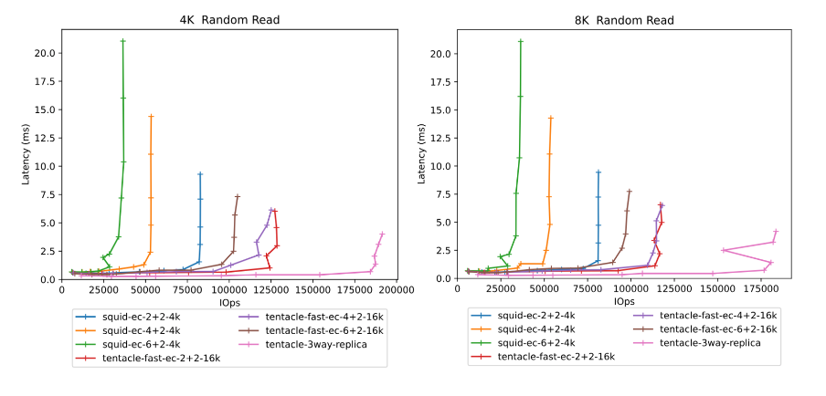

**Figure 7: Small Reads - Comparing 2+2,4+2, 6+2 Squid to Tentacle to 3-way replica**

Comparing the different erasure code profiles between Squid and Tentacle.

These results highlight the following observations:

- For Squid, as **K** increases from 2+2 -> 4+2 -> 6+2. Maximum throughput degrades, for reasons as explained earlier in this blog, Squid does not have partial reads. As **K** increases, more data is thrown away for small read operations therefore increasing OSD and CPU utilization.
- For Tentacle, as **K** increases, maximum throughput scales to the point where we can achieve nearly the same read performance as 3-way replica.
- The latency gap between Tentacle and 3-way reads to the non-primary OSD are being redirected to primary OSD.

Direct Reads, a feature coming in a future release of Ceph will remove the hop to the primary OSD which will improve latency to be equivalent to 3-way replica performance.

Currently targeted at Umbrella timeframe, there will be a blog at a future date on this feature.

### Read Results - Large Reads

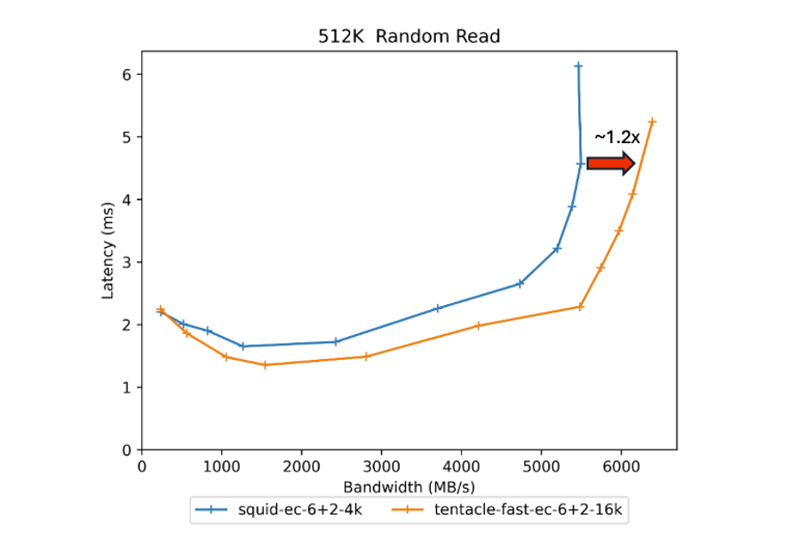
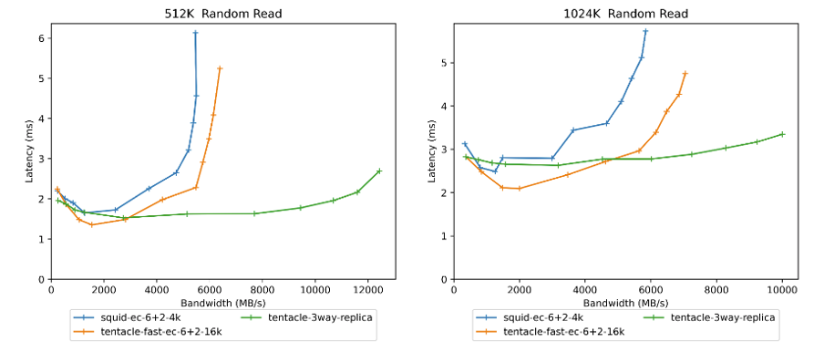

**Figure 8: Large Reads - Comparing 6+2 Squid 4K to Tentacle 6+2 16k to 3-way replica**

For large reads, backup, large S3 object and streaming workloads, offer slightly lower latency and around a 1.2x increase in throughput using Fast EC over Squid.

Direct Reads is expected to significantly improve EC throughput further to be much closer to 3-way replica whilst also reducing latency due to dividing up of the large requests into chunks and issuing the IOs in parallel to all the OSDs in the stripe.

### Write Append Results

Write appends are where new data is being appended to the end of an existing object. This is typically common in sequential write, backup, AI or RGW PUT workloads.

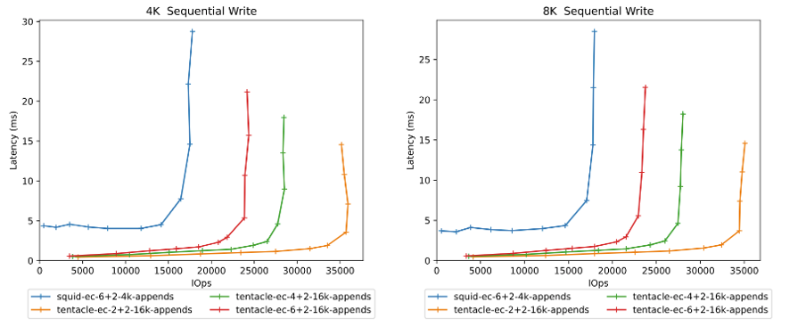

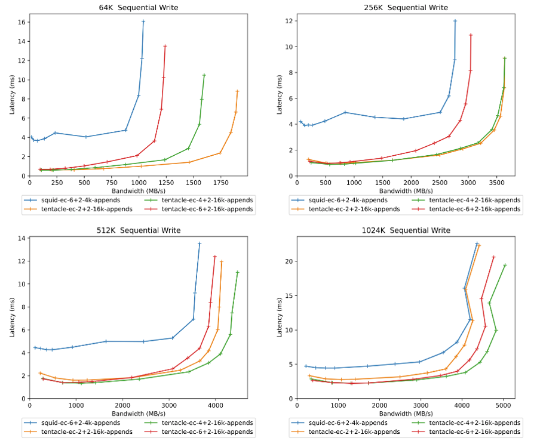

**Figure 9: Write Appends – Squid 4k to Tentacle 16k `stripe_unit`**

These results highlight the following benefits:

- A significant latency reduction for all writes upto 512k and modest increase at 1Mbyte.
- For small block writes upto 16k, there is a significant increase in IOPs throughput available.
- For writes 16k to 64k there is a modest increase in throughput available also.
- No degradation in performance for 512k and 1Mbyte writes whilst improving latency significantly.

It is interesting to note that increasing **K**, (eg. going from 2+2 to 4+2/6+2) increases the latency. The reason for this is that in a 2+2 configuration, 50% of your I/O is writing to the primary OSD of the PG, where as in a 4+2 configuration, 25% of your I/O is writing to the primary OSD of the PG. Writing to the non-primary OSD results in needing to forward the request to the primary OSD resulting in an extra messenger hop operation.

### Mixed Read/Write Workloads

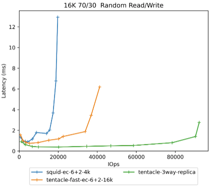

**Figure 10: Mixed 16k 70/30 - Squid 4k to Tentacle 16k to 3-way replica**

Transactional and File workloads contain a mixture of reads and writes, typically small block with 70% reads and 30% writes of around 16k in size. This chart contains a typical 70/30 16k mix workload.

Compared with Squid, there is at least a doubling in throughput with FastEC. Three-way replica is still faster, however compared to a 6+2 16k `stripe_unit` erasure pool with Fast EC it is around 50% of the performance, however you need to consider that a 6+2 erasure code has only 33% overheads, compared to needing 3x physical capacity for a Three-way configuration. Three-way replica is a significantly more expensive option compared to using EC. Therefore, EC in 6+2 form has a much better cost vs performance ratio over 3-way replica.

On the same storage system, write dominated workloads with EC (due to the 3 reads/3 writes) are never going to perform as well as Replica purely because of the laws of physics and the algorithms for EC need to do more IOs than Replica. However, you can offset this cost with less physical capacity and restructure your storage accordingly.

It is important to note, traditional storage controllers often offer a choice between RAID-1 (mirroring) and RAID-6 (erasure coding K+2) and they also have a similar cost performance trade off.

Using a wider erasure code such as 6+2 requires 9 nodes and therefore you may need to add more nodes to your Ceph cluster. However, the cost of a storage solution, is typically dominated by the cost of the drives you install to store the data, especially if you are using Flash. With Erasure Code you get half the performance at less than half the cost, giving you the opportunity to scale out to build the same level of performance as replica.

## Summary

The objective of the EC performance enhancements is to make performance good enough to make it viable to use EC for block and file storage, especially when you consider the cost performance ratio benefits of using EC over 3-way replica.

For the most part users should not be considering performance when choosing the value of **K**. Users should use higher values of **K** (such as 6+2) for better storage efficiency whilst maintaining the same redundancy as replica.

Using Fast EC in a 6+2 configuration, you could use this saving to increase the number of nodes, redistribute your drives across the nodes and achieve the same performance as Three-way replica and still save money.

The Fast EC feature in Tentacle reduces the total cost of ownership of your Ceph cluster by allowing you to use Erasure Coding as an alternative and more space efficient method with a significantly better cost vs performance ratio of storing your data compared to Replica pools.

I hope this blog has helped you appreciate the performance benefits of Fast EC. The team are working on many more improvements:

- Direct Reads – This feature will significantly improve reads to offer the same performance as Replica pools.
- Object packing – This feature brings substantial benefits to users wanting to increase the `stripe_unit` increase beyond 16k without degrading space utilization which will bring other performance improvements for reads and writes beyond 16k. This will be a useful improvement for larger (4MB) objects.

Direct Reads is targeted for the Umbrella release. Object packing will be in a future release. More performance data on these features will be available nearer the time.
