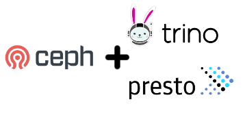

## Introduction

In this article we analyze the results of performance benchmarks conducted on
Trino with the Ceph Object S3 Select feature enabled, using TPC-DS benchmark
queries at 1TB and 3TB scale. We demonstrate that, on average, queries run
2.5X faster. In some cases, we achieved nine times improvement with a network
data processing reduction of 144TB compared to using Trino without the S3 Select
feature enabled. Combining IBM Storage Ceph's S3 Select with Trino/Presto can
enhance data lake performance, reduce costs, and simplify data access for organizations.

We would like to thank [Gal Salomon](gsalomon@ibm.com) and [Tim Wilkinson](twilkins@ibm.com)
for conducting the TPC-DS benchmarking and providing us with these results. 

## What is Trino?

Trino is a distributed SQL query engine that allows users to query data from
multiple sources using a single SQL statement. It provides data warehouse-like
capabilities directly on a data lake.

## What are the difference among Trino, Presto and PrestoDB?

You may have encountered references to Trino, Presto, and PrestoDB, all of which
originated from the same project. Presto was the initial project from Facebook,
which was open-sourced in 2013. PrestoSQL became a community-based open-source
project in 2018 and was rebranded to Trino in 2020.

Presto is an essential tool for data engineers who require a fast query engine
for their higher-level Business Intelligence (BI) tools.

## Why Choose Ceph for S3 Object Storage?

* Ceph provides a first-class, highly compatible S3 API for on-premises deployments.
* Ceph confidently meets the needs of critical large-scale installations and the
  ever-growing demand for data. Its performance scales alongside capacity,
  resulting in substantial cost savings and the ability to manage exponential
  data growth.

## What enhancements does Ceph bring to data query tools like Trino, Presto?

Ceph provides the S3 API S3 Select feature. S3 Select significantly improves
the efficiency of SQL queries of data stored in S3-compatible object storage.
By pushing the query to the Ceph cluster, S3 Select can dramatically enhance
performance, processing queries faster and minimizing network and CPU resource
costs. S3 Select and Trino are horizontally scalable, handling
increasing data volumes and user queries without sacrificing performance. Trino's
support for SQL and S3 Select's ability to query data in place enables users to
access and analyze data without complex data movement or transformation tasks.

Ceph's Object Datacenter-Data-Delivery Network (D3N) feature uses high-speed
storage such as NVMe SSDs or DRAM to cache datasets on the access side. D3N
improves the performance of big-data jobs running in analysis clusters by
accelerating recurring reads from the data lake or lakehouse.

## TPC-DS benchmarks using Ceph + Trino

### Test Procedure

We executed the
following [72 TPC-DS queries](https://github.com/ceph/s3select/tree/master/TPCDS/sample-queries-tpcds)
at three different scale factors, 1TB, 2TB and 3TB, to characterize performance
and resource consumption. The datasets were in uncompressed CSV format. We
executed each query numerous times with and without S3 Select and ensured
consistent results by monitoring the standard deviations for each run.

If you’re interested in exploring this topic further, please check out Gal
Salomon's [GitHub repository](https://github.com/ceph/s3select/blob/master/README.md#how-to-run-trino-with-cephs3select),
where you will find instructions on how to set up a testing environment with
Trino and Ceph. Instructions are also provided for the TPC-DS benchmarking
tools used for this benchmark.

### Test Environment

The hardware used for the benchmark was the following:

* Trino client (driver) nodes
    * Trino Version: 405
    * 3x Dell R630
        * 2x E5-2683 v3 (28 total cores, 56 threads)
        * 128 GB RAM
* Ceph cluster nodes
    * OS: RHEL9.2
    * Ceph version: 18.2.0-110.el9cp (Reef)
    * 3x Dell R630 Monitor / Manager nodes
        * 2x E5-2683 v3 (28 total cores, 56 threads)
        * 128 GB RAM
    * 8x Supermicro 6048R OSD / RGW nodes
        * 2x Intel E5-2660 v4 (28 total cores, 56 threads)
        * 256 GB RAM
    * 192x BlueStore OSDs
        * 24 2TB HDD per node
        * 2x 800G NVMe SSDs for WAL/DB per OSD node

### Tunables

These S3 Select settings were adjusted:
* **hive.max-split-size** The maximum size of a single file section assigned
  to a worker. More minor splits result in more parallelism and thus can decrease
  latency but incur more overhead and increase load on the system. Testing
  began with 4MB, 8MB, 16MB, 32MB, 64MB, and 128MB values but we eventually
  settled on 128MB for all tests.
* **hive.max-splits-per-second** The maximum number of splits per second
  generated per table scan. It can be used to reduce the load on the storage
  system. There is no default limit, so Trino maximizes the parallelization of
  data access. All testing was performed using 10K for this setting.

### Concurrency

The Trino engine processes complex queries by dividing the original query into
multiple parallel S3 Select requests. These requests split the requested
table (an S3 object) into equal ranges that are then distributed across our
Ceph cluster's RGW service. The load balancer efficiently channels requests
among Ceph Object Gateways, ensuring optimal performance and scalability for our
data processing needs.

### Test Results

This next section provides an overview of TPC-DS benchmark results. These
results help us understand how the Ceph Object S3 Select feature yields
substantial benefits when working with CSV datasets. The benefits include
improved query times and reduced data processing. We have included a diagram
below that shows the total network traffic reduction achieved by using S3 Select.
We can save 144TB of network traffic by utilizing this feature.

The following graph shows the per-query speedup achieved using S3 Select for the
3TB scale dataset. The X axis value is the query number from the above repository
and the Y axix value is the speed improvement for each query. During testing we
observed that enabling S3 Select improved all 72 queries. The query acheiving
the most speedup was 9 times faster, and the overall average improvement was
around 2.5x.

When S3 Select is enabled we offload computational work to the Ceph Object
Gateways, so as expected they saw increased CPU usage when executing the
queries with S3 Select enabled. However, the CPU utilization remained at an
acceptable level Memory demand increase with S3 Select enabled was barely
noticeable, with an average increase 2.50%. Pushdown can process objects
of any size since it does so in chunks without preloading the entire object.

Query number 9 was able to reduce the network data processing by 18TB. The total reduction in processed data across all 72 queries was 144 TB when enabling S3 Select.

## Summary and What’s Up Next

In this post, we shared the results of our benchmark testing, where we ran 72
TPC-DS 72 queries at 1TB and 3TB scale. We have found that utilizing
Ceph Object S3 Select pushdown performance optimizations enables queries to
complete more quickly than before with significantly lower resource
demands. With Trino and S3 Select, you can push the computational work of
projection and prediction operations to Ceph, achieving up to 9x performance
improvement in query runtime, with an average of 2.5x. This significantly
reduces data transfer across the network, saving 144TB of network traffic
for the 72 executed queries. Organizations can enhance data lake performance,
educe costs, and simplify data access by combining Ceph S3 Select with Trino
and Presto.

The authors would like to thank IBM for supporting the community with our time to create these posts.
