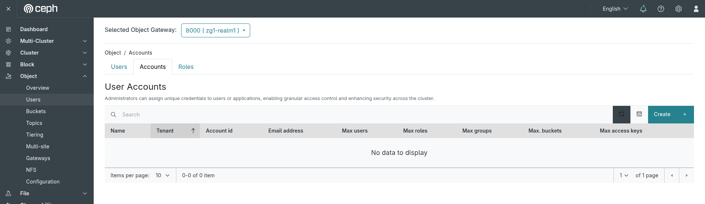
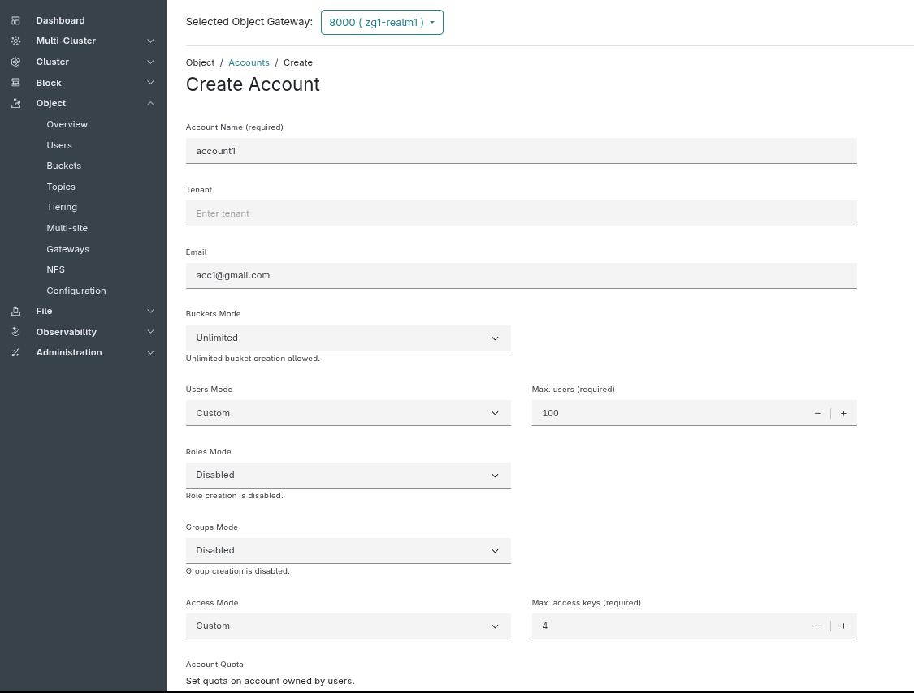
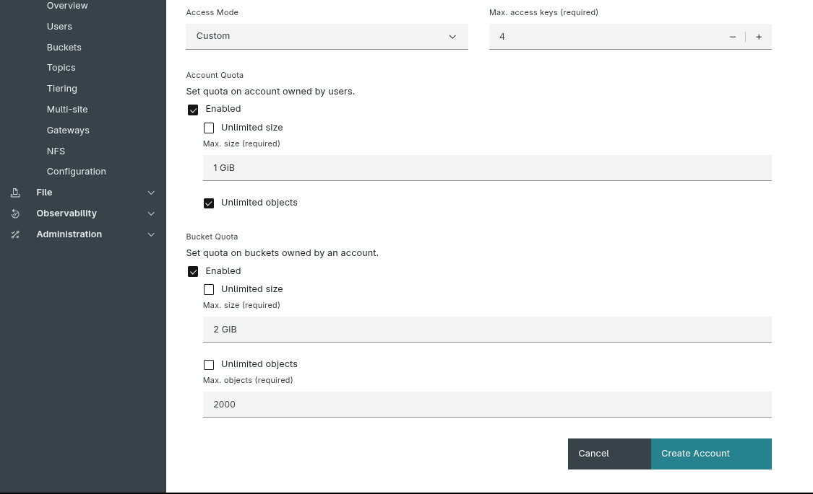
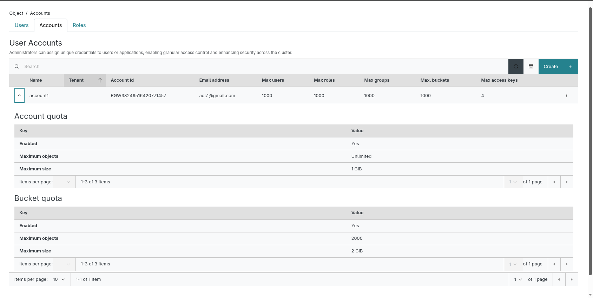
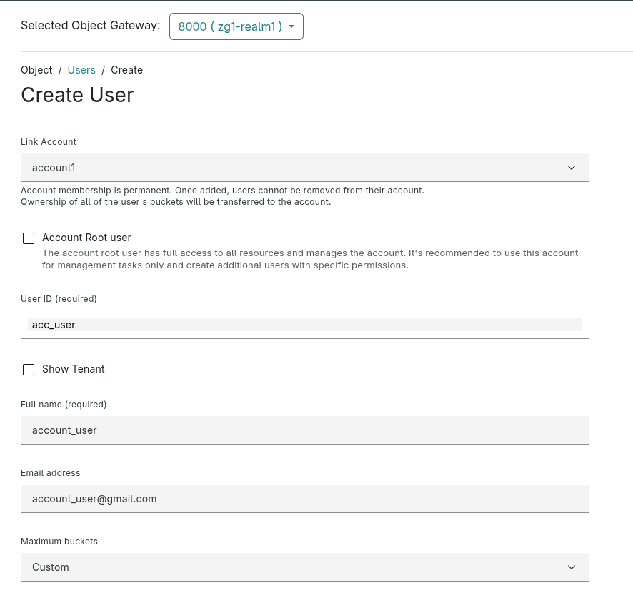
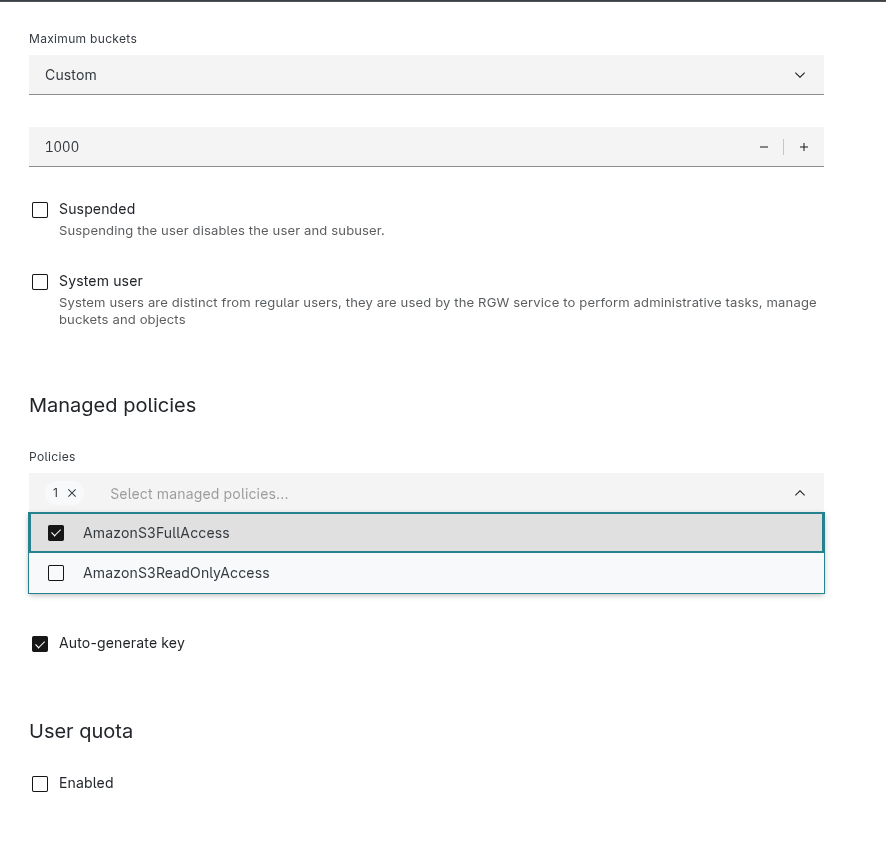
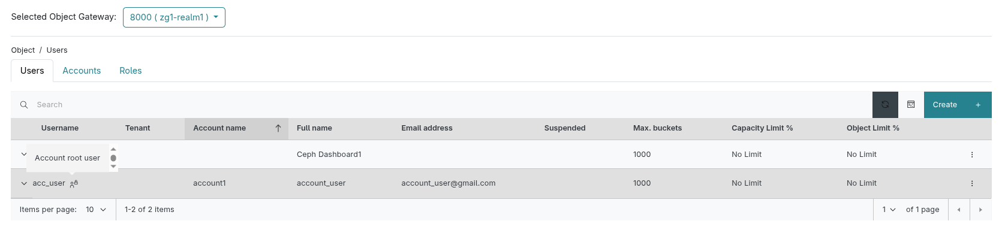
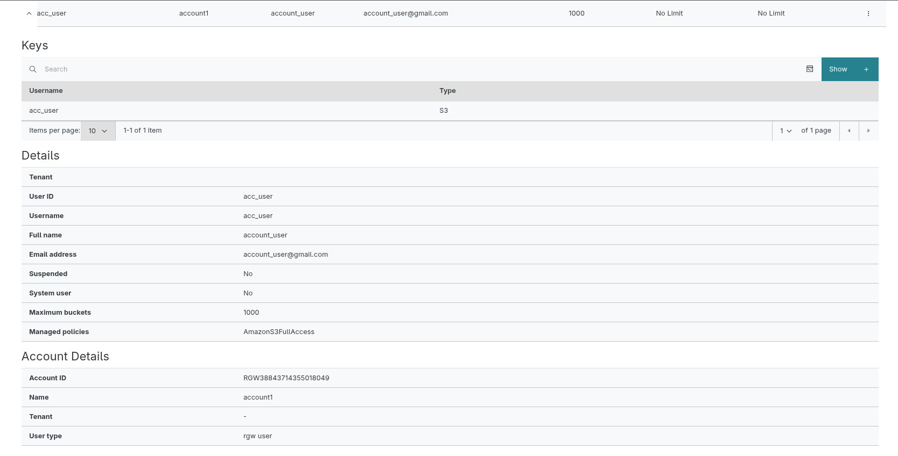
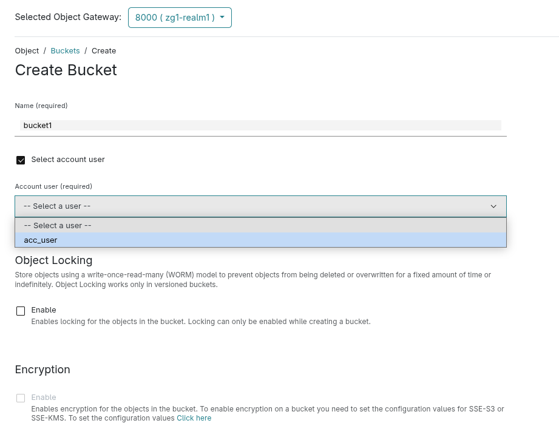
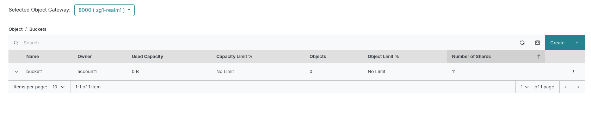

## 1. What’s an Account & Why Use It?

Instead of each S3 user operating independently, an **account** groups users and roles under shared ownership. Resources like buckets and objects are owned by the account, not individual users. This brings major advantages:

- **Aggregated quotas & stats**: Track usage and enforce limits at the account level.
- **Shared visibility**: Every user or role in the account can list and manage account‑owned buckets.
- **Streamlined management**: Apply IAM policies centrally throughout the account for consistent permissions.

---

## 2. Roles & Responsibilities: Understanding Account Users

| Role Type | What It Is | Permissions |
|-------------------|----------------------------------------------|--------------------------------------------------------------------|
| **Account Root User** | The master account owner, created by an admin | Full default access to account’s resources; used to define policies and create subusers |
| **IAM Users / Roles** | Scoped identities created by the root user | No access by default: they need explicit IAM policies to perform actions |

## 3. User Accounts Management
### 3.1 Account Creation

The Accounts feature is available under the Dashboard menu: `Object > Users` and switch to `Accounts` tab. Once you navigate to this page, it will display a list of accounts.
Now, click the `Create` button to create a new account. 

  
*Figure: Step 1 - Navigating to Accounts page*

A form will appear where you can enter values for the following fields:

  
*Figure: Step 2 - Enter account details*

  
*Figure: Step 2.1 - Enter quota details*  

After entering the details, click the Create Account button. Upon successful account creation, you will be redirected to the Accounts List page, where the newly created account will appear in the table. Expanding the table row reveals the account details, including the Account Quota and Bucket Quota for the account.

  
*Figure: Step 3 - Account details*

### 3.2 Link user with an Account

After creating an account, the next step is to create an account user. Let’s see how it’s done.

Navigate to the Users page and click the `Create` button to create a new user.

An account user can be created in two ways:  
 - Create a new user and link it to an account during creation.
 - Link an existing user to an account by editing the user.

On the user creation form, the `Link Account` field will be the first input selector. You can use this to choose an account from the account list and link it with the user.

> **NOTE:** This option will be visible only if at least one account has been created.  

  
*Figure: Step 4 - Link user with account*

Also, as seen, once the account is selected, another option will appear to mark the user as a root account user. You can select this checkbox if the user needs additional permissions to manage or create other users.

#### Apply Managed Policies to account user

If the account user is non-root, an additional option called **Manage Policies** will be visible. These policies provide broad permissions to users:
 - Full access versions (e.g. AmazonS3FullAccess) grant complete access to the service.
 - Read-only versions limit actions to safe, non‑modifying operations.

You can select the appropriate option based on the level of access you want to grant the user.

  
*Figure: Step 4.2 - Apply managed policy to account user*  

After filling in the required details, click on Create or Edit User, depending on the scenario described above. Once the request is completed, you will be redirected back to the user list page.

Here, you can verify the user's account linkage. In the table, the `Account Name` column indicates that the user is linked to an account. Additionally, if the user is a `root account user`, an icon next to the username will indicate this, as shown below.  

You can view more details about the user by expanding the table row to access the User Details section.

  
*Figure: Step 4.2 - User Details*  

### 3.3 Link bucket with an Account

Once the account user is created, you can also link buckets to the account. This can be done in the following ways:  

 - If a user has existing buckets prior to being associated with an account, those buckets will be automatically reassigned to the account upon linkage.
 - A user can create a new bucket from the Buckets page and link it to the account during creation.

 > **NOTE:**  Account membership is permanent. Once added, users cannot be removed from their account.  

Let’s create a bucket and link it to an account. To do this, navigate to the Buckets page and click the `Create` button.

You will see a form where you need to enter the bucket name and owner details. At this point, you can check the `Select account user` option to link the bucket to an account. Then, select the account user from the list and fill in any other required details.  

> **NOTE:** The selected account user must have sufficient permissions to create the bucket through a managed policy.  

  
*Figure: Step 5 - Link user bucket with account.*   

After submitting the form, you will be redirected to the Bucket List page upon successful creation.  

  
*Figure: Step 5.1 - Bucket list* 

Similarly, a bucket created with a normal RGW user can be linked to an account by selecting the existing bucket and clicking on `Edit` to change its ownership. You can follow the same process as described above to do this.

## 4. Dashboard Highlights: Making Account Management Easy

 - #### Account-First Management

    Switches from user-based to account-based control, making multi-user setups easier to handle.

 - #### Easy User Setup

    Step-by-step forms and smart defaults simplify user creation and account linking.

 - #### Visual Role Indicators

    Icons and labels clearly show user roles and account links at a glance.

 - #### Click-to-Assign Policies

    Assign access levels using built-in policies — no CLI or configs needed.

 - #### Flexible Linking

    Users and buckets can be linked to accounts during or after creation.

 - #### Unified View

    See all users, quotas, and buckets in one place for better oversight.

## Conclusion

The Ceph Dashboard offers a streamlined and intuitive way to manage S3-compatible user accounts, roles, and buckets within the RGW ecosystem. By introducing a structured account-based approach, it enables shared resource ownership, consolidated quota tracking, and simplified IAM policy enforcement. Whether you're provisioning new users or organizing existing ones, the dashboard provides clear workflows to link users, assign roles, and manage resources — all with centralized visibility. This makes it significantly easier for administrators to enforce consistent security policies and maintain operational control across object storage environments.

Take the opportunity to explore this new feature in the Ceph Dashboard and see how it can elevate your object storage management with improved control, visibility, and scalability.
