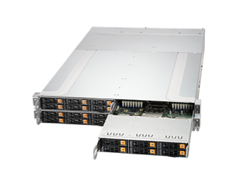
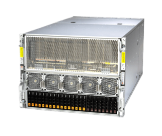
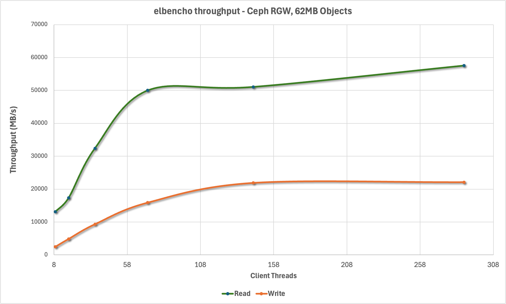
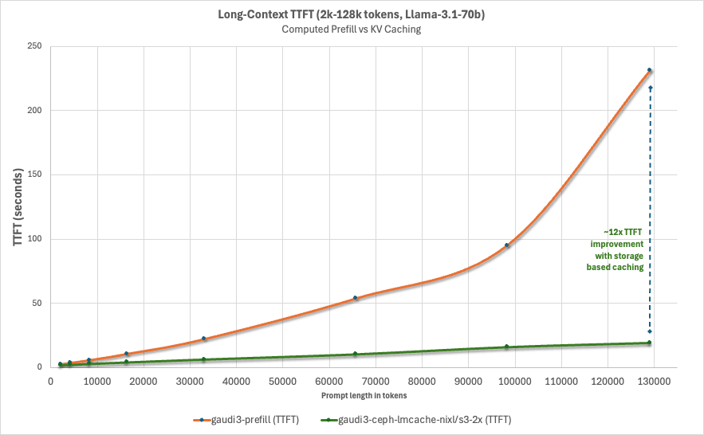
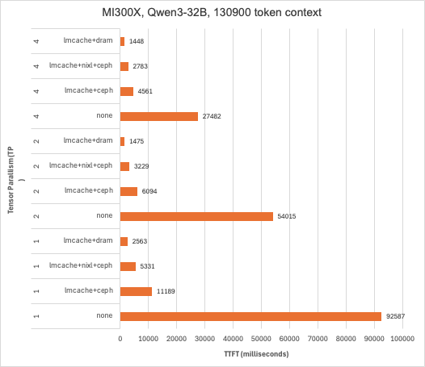
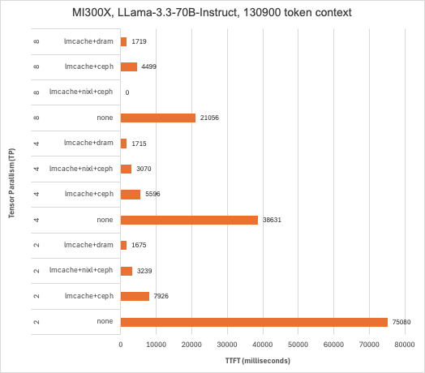
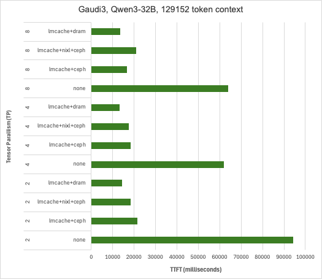
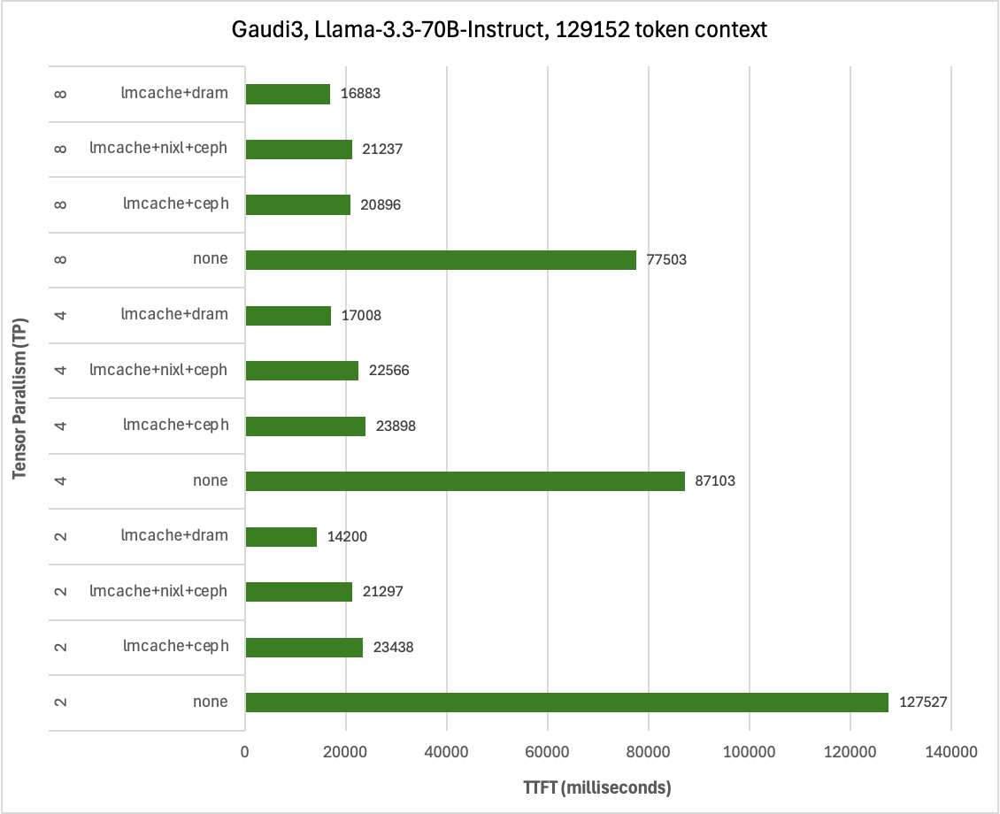

Inference accounts for [90% of the machine learning
costs](https://www.sciencedirect.com/science/article/pii/S2210537923000124) for deployed AI
systems, and it is no surprise that inference optimization is a burgeoning topic
in the research community. [IDC
estimates](https://info.idc.com/futurescape-generative-ai-2025-predictions.html) that global enterprises will invest
$307 billion on AI solutions in 2025, and that number is expected to grow
aggressively year-over-year.

## Understanding the workload

Unlike training, inference for autoregressive language models only involves the
forward pass, which itself is broken up into two distinct phases: prefill and
decode. Each phase has a unique workload profile – prefill tends to be
computation bound, consuming every ounce of floating-point arithmetic capability
the system can garner, followed by decode, which is principally limited by
memory bandwidth. While the prefill phase can easily be parallelized across
GPUs because all the tokens that represent the prompt are known once a request
is sent to the model API, the computation grows quadratically with each
additional token because key and value weights need to be updated across all
layers. This complicates the deployment of inference services where context
lengths are growing rapidly to accommodate larger code bases, longer documents,
and retrieval augmented generation. KV caching is where the computed key and
value weights that correspond with token sequences in a prompt are saved for
later, and then retrieved when they are used in a subsequent prompt to avoid
the cost of computation (GPU hours) and to reduce the time between when the
prompt was submitted as a request and the first response token (time-to-first
token, or TTFT).

## Cache blocks in vLLM and LMCache

vLLM takes a hierarchical approach to KV caching. First it checks for the
existence of cache blocks in GPU memory, if there is a cache miss it will
progress to CPU memory, and if there is again a cache miss it will try to
retrieve cache blocks over any configured KV connectors. LMCache works with vLLM
over this KV connector interface - vLLM sends or requests cache blocks and
LMCache works to diligently store or stream cache blocks it locates. vLLM also
introduced the technique of [Paged Attention](https://arxiv.org/pdf/2309.06180), which breaks up prompts into fixed
sized token sequences referred to as a block, 16 tokens by default. LMCache uses
a larger 256 token block by default, presumably to reduce the overhead of
managing reference to many blocks and to better amortize the per-block transfer
overhead. Storage folks, being unfamiliar with a token as a unit of measurement
for space and IO, might naturally wonder what this translates to in terms of
block sizes expressed in bytes. The bytes-per-token is model dependent, because
it’s a product of the model’s hidden size, number of key-value heads, number of
hidden layers, head dimension, and data type size. For a model like Qwen3-32B
this works out to be approximately 62.5 MiB. There is a convenient [KV Cache
calculator](https://docs.lmcache.ai/getting_started/kv_cache_calculator.html) available on the documentation page for LMCache if you want to see
how much KV space would be required for any given model or number of tokens.

## Content addressable KV storage

vLLM and LMCache both calculate a hash of the token sequence that represents a
block and use that as a cache block identifier. This means that vLLM will pass
over the kv-connector interface the hashes of cache blocks that it is interested
in, and LMCache will return a bitmask indicating which cache blocks it can
provide. Under the covers the LMCache S3 connector will make GetObjectAttributes
calls with each block identifier (hash of the token sequence) and for each block
that exists it will flip the corresponding bit in the mask. The elegance of this
approach is that there is no information about which cache blocks are where that
need to be persisted, and no coordination necessary when there are multiple
instances of vLLM+LMCache running across different hosts. In fact, there is no
requirement that the [LMCache
controller](https://docs.lmcache.ai/kv_cache_management/index.html) be configured at all. This design also
permits flexible eviction, because a storage system could implement time-based
eviction through a Lifecycle configuration on a bucket without leaving dangling
references in some sort of cache block directory, if a cache block is removed
from the underlying bucket, it is treated the same way as a cache miss. In the
end you get fully elastic content addressable storage for KV cache blocks with
flexible eviction. Anyone familiar with Ceph will truly appreciate the notion of
computing the location of data over performing a lookup.

## Retrieving cache blocks

For this post we chose to start by exploring the native S3 connector in LMCache
with Ceph, because we felt that it would be the most accessible way to introduce
KV caching into most existing environments. The other appeal of the native S3
connector in LMCache is that it leverages an AWS common runtime library, which
means that the connections in the client’s connection pool will be multiplexed
across endpoints that are returned in the DNS response for the object store’s
FQDN. The downside is that the bindings in the AWS common runtime library for
Python only support recv_filepath and send_filepath, which limits the ability of
LMCache to stream the response body of a GetObject call directly to page-locked
memory buffers allocated by the LocalCPUBackend. To work around this limitation
the connector pre-allocates and mmaps files on a tmpfs mounted at /dev/shm (one
per concurrent request), in this way the CRT client can pass the file
descriptors of memory mapped files and then memcpy from their corresponding
buffers to page-locked LocalCPUBackend buffers that are used for DMA transfers
to the GPU. This is a clever way of working around most of the limitations of
aws-crt-python, but to get true zero-copy it will require changes to the
bindings.

After some preliminary testing with the native S3 connector [LMCache
PR#1939](https://github.com/LMCache/LMCache/pull/1939)
caught our eye because it leveraged NVIDIA Inference Xfer Library (NIXL). This
PR introduces the ability to directly read S3 data into page-locked NIXL
buffers, bypassing files on /dev/shm and the associated memory copy. It also
introduced a presence cache to eliminate redundant GetObjectInfo requests that
are used to determine if a cache block exists for a given sequence. We had
experimented with the NIXL obj plugin already and had ran some rudimentary
nixlbench tests. What we found was that the NIXL obj plugin alone wanted a
pre-allocated pool of object keys, and that it required either the LMCache
coordinator or Dynamo KVBM to maintain device ID, offset, and length information
for each cache block. Unlike other NIXL plugins, the obj plugin could only write
a single cache block to each device ID (1:1 mapping with object key), because
object APIs like S3 do not support writes to arbitrary offsets. This is all
addressed by PR1939, because instead of using a pool of object keys and tracking
cache block metadata, it preserves the content addressable approach of LMCache’s
native S3 connector. The only remaining downside with NIXL is that it used
S3Client instead of S3CrtClient, the latter of which supports multipathing
across S3 endpoints.

## Hyperscale AI deployments

Drawing from over a decade of experience selecting hardware for Ceph storage
systems we had an idea of what sort of system we would want to build to
maximize throughput, while also drawing inspiration from choices made by major
AI practitioners like Meta and OpenAI. Enter Meta’s contribution to the Open
Compute project – the [Yosemite
V3.5](https://www.opencompute.org/documents/yosemite-v3-5-platform-design-specification-v1-2-pdf) Sierra Point server platform. The YV3.5
cubby occupies 3 OU and can be populated with 6x Sierra Point blades. Unlike
conventional enterprise blade systems the YV3.5 platform does not have an
integrated ethernet switch, instead each Sierra Point blade has OCP 3.0 slot
for direct to host network connectivity. We wanted a system that was a spiritual
successor to YV3.5 and Sierra Point, that reaped the advantages of cutting-edge
processor designs and lithography. While surveying the server landscape across a
whole host of OEMs there was one system that caught our attention, the
Supermicro X14 2U 4-node GrandTwin Rear IO.



[Supermicro X14 2U 4-node GrandTwin Rear
IO](https://www.supermicro.com/en/products/system/datasheet/sys-212gt-hnr)

Each node:
•	1x Intel Xeon 6 6740E 96C/96T, 205W
•	16x16GB DDR5-6400
•	1x Broadcom 57608 2x200GbE
•	6x 2.5” Kioxia CM6-R, 7.68TB Gen4 NVMe
•	RAID1 2x 480TB NVMe (boot) 

This system is utilized to provide high-bandwidth all-flash object storage for
the AI solution using IBM Storage Ceph 8.1.


[Supermicro Gaudi 3 AI Server
SYS-822GA-NGR3](https://www.supermicro.com/en/products/system/datasheet/sys-822ga-ngr3)

•	2x Intel Xeon 6 6960P 72C/144T
•	24x 64GB DDR5-6400
•	8x Gaudi 3 HL-325L accelerators
•	Drives
•	GPU-to-GPU networking?
•	2x Broadcom 57608 1x400GbE

This system is utilized to run inference workloads with the combination of vLLM
and LMCache, leveraging Gaudi 3 accelerators from Intel. 



[Supermicro GPU A+ Server AS
-8125GS-TNMR2](https://www.supermicro.com/en/products/system/datasheet/as-8125gs-tnmr2)

•	1x AMD EPYC 9654 96C/192T
•	24x 96GB DDR5-4800
•	8x AMD MI300X accelerators
•	Drives
•	GPU-to-GPU networking?
•	Storage networking

This system is utilized to run inference workloads with the combination of vLLM
and LMCache, leveraging MI300X accelerators from AMD.


[SSE-T7132S - 400Gb Ethernet
Switch](https://www.supermicro.com/en/products/accessories/Networking/SSE-T7132SR.php)

•	32x QSFP-DD 400GbE, or 64x QSFP56 / 128x QSFP28 with breakout cables
•	25.6Tb/s switching capacity
•	SONiC OS
•	RoCEv2/RDMA support with PFC

For simplicity we used a single fixed-port 400Gb switch for both GPU-to-GPU and
the storage fabric.

## Host configuration

* Performance profile set in BIOS
* Set the tuned profile to network-latency
```
tuned-adm profile network-latency
```
* All hosts were configured with mode 802.3AD with xmit_hash_policy=Layer3+4

## Ceph configuration

### OSD service

```
---
service_type: osd
service_id: nvme
placement:
  hosts:
    - ceph-osd01
    - ceph-osd02
    - ceph-osd03
data_devices:
  paths:
    - /dev/disk/by-path/pci-0000:63:00.5-pci-10001:81:00.0-nvme-1
    - /dev/disk/by-path/pci-0000:63:00.5-pci-10001:82:00.0-nvme-1
    - /dev/disk/by-path/pci-0000:89:00.5-pci-10002:01:00.0-nvme-1
    - /dev/disk/by-path/pci-0000:89:00.5-pci-10002:02:00.0-nvme-1
    - /dev/disk/by-path/pci-0000:89:00.5-pci-10002:03:00.0-nvme-1
    - /dev/disk/by-path/pci-0000:89:00.5-pci-10002:04:00.0-nvme-1
```

### Pool configuration

We decided to pre-create metadata and data pools for RGW before initializing the
RGW service.

```
ceph osd pool set noautoscale
ceph osd pool create default.rgw.buckets.data 2048 2048 replicated
ceph osd pool create default.rgw.buckets.index 64 64 replicated
ceph osd pool create default.rgw.buckets.non-ec 64 64 replicated
ceph osd pool set default.rgw.buckets.data size 2
ceph osd pool set default.rgw.buckets.data min_size 1
ceph osd pool application enable default.rgw.buckets.data
ceph osd pool application enable default.rgw.buckets.index
ceph osd pool application enable default.rgw.buckets.non-ec
```

### RGW service

This RGW service configuration will create 4x RGW instances on each of the 4
hosts, with a concentrator bind to the host IP address at port 80.

```
---
service_type: rgw
service_id: standard
service_name: rgw.standard
placement:
  count_per_host: 4
  label: rgw
networks:
  - 10.67.67.0/24
spec:
  rgw_exit_timeout_secs: 120
  rgw_frontend_port: 8080
  concentrator: haproxy
  concentrator_frontend_port: 80
  concentrator_monitor_port: 1967
  concentrator_monitor_user: admin
```

### Traffic management

Like many applications, LMCache expects a single S3 endpoint. For us to maximize
bandwidth to storage cluster we decided to leverage Hashicorp Consul and CoreDNS
to return multiple DNS records in response to queries for our chosen object
FQDN. As stated earlier, this works perfectly with AWS CRT libraries like those
utilized by LMCache’s native S3 connector.

#### Consul

/etc/consul.d/consul.hcl
```
datacenter = "smci"
data_dir = "/opt/consul"
bind_addr = "172.19.65.41"
client_addr = "0.0.0.0"
retry_join = [
  "172.19.65.41",
  "172.19.65.42",
  "172.19.65.43",
  "172.19.65.44"
]
server = true
bootstrap_expect = 3

services = [
  {
    name = "s3"
    port = 8080
    check = {
      id       = "tcp-check"
      name     = "S3 TCP"
      tcp      = "localhost:8080"
      interval = "10s"
      timeout  = "2s"
    }
  },
  {
    name = "s3"
    port = 8081
    check = {
      id       = "tcp-check"
      name     = "S3 TCP"
      tcp      = "localhost:8081"
      interval = "10s"
      timeout  = "2s"
    }
  },
  {
    name = "s3"
    port = 8082
    check = {
      id       = "tcp-check"
      name     = "S3 TCP"
      tcp      = "localhost:8082"
      interval = "10s"
      timeout  = "2s"
    }
  },
  {
    name = "s3"
    port = 8083
    check = {
      id       = "tcp-check"
      name     = "S3 TCP"
      tcp      = "localhost:8083"
      interval = "10s"
      timeout  = "2s"
    }
  }
]
```

#### CoreDNS

/etc/coredns/Corefile
```
.:53 {
    log
    errors
    forward . 8.8.8.8
}

cephlab.com {
    file /etc/coredns/cephlab.com
    prometheus
    errors
    log
    debug
}

consul {
  forward . 172.19.65.41:8600 172.19.65.42:8600 172.19.65.43:8600 172.19.65.44:8600
  log
  errors
}

s3.cephlab.com {
    rewrite stop {
        name exact s3.cephlab.com s3.service.consul.
        answer name s3.service.consul. s3.cephlab.com.
    }
    rewrite stop {
        name regex (.*)\.s3\.cephlab\.com s3.service.consul.
        answer auto
    }
    forward . 172.19.65.41:8600 172.19.65.42:8600 172.19.65.43:8600 172.19.65.44:8600
    log
    errors
    debug
}

example.hosts s3.ecmp.cephlab.com {
    hosts {
        10.67.67.67 s3.ecmp.cephlab.com
        10.67.67.67 nixl.s3.ecmp.cephlab.com
        fallthrough
    }
    whoami
}
```

#### Testing DNS balancing

To validate that the Hashicorp Consul and CoreDNS based approach is functioning
properly, we can test DNS resolution of the FQDN of our object endpoint. Note
that we’re seeing 4 records returned, which is exactly what we want.

```
[cephuser@ceph-osd01 ~]$ dig s3.cephlab.com

; <<>> DiG 9.16.23-RH <<>> s3.cephlab.com
;; global options: +cmd
;; Got answer:
;; ->>HEADER<<- opcode: QUERY, status: NOERROR, id: 12051
;; flags: qr aa rd; QUERY: 1, ANSWER: 4, AUTHORITY: 0, ADDITIONAL: 1
;; WARNING: recursion requested but not available

;; OPT PSEUDOSECTION:
; EDNS: version: 0, flags:; udp: 4096
;; QUESTION SECTION:
;s3.cephlab.com.                        IN      A

;; ANSWER SECTION:
s3.cephlab.com.         0       IN      A       172.19.65.41
s3.cephlab.com.         0       IN      A       172.19.65.42
s3.cephlab.com.         0       IN      A       172.19.65.43
s3.cephlab.com.         0       IN      A       172.19.65.44

;; Query time: 1 msec
;; SERVER: 172.19.65.41#53(172.19.65.41)
;; WHEN: Tue Nov 04 12:33:03 PST 2025
;; MSG SIZE  rcvd: 163
```

## Baseline performance

To establish the baseline performance of the storage cluster before we introduce
vLLM and LMCache we assessed the performance using
[elbencho](https://github.com/breuner/elbencho) to generate load
from the Gaudi3 GPU host and direct it towards the Ceph S3 endpoints. We used a
62MB block size to match the expected size of KV cache blocks being persisted by
LMCache. This shows that we’re able to multiplex connections across the
concentrator endpoints on each host and drive a considerable amount of S3
traffic from even a single host, topping out at nearly 60 GB/s.



## vLLM

At the time of our testing the vllm production stack did not support our
end-to-end workflows, so we created customized vLLM container images that
incorporated a LMCache development release, including one that incorporated the
latest [vllm-gaudi](https://github.com/vllm-project/vllm-gaudi) development for our testing.

AMD Container
* vLLM: 
* LMCache: 
* NIXL:

Gaudi Container
* vLLM:
* LMCache:
* NIXL:

The Dockerfiles that were used to build images like those used for our testing
can be found here. Below you will find the configuration files and command line
arguments we used to run vLLM and LMCache together.

.aws/credentials
```
[lmcache]
region = default
endpoint_url = http://s3.cephlab.com:80
aws_access_key_id = xxx
aws_secret_access_key = yyy
response_checksum_validation = when_required
preferred_transfer_client = crt
```

lmcache-ceph.yaml
```
chunk_size: 256
local_cpu: False
max_local_cpu_size: 100
remote_url: "s3://lmcache.s3.cephlab.com"
save_unfull_chunk: False
enable_async_loading: True
remote_serde: "naive"
blocking_timeout_secs: 100
extra_config:
  s3_max_io_concurrency: 1024
  s3_max_inflight_reqs: 1024
  s3_prefer_http2: False
  s3_region: "default"
  s3_enable_s3express: False
  save_chunk_meta: False
  s3_file_prefix: "test"
```

lmcache-nixl-ceph.yaml
```
chunk_size: 512
local_cpu: false
max_local_cpu_size: 50
remote_serde: "naive"
nixl_buffer_size: 1073741824
nixl_buffer_device: cpu
extra_config:
  enable_nixl_storage: true
  nixl_backend: OBJ
  nixl_pool_size: 512
  nixl_backend_params:
    endpoint_override: http://s3.cephlab.com
    access_key: CR98FOT054QZJ60NR7E3
    secret_key: 15CTFkiAdwPkkiSh4gOlQ5zF14KZ0uCnZloYVo3w
    scheme: http
    region: default
    req_checksum: required
    bucket: lmcache
```

lmcache-dram.yaml
```
chunk_size: 256
local_cpu: True
max_local_cpu_size: 50
save_unfull_chunk: False
enable_async_loading: True
remote_serde: "naive"
blocking_timeout_secs: 100
```

Starting vLLM
```
LMCACHE_CONFIG_FILE="/root/lmcache-nixl-s3.yaml"
LMCACHE_USE_EXPERIMENTAL=True
PYTHONHASHSEED=67
AWS_PROFILE='lmcache'
vllm serve Qwen/Qwen3-32B  \
       --gpu-memory-utilization 0.55 \
       --rope-scaling '{"rope_type":"yarn","factor":4.0,"original_max_position_embeddings":32768}' \
       --max-model-len 131072 \
       --kv-transfer-config '{"kv_connector":"LMCacheConnectorV1","kv_role":"kv_both","kv_parallel_size":"16"}' \
       --tensor-parallel-size 2
```

For the Gaudi3 accelerator testing we set the following additional environmental
variables:

```
PT_HPU_GPU_MIGRATION=1
VLLM_USE_V1=1
VLLM_SKIP_WARMUP=True
VLLM_EXPONENTIAL_BUCKETING=False
```

## Benchmark

We wanted to characterize the reduction in time-to-first-token for a 100% cache
hit rate from remote storage with Ceph across various context lengths, and chart
it relative to computational prefill. For this we selected the LMCache
[long_doc_qa.py](https://github.com/LMCache/LMCache/blob/dev/benchmarks/long_doc_qa/long_doc_qa.py). We developed the following methodology for TTFT data collection:

1.	Start vLLM
2.	Run long_doc_qa.py and record TTFT for the warm-up round (computational
    prefill result)
3.	Restart vLLM
4.	Run long_doc_qa.py and record TTFT for the warm-up round (KV cache hit from
    remote storage result)
5.	Stop vLLM
6.	Remove cache blocks from remote storage

By restarting vLLM in step 3 we ensure that the results are not skewed by KV
caching in GPU HBM or CPU memory, and by stopping vLLM and removing cache blocks
from remote storage we ensure that each subsequent context length is not
benefitting from remote storage KV caching from the previous context length.
With this methodology all KV caches are cold at the beginning of each test,
except for remote storage KV caching which we want to measure the benefit of in
step 4.

long_doc_qa.py example command line
```
python3 ~/LMCache/benchmarks/long_doc_qa/long_doc_qa.py \
      --model Qwen/Qwen3-32B \
      --port 8000 \
      --num-documents 1 \
      --document-length ${len} \
      --output-len 100 \
      --repeat-count 1 \
      --repeat-mode interleave \
      --max-inflight-requests 1 \
      --output results/ttft_${L}.out
```

## Results









Considerable reduction in TTFT with both Intel Guadi3 and AMD MI300X
accelerators, with up to 23x reduction with the longest context length tested at
the tensor parallelism set to 1 with Llama3.3-70B-Instruct. This testing also
illustrates how KV caching can reduce TTFT more than using tensor parallelism to
spread prefill across multiple GPUs in a system and that combing these
techniques can deliver the lowest TTFT. It’s also worth pointing out that in
addition to reducing TTFT, prefix caching derives additional value by conserving
GPU cycles for decode – potentially reducing time-per-output-token (TPOT).

## What's next?

We shared our results with the llm-d team at Red Hat and have sarted to work
with them to commodify KV caching by establishing KV caching with Ceph as a
[well-lit
path](https://www.redhat.com/en/topics/ai/what-is-llm-d#what-are-well-lit-paths). We believe that our approach is perhaps the most accessible
because it uses standard object protocols like S3, standard TCP/IP networking,
works with a variety of accelerators from different vendors, and because Ceph
object is ubiquitously deployed in OpenShift clusters through OpenShift Data
Foundation and IBM Fusion. Our next phase of testing will utilize llm-d, with
the GPU hosts serving as worker nodes, and exploring more sophisticated
scenarios like PD disaggregation and cache blending.

If you have any questions about Data or AI workloads for Ceph, please [reach out](mailto:kbader@ibm.com).

