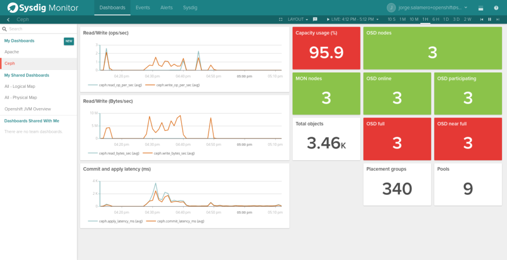
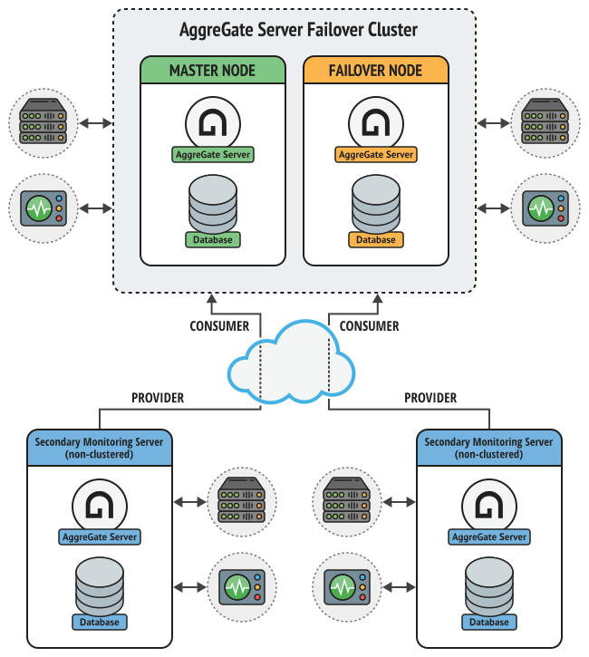
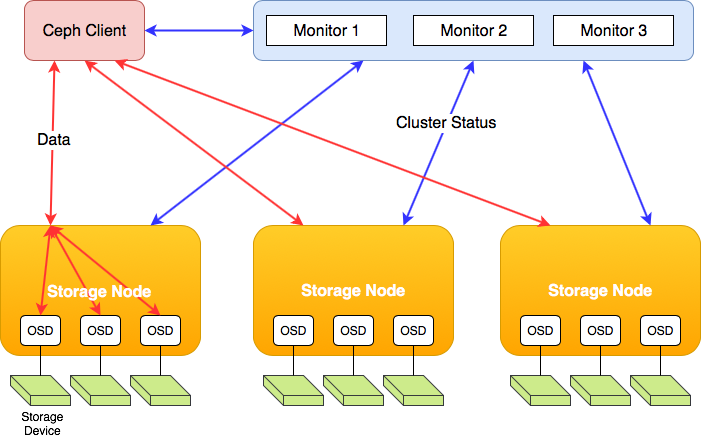
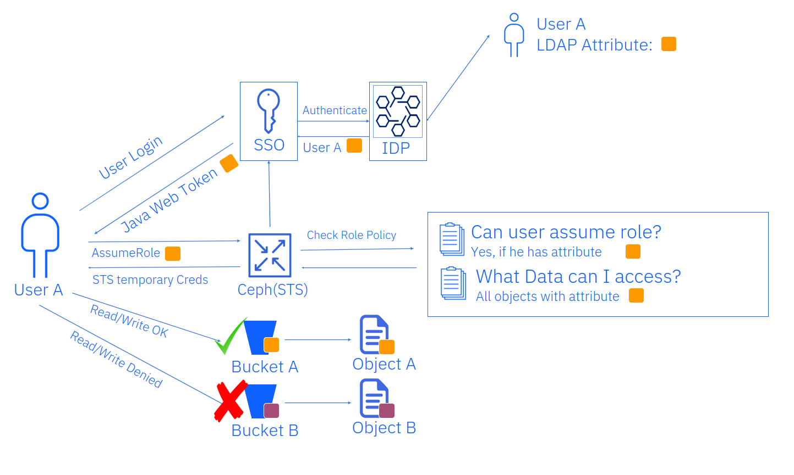

## Introduction

The Ceph Dashboard has become the default operational interface for most modern
Ceph clusters. With cephadm-managed deployments, OAuth 2.0 authentication,
integrated Prometheus and Grafana access, and multi-cluster visibility, the
dashboard is often the *first—and sometimes only—tool* operators consult to
assess cluster health.

Yet many production incidents share a familiar opening line:

> *“The dashboard was green.”*


*The Ceph Dashboard presenting a healthy cluster view — a familiar starting point for many production incidents.*


This blog explains why a green dashboard does **not** guarantee a healthy or
operationally safe Ceph cluster. Focusing on **active releases in 2026 —
Squid (19.x) and Tentacle (20.x)** — we examine persistent dashboard blind spots,
why they exist, and when operators must rely on CLI tools, logs, and metrics
instead of trusting the UI.

---

## The Role of the Ceph Dashboard

The Ceph Dashboard is implemented as a `ceph-mgr` module. It does not generate
cluster state; instead, it aggregates and summarizes information from:

- MONs (maps, quorum, health checks)
- OSDs (PG state, utilization, performance)
- MGR modules (orchestration, alerts)
- Prometheus exporters
- RGW, CephFS, and RBD subsystems

This design optimizes for:

- Fast situational awareness  
- Reduced cognitive overhead  
- Centralized access  

However, aggregation always trades **fidelity for clarity**. As clusters scale
and workloads diversify, this trade-off becomes increasingly visible.


---

## Blind Spot #1: `HEALTH_OK` Does Not Mean Operationally Safe


*The dashboard reporting a HEALTH_OK state. Summary-level indicators can hide PG instability, localized latency issues, and recovery pressure that only become visible through deeper inspection.*


A cluster reporting `HEALTH_OK` may still be operating dangerously close to
failure.

Examples observed in production include:

- Placement groups flapping between states
- Recovery or backfill throttled by scheduler limits
- Pools nearing critical fullness but averaged out at cluster level
- Latency spikes that never cross alert thresholds

The health system evaluates **current violations**, not **risk trends**.

### What the Dashboard Shows
- Overall health state
- Summary counts
- Green / yellow / red indicators

### What It Often Hides
- PG-level instability
- OSD-specific latency anomalies
- Pool-specific recovery starvation

The CLI remains authoritative:

```bash
ceph health detail
ceph pg dump
ceph osd perf
```
## Blind Spot #2: Upgrade-Time Illusions

](images/api-status-dashboard.png)

Tentacle introduces several significant improvements:

- **mgmt-gateway** for highly available dashboard and monitoring access
- **Centralized TLS management** via `certmgr`
- **OAuth-protected access** to observability services

During upgrades, however, clusters often exist in a **hybrid state**:

- New backend behavior
- Old MGR assumptions
- Mixed daemon versions

In this phase, the dashboard may:

- Report normal health while features are inactive
- Lag behind actual daemon versions
- Mask transitional inconsistencies

During upgrades, **visual reassurance is misleading**.

### Always verify using the CLI

```bash
ceph versions
ceph orch upgrade status
ceph -s
```
## Blind Spot #3: Aggregation Masks Localized Failures


*Cluster topology and CRUSH hierarchies show how failures often begin at the rack, host, or pool level—long before aggregated health indicators change.*


Large Ceph clusters almost always fail **locally before globally**.

Common examples include:

- A single rack saturating its uplinks
- One OSD class throttling IOPS
- One pool entering degraded availability

Tentacle introduces the **Data Availability Score**, but:

- It is disabled by default
- It requires explicit operator action
- UI emphasis remains limited

### Early warning signals are visible via the CLI

```bash
ceph osd tree
ceph df detail
ceph osd pool availability-status
```

## Blind Spot #4: Monitoring Without Diagnosis

With Tentacle, **Prometheus, Grafana, and Alertmanager** are fronted by the
`mgmt-gateway`, improving access, availability, and security.

Monitoring answers **“what is wrong”**, but rarely **“why it is wrong.”**

The dashboard:

- Surfaces alerts
- Displays metrics
- Shows threshold breaches

It does **not**:

- Correlate cause and effect
- Explain configuration interactions
- Identify recent behavioral changes
- Surface which change *triggered* the alert

### Incident response still depends on

- Logs in `/var/log/ceph`
- Time-correlated CLI output
- Operator experience

Monitoring provides **symptoms**; diagnosis still requires investigation.

---

## Blind Spot #5: Scheduler and Throttling Behavior

Ceph’s **mClock scheduler** dynamically balances resources between:

- Client IO
- Recovery operations
- Background maintenance

The dashboard provides high-level utilization graphs but rarely exposes:

- Why recovery is slow
- Why latency spikes under load
- Which scheduler class is being throttled
- Whether limits are policy-driven or capacity-driven

### CLI inspection is required

```bash
ceph config show osd.*
ceph osd dump
ceph tell osd.* perf dump
```

## Blind Spot #6: Security Context Is Abstracted Away


*Authentication and authorization decisions span multiple identity and policy layers. The dashboard abstracts these paths, making access failures difficult to diagnose visually.*

With **IAM accounts**, **STS**, **OAuth**, and **RBAC**, Ceph security has matured —
but the dashboard abstracts these layers heavily.

During access issues, the UI rarely shows:

- Which identity was evaluated
- Which policy caused a deny
- Whether STS or long-term account credentials were used

### Security debugging still requires

- RGW logs
- Audit records
- Direct API calls

Abstraction improves usability — but **reduces debuggability**.

---

## When the Dashboard Is the Right Tool

The dashboard excels at:

- First-look cluster status
- Administrative workflows
- Multi-cluster navigation
- Routine operations

It is **not** a forensic or diagnostic tool.

---

## Operational Best Practices for 2026

- Treat the dashboard as a **summary layer**
- Validate UI state with the CLI during anomalies
- Never rely on color alone during incidents
- Enable advanced metrics intentionally
- Train operators to distrust **“green”** under load

---

## Conclusion

The Ceph Dashboard in Tentacle is powerful, polished, and indispensable.

But no UI — regardless of sophistication — can fully represent the complexity
of a distributed storage system.

**Green does not mean safe.**  
**Healthy does not mean stable.**  
**Visible does not mean complete.**

Operational excellence in Ceph still depends on understanding what the dashboard
*cannot* show, and knowing when to look beyond it.

---
## Acknowledgements

Thanks to the Ceph community for ongoing improvements to observability,
operations, and documentation across every release.

This post is intended to share operational perspective and complement existing
tools, not to criticize current implementations. Any errors or omissions are the
author’s responsibility.
