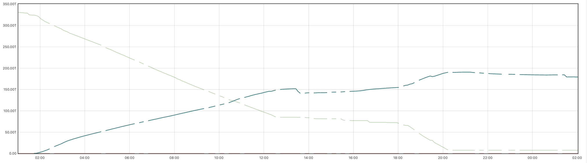

## Data expands to fill available storage (and beyond)!

It used to be that enterprise storage meant 6RU rackmount Fujitsu
2351 Eagles, each holding a mind-boggling 380 MiB of data: enough
for a whole company!

Today that 380 MiB can't even hold a 4k pickleball video.
Enterprises, educational instutitions, and really just about anyone these
days demand storage capacities that *start* on the order of hundreds
of tebibytes and rapidly grow to pebibytes.

As this article is written in the spring of 2026, the memory market, which
includes DRAM, SSDs, and legacy HDDs, has experienced a dramatic escalation
of pricing. It is not uncommon to be quoted a price four times what the
same hardware cost a year ago, and there are signs that it is going to
get worse before it gets better.

*What's a poor ammonite to do??*

Cephers find themselves between the Charybdis of quotes approaching
Disaster Area's hypermathematics and the Scylla of hungry users armed with
torches and git forks.

Git forks, pitchforks. Get it? Sigh. Tough room. Anyway...

Short of nuking the site from orbit, how do we make everyone happy, or at worst
mildly discontented?

Efficiency!

## CephFS

CephFS is a popular, highly available and scalable software-defined POSIX-style
distributed filesystem that can easily store tens of pebibytes of precious data.
Or, alternately, cat videos.

Ceph deployments often begin small, with replicated pools for perceived performance
needs. As the cluster grows to more nodes and more data, it may become feasible
and desirable to switch to Erasure Coding (EC) to make more efficient use of
raw capacity.

An EC pool thus can require substantially less raw storage for a given amount of
user data, or store gobs more user data on a given amount of raw capacity

This [EC overhead](https://docs.ceph.com/en/latest/rados/operations/erasure-code/#id2)
table presents efficiency (space amplification) factors for a spectrum of EC profiles.
Replicated pools usually maintain three copies of data, so for comparison they manifest
an overhead factor of 3.0. EC 4+2 or 6+3 presents a factor of just 1.5, with some tradeoffs,
including some space amplification for the very smallest files.

The use of EC has traditionally been limited to workloads
with modest write performance requirements. With SSDs, however, many workloads
are actually compatible with the tradeoffs of EC. Moreover, the Ceph Tentacle
release delivered the highly anticipated [Fast EC](https://ceph.io/en/news/blog/2025/tentacle-fastec-performance-updates/)
which brings EC pool performance much closer to parity with that of replicated pools,
enabling its use for workloads that previously demanded replication.

Cephers often think that once data is written to a RADOS pool, the data protection
strategy is carved in stone unless one manually and disruptively moves data to
a different pool. RGW Lifecycle policies however offer a way to transition Ceph
Object Storage data between storageclasses and pools transparently, but we're to talk
about the draft ^H^H^H erm .. CephFS

CephFS file systems / volumes typically provision one RADOS pool for metadata (`foo.meta`) and one
for data (`foo.data`). One can however attach multiple pools to a CephFS volume, which
may live on different media (HDD, mainstream NVMe SSD, coarse-IU QLC SSD) and/or employ
different data protection strategies (Replica 3, EC 4+2, EC 8+3, EC etc). When one
chooses to use EC to hold CephFS data, it's a good idea to provision at least two
data pools: the first (default) data pool holds inode backtraces and HEAD objects. When
there are no other data pools, the first data pool also holds file data.

When one or more additional (and often EC) data pools are added to a CephFS volume, inode backtraces
and HEAD objects are still placed in the first / default data pool. But how do we
place bulk file data?

One of the more obscure but very, very useful features of CephFS is the ability to
set [file layouts](https://docs.ceph.com/en/latest/cephfs/file-layouts/). These are
somewhat akin to RGW / S3 _storage classes_ in that they can be applied to CephFS
volume (sub)directories or individual files to gate data placement. Which is
downright smurfy, but when one has pebibyates of data on replicated or expensive
storage and wishes to transparently migrate it to the new data pool(s), what to
do? Setting the layout on a directory, even the top level directory of a volume,
directs _new_ files to the desired pool, but existing files must be copied to
new files in order to change their placement. Doing this with a recursive `cp`,
`tar`, or `cpio` command can be a lot of work, especially if one does not have
sufficient capacity to temporarily store an entire second copy of data. Moreover,
we need to consider symlinks, which are stored only in the `.meta` pool, files
with multiple hard links, files that are currently being written, and files
that may be read or written _while_ copying.

## The solution

Recently as a Ceph Ambassador I crossed paths with a community member storing
breathtaking amounts of data, and adding more every day. All of this CephFS data had
been traditionally stored on mainstream TLC SSDs in replica 3 pools, because
these are the defaults for performance.

Quotes for capacity expansion turned out to be dramatically higher than budgeted,
and they were in a bind.

I helped them discover that while their MDS estate is very busy, at the RADOS level
their datalake is read-mostly, with modest to moderate client read workload. They do
need the reads to be fast, but write speed is of lesser concern. This is a classic
workload for EC, and for QLC (or QLC-class) SSDs. I helped them identify additional
QLC-class SSD options, and proposed a converstion of the CephFS datalake to EC
to reclaim ... well they don't want to disclose numbers, but let's say a many zeros
of existing raw capacity to defray and defer spending until such a time that the
NAND market cools down.

Enter this ultimate answer to EC, CephFS, and everything:
a [transcoder script](https://www.reddit.com/r/ceph/comments/1l1ey87/cephfs_layoutpool_migration_script/)
posted by Reddit user `marcan42`. This script is a terrific inspiration, but
bears a number of shortcomings. I worked with the community member to enhance the
script, which can be found [here](https://www.reddit.com/r/ceph/comments/1l1ey87/cephfs_layoutpool_migration_script/) .

In a nutshell, the script walks a CephFS volume or subdirectory thereof, processing
files by creating a copy with the new file layout then atomically renaming the copy
over the original. This strategy means that clients can continue to access data without
risk of disruption, corruption, or divergence. Care is taken to avoid symlinks
and to properly handle files with multiple hard links.

By working on one file at a time, we avoid the need for enough
unused capacity for a second if temporary copy of a directory tree or even
entire volume. Because if we had that kinda space, we mostly wouldn't be
having this conversation. Mostly. This approach also helps avoid divergence and
reduce or eliminate the need for laborious cleanup in the event of a network
or client host outage.

Painstaking care is taken to detect files that change while being processed so that they
are not diverged, corrupted or deleted. Options are present to constrain the files
that are transcoded:

* To a specific subtree of a volume
* To files that are not multiply hardlinked, out of an abundance of caution
* To files older and/or newer than a specified number of days, especially when
  older files are much less likely to be changed or deleted during processing
* To files above a specified minimum size.

The script by default processes four files in parallel; this number may be adjusted
on the command line to trade off network and client impact against elapsed time.

When using EC, the very smallest files
can actually consume *more* raw capacity than replication. The FastEC improvements
in the Ceph Tentacle release reduce but do not eliminate this concern. In releases
before Tentacle, RADOS always writes complete stripes.
When using conventional media, and with OSDs created on releases newer than
Octopus, the default value of `bluestore_min_alloc_size` is 4KiB. Say we're using
an EC 8+3 data pool and a user creates a 1 byte file. A full-stripe write will
allocate `11 * 4 = 44KiB` of raw storage. For a single file this is negligible,
but with millions or billions of files this _space amplification_ adds up.

This [fantastic resource](https://www.spinics.net/lists/dev-ceph/msg00795.html) from
Mark Nelson quantifies and visualizes this space amplification dynamic, which in
the Octopus / Pacific area lead Ceph developers to enable lowering the
default `bluestore_min_alloc_size`. Today, however, coarse-IU QLC SSDs are
an increasingly compelling alternative to both conventional TLC SSDs and HDDs.
They offer cost effectiveness and fantastic density: as of March 2026,
U.2 SKUs with the incredible capacity of 245 tebibytes are entering the market.

These however do best when `bluestore_min_alloc_size` is matched to the IU,
which is usually 16 KiB, but for older drives may be as high as 64 KiB. For
conventional media and popular EC profiles a minimum size of, say, 500 KiB
may be specified to avoid space amplification. For many deployments, much
larger files may render a bit of space amp for tiny files more or less moot,
but the option is there so that individuals may choose what's right for
their file demographics.

It is said that a picture is worth 1024 words, so here's another obigatory
contextually appropriate AI-generated octopus:

Oh, you want hard data. ABOUT THE TOPIC. Fine. Be like that.

This first graph shows the raw capacity used by the original
Replica 3 data pool of a real-world CephFS volume in green, and the
capacity used by the new EC 6+3 pool in blue. The barely-visible
red line depicts the obligatory `.meta` pool. (Ignore the dots,
they are Prometheus scraping artifact). One can see readily that as the
amount of data consumed by the first pool decreases the amount consumed
by the new pool rises -- but at very roughly half the rate. This is
expected when transcoding from Replica 3 (space amp 3.0) to EC 6+3 (space
amp 1.5). The spans where the lines flatten out somewhat correspond to
expanses of files that were too new, too small, symlinks, or multiply linked.
The script can handle multiply-linked files, but with as many as 7000 (!)
links to some files, those are skipped for the initial runs.

This transcoder run specified:
* 15 threads
* Minimum 500 KiB file size
* Minimum 1 day file age
* Skipping multiply-linked files
* A 6+3 EC policy

With these options, files were processed at 5-15 TiB per hour.
Your mileage may vary.

This second graph shows the sum of the series in the above graph, more
simply visualizing the aggregate savings in underlying raw capacity.
Here we can see that the subject volume consumed roughly 330 TiB
before transcoding, but only 185 TiB after, reclaiming 44% of raw
capacity. The 7% deviation from the theoretical ideal is the
cumulative effect of files too small, too new, or too multiply linked
for transcoding.

The beauty of this approach is that the script is _idempotent_. One may
run it again with different, or even the same parameters to pick up
files as they pass the minimum age cut-off, or with a smaller threshold.
The community member that inspired this post is not yet running Tentacle;
once they have upgraded and enabled EC optimizations on their pools, they
plan another pass over the data with a smaller threshold.

One does not need to re-run the transcoder to pick up newly-created files,
as the process leaves the default layout for the directory (which may
be the volume's root) set to the new pool. It is possible, with repeated
runs, to arrange arbitrary subdirectory trees to use one layout (pool) or
another, with inheritance and overriding. It is even possible to migrate
desired subsets of data *back* to the default pool, or to another pool
on different media. The script is written in a way that it does not
reprocess files if they are already set to the target layout, ensuring
idempotence.

This process does entail the creation of an additional RADOS pool for each
CephFS volume transcoded, so be sure to account for that in your manual or
autoscaler PG strategy. While not widely known, Ceph currently has a hard
limit of 256 CRUSH rules per cluster. The transcoding setup script takes
care of creating new EC profiles and CRUSH rules only as necessary,
re-using them for additional CephFS volumes with the same profile.
When executing, take care to manage ``pg_num`` on both old and new
pools, via the PG autoscaler or other means.  As data is moved off
the old pool, the PG budget it was allocated can be reduced, and PGs
added to the new pool.

As a rule of thumb, a PG / shard should hold no more than
roughly one hundred thousand RADOS objects, or 200 TiB. Remember that
the old pool may still hold many RADOS objects, but not much data
volume, so avoid the temptation to reduce ``pg_num`` too low. The
little-used ``rados df`` command can help gauge what's right. Also
remember that EC PGs are sharded, so in the above example, each EC 6+3
shard is only 16% the size of the previous replica 3 PGs, so don't
overdo ``pg_num`` on a new EC pool. Depending on the EC profile,
the sufficient value for the new pool may be 25% or so of the original
replicated pool's value.

The setup script that manages pools and layout xattrs now has an option
to create a new pool with a specified number of PGs. It's best to get
this at least vaguely right up front, when PG creation is fast and painless
on an empty pool. Splitting or merging PGs later when the pool holds
tebibytes or pebibytes of data is much slower and more impactful.

When migrating between two EC profiles, use your judgement.

To-do: filter on filename regexes.

This has not been tested on CephFS subvolumes, nor has it been
tested transcoding back to a replicated volume. This analysis and
code are presented as-is with the goal of delivering value to the Ceph
community. No warranty or support should be inferred. It is free,
and worth every penny.

Do not taunt the script or stare into it with remaining eye.

Suggestions or improvements are welcome, on a best-effort basis.

The upcoming Umbrella release is expected to introduce [transparent
pool migration](https://docs.ceph.com/en/latest/dev/pool-migration-design/)
at the RADOS layer. This ability will be very useful and may one
day obviate the script discussed here, though one should approach
its use carefully after thorough testing. The need for compatible
clients will, notably, limit the ability of many CephFS deployments to use
that new approach until compatible kernels make it into your Linux
distribution(s) in use. The file-layout based approach we've explored
here works until the new transparent migration can be rolled out.

## About the author, Anthony D'Atri

* Ceph at scale since 2014
* (Successfully since 2017)
* Ceph Ambassador
* Ceph Documentation Lead
* Author: _Learning Ceph, Second Edition_
* QLC fanboy
* Ceph is quite graphically a part of me
