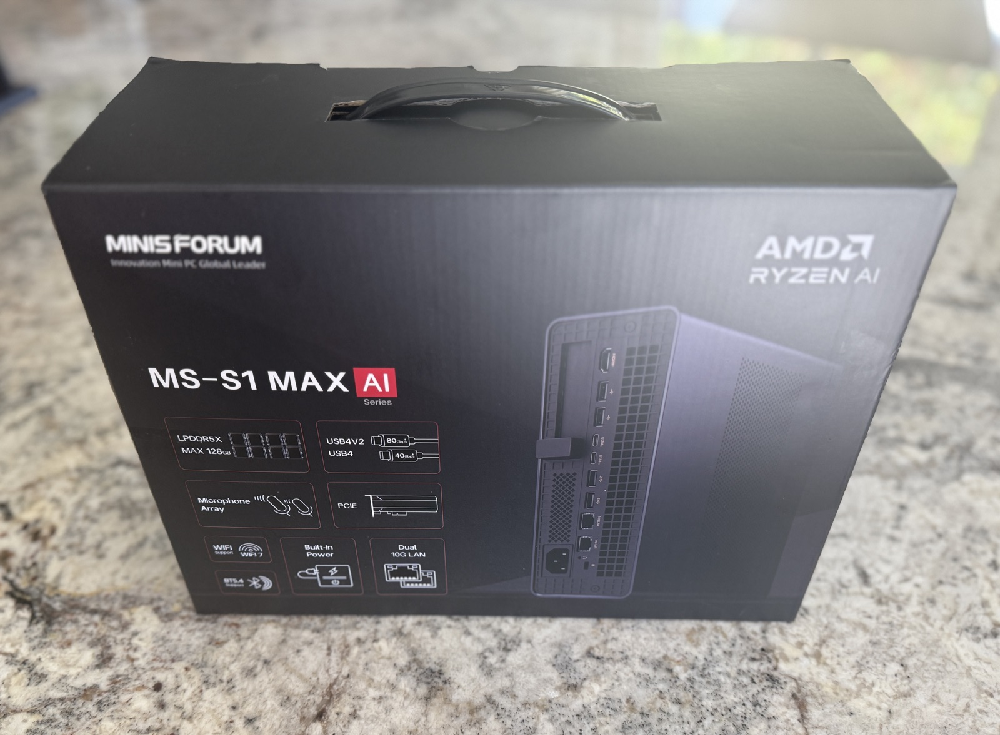
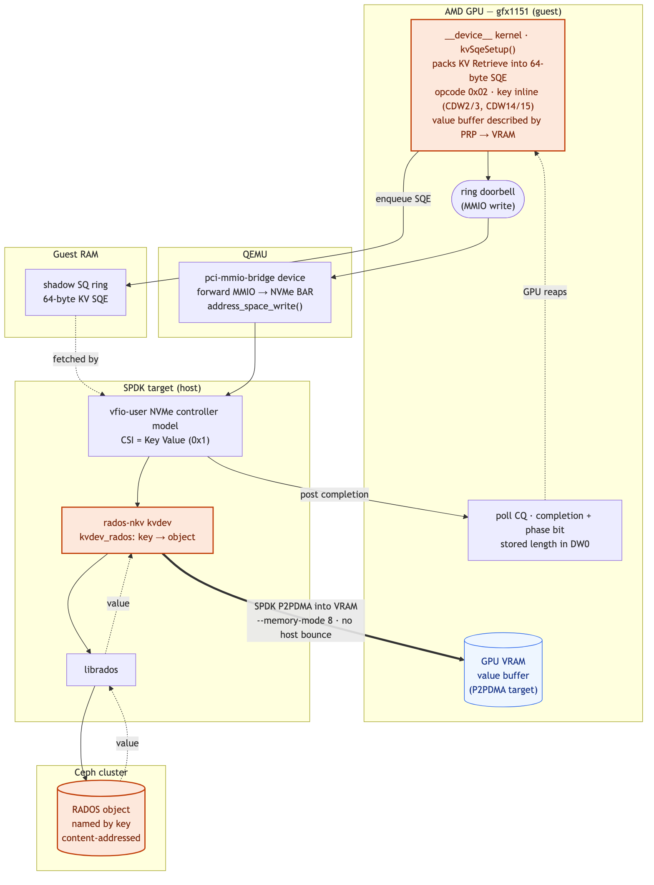

# For whom the door-bell tolls

In a [previous post](https://ceph.io/en/news/blog/2025/vllm-kv-caching/) we extolled the benefits of KV caching, a technique to save the KV states from the prefill step of LLM-based inference to reduce time to first token (TTFT) and skip redundant computation. I co-presented this with Tushar Gohad at [Cephalocon](https://youtu.be/axCO66f7fYA?si=VRWDSmk95nkRCdc3). Since then I've been thinking a lot about how to improve the state of the art. Really move the needle. We've made strides in a lot of areas in Ceph, especially the work going into [Fast EC](https://youtu.be/ll_T7Wphz7A?si=U_myBa2uPT5j3_C3) — if you don't know what I'm talking about you should check it out, it promises huge benefits to a large category of workloads. That's not what we're here for today, though.

Last year there was one paper that stuck in my mind, which is fairly remarkable because I read on the order of 130. That paper was [GPU-Initiated On-Demand High-Throughput Storage Access in the BaM System Architecture](https://arxiv.org/pdf/2203.04910). I struggled with this. It describes a system where a CPU loads a kernel into the GPU that allows the GPU to serve as an NVMe initiator. The struggle was rooted in the fact that block just felt like the wrong interface for KV caching. If you use block, then you need a lookup table that maps the hash of the sequences representing a cache block to a particular `(device, offset, length)` tuple. It begs for a content-addressable approach with no centralized lookup or coordination. On the other hand, what was described in the paper was just flat-out more electrically efficient. I couldn't have my cake and eat it too.

## The idea: RADOS, spoken as NVMe key-value

In 2025 we also saw the first ratified version of the [NVMe key-value command set specification](https://nvmexpress.org/specification/key-value-command-set-specification/). We already have a Ceph implementation of NVMe/TCP that leverages SPDK, and it seemed like we could add support fairly easily for the key-value command set.

For those who don't know the internal mechanics of Ceph, the native API operates against RADOS objects. RADOS is richer than most object stores: it supports reads and writes to arbitrary offsets, deletes, key-value storage (OMAP), watch/notify notifications, and a class system to execute code against objects (`cls`). How could we find an intersection between the full power of RADOS and GPU-initiated storage?

What I came up with is exposing RADOS via NVMe key-value commands:

| NVMe-oF concept | RADOS concept |
| --- | --- |
| Subsystem | Pool |
| Namespace | Namespace (in pool) |
| Key (1–16 bytes) | Object name (oid) |
| Value | Object data |

The other fun idea — hold onto this one, it comes back — was a vendor-specific command extension to allow the execution of classes against objects. The classic example is thumbnailing an image, but it could be something more interesting, like extracting an embedding. Computational-storage stuff, executed where the data is at rest instead of dragging it across the network to be executed on some other host. We probably don't want random applications running any class against any object, though, so let's have an out-of-band gRPC server that provides a control interface to allowlist particular classes to specific namespaces, and map those allowed classes to opcodes.

## Building rados-nkv (overnight, by agents)

It was the afternoon of June 4. I had the start of a plan and the NVMe key-value specification, and it was time to `/grill-me-with-docs`. After some Q&A with my agentic pals, I decomposed the work into a task DAG, with an adversarial review task paired to each coding task — sub-agents with bounded contexts, arguing with other sub-agents for better quality, a coordinator agent running the merge queue and dispatching work as it unblocked. I set the whole thing on a loop, then went to walk the dog and peek in on the agentic factory from my phone. There's a pleasing recursion here: I was building infrastructure for AI workloads *using* AI workloads.

The first agent made a surprising find: NVIDIA had recently [added an NVMe KV client to SPDK](https://github.com/spdk/spdk/commit/93cf1ebc57cea99caba6c68f30354f93dce90ffd). That undoubtedly made things easier — we had a reference client to work against. I was tapped out, time for me to sleep, while the factory whirs.

The next morning I grabbed my coffee and checked in to see what sort of breakfast had been prepared. I have to say, the dish was perfectly plated, and the flavor was like a breakfast burrito from a San Diego taqueria. On this day [**rados-nkv**](https://review.spdk.io/c/spdk/spdk/+/28851) was born — a complete SPDK controller exporting a RADOS-backed NVMe key-value namespace over [vfio-user](https://github.com/nutanix/libvfio-user). Tested end-to-end. Logically, it looks like this:


*The KV control path, proven over a vfio-user loopback — no VM, no network. Key → object, one RADOS object per KV pair, tenancy carried by the RADOS namespace.*

We'll need some things to talk to this newfangled key-value namespace, of course. The first order of business is a [rados-nkv NIXL plugin](https://github.com/ai-dynamo/nixl/pull/1717), since NIXL is used by both [llm-d-kv-cache](https://github.com/llm-d/llm-d-kv-cache) and [LMCache](https://github.com/lmcache/lmcache) to offload KV-cache blocks from vLLM over the kv-connector interface. For bonus points, we'll whip up [rados-nkv-weights](https://github.com/mmgaggle/rados-nkv-weights) to let vLLM stream model weights from rados-nkv.

## A flashback to BaM

Around this time a colleague asked me if I was going to SNIA's SDC, which triggered me to scan the sessions on the docket. Serendipitously, I saw [Stephen Bates](https://www.linkedin.com/in/stephen-bates-8791263/)'s abstract: **GPU-Initiated NVMe: Cutting the CPU Out of the Accelerator-to-Storage Data Path.** This gave me an immediate flashback to the BaM paper. The rados-nkv prototype was working, and as-is it would be a big improvement for AI workloads — but what if we could realize *GPU-initiated* IO to it? DMA-buf changes are [landing in the Linux kernel](https://lists.freedesktop.org/archives/dri-devel/2025-October/529924.html) that might just open up a viable path.

I pinged Stephen on LinkedIn, who indicated that ROCm XIO was the droid I was looking for.

Up to this point my mad science had been conducted from the meek confines of a cloud VM. I'd need a physical machine with a real AMD GPU.

## A monetary value on cached tokens

I'd been eyeballing Strix Halo Mini PCs as a development machine for x86 builds of Ceph, that would also let me experiment with vLLM. This dovetails into another idea I'd been spitballing with the llm-d folks: adding [explicit caching to the serving API](https://github.com/mmgaggle/vllm/tree/feat/prompt-cache-params) and wiring it into the [kv-connector](https://docs.vllm.ai/en/stable/api/vllm/distributed/kv_transfer/kv_connector/). The idea is simple — everyone gets automatic prefix caching, and agentic harnesses can *explicitly* request caching of prefixes associated with system prompts and other repeated context, with an optional TTL.

Doing so provides a mechanism to associate a monetary value with cached token-hours, whether for internal chargeback or as an additional service offering for model- or token-as-a-service providers. You need controls like this — or some sort of tenant-partitioned cache — to stop enterprising engineers and their agents from setting up a `/loop` that keeps their prefixes hot and pushes out the contexts of less Machiavellian engineers. If that's not a good enough reason for you, maybe the fact that [Google](https://ai.google.dev/gemini-api/docs/pricing#gemini-3.5-flash) and [Anthropic](https://platform.claude.com/docs/en/about-claude/pricing#model-pricing) do it is.

Anyway, I started to wonder: could I pass the iGPU from a Strix Halo box into a QEMU guest? I stumbled on a [guide by a Proxmox user](https://github.com/Uhh-IDontKnow/Proxmox_AMD_AI_Max_395_Radeon_8060s_GPU_Passthrough/) that suggested it just might work. I cajoled my wife into authorizing a trip to Microcenter to pick up a Strix Halo Mini PC.



## Setup, and a deliberately boring first target

Had to rummage around for a USB stick to boot from, only to find two paltry 512 MB ones. I resorted to cannibalizing my GoPro's microSD card. Fedora 44 was the weapon of choice, since I needed a kernel with all the recent dma-buf goodies. Imaged. After a brief side quest benchmarking Kimi-Linear-48B-A3B-Instruct with a Q6_K quant using llama.cpp — and pointing Claude Code at the Anthropic-compatible messages API for funsies — it was time to get back to business.

First up: take a rados-nkv device and pass it to a guest via vfio-user. Working. Next: pass the iGPU into the guest. There are several tricks. The main one is that the host cannot touch any of the associated PCIe devices, so you blacklist the kernel modules that interact with the iGPU. You also extract the AMD driver and vBIOS ROM files to pass as PCIe devices to the guest. I set up a "no GPU" boot option as a fallback, because the moment the kernel loads with no video driver, you've got a headless node. Rebooted the host, connected remotely, and configured GPU passthrough with vfio-pci. I now had a guest with both a rados-nkv namespace and an 8060S GPU.

As much as I wanted to go straight for the prize — GPU-initiated IO to a *key-value* namespace — it was wiser to start boring: pass a conventional NVMe **block** namespace backed by RBD. GPU-initiated IO to a block namespace is already a known quantity, so it makes the perfect dress rehearsal: if it breaks, the bug is in my plumbing, not in anything novel.

## How ROCm XIO drives a queue pair

[ROCm XIO](https://github.com/ROCm/rocm-xio) is the piece that lets GPU code drive an NVMe queue pair. Its `nvme-ep` ("endpoint") runs a `__device__` kernel that:

1. Writes an NVMe Submission Queue Entry (SQE) — a 64-byte command — into the SQ.
2. Rings the SQ-tail doorbell to tell the controller "go."
3. Spins on the Completion Queue, watching the phase bit flip.
4. Rings the CQ-head doorbell to acknowledge the completion.

A companion kernel module (`/dev/rocm-xio`) handles the privileged glue: pinning queue memory, intercepting the kernel NVMe driver's admin commands to inject the right physical addresses, and exporting GPU VRAM buffers for peer-to-peer DMA. Long term the upstream NVMe Linux driver might be updated to accommodate userspace requests for IO queues, sparing this interception dance — but that's a discussion for another day. Crucially, the queues, doorbells, and data buffers can each live in host RAM or GPU VRAM, selected by a 4-bit `--memory-mode` mask:

| bit | `0x1` | `0x2` | `0x4` | `0x8` |
| --- | --- | --- | --- | --- |
| structure | SQ | CQ | doorbell | data buffer |

Mode `0x0` = everything in host RAM. Mode `0x8` = flip just the data buffer into VRAM, so the payload P2P-DMAs straight into GPU memory. Mode `0x8` is the whole point; mode `0x0` is the "make it work first" baseline.

On the host, SPDK's `nvmf_tgt` presents an emulated NVMe controller over the vfio-user protocol: a Unix socket that speaks the VFIO device model. QEMU connects with a `vfio-user-pci` device, and the guest sees a perfectly ordinary `/dev/nvme0`. The clever bit — which becomes central later — is that SPDK advertises the NVMe doorbell registers (BAR0 offset `0x1000`+) as a sparse-mmap'd shared page by default. The client mmaps it; doorbell writes land in shared memory; SPDK's poll loop reads the new tail value. No socket round-trip per doorbell.

## The spell fizzles

Excitement builds. It's time to summon GPU-initiated IO. The spell is cast. Fizzle.

Turns out the GPU and the QEMU-emulated doorbell live in alternate dimensions: the GPU needs to peer-write to a *physical* BAR, and our NVMe device is stranded in the world of software-defined wonder. I needed a portal — a bridge between these two dimensions. A light bulb went off in my head. Or a doorbell rang. Something of the sort.

There was another SDC session Stephen had on the agenda:

> This talk presents a different approach: a standalone userspace server that emulates a complete PCIe RDMA NIC via the VFIO-user protocol. Built on Nutanix's open-source libvfio-user library, the server exposes PCI BARs to an unmodified QEMU/KVM guest, which loads a companion kernel driver and a custom rdma-core provider. Applications in the guest see a standard InfiniBand device and use ordinary libibverbs calls — `ibv_post_send`, `ibv_poll_cq`, perftest, iperf3 — with no guest-side awareness that the device is emulated.

After some sleuthing, a [QEMU branch Stephen had created](https://github.com/sbates130272/qemu) was discovered, and in it was something wonderful: `pcie-mmio-bridge` support. The power to bind physical hardware to the software-defined world was in my hand, and I was ready to abuse the heck out of it. Rolled it into a binary, and it was game time. The moment of truth. Fizzle.

```
NVMe CQ poll timeout after 10000000 polls (cq_head=0 expected_phase=1)
:0:rocdevice.cpp :3587: Queue aborting with error :
HSA_STATUS_ERROR_EXCEPTION code: 0x1016 rocm-xio ERROR: nvme-ep:
gpuKernel sync failed for queue 8 (719)
```

The GPU built its command, rang the doorbell, and then spun forever waiting for a completion that never came. The `0x1016` GPU exception is a symptom: it's the `__builtin_trap()` the kernel hits after the CQ-poll loop gives up. The real question is why no completion was ever posted.

I had a half-dozen plausible theories: wrong memory mode, a doorbell-stride mismatch, `hipHostRegister`-of-MMIO not routing GPU writes correctly on an integrated GPU, SPDK not being P2P-capable into VRAM, CQ-phase logic, the SMU being flaky. Most of them were wrong. All of them were expensive to test. Brutal, even.

On this APU, the GPU's SMU (System Management Unit) is platform-owned. Passing the iGPU through and then having a guest fault on it leaves the SMU in a state the next guest cannot re-initialize:

```
amdgpu: PSP create ring failed!
amdgpu: hw_init of IP block <psp> failed -22
```

Only a full host reboot clears it. And — the part that really hurts — even a *successful* run dirties the SMU on guest teardown. So the budget was literally **one GPU shot per host reboot.**

## The bug hunt: prove, don't try

Guess-and-check was not an option. With a one-shot-per-reboot budget, the methodology had to change from "try things" to "*prove* things."

### Step 1 — Trace all three codebases at the source level

Before touching the GPU again, we read the actual code on all three sides of the completion path and confirmed it was correct *by construction*:

- **QEMU bridge:** forwards via `address_space_write` to `pci_get_bar_addr(target, bar) + offset` — model-agnostic, reaches any BAR including a vfio-user one.
- **SPDK `lib/nvmf/vfio_user.c`:** doorbells at `0x1000`+ are sparse-mmap'd; the poller reads `*sq_dbl_tailp` from that shared page every tick; `post_completion` writes the CQE to guest memory and flips the phase bit with **no interrupt required** (a polling client sees it). Offsets matched: SQ tail at `0x1000 + 2·qid·4`, exactly what rocm-xio computes.

Conclusion: on paper, the entire path works. So the bug was dynamic, not structural.

### Step 2 — A reboot-free, GPU-free isolation test

Here's the trick that broke the problem open. The GPU and the bridge↔SPDK plumbing are **separable.** So we wrote a tiny CPU program (`cpu_bridge_probe`) that maps the bridge's shadow ring and drives it *from the CPU* — no GPU, no passthrough, no reboot. It issued the same ring commands the GPU would, and read NVMe controller registers back through the bridge:

```
[1] READ NVMe VS   (BAR0 0x08) -> COMPLETE value=0x20000 (NVMe 2.0)
[2] READ NVMe CAP  (BAR0 0x00) -> COMPLETE value=0x80000201e0100ff
[3] READ NVMe CSTS (BAR0 0x1c) -> COMPLETE value=0x1 (RDY=1)
[4] WRITE SQ doorbell (0x1008) -> COMPLETE
VERDICT: bridge<->SPDK round-trip WORKS from CPU
```

Those `VS`/`CAP`/`CSTS` reads come from SPDK's *non*-mmap'd register region, so they did a full vfio-user socket round-trip to the controller and back. **The bridge, vfio-user-pci, and SPDK were proven flawless — from the CPU.** Which meant the bug was specifically in the *GPU's* interaction with the shadow ring. We had cut the problem in half without spending a single GPU boot.

### Step 3 — Instrument, don't guess

The QEMU bridge already had trace events. We enabled `pci_mmio_bridge*` tracing and took *one* instrumented GPU shot. The trace was damning — and surprising:

```
338 × pci_mmio_bridge_invalid_command command=0
  1 × pci_mmio_bridge_poll_processed   processed 338 commands
  0 × pci_mmio_bridge_write
```

The bridge processed **338 zeroed commands in a single poll** — and, critically, this happened **even on a boot where amdgpu failed to initialize and the GPU kernel never ran.** That single observation exonerated the GPU entirely. The garbage wasn't coming from the GPU at all. Something else was writing a bogus `producer_idx` over an all-zero command region.

### Bug #1 — a guest-physical address collision

The shadow ring lived at `shadow-gpa = 0x80000000`. The guest console told the whole story:

```
pci_bus 0000:00: root bus resource [mem 0x80000000-0xdfffffff window]
pci 0000:00:01.0: [1234:1111] class 0x030000 BAR 0 [mem 0x80000000-0x80ffffff pref]
```

`0000:00:01.0` is the QEMU **standard VGA framebuffer** (the boot display). With 2 GB of guest RAM, the 32-bit PCI MMIO window *starts* at `0x80000000` — and the VGA's 16 MB framebuffer BAR landed **exactly on top of the shadow ring.** The bridge was faithfully polling the VGA framebuffer and interpreting pixels as ring metadata. Every GPU doorbell write was also vanishing into the framebuffer. The GPU-free CPU test had worked only because *its* device layout left `0x80000000` clear.

The fix: move `shadow-gpa` out of the PCI window entirely, into the free gap above 4 GB:

```diff
- shadow-gpa=0x80000000
+ shadow-gpa=0x100000000   # above 2GB RAM, above the 32-bit PCI window,
                           # below the 64-bit PCI window (0x380000000000)
```

We validated this **reboot-free** with the CPU probe at the new address: clean ring (`producer=0`, no garbage), all reads round-tripping. None of the GPU-coherence theories had been right. It was an address-space overlap.

### Bug #2 — 1024 > 256

With the collision gone, the next GPU shot produced the first *clean* doorbell:

```
pci_mmio_bridge_write BDF=0x0028 BAR=0 offset=0x1040 value=0x1 size=4
```

A real, valid SQ-tail doorbell for queue 8 (`0x1000 + 2·8·4 = 0x1040`), forwarded perfectly to the NVMe BAR. The GPU→shadow→bridge→SPDK path was *working.* But still no completion — and now SPDK's log said exactly why:

```
handle_create_io_q: *ERROR*: invalid I/O queue size 1024
handle_create_io_q: *ERROR*: invalid I/O queue size 1024
handle_del_io_q:    *ERROR*: I/O sqid:8 does not exist
```

Recall `CAP = 0x80000201e0100ff` from the CPU probe. The low 16 bits — **MQES, Maximum Queue Entries Supported** — are `0x00ff = 255`, i.e. a max queue size of 256. But `rocm-xio` hard-codes **1024-entry** queues. SPDK rejected both `CREATE_IO_CQ` and `CREATE_IO_SQ`, so **queue 8 never existed** — and the GPU's perfectly-delivered doorbell rang for a queue that wasn't there.

The fix (SPDK-side, no GPU rebuild): raise the controller's advertised queue depth.

```
nvmf_create_transport -t VFIOUSER -q 1024 -m 16
```

Again validated **reboot-free** with the CPU probe — `CAP` went `...0100ff` → `...0103ff`, MQES `255 → 1023`. The controller would now accept 1024-entry queues.

Two bugs. A framebuffer overlap and a queue-size ceiling. *Neither* was CQ handling, memory mode, `hipHostRegister`, SMU, or GPU coherence — every exotic theory we'd been afraid of was wrong.

## The payoff: GPU-initiated reads, from RADOS, into VRAM

### First GPU-initiated read

With both fixes, the next boot:

```
=== *** FIRST GPU-INITIATED NVMe READ *** ===
Iterations: 50
Test completed successfully!
```

And the bridge trace showed a *fully GPU-driven queue pair* — SQ-tail doorbells at `0x1040` and CQ-head doorbells at `0x1044`, counts marching up as the GPU submitted reads and reaped completions on its own.

### Now from RADOS

Swap the Malloc backend for `bdev_rbd` pointed at `rbd/gpuimg`, and the RADOS counters prove the bytes came from Ceph:

```
RD_OPS 65 → 249     RD 49 KiB → 2.1 MiB     (during the GPU run)
```

The gfx1151 iGPU drove NVMe block reads from `__device__` code → the bridge → SPDK → `librbd` → a RADOS OSD. **A GPU reading from a distributed storage cluster, no guest CPU in the datapath.**

### Latency: stop being the bottleneck

The first runs clocked ~987 µs/IO — suspiciously close to the bridge's **1 ms** poll interval. Dropping `poll-interval-ns` from `1000000` → `10000` (10 µs):

```
mode 0:  Min 105 µs · Avg 210 µs · Max 367 µs
```

The bridge is no longer the limiter; the storage is. That's exactly where you want to be.

### Mode 8: the payload lands in VRAM

The finale of the dress rehearsal. Flip the data buffer into GPU memory (`--memory-mode 8`) and the kernel log shows the peer-to-peer path lighting up:

```
rocm-xio: Passthrough NVMe — using P2PDMA IOVA
rocm-xio: ✅ P2PDMA address: 0x6e00000 (size: 2097152)
rocm-xio: Registered buffer ... (P2PDMA attachment kept alive)
Iterations: 50   Average: 136.24 us   Test completed successfully!
```

`rocm-xio` allocated the read buffer in **GPU device memory**, exported it via **P2PDMA** to a guest-physical IOVA that SPDK can reach through its vfio-user DMA map, injected that as the read command's PRP, and **SPDK DMA'd the RADOS payload directly into GPU memory** — no host bounce. It was even *faster* than mode 0 (136 µs), partly because there's no host copy and partly because the RBD object was warm.


*The block-first proof — note the backend is `bdev_rbd`/`librbd` against an RBD image, **not** rados-nkv. This is the dress rehearsal, not the headline.*

Block done. Now for the thing the post is named for.

## GPU-initiated IO to the KV namespace

The RBD run was always the warm-up. GPU-initiated IO to a *block* namespace is, as the BaM paper showed, already a known quantity — and block is the very interface this whole project argues is wrong for KV cache. The actual summit was getting that same GPU-initiated, CPU-free, payload-into-VRAM path to terminate at a **key-value** namespace backed by RADOS objects: content-addressed, no `(device, offset, length)` lookup table, no coordinator.

That meant [teaching ROCm XIO a new dialect](https://github.com/ROCm/rocm-xio/pull/177). Its `nvme-ep` kernel knew how to build exactly one kind of SQE — a block read: opcode `0x02`, an LBA, a length. A KV Retrieve is a different 64-byte command: the key travels *in the command itself*, and the value buffer is described by the usual PRP/SGL the GPU already knows how to point at VRAM. So the kernel-side work was to stop emitting block opcodes and start emitting key-value ones.

Concretely, the new `kvSqeSetup()` packs a KV Retrieve into the 64-byte SQE like this. The opcode is `0x01` for Store / `0x02` for Retrieve — numerically the same as block write/read; the controller routes it as key-value not because of a distinct opcode space but because the namespace's Command Set Identifier is **Key Value (`0x1`)**. The key — up to 16 bytes — rides *inline in the command*: bytes 0–7 in CDW2/CDW3 and bytes 8–15 in CDW14/CDW15, with the key length in CDW11`[7:0]` and the requested value size in CDW10. The value buffer is described by the ordinary data pointer (PRP1/PRP2 in the DPTR) — the *exact same field* a block read uses for its destination. That last part is the whole reuse dividend: the VRAM dma-buf the GPU already knows how to aim a block read at is described identically for a KV Retrieve, so the existing `calculatePrps()` path that resolves a VRAM **P2PDMA** IOVA under `--memory-mode 8` needs no changes at all. The only genuinely new kernel-side code is the SQE field-packing; everything about *where the value lands* is shared with the block path. (The true stored length comes back in the completion's DW0 — a field we'll have a small war story about in a moment.)

On the *target* side, almost nothing changed — which is the whole reward for having proven the plumbing generic. The doorbell → shadow ring → `pci-mmio-bridge` → vfio-user → SPDK path is interface-agnostic; it forwards MMIO and posts completions without caring whether the command is a block read or a KV Retrieve. We simply put the **rados-nkv kvdev** behind the NVMe controller model instead of `bdev_rbd`. Now a Retrieve SQE the GPU rings becomes a `kvdev_rados` lookup → `librados` → a RADOS object named by the key.

### First GPU-initiated KV Retrieve

```
✅ GPU-initiated NVMe-KV → Ceph/RADOS — proven end-to-end

The one post-reboot shot landed first try (staging everything before the launch was the trick):

host:  GPU bd:00.0  Kernel driver in use: vfio-pci   (kernel 6.19.10)
guest: rocm-xio nvme-ep --kv-op store --memory-mode 8 --pci-mmio-bridge
        Detected PCI MMIO bridge at 0000:00:08.0
        Model: AMD Radeon Graphics
        NVMe /dev/nvme0 (PCI 0000:02:00.0) VID=0x4e58 -> PASSTHROUGH
        Test completed successfully!
Ceph:  rados ls kvpool/gpukv   -> 6770756b65793031   (= hex "gpukey01")
        rados stat              -> kvpool/6770756b65793031  size 4096

Chain: GPU __device__ code → doorbell MMIO → QEMU pci-mmio-bridge → SPDK vfio-user NVMe-KV → kvdev_rados → librados → a RADOS object in Ceph.
```

The bytes are real, not a zero-filled placeholder. Seed the GPU's value buffer with a known LFSR pattern (`--lfsr-seed 0xC0FFEE`) on the Store, and that exact pattern shows up as the RADOS object's data:

```
$ rados -p kvpool -N gpukv get $(printf gpukey01 | xxd -p) - | xxd | head -3
00000000: 543c f4ed 6793 fd9e 806b 6a17 7cc9 44e9  T<..g....kj.|.D.
00000010: 6b50 02fb e02b 1108 314d ca9a 30a8 f2e9  kP...+..1M..0...
00000020: 3de4 43e4 1340 1515 6b05 d5c1 4a86 ef61  =.C..@..k...J..a
# sha256 = ea1b6431…  (not the all-zeros hash) — the value the GPU stored, by key.
```

And the finale for real. With `--memory-mode 8`, the value the GPU asked for by key — fetched from a RADOS object by SPDK — P2P-DMAs straight into GPU memory:

```
guest: rocm-xio nvme-ep --kv-op retrieve --key gpukey01 --memory-mode 8 --pci-mmio-bridge
        NVMe /dev/nvme0 (PCI 0000:02:00.0) VID=0x4e58 -> PASSTHROUGH
        KV retrieve OK: returned value length = 4096 bytes
        Iterations: 50   Average: 140.21 µs/IO      (bridge poll-interval-ns = 10000)
kernel: rocm-xio: Passthrough NVMe (0000:02:00.0) — using P2PDMA IOVA
        rocm-xio: ✅ P2PDMA address: 0x11c200000 (size: 2097152)
        rocm-xio: Registered buffer ... (P2PDMA attachment kept alive)
```

That **140 µs/IO** is the same story as the block dress rehearsal, one interface up. Run with the bridge's default 1 ms poll, the KV Retrieve sits at ~991 µs — poll-bound, exactly as block did. Drop `poll-interval-ns` to 10 µs and it collapses to **140 µs**, landing right on top of the block path's 136 µs: at that point we're past the bridge and into the real RADOS read latency. The bridge is not the limiter; the cluster is — which is precisely where you want to be, and it's the *same* floor whether the command is a block read or a KV Retrieve.

That's the thing the whole post was named for, the doorbell finally tolling for the right interface:

> **A GPU, from `__device__` code, issues an NVMe key-value Retrieve; the value — sourced from a RADOS object in a distributed Ceph cluster — lands directly in GPU memory.** No guest CPU in the datapath. No block-to-object lookup table. Content-addressed all the way down.

Let me be precise about what's new. GPU-initiated storage over the **key-value** command set isn't conjured from nothing. On the CPU side, [xNVMe](https://arxiv.org/html/2411.06980v1) has long unified NVMe IO across command sets — key-value included — and its maintainers explicitly name efficient GPU storage access as the road ahead, though that part is still aspiration, not shipped code. The KV-over-vfio-user plumbing has a lineage too: Simon Lund's [vfio-user-kvssd](https://github.com/safl/vfio-user-kvssd) emulates an NVMe KV SSD behind the very same vfio-user interface rados-nkv speaks. And GPU-initiated KV *cache* tiering already exists — in proprietary silicon: [Pliops XDP LightningAI](https://www.blocksandfiles.com/ai-ml/2024/10/02/pliops-xdp-lightningai-is-a-memory-tier-for-gpu-compute/1615486) issues GPU-initiated key-value requests with the CPU out of the data path, and NVIDIA's [CMX / DOCA Memos](https://www.nvidia.com/en-us/data-center/ai-storage/cmx/) fronts a KV-cache context tier with key-value APIs on BlueField.

What I haven't seen before is this exact stack: a GPU-initiated NVMe **key-value** command driven from an **AMD** GPU — as far as I know, a first — landing not in a local KV SSD or a proprietary appliance but in a RADOS object in a distributed Ceph cluster, on entirely **open-source software-defined storage**, with no bespoke DPU or ASIC in the path. And it matters because key-value is the interface KV cache actually wants. The hash of a token sequence *is* the key; two GPUs computing the same prefix arrive at the same RADOS object with zero coordination, no central map to consult or keep coherent.


*Same GPU-initiated path, KV all the way down: the value is addressed by key and the backend is rados-nkv → librados → a RADOS object.*

<!-- ───────────────── NEW SECTION (added post-draft; keep or cut) ───────────────── -->
### Wavefront multi-key — and a torn read (Bug #3)

A single Retrieve per doorbell is leaving the GPU on the table. ROCm XIO has a *wavefront* KV path: threads `1..B` of a workgroup each pack one key's SQE into its own slot, and thread 0 rings the doorbell **once** for the whole batch, then reaps `B` completions. Point it at a manifest of keys:

```
rocm-xio nvme-ep --kv-op store --keys shard0 shard1 shard2 shard3 \
    --batch-size 4 --value-size 4096 --data-buffer-size 16384 --pci-mmio-bridge
```

Four keys, one ring — and four RADOS objects appear with the *same* mtime, the fingerprint of a single batched submission:

```
shard0 -> kvpool/736861726430  size 4096   (all four at the same mtime)
shard1 -> kvpool/736861726431  size 4096
shard2 -> kvpool/736861726432  size 4096
shard3 -> kvpool/736861726433  size 4096
```

The matching batched Retrieve, though, surfaced a real bug — and a satisfying one, because it was the kind we'd spent the whole post learning to hunt. The first key in every batch came back with a value length of **zero**, while the rest were correct:

```
KV retrieve OK: key_idx=0 returned value length = 0 bytes     ← wrong
KV retrieve OK: key_idx=1 returned value length = 4096 bytes
KV retrieve OK: key_idx=2 returned value length = 4096 bytes
KV retrieve OK: key_idx=3 returned value length = 4096 bytes
```

Reading the completion path: `cqeRead` copies the 16-byte CQE low dword first, and the **phase bit lives in the *last* dword**. The poll loop spins on a single `cqeRead` until the phase flips — but a *single* read can capture a stale `cdw0` (the value length, still zero) *together with* the freshly-flipped phase bit. A torn read. It only ever bit `key_idx=0` because that's the completion whose poll races the controller's write most tightly; by the time the loop reaches slots 1–3 the writes have long since landed. The fix is a one-liner of memory ordering — once the phase flip is observed, fence and re-read before trusting `cdw0`:

```diff
  if (NVME_CQE_STATUS_PHASE(cqe_new.status) == expected_phase) {
+   // The phase bit is the CQE's last dword, but cqeRead copies cdw0 first —
+   // one read can capture a stale cdw0 (0) with the freshly-flipped phase.
+   // Fence + re-read so DW0 (the KV value length) is coherent before use.
+   __threadfence_system();
+   cqe_new = nvme_ep::cqeRead(cqe_entry);
    break;
  }
```

Because `xio-tester` is plain userspace HIP, this was a *live* fix: edit, rebuild in the guest, re-run — no host reboot, the precious GPU session preserved. After the rebuild, all four slots (and the single-key path) report the true `4096`. Same lesson as Bugs #1 and #2, one layer down: read the source, and the "weird" symptom has an unexciting, specific cause.
<!-- ─────────────────────────── end NEW SECTION ─────────────────────────── -->

## Lessons

A few things generalized well beyond this specific stack:

1. **Bisect across process/hardware boundaries, not just code.** The single most valuable move was the CPU-driven shadow-ring probe. It cut the search space in half *and cost zero GPU boots* — in an environment where each GPU boot was the scarcest resource we had.
2. **Validate fixes with the cheap path before spending the expensive one.** Both fixes (the GPA relocation and the MQES bump) were *confirmed reboot-free* with the CPU probe before we committed a precious GPU boot to them. We never "tried" a fix on the GPU — by the time it ran there, we already knew it worked.
3. **Read the source of every layer before theorizing.** Tracing QEMU, SPDK, and rocm-xio at the line level proved the path was correct by construction, which reframed the hunt from "what's broken in the design" to "what's different at runtime."
4. **Instrument over guess.** One QEMU trace flag turned "0x1016, no idea" into "338 zeroed commands from a source that isn't the GPU" — and that single data point killed five theories at once.
5. **The exotic explanation is usually wrong.** We spent real worry on integrated-GPU P2P semantics, `hipHostRegister`-of-MMIO, SMU flakiness, and CQ-phase races. The actual bugs were a framebuffer at the wrong address, a number that was 4× too big, and a torn 16-byte read.

## Doing the math

The ROCm XIO kernel drives a **single 1024-entry submission queue** (`--num-queues 1 --queue-length 1024`) — rowdy, but this is serious AI business, and serious AI business needs to do lots of IO. That 1024-entry ceiling is exactly what the MQES `255 → 1023` fix in Bug #2 unlocked, and the wavefront path rings a batch of up to `queue_length − 1` SQEs per doorbell, so the "one ring submits the whole batch" claim below is literal.

`1024 SQEs × 256 tokens per block = 262,144 tokens`. That's **2.7× the 96k median** agentic context reported by SemiAnalysis:

> We pulled data from 432k real coding-agent requests, and the median one isn't 32k, isn't 64k, but **96k input tokens** — more than the entire text of *The Great Gatsby* shoved into the model before you've even typed your question.
> — [SemiAnalysis](https://x.com/SemiAnalysis_/status/2057869518295249373)

The 256-token block isn't an arbitrary chunk, either: it's the granularity LMCache and llm-d-kv-cache already aggregate vLLM's 16-token paged blocks into before handing them across the kv-connector. We content-address at the unit the ecosystem already speaks. If you take a model like IBM Granite 4.0 30B, a 256-token block works out to about 32MB (128K per token).

So a single SQ-tail doorbell ring submits the whole batch — meaning we can request an entire **262k-token prefix with one ring of the submission doorbell.** SPDK dispatches the work across its async reactors, which drive `librados` asynchronously to RADOS, and P2P-DMAs each value into a VRAM-backed dma-buf.

[Ride the lightning](https://www.youtube.com/watch?v=17HRV8k1YMw).

## What's next

The KV Retrieve path is the foundation; there's a lot stacked on top of it. The `cls` allowlist — execute-where-the-data-rests via the gRPC-controlled opcode map — turns this from a place to put bytes into a place to *run code next to* them. `rados-nkv-weights` lets vLLM stream model weights over the same namespace. And there are three deployment shapes worth their own post: co-resident on the hypervisor (what you saw here, useful today on commodity TCP/IP RADOS), on a DPU like BlueField-4 (provided it exposes a hardware doorbell abstraction to the host), and storage-host-side across an RDMA fabric (IB / RoCEv2 / Ultra Ethernet) with a GDS-class NIC. That's the next mountain. And to make any of this reproducible, there's work underway on a recipe that stitches the pieces together — SPDK with rados-nkv, ROCm XIO, the patched QEMU, and the guest plumbing — so you won't have to reassemble the factory from scratch.

*A note on scope: everything above is a functional prototype. The latencies are single-box, warm-cache figures meant to show the bridge is no longer the bottleneck — not a benchmark. Real throughput/TTFT numbers, and the non-`--no-huge` hugepage-backed configuration you'd actually measure on, are coming.*

---

**Have questions?** Catch the Ceph Tech Talk on **July 8th**. Can't make it? Reach out — `kbader@ibm.com`, or `@kbader` on Ceph Slack `#gpu-initiated`.
