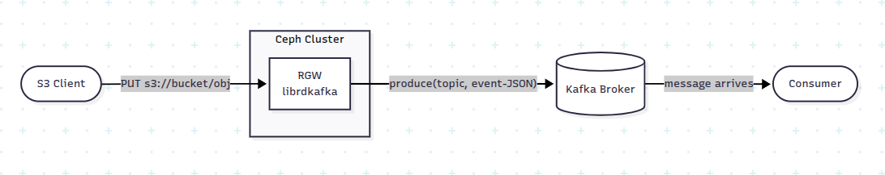
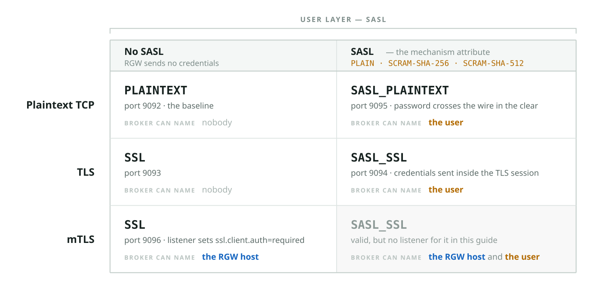
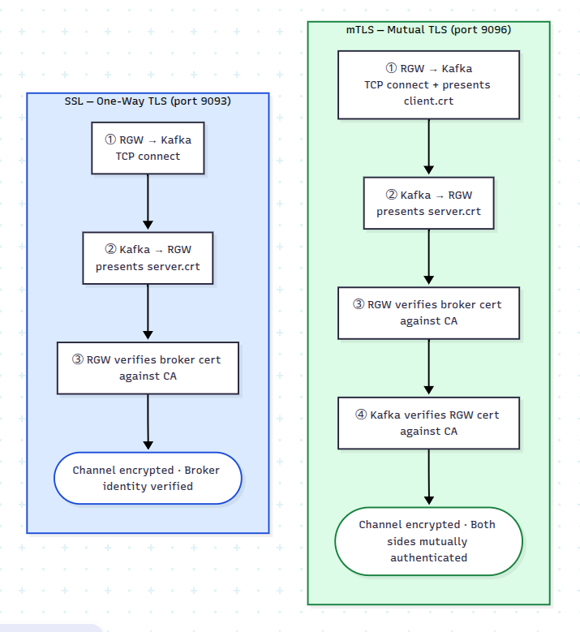

Securing a Kafka connection is not one decision. It is two independent ones, and
most of the confusion around Kafka security comes from treating them as a single
scale.

The first is the **connection** between RGW and the broker: whether it is
encrypted, and which of the two endpoints proves its identity. TLS encrypts the
traffic and authenticates the broker to RGW — RGW verifies the broker's
certificate against a CA. Mutual TLS adds the other direction: RGW presents a
client certificate, so the broker also authenticates the machine at the far end
of the TCP connection. Neither tells the broker _which user_ is publishing.

The second is **user authentication**, and that is SASL's job. `PLAIN` sends a
username and password. `SCRAM-SHA-256` and `SCRAM-SHA-512` prove knowledge of the
same password without putting it on the wire. Part 2 covers `GSSAPI` (Kerberos)
and `OAUTHBEARER` (OIDC), which delegate the same question to a KDC or an OIDC
provider.

The two layers are orthogonal. A SASL mechanism runs over a plaintext connection,
a TLS connection or an mTLS connection without changing; only what carries it
changes. Kafka's protocol names — `PLAINTEXT`, `SSL`, `SASL_PLAINTEXT`, `SASL_SSL`
— are just the combinations. RGW supports all of them, selected entirely through
SNS topic attributes.

This post documents the configuration for each combination. Kafka's own
documentation explains listeners and JAAS; the RGW documentation lists topic
attributes; what follows connects the dots between the two, since a secured
notification pipeline needs both sides configured consistently.

Part 1 covers plaintext connections, TLS, mTLS, and SASL (PLAIN and SCRAM) over
each of them. Part 2 covers GSSAPI (Kerberos) and OAuthBearer.

## How RGW connects to Kafka

The short version: securing the connection is a change to the SNS topic, not to the
bucket. Nothing in the bucket notification configuration changes in any section
below.

Kafka delivery is configured entirely on the SNS topic. `push-endpoint` holds the
broker URL, and every security attribute described below sits alongside it on the same
topic. The bucket refers to that topic by ARN and knows nothing about how RGW reaches
the broker.



Internally RGW uses **librdkafka**, and the security-related SNS topic attributes map
more or less directly onto librdkafka configuration keys. That is why every mechanism
below is expressed as a different set of attributes on `sns create-topic`, and why the
bucket side stays untouched.

The attributes fall into the two groups described above. First, the connection
between RGW and the broker:

| Connection    | Encrypted | Endpoint authentication                             | RGW topic attributes                                           |
| ------------- | --------- | --------------------------------------------------- | -------------------------------------------------------------- |
| Plaintext TCP | No        | None                                                | —                                                              |
| TLS           | Yes       | RGW verifies the broker's certificate               | `use-ssl`, `ca-location`, `verify-ssl`                         |
| mTLS          | Yes       | ...and the broker verifies RGW's client certificate | the above, plus `ssl-certificate-location`, `ssl-key-location` |

Second, the SASL mechanism, which is what tells the broker which _user_ is
publishing:

| SASL mechanism              | What the broker learns                                | RGW topic attributes                 |
| --------------------------- | ----------------------------------------------------- | ------------------------------------ |
| none                        | Nothing — the connection carries no user identity     | —                                    |
| `PLAIN`                     | The user, from a username and password sent as-is     | `user-name`, `password`              |
| `SCRAM-SHA-256`, `-SHA-512` | The same user, proven without sending the password    | `user-name`, `password`, `mechanism` |
| `GSSAPI`, `OAUTHBEARER`     | The same user, via a KDC or an OIDC provider (Part 2) | see Part 2                           |



A broker can expose all of these listeners at once, which is how the automated tests
are configured and a convenient way to work through them. Switching a bucket from one
combination to another then costs one `sns create-topic` call rather than a broker
restart.

## Before you start

The examples assume:

- A running Kafka cluster whose broker configuration you can edit, with the Kafka
  CLI tools (`kafka-topics.sh`, `kafka-console-consumer.sh`, `kafka-configs.sh`) on
  your `PATH`. Substitute `broker.example.com` with your broker's hostname.
- A running Ceph cluster with at least one RGW, and S3 credentials for a user allowed
  to create SNS topics. `$RGW` below is the RGW endpoint, for example
  `export RGW=https://rgw.example.com`.
- For SASL over a plaintext connection only:
  `ceph config set client.rgw rgw_allow_notification_secrets_in_cleartext true`.
  Without it RGW refuses both to accept a topic carrying credentials over a
  non-HTTPS S3 request and to send those credentials over a non-TLS Kafka
  connection. Leave it off in production and put SASL over TLS instead.

### The two calls

Every section below makes the same two API calls, and only the first one changes:

1. **`CreateTopic`** on the SNS endpoint, with the security configuration passed as
   the topic's attribute map. This is where all the work in this post happens.
2. **`PutBucketNotificationConfiguration`** on the S3 endpoint, pointing a bucket at
   the ARN that call returned. This is identical in every section.

Neither is specific to the AWS CLI. In boto3 — which is what the upstream test suite
uses — the pair looks like this:

```python
import boto3

sns = boto3.client(
    "sns",
    endpoint_url=RGW_ENDPOINT,
    aws_access_key_id=ACCESS_KEY,
    aws_secret_access_key=SECRET_KEY,
    region_name="default",
)

topic_arn = sns.create_topic(
    Name="ssl-notifications",
    Attributes={
        "push-endpoint": "kafka://broker.example.com:9093",
        "kafka-ack-level": "broker",
        "use-ssl": "true",
        "ca-location": "/etc/ceph/y-ca.crt",
    },
)["TopicArn"]

s3 = boto3.client(
    "s3",
    endpoint_url=RGW_ENDPOINT,
    aws_access_key_id=ACCESS_KEY,
    aws_secret_access_key=SECRET_KEY,
)

s3.put_bucket_notification_configuration(
    Bucket="ssl-bucket",
    NotificationConfiguration={
        "TopicConfigurations": [
            {
                "Id": "ssl-notif",
                "TopicArn": topic_arn,
                "Events": ["s3:ObjectCreated:*"],
            }
        ]
    },
)
```

The Java and Go SDKs expose the same two calls with the same shape — an attribute
map on `CreateTopic`, then `PutBucketNotificationConfiguration` — and the attribute
names are identical in all of them, because they are RGW's names, not the client's.
Whatever you publish from, the only thing that changes between the sections below is
the contents of that map.

The rest of this post writes that map out with `aws sns create-topic`, because it
puts the attributes on the page in the fewest lines. Read those blocks as the
attribute map, not as a recommendation to shell out.

### Certificates

The TLS sections (TLS, SASL over TLS, mTLS) need three things: a CA certificate, a
server certificate and key for the broker, and — for mTLS — a client certificate and
key for RGW. If you already issue certificates from an internal CA, use those; the
only requirement specific to this setup is that the broker certificate's SAN matches
the hostname or IP address that RGW connects to.

The files referenced below are:

| File                    | Used by | Purpose                                                                        |
| ----------------------- | ------- | ------------------------------------------------------------------------------ |
| `y-ca.crt`              | RGW     | The CA certificate RGW checks the broker's certificate against — `ca-location` |
| `server.keystore.jks`   | Broker  | Broker private key and signed certificate                                      |
| `server.truststore.jks` | Broker  | The CA certificate the broker checks RGW's client certificate against (mTLS)   |
| `client.crt`            | RGW     | Client certificate — `ssl-certificate-location`                                |
| `client.key`            | RGW     | Client private key — `ssl-key-location`                                        |

Here one CA signs both certificates, so `server.truststore.jks` holds the same CA
as `y-ca.crt`; the Kafka CLI examples below reuse it as their truststore for
verifying the broker.

The CA certificate and the client key pair must be readable by the `radosgw` process
on every host running an RGW — `/etc/ceph/` is a reasonable place for them — and the
private key should be no more readable than that, `0600` owned by the RGW user or
`0640` with a shared group. For a
throwaway test environment, the Ceph source tree ships
[`src/test/rgw/bucket_notification/kafka-security.sh`](https://github.com/ceph/ceph/blob/main/src/test/rgw/bucket_notification/kafka-security.sh),
which generates all five files with the password `mypassword`.

### Broker configuration

Enable all five listeners together. In `server.properties`:

```properties
# ── Listeners ───────────────────────────────────────────────────────────────
listeners=PLAINTEXT://broker.example.com:9092,SSL://broker.example.com:9093,SASL_SSL://broker.example.com:9094,SASL_PLAINTEXT://broker.example.com:9095,MTLS://broker.example.com:9096
advertised.listeners=PLAINTEXT://broker.example.com:9092,SSL://broker.example.com:9093,SASL_SSL://broker.example.com:9094,SASL_PLAINTEXT://broker.example.com:9095,MTLS://broker.example.com:9096
listener.security.protocol.map=PLAINTEXT:PLAINTEXT,SSL:SSL,SASL_SSL:SASL_SSL,SASL_PLAINTEXT:SASL_PLAINTEXT,MTLS:SSL

inter.broker.listener.name=PLAINTEXT

# ── SSL, shared by the SSL / SASL_SSL / MTLS listeners ──────────────────────
ssl.keystore.location=/etc/kafka/ssl/server.keystore.jks
ssl.keystore.password=mypassword
ssl.key.password=mypassword
ssl.truststore.location=/etc/kafka/ssl/server.truststore.jks
ssl.truststore.password=mypassword

# SSL listener: plain TLS, client certificate optional
ssl.client.auth=requested

# MTLS listener: client certificate mandatory
listener.name.mtls.ssl.client.auth=required
listener.name.mtls.ssl.keystore.location=/etc/kafka/ssl/server.keystore.jks
listener.name.mtls.ssl.keystore.password=mypassword
listener.name.mtls.ssl.key.password=mypassword
listener.name.mtls.ssl.truststore.location=/etc/kafka/ssl/server.truststore.jks
listener.name.mtls.ssl.truststore.password=mypassword

# ── SASL mechanisms ─────────────────────────────────────────────────────────
sasl.enabled.mechanisms=PLAIN,SCRAM-SHA-256,SCRAM-SHA-512
sasl.mechanism.inter.broker.protocol=PLAIN

listener.name.sasl_ssl.plain.sasl.jaas.config=org.apache.kafka.common.security.plain.PlainLoginModule required \
  username="admin" \
  password="admin-secret" \
  user_alice="alice-secret";

listener.name.sasl_plaintext.plain.sasl.jaas.config=org.apache.kafka.common.security.plain.PlainLoginModule required \
  username="admin" \
  password="admin-secret" \
  user_alice="alice-secret";

# SCRAM users live in Kafka's metadata store, not here — see the SCRAM section
listener.name.sasl_plaintext.scram-sha-256.sasl.jaas.config=org.apache.kafka.common.security.scram.ScramLoginModule required;
listener.name.sasl_plaintext.scram-sha-512.sasl.jaas.config=org.apache.kafka.common.security.scram.ScramLoginModule required;
listener.name.sasl_ssl.scram-sha-256.sasl.jaas.config=org.apache.kafka.common.security.scram.ScramLoginModule required;
listener.name.sasl_ssl.scram-sha-512.sasl.jaas.config=org.apache.kafka.common.security.scram.ScramLoginModule required;
```

> **Note:** `listeners` and `advertised.listeners` must agree. If they disagree the
> broker cannot connect to itself during startup, and the resulting stack trace does
> not obviously point at the cause. On a single host, use the same name in both.

Restart the broker after editing `server.properties`.

## Plaintext: establish a baseline

No authentication, no encryption. The only question this answers is whether an object
upload reaches Kafka at all. Once it does, every mechanism below is an incremental
change to the same pipeline.

Create the Kafka topic:

```bash
kafka-topics.sh \
  --bootstrap-server broker.example.com:9092 \
  --create \
  --topic plaintext-notifications \
  --partitions 1 \
  --replication-factor 1
```

Then create the SNS topic. `push-endpoint` is the broker; `kafka-ack-level` selects
the delivery guarantee (`none`, `leader`, or `broker`). Use `broker` while you are
verifying a configuration — it waits for the in-sync replicas, so a delivery failure
surfaces instead of being silently dropped:

```bash
aws --endpoint-url $RGW sns create-topic \
  --name plaintext-notifications \
  --attributes '{"push-endpoint":"kafka://broker.example.com:9092","kafka-ack-level":"broker"}'
```

```json
{
  "TopicArn": "arn:aws:sns:default::plaintext-notifications"
}
```

An SNS topic on its own does nothing until a bucket points at it:

```bash
aws --endpoint-url $RGW s3 mb s3://test-bucket

aws --endpoint-url $RGW s3api put-bucket-notification-configuration \
  --bucket test-bucket \
  --notification-configuration '{
    "TopicConfigurations": [{
      "Id": "plaintext-notif",
      "TopicArn": "arn:aws:sns:default::plaintext-notifications",
      "Events": ["s3:ObjectCreated:*"]
    }]
  }'
```

Start a consumer in one terminal:

```bash
kafka-console-consumer.sh \
  --bootstrap-server broker.example.com:9092 \
  --topic plaintext-notifications \
  --from-beginning
```

Upload an object in another:

```bash
echo "hello kafka" > /tmp/test.txt
aws --endpoint-url $RGW s3 cp /tmp/test.txt s3://test-bucket/test.txt
```

Within about a second the consumer prints the event:

```json
{
  "Records": [
    {
      "eventName": "ObjectCreated:Put",
      "s3": {
        "bucket": { "name": "test-bucket" },
        "object": { "key": "test.txt" }
      }
    }
  ]
}
```

That is the pipeline end to end, with no security. Everything from here changes only
how RGW connects to the broker.

## SASL/PLAIN over a plaintext connection: identify the user

Kafka now requires a username and password before it accepts anything. What that
adds is a _user_ identity: the broker knows the events were published by `alice`
and can authorize them accordingly. It says nothing about the host RGW runs on,
and nothing about confidentiality — the connection is still plaintext, so both the
password and the events travel in the clear. This belongs on a trusted internal
network, and only there; the same mechanism over TLS is a section further down.

The Kafka CLI needs matching credentials. The broker JAAS configuration above
provides user `alice` with password `alice-secret`:

```bash
cat > /tmp/sasl-client.properties <<'EOF'
security.protocol=SASL_PLAINTEXT
sasl.mechanism=PLAIN
sasl.jaas.config=org.apache.kafka.common.security.plain.PlainLoginModule required \
  username="alice" \
  password="alice-secret";
EOF

kafka-topics.sh \
  --bootstrap-server broker.example.com:9095 \
  --command-config /tmp/sasl-client.properties \
  --create \
  --topic sasl-plaintext-notifications \
  --partitions 1 \
  --replication-factor 1
```

On the RGW side, two new attributes carry the credentials: `user-name` and
`password`. A third, `mechanism`, defaults to `PLAIN` and becomes relevant in the
next section:

```bash
aws --endpoint-url $RGW sns create-topic \
  --name sasl-plaintext-notifications \
  --attributes '{
    "push-endpoint": "kafka://broker.example.com:9095",
    "kafka-ack-level": "broker",
    "user-name": "alice",
    "password": "alice-secret"
  }'
```

Point a bucket at it exactly as in the plaintext section — create
`sasl-bucket` and send the same notification configuration with `TopicArn` set to
`arn:aws:sns:default::sasl-plaintext-notifications`.

Verify the same way, with the client configuration added:

```bash
kafka-console-consumer.sh \
  --bootstrap-server broker.example.com:9095 \
  --consumer.config /tmp/sasl-client.properties \
  --topic sasl-plaintext-notifications \
  --from-beginning

# elsewhere
echo "hello sasl" > /tmp/sasl-test.txt
aws --endpoint-url $RGW s3 cp /tmp/sasl-test.txt s3://sasl-bucket/sasl-test.txt
```

Note what did not change: the bucket notification configuration is identical to the
plaintext section. Only the topic attributes moved. That holds for every remaining
section.

## SCRAM: the same user, without sending the password

PLAIN transmits the password verbatim. SCRAM (Salted Challenge Response
Authentication Mechanism) addresses that specific problem: both sides exchange
salted proofs derived from the password, and the password itself never appears on the
wire. It identifies exactly the same thing PLAIN identifies — the user — and it is
equally indifferent to what carries it, working over a plaintext connection, TLS or
mTLS without change.

The operational difference is where the credentials live. PLAIN users are declared in
the broker's JAAS configuration; SCRAM users are registered in Kafka's metadata store
(ZooKeeper on Kafka 3.x, KRaft on 4.x) with `kafka-configs.sh`, while the broker is
running:

```bash
kafka-configs.sh \
  --bootstrap-server broker.example.com:9092 \
  --entity-type users --entity-name alice --alter \
  --add-config 'SCRAM-SHA-256=[password=alice-secret]'

# Register SHA-512 for the same user too, if you want both
kafka-configs.sh \
  --bootstrap-server broker.example.com:9092 \
  --entity-type users --entity-name alice --alter \
  --add-config 'SCRAM-SHA-512=[password=alice-secret]'
```

Check that it took effect:

```bash
kafka-configs.sh \
  --bootstrap-server broker.example.com:9092 \
  --entity-type users --entity-name alice --describe
```

```output
SCRAM credential configs for user-principal 'alice' are SCRAM-SHA-256=iterations=4096, SCRAM-SHA-512=iterations=4096
```

No broker restart is needed either way. On Kafka 4.x the credentials replicate
through the KRaft metadata log and take effect immediately; on 3.x they are stored in
ZooKeeper and can be registered before or after the broker starts.

The client configuration swaps in the SCRAM login module:

```bash
cat > /tmp/scram-client.properties <<'EOF'
security.protocol=SASL_PLAINTEXT
sasl.mechanism=SCRAM-SHA-256
sasl.jaas.config=org.apache.kafka.common.security.scram.ScramLoginModule required \
  username="alice" \
  password="alice-secret";
EOF

kafka-topics.sh \
  --bootstrap-server broker.example.com:9095 \
  --command-config /tmp/scram-client.properties \
  --create \
  --topic scram-notifications \
  --partitions 1 \
  --replication-factor 1
```

On the RGW side the only change from the PLAIN topic is one attribute:

```bash
aws --endpoint-url $RGW sns create-topic \
  --name scram-notifications \
  --attributes '{
    "push-endpoint": "kafka://broker.example.com:9095",
    "kafka-ack-level": "broker",
    "user-name": "alice",
    "password": "alice-secret",
    "mechanism": "SCRAM-SHA-256"
  }'
```

Attach it to a bucket named `scram-bucket` in the same way.

`mechanism` accepts `SCRAM-SHA-256` or `SCRAM-SHA-512`, and it must match a
credential that has actually been registered — requesting SHA-512 when only SHA-256
was added fails at handshake time.

```bash
kafka-console-consumer.sh \
  --bootstrap-server broker.example.com:9095 \
  --consumer.config /tmp/scram-client.properties \
  --topic scram-notifications \
  --from-beginning

# elsewhere
echo "hello scram" > /tmp/scram-test.txt
aws --endpoint-url $RGW s3 cp /tmp/scram-test.txt s3://scram-bucket/scram-test.txt
```

SCRAM is preferable to PLAIN on any network, and it is indifferent to what carries
it — see the SASL over TLS section below.

## TLS: encrypt the connection and authenticate the broker

Kafka calls this listener `SSL`, and it does two things: it encrypts the traffic
between RGW and the broker, and it authenticates the broker to RGW — the broker
presents its certificate, RGW verifies it against the CA, and the event stream is
no longer readable on the wire.

It is one-way authentication. The broker has proved which server it is; RGW has
proved nothing, neither the host it runs on nor a user. `use-ssl` does not involve
SASL at all, so on this listener the broker accepts events without knowing who
sent them.

Build a TLS client configuration and create the topic:

```bash
cat > /tmp/ssl-client.properties <<'EOF'
security.protocol=SSL
ssl.truststore.location=/etc/kafka/ssl/server.truststore.jks
ssl.truststore.password=mypassword
EOF

kafka-topics.sh \
  --bootstrap-server broker.example.com:9093 \
  --command-config /tmp/ssl-client.properties \
  --create \
  --topic ssl-notifications \
  --partitions 1 \
  --replication-factor 1
```

Three new RGW attributes: `use-ssl` turns TLS on, `ca-location` points at the CA that
signed the broker certificate, and `verify-ssl` — librdkafka's
`enable.ssl.certificate.verification` — controls whether RGW checks that certificate
at all.

```bash
aws --endpoint-url $RGW sns create-topic \
  --name ssl-notifications \
  --attributes '{
    "push-endpoint": "kafka://broker.example.com:9093",
    "kafka-ack-level": "broker",
    "use-ssl": "true",
    "ca-location": "/etc/ceph/y-ca.crt",
    "verify-ssl": "true"
  }'
```

Attach it to a bucket named `ssl-bucket` in the same way.

> **Note:** `verify-ssl: false` exists for development, where the certificate SAN does
> not match the address being connected to. It gives up the authentication half of
> this section: the traffic is still encrypted, but to whoever answers the port,
> which is not the same as encrypted to your broker.

```bash
kafka-console-consumer.sh \
  --bootstrap-server broker.example.com:9093 \
  --consumer.config /tmp/ssl-client.properties \
  --topic ssl-notifications \
  --from-beginning

# elsewhere
echo "hello ssl" > /tmp/ssl-test.txt
aws --endpoint-url $RGW s3 cp /tmp/ssl-test.txt s3://ssl-bucket/ssl-test.txt
```

The RGW log records which security options were applied when the connection was
established, which is the authoritative answer on whether TLS was configured or
silently skipped:

```bash
cephadm logs --name rgw.<id> | grep "Kafka connect:"
```

If nothing appears, raise the log level temporarily with
`ceph config set client.rgw debug_rgw 20` and re-run the upload.

## SASL over TLS: a user identity on an authenticated connection

This is the first section that uses both layers at once, and it is nothing more
than the attributes of the two previous sections together. The connection is
established and the broker authenticated first; the SASL exchange then runs inside
it, unchanged from the plaintext case. Whenever user authentication is
username-and-password based, this is the production choice.

The client configuration is the SSL one plus the SASL lines:

```bash
cat > /tmp/sasl-ssl-client.properties <<'EOF'
security.protocol=SASL_SSL
sasl.mechanism=PLAIN
sasl.jaas.config=org.apache.kafka.common.security.plain.PlainLoginModule required \
  username="alice" \
  password="alice-secret";
ssl.truststore.location=/etc/kafka/ssl/server.truststore.jks
ssl.truststore.password=mypassword
EOF

kafka-topics.sh \
  --bootstrap-server broker.example.com:9094 \
  --command-config /tmp/sasl-ssl-client.properties \
  --create \
  --topic sasl-ssl-notifications \
  --partitions 1 \
  --replication-factor 1
```

The RGW topic is the union of the attributes from the two previous sections:

```bash
aws --endpoint-url $RGW sns create-topic \
  --name sasl-ssl-notifications \
  --attributes '{
    "push-endpoint": "kafka://broker.example.com:9094",
    "kafka-ack-level": "broker",
    "use-ssl": "true",
    "ca-location": "/etc/ceph/y-ca.crt",
    "user-name": "alice",
    "password": "alice-secret",
    "mechanism": "PLAIN"
  }'
```

Attach it to a bucket named `sasl-ssl-bucket` in the same way.

For SCRAM over TLS, change `mechanism` to `SCRAM-SHA-256` and, in the client
properties, swap `sasl.mechanism` and the login module class as in the SCRAM section.
That is the entire difference:

```bash
aws --endpoint-url $RGW sns create-topic \
  --name scram-ssl-notifications \
  --attributes '{
    "push-endpoint": "kafka://broker.example.com:9094",
    "kafka-ack-level": "broker",
    "use-ssl": "true",
    "ca-location": "/etc/ceph/y-ca.crt",
    "user-name": "alice",
    "password": "alice-secret",
    "mechanism": "SCRAM-SHA-256"
  }'
```

Verify as before:

```bash
kafka-console-consumer.sh \
  --bootstrap-server broker.example.com:9094 \
  --consumer.config /tmp/sasl-ssl-client.properties \
  --topic sasl-ssl-notifications \
  --from-beginning

# elsewhere
echo "hello sasl ssl" > /tmp/sasl-ssl-test.txt
aws --endpoint-url $RGW s3 cp /tmp/sasl-ssl-test.txt s3://sasl-ssl-bucket/sasl-ssl-test.txt
```

TLS is established before the SASL exchange, so the credentials themselves are
protected in transit — which is what SASL_PLAINTEXT cannot offer.

## mTLS: let the broker authenticate the RGW host

Mutual TLS fills in the direction one-way TLS leaves open. RGW presents a client
certificate of its own and the broker verifies it against the CA, so both ends of
the TCP connection are now authenticated.

What the broker learns from that is a machine: the certificate says which client
is connecting, not which user is publishing. mTLS is a stronger form of the
connection layer, not a replacement for SASL. A broker that needs both — an
authenticated client host _and_ a named user — runs SASL over the mTLS connection,
which is the SASL_SSL attributes of the previous section plus the two certificate
attributes below.



On the broker, the difference from plain SSL is one line, already present in the
configuration above:

```properties
listener.name.mtls.ssl.client.auth=required
```

Confirm the broker is enforcing that before involving RGW. It takes a couple of
minutes and separates a broker misconfiguration from an RGW one, a distinction that
is harder to make later.

Kafka's Java SSL stack cannot load a separate key file and certificate file, so the
CLI needs them bundled into a keystore:

```bash
openssl pkcs12 -export \
  -in client.crt \
  -inkey client.key \
  -name client \
  -out client.p12 \
  -password pass:mypassword
chmod 600 client.p12

cat > /tmp/mtls-client.properties <<'EOF'
security.protocol=SSL
ssl.truststore.type=JKS
ssl.truststore.location=/etc/kafka/ssl/server.truststore.jks
ssl.truststore.password=mypassword
ssl.keystore.type=PKCS12
ssl.keystore.location=/etc/kafka/ssl/client.p12
ssl.keystore.password=mypassword
ssl.key.password=mypassword
EOF

kafka-topics.sh \
  --bootstrap-server broker.example.com:9096 \
  --command-config /tmp/mtls-client.properties \
  --create \
  --topic mtls-notifications \
  --partitions 1 \
  --replication-factor 1
```

`Created topic mtls-notifications.` means the broker accepted the client
certificate. The `.p12` bundle has now served its purpose and RGW does not use it:
librdkafka reads PEM files directly, which is what `ssl-certificate-location` and
`ssl-key-location` are for.

```bash
aws --endpoint-url $RGW sns create-topic \
  --name mtls-notifications \
  --attributes '{
    "push-endpoint": "kafka://broker.example.com:9096",
    "kafka-ack-level": "broker",
    "use-ssl": "true",
    "ca-location": "/etc/ceph/y-ca.crt",
    "ssl-certificate-location": "/etc/ceph/client.crt",
    "ssl-key-location": "/etc/ceph/client.key"
  }'
```

Attach it to a bucket named `mtls-bucket` in the same way.

If the client key is passphrase-protected, add `"ssl-key-password": "mypassword"`
alongside those. The three attributes map onto librdkafka's
`ssl.certificate.location`, `ssl.key.location`, and `ssl.key.password`.

```bash
kafka-console-consumer.sh \
  --bootstrap-server broker.example.com:9096 \
  --consumer.config /tmp/mtls-client.properties \
  --topic mtls-notifications \
  --from-beginning

# elsewhere
echo "hello mtls" > /tmp/mtls-test.txt
aws --endpoint-url $RGW s3 cp /tmp/mtls-test.txt s3://mtls-bucket/mtls-test.txt
```

With `debug_rgw` at 20, the RGW log lists each option it configured:

```bash
cephadm logs --name rgw.<id> | grep "Kafka connect:"
```

```
Kafka connect: successfully configured SSL security
Kafka connect: successfully configured CA location
Kafka connect: successfully configured client certificate location
Kafka connect: successfully configured client key location
Kafka connect: successfully configured security
```

The two `client ...` lines are the ones that distinguish mTLS from one-way TLS: if
they are missing, RGW connected without a client certificate and the broker either
rejected it or was not requiring one. Both endpoints are now authenticated
cryptographically — and, to say it once more, the broker still has no user identity
for this connection unless SASL is configured alongside.

## When events do not arrive

The most common causes, in rough order of frequency:

- **`listeners` and `advertised.listeners` disagree.** The broker fails during startup
  in a way that does not obviously point at this.
- **The certificate SAN does not match the address being used.** Connecting to
  `localhost` with a certificate issued for `broker.example.com` fails when
  `verify-ssl` is `true`. Correct the certificate rather than disabling the check.
- **`rgw_allow_notification_secrets_in_cleartext` is not set.** Without it RGW
  refuses to create a topic carrying `user-name`/`password` over a non-HTTPS S3
  request, and refuses to use those credentials on a non-TLS Kafka connection. Both
  checks fire in the SASL-over-plaintext sections.
- **The CA certificate or client key has the wrong permissions.** The paths in the
  topic attributes are resolved on the RGW host — inside the RGW container, for a
  cephadm deployment — and opened by the RGW process user, so that user has to be
  able to read them. Go no wider than it needs: a private key at mode `0777` or
  `0644` is readable, but it is also readable by every account on the host, which is
  not a state to leave a production key in. `0600` owned by the RGW user, or `0640`
  with a shared group, is the target.
- **`kafka-ack-level` is `none`.** Delivery failures become invisible. Use `broker`
  while verifying a configuration.

The RGW log is the place to check what RGW actually configured, which is not always
what was intended.

## Summary

Read the two layers separately: the connection columns say what is encrypted and
which machines are authenticated, the user column says whether the broker learns a
user at all.

| Kafka protocol         | Encrypted | Endpoint authentication | User identified by            | RGW topic attributes                                                     |
| ---------------------- | --------- | ----------------------- | ----------------------------- | ------------------------------------------------------------------------ |
| PLAINTEXT              | No        | Neither end             | Nobody                        | `push-endpoint`                                                          |
| SASL_PLAINTEXT (PLAIN) | No        | Neither end             | Password, sent in the clear   | `user-name`, `password`                                                  |
| SASL_PLAINTEXT (SCRAM) | No        | Neither end             | Password proof                | `user-name`, `password`, `mechanism`                                     |
| SSL                    | Yes       | Broker only             | Nobody                        | `use-ssl`, `ca-location`                                                 |
| SASL_SSL (PLAIN)       | Yes       | Broker only             | Password, inside TLS          | `use-ssl`, `ca-location`, `user-name`, `password`, `mechanism`           |
| SASL_SSL (SCRAM)       | Yes       | Broker only             | Password proof                | same, with a SCRAM `mechanism`                                           |
| SSL + mTLS             | Yes       | Broker and RGW host     | Nobody                        | `use-ssl`, `ca-location`, `ssl-certificate-location`, `ssl-key-location` |
| SASL_SSL + mTLS        | Yes       | Broker and RGW host     | Password or proof, inside TLS | all of the above together                                                |

The upstream bucket notification suite in
[`src/test/rgw/bucket_notification/`](https://github.com/ceph/ceph/tree/main/src/test/rgw/bucket_notification)
exercises these against a live broker: the plaintext baseline under the
`kafka_test` marker, and SSL, SSL with certificate verification disabled, mTLS,
SASL_PLAINTEXT and SASL_SSL with PLAIN, SCRAM-SHA-256 and SCRAM-SHA-512 under
`kafka_security_test`. The listeners those tests expect are the ones in the broker
configuration above, generated by `kafka-security.sh` from the same tree.

The last row is the exception: there is no dedicated test for SASL over an mTLS
connection, because it needs no new code path — it is the SASL_SSL path with the
two client-certificate attributes set, and a listener with
`ssl.client.auth=required`.

Part 2 covers GSSAPI (Kerberos) and OAuthBearer, where authentication is delegated to
a KDC or an OIDC provider instead of living in the topic configuration.
