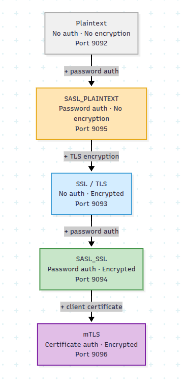

Getting Kafka bucket notifications working over plaintext takes about ten minutes.
Getting them working over TLS, with SASL, against a broker that actually checks who
you are — that took considerably longer, mostly because Kafka security and Ceph
bucket notifications are almost always documented separately. Kafka's docs explain
listeners and JAAS. Ceph's docs list SNS topic attributes. Nobody sits you down and
explains that these are two views of the same connection.

This post is the thing I wanted while adding Kafka security coverage to RGW's
bucket notification test suite. We start with a pipeline that has no security at
all, then add one property at a time — identity, then encryption, then both, then
mutual certificates — without ever rebuilding the pipeline itself.

Part 1 covers plaintext, SASL_PLAINTEXT (PLAIN and SCRAM), SSL, SASL_SSL, and mTLS.
Part 2 picks up with GSSAPI (Kerberos) and OAuthBearer.

## The one thing worth understanding first

Ceph RGW implements the S3 API, and bucket notifications let you push an event to a
message broker whenever an object is created, deleted, or modified. Delivery goes
through the SNS-compatible topic API: you create an SNS topic whose `push-endpoint`
is a Kafka broker URL, wire that topic to a bucket, and RGW publishes a JSON event
every time the configured S3 event fires.


Under the hood RGW uses **librdkafka**, and its SNS topic attributes map more or
less directly onto librdkafka configuration keys. That single fact is why this whole
progression works: securing the connection means changing topic attributes. The
bucket notification configuration never changes. Not once, in any section below.

Here's where we're going, and which port each mechanism uses in this guide:

| Mechanism | Protocol                     | Port | What it adds                           |
| --------- | ---------------------------- | ---- | -------------------------------------- |
| Plaintext | PLAINTEXT                    | 9092 | Nothing — the baseline                 |
| PLAIN     | SASL_PLAINTEXT               | 9095 | Kafka knows who is connecting          |
| SCRAM     | SASL_PLAINTEXT               | 9095 | …without the password on the wire      |
| SSL       | SSL                          | 9093 | The channel is encrypted               |
| SASL_SSL  | SASL_SSL                     | 9094 | Both: credentials inside TLS           |
| mTLS      | SSL + `client.auth=required` | 9096 | Both sides prove identity, no password |



All of these listeners can run on one broker simultaneously, which is how the
automated test suite is configured and how I'd suggest you set it up too. Flipping
between mechanisms then costs you one `aws sns create-topic` call instead of a
broker restart.

## Setting up

Everything below reuses one local Ceph cluster and one Kafka broker. Set the common
pieces up once and leave the broker running.

### Java and Kafka

Kafka is a JVM application, so a JDK comes first.

```bash
# Debian / Ubuntu
sudo apt update && sudo apt install -y default-jdk

# Fedora / RHEL
sudo dnf install -y java-17-openjdk

java -version
```

Then grab Kafka from [kafka.apache.org/downloads](https://kafka.apache.org/downloads).
Kafka 4.x (KRaft, no ZooKeeper) is the one to pick for a new setup; 3.x still works
and I cover both where they differ.

```bash
# Example with Kafka 3.9.0 — substitute the current stable release
KAFKA_VERSION=3.9.0

wget https://archive.apache.org/dist/kafka/${KAFKA_VERSION}/kafka_2.13-${KAFKA_VERSION}.tgz
tar -xzf kafka_2.13-${KAFKA_VERSION}.tgz
export KAFKA_HOME=$PWD/kafka_2.13-${KAFKA_VERSION}
```

### AWS CLI

```bash
# Debian / Ubuntu
sudo apt install -y awscli

# Fedora / RHEL
sudo dnf install -y awscli

# …or, on either: pip3 install --user awscli
```

### A Ceph dev cluster

`install-deps.sh` figures out your distro's package names, so these steps are the
same on Debian/Ubuntu and Fedora/RHEL.

```bash
git clone https://github.com/ceph/ceph.git
cd ceph
git submodule update --init --recursive

./install-deps.sh
./do_cmake.sh

# Only the two targets this guide needs
ninja -C build vstart radosgw
```

If you also want to run the automated tests at the end:

```bash
cd /path/to/ceph/src/test/rgw/bucket_notification
pip3 install -r requirements.txt
```

### Starting vstart

`vstart.sh` brings up a single-node Ceph cluster inside your build directory — no
hardware, no ceremony.

```bash
cd /path/to/ceph/build

MON=1 OSD=1 MDS=0 MGR=0 RGW=1 \
  ../src/vstart.sh -n -d \
  -o "rgw_allow_notification_secrets_in_cleartext=true"
```

That `rgw_allow_notification_secrets_in_cleartext` flag matters for the
SASL_PLAINTEXT sections: RGW refuses to accept topic credentials over a cleartext
connection unless you explicitly say it's fine. It is fine on a dev box. It is not
fine in production, which is rather the point of the rest of this article.

RGW comes up on `http://localhost:8000`, and its log lands in
`build/out/radosgw.8000.log` — you'll want that path handy. `../src/stop.sh` tears
everything back down.

### Pointing the AWS CLI at it

vstart provisions a `testid` user with well-known credentials. Set up a profile once:

```bash
aws configure --profile ceph
# AWS Access Key ID:     0555b35654ad1656d804
# AWS Secret Access Key: h7GhxuBLTrlhVUyxSPUKUV8r/2EI4ngqJxD7iBdBYLhwluN30JaT3Q==
# Default region:        default
# Default output format: json

export AWS_PROFILE=ceph
export RGW=http://localhost:8000

aws --endpoint-url $RGW s3 ls   # should return nothing, and no error
```

### One helper you'll thank yourself for

Every section below creates a bucket and attaches a topic to it, and the JSON is
identical apart from two names. Define this once and the rest of the guide gets a
lot shorter:

```bash
attach_topic() {   # attach_topic <bucket> <topic-name>
  aws --endpoint-url $RGW s3 mb s3://$1
  aws --endpoint-url $RGW s3api put-bucket-notification-configuration \
    --bucket $1 \
    --notification-configuration "{
      \"TopicConfigurations\": [{
        \"Id\": \"$2-notif\",
        \"TopicArn\": \"arn:aws:sns:default::$2\",
        \"Events\": [\"s3:ObjectCreated:*\"]
      }]
    }"
}
```

### Certificates

The TLS sections (SSL, SASL_SSL, mTLS) need a CA, a broker certificate, and a client
certificate. Ceph ships a script that generates the lot:

```bash
cd $KAFKA_HOME

# Use your real broker IP or hostname — the SAN has to match what clients connect to
KAFKA_CERT_HOSTNAME=192.168.1.100 KAFKA_CERT_IP=192.168.1.100 \
  bash /path/to/ceph/src/test/rgw/bucket_notification/kafka-security.sh
```

You get five files, all with the password `mypassword`:

| File                    | Used by | Purpose                                         |
| ----------------------- | ------- | ----------------------------------------------- |
| `y-ca.crt`              | RGW     | CA certificate — the `ca-location` attribute    |
| `server.keystore.jks`   | Broker  | Private key + signed cert                       |
| `server.truststore.jks` | Broker  | Trusts the client CA (needed for mTLS)          |
| `client.key`            | RGW     | Client private key — `ssl-key-location`         |
| `client.crt`            | RGW     | Client certificate — `ssl-certificate-location` |

### Broker configuration

This is the long one, but you only do it once. Edit
`$KAFKA_HOME/config/server.properties` and enable all five listeners together.

```properties
# ── Listeners ───────────────────────────────────────────────────────────────
listeners=PLAINTEXT://192.168.1.100:9092,SSL://192.168.1.100:9093,SASL_SSL://192.168.1.100:9094,SASL_PLAINTEXT://192.168.1.100:9095,MTLS://192.168.1.100:9096
advertised.listeners=PLAINTEXT://192.168.1.100:9092,SSL://192.168.1.100:9093,SASL_SSL://192.168.1.100:9094,SASL_PLAINTEXT://192.168.1.100:9095,MTLS://192.168.1.100:9096
listener.security.protocol.map=PLAINTEXT:PLAINTEXT,SSL:SSL,SASL_SSL:SASL_SSL,SASL_PLAINTEXT:SASL_PLAINTEXT,MTLS:SSL

inter.broker.listener.name=PLAINTEXT

# ── Single-node replication defaults ────────────────────────────────────────
offsets.topic.replication.factor=1
transaction.state.log.replication.factor=1
transaction.state.log.min.isr=1

# ── SSL, shared by the SSL / SASL_SSL / MTLS listeners ──────────────────────
ssl.keystore.location=/path/to/kafka/server.keystore.jks
ssl.keystore.password=mypassword
ssl.key.password=mypassword
ssl.truststore.location=/path/to/kafka/server.truststore.jks
ssl.truststore.password=mypassword

# SSL listener: plain TLS, client cert optional
ssl.client.auth=requested

# MTLS listener: client cert mandatory
listener.name.mtls.ssl.client.auth=required
listener.name.mtls.ssl.keystore.location=/path/to/kafka/server.keystore.jks
listener.name.mtls.ssl.keystore.password=mypassword
listener.name.mtls.ssl.key.password=mypassword
listener.name.mtls.ssl.truststore.location=/path/to/kafka/server.truststore.jks
listener.name.mtls.ssl.truststore.password=mypassword

# ── SASL mechanisms ─────────────────────────────────────────────────────────
sasl.enabled.mechanisms=PLAIN,SCRAM-SHA-256,SCRAM-SHA-512
sasl.mechanism.inter.broker.protocol=PLAIN

listener.name.sasl_ssl.plain.sasl.jaas.config=org.apache.kafka.common.security.plain.PlainLoginModule required \
  username="admin" \
  password="admin-secret" \
  user_alice="alice-secret";

listener.name.sasl_plaintext.plain.sasl.jaas.config=org.apache.kafka.common.security.plain.PlainLoginModule required \
  username="admin" \
  password="admin-secret" \
  user_alice="alice-secret";

# SCRAM users live in Kafka's metadata store, not here — see the SCRAM section
listener.name.sasl_plaintext.scram-sha-256.sasl.jaas.config=org.apache.kafka.common.security.scram.ScramLoginModule required;
listener.name.sasl_plaintext.scram-sha-512.sasl.jaas.config=org.apache.kafka.common.security.scram.ScramLoginModule required;
listener.name.sasl_ssl.scram-sha-256.sasl.jaas.config=org.apache.kafka.common.security.scram.ScramLoginModule required;
listener.name.sasl_ssl.scram-sha-512.sasl.jaas.config=org.apache.kafka.common.security.scram.ScramLoginModule required;
```

> **The mistake everyone makes here:** `listeners` and `advertised.listeners` must
> match exactly. If they disagree, the broker can't connect to itself during
> startup and you'll spend twenty minutes reading a stack trace that doesn't say
> that. Running everything on one machine? Use `localhost` in both — just be
> consistent.

### Starting the broker

**Kafka 4.x (KRaft):**

```bash
# One-time: format the log storage
KAFKA_CLUSTER_ID=$(${KAFKA_HOME}/bin/kafka-storage.sh random-uuid)
${KAFKA_HOME}/bin/kafka-storage.sh format \
  -t $KAFKA_CLUSTER_ID \
  -c ${KAFKA_HOME}/config/server.properties \
  --standalone

${KAFKA_HOME}/bin/kafka-server-start.sh ${KAFKA_HOME}/config/server.properties
```

**Kafka 3.x (ZooKeeper):**

```bash
# Terminal A — wait for "binding to port 0.0.0.0/0.0.0.0:2181"
${KAFKA_HOME}/bin/zookeeper-server-start.sh ${KAFKA_HOME}/config/zookeeper.properties

# Terminal B — wait for "[KafkaServer id=0] started"
${KAFKA_HOME}/bin/kafka-server-start.sh ${KAFKA_HOME}/config/server.properties
```

Shut down in reverse: Kafka first, then ZooKeeper.

## Plaintext: prove the pipeline works

No authentication, no encryption. The only question we're answering is whether an
object upload turns into a Kafka message at all — and once that works, everything
else is an incremental change to the same pipeline.

Create the Kafka topic:

```bash
${KAFKA_HOME}/bin/kafka-topics.sh \
  --bootstrap-server 192.168.1.100:9092 \
  --create \
  --topic plaintext-notifications \
  --partitions 1 \
  --replication-factor 1
```

Then tell RGW where to publish. `push-endpoint` is the broker; `kafka-ack-level`
picks your delivery guarantee (`none`, `leader`, or `broker` — `broker` waits for
all in-sync replicas, which is what you want while debugging, because a silent
failure is much worse than a slow success):

```bash
aws --endpoint-url $RGW sns create-topic \
  --name plaintext-notifications \
  --attributes '{"push-endpoint":"kafka://192.168.1.100:9092","kafka-ack-level":"broker"}'
```

```json
{
  "TopicArn": "arn:aws:sns:default::plaintext-notifications"
}
```

An SNS topic on its own does nothing. It needs a bucket pointed at it:

```bash
attach_topic test-bucket plaintext-notifications
```

Now watch. Consumer in one terminal:

```bash
${KAFKA_HOME}/bin/kafka-console-consumer.sh \
  --bootstrap-server 192.168.1.100:9092 \
  --topic plaintext-notifications \
  --from-beginning
```

Upload in another:

```bash
echo "hello kafka" > /tmp/test.txt
aws --endpoint-url $RGW s3 cp /tmp/test.txt s3://test-bucket/test.txt
```

Within about a second the consumer prints something like this:

```json
{
  "Records": [
    {
      "eventName": "ObjectCreated:Put",
      "s3": {
        "bucket": { "name": "test-bucket" },
        "object": { "key": "test.txt" }
      }
    }
  ]
}
```

That's the whole pipeline, end to end, with zero security. Everything from here on
changes only how RGW connects to the broker.

## SASL_PLAINTEXT: give the broker a name to check

Kafka now wants a username and password before it accepts anything. Worth being
blunt about what this does and doesn't buy you: PLAIN establishes identity and
nothing else. Both the credentials and the events still travel in the clear, so
this belongs on a trusted internal network or inside a VPN — never on its own.

The Kafka CLI needs matching credentials, which the broker JAAS config above
already provides (user `alice`, password `alice-secret`):

```bash
cat > /tmp/sasl-client.properties <<'EOF'
security.protocol=SASL_PLAINTEXT
sasl.mechanism=PLAIN
sasl.jaas.config=org.apache.kafka.common.security.plain.PlainLoginModule required \
  username="alice" \
  password="alice-secret";
EOF

${KAFKA_HOME}/bin/kafka-topics.sh \
  --bootstrap-server 192.168.1.100:9095 \
  --command-config /tmp/sasl-client.properties \
  --create \
  --topic sasl-plaintext-notifications \
  --partitions 1 \
  --replication-factor 1
```

On the RGW side, two new attributes carry the credentials — `user-name` and
`password`. There's a third, `mechanism`, which defaults to `PLAIN` and becomes
interesting in the next section:

```bash
aws --endpoint-url $RGW sns create-topic \
  --name sasl-plaintext-notifications \
  --attributes '{
    "push-endpoint": "kafka://192.168.1.100:9095",
    "kafka-ack-level": "broker",
    "user-name": "alice",
    "password": "alice-secret"
  }'

attach_topic sasl-bucket sasl-plaintext-notifications
```

Verify the same way, with the client config added:

```bash
${KAFKA_HOME}/bin/kafka-console-consumer.sh \
  --bootstrap-server 192.168.1.100:9095 \
  --consumer.config /tmp/sasl-client.properties \
  --topic sasl-plaintext-notifications \
  --from-beginning

# elsewhere
echo "hello sasl" > /tmp/sasl-test.txt
aws --endpoint-url $RGW s3 cp /tmp/sasl-test.txt s3://sasl-bucket/sasl-test.txt
```

Notice what didn't change: the bucket notification configuration is byte-for-byte
what it was in the plaintext section. Only the connection settings moved. This is
the pattern for the rest of the article.

## SCRAM: the same identity, without shipping the password

PLAIN sends the password across the network verbatim, which is unpleasant even on a
network you trust. SCRAM (Salted Challenge Response Authentication Mechanism) fixes
that specific problem: both sides exchange salted proofs derived from the password
and the password itself never appears on the wire. It works over SASL_PLAINTEXT and
SASL_SSL alike, on the same ports as PLAIN.

The operational difference is where the credentials live. PLAIN users are baked into
the broker's JAAS config; SCRAM users are registered in Kafka's metadata store
(ZooKeeper on 3.x, KRaft on 4.x) with `kafka-configs.sh`, while the broker is
running:

```bash
${KAFKA_HOME}/bin/kafka-configs.sh \
  --bootstrap-server 192.168.1.100:9092 \
  --entity-type users --entity-name alice --alter \
  --add-config 'SCRAM-SHA-256=[password=alice-secret]'

# Register SHA-512 for the same user too, if you want both
${KAFKA_HOME}/bin/kafka-configs.sh \
  --bootstrap-server 192.168.1.100:9092 \
  --entity-type users --entity-name alice --alter \
  --add-config 'SCRAM-SHA-512=[password=alice-secret]'
```

Check it took:

```bash
${KAFKA_HOME}/bin/kafka-configs.sh \
  --bootstrap-server 192.168.1.100:9092 \
  --entity-type users --entity-name alice --describe
```

```output
SCRAM credential configs for user-principal 'alice' are SCRAM-SHA-256=iterations=4096, SCRAM-SHA-512=iterations=4096
```

No broker restart is needed either way — on 4.x the credentials replicate through the
KRaft metadata log and take effect immediately; on 3.x they sit in ZooKeeper and can
be registered before or after the broker starts.

The client config swaps in the SCRAM login module:

```bash
cat > /tmp/scram-client.properties <<'EOF'
security.protocol=SASL_PLAINTEXT
sasl.mechanism=SCRAM-SHA-256
sasl.jaas.config=org.apache.kafka.common.security.scram.ScramLoginModule required \
  username="alice" \
  password="alice-secret";
EOF

${KAFKA_HOME}/bin/kafka-topics.sh \
  --bootstrap-server 192.168.1.100:9095 \
  --command-config /tmp/scram-client.properties \
  --create \
  --topic scram-notifications \
  --partitions 1 \
  --replication-factor 1
```

And on the RGW side, the entire change from the PLAIN topic is one attribute:

```bash
aws --endpoint-url $RGW sns create-topic \
  --name scram-notifications \
  --attributes '{
    "push-endpoint": "kafka://192.168.1.100:9095",
    "kafka-ack-level": "broker",
    "user-name": "alice",
    "password": "alice-secret",
    "mechanism": "SCRAM-SHA-256"
  }'

attach_topic scram-bucket scram-notifications
```

`mechanism` accepts `SCRAM-SHA-256` or `SCRAM-SHA-512`, and it has to match a
credential you actually registered — asking for SHA-512 when you only added SHA-256
fails at handshake time.

```bash
${KAFKA_HOME}/bin/kafka-console-consumer.sh \
  --bootstrap-server 192.168.1.100:9095 \
  --consumer.config /tmp/scram-client.properties \
  --topic scram-notifications \
  --from-beginning

# elsewhere
echo "hello scram" > /tmp/scram-test.txt
aws --endpoint-url $RGW s3 cp /tmp/scram-test.txt s3://scram-bucket/scram-test.txt
```

SCRAM is a straight upgrade over PLAIN on any network, and it composes with TLS —
we'll come back to that once encryption is in place.

## SSL: encrypt the channel

Time to change the other variable. SSL encrypts traffic between RGW and the broker:
the broker presents its certificate, RGW verifies it against the CA, and the event
stream stops being readable by anyone watching the wire. Note that this is one-way
TLS — the broker still has no idea who RGW is.

Generate the certificates first if you haven't (see [Certificates](#certificates)
above), then build a TLS client config and create the topic:

```bash
cat > /tmp/ssl-client.properties <<EOF
security.protocol=SSL
ssl.truststore.location=${KAFKA_HOME}/server.truststore.jks
ssl.truststore.password=mypassword
ssl.endpoint.identification.algorithm=
EOF

${KAFKA_HOME}/bin/kafka-topics.sh \
  --bootstrap-server 192.168.1.100:9093 \
  --command-config /tmp/ssl-client.properties \
  --create \
  --topic ssl-notifications \
  --partitions 1 \
  --replication-factor 1
```

Three new RGW attributes: `use-ssl` turns TLS on, `ca-location` points at the CA
that signed the broker cert, and `verify-ssl` controls whether RGW checks the
broker's hostname against the certificate SAN.

```bash
aws --endpoint-url $RGW sns create-topic \
  --name ssl-notifications \
  --attributes '{
    "push-endpoint": "kafka://192.168.1.100:9093",
    "kafka-ack-level": "broker",
    "use-ssl": "true",
    "ca-location": "/path/to/kafka/y-ca.crt",
    "verify-ssl": "true"
  }'

attach_topic ssl-bucket ssl-notifications
```

> `verify-ssl: false` exists for development, when your cert's SAN doesn't match how
> you're connecting. Turning it off in production means you're encrypting traffic to
> whoever answers the port, which is not the same as encrypting traffic to your
> broker.

```bash
${KAFKA_HOME}/bin/kafka-console-consumer.sh \
  --bootstrap-server 192.168.1.100:9093 \
  --consumer.config /tmp/ssl-client.properties \
  --topic ssl-notifications \
  --from-beginning

# elsewhere
echo "hello ssl" > /tmp/ssl-test.txt
aws --endpoint-url $RGW s3 cp /tmp/ssl-test.txt s3://ssl-bucket/ssl-test.txt
```

RGW's log is the authoritative answer on whether TLS was actually configured, as
opposed to silently skipped:

```bash
grep "Kafka connect:.*configured SSL" /path/to/ceph/build/out/radosgw.8000.log
```

## SASL_SSL: both properties at once

Encryption and identity are independent, and now we combine them. The channel is
encrypted first, then credentials go across it — which is the natural production
choice whenever your authentication is username-and-password shaped.

The client config is just the SSL one plus the SASL lines:

```bash
cat > /tmp/sasl-ssl-client.properties <<EOF
security.protocol=SASL_SSL
sasl.mechanism=PLAIN
sasl.jaas.config=org.apache.kafka.common.security.plain.PlainLoginModule required \
  username="alice" \
  password="alice-secret";
ssl.truststore.location=${KAFKA_HOME}/server.truststore.jks
ssl.truststore.password=mypassword
ssl.endpoint.identification.algorithm=
EOF

${KAFKA_HOME}/bin/kafka-topics.sh \
  --bootstrap-server 192.168.1.100:9094 \
  --command-config /tmp/sasl-ssl-client.properties \
  --create \
  --topic sasl-ssl-notifications \
  --partitions 1 \
  --replication-factor 1
```

And the RGW topic is, likewise, the union of the two previous topics' attributes —
nothing new to learn:

```bash
aws --endpoint-url $RGW sns create-topic \
  --name sasl-ssl-notifications \
  --attributes '{
    "push-endpoint": "kafka://192.168.1.100:9094",
    "kafka-ack-level": "broker",
    "use-ssl": "true",
    "ca-location": "/path/to/kafka/y-ca.crt",
    "user-name": "alice",
    "password": "alice-secret",
    "mechanism": "PLAIN"
  }'

attach_topic sasl-ssl-bucket sasl-ssl-notifications
```

Want SCRAM over TLS instead? Change `mechanism` to `SCRAM-SHA-256` and, in the
client properties, swap `sasl.mechanism` and the login module class the same way we
did earlier. That's the entire delta:

```bash
aws --endpoint-url $RGW sns create-topic \
  --name scram-ssl-notifications \
  --attributes '{
    "push-endpoint": "kafka://192.168.1.100:9094",
    "kafka-ack-level": "broker",
    "use-ssl": "true",
    "ca-location": "/path/to/kafka/y-ca.crt",
    "user-name": "alice",
    "password": "alice-secret",
    "mechanism": "SCRAM-SHA-256"
  }'
```

Verification, as ever:

```bash
${KAFKA_HOME}/bin/kafka-console-consumer.sh \
  --bootstrap-server 192.168.1.100:9094 \
  --consumer.config /tmp/sasl-ssl-client.properties \
  --topic sasl-ssl-notifications \
  --from-beginning

# elsewhere
echo "hello sasl ssl" > /tmp/sasl-ssl-test.txt
aws --endpoint-url $RGW s3 cp /tmp/sasl-ssl-test.txt s3://sasl-ssl-bucket/sasl-ssl-test.txt
```

TLS comes up before the SASL exchange, so the credentials themselves are protected
in transit — which is exactly what SASL_PLAINTEXT couldn't offer.

## mTLS: get rid of the password entirely

The last step drops shared secrets altogether. In mutual TLS, RGW presents a client
certificate of its own, the broker verifies it, and identity becomes a property of
the certificate chain rather than a string in your topic configuration.


On the broker, the difference from plain SSL is one line, which is already in the
config above:

```properties
listener.name.mtls.ssl.client.auth=required
```

Before bringing RGW into it, confirm the broker is genuinely enforcing that. This
takes two minutes and cleanly separates "my broker config is wrong" from "my Ceph
config is wrong" — a distinction that is painful to make later.

Kafka's Java SSL stack can't load a separate key file and cert file, so the CLI
needs them bundled into a keystore:

```bash
openssl pkcs12 -export \
  -in ${KAFKA_HOME}/client.crt \
  -inkey ${KAFKA_HOME}/client.key \
  -name client \
  -out ${KAFKA_HOME}/client.p12 \
  -password pass:mypassword
chmod 600 ${KAFKA_HOME}/client.p12

cat > /tmp/mtls-client.properties <<EOF
security.protocol=SSL
ssl.truststore.type=JKS
ssl.truststore.location=${KAFKA_HOME}/server.truststore.jks
ssl.truststore.password=mypassword
ssl.keystore.type=PKCS12
ssl.keystore.location=${KAFKA_HOME}/client.p12
ssl.keystore.password=mypassword
ssl.key.password=mypassword
ssl.endpoint.identification.algorithm=
EOF

${KAFKA_HOME}/bin/kafka-topics.sh \
  --bootstrap-server 192.168.1.100:9096 \
  --command-config /tmp/mtls-client.properties \
  --create \
  --topic mtls-notifications \
  --partitions 1 \
  --replication-factor 1
```

`Created topic mtls-notifications.` means the broker accepted your client
certificate. Good — the `.p12` has now done its entire job and RGW will never touch
it. librdkafka takes PEM files directly, which is what `ssl-certificate-location`
and `ssl-key-location` are for:

```bash
aws --endpoint-url $RGW sns create-topic \
  --name mtls-notifications \
  --attributes '{
    "push-endpoint": "kafka://192.168.1.100:9096",
    "kafka-ack-level": "broker",
    "use-ssl": "true",
    "ca-location": "/path/to/kafka/y-ca.crt",
    "ssl-certificate-location": "/path/to/kafka/client.crt",
    "ssl-key-location": "/path/to/kafka/client.key"
  }'

attach_topic mtls-bucket mtls-notifications
```

If your client key is passphrase-protected, add `"ssl-key-password": "mypassword"`
alongside those. The three attributes map onto librdkafka's
`ssl.certificate.location`, `ssl.key.location`, and `ssl.key.password` respectively —
which, again, is the theme of this entire post.

```bash
${KAFKA_HOME}/bin/kafka-console-consumer.sh \
  --bootstrap-server 192.168.1.100:9096 \
  --consumer.config /tmp/mtls-client.properties \
  --topic mtls-notifications \
  --from-beginning

# elsewhere
echo "hello mtls" > /tmp/mtls-test.txt
aws --endpoint-url $RGW s3 cp /tmp/mtls-test.txt s3://mtls-bucket/mtls-test.txt
```

The RGW log should show every piece of the handshake being configured:

```bash
grep -E "Kafka connect:.*(mTLS|configured security)" /path/to/ceph/build/out/radosgw.8000.log
```

```
Kafka connect: successfully configured SSL security
Kafka connect: successfully configured CA location
Kafka connect: successfully configured client certificate location (mTLS)
Kafka connect: successfully configured client key location (mTLS)
Kafka connect: successfully configured security
```

Both sides have now verified each other cryptographically, and there is no shared
application password anywhere in the system.

## When events don't show up

A few things account for most of the time I lost, in rough order of frequency:

- **`listeners` and `advertised.listeners` disagree.** The broker fails during
  startup in a way that doesn't obviously point at this.
- **The certificate SAN doesn't match how you're connecting.** Connecting to
  `localhost` with a cert issued for `192.168.1.100` fails when `verify-ssl` is
  `true`. Fix the cert, don't disable the check.
- **You forgot `rgw_allow_notification_secrets_in_cleartext`.** RGW refuses topic
  credentials over cleartext without it, so the SASL_PLAINTEXT sections just quietly
  don't work.
- **`kafka-ack-level` is `none`.** Delivery failures become invisible. Use `broker`
  while you're debugging.

When in doubt, `build/out/radosgw.8000.log` tells you what RGW actually configured,
which is often not what you thought you configured.

## Running the test suite

Everything above is covered by the bucket notification tests under the
`kafka_security_test` marker, so you can check the whole ladder in one go:

```bash
# vstart, with the cleartext flag
cd /path/to/ceph/build
MON=1 OSD=1 MDS=0 MGR=0 RGW=1 \
  ../src/vstart.sh -n -d \
  -o "rgw_allow_notification_secrets_in_cleartext=true"

# …generate certs and start Kafka as described above, then:
cd /path/to/ceph
KAFKA_DIR=/path/to/kafka \
BNTESTS_CONF=/path/to/ceph/src/test/rgw/bucket_notification/bntests.conf.SAMPLE \
  python -m pytest -s \
  src/test/rgw/bucket_notification/test_bn.py \
  -v -m 'kafka_security_test'
```

## Picking one

| Mechanism              | Encryption   | Auth           | RGW attributes                                                           |
| ---------------------- | ------------ | -------------- | ------------------------------------------------------------------------ |
| Plaintext              | None         | None           | `push-endpoint`                                                          |
| SASL_PLAINTEXT (PLAIN) | None         | Password       | `user-name`, `password`                                                  |
| SASL_PLAINTEXT (SCRAM) | None         | Password proof | `user-name`, `password`, `mechanism`                                     |
| SSL                    | TLS          | None           | `use-ssl`, `ca-location`                                                 |
| SASL_SSL (PLAIN)       | TLS          | Password       | `use-ssl`, `ca-location`, `user-name`, `password`, `mechanism`           |
| SASL_SSL (SCRAM)       | TLS          | Password proof | same, with a SCRAM `mechanism`                                           |
| mTLS                   | TLS (mutual) | Certificate    | `use-ssl`, `ca-location`, `ssl-certificate-location`, `ssl-key-location` |

Six mechanisms, one pipeline, and a bucket notification configuration that never
changed. That's the useful takeaway: you can start from a known-good plaintext
baseline, confirm events flow, and then move up the ladder one attribute at a time —
so when something breaks, you know exactly which change broke it.

Part 2 continues the progression with GSSAPI (Kerberos) and OAuthBearer, where
authentication stops living in the topic configuration entirely and gets delegated
to a KDC or an OIDC provider instead.
