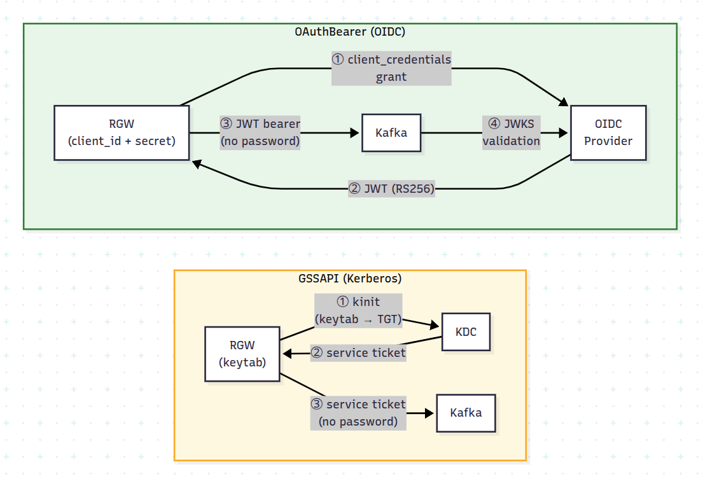
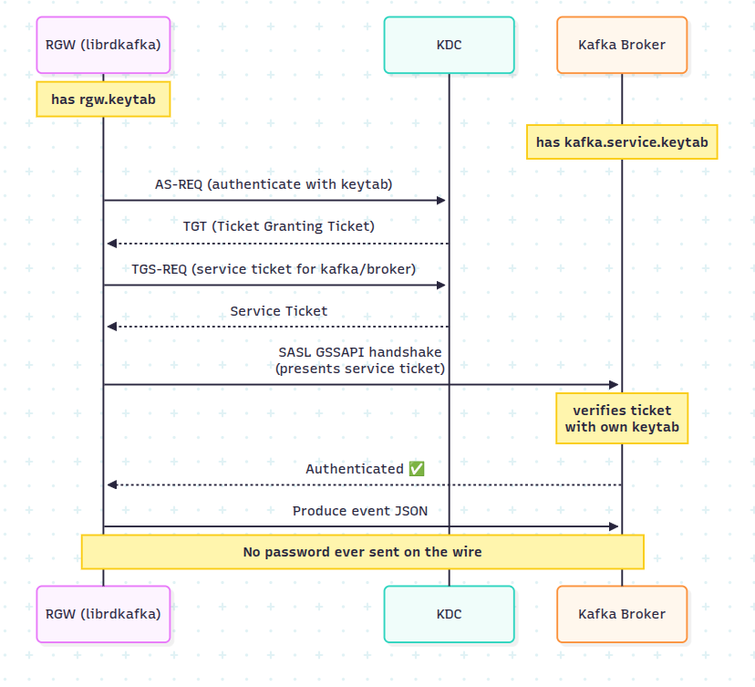
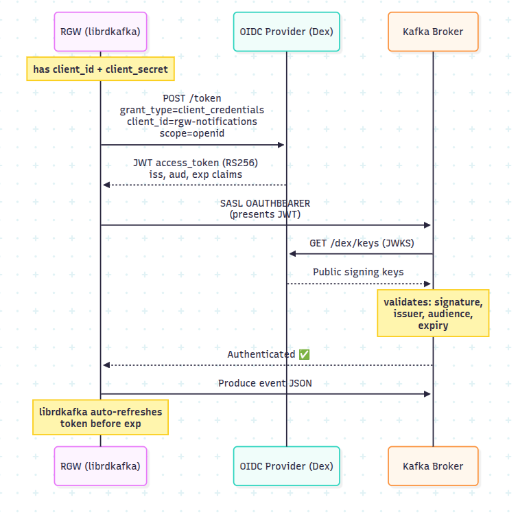

[Part 1](https://ceph.io/en/news/blog/2026/kafka-bucket-notifications-part-1) split
Kafka security into two independent layers: the connection between RGW and the broker
(plaintext, TLS, or mTLS) and SASL, which is what tells the broker _which user_ is
publishing. This post stays entirely in the second layer. Both mechanisms here are
SASL mechanisms, exactly like PLAIN and SCRAM, and they combine with the connection
layer the same way.

What changes is where the credential lives. With PLAIN and SCRAM, the password is an
attribute of the SNS topic and the broker checks it directly. With these two, a third
party vouches for the user instead:

- **GSSAPI** authenticates with a Kerberos ticket issued by a KDC.
- **OAuthBearer** authenticates with a JWT issued by an OIDC provider.

Neither puts a broker password in the topic. GSSAPI puts a keytab path there, so the key
material stays on the RGW host. OAuthBearer puts an OIDC client ID and secret there,
which are credentials for the identity provider, not for the broker; the broker only
ever sees a signed, short-lived token.

## What this post covers

Two SASL mechanisms, each over either of the two connections Part 1 already set up:

| SASL mechanism | Connection    | Kafka protocol | TCP port |
| -------------- | ------------- | -------------- | -------- |
| `GSSAPI`       | plaintext TCP | SASL_PLAINTEXT | 9095     |
| `GSSAPI`       | TLS           | SASL_SSL       | 9094     |
| `OAUTHBEARER`  | plaintext TCP | SASL_PLAINTEXT | 9095     |
| `OAUTHBEARER`  | TLS           | SASL_SSL       | 9094     |

The listener definitions from Part 1 do not change; only the enabled mechanism list
and the per-listener JAAS configuration grow.

> **Note:** the mTLS row from Part 1 has no counterpart here for GSSAPI. RGW's GSSAPI
> path configures the CA and certificate verification for a TLS connection, but does
> not apply `ssl-certificate-location` and `ssl-key-location`, so a GSSAPI topic
> pointed at an mTLS listener will not present a client certificate.

## How RGW connects to Kafka

As in Part 1, RGW uses librdkafka and maps SNS topic attributes onto librdkafka
configuration keys. The difference here is what librdkafka does with them:

- For **GSSAPI**, it performs the Kerberos SASL negotiation using either a keytab or
  the system ticket cache, renewing the ticket as needed.
- For **OAuthBearer**, it runs the OIDC `client_credentials` flow: it fetches a JWT
  from the token endpoint, presents it to the broker during the SASL handshake, and
  refreshes it before expiry.

RGW supplies the configuration (mechanism, keytab path, token endpoint URL) and
takes no further part in the exchange.



The shape of the work is the same as Part 1: `CreateTopic` on the SNS endpoint with
the mechanism's attributes in the topic's attribute map, then
`PutBucketNotificationConfiguration` on the S3 endpoint pointing a bucket at the ARN
it returns. The second call is identical in every section of both posts, and the
attribute names below are RGW's, so they are the same whether you send them from
boto3, a Java or Go SDK, or the CLI. The `aws` blocks below are just the shortest way
to put an attribute map on the page. Part 1 shows the same two calls in boto3.

## GSSAPI (Kerberos)

GSSAPI (Generic Security Services Application Program Interface) is the SASL mechanism
that carries Kerberos authentication. No password crosses the network: RGW proves
knowledge of its key to a Key Distribution Center, and presents the resulting ticket
to the broker. What the broker ends up with is a client principal
(`rgw/broker.example.com@EXAMPLE.COM` below), and that is the SASL user identity, the
same slot `alice` occupied in Part 1. It happens to be a service principal with a
hostname in it, but the broker is naming a Kerberos identity, not verifying a machine
the way mTLS does. It is the usual choice where a Kerberos infrastructure (Active
Directory or MIT Kerberos) already exists.



### What you need in place

Two Kerberos principals, one for the broker and one for RGW, and a keytab for each:

| Principal                        | Used by | Keytab                                   |
| -------------------------------- | ------- | ---------------------------------------- |
| `kafka/broker.example.com@REALM` | Broker  | `/etc/krb5-keytabs/kafka.service.keytab` |
| `rgw/broker.example.com@REALM`   | RGW     | `/etc/krb5-keytabs/rgw.keytab`           |

Throughout this section, substitute `EXAMPLE.COM` with your realm and
`broker.example.com` with the fully qualified hostname of your Kafka broker. The
service principal's hostname must match the hostname clients use to reach the broker.

Where a Kerberos infrastructure already exists, these are the two principals to
request from whoever administers it, along with a keytab for each. With MIT Kerberos
they are created with `kadmin`, or with `kadmin.local` when running on the KDC host
itself:

```bash
kadmin -q "addprinc -randkey kafka/broker.example.com@EXAMPLE.COM"
kadmin -q "addprinc -randkey rgw/broker.example.com@EXAMPLE.COM"

sudo mkdir -p /etc/krb5-keytabs

kadmin -q \
  "ktadd -k /etc/krb5-keytabs/kafka.service.keytab kafka/broker.example.com@EXAMPLE.COM"

kadmin -q \
  "ktadd -k /etc/krb5-keytabs/rgw.keytab rgw/broker.example.com@EXAMPLE.COM"

sudo chmod 640 /etc/krb5-keytabs/*.keytab
```

Set the ownership so that the `radosgw` process user can read `rgw.keytab` and the
broker's user can read `kafka.service.keytab`, and no wider than that. A keytab is
key material; `0640` with the right group, or `0600` owned by the reading user, is the
target. As with the client key in Part 1, the path is resolved on the RGW host, inside
the container where RGW is containerized.

On each host running an RGW, three things are required. First, the GSS-API SASL
module, since librdkafka uses the system Cyrus SASL plugins:
`libsasl2-modules-gssapi-mit` on Debian and Ubuntu, `cyrus-sasl-gssapi` on Fedora and
RHEL. Second, the RGW keytab, readable by the `radosgw` process user. Third,
`/etc/krb5.conf`, declaring the realm and pointing at the KDC:

```ini
[libdefaults]
    default_realm = EXAMPLE.COM
    dns_lookup_realm = false
    dns_lookup_kdc = false
    rdns = false
    forwardable = true
    ticket_lifetime = 24h
    renew_lifetime = 7d

[realms]
    EXAMPLE.COM = {
        kdc = kdc.example.com
        admin_server = kdc.example.com
    }

[domain_realm]
    .example.com = EXAMPLE.COM
    example.com = EXAMPLE.COM
```

> **Note:** where RGW runs in a container under cephadm, `/etc/krb5.conf` and the
> keytab must be visible inside the container. Add them as bind mounts through
> `extra_container_args` in the RGW service specification.

Confirm the keytab works before touching Kafka:

```bash
klist -kte /etc/krb5-keytabs/rgw.keytab
kinit -kt /etc/krb5-keytabs/rgw.keytab rgw/broker.example.com@EXAMPLE.COM
klist          # should show a valid TGT
kdestroy
```

### Setting up a test realm

Skip this if a KDC already exists. To try GSSAPI without one, a single-host Kerberos
realm is enough:

```bash
# Debian / Ubuntu
sudo apt install -y krb5-kdc krb5-admin-server krb5-user
# Fedora / RHEL
sudo dnf install -y krb5-server krb5-workstation

# Creates the realm database; prompts for a master password
sudo kdb5_util create -s -r EXAMPLE.COM

echo '*/admin@EXAMPLE.COM    *' | sudo tee /etc/krb5kdc/kadm5.acl

sudo systemctl enable --now krb5-kdc krb5-admin-server
sudo systemctl status krb5-kdc krb5-admin-server    # both should be active
```

Point `kdc` and `admin_server` in `/etc/krb5.conf` at this host, make sure the
hostnames used resolve, adding them to `/etc/hosts` if there is no DNS record, and
then create the principals and keytabs with `kadmin.local` as above.

### Broker configuration

Create `$KAFKA_HOME/config/kafka_server_jaas.conf`:

```properties
KafkaServer {
    com.sun.security.auth.module.Krb5LoginModule required
    useKeyTab=true
    storeKey=true
    keyTab="/etc/krb5-keytabs/kafka.service.keytab"
    principal="kafka/broker.example.com@EXAMPLE.COM";
};
```

Add GSSAPI to `server.properties`. The listener definitions from Part 1 are unchanged;
only the mechanism list and the per-listener JAAS configuration are new:

```properties
# Add GSSAPI to the enabled mechanisms
sasl.enabled.mechanisms=PLAIN,SCRAM-SHA-256,SCRAM-SHA-512,GSSAPI
sasl.kerberos.service.name=kafka

# SASL_PLAINTEXT listener: GSSAPI
listener.name.sasl_plaintext.gssapi.sasl.jaas.config=\
  com.sun.security.auth.module.Krb5LoginModule required \
  useKeyTab=true \
  storeKey=true \
  keyTab="/etc/krb5-keytabs/kafka.service.keytab" \
  principal="kafka/broker.example.com@EXAMPLE.COM";

# SASL_SSL listener: GSSAPI
listener.name.sasl_ssl.gssapi.sasl.jaas.config=\
  com.sun.security.auth.module.Krb5LoginModule required \
  useKeyTab=true \
  storeKey=true \
  keyTab="/etc/krb5-keytabs/kafka.service.keytab" \
  principal="kafka/broker.example.com@EXAMPLE.COM";
```

> **Note:** `inter.broker.listener.name=PLAINTEXT` from Part 1 stays as it is. GSSAPI
> applies to client-to-broker connections, not inter-broker traffic.

The broker reads the JAAS file from a JVM property, which Kafka takes from
`KAFKA_OPTS`:

```bash
export KAFKA_OPTS="-Djava.security.auth.login.config=${KAFKA_HOME}/config/kafka_server_jaas.conf"

kafka-server-start.sh ${KAFKA_HOME}/config/server.properties
```

`KAFKA_OPTS` must be set in every shell that starts the broker or runs a Kafka CLI
tool against a GSSAPI listener. Without it, the JVM fails with
`Could not find a 'KafkaClient' entry in the JAAS configuration`.

### Check the broker with the Kafka CLI

Verifying with the Java tools first separates a Kerberos or broker problem from an RGW
one. The CLI needs its own JAAS file, using the RGW principal:

```bash
cat > /tmp/client_jaas.conf <<'EOF'
KafkaClient {
    com.sun.security.auth.module.Krb5LoginModule required
    useKeyTab=true
    storeKey=true
    keyTab="/etc/krb5-keytabs/rgw.keytab"
    principal="rgw/broker.example.com@EXAMPLE.COM";
};
EOF

cat > /tmp/gssapi-client.properties <<'EOF'
security.protocol=SASL_PLAINTEXT
sasl.mechanism=GSSAPI
sasl.kerberos.service.name=kafka
EOF

# Client JAAS, separate from the broker's KAFKA_OPTS above
export KAFKA_OPTS="-Djava.security.auth.login.config=/tmp/client_jaas.conf"

kafka-topics.sh \
  --bootstrap-server broker.example.com:9095 \
  --command-config /tmp/gssapi-client.properties \
  --create \
  --topic gssapi-plaintext-notifications \
  --partitions 1 \
  --replication-factor 1
```

`Created topic gssapi-plaintext-notifications.` means the Kerberos handshake
succeeded. That is also the topic the SNS topic below publishes to, so creating it
here saves creating it again.

> **Note:** `TGT renewal thread has been interrupted and will exit` when the tool
> exits is expected. It is the background ticket renewal thread stopping with the
> JVM.

### GSSAPI over SASL_PLAINTEXT

Set the Kerberos service name for RGW. It can be supplied per topic, but setting it
once in the cluster configuration is simpler:

```bash
ceph config set client.rgw rgw_kafka_sasl_kerberos_service_name kafka
```

Create the SNS topic:

```bash
aws --endpoint-url $RGW sns create-topic \
  --name gssapi-plaintext-notifications \
  --attributes '{
    "push-endpoint": "kafka://broker.example.com:9095",
    "kafka-ack-level": "broker",
    "use-ssl": "false",
    "mechanism": "GSSAPI",
    "sasl-kerberos-service-name": "kafka",
    "sasl-kerberos-principal": "rgw/broker.example.com@EXAMPLE.COM",
    "sasl-kerberos-keytab": "/etc/krb5-keytabs/rgw.keytab"
  }'
```

| Attribute                    | Value              | Description                                 |
| ---------------------------- | ------------------ | ------------------------------------------- |
| `mechanism`                  | `GSSAPI`           | Selects SASL/GSSAPI                         |
| `sasl-kerberos-service-name` | `kafka`            | Service component of the broker's principal |
| `sasl-kerberos-principal`    | `rgw/<host>@REALM` | Client principal RGW authenticates as       |
| `sasl-kerberos-keytab`       | path to `.keytab`  | Key material for the client principal       |

> **Note:** `sasl-kerberos-principal` and `sasl-kerberos-keytab` are optional. If both
> are omitted, librdkafka falls back to the system Kerberos ticket cache (the result
> of a previous `kinit`). Supply a keytab in production, so that delivery
> does not depend on an operator having run `kinit` and on that ticket still being
> valid.

> **Note:** `sasl-kerberos-service-name` can also be set per topic, and a per-topic
> value overrides `rgw_kafka_sasl_kerberos_service_name`. Where different tenants
> authenticate as different principals, supply all three attributes per topic: RGW's
> connection cache is keyed on the principal and keytab path, so topics with different
> principals do not share a producer connection.

Attach it to a bucket named `gssapi-bucket`, with the same
`PutBucketNotificationConfiguration` call as every section of Part 1. Only the bucket
name and the `TopicArn` differ.

Then trigger an event and watch for it:

```bash
# Consumer terminal: needs KAFKA_OPTS with the client JAAS file
export KAFKA_OPTS="-Djava.security.auth.login.config=/tmp/client_jaas.conf"
kafka-console-consumer.sh \
  --bootstrap-server broker.example.com:9095 \
  --consumer.config /tmp/gssapi-client.properties \
  --topic gssapi-plaintext-notifications \
  --from-beginning

# elsewhere
echo "hello gssapi" > /tmp/gssapi-test.txt
aws --endpoint-url $RGW s3 cp /tmp/gssapi-test.txt s3://gssapi-bucket/gssapi-test.txt
```

Two logs are worth checking. The RGW log shows which mechanism was configured:

```bash
cephadm logs --name rgw.<id> | grep -E "GSSAPI|kerberos|sasl.mechanism"
```

The broker log shows the principal it authenticated:

```bash
grep "Successfully authenticated" ${KAFKA_HOME}/logs/server.log
# Successfully authenticated client: authenticationID=rgw/broker.example.com@EXAMPLE.COM; mechanism=GSSAPI
```

### GSSAPI over SASL_SSL

This is the configuration to use in production: Kerberos authentication over an
encrypted channel. Relative to the previous section, the push endpoint moves to the
SASL_SSL port and `use-ssl` and `ca-location` are added. The Kerberos attributes are
identical.

The certificates are the ones from Part 1.

```bash
cat > /tmp/gssapi-ssl-client.properties <<'EOF'
security.protocol=SASL_SSL
sasl.mechanism=GSSAPI
sasl.kerberos.service.name=kafka
ssl.truststore.location=/etc/kafka/ssl/server.truststore.jks
ssl.truststore.password=mypassword
EOF

export KAFKA_OPTS="-Djava.security.auth.login.config=/tmp/client_jaas.conf"

kafka-topics.sh \
  --bootstrap-server broker.example.com:9094 \
  --command-config /tmp/gssapi-ssl-client.properties \
  --create \
  --topic gssapi-ssl-notifications \
  --partitions 1 \
  --replication-factor 1
```

```bash
aws --endpoint-url $RGW sns create-topic \
  --name gssapi-ssl-notifications \
  --attributes '{
    "push-endpoint": "kafka://broker.example.com:9094",
    "kafka-ack-level": "broker",
    "use-ssl": "true",
    "ca-location": "/etc/ceph/y-ca.crt",
    "mechanism": "GSSAPI",
    "sasl-kerberos-service-name": "kafka",
    "sasl-kerberos-principal": "rgw/broker.example.com@EXAMPLE.COM",
    "sasl-kerberos-keytab": "/etc/krb5-keytabs/rgw.keytab"
  }'
```

Attach it to a bucket named `gssapi-ssl-bucket` in the same way.

Verify as before, against port 9094:

```bash
export KAFKA_OPTS="-Djava.security.auth.login.config=/tmp/client_jaas.conf"
kafka-console-consumer.sh \
  --bootstrap-server broker.example.com:9094 \
  --consumer.config /tmp/gssapi-ssl-client.properties \
  --topic gssapi-ssl-notifications \
  --from-beginning

# elsewhere
echo "hello gssapi ssl" > /tmp/gssapi-ssl-test.txt
aws --endpoint-url $RGW s3 cp /tmp/gssapi-ssl-test.txt \
  s3://gssapi-ssl-bucket/gssapi-ssl-test.txt
```

## OAuthBearer (OIDC)

OAuthBearer is the SASL mechanism that carries an OAuth 2.0 bearer token. RGW is
configured with an OIDC client identity; librdkafka exchanges it for a JWT at the
identity provider's token endpoint using the `client_credentials` grant, presents that
JWT to the broker, and refreshes it before it expires. The broker validates the
signature against the provider's JWKS endpoint and checks the issuer and audience
claims.



The broker never sees the client secret: it only sees a signed, short-lived token.
The only secret in the topic configuration is the OIDC client secret, which RGW
stores the same way as any other notification secret.

### What you need from your identity provider

- A client registered for the `client_credentials` grant, and its client ID and
  secret.
- The **token endpoint** URL, which RGW is configured with.
- The **JWKS endpoint** URL, plus the expected issuer and audience, which the broker
  is configured with.

All three are published in the provider's discovery document:

```bash
curl -s https://idp.example.com/.well-known/openid-configuration | python3 -m json.tool
```

Any compliant provider works: Keycloak, Entra ID, Auth0. The examples below use
`https://idp.example.com` as the issuer and `rgw-notifications` as the client ID.

### Setting up a test provider

Skip this if you already have an identity provider. For a test environment, Dex is a
single-binary OIDC provider that supports the `client_credentials` grant. Install it
following the [Dex documentation](https://dexidp.io/docs/getting-started/), then
configure it:

```yaml
issuer: http://idp.example.com:5556/dex

storage:
  type: memory

web:
  http: 0.0.0.0:5556

oauth2:
  grantTypes:
    - client_credentials
    - authorization_code
  skipApprovalScreen: true

staticClients:
  - id: rgw-notifications
    secret: client-secret
    name: RGW Notifications
    grantTypes:
      - client_credentials

enablePasswordDB: false

connectors:
  - type: mockCallback
    id: mock
    name: Mock
```

```bash
dex serve /etc/dex/config.yaml
```

> **Note:** the `issuer` value must match the `expected.issuer` configured on the
> broker exactly. A trailing slash, or `http` where the broker expects `https`, causes
> token validation to fail.

Confirm the discovery document reports the issuer, token endpoint, and JWKS URI you
expect:

```bash
curl -s http://idp.example.com:5556/dex/.well-known/openid-configuration \
  | python3 -m json.tool
```

### Broker configuration

Add OAUTHBEARER to the enabled mechanisms and configure the token validator on both
listeners:

```properties
# Add OAUTHBEARER to the enabled mechanisms
sasl.enabled.mechanisms=PLAIN,SCRAM-SHA-256,SCRAM-SHA-512,GSSAPI,OAUTHBEARER

# ── SASL_SSL listener (port 9094) ──────────────────────────────────────────
listener.name.sasl_ssl.oauthbearer.sasl.jaas.config=\
  org.apache.kafka.common.security.oauthbearer.OAuthBearerLoginModule required;
listener.name.sasl_ssl.oauthbearer.sasl.server.callback.handler.class=\
  org.apache.kafka.common.security.oauthbearer.secured.OAuthBearerValidatorCallbackHandler
listener.name.sasl_ssl.oauthbearer.sasl.oauthbearer.jwks.endpoint.url=\
  https://idp.example.com/keys
listener.name.sasl_ssl.oauthbearer.sasl.oauthbearer.expected.audience=\
  rgw-notifications
listener.name.sasl_ssl.oauthbearer.sasl.oauthbearer.expected.issuer=\
  https://idp.example.com

# ── SASL_PLAINTEXT listener (port 9095) ────────────────────────────────────
listener.name.sasl_plaintext.oauthbearer.sasl.jaas.config=\
  org.apache.kafka.common.security.oauthbearer.OAuthBearerLoginModule required;
listener.name.sasl_plaintext.oauthbearer.sasl.server.callback.handler.class=\
  org.apache.kafka.common.security.oauthbearer.secured.OAuthBearerValidatorCallbackHandler
listener.name.sasl_plaintext.oauthbearer.sasl.oauthbearer.jwks.endpoint.url=\
  https://idp.example.com/keys
listener.name.sasl_plaintext.oauthbearer.sasl.oauthbearer.expected.audience=\
  rgw-notifications
listener.name.sasl_plaintext.oauthbearer.sasl.oauthbearer.expected.issuer=\
  https://idp.example.com
```

> **Note:** JWKS-based validation with `OAuthBearerValidatorCallbackHandler` requires
> Kafka 3.1 or later. The broker needs only the server-side validator; no client login
> handler is configured on the broker itself.

Restart the broker and confirm the validator initialized against the right endpoint:

```bash
grep "OAuthBearerValidatorCallbackHandler" ${KAFKA_HOME}/logs/server.log
```

### OAuthBearer over SASL_SSL

Use SASL_SSL for OAuthBearer. The JWT is signed, so it cannot be forged, but it is a
bearer token: anyone who reads it off the wire can use it until it expires. TLS is
what prevents that.

The Kafka CLI can fetch its own token, given the same client credentials:

```bash
cat > /tmp/oauthbearer-ssl-client.properties <<'EOF'
security.protocol=SASL_SSL
sasl.mechanism=OAUTHBEARER
sasl.jaas.config=org.apache.kafka.common.security.oauthbearer.OAuthBearerLoginModule required;
sasl.login.callback.handler.class=org.apache.kafka.common.security.oauthbearer.secured.OAuthBearerLoginCallbackHandler
sasl.oauthbearer.token.endpoint.url=https://idp.example.com/token
sasl.oauthbearer.client.id=rgw-notifications
sasl.oauthbearer.client.secret=client-secret
sasl.oauthbearer.scope=openid
ssl.truststore.location=/etc/kafka/ssl/server.truststore.jks
ssl.truststore.password=mypassword
EOF

kafka-topics.sh \
  --bootstrap-server broker.example.com:9094 \
  --command-config /tmp/oauthbearer-ssl-client.properties \
  --create \
  --topic oauthbearer-ssl-notifications \
  --partitions 1 \
  --replication-factor 1
```

If topic creation fails, request a token directly and inspect its claims. This
distinguishes a provider or client configuration problem from a broker one:

```bash
ACCESS_TOKEN=$(curl -s -X POST https://idp.example.com/token \
  -H "Content-Type: application/x-www-form-urlencoded" \
  -d "grant_type=client_credentials&client_id=rgw-notifications&client_secret=client-secret&scope=openid" \
  | python3 -c "import json,sys; print(json.load(sys.stdin)['access_token'])")

# The iss and aud claims must match expected.issuer and expected.audience
echo "$ACCESS_TOKEN" | cut -d. -f2 | base64 -d 2>/dev/null | python3 -m json.tool
```

The RGW topic carries the OIDC client identity rather than a token, because
librdkafka fetches and refreshes tokens itself:

```bash
aws --endpoint-url $RGW sns create-topic \
  --name oauthbearer-ssl-notifications \
  --attributes '{
    "push-endpoint": "kafka://broker.example.com:9094",
    "kafka-ack-level": "broker",
    "use-ssl": "true",
    "ca-location": "/etc/ceph/y-ca.crt",
    "mechanism": "OAUTHBEARER",
    "sasl-oauthbearer-token-endpoint-url": "https://idp.example.com/token",
    "sasl-oauthbearer-client-id": "rgw-notifications",
    "sasl-oauthbearer-client-secret": "client-secret",
    "sasl-oauthbearer-scope": "openid"
  }'
```

Attach it to a bucket named `oauthbearer-ssl-bucket` in the same way.

| Attribute                             | Value                   | Description                                 |
| ------------------------------------- | ----------------------- | ------------------------------------------- |
| `mechanism`                           | `OAUTHBEARER`           | Selects SASL/OAUTHBEARER                    |
| `use-ssl`                             | `true`                  | Encrypt the channel with TLS                |
| `ca-location`                         | path to the CA cert     | CA used to verify the broker certificate    |
| `sasl-oauthbearer-token-endpoint-url` | OIDC token endpoint     | Where librdkafka requests a JWT             |
| `sasl-oauthbearer-client-id`          | OAuth 2.0 client ID     | Registered with the identity provider       |
| `sasl-oauthbearer-client-secret`      | OAuth 2.0 client secret | Used in the `client_credentials` grant      |
| `sasl-oauthbearer-scope`              | `openid`                | Optional; include if your provider needs it |

Note the spelling: these are RGW topic attributes, hyphenated, not the dotted
librdkafka keys they eventually map onto.

> **Note:** `sasl-oauthbearer-client-secret` is handled as a notification secret. It
> is not written to the RGW log, and submitting it over a cleartext connection to RGW
> requires `rgw_allow_notification_secrets_in_cleartext`, as in Part 1.

Trigger an event:

```bash
kafka-console-consumer.sh \
  --bootstrap-server broker.example.com:9094 \
  --consumer.config /tmp/oauthbearer-ssl-client.properties \
  --topic oauthbearer-ssl-notifications \
  --from-beginning

# elsewhere
echo "hello oauthbearer" > /tmp/oauthbearer-test.txt
aws --endpoint-url $RGW s3 cp /tmp/oauthbearer-test.txt \
  s3://oauthbearer-ssl-bucket/oauthbearer-test.txt
```

The RGW log records the mechanism and the connection:

```bash
cephadm logs --name rgw.<id> | grep -i oauthbearer
```

```
Kafka connect: successfully configured OAUTHBEARER/OIDC
Kafka connect: new connection is created: broker.example.com:9094 ... mechanism=OAUTHBEARER
```

The broker log records the validated principal:

```bash
grep "Successfully validated token" ${KAFKA_HOME}/logs/server.log
# Successfully validated token for principal: rgw-notifications
```

### OAuthBearer over SASL_PLAINTEXT

This sends the JWT to the broker over an unencrypted connection. The
`client_credentials` exchange with the identity provider is unaffected, since that
runs against the provider's own URL, but a token observed in transit on the Kafka
connection can be replayed until it expires. This configuration is for development
only.

It requires the same cluster setting as the SASL_PLAINTEXT sections in Part 1:

```bash
ceph config set client.rgw rgw_allow_notification_secrets_in_cleartext true
```

The topic differs from the SASL_SSL version only in the port and in `use-ssl`:

```bash
aws --endpoint-url $RGW sns create-topic \
  --name oauthbearer-plaintext-notifications \
  --attributes '{
    "push-endpoint": "kafka://broker.example.com:9095",
    "kafka-ack-level": "broker",
    "use-ssl": "false",
    "mechanism": "OAUTHBEARER",
    "sasl-oauthbearer-token-endpoint-url": "https://idp.example.com/token",
    "sasl-oauthbearer-client-id": "rgw-notifications",
    "sasl-oauthbearer-client-secret": "client-secret",
    "sasl-oauthbearer-scope": "openid"
  }'
```

Create the Kafka topic `oauthbearer-plaintext-notifications` against port 9095 first,
then attach the notification and verify delivery as above.

Three points worth remembering:

- RGW's Kafka connection cache is keyed on the Kerberos principal and keytab path, so
  topics that authenticate as different principals do not share a producer connection.
- With OAuthBearer, librdkafka owns the token lifecycle. RGW supplies the client
  identity once, at topic creation; fetching and refreshing tokens needs no further
  involvement from RGW.
- Neither mechanism puts a broker password in the notification path. GSSAPI stores a
  keytab path; OAuthBearer stores an OIDC client secret, which is handled as a
  notification secret and is not logged.

Together with Part 1, that covers the SASL mechanisms RGW offers for bucket
notifications: PLAIN, SCRAM, GSSAPI and OAuthBearer. PLAIN and SCRAM run over any of
the three connections, plaintext, TLS and mTLS. GSSAPI runs over the first two, for
the reason given at the top of this post.

The tests live in
[`src/test/rgw/bucket_notification/`](https://github.com/ceph/ceph/tree/main/src/test/rgw/bucket_notification),
under the `kafka_security_test` marker. `test_notification_kafka_security_sasl_gssapi`
and `test_notification_kafka_security_ssl_sasl_gssapi` cover the two GSSAPI
configurations above; both skip unless the `[kerberos]` section of the test
configuration names a service, principal and keytab, so a run that reports them as
skipped has not exercised GSSAPI at all. The OAuthBearer tests come with the
OAuthBearer support itself and skip in the same way, on an `[oauthbearer]` section.
